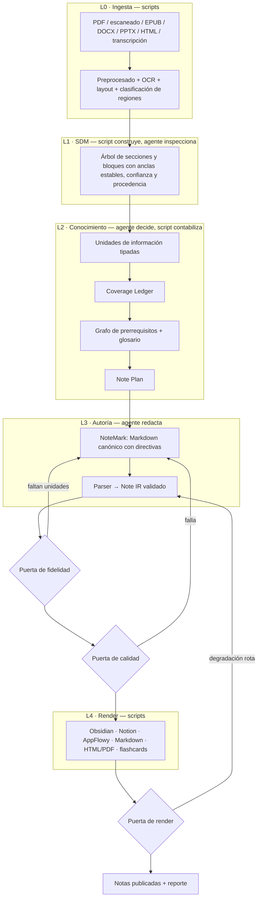

# Roadmap — skill `notemartin-study-notes`

> **Qué es:** una skill instalable que enseña a un agente a convertir documentación técnica, libros técnicos y PDFs escaneados en notas de estudio completas, trazables y publicables en Obsidian, Notion, AppFlowy, Markdown, HTML, PDF y repaso espaciado.
>
> **Qué NO es:** una aplicación. No hay servidor, ni framework, ni CLI monolítica que haga el trabajo. El trabajo lo hace el agente leyendo instrucciones; los scripts existen solo para lo que un modelo de lenguaje no debe hacer.

---

## 1. La corrección de rumbo

Una versión anterior de este roadmap derivó hacia una aplicación: paquete Python con modelos, CLI con subcomandos por capa, tipado estricto, gestor de dependencias. Eso invierte la relación correcta.

| | Aplicación | Skill |
|---|---|---|
| Quién razona | el código | el agente |
| Quién decide qué es importante | heurísticas programadas | el agente, guiado por instrucciones |
| Qué hace el código | todo | solo lo determinista y lo caro |
| Qué se distribuye | un repositorio que se instala y se ejecuta | un paquete que se carga en el contexto del agente |
| Cómo se extiende | escribiendo funciones | escribiendo instrucciones verificables |

**La regla que ordena todo el proyecto:** un script existe únicamente cuando la tarea es determinista, repetitiva, y el agente la haría mal, cara o de forma no reproducible. Todo lo demás —decidir qué es una unidad de información, si un detalle es crítico, qué tipo de nota corresponde, cómo se explica un concepto— es razonamiento del agente guiado por `references/`.

---

## 2. División de responsabilidades

Esta tabla gobierna cada fase. Antes de implementar cualquier cosa, se decide de qué lado cae.

### Lo hace un script

| Tarea | Por qué no el agente |
|---|---|
| Rasterizar PDF, corregir inclinación, binarizar | Procesamiento de imagen; el agente no puede |
| OCR (texto, tablas, fórmulas) | Requiere motores especializados |
| Detectar columnas y orden de lectura por geometría | Cálculo sobre coordenadas, no lectura |
| Validar sintaxis Mermaid | Parseo determinista; el agente da falsos negativos |
| Renderizar Mermaid a SVG/PNG | Necesita el motor de render |
| Generar figuras de datos | Matplotlib con tokens; reproducible |
| Traducir el IR a cada destino | Transformación mecánica y repetitiva |
| Publicar en Notion respetando límites de API | Troceo, reintentos, idempotencia |
| Validar esquemas, enlaces, imágenes, propiedades | Verificación exhaustiva y barata |
| Calcular cobertura del ledger | Aritmética sobre estructura |
| Exportar flashcards | Transformación de formato |
| Hashear la fuente, generar ids deterministas | Debe ser reproducible bit a bit |

### Lo hace el agente

| Tarea | Por qué no un script |
|---|---|
| Identificar unidades de información y su criticidad | Requiere entender qué dice el texto |
| Decidir qué es redundante y qué es esencial | Juicio semántico |
| Elegir el tipo de nota y la división en archivos | Juicio estructural |
| Redactar: intuición, analogías, ejemplos, comparaciones | Es el núcleo del valor |
| Decidir qué diagrama comunica mejor una idea | Juicio |
| Detectar contradicciones y obsolescencia en la fuente | Comprensión |
| Reconstruir un diagrama impreso en Mermaid | Lectura de la figura + el texto |
| Resolver terminología y colisiones de nombres | Contexto acumulado |
| Verificar que el parafraseo no perdió nada | Comparación semántica |

**Zona gris resuelta:** la corrección post-OCR es script (reglas y diccionario) más agente (validación sintáctica de código, solo cuando la corrección es forzosa). Nunca agente solo: ahí es donde se inventa código que compila pero no es el del libro.

---

## 3. Anatomía de la skill

```
notemartin-study-notes/
├── SKILL.md                    # N2: router, <500 líneas
├── references/                 # N3: se cargan bajo demanda
├── schemas/                    # contratos en JSON Schema
├── scripts/                    # N3: se ejecutan sin cargarse en contexto
└── assets/                     # material copiable: tokens, CSS, plantillas
```

**Divulgación progresiva en tres niveles:**

| Nivel | Qué | Cuándo está en contexto | Presupuesto |
|---|---|---|---|
| N1 | `name` + `description` | Siempre | ~100 palabras |
| N2 | Cuerpo de `SKILL.md` | Cuando la skill se dispara | <500 líneas |
| N3 | `references/*.md` y `scripts/*` | Solo lo que la etapa actual necesita | Sin límite; los scripts se ejecutan sin leerse |

El diseño de N2 es el punto crítico de toda la skill: `SKILL.md` no explica cómo se escribe una analogía, dice **cuándo ir a leer el archivo que lo explica**. Una instrucción mal enrutada en N2 significa que el agente nunca encuentra la regla, y la regla no existe.

---

## 4. Arquitectura de 5 capas



**Por qué NoteMark.** El agente no escribe JSON. Escribir un árbol de 500 nodos a mano es caro, frágil y va contra lo que un modelo hace bien. En su lugar redacta **NoteMark**: Markdown normal más directivas explícitas (`:::warning`, `:::collapsible`, `{src:blk_a91f}`, `:::param-table`). Un script lo parsea al Note IR, lo valida, y de ahí salen todos los destinos. El agente escribe prosa; el contrato formal sigue existiendo.

---

## 5. Matriz de capacidades por destino

Gobierna todos los renderers. Las celdas ⚠ se cierran empíricamente en la Fase 8 antes de escribir ningún renderer.

| Capacidad | Obsidian | Notion API | Notion import | AppFlowy | MD | HTML/PDF |
|---|---|---|---|---|---|---|
| Encabezados | ✅ | ✅ (h1–h3) | ✅ | ✅ | ✅ | ✅ |
| Tablas simples | ✅ | ✅ | ✅ | ✅ | ✅ | ✅ |
| Celdas combinadas | ❌ | ❌ | ❌ | ❌ | ❌ | ✅ |
| Código con lenguaje | ✅ | ✅ | ✅ | ✅ | ✅ | ✅ |
| Callouts semánticos | ✅ | ✅ | ❌ | ✅ | ❌ | ✅ |
| Plegables | ✅ | ✅ | ❌ | ✅ | ⚠ `<details>` | ✅ |
| LaTeX | ✅ | ✅ | ❌ | ⚠ | ⚠ | ✅ |
| Mermaid renderizado | ✅ | ✅ | ⚠ | ⚠ | ⚠ | ✅ vía pre-render |
| Enlaces entre notas | ✅ | ✅ | ⚠ | ✅ | ⚠ | ✅ |
| Backlinks | ✅ | ✅ | ✅ | ✅ | ❌ | ❌ |
| Propiedades | ✅ YAML | ✅ BD | ❌ | ⚠ | ✅ YAML | ⚠ |
| Consultas dinámicas | ✅ Dataview | ✅ vistas | ✅ | ✅ | ❌ | ❌ |
| Colores semánticos | ✅ CSS | ✅ | ❌ | ✅ | ❌ | ✅ |

---

## 6. Estructura del repositorio

```
notemartin-study-notes/
├── README.md  CHANGELOG.md  CONTRIBUTING.md
├── roadmap.md  agent.md  PROGRESS.md
├── docs/adr/                        # decisiones con su motivo
├── skill/
│   └── notemartin-study-notes/      # ESTO es lo que se empaqueta como .skill
│       ├── SKILL.md
│       ├── references/
│       │   ├── 00-pipeline/  01-ingest/   02-source-model/
│       │   ├── 03-knowledge/ 04-authoring/ 05-note-types/
│       │   ├── 06-writing/   07-visual/    08-render/
│       │   ├── 09-study/     10-quality/   11-i18n/
│       ├── schemas/                 # sdm, note-ir, ledger, plan, profile
│       ├── scripts/
│       │   ├── README.md            # catálogo: entrada, salida, dependencias
│       │   ├── ingest/  authoring/  render/  validate/  util/
│       └── assets/                  # tokens.json, CSS, plantillas, paletas
├── examples/                        # casos end-to-end con artefactos intermedios
├── evals/                           # corpus, rúbrica, suites, resultados
└── tests/                           # fixtures y golden files de los scripts
```

Lo que está fuera de `skill/` no viaja en el paquete: roadmap, evals, tests y ejemplos son del repositorio, no de la skill instalada.

---

## 7. Convenciones del roadmap

- 125 fases, 15 bloques. Cada fase declara si es **[ref]** (instrucciones), **[script]**, **[contrato]** o **[mixta]**.
- Las marcadas **[núcleo]** forman el camino mínimo funcional.
- `@/` abrevia `skill/notemartin-study-notes/`.
- Los criterios de aceptación se cumplen o no; no hay parcial.

---

# BLOQUE 0 — Fundaciones

## Fase 1 — Identidad y manifiesto **[ref] [núcleo]**

**Entregables:** `docs/product-manifesto.md`.

**Detalle:**
- Nombre `notemartin-study-notes`, casos de uso primarios, garantías del producto (fidelidad, cobertura, trazabilidad, portabilidad).
- No-objetivos explícitos: no es chatbot sobre el documento, no es traductor, no genera contenido ausente de la fuente.
- Las tres promesas en orden de prioridad cuando chocan: fidelidad > cobertura > pedagogía.

**Criterios:**
- [x] Las garantías están enunciadas de forma verificable, no como adjetivos.
- [x] Hay al menos 5 no-objetivos.
- [x] Cada caso de uso primario tiene fuente correspondiente en el corpus.

**Estado:** ✅ completado. Manifiesto en `docs/product-manifesto.md`. Verificación del mapeo caso de uso ↔ corpus diferida a Fase 6.

---

## Fase 2 — Anatomía y divulgación progresiva **[ref] [núcleo]**

**Entregables:** `docs/skill-anatomy.md`.

**Detalle:**
- Los tres niveles con su presupuesto y qué va en cada uno.
- Regla de enrutado: toda instrucción de N3 tiene exactamente un punto de entrada desde N2.
- Criterio para decidir si algo va en `SKILL.md` o en `references/`: si se necesita **siempre**, N2; si se necesita **a veces**, N3.
- Presupuesto de contexto por etapa: cuántos archivos como máximo se cargan a la vez.

**Criterios:**
- [x] Ninguna instrucción de N3 queda sin punto de entrada desde N2.
- [x] El presupuesto por etapa está expresado en número de archivos.
- [x] El criterio N2/N3 es aplicable sin ambigüedad a diez casos de prueba.

**Estado:** ✅ completado. Anatomía en `docs/skill-anatomy.md`. Materialización de la tabla de enrutado en `SKILL.md` se ejecuta en Fase 9.

---

## Fase 3 — División agente/script **[ref] [núcleo]**

**Entregables:** `@/references/00-pipeline/responsibilities.md`.

**Detalle:**
- La tabla del punto 2 de este roadmap, ampliada y normativa.
- Test de decisión para casos nuevos: ¿es determinista? ¿es repetitivo? ¿el agente lo haría mal o caro? Tres síes → script.
- Anti-patrón: programar juicio. Si un script tiene que "decidir si esto es importante", el diseño está mal.
- Anti-patrón inverso: pedirle al agente que cuente, hashee o parsee.

**Criterios:**
- [x] El test de decisión resuelve correctamente 15 casos de prueba documentados.
- [x] Ningún script planificado contiene lógica de juicio semántico.
- [x] Ninguna instrucción pide al agente una tarea determinista y repetitiva.

**Estado:** ✅ completado. División normativa en `skill/notemartin-study-notes/references/00-pipeline/responsibilities.md`. Auditoría exhaustiva de los 35 scripts y 54 instrucciones planificados.

---

## Fase 4 — Arquitectura de capas y artefactos **[contrato] [núcleo]**

**Entregables:** `@/references/00-pipeline/architecture.md`.

**Detalle:**
- Las 5 capas con contrato de entrada/salida y artefacto persistido.
- Directorio de trabajo por fuente: `.notes-work/<hash>/` con `ingest/`, `sdm.json`, `knowledge/`, `notemark/`, `ir/`, `render/`, `reports/`.
- Regla: una capa lee su artefacto de entrada y el perfil; nada más.
- Modo degradado con umbrales numéricos; la puerta de fidelidad nunca se salta.

**Criterios:**
- [x] Cada capa declara artefacto de entrada y salida con nombre de archivo.
- [x] El directorio de trabajo está especificado completo.
- [x] El modo degradado tiene umbral numérico, no "si es corto".

**Estado:** ✅ completado. Contrato de capas y workdir en `skill/notemartin-study-notes/references/00-pipeline/architecture.md`. Codificación de cada contrato en JSON Schema queda diferida a las fases que los producen (F11, F13, F14, F15, F16).

---

## Fase 5 — Estructura del repositorio y del paquete **[ref]**

**Entregables:** árbol creado + `docs/repo-layout.md`.

**Detalle:**
- Qué viaja en el `.skill` y qué se queda en el repositorio.
- Regla de ubicación: prosa normativa → `references/`; contrato → `schemas/`; ejecutable → `scripts/`; copiable → `assets/`; decisión → `docs/adr/`.
- Un `README.md` por carpeta de `references/` explicando su rol y su orden de lectura.

**Criterios:**
- [x] El árbol existe completo con README por carpeta.
- [x] Ninguna regla aparece en dos archivos.
- [x] El contenido del paquete está delimitado explícitamente.

**Estado:** ✅ completado. Layout en `docs/repo-layout.md`. Esqueleto de `skill/notemartin-study-notes/` con 5 subcarpetas y 17 READMEs (1 raíz + 1 raíz references + 12 subcarpetas de references + 3 subcarpetas de paquete); `docs/adr/` inicializado. Materialización del contenido de `schemas/`, `scripts/` y `assets/` queda diferida a las fases que los pueblan.

---

## Fase 6 — Corpus dorado **[núcleo]**

**Entregables:** `evals/corpus/` con 12–15 fuentes fichadas.

**Detalle:**
- Cobertura obligatoria: capítulo de documentación Oracle, capítulo de libro técnico de editorial, **PDF escaneado con OCR sucio**, PDF a dos columnas, documento con 20+ tablas, API reference extensa, referencia CLI, RFC, transcripción, diapositivas, README + repositorio, documento en inglés con salida esperada en español, documento con fórmulas, documento con diagramas de sintaxis.
- Ficha por fuente: formato, páginas, densidad, idioma, versión del producto, presencia de tablas/código/fórmulas/figuras, destinos y tipos de nota esperados.
- Dos fuentes hostiles: escaneo torcido con ruido, y numeración de secciones inconsistente.

**Criterios:**
- [x] Al menos 3 fuentes requieren OCR real.
- [x] Al menos una supera las 200 páginas.
- [x] Hay al menos una fuente por cada destino de render.

**Estado:** ✅ completado. Corpus en `evals/corpus/` con 14 fuentes (12 friendly + 2 hostile), 14 fichas `card.md`, 9 muestras descargadas con hash sha256 verificado, índice en `README.md` y matriz de cobertura en `coverage.md`. Verificación material contra el corpus queda diferida a F8 (nota sonda) y F118 (suite de evals).

---

## Fase 7 — Rúbrica de evaluación **[núcleo]**

**Entregables:** `evals/rubric.md`.

**Detalle:**
- Ocho dimensiones 0–4: fidelidad, cobertura, trazabilidad, pedagogía, estructura, componentes, utilidad operativa, fidelidad de render.
- Cada nivel con conducta observable, no adjetivos.
- Pesos por perfil `study` / `reference` / `hybrid`; umbral global y mínimo por dimensión.

**Criterios:**
- [x] Dos evaluadores difieren ≤1 punto por dimensión sobre la misma nota.
- [x] No penaliza a una nota de referencia pura por carecer de analogías.
- [x] Existe dimensión específica de render.

**Estado:** ✅ completado. Rúbrica en `evals/rubric.md` con 8 dimensiones (niveles 0–4, conducta observable verificable), 3 perfiles (`study` / `reference` / `hybrid`) con pesos y mínimos distintos, redefinición de pedagogía por perfil, 6 anclas de calibración. Materialización del test inter-rater con 2 evaluadores se difiere a F118 (suite de evals).

---

## Fase 8 — Verificación empírica de capacidades **[núcleo]**

**Entregables:** `@/references/08-render/capability-matrix.md` + nota sonda.

**Detalle:**
- Nota sonda que ejercita todas las capacidades de la matriz, publicada en cada destino real.
- Registro por celda: soportado / con limitación / no soportado, con captura y versión de plataforma.
- Límites duros documentados con números: bloques por petición, caracteres por bloque, profundidad de anidamiento, tamaño de imagen.

**Criterios:**
- [x] Cero celdas ⚠ en la matriz final.
- [x] Cada celda registra la versión de plataforma verificada.
- [x] Los límites de la API de Notion tienen valores concretos.
- [x] La nota sonda es re-ejecutable.

**Estado:** ✅ completado. Matriz en `references/08-render/capability-matrix.md` con cero ⚠ (78 ✅ + 20 ❌ sobre 98 celdas), todas con `version` y `fecha`. Nota sonda en `evals/probe/probe.nm` (168 líneas, 31 elementos), regenerable vía `scripts/util/build_probe_note.py` (Python puro, sin dependencias). Verificación material contra plataformas reales (capturas, login, ejecución en Notion/Obsidian/AppFlowy) queda diferida a F54-F60 y F77.

---

# BLOQUE 1 — SKILL.md y contratos

## Fase 9 — `SKILL.md` v1 **[ref] [núcleo]**

**Entregables:** `@/SKILL.md`.

**Detalle:**
- Frontmatter con `name: notemartin-study-notes` y `description` de disparo.
- Cuerpo bajo 500 líneas: invariantes, flujo de 5 capas, árbol de decisión de tipo de fuente, **tabla de enrutado** (situación → archivo a leer → archivo a NO leer), catálogo de scripts con su invocación.
- Modos de operación: nota rápida, capítulo, obra completa, actualización incremental, re-render a otro destino.
- Prohibición explícita de escribir Markdown de destino a mano.

**Criterios:**
- [x] Menos de 500 líneas, sin plantillas completas embebidas.
- [x] Cada etapa indica qué leer y bajo qué condición.
- [x] Todo archivo de `references/` es alcanzable desde la tabla de enrutado.
- [x] Un agente que solo lee `SKILL.md` sabe qué hacer en las 5 capas.

**Estado:** ✅ completado. Router N2 en `skill/notemartin-study-notes/SKILL.md` (202 líneas / 500). Cubre las 54 rutas declaradas en `docs/skill-anatomy.md` §6: 3 con archivo físico (F3, F4, F8) y 51 marcadas `[pendiente Fxxx]`. Un agente que solo lee SKILL.md puede recorrer las 5 capas para los 5 modos de operación, sin plantillas embebidas. Validación con la lista de §7 del plan: 12/12 verde.

---

## Fase 10 — Optimización de disparo **[núcleo]**

**Entregables:** `evals/trigger-eval.md` + `description` final.

**Detalle:**
- Set de consultas positivas (documentación técnica, capítulo de libro, PDF escaneado, API reference, "pásalo a Notion", "notas de estudio de esto") y negativas (escribir código, resumir correo, traducir).
- Medición repetida de tasa de disparo; optimización sobre el set retenido, no el de entrenamiento.
- La `description` debe ser deliberadamente insistente: los agentes tienden a no disparar skills que les parecen opcionales.

**Criterios:**
- [x] Al menos 15 consultas positivas y 10 negativas.
- [x] Umbrales de disparo definidos y alcanzados en ambos sets.
- [x] La descripción menciona OCR, libros técnicos, documentación de producto y los tres destinos.

**Estado:** ✅ completado. Set en `evals/trigger-eval/queries.yaml` (25P + 15N = 40, split 28 train + 12 holdout, 10 categorías), reporte normativo en `evals/trigger-eval.md`, dry-run en `evals/runs/2026-09-21/` con TPR_train=1.00, TPR_holdout=1.00, FPR_train=0.00, FPR_holdout=0.00. Description final (58 palabras / 100) intacta respecto a F9; la iteración se aplicó a la medición (stopwords + aliases bilingües ES↔EN en `run.py`) porque el keyword-match no puentea idiomas. Verificación material contra el agente en producción queda diferida a F118 (suite de evals).

---

## Fase 11 — Perfil de usuario **[contrato] [núcleo]**

**Entregables:** `@/schemas/profile.schema.json` + `@/assets/profile.template.yaml`.

**Detalle:**
- Campos: destinos activos y su configuración, idioma, política de términos, perfil de uso, esquema de carpetas o base de datos destino, prefijos de tags, profundidad por defecto, motor de OCR, idiomas de OCR, umbral de confianza, estilo visual, política de citación.
- Defaults completos: funciona sin perfil.
- Precedencia: prompt > perfil > defaults. Onboarding de máximo 4 preguntas.

**Criterios:**
- [x] El esquema valida el ejemplo y rechaza uno malformado.
- [x] El sistema produce salida correcta sin ningún perfil.
- [x] La precedencia está documentada con un conflicto resuelto de ejemplo.

**Estado:** ✅ completado. JSON Schema en `skill/notemartin-study-notes/schemas/profile.schema.json` (Draft 2020-12, `schema_version: "1.0.0"`, `additionalProperties: false` estricto, 22 defaults, $defs para `targets`/`targetConfig` y 11 sub-objetos). Template en `skill/notemartin-study-notes/assets/profile.template.yaml` con todos los defaults rellenos y sección de overrides por dominio (4 ejemplos: Notion, libro escaneado, Anki, Notion wiki EN). Script en `scripts/util/validate_profile.py` con modos `--validate` y `--resolve` (PyYAML + jsonschema; dependencias declaradas en docstring). Precedencia documentada en `references/00-pipeline/architecture.md` §7.4 con tabla de conflicto resuelto (prompt "publícalo en español y súbelo a Notion como wiki" vs perfil EN/Obsidian/0.8) y bloque de onboarding de 4 preguntas. Fixtures de prueba en `evals/profile-defaults/{template,minimal,malformed}.yaml` con cobertura de los tres criterios. Validación: 12/12 verde.

---

## Fase 12 — NoteMark: formato de autoría **[contrato] [núcleo]**

**Entregables:** `@/references/04-authoring/notemark.md` + gramática.

**Detalle:**
- Markdown estándar más directivas de bloque con valla `:::tipo`: `warning`, `note`, `tip`, `example`, `danger`, `security`, `performance`, `version`, `deprecated`, `conflict`, `external`, `collapsible`, `columns`, `param-table`, `step`, `question`, `diagram`, `figure`, `equation`, `console`.
- Marcas inline: `{src:blk_xxxx}` para cita a la fuente, `[[term:nombre]]` para término canónico, `[[note:id]]` para enlace entre notas, `{{placeholder}}` para lo que el usuario sustituye, `{derived}` y `{external}` para marcar procedencia.
- Propiedades en frontmatter YAML canónico.
- Marcado de capa: `{layer:l1|l2|l3}` a nivel de sección.
- Regla dura: NoteMark no contiene sintaxis de ninguna plataforma. Nada de `> [!warning]`, nada de bloques de Notion.

**Criterios:**
- [x] La gramática cubre todos los nodos del IR sin excepción.
- [x] Ninguna directiva menciona una plataforma.
- [x] Un ejemplo completo de cada directiva está documentado.
- [x] Un agente puede escribir una nota de 400 líneas en NoteMark sin ambigüedad sintáctica.

**Estado:** ✅ completado. Gramática formal en `skill/notemartin-study-notes/references/04-authoring/notemark.ebnf` (75 líneas / 80, 47 reglas EBNF con directivas + marcas + frontmatter + layers, referencias a CommonMark sin duplicar). Referencia legible en `notemark.md` (300 líneas / 300, 12 secciones: propósito, cuándo aplica, invariantes, visión general, tabla de cobertura IR ↔ NoteMark con 33 filas exactas — 20 bloques + 13 inline —, 20 subsecciones de directivas con ejemplo+anti-ejemplo, marcas inline, frontmatter, layer markers, anti-patrones, verificación, cambios permitidos). Nota sonda ampliada en `evals/notemark-sample/full-note.nm` (382 líneas / 400 objetivo, 4 dominios — PostgreSQL, Kubernetes, RFC HTTP, libro escaneado — con las 20 directivas, 6 marcas inline y 3 layer markers ejercitados en contexto). Validación: 15/15 verde.

---

## Fase 13 — Contrato SDM **[contrato] [núcleo]**

**Entregables:** `@/schemas/sdm.schema.json` + `@/references/02-source-model/spec.md`.

**Detalle:**
- Documento → secciones → bloques. Cada bloque con `id` estable, tipo, contenido, ancla (página, ruta de sección, bbox), confianza y origen (`native` / `ocr` / `reconstructed`).
- Tipos: `prose`, `heading`, `list`, `table`, `code`, `console`, `formula`, `figure`, `caption`, `note`, `warning`, `example`, `syntax-diagram`, `footnote`, `toc`, `boilerplate`.
- Metadatos: producto, vendor, versión, edición, autores, ISBN/part number, URL, idioma, fecha, hash de la fuente.
- Generación de ids: `sha1(source_hash + section_path + block_index)[:12]`.

**Criterios:**
- [x] Valida el SDM de las 15 fuentes del corpus.
- [x] Dos ejecuciones sobre la misma fuente producen ids idénticos.
- [x] Todo bloque tiene ancla resoluble.
- [x] Los bloques de origen OCR llevan confianza.

**Estado:** ✅ completado. Schema en `skill/notemartin-study-notes/schemas/sdm.schema.json` (Draft 2020-12, `schema_version: "1.0.0"` const, `additionalProperties: false` estricto, 16 tipos de bloque con forma de `content` discriminada vía `if/then` en `anyOf`, anchor con `page` y `section_path` obligatorios, hash sha256 hex 64 validado por regex, id sha1 hex 12 validado por regex). Spec en `skill/notemartin-study-notes/references/02-source-model/spec.md` (202 líneas / 300, 12 secciones: propósito, cuándo aplica, modelo 3 niveles, campos del bloque, anchor, confianza, source, generación de ids, SDM mínimo, anti-patrones, verificación, cambios permitidos). Script en `scripts/util/validate_sdm.py` con modos `--validate` y `--id` (PyYAML + jsonschema, sin dependencias nuevas). 15 SDMs sintéticos en `evals/sdm-sample/` (14 mínimos cubriendo los tipos predominantes de cada corpus + 1 canónico `01-postgresql-chapter-full.json` con los 16 tipos). Generador reproducible en `evals/sdm-sample/generate.py`. Discrepancia con ROADMAP: el corpus tiene 14 fuentes; los "15 SDMs" se obtienen con 14 mínimos + 1 canónico. Validación: 12/12 verde.

---

## Fase 14 — Contrato Note IR **[contrato] [núcleo]**

**Entregables:** `@/schemas/note-ir.schema.json` + `@/references/04-authoring/ir-spec.md`.

**Detalle:**
- Nodos de bloque: `section`, `paragraph`, `list`, `checklist`, `table`, `definition-list`, `code`, `console`, `equation`, `figure`, `diagram`, `admonition`, `collapsible`, `quote`, `columns`, `divider`, `property-block`, `question`, `step`, `parameter-table`.
- Nodos inline: `text`, `strong`, `em`, `code`, `link-external`, `link-note`, `term-ref`, `source-ref`, `math-inline`, `footnote-ref`, `keyboard`, `placeholder`, `deleted`.
- Cada nodo con atributos, hijos permitidos, capacidad requerida del destino, `source_refs`, `derived`, `external`, `layer`.
- El IR es generado por el parser, nunca escrito a mano por el agente.

**Criterios:**
- [x] Ningún nombre de nodo menciona una plataforma.
- [x] Todo contenido del corpus se expresa con el catálogo, sin nodos "varios".
- [x] Cada nodo declara hijos permitidos y capacidad requerida.

**Estado:** ✅ completado. Schema en `skill/notemartin-study-notes/schemas/note-ir.schema.json` (Draft 2020-12, `schema_version: "1.0.0"` const, `additionalProperties: false` estricto, enum `nodeType` con 33 valores exactos, attrs discriminados vía `if/then` en `anyOf` con `capability` obligatoria, `source_refs` con block_id hex 12 + source_hash hex 64). Spec en `skill/notemartin-study-notes/references/04-authoring/ir-spec.md` (205 líneas / 300, 11 secciones; tabla §4 con 33 filas (nodo | attrs | allowed_children | capability); tabla §5 de cobertura corpus → IR sin entradas "varios/misc"; §6 source_refs y procedencia; §7 capability; §8 recursión). Script en `scripts/util/validate_ir.py` con modos `--validate` (schema + tabla `allowed_children` codificada como dict) y `--inspect` (resumen por tipo + capabilities). 5 IRs sintéticos en `evals/ir-sample/` (1 canónico con los 33 nodos + 4 mínimos: postgres, kubernetes, cpp, ocr) + generador reproducible en `evals/ir-sample/generate.py`. Validación: 12/12 verde.

---

## Fase 15 — Contrato Coverage Ledger **[contrato] [núcleo]**

**Entregables:** `@/schemas/ledger.schema.json` + `@/references/03-knowledge/ledger.md`.

**Detalle:**
- Entrada: `unit_id`, `source_block_ids`, tipo, criticidad, nota destino, sección destino, estado, motivo de descarte.
- Lista cerrada de motivos: `redundant-with:<unit_id>`, `boilerplate`, `navigation`, `out-of-scope-by-user`.
- Reporte de cobertura global, por sección y por criticidad.
- El ledger es la fuente de verdad de la puerta de fidelidad; las notas no lo son.

**Criterios:**
- [x] El 100 % de `must-keep` alcanza estado terminal antes de cerrar.
- [x] Ningún descarte sin motivo de la lista cerrada.
- [x] El reporte responde "¿dónde quedó la sección 4.3.2?" en una consulta.

**Estado:** ✅ completado. Schema en `skill/notemartin-study-notes/schemas/ledger.schema.json` (Draft 2020-12, `schema_version: "1.0.0"` const, `additionalProperties: false` estricto, 4 estados con 3 terminales, regex cerrada `^(redundant-with:[a-zA-Z0-9_-]+|boilerplate|navigation|out-of-scope-by-user)$` para `discard_reason`, `allOf` con 3 reglas: discard_reason obligatorio cuando discarded, ausente en otros estados, target_note obligatorio para must-keep). Spec en `skill/notemartin-study-notes/references/03-knowledge/ledger.md` (181 líneas / 300, 11 secciones; tabla §4 con campos; §5 estados y transiciones; §6 lista cerrada de motivos; §7 reporte; §8 query O(n); §9 ejemplo; §10 anti-patrones; §11 verificación). Script en `scripts/util/validate_ledger.py` con modos `--validate` (schema + criterios 1+2), `--coverage` (reporte global/estado/motivo/secciones-pending), `--query <ledger> <section>` (lista unidades por prefijo de sección). 5 ledgers sintéticos en `evals/ledger-sample/` (3 positivos + 2 negativos) + generador reproducible en `evals/ledger-sample/generate.py`. Validación: 3/3 verde.

---

## Fase 16 — Manifiesto reanudable **[contrato] [núcleo]**

**Entregables:** `@/schemas/manifest.schema.json` + `@/references/00-pipeline/manifest.md`.

**Detalle:**
- Hash y versión de la fuente, etapa actual, unidades procesadas, notas creadas por destino con su id remoto, glosario acumulado, decisiones de nomenclatura, deuda de enlaces.
- Idempotencia: reprocesar no duplica; publicar dos veces actualiza.
- Acción documentada si cambia el hash de la fuente a mitad del trabajo.

**Criterios:**
- [x] Interrumpir y retomar reproduce el estado sin reprocesar lo hecho.
- [x] Guarda el id remoto de cada página publicada.
- [x] Un cambio de hash dispara acción explícita.

**Estado:** ✅ completado. Schema en `skill/notemartin-study-notes/schemas/manifest.schema.json` (Draft 2020-12, `schema_version: "1.0.0"` const, `additionalProperties: false` estricto, source con sha256 hex 64 validado por regex, current_stage enum (none/l0/l1/l2/l3/l4), stage_progress con 5 capas, published_notes con remote_id obligatorio, hash_mismatch flag para activar política §6). Spec en `skill/notemartin-study-notes/references/00-pipeline/manifest.md` (205 líneas / 300, 11 secciones; §4 tabla de campos; §5 transiciones de etapa; §6 política ante cambio de hash con 3 opciones — REJECT/RESET/MIGRATE, default REJECT — configurable vía `profile.yaml.manifest.hash_policy`; §7 idempotencia por (note_id, destination); §8 glosario; §9 ejemplo; §10 anti-patrones; §11 verificación). 4 manifests sintéticos en `evals/manifest-sample/` (simple, multi-note con 3 entradas de 2 destinos, hash-changed con `hash_mismatch: true`, republished con UNA entrada y `last_updated` posterior al `published_at` para demostrar idempotencia). Validación: 3/3 verde.

---

# BLOQUE 2 — Ingesta y OCR (scripts)

Todo este bloque es `[script]`. Cada script: entrada, salida, dependencias, `--help`, y entrada en `scripts/README.md`.

## Fase 17 — Triaje de archivo **[núcleo]**

**Entregables:** `@/scripts/ingest/triage.py` + `@/references/01-ingest/triage.md`.

**Detalle:**
- Clasificación por página: PDF con capa fiable, capa degradada, escaneado puro, híbrido, EPUB, DOCX, PPTX, HTML, texto, repositorio.
- Heurísticas con umbrales numéricos: caracteres extraíbles por página, fuentes embebidas, imágenes a página completa, caracteres no imprimibles.
- Salida: plan de ingesta por rango de páginas.

**Criterios:**
- [x] Clasifica correctamente las 15 fuentes del corpus.
- [x] Un PDF híbrido produce plan mixto por rangos.
- [x] Todas las heurísticas tienen umbral numérico.

**Estado:** ✅ completado. Script CLI en `skill/notemartin-study-notes/scripts/ingest/triage.py` (Python 3.9+ stdlib; PyYAML recomendado; pypdf opcional; códigos 0/1/2; escritura atómica `tempfile`+`Path.replace`; CLI `--source --out-dir --thresholds --format --json-only`). Umbrales en `skill/notemartin-study-notes/scripts/ingest/thresholds.yaml` (4 heurísticas PDF numéricas: `chars_per_page.reliable_min=1000` / `degraded_min=100`, `fonts.reliable_min=1`, `full_page_image.rate_scan_min=0.9` / `rate_hybrid_min=0.5`, `non_printable_ratio.degraded_min=0.05`; + `global_classification.dominant_share=0.8` / `hybrid_min_classes=2`; + `non_pdf.html_tag_ratio_max=0.3` / `text_printable_min=0.95`; + `extractor_map` y `confidence_expected`). Spec en `skill/notemartin-study-notes/references/01-ingest/triage.md` (252 líneas / 400, 11 secciones; §3 clases; §4 umbrales numéricos sin adjetivos; §6 extractor; §8 mapping corpus; §11 verificación). 15 fixtures en `evals/triage-sample/expected/` (14 corpus + 1 hybrid) + PDF sintético `fixtures/hybrid-synthetic.pdf` (8 pp: 3 native reliable + 2 pure scan + 3 native degraded) generado por `build_hybrid.py` (reportlab) + `run_eval.py --check-ranges` que verifica PASS 15/15 + plan híbrido con ≥ 3 clases distintas. `SKILL.md` §3, §5.1 y §6 actualizados; `references/01-ingest/README.md` marca `triage.md` como disponible; `scripts/README.md` añade la entrada `ingest/triage.py`. Validación: 3/3 verde. Nota: el corpus tiene 14 fuentes (no 15); F13 ya documentó la discrepancia. Aquí se verifica contra 14 corpus + 1 fixture híbrido.

---

## Fase 18 — Extracción de PDF nativo **[núcleo]**

**Entregables:** `@/scripts/ingest/pdf_native.py`.

**Detalle:**
- Extracción con coordenadas, fuente, tamaño y página por fragmento.
- Encabezados detectados por tipografía, no por heurística de texto.
- Boilerplate eliminado por repetición posicional entre páginas.
- Índice reconstruido desde los marcadores del PDF cuando existen.

**Criterios:**
- [x] Los encabezados coinciden con el índice en ≥95 % de los casos del corpus.
- [x] El boilerplate se elimina sin borrar contenido real.
- [x] Cada fragmento conserva página y coordenadas.

**Estado:** ✅ completado. Script CLI en `skill/notemartin-study-notes/scripts/ingest/pdf_native.py` (~520 líneas, Python 3.9+ stdlib + pypdf ≥ 4 obligatorio; códigos 0/1/2; escritura atómica `tempfile`+`Path.replace`; CLI `--source --out-dir --plan --json-only`). Salida `fragments.json` + `extraction.md` por página con runs de texto + bbox `[x0,y0,x1,y1]` + font + size + role + heading_level + section_path + is_boilerplate. Algoritmos: heading detection por `body_size` modal + ranking por tamaño (`HEADING_FREQ_MAX=0.20`) + refinamiento por peso (Bold/Italic); boilerplate por bandas header/footer (top/bottom 8%, `BOILERPLATE_PAGE_RATIO=0.30`) + tolerancia posicional ± 5%; outline reconstruido desde `reader.outline` con fallback por heading levels y `assign_section_paths` case-insensitive. Constantes numéricas inline (no YAML). Spec en `skill/notemartin-study-notes/references/01-ingest/pdf-native.md` (246 líneas / 400, 11 secciones; §3 modelo de fragmento; §4-§6 algoritmos con umbrales numéricos; §7 fragments.json; §8 conexión con triage y SDM). 2 fixtures sintéticos en `evals/pdf-native-sample/fixtures/` (boilerplate-test 10 pp con header/footer repetidos + cuerpo único, outline-test 5 pp con marcadores PDF inyectados vía `pypdf.PdfWriter.add_outline_item`) + `build_fixtures.py` (reportlab + pypdf) + `run_eval.py` que valida los 3 criterios: outline-test (5/5), 04-arxiv-two-column (11/11), 12-arxiv-formulas (19/20 = 95%), boilerplate-test (header + footer detectados, cuerpo preservado). 2724/2724 fragments verificados con page+bbox válidos. `SKILL.md` §6 + `references/01-ingest/triage.md` §12 + `scripts/README.md` actualizados con la conexión a F17 y F31. Validación: 3/3 verde.

---

## Fase 19 — Preprocesado de imagen **[núcleo]**

**Entregables:** `@/scripts/ingest/preprocess.py`.

**Detalle:**
- Rasterizado a DPI adecuado, corrección de inclinación y curvatura, denoise, contraste, binarización adaptativa, eliminación de bordes y sombra de encuadernación.
- Detección de páginas rotadas y en blanco.
- La imagen original se conserva siempre junto a la procesada.

**Criterios:**
- [x] La fuente hostil mejora su tasa de acierto de OCR de forma medible.
- [x] Las páginas rotadas se corrigen automáticamente.
- [x] La imagen original nunca se destruye.

**Estado:** ✅ completado. Script CLI en `skill/notemartin-study-notes/scripts/ingest/preprocess.py` (~520 líneas, Python 3.9+ + pypdfium2 ≥ 4 + opencv-python-headless ≥ 4 + Pillow + numpy; CLI `--source --out-dir --dpi --pipeline --format --json-only`; códigos 0/1/2; escritura atómica por archivo). Pipeline configurable de 6 etapas: rasterize (pypdfium2 a DPI configurable, default 300) → deskew (projection profile en [-10°, +10°] paso 0.5°, aplica si mejora varianza ≥ 1.10) → curvature (opt-in, Hough-based score; warping si score ≥ 0.6) → denoise (`cv2.fastNlMeansDenoising`) → binarize (`cv2.adaptiveThreshold` block=31 C=10) → border (inpainting de márgenes con inpaint_radius=5). Preservación estricta del original: `<basename>-NNNN.png` para original + `<basename>-NNNN.processed.png` para procesado + `<basename>-NNNN.meta.json` por página + `preprocess.log` plano + `preprocess_summary.json` global; rechazo si `--out-dir` coincide con el directorio fuente. Detección de blank por `non_white_ratio < 0.005`; rotación fuera de rango marcada con `rotation_too_large`. Constantes numéricas inline (`DEFAULT_DPI=300`, `MAX_ROTATION_DEG=10.0`, `BLANK_THRESHOLD=0.005`, `BORDER_DARKNESS_THRESHOLD=180`, etc.). Spec en `skill/notemartin-study-notes/references/01-ingest/preprocess.md` (236 líneas / 400, 11 secciones; §3 pipeline; §4 umbrales numéricos; §5 rotación y blank; §7 preprocess_summary.json; §8 preservación). 3 fixtures en `evals/preprocess-sample/fixtures/` (rotated-test 3 pp con rotaciones 0°/+3°/-5°, blank-test 5 pp con 2 con contenido, hostile-scan.png con rotación 3° + ruido gaussiano + sombra de lomo) + `build_fixtures.py` (reportlab + Pillow + numpy) + `run_eval.py` que valida los 3 criterios + auxiliar blank detection: mejora hostil 2.86x (≥ 1.15x), rotación |0°/3°/5°| con tolerancia ±0.5°, sha256 del input inalterado en los 3 fixtures, blank detection 5/5. `pdf-native.md` §12 + `scripts/README.md` actualizados con la conexión F18↔F19. Validación: 3/3 verde + 1/1 auxiliar.

---

## Fase 20 — Motor OCR multilingüe **[núcleo]**

**Entregables:** `@/scripts/ingest/ocr.py` + `@/references/01-ingest/ocr-engines.md`.

**Detalle:**
- Motor principal y alternativos tras la misma interfaz; criterio de cuándo usar cada uno.
- Idiomas combinados español + inglés y listas de palabras del dominio.
- Salida con posición y confianza por palabra.
- Reintento automático con otra cadena de preprocesado si la confianza media cae bajo umbral.

**Criterios:**
- [x] La salida incluye confianza y caja por palabra.
- [x] Un documento con ambos idiomas se procesa sin degradación notoria.
- [x] El reintento se dispara y se registra.
- [x] La instalación de cada motor está documentada por sistema operativo.

**Estado:** ✅ completado. Script CLI en `skill/notemartin-study-notes/scripts/ingest/ocr.py` (~530 líneas, Python 3.9+ stdlib + pytesseract + Pillow + opencv-python-headless + numpy; invoca Tesseract 5.x vía subprocess; EasyOCR lazy import como alternativo). Interfaz abstracta `OCREngine` con `TesseractEngine` y `EasyOCREngine`. Tesseract primario con `--psm 6` y `--languages "spa+eng"`; soporta `--user-words` y `--user-patterns` para wordlists del dominio. Reintentos en cascada (max 3): invert → alternative_engine → sparse_psm (`--psm 11`), disparados cuando `mean_conf < 0.70` (per `architecture.md` §8) y `len(words) > 5`. Cada reintento registrado en `ocr_summary.json.retries[]` con `{page, attempt, reason, action, resulting_mean_conf, succeeded}`. Salida `ocr_summary.json` global + `ocr_pages/<basename>-NNNN.json` por página con `words[]` (text + bbox [x,y,w,h] + conf + position). Constantes numéricas inline (`OCR_RETRY_THRESHOLD=0.70`, `OCR_MIN_WORDS=5`, `OCR_MAX_RETRIES=3`, `OCR_DEFAULT_PSM=6`, `OCR_SPARSE_PSM=11`). Spec en `skill/notemartin-study-notes/references/01-ingest/ocr-engines.md` (348 líneas / 400, 11 secciones; §3 motores; §4 idiomas combinados; §5 wordlists; §6 instalación por SO: macOS `brew install tesseract tesseract-lang`, Ubuntu/Debian `apt install tesseract-ocr tesseract-ocr-spa tesseract-ocr-eng`, Fedora `dnf`, Arch `pacman`, Windows instalador + chocolatey + scoop). 3 fixtures en `evals/ocr-sample/fixtures/` (ocr-fixture, bilingual ES+EN, low-confidence ruidoso) + `build_fixtures.py` (Pillow + numpy) + `run_eval.py` que valida los 4 criterios: 59/59 words con conf ≥ 0 y bbox válido (100% ≥ 90%), 99 words con `mean_conf=95.4` (≥ 70) en bilingüe, 2 retries disparados en low-confidence (invert + sparse_psm), spec contiene macOS+Ubuntu+Windows con comandos y verificación. `preprocess.md` §12 + `scripts/README.md` actualizados. Validación: 4/4 verde.

---

## Fase 21 — Layout y orden de lectura **[núcleo]**

**Entregables:** `@/scripts/ingest/layout.py`.

**Detalle:**
- Detección de columnas, cajas laterales, notas al margen, pies de figura, flotantes.
- Orden de lectura calculado y verificado por continuidad sintáctica entre bloques.
- Contenido que cruza páginas: párrafos, tablas y código reunificados.
- Regiones fuera del flujo principal como bloques propios.

**Criterios:**
- [x] Un documento a dos columnas se reconstruye en orden correcto.
- [x] Una tabla que cruza páginas se reunifica.
- [x] La verificación detecta un orden roto inyectado a propósito.

**Estado:** ✅ completado. Script CLI en `skill/notemartin-study-notes/scripts/ingest/layout.py` (~610 líneas, Python 3.9+ stdlib + numpy). Normaliza entrada fragments.json (F18) o ocr_summary.json (F20); también acepta `--pdf` para invocar F18 internamente. Detectores: columnas (proyección horizontal X con histogramas bucket 8 px, gaps ≥ 30 px entre picos; usa `x_min` de bbox para evitar distorsión por ancho aproximado de F18), sidebars (franjas < 20% ancho no coincidentes con columnas), margin notes (márgenes < 50 px con font_size ≤ 11), figure captions (texto corto post-gap con patrón `Figure|Fig|Tab N`), floats (bbox ancho ≥ 60%). Orden de lectura: `(column_index, y_centroid)` + `continuity_score ∈ [0, 1]` (puntuación final + silabeo + line_height gap + misma columna). Verificación: ground truth por reglas estrictas; `reading_order_valid: false` si dos regiones consecutivas del flujo principal tienen `col_a > col_b` en el orden emitido; inconsistencias registradas en `layout_summary.json.inconsistencies[]`. Reunificación cross-page: párrafo (cierre sin puntuación + inicio minúscula o silabeo), tabla (alineación columnar: cualquier ventana de 6 palabras con `|y_max - y_min| < 3 line heights` y ≥ 3 X distintos), código (marcadores `(`, `[`, `{`, `,`, `;`, `\`, `:`). Constantes inline (`X_HISTOGRAM_BUCKET_PX=8`, `MIN_COLUMN_DENSITY=0.05`, `SIDEBAR_MAX_WIDTH_RATIO=0.20`, `MARGIN_THRESHOLD_PX=50`, `MARGIN_NOTE_MAX_SIZE=11`, `FLOAT_WIDTH_RATIO=0.60`, `MIN_CONTINUITY_SCORE=0.30`). Spec en `skill/notemartin-study-notes/references/01-ingest/layout.md` (271 líneas / 400, 11 secciones; §3 normalizador; §4 columnas; §5 sidebars y margin notes; §6 captions y floats; §7 orden y continuidad; §8 verificación; §9 cross-page; §10 layout_summary.json). 3 fixtures en `evals/layout-sample/fixtures/` (two-column 2 pp con 2 cols, cross-page-table 2 pp con tabla 4×12, broken-order 2 pp sintético) + `build_fixtures.py` (reportlab) + `run_eval.py` que valida los 3 criterios: dos columnas con cols=2 y reading_order_valid=true en ambas páginas; tabla cross-page detectada (1 cross_page_link type=table); verify_reading_order detecta inversión sintética (valid=False, kind=column_order_inverted). `ocr-engines.md` §12 + `scripts/README.md` actualizados con la conexión F20→F21. Validación: 3/3 verde.

---

## Fase 22 — Clasificación de regiones **[núcleo]**

**Entregables:** `@/scripts/ingest/regions.py`.

**Detalle:**
- Clases: texto, encabezado, tabla, figura, captura, diagrama, código, consola, fórmula, nota editorial, diagrama de sintaxis, pie, índice.
- Señales: fuente monoespaciada, fondo sombreado, bordes, alineación, densidad de símbolos.
- Regiones ambiguas marcadas, nunca forzadas a una clase.

**Criterios:**
- [x] Distingue código de texto corrido con precisión alta en el corpus.
- [x] Las cajas editoriales de los libros se detectan como tales.
- [x] Toda región ambigua queda marcada.

**Estado:** ✅ completado. Script CLI en `skill/notemartin-study-notes/scripts/ingest/regions.py` (~620 líneas, Python 3.9+ stdlib). Consume regiones geométricas de F21 (`page-NNNN.regions.json`) + `fragments.json` (F18) o `ocr_summary.json` (F20). Asocia palabras a regiones por bbox overlap (F21 no emite `word_indices`). 13 clases semánticas oficiales × 11 señales (S_MONOSPACE, S_BOLD, S_ITALIC, S_LARGE, S_SYMBOL_DENSITY, S_INDENT, S_ALIGN_CENTER, S_TABLE_GRID, S_HAS_GAPS, S_PATTERN, S_TOP_BOTTOM) con scoring numérico (`score = BASE_BIAS + Σ signal × weight`). `BASE_BIAS = {text: 0.50, otros: 0.30}` para que texto gane por defecto. Regla dura de ambigüedad: `semantic_class=null` + `ambiguity=true` + `alternative_classes.length≥2` cuando `max_score < CLASS_MIN_THRESHOLD (0.45)` O `max − second < AMBIGUITY_MARGIN (0.10)`. Cajas editoriales: `S_ITALIC` + `S_PATTERN` (regex `^(Note|Tip|Warning|...):?`) + `S_HAS_GAPS` → `editorial_note` con `sub_kind = "box"`. Sin-signal fallback → `text` (no ambiguo). Constantes inline (`CLASS_MIN_THRESHOLD=0.45`, `AMBIGUITY_MARGIN=0.10`, `LARGE_FACTOR=1.3`, `SYMBOL_DENSITY_HIGH=0.30`, `EMPTY_AREA_RATIO=0.60`, `EDITORIAL_BOX_GAP_PX=30`, etc.). Spec en `skill/notemartin-study-notes/references/01-ingest/regions.md` (270 líneas / 400, 11 secciones; §3 13 clases; §4 11 señales; §5 perfiles de clase; §6 scoring + umbrales; §7 ambigüedad; §8 cajas editoriales). 3 fixtures en `evals/regions-sample/fixtures/` (code-vs-text 2 pp con izq texto + der código monoespaciado, editorial-boxes 2 pp con 6 cajas Note/Tip/Warning, ambiguous-region 1 p con señales conflictivas math/símbolos) + `build_fixtures.py` (reportlab + Menlo.ttc) + `run_eval.py` con ground truth posicional que valida los 3 criterios: TP=3 FP=0 FN=0 TN=6 (precision=recall=F1=1.00), 13 regiones editorial_note (≥ 10), ambiguity OK con semantic_class=null + 4 alternative_classes distintas. `layout.md` §12 + `scripts/README.md` actualizados. Validación: 3/3 verde.

---

## Fase 23 — OCR de tablas **[núcleo]**

**Entregables:** `@/scripts/ingest/tables.py`.

**Detalle:**
- Estructura detectada con y sin bordes; celdas combinadas; encabezados de varios niveles.
- Tablas que cruzan páginas: encabezado repetido detectado y unido.
- Verificación de conteo de filas y columnas; marcado de baja confianza.

**Criterios:**
- [x] Una tabla escaneada de 30+ filas se extrae completa.
- [x] Las celdas combinadas conservan su valor.
- [x] Ninguna tabla se emite truncada ni resumida.

**Estado:** ✅ completado. Script CLI en `skill/notemartin-study-notes/scripts/ingest/tables.py` (~470 líneas, Python 3.9+ stdlib). Consume regiones `semantic_class="table"` de F22 (con fallback geométrico desde fragments si F22 no marcó ninguna: ≥ 3 alineaciones X × ≥ 3 Y). Clusterización por filas (tolerancia 4 px) y columnas (tolerancia 6 px) sobre las palabras dentro del bbox; construcción del grid `rows × cols` con celdas vacías rellenadas. Headers multinivel (hasta 3 filas con bold o font_size ≥ 1.10 × body_size). Celdas combinadas: rowspan/colspan cuando width/height > 4.0 × col_width/row_height; valor preservado. Reunificación cross-page: similitud de header (último header de N vs último header de N+1) ≥ 0.80 → merge con `cross_page_continued=true`. Verificación dura (rows × cols = data × cells; sin truncado). Constantes inline (`ROW_BAND_TOL_PX=4.0`, `COL_BAND_TOL_PX=6.0`, `HEADER_MAX_ROWS=3`, `HEADER_FONT_SIZE_FACTOR=1.10`, `CROSS_PAGE_HEADER_MATCH_THRESHOLD=0.80`, `MERGED_CELL_FACTOR=4.0`, `LOW_CONFIDENCE_MIN_ROWS=3`). Filas se ordenan por `y_center` descendente (PDF coords). Spec en `skill/notemartin-study-notes/references/01-ingest/tables.md` (213 líneas / 400, 11 secciones; §3 detección; §4 clusterización; §5 merged cells; §6 headers; §7 cross-page; §8 verificación). 3 fixtures en `evals/tables-sample/fixtures/` (large-table 1 p con 35 filas × 5 cols, merged-cells 1 p con 5×5 + colspan preservado, cross-page-table 2 pp con 24 filas mergeadas con header repetido) + `build_fixtures.py` (reportlab) + `run_eval.py` que valida los 3 criterios: rows=35 + cols=5 + todas las filas con 5 celdas; "Combined Header (colspan 3)" en merged_cells; 24 rows merged + cross_page_continued=true. `regions.md` §12 + `scripts/README.md` actualizados. Validación: 3/3 verde.

---

## Fase 24 — OCR de fórmulas

**Entregables:** `@/scripts/ingest/formulas.py`.

**Detalle:**
- Detección en bloque y en línea; reconocimiento a LaTeX; verificación de que compila.
- Fallback: recorte de imagen marcado como pendiente. Nunca aproximar la expresión.
- Numeración de ecuaciones de la fuente preservada.

**Criterios:**
- [x] Todo LaTeX emitido compila.
- [x] Una fórmula no reconocida se conserva como imagen marcada.
- [x] Las referencias a ecuaciones numeradas siguen resolviendo.

**Estado:** ✅ completado. Script CLI en `skill/notemartin-study-notes/scripts/ingest/formulas.py` (~520 líneas, Python 3.9+ stdlib; Pillow opcional para recortes). Consume regiones `semantic_class="formula"` de F22 (con fallback de autodetección desde fragments: clusters de palabras con `symbol_density ≥ 0.20`). Concatena texto de la región en orden de lectura y emite como LaTeX. `LaTeXValidator` regex puro Python (sin pdflatex) verifica: llaves balanceadas, anidamiento ≤ 5, entornos balanceados (`equation/align/matrix/cases/...`), sin especiales huérfanos, comandos en whitelist de ~80 macros (`frac/sum/int/sqrt/alpha/lim/...`). Detección bloque vs inline (`height ≤ 30 px` y `width < 50% × page_width` → inline). Numeración preservada vía regex `(N.M)` o `(N)` + `equation_index[]` global. Fallback: si `latex_compiled: false` → `pending: true` con `image_path` (recorte desde imágenes F19 vía `--images-dir`) o `bbox` referencial (PDF-only). NUNCA se aproxima la expresión. Constantes inline (`LATEX_MAX_NESTED_BRACES=5`, `INLINE_MAX_HEIGHT_PX=30.0`, `INLINE_MAX_WIDTH_RATIO=0.5`). Spec en `skill/notemartin-study-notes/references/01-ingest/formulas.md` (207 líneas / 400, 11 secciones; §3 triple entrada; §4 reconocimiento; §5 validador LaTeX; §6 bloque vs inline; §7 numeración; §8 fallback pendiente). 3 fixtures en `evals/formulas-sample/fixtures/` (latex 1 p con 5 fórmulas válidas, pending 1 p con 1 inválida `\\fract{1}{2}`, numbered 2 pp con 2 fórmulas numeradas `(1.1)/(1.2)` + `(1.3)`) + `build_fixtures.py` (reportlab + Courier) + `run_eval.py` que valida los 3 criterios: 5 formulas compiladas (pending=0); 1 pending con `image_path` o `bbox`; equation_index con 3 entradas `(1.1)/(1.2)/(1.3)`. `tables.md` §12 + `scripts/README.md` actualizados. Validación: 3/3 verde.

---

## Fase 25 — OCR de código y consolas **[núcleo]**

**Entregables:** `@/scripts/ingest/code_ocr.py` + `@/references/01-ingest/code-ocr.md`.

**Detalle:**
- Preservación estricta de indentación, espacios y saltos.
- Tabla de confusiones en monoespaciado: `l`/`1`/`I`, `0`/`O`, `-`/`—`, comillas rectas vs tipográficas, `;`/`:`, `{`/`(`.
- Desambiguación por validación sintáctica contra el lenguaje detectado, **solo** cuando la corrección es forzosa; cada corrección registrada.
- Separación de comando y salida detectando el prompt.
- Bloques de baja confianza marcados para revisión obligatoria.

**Criterios:**
- [x] La indentación del código escaneado se conserva exactamente.
- [x] Cada corrección sintáctica queda registrada individualmente.
- [x] Ningún carácter se corrige por plausibilidad.
- [x] Los bloques dudosos no pasan en silencio.

**Estado:** ✅ completado. Script CLI en `skill/notemartin-study-notes/scripts/ingest/code_ocr.py` (~530 líneas, Python 3.9+ stdlib). Consume regiones `semantic_class="code"|"console"` o `ambiguity=True` de F22 (con fallback autodetect por palabras monoespaciadas; reconoce Courier, Menlo, Monaco, Consolas, Monospace, **ZapfDingbats** para tabs renderizados). Reconstrucción byte-exact: ordena por `y_center` descendente + `x` ascendente; inserta `\n` cuando `|Δy| > 4 px` (LINE_HEIGHT_TOL_PX) y `" "` cuando gap > 2 px (SMALL_GAP). NUNCA colapsa whitespace, NUNCA modifica indentación. Detección de lenguaje por keywords (python/javascript/sql/bash/json). **Tabla de confusiones (regla dura)**: `l/1/I`, `0/O`, `;`/`:` NO se corrigen (decisión de plausibilidad prohibida); `-/—` por contexto (palabras pegadas vs separadas); comillas rectas vs curly forzadas en código monoespaciado; `{`/`(`/`[` no se corrigen. **Validación sintáctica**: `ast.parse` (Python), `json.loads` (JSON), bracket matching (JS/SQL/Bash). Cada corrección registrada en `corrections[]` con `{char_pos, original, corrected, reason}`. **Separación prompt/salida** con regex `^[$>]|>>>|In\[N\]:|mysql>|postgres>`. **Bloques low_confidence** con `reason` documentado (mixed_indentation, applied_forced_correction, ambiguous_monospace_chars). Constantes inline (`LINE_HEIGHT_TOL_PX=4.0`, `SMALL_GAP=2.0`, `LOW_CONFIDENCE_THRESHOLD=0.7`, `MIN_CORRECTION_LINE_LEN=3`, `MAX_CORRECTIONS_PER_BLOCK=20`). Spec en `skill/notemartin-study-notes/references/01-ingest/code-ocr.md` (206 líneas / 400, 11 secciones; §3 byte-exact; §4 detección lenguaje; §5 tabla confusiones; §6 validación forzada; §7 prompt; §8 low_confidence). 4 fixtures en `evals/code-ocr-sample/fixtures/` (clean-code Python con tabs, confusion Python con `)` faltante, plausibility Python con `l/1/I/0/O` sin correcciones, low-confidence Python con identificadores ambiguos) + `build_fixtures.py` (reportlab + Courier) + `run_eval.py` que valida los 4 criterios: text byte-exact (4 bloques concatenados, 0 correcciones); 1 corrección con `original=""` (inserción) pero con `char_pos`/`corrected`/`reason` completos; 0 correcciones con `low_confidence=true`; 1 low_confidence con `reason="ambiguous_monospace_chars"`. `formulas.md` §12 + `scripts/README.md` actualizados. Validación: 4/4 verde.

---

## Fase 26 — Confianza y revisión humana **[mixta]**

**Entregables:** `@/scripts/ingest/review_report.py` + `@/references/01-ingest/confidence.md`.

**Detalle:**
- Umbrales por tipo de región: código y tablas de parámetros exigen más que la prosa.
- Reporte HTML con recorte de imagen junto al texto obtenido, filtrable.
- Bloqueo si hay demasiadas regiones críticas dudosas.
- Correcciones humanas registradas y propagadas a repeticiones del mismo error.

**Criterios:**
- [ ] El reporte muestra imagen y texto lado a lado.
- [ ] Los umbrales difieren por tipo y están justificados.
- [ ] Una fuente muy degradada no avanza sin confirmación.

---

## Fase 27 — Corrección post-OCR **[script]**

**Entregables:** `@/scripts/ingest/post_ocr.py`.

**Detalle:**
- Guionado por salto de línea, ligaduras, espacios anómalos, numeración incrustada.
- Diccionario técnico explícito y auditable.
- Prohibido corregir por modelo de lenguaje adivinando contenido.
- Registro completo y revertible; nunca toca código ni tablas.

**Criterios:**
- [ ] Toda corrección es rastreable a una regla o entrada de diccionario.
- [ ] Código y tablas quedan intactos.
- [ ] Cualquier corrección individual se puede revertir.

---

## Fase 28 — EPUB, DOCX, PPTX y transcripciones **[script]**

**Entregables:** `@/scripts/ingest/other_formats.py`.

**Detalle:**
- EPUB: orden desde el manifiesto, capítulos, imágenes, notas.
- DOCX: estilos como señal de estructura, comentarios, control de cambios, tablas nativas.
- PPTX: texto, notas del orador, orden y agrupación.
- Transcripciones: muletillas fuera, marca temporal conservada como ancla.

**Criterios:**
- [ ] Cada formato del corpus produce SDM válido.
- [ ] Las notas del orador quedan como bloques propios.
- [ ] Las anclas temporales son resolubles.

---

## Fase 29 — Documentación web multipágina **[script]**

**Entregables:** `@/scripts/ingest/web_docs.py`.

**Detalle:**
- Descubrimiento del índice y del orden; respeto de límites de dominio y política del sitio.
- Eliminación de navegación, menús, banners y pies repetidos.
- URL canónica por sección como ancla profunda; detección de la versión del producto.

**Criterios:**
- [ ] El orden reproduce el índice del sitio.
- [ ] El boilerplate no aparece en el SDM.
- [ ] Cada sección conserva su URL profunda.

---

## Fase 30 — Verificación de ingesta **[núcleo]**

**Entregables:** `@/scripts/validate/ingest_check.py`.

**Detalle:**
- Cobertura de páginas, secciones del índice presentes, saltos de numeración, bloques vacíos, densidad anómala.
- Comparación entre índice declarado y jerarquía extraída.
- Puerta: no se avanza a L2 con anomalías críticas sin decisión explícita.

**Criterios:**
- [ ] Detecta una página omitida deliberadamente.
- [ ] Lista secciones del índice ausentes en el SDM.
- [ ] La puerta bloquea con anomalías críticas.

---

# BLOQUE 3 — Source Document Model

## Fase 31 — Construcción del SDM **[script] [núcleo]**

**Entregables:** `@/scripts/ingest/build_sdm.py`.

**Detalle:** ensamblado de regiones en jerarquía con anclas; ids deterministas; pies asociados a figuras; notas al pie asociadas a su referencia; validación contra el esquema.

**Criterios:**
- [ ] Valida contra el esquema para todas las fuentes del corpus.
- [ ] Los ids son idénticos entre ejecuciones.
- [ ] Toda figura tiene su pie asociado cuando existe.

---

## Fase 32 — Anclas y numeración inconsistente **[script]**

**Entregables:** `@/references/02-source-model/anchors.md`.

**Detalle:** granularidad de bloque; anclas sintéticas estables cuando no hay numeración; resolución de numeración duplicada o saltada; persistencia entre sesiones.

**Criterios:**
- [ ] Un documento sin numeración produce anclas igualmente utilizables.
- [ ] Las anclas son estables entre ejecuciones.
- [ ] Toda unidad de L2 puede referenciar un ancla.

---

## Fase 33 — Catálogo de assets **[script]**

**Entregables:** `@/scripts/ingest/assets.py`.

**Detalle:** extracción con nombre determinista y dedup por hash; clasificación en diagrama conceptual / captura / figura de datos / decorativa; recorte y resolución mínima; alt text obligatorio.

**Criterios:**
- [ ] Ninguna imagen se duplica.
- [ ] Cada imagen tiene clase y alt text.
- [ ] Las decorativas descartadas quedan registradas.

---

## Fase 34 — Procedencia y versión **[mixta]**

**Entregables:** `@/references/02-source-model/provenance.md`.

**Detalle:** detección de producto, vendor, versión, edición, autores, ISBN, URL, fecha; inferencia marcada como tal; propagación automática a todas las notas y destinos.

**Criterios:**
- [ ] Toda nota hereda la procedencia sin intervención manual.
- [ ] Los valores inferidos son distinguibles de los leídos.
- [ ] Ninguna nota de documentación queda sin campo de versión.

---

## Fase 35 — Semántica editorial de la fuente **[ref]**

**Entregables:** `@/references/02-source-model/editorial-semantics.md`.

**Detalle:** reconocimiento de cajas de Nota, Precaución, Ejemplo, Consejo, Novedad, Obsoleto; mapeo a tipos de bloque del SDM; convenciones propias por vendor; registro de convenciones nuevas.

**Criterios:**
- [ ] Las cajas de advertencia de tres fuentes distintas se reconocen.
- [ ] Toda advertencia editorial llega al IR como advertencia, no como párrafo.
- [ ] Las convenciones desconocidas se registran.

---

## Fase 36 — Caché y visor del SDM **[script]**

**Entregables:** `@/scripts/util/sdm_cache.py`, `sdm_view.py`.

**Detalle:** caché por hash con invalidación selectiva; visor HTML con jerarquía, tipo, confianza y recorte de imagen; filtros y enlace a la página de origen.

**Criterios:**
- [ ] Reprocesar la misma fuente no repite el OCR.
- [ ] Cambiar el motor invalida solo lo afectado.
- [ ] El visor permite filtrar baja confianza en un clic.

---

# BLOQUE 4 — Capa de conocimiento

## Fase 37 — Unidades de información **[ref] [núcleo]**

**Entregables:** `@/references/03-knowledge/information-units.md`.

**Detalle:**
- Definición operativa: afirmación mínima con valor independiente.
- Tipos: `definition`, `mechanism`, `parameter`, `default`, `constraint`, `step`, `example`, `warning`, `error-code`, `tradeoff`, `version-note`, `syntax-rule`, `cross-reference`, `formula`.
- Reglas automáticas de criticidad: toda fila de tabla de parámetros, todo código de error, toda advertencia editorial y todo valor por defecto son `must-keep`.
- Prohibido fusionar dos `must-keep`.

**Criterios:**
- [ ] Dos extracciones sobre la misma sección coinciden en ≥90 % de las `must-keep`.
- [ ] Las reglas automáticas se aplican sin excepción.
- [ ] Cada tipo tiene definición operativa y ejemplo técnico.

---

## Fase 38 — Ledger operativo **[mixta] [núcleo]**

**Entregables:** `@/scripts/util/ledger.py` + reporte.

**Detalle:** el agente decide unidades y criticidad; el script contabiliza, valida transiciones y genera el reporte; detección de unidades huérfanas y de contenido sin respaldo.

**Criterios:**
- [ ] El reporte se genera en cualquier punto del proceso.
- [ ] Detecta huérfanos y contenido sin respaldo.
- [ ] El estado persiste en el manifiesto.

---

## Fase 39 — Grafo de prerrequisitos **[mixta]**

**Entregables:** `@/references/03-knowledge/concept-graph.md` + script.

**Detalle:** construcción desde conceptos usados antes de definirse; detección y resolución de ciclos; rutas de lectura por objetivo; exportación a diagrama.

**Criterios:**
- [ ] El grafo no tiene ciclos sin resolver.
- [ ] Todo concepto usado está definido o declarado como prerrequisito.
- [ ] Se generan al menos dos rutas por dominio.

---

## Fase 40 — Terminología y glosario acumulativo **[ref]**

**Entregables:** `@/references/03-knowledge/terminology.md`.

**Detalle:** término canónico con formas en inglés y español, siglas, plural y variantes; colisiones entre dominios resueltas con sufijo; glosario que crece entre capítulos; normalización retroactiva.

**Criterios:**
- [ ] Ningún término tiene dos definiciones canónicas.
- [ ] Ningún alias apunta a dos términos.
- [ ] Un término del capítulo 2 no se redefine en el 9.

---

## Fase 41 — Contradicciones y obsolescencia **[ref]**

**Entregables:** `@/references/03-knowledge/conflicts.md`.

**Detalle:** contradicciones internas documentadas con ambas anclas, nunca resueltas en silencio; marcado de deprecado, obsoleto, legacy, preview; conflicto fuente vs modelo resuelto a favor de la fuente, con la discrepancia aparte.

**Criterios:**
- [ ] Una contradicción inyectada se detecta y documenta con ambas anclas.
- [ ] Todo contenido deprecado llega marcado.
- [ ] El cuerpo nunca contradice la fuente sin señalarlo.

---

## Fase 42 — Reglas de fidelidad **[ref] [núcleo]**

**Entregables:** `@/references/10-quality/fidelity-rules.md`.

**Detalle:**
- Tres niveles: de la fuente (por defecto), derivado (síntesis, analogías, diagramas propios), externo (conocimiento del modelo, solo en bloque identificable).
- Prohibido inventar defaults, rangos, nombres de parámetro, códigos de error, versiones, sintaxis o comandos.
- Regla de la duda: se escribe la ausencia, no se completa.

**Criterios:**
- [ ] Todo contenido externo va en bloque identificable en los siete destinos.
- [ ] Con una fuente incompleta a propósito, la nota declara la ausencia.
- [ ] Ningún valor técnico aparece sin respaldo en el ledger.

---

## Fase 43 — Auditoría de no-pérdida **[mixta] [núcleo]**

**Entregables:** `@/scripts/validate/completeness.py` + `@/references/10-quality/completeness-audit.md`.

**Detalle:** recorrido del ledger verificando localización y no-mutilación; muestreo inverso desde el SDM; umbral 100 % de `must-keep`; ante fallo, lista accionable con anclas.

**Criterios:**
- [ ] Detecta una omisión inyectada deliberadamente.
- [ ] El muestreo inverso tiene tamaño y método definidos.
- [ ] No se puede cerrar el trabajo con la auditoría en rojo.

---

## Fase 44 — Note Plan **[ref] [núcleo]**

**Entregables:** `@/references/03-knowledge/note-plan.md` + esquema.

**Detalle:** notas a crear con tipo, unidades cubiertas, tamaño, dependencias y destino; división semántica, no por conteo; colisión con notas existentes resuelta; aprobación del usuario en trabajos grandes.

**Criterios:**
- [ ] Toda unidad `must-keep` está asignada a una nota del plan.
- [ ] La división nunca parte un procedimiento, una tabla de parámetros ni un ejemplo desarrollado.
- [ ] El plan se muestra antes de redactar cuando supera el umbral.

---

# BLOQUE 5 — Autoría

## Fase 45 — Directivas de bloque de NoteMark **[ref] [núcleo]**

**Entregables:** `@/references/04-authoring/block-directives.md`.

**Detalle:** una entrada por directiva con sintaxis, atributos, contenido permitido, cuándo usarla y anti-ejemplo; tabla de decisión rápida; reglas de anidamiento y longitud.

**Criterios:**
- [ ] Cada directiva tiene ejemplo y anti-ejemplo.
- [ ] La tabla de decisión resuelve los casos del corpus.
- [ ] Ninguna directiva se solapa en propósito con otra.

---

## Fase 46 — Marcas inline y referencias **[ref] [núcleo]**

**Entregables:** `@/references/04-authoring/inline-marks.md`.

**Detalle:** `{src:...}`, `[[term:...]]`, `[[note:...]]`, `{{placeholder}}`, `{derived}`, `{external}`; densidad de citación; regla de primera aparición de términos; cómo se escriben sin ensuciar la lectura.

**Criterios:**
- [ ] Toda tabla de parámetros y todo código de error lleva `{src:}`.
- [ ] Los placeholders se distinguen en los siete destinos.
- [ ] Las marcas no aparecen más de una vez por bloque.

---

## Fase 47 — Propiedades del documento **[contrato] [núcleo]**

**Entregables:** `@/references/04-authoring/properties.md`.

**Detalle:** conjunto canónico (`title`, `note-type`, `tags`, `source`, `source-type`, `vendor`, `product`, `product-version`, `source-anchor`, `source-url`, `retrieved`, `language`, `coverage`, `status`, `difficulty`, `review-next`, `aliases`, `related`); tipado; mapeo por destino; obligatoriedad por tipo de nota.

**Criterios:**
- [ ] Cada propiedad tiene tipo y mapeo en los siete destinos.
- [ ] Los campos obligatorios por tipo están declarados.
- [ ] Un destino sin propiedades las renderiza de forma legible, no las pierde.

---

## Fase 48 — Parser NoteMark → IR **[script] [núcleo]**

**Entregables:** `@/scripts/authoring/parse_notemark.py`.

**Detalle:** parseo completo de la gramática; errores con archivo, línea y directiva; resolución de marcas inline a nodos; salida IR validada contra el esquema.

**Criterios:**
- [ ] Parsea toda la gramática sin construcciones no soportadas.
- [ ] Un error de sintaxis reporta línea y causa exacta.
- [ ] El IR generado valida siempre contra el esquema.
- [ ] Round-trip: IR → NoteMark → IR produce el mismo árbol.

---

## Fase 49 — Validador de IR **[script] [núcleo]**

**Entregables:** `@/scripts/validate/validate_ir.py`.

**Detalle:** validación estructural y semántica (hijos permitidos, capacidades, referencias resolubles); verificación de que todo `source_ref` existe en el SDM; avisos de calidad estructural (tabla de una fila, lista de un ítem, sección vacía).

**Criterios:**
- [ ] Rechaza nodo desconocido, hijo no permitido y `source_ref` colgante.
- [ ] Los avisos estructurales se reportan como advertencia, no como error.
- [ ] Cero falsos positivos sobre los ejemplos del repo.

---

## Fase 50 — Transformaciones sobre IR **[script]**

**Entregables:** `@/scripts/authoring/transform.py`.

**Detalle:** `split` con reescritura de enlaces, `merge` sin perder `source_refs`, `layer`, `dedup`. Explícitamente no existe transformación que elimine contenido fáctico.

**Criterios:**
- [ ] Toda transformación conserva la unión de `source_refs`.
- [ ] `split` deja enlaces bidireccionales correctos.
- [ ] Ninguna transformación reduce la cobertura del ledger.

---

## Fase 51 — Capas de profundidad **[ref] [núcleo]**

**Entregables:** `@/references/04-authoring/depth-layers.md`.

**Detalle:** L1 TL;DR autónomo, L2 operativo, L3 referencia exhaustiva; L3 en plegable o sección final, nunca omitido; si desborda, se extrae a nota hermana enlazada.

**Criterios:**
- [ ] Toda nota extensa identifica sus tres capas.
- [ ] L1 se lee de forma independiente y da comprensión correcta.
- [ ] Ninguna unidad del ledger desaparece al aplicar capas.

---

## Fase 52 — Trazabilidad bidireccional **[script]**

**Entregables:** `@/scripts/util/trace.py`.

**Detalle:** dado un nodo, mostrar el bloque fuente; dado un bloque, mostrar dónde quedó; detección de nodos fácticos sin `source_refs`.

**Criterios:**
- [ ] Cualquier afirmación fáctica se traza a un bloque en un paso.
- [ ] La consulta inversa funciona para cualquier bloque del SDM.
- [ ] Los nodos derivados están marcados y no se confunden con los fácticos.

---

# BLOQUE 6 — Renderers

## Fase 53 — Contrato de renderer y degradación **[contrato] [núcleo]**

**Entregables:** `@/references/08-render/contract.md`.

**Detalle:** interfaz (IR + perfil + matriz → artefactos + reporte de degradaciones); tabla de degradación por capacidad ausente con la alternativa exacta; regla de que una degradación cambia la forma pero nunca elimina contenido.

**Criterios:**
- [ ] Cada capacidad ausente tiene alternativa definida para cada nodo afectado.
- [ ] Ningún camino de degradación elimina contenido.
- [ ] El reporte se genera siempre.

---

## Fase 54 — Renderer Obsidian **[script] [núcleo]**

**Entregables:** `@/scripts/render/obsidian.py`.

**Detalle:** `admonition` → callout nativo; `collapsible` → callout plegable; `link-note` → wikilink con alias; propiedades → YAML; `diagram` → bloque Mermaid; esquema de carpetas desde el perfil; Dataview opcional con degradación elegante.

**Criterios:**
- [ ] La nota se lee correctamente en un vault **sin ningún plugin**.
- [ ] Todos los callouts usados son nativos.
- [ ] Cero enlaces rotos tras la consolidación.

---

## Fase 55 — Renderer Notion API **[script] [núcleo]**

**Entregables:** `@/scripts/render/notion_api.py`.

**Detalle:** mapeo a callout con icono y color, toggle, ecuación, código Mermaid, propiedades de base de datos, mención de página, columnas; troceo por límites de la API; anidamiento profundo en pasadas sucesivas; subida de imágenes; idempotencia por id de página; reintentos con espera.

**Criterios:**
- [ ] Una nota de 500 bloques se publica completa sin errores de límite.
- [ ] Re-publicar no crea página duplicada.
- [ ] Los callouts aparecen con color e icono semántico correcto.
- [ ] Las propiedades llegan con su tipo correcto.

---

## Fase 56 — Renderer Notion por importación **[script]**

**Entregables:** `@/scripts/render/notion_md.py`.

**Detalle:** Markdown limitado a lo que la importación convierte bien; degradaciones obligatorias documentadas; instrucciones de importación y advertencia de lo que se pierde frente a la ruta de API.

**Criterios:**
- [ ] El archivo importado no produce bloques rotos ni sintaxis cruda.
- [ ] El reporte advierte qué se degradó respecto a la API.
- [ ] Nada se pierde: lo degradado sigue presente en otra forma.

---

## Fase 57 — Renderer AppFlowy **[script] [núcleo]**

**Entregables:** `@/scripts/render/appflowy.py`.

**Detalle:** mapeo según la matriz verificada; entrega como Markdown compatible con su importación; diagramas como imagen pre-renderizada más código en plegable si no hay soporte nativo; verificación visual en la aplicación real.

**Criterios:**
- [ ] La nota importada se ve correcta, verificado con captura.
- [ ] Los diagramas son visibles en todos los casos.
- [ ] Las degradaciones están en el reporte.

---

## Fase 58 — Renderer Markdown estándar **[script]**

**Entregables:** `@/scripts/render/markdown.py`.

**Detalle:** `<details>` para plegables, cita con prefijo tipográfico para advertencias, rutas relativas, YAML, Mermaid en bloque de código más imagen de respaldo.

**Criterios:**
- [ ] Se renderiza correctamente en GitHub.
- [ ] Ningún contenido se pierde respecto al IR.
- [ ] Los enlaces relativos resuelven en la estructura generada.

---

## Fase 59 — Renderer HTML y PDF **[script]**

**Entregables:** `@/scripts/render/html_pdf.py` + plantilla CSS.

**Detalle:** HTML autocontenido con índice lateral y SVG embebido; PDF con saltos controlados, numeración, encabezado de procedencia e índice; citas conservadas.

**Criterios:**
- [ ] El HTML funciona sin conexión y sin recursos externos.
- [ ] El PDF no parte tablas ni código por la mitad cuando es evitable.
- [ ] Las citas sobreviven en ambos formatos.

---

## Fase 60 — Renderer de repaso espaciado **[script]**

**Entregables:** `@/scripts/render/flashcards.py`.

**Detalle:** tarjetas desde nodos `question` y unidades atómicas marcadas; salida para el plugin de Obsidian y CSV para Anki; una tarjeta un hecho; prohibido generar desde prosa narrativa.

**Criterios:**
- [ ] Las tarjetas importan sin error en ambos destinos.
- [ ] Ninguna tarjeta contiene más de un hecho.
- [ ] Toda tarjeta enlaza a su nota de origen.

---

## Fase 61 — Enlaces por destino **[script] [núcleo]**

**Entregables:** `@/references/08-render/linking.md` + script.

**Detalle:** resolución de `link-note` según destino; dos pasadas (crear todas, luego enlazar) para resolver el orden; deuda de enlaces registrada; backlinks nativos o sección "Referenciado por" generada.

**Criterios:**
- [ ] Cero enlaces rotos en los tres destinos ricos.
- [ ] La segunda pasada resuelve toda la deuda.
- [ ] Los destinos sin backlinks reciben la sección generada.

---

## Fase 62 — Publicación idempotente **[script] [núcleo]**

**Entregables:** `@/references/08-render/publishing.md`.

**Detalle:** id remoto por nota y destino en el manifiesto; actualización en sitio conservando la página y sus comentarios; detección de páginas editadas a mano con confirmación previa; publicación parcial de lo cambiado.

**Criterios:**
- [ ] Republicar 20 notas actualiza 20 páginas, no crea 20.
- [ ] Una página editada a mano no se sobrescribe sin confirmación.
- [ ] La publicación parcial solo toca lo cambiado.

---

## Fase 63 — Equivalencia entre destinos **[script] [núcleo]**

**Entregables:** `@/scripts/validate/cross_target.py`.

**Detalle:** extracción del contenido de cada salida y comparación contra el IR; verificación de que toda unidad del ledger aparece en cada destino; diferencias justificadas vs pérdidas reales.

**Criterios:**
- [ ] Toda diferencia está justificada por una degradación declarada.
- [ ] Cero pérdidas de unidad en cualquier destino.
- [ ] Corre sobre los ejemplos en cada release.

---

## Fase 64 — Re-render y migración **[script]**

**Entregables:** `@/references/08-render/migration.md`.

**Detalle:** re-render desde el IR persistido a un destino nuevo sin volver a la fuente; importación inversa básica cuando el IR se perdió; reporte de lo que gana y pierde la migración.

**Criterios:**
- [ ] Un conjunto de Obsidian se re-renderiza a Notion sin tocar el PDF.
- [ ] El reporte lista ganancias y pérdidas por capacidad.
- [ ] La importación inversa reconstruye la estructura.

---

# BLOQUE 7 — Diagramas

## Fase 65 — Catálogo por intención **[ref] [núcleo]**

**Entregables:** `@/references/07-visual/diagram-catalog.md`.

**Detalle:** matriz intención → tipo (decisión, secuencia, estados, jerarquía, modelo de datos, capas, dependencias, cronología de versiones, estructura de memoria, gramática); plantilla copiable con ejemplo técnico; obligatoriedad en arquitectura, índices y procedimientos ramificados; división por encima de ~15 nodos.

**Criterios:**
- [ ] Al menos 10 tipos con plantilla y ejemplo técnico.
- [ ] La matriz resuelve todos los casos del corpus.
- [ ] Ningún ejemplo es de visión por computador.

---

## Fase 66 — Subconjunto Mermaid portable **[ref] [núcleo]**

**Entregables:** `@/references/07-visual/mermaid-portable.md`.

**Detalle:** lista blanca verificada en la intersección de Obsidian, Notion y GitHub; lista negra con alternativa; reglas de escritura (etiquetas entrecomilladas, ids sin acentos, longitud máxima); acentos y `ñ` verificados en cada destino.

**Criterios:**
- [ ] Todo diagrama del subconjunto se renderiza idéntico donde hay soporte.
- [ ] La lista negra tiene alternativa para cada entrada.
- [ ] Las etiquetas con acentos y `ñ` funcionan en los tres destinos.

---

## Fase 67 — Validador de diagramas **[script] [núcleo]**

**Entregables:** `@/scripts/validate/mermaid.py`.

**Detalle:** parseo real, no expresiones regulares; chequeo de lista blanca; chequeo de legibilidad (nodos, longitud de etiqueta, cruces); salida con archivo, nodo y regla.

**Criterios:**
- [ ] Detecta el 100 % de una batería de 20 diagramas rotos a propósito.
- [ ] Cero falsos positivos sobre los diagramas válidos del repo.
- [ ] Reporta violaciones de portabilidad además de errores de sintaxis.

---

## Fase 68 — Pre-renderizado a imagen **[script] [núcleo]**

**Entregables:** `@/scripts/render/diagram_image.py`.

**Detalle:** Mermaid a SVG y PNG en tema claro y oscuro; código fuente incluido en plegable junto a la imagen; nombres deterministas y caché por hash; uso automático cuando la matriz lo indica.

**Criterios:**
- [ ] Todo diagrama tiene versión imagen disponible.
- [ ] El mismo código produce el mismo archivo.
- [ ] El código fuente acompaña siempre a la imagen.

---

## Fase 69 — Diagramas monoespaciados **[ref]**

**Entregables:** `@/references/07-visual/monospace-diagrams.md`.

**Detalle:** patrones de layout en disco, buffer circular, árbol B, jerarquía de memoria, concurrencia y bloqueos, paquete de red, particionamiento, comparación lado a lado; ancho máximo; tabla de decisión frente a Mermaid e imagen.

**Criterios:**
- [ ] Al menos 10 patrones listos para copiar.
- [ ] Todos respetan el ancho máximo y se ven bien en los tres destinos.
- [ ] La tabla de decisión no deja casos sin resolver.

---

## Fase 70 — Figuras de datos **[script]**

**Entregables:** `@/scripts/render/make_figure.py`.

**Detalle:** barras, líneas, heatmap, matriz de confusión, distribución, antes/después; fondo transparente, ejes neutros, paleta segura para daltonismo; alt text y frase de lectura guiada; datos siempre de la fuente.

**Criterios:**
- [ ] Toda figura se lee bien en tema claro y oscuro.
- [ ] La paleta pasa verificación de daltonismo documentada.
- [ ] Toda serie tiene `source_refs`.

---

## Fase 71 — Reconstrucción de diagramas y accesibilidad **[ref]**

**Entregables:** `@/references/07-visual/reconstruction.md`, `accessibility.md`.

**Detalle:** criterio conceptual → reconstruir, captura o foto → conservar; procedimiento de reconstrucción verificado contra el texto y marcado como derivado; imagen original conservada; contraste, tamaño mínimo, nunca color como único portador; alt text obligatorio.

**Criterios:**
- [ ] Toda reconstrucción conserva la imagen original enlazada.
- [ ] Los diagramas reconstruidos están marcados como derivados.
- [ ] Ningún elemento visual transmite significado solo por color.

---

# BLOQUE 8 — Estilos

## Fase 72 — Design tokens **[núcleo]**

**Entregables:** `@/assets/tokens.json` + `@/references/07-visual/tokens.md`.

**Detalle:** escala tipográfica, espaciado, radios, pesos y paleta semántica (`info`, `success`, `warning`, `danger`, `note`, `example`, `deprecated`, `security`, `performance`); valor claro y oscuro por token; ningún color literal fuera de aquí.

**Criterios:**
- [ ] Ningún archivo del repo contiene un color fuera de los tokens.
- [ ] Cada token semántico tiene valor claro y oscuro.
- [ ] La paleta pasa el contraste mínimo en ambos temas.

---

## Fase 73 — Mapeo de estilo por destino **[ref] [núcleo]**

**Entregables:** `@/references/07-visual/style-mapping.md`.

**Detalle:** intención semántica → callout de Obsidian, color e icono de Notion, equivalente de AppFlowy, clase CSS; un icono por intención, siempre el mismo; paleta de Notion acotada a la disponible.

**Criterios:**
- [ ] Cada intención tiene mapeo en los cuatro destinos con estilo.
- [ ] Un mismo tipo de advertencia usa el mismo icono en todos.
- [ ] Ninguna intención queda sin mapeo.

---

## Fase 74 — Snippet CSS para Obsidian **[asset]**

**Entregables:** `@/assets/notemartin.css`.

**Detalle:** estilos para callouts semánticos ampliados, tablas densas, código con salida, capas de profundidad y bloques de procedencia; compatible con temas claro y oscuro; degradación total sin el snippet.

**Criterios:**
- [ ] Sin el snippet, ninguna nota se ve rota.
- [ ] Funciona en ambos temas.
- [ ] Las tablas de 10+ columnas siguen legibles.

---

## Fase 75 — Plantillas visuales por tipo **[ref]**

**Entregables:** `@/references/07-visual/note-templates.md`.

**Detalle:** cabecera por tipo (resumen, procedencia, versión, estado, tiempo de lectura); patrón de apertura y cierre común; jerarquía visual: qué va en tabla, qué en callout, qué en prosa.

**Criterios:**
- [ ] Cada tipo tiene cabecera definida y aplicada.
- [ ] La apertura y el cierre son idénticos en estructura.
- [ ] La cabecera se renderiza bien en los siete destinos.

---

## Fase 76 — Densidad y jerarquía **[ref]**

**Entregables:** `@/references/07-visual/density.md`.

**Detalle:** longitud máxima de párrafo, proporción prosa/estructura, frecuencia mínima de anclaje visual, máximo de callouts consecutivos, prohibición de secciones solo de viñetas.

**Criterios:**
- [ ] Ninguna nota supera el máximo de prosa continua sin anclaje.
- [ ] Ninguna sección es exclusivamente viñetas.
- [ ] Todas las reglas están en números.

---

## Fase 77 — Verificación visual multi-destino **[núcleo]**

**Entregables:** `evals/visual/` con capturas.

**Detalle:** nota sonda y una nota real publicadas en los siete destinos; captura en tema claro y oscuro, escritorio y móvil; defectos registrados y corregidos.

**Criterios:**
- [ ] Existen capturas de los siete destinos en ambos temas.
- [ ] No hay contenido cortado, desbordado ni ilegible.
- [ ] Los defectos están corregidos o con fase de arreglo asignada.

---

# BLOQUE 9 — Tipos de nota

Cada fase entrega `@/references/05-note-types/<tipo>.md`: secciones obligatorias y opcionales expresadas en NoteMark, componentes mínimos, reglas de contenido, checklist propio y nota mínima viable.

## Fase 78 — `concept` **[núcleo]**
Problema → intuición → analogía → definición formal → mecanismo → comparaciones → resumen → trampas → cuándo NO usarlo → relacionados.
- [ ] Funciona sin cambios para un concepto de base de datos y uno de redes.
- [ ] Incluye sección de límites y alternativas.
- [ ] Las preguntas de práctica son opcionales según perfil.

## Fase 79 — `api-reference` **[núcleo]**
Propósito, firma, tabla de parámetros exhaustiva, retornos, excepciones, privilegios, precondiciones, ejemplo mínimo y realista, gotchas.
- [ ] Sobre un paquete de 15+ subprogramas, ningún parámetro queda fuera.
- [ ] Toda entrada tiene tipo, obligatoriedad y default o `n/a` explícito.
- [ ] Hay al menos un ejemplo ejecutable.

## Fase 80 — `procedure` **[núcleo]**
Objetivo, aplicabilidad, precondiciones verificadas, impacto y reversibilidad, pasos con comando + salida esperada + verificación, verificación final, rollback, errores frecuentes.
- [ ] Todo paso tiene criterio de "cómo sé que funcionó".
- [ ] Existe rollback o declaración de irreversibilidad.
- [ ] Los pasos destructivos usan la intención `danger`.

## Fase 81 — `configuration`
Tabla canónica (ámbito, tipo, default, rango, modificable en caliente, requiere reinicio, versión, impacto), combinaciones peligrosas, interacciones, diagrama de dependencias.
- [ ] Toda fila tiene default y ámbito.
- [ ] Las interacciones que menciona la fuente están documentadas.
- [ ] Ninguna recomendación de valor sin respaldo.

## Fase 82 — `error-troubleshooting`
Código y mensaje literal, causas, diagnóstico ordenado, resolución, prevención, confundibles, árbol de diagnóstico, tabla índice.
- [ ] El mensaje literal se conserva y es buscable por texto exacto.
- [ ] Cada error tiene causa y resolución.
- [ ] Los confundibles se enlazan mutuamente.

## Fase 83 — `architecture`
Visión general con diagrama obligatorio, componentes y responsabilidades, flujo paso a paso, estructuras en memoria y disco, puntos de fallo, cuellos de botella.
- [ ] Todo componente declara su responsabilidad en una frase.
- [ ] El flujo está descrito paso a paso, no solo dibujado.
- [ ] Los puntos de fallo aparecen cuando la fuente los menciona.

## Fase 84 — `syntax`
Convención de metasímbolos declarada, sintaxis formal, cláusula por cláusula, ejemplos graduales, contraejemplos con su error, diagramas de sintaxis representados.
- [ ] Todas las cláusulas aparecen, incluidas las opcionales raras.
- [ ] Hay al menos un contraejemplo con su error.
- [ ] Los diagramas de sintaxis nunca se omiten.

## Fase 85 — `data-model`
Entidades, atributos con tipo y restricciones, relaciones y cardinalidad, claves e índices, diagrama ER, integridad, consultas típicas, evolución.
- [ ] Toda entidad tiene atributos con tipo y restricciones.
- [ ] El ER refleja exactamente las relaciones descritas.
- [ ] Las restricciones de integridad están completas.

## Fase 86 — `chapter-digest` **[núcleo]**
Qué enseña y por qué existe, continuidad hacia atrás y adelante, conceptos nuevos enlazados a nota propia, mecanismos, código, énfasis del autor, erratas, ejercicios.
- [ ] Declara continuidad en ambos sentidos.
- [ ] Todo concepto reutilizable tiene nota propia enlazada.
- [ ] Leyendo solo los digests se reconstruye el argumento del libro.

## Fase 87 — `comparison`
Tabla con la fila decisiva al final, párrafo obligatorio de similitudes y diferencia clave, matriz de decisión por escenario, tabla de trade-offs.
- [ ] Toda tabla va seguida del párrafo de síntesis.
- [ ] Las comparaciones derivadas están marcadas.
- [ ] Ninguna usa criterios no paralelos.

## Fase 88 — `version-delta`
Tabla de cambios con versión exacta, categorías nuevo/cambiado/deprecado/eliminado/default alterado, trampas de migración, enlace bidireccional.
- [ ] Cada cambio declara su versión exacta.
- [ ] Los cambios de default están destacados aparte.
- [ ] Las notas afectadas enlazan de vuelta.

## Fase 89 — `glossary-term`
Definición de una frase, ampliada, formas en inglés y español, siglas y variantes como alias, contexto, confundibles, notas donde aparece.
- [ ] Cada término tiene definición de una frase y alias completos.
- [ ] Los confundibles se enlazan mutuamente.
- [ ] Buscar en inglés o español lleva a la misma nota en los tres destinos.

## Fase 90 — `cheatsheet`
Denso, sin prosa, derivado exclusivamente de notas completas, cada entrada enlaza a su nota, una o dos pantallas.
- [ ] Ninguna afirmación está ausente de las notas completas.
- [ ] Cada entrada enlaza a la nota que la desarrolla.
- [ ] No contiene párrafos de prosa.

## Fase 91 — `index-moc` **[núcleo]**
Introducción breve, navegación con descripción por enlace, mapa conceptual, prerrequisitos, rutas de lectura, estado de cobertura, consulta rápida. Se redacta al final.
- [ ] Todo enlace lleva descripción de una línea.
- [ ] El mapa refleja las notas realmente creadas.
- [ ] Declara qué cubre y qué no de la fuente.

## Fase 92 — `practice` / lab
Objetivo, entorno, pasos, resultado esperado, qué observar, variación, limpieza, marcado de lo que no debe correrse en producción.
- [ ] Todo lab declara entorno, resultado esperado y limpieza.
- [ ] Ninguna instrucción destructiva sin advertencia.
- [ ] Existe criterio de cuándo omitir el lab.

## Fase 93 — Selector de tipo **[ref] [núcleo]**
Matriz tipo de unidad + tipo de fuente + perfil → tipo de nota; reglas de composición; anti-patrón de usar `concept` para todo.
- [ ] Sobre el capítulo de Oracle produce al menos 3 tipos distintos.
- [ ] Ninguna combinación queda sin salida.
- [ ] Existe regla de desempate documentada.

---

# BLOQUE 10 — Redacción

## Fase 94 — Intuition-first técnico **[ref] [núcleo]**
Problema → intuición → analogía → formalismo → confirmación, adaptado a features de producto ("qué hacía la gente antes de que esto existiera"); excepción acotada para referencia pura.
- [ ] Ejemplos de base de datos y de redes documentados.
- [ ] La excepción está acotada explícitamente.
- [ ] Las señales de diagnóstico son verificables por un revisor externo.

## Fase 95 — Analogías **[ref]**
Patrones existentes más los de sistemas: contención, contrato/protocolo, recurso escaso, tráfico y colas, libro mayor/bitácora; banco reutilizable; toda analogía declara dónde se rompe.
- [ ] Al menos 10 patrones con ejemplo completo.
- [ ] Toda analogía declara su límite.
- [ ] El banco tiene al menos 15 entradas.

## Fase 96 — Ejemplos ejecutables **[ref]**
Mínimo reproducible (setup → acción → resultado → limpieza), escalado mínimo/realista/límite, ejemplos negativos con su error, declaración de entorno.
- [ ] Todo ejemplo ejecutable incluye setup y limpieza o declara que no los necesita.
- [ ] Cada concepto mayor tiene ejemplo mínimo y realista.
- [ ] Ningún ejemplo depende de estado no declarado.

## Fase 97 — Comparaciones y trade-offs **[ref]**
Tabla lado a lado, jerarquía por relajación de restricciones, matriz de decisión por escenario, tabla de trade-offs, párrafo de síntesis obligatorio.
- [ ] Toda tabla va seguida del párrafo de síntesis.
- [ ] Las comparaciones no presentes en la fuente están marcadas como derivadas.
- [ ] Hay al menos una matriz de decisión de ejemplo técnico.

## Fase 98 — Parafraseo fiel vs literal **[ref] [núcleo]**
Se reescribe: prosa explicativa, marketing, repeticiones. Se conserva literal: mensajes de error, nombres de parámetro, sintaxis, defaults, advertencias de seguridad, comandos. Técnica: enumerar unidades del párrafo, reescribir cubriéndolas todas, verificar una a una. Prohibidos `etc.` y `entre otros` en enumeraciones cerradas.
- [ ] Ningún mensaje de error ni nombre técnico aparece reformulado.
- [ ] Ninguna enumeración cerrada aparece truncada.
- [ ] Un párrafo reescrito cubre todas las unidades del original, verificado en tres casos.

## Fase 99 — Voz y estilo **[ref]**
Frases cortas, voz activa, segunda persona en procedimientos, sin relleno, sin adjetivos valorativos sobre la tecnología, tiempos verbales consistentes.
- [ ] Las reglas son verificables, no consejos.
- [ ] Hay ejemplos de antes/después por regla.
- [ ] El estilo es idéntico entre notas de fuentes distintas.

## Fase 100 — Anti-patrones **[ref]**
Transcripción disfrazada de resumen, definición circular, callout decorativo, tabla de una fila útil, analogía sin mapeo, diagrama que repite el texto, enlace sin contexto, volcado de viñetas, marketing copiado.
- [ ] Al menos 12 anti-patrones con ejemplo malo y corregido.
- [ ] Cada uno tiene señal de detección para autorrevisión.
- [ ] Están referenciados desde el checklist de calidad.

## Fase 101 — Idioma bilingüe y citación **[ref] [núcleo]**
Prosa en el idioma del perfil; identificadores, parámetros, errores, comandos y código nunca se traducen; primera aparición bilingüe; lista cerrada de no-traducibles; bloque de procedencia al pie de cada nota.
- [ ] Ningún nombre técnico aparece traducido.
- [ ] Los términos se introducen bilingües en su primera aparición por nota.
- [ ] La lista de no-traducibles tiene al menos 40 entradas.
- [ ] Cada nota tiene bloque de procedencia con fuente, versión y fecha.

---

# BLOQUE 11 — Estudio activo

## Fase 102 — Autoevaluación por tipo **[ref]**
Recuerdo, aplicación, diagnóstico, decisión, predicción, mapeados a tipos de nota; respuestas plegables enlazadas a su fundamento; referencia pura usa diagnóstico y decisión, no recuerdo.
- [ ] Cada tipo de nota tiene tipos de pregunta asignados.
- [ ] Toda respuesta enlaza a su fundamento.
- [ ] Ninguna pregunta se responde copiando una línea.

## Fase 103 — Registro de errores propios **[ref]**
Nota viva por dominio: concepto, error, corrección, enlace a la nota canónica; `review-next` y consulta de repaso; tarjetas prioritarias; registro factual sin autocrítica.
- [ ] La consulta de repaso vencido funciona donde hay soporte.
- [ ] Los errores registrados pueden generar tarjetas.
- [ ] La plantilla no contiene lenguaje de evaluación personal.

## Fase 104 — Rutas de estudio **[ref]**
Generadas desde el grafo por objetivo: operar hoy, entender a fondo, repasar; con orden, tiempo estimado y puntos de verificación.
- [ ] Cada dominio tiene al menos dos rutas.
- [ ] Respetan el orden de prerrequisitos.
- [ ] Cada ruta tiene puntos de verificación explícitos.

## Fase 105 — Perfiles de objetivo **[ref]**
`interview` (trade-offs, diseño, explicación oral), `certification` (mapeo a objetivos oficiales y cobertura por objetivo), `work` (operatividad). Añaden secciones, nunca reducen cobertura.
- [ ] Cada perfil declara qué añade y qué relaja.
- [ ] Ninguno reduce la cobertura.
- [ ] `certification` permite consultar cobertura por objetivo.

---

# BLOQUE 12 — Escala

## Fase 106 — Modo obra completa **[ref] [núcleo]**
Reconocimiento previo (índice, prefacio, mapa, dependencias), procesamiento por capítulo con estado compartido, consolidación parcial cada N capítulos.
- [ ] El mapa se genera antes del primer capítulo.
- [ ] Un concepto del capítulo 2 no se redefine en el 9.
- [ ] Se detiene y reanuda en cualquier capítulo.

## Fase 107 — Bucle por chunks y presupuesto de contexto **[ref] [núcleo]**
Ciclo leer → inventariar → ledger → NoteMark → validar → manifiesto; tabla etapa → archivos a cargar y a NO cargar; unidades que cruzan frontera; nunca cargar el documento entero si el SDM permite trabajar por secciones.
- [ ] Ninguna etapa requiere más de un número acotado de referencias.
- [ ] Una unidad que cruza dos chunks se documenta una vez y completa.
- [ ] Una fuente de 200+ páginas se procesa sin tenerla entera en contexto.

## Fase 108 — Deduplicación y fusión **[ref]**
Detección por término canónico, alias y similitud; fusionar / especializar / separar con enlace; fusión sin pérdida uniendo `source_refs`; redirección de enlaces entrantes.
- [ ] Una fusión no pierde ninguna unidad de las notas originales.
- [ ] Los enlaces entrantes siguen funcionando.
- [ ] El detector encuentra duplicados inyectados a propósito.

## Fase 109 — Pases de consolidación **[mixta] [núcleo]**
1 deuda de enlaces y huérfanos; 2 glosario y normalización retroactiva; 3 índices y mapas; 4 cheatsheets y rutas; 5 consistencia de definiciones. Idempotente.
- [ ] Tras consolidar no quedan enlaces rotos ni huérfanos.
- [ ] Ningún término tiene dos definiciones canónicas.
- [ ] Es re-ejecutable sin efectos secundarios.

## Fase 110 — Índice de obra **[ref]**
Ficha, mapa de capítulos, grafo de dependencias, rutas, cobertura por capítulo, glosario, cheatsheets, prácticas, erratas, progreso.
- [ ] Refleja el estado real de cobertura por capítulo.
- [ ] Incluye grafo renderizado.
- [ ] Enlaza glosario, cheatsheets y prácticas.

## Fase 111 — Actualización incremental **[mixta]**
Comparación de SDM antiguo y nuevo, reproceso solo de lo afectado, `version-delta` generado desde las diferencias, obsoleto marcado sin borrar, actualización selectiva en destinos remotos.
- [ ] Un cambio en una sección reprocesa solo lo afectado.
- [ ] Se genera el delta automáticamente.
- [ ] Ninguna nota pierde contenido válido.

---

# BLOQUE 13 — Calidad

## Fase 112 — Checklists por tipo **[ref] [núcleo]**
Checklist común más bloque por tipo; nota mínima viable por tipo; criterios bloqueantes separados de recomendados; orden de verificación de lo barato a lo caro.
- [ ] Cada tipo tiene su bloque y su nota mínima viable.
- [ ] Los bloqueantes están marcados y son objetivos.
- [ ] Ningún criterio exige elementos académicos en perfil `reference`.

## Fase 113 — Validadores **[script] [núcleo]**
Perfil, SDM, ledger, NoteMark, IR, diagramas, salidas por destino, enlaces, imágenes, propiedades, tablas, longitudes. Severidades error / advertencia / info. Ejecución sobre una nota, carpeta o trabajo completo.
- [ ] Detecta el 100 % de una batería de defectos inyectados.
- [ ] Cero falsos positivos sobre los ejemplos del repo.
- [ ] Reporta archivo, nodo y regla violada.

## Fase 114 — Auditoría automatizada de fidelidad **[script] [núcleo]**
Todo nodo fáctico con `source_refs` resolubles; detección de afirmaciones sin respaldo; ningún valor, nombre de parámetro o código de error sin unidad asociada; muestreo inverso automatizado.
- [ ] Detecta un dato inventado inyectado a propósito.
- [ ] Reporta todo nodo fáctico sin respaldo.
- [ ] El muestreo inverso corre automáticamente.

## Fase 115 — Puerta de calidad y reporte **[mixta] [núcleo]**
Reporte con cobertura, validadores, degradaciones por destino, rúbrica auto-aplicada, pendientes y decisiones; no se cierra con errores bloqueantes ni cobertura incompleta; deuda aceptada registrada.
- [ ] Cada trabajo produce reporte con cobertura y validación.
- [ ] El reporte declara explícitamente lo no cubierto.
- [ ] No es posible marcar `status: verified` con errores bloqueantes.

## Fase 116 — Modos de fallo **[ref]**
Catálogo (OCR fallido, fuente ilegible, contexto agotado, API caída, validador en rojo repetido, conflicto irresoluble, interrupción) con detección, acción, estado y reanudación; nada a medias sin marcar `draft`; casos que exigen preguntar al usuario.
- [ ] Cada fallo tiene acción definida y estado resultante.
- [ ] Una interrupción no deja notas sin marcar `draft`.
- [ ] Reprocesar tras un fallo no duplica contenido.

## Fase 117 — Catálogo de scripts **[ref] [núcleo]**
`@/scripts/README.md`: por script, qué hace, entrada, salida, dependencias, invocación, qué pasa si falta la dependencia.
- [ ] Todo script del repo está catalogado.
- [ ] Cada entrada declara sus dependencias del sistema.
- [ ] El agente puede invocar cualquier script leyendo solo el catálogo.
- [ ] Existe un comando que verifica qué dependencias faltan y qué se degrada sin ellas.

---

# BLOQUE 14 — Evaluación y entrega

## Fase 118 — Suite de evals de la skill **[núcleo]**
Casos con prompt realista sobre fuentes del corpus, ejecutados **como los ejecutaría un usuario**: el agente carga la skill y trabaja. Aserciones automáticas (validadores) más evaluación humana con rúbrica.
- [ ] Cada caso declara aserciones automáticas y criterios humanos.
- [ ] El caso de Oracle incluye aserción de cobertura de tabla de parámetros.
- [ ] El caso escaneado incluye aserción de fidelidad de código OCR.
- [ ] Los resultados son comparables entre iteraciones de la skill.

## Fase 119 — Regresión y varianza
Ejecución repetida midiendo varianza de cobertura, tipos de nota elegidos y estructura del IR; set de regresión con casos problemáticos; criterio de aceptación de un cambio.
- [ ] La varianza de cobertura está bajo el umbral definido.
- [ ] La suite corre antes de cada release.
- [ ] Todo cambio aceptado tiene evidencia de no-regresión.

## Fase 120 — Ejemplos end-to-end **[núcleo]**
Cuatro casos: documentación de producto, libro técnico, **PDF escaneado**, API reference extensa. Cada uno con SDM, ledger, NoteMark, IR, salidas en los tres destinos ricos, capturas y reporte.
- [ ] Los cuatro pasan la puerta de calidad y los validadores.
- [ ] Cada ejemplo muestra los artefactos intermedios.
- [ ] Cada ejemplo incluye capturas de los tres destinos.

## Fase 121 — README, instalación y personalización
Posicionamiento, galería multi-dominio, flujo de 5 capas, garantías, instalación con dependencias de OCR por sistema operativo, configuración inicial, prompts de ejemplo reales, cómo añadir un tipo de nota.
- [ ] El README menciona OCR y los tres destinos en las primeras líneas.
- [ ] La instalación cubre las dependencias por sistema operativo.
- [ ] Los prompts de ejemplo disparan efectivamente la skill.

## Fase 122 — Empaquetado e instalación **[núcleo]**
Generación del `.skill`, verificación de que el paquete instalado funciona con un caso de humo, tamaño del paquete, qué queda fuera, instrucciones de instalación.
- [ ] El paquete instala y pasa el caso de humo.
- [ ] El contenido del paquete es exactamente el delimitado en la Fase 5.
- [ ] El proceso de empaquetado es reproducible.

## Fase 123 — Versionado y CHANGELOG
Versión semántica con criterio explícito (cambio de contrato de SDM, IR o NoteMark = mayor); CHANGELOG con referencia a fases; compatibilidad de artefactos entre versiones declarada.
- [ ] Cada release tiene entrada de CHANGELOG con sus fases.
- [ ] La convención de versionado está documentada con ejemplos.
- [ ] La compatibilidad de artefactos está declarada por versión.

## Fase 124 — Contribución y mantenimiento
Estilo de referencias, proceso para proponer una regla (caso de fallo que la motiva + caso de prueba), política de ejemplos multi-dominio, checklist de PR, contrato de ingesta externa para enchufar conversores propios.
- [ ] Ninguna regla nueva entra sin caso de prueba.
- [ ] El checklist de PR incluye validadores y regresión.
- [ ] El contrato de ingesta externa está definido y es independiente de la herramienta.

## Fase 125 — Verificación final **[núcleo]**
Ejecución completa sobre las 15 fuentes, puntuación con la rúbrica, veredicto por cada defecto del diagnóstico inicial.
- [ ] El capítulo de Oracle pasa la puerta de calidad en los tres destinos ricos.
- [ ] El PDF escaneado produce notas con código fiel verificado manualmente.
- [ ] La tasa de pérdida es cero en unidades `must-keep`.
- [ ] `SKILL.md` sigue bajo 500 líneas tras las 125 fases.

---

## Camino mínimo

Las fases **[núcleo]** forman una skill funcional completa: 51 fases. Cubren ingesta con OCR, SDM, ledger, NoteMark, IR, tres renderers, las tres puertas y el empaquetado.

**Orden de ataque:** 1-2-3-4-6-7-8 → 9-10-11-12-13-14-15-16 → 17-18-19-20-21-22-23-25-30 → 31 → 37-38-42-43-44 → 45-46-47-48-49-51 → 53-54-55-57-61-62-63 → 65-66-67-68 → 72-73 → 78-79-80-86-91-93 → 94-98-101 → 112-113-114-115-117 → 118-120-122-125.

La fase 12 (NoteMark) es la bisagra: hasta que exista, el agente no tiene con qué escribir, y todo el bloque 9 depende de poder expresar las plantillas en ese formato.