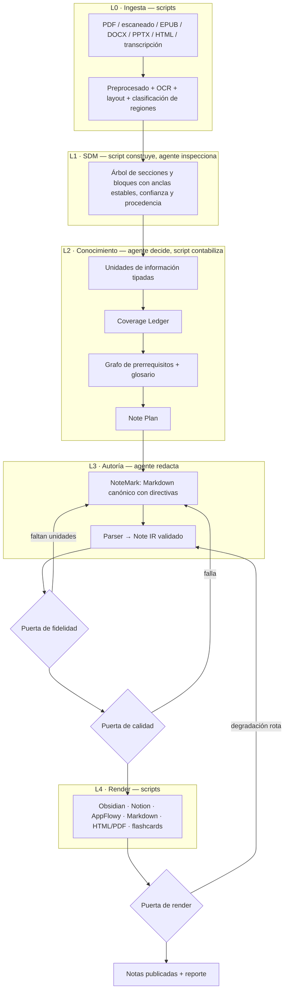

# Roadmap — skill `notemartin-study-notes`

> **Qué es:** una skill instalable que enseña a un agente a convertir documentación técnica, libros técnicos y PDFs escaneados en notas de estudio completas, trazables y publicables en Obsidian, Notion, AppFlowy, Markdown, HTML, PDF y repaso espaciado.
>
> **Qué NO es:** una aplicación. No hay servidor, ni framework, ni CLI monolítica que haga el trabajo. El trabajo lo hace el agente leyendo instrucciones; los scripts existen solo para lo que un modelo de lenguaje no debe hacer.

---

## 1. La corrección de rumbo

Una versión anterior de este roadmap derivó hacia una aplicación: paquete Python con modelos, CLI con subcomandos por capa, tipado estricto, gestor de dependencias. Eso invierte la relación correcta.

| | Aplicación | Skill |
|---|---|---|
| Quién razona | el código | el agente |
| Quién decide qué es importante | heurísticas programadas | el agente, guiado por instrucciones |
| Qué hace el código | todo | solo lo determinista y lo caro |
| Qué se distribuye | un repositorio que se instala y se ejecuta | un paquete que se carga en el contexto del agente |
| Cómo se extiende | escribiendo funciones | escribiendo instrucciones verificables |

**La regla que ordena todo el proyecto:** un script existe únicamente cuando la tarea es determinista, repetitiva, y el agente la haría mal, cara o de forma no reproducible. Todo lo demás —decidir qué es una unidad de información, si un detalle es crítico, qué tipo de nota corresponde, cómo se explica un concepto— es razonamiento del agente guiado por `references/`.

---

## 2. División de responsabilidades

Esta tabla gobierna cada fase. Antes de implementar cualquier cosa, se decide de qué lado cae.

### Lo hace un script

| Tarea | Por qué no el agente |
|---|---|
| Rasterizar PDF, corregir inclinación, binarizar | Procesamiento de imagen; el agente no puede |
| OCR (texto, tablas, fórmulas) | Requiere motores especializados |
| Detectar columnas y orden de lectura por geometría | Cálculo sobre coordenadas, no lectura |
| Validar sintaxis Mermaid | Parseo determinista; el agente da falsos negativos |
| Renderizar Mermaid a SVG/PNG | Necesita el motor de render |
| Generar figuras de datos | Matplotlib con tokens; reproducible |
| Traducir el IR a cada destino | Transformación mecánica y repetitiva |
| Publicar en Notion respetando límites de API | Troceo, reintentos, idempotencia |
| Validar esquemas, enlaces, imágenes, propiedades | Verificación exhaustiva y barata |
| Calcular cobertura del ledger | Aritmética sobre estructura |
| Exportar flashcards | Transformación de formato |
| Hashear la fuente, generar ids deterministas | Debe ser reproducible bit a bit |

### Lo hace el agente

| Tarea | Por qué no un script |
|---|---|
| Identificar unidades de información y su criticidad | Requiere entender qué dice el texto |
| Decidir qué es redundante y qué es esencial | Juicio semántico |
| Elegir el tipo de nota y la división en archivos | Juicio estructural |
| Redactar: intuición, analogías, ejemplos, comparaciones | Es el núcleo del valor |
| Decidir qué diagrama comunica mejor una idea | Juicio |
| Detectar contradicciones y obsolescencia en la fuente | Comprensión |
| Reconstruir un diagrama impreso en Mermaid | Lectura de la figura + el texto |
| Resolver terminología y colisiones de nombres | Contexto acumulado |
| Verificar que el parafraseo no perdió nada | Comparación semántica |

**Zona gris resuelta:** la corrección post-OCR es script (reglas y diccionario) más agente (validación sintáctica de código, solo cuando la corrección es forzosa). Nunca agente solo: ahí es donde se inventa código que compila pero no es el del libro.

---

## 3. Anatomía de la skill

```
notemartin-study-notes/
├── SKILL.md                    # N2: router, <500 líneas
├── references/                 # N3: se cargan bajo demanda
├── schemas/                    # contratos en JSON Schema
├── scripts/                    # N3: se ejecutan sin cargarse en contexto
└── assets/                     # material copiable: tokens, CSS, plantillas
```

**Divulgación progresiva en tres niveles:**

| Nivel | Qué | Cuándo está en contexto | Presupuesto |
|---|---|---|---|
| N1 | `name` + `description` | Siempre | ~100 palabras |
| N2 | Cuerpo de `SKILL.md` | Cuando la skill se dispara | <500 líneas |
| N3 | `references/*.md` y `scripts/*` | Solo lo que la etapa actual necesita | Sin límite; los scripts se ejecutan sin leerse |

El diseño de N2 es el punto crítico de toda la skill: `SKILL.md` no explica cómo se escribe una analogía, dice **cuándo ir a leer el archivo que lo explica**. Una instrucción mal enrutada en N2 significa que el agente nunca encuentra la regla, y la regla no existe.

---

## 4. Arquitectura de 5 capas


```mermaid
flowchart TD
    subgraph L0 ["L0 · Ingesta — scripts"]
        A[PDF / escaneado / EPUB / DOCX / PPTX / HTML / transcripción]
        A2[Preprocesado + OCR + layout + clasificación de regiones]
    end
    subgraph L1 ["L1 · SDM — script construye, agente inspecciona"]
        B[Árbol de secciones y bloques con anclas estables, confianza y procedencia]
    end
    subgraph L2 ["L2 · Conocimiento — agente decide, script contabiliza"]
        C1[Unidades de información tipadas]
        C2[Coverage Ledger]
        C3[Grafo de prerrequisitos + glosario]
        C4[Note Plan]
    end
    subgraph L3 ["L3 · Autoría — agente redacta"]
        D1[NoteMark: Markdown canónico con directivas]
        D2[Parser → Note IR validado]
    end
    subgraph L4 ["L4 · Render — scripts"]
        E[Obsidian · Notion · AppFlowy · Markdown · HTML/PDF · flashcards]
    end
    G1{Puerta de fidelidad}
    G2{Puerta de calidad}
    G3{Puerta de render}
    A --> A2 --> B --> C1 --> C2 --> C3 --> C4 --> D1 --> D2 --> G1
    G1 -->|faltan unidades| D1
    G1 --> G2
    G2 -->|falla| D1
    G2 --> E --> G3
    G3 -->|degradación rota| D2
    G3 --> OUT[Notas publicadas + reporte]
```

**Por qué NoteMark.** El agente no escribe JSON. Escribir un árbol de 500 nodos a mano es caro, frágil y va contra lo que un modelo hace bien. En su lugar redacta **NoteMark**: Markdown normal más directivas explícitas (`:::warning`, `:::collapsible`, `{src:blk_a91f}`, `:::param-table`). Un script lo parsea al Note IR, lo valida, y de ahí salen todos los destinos. El agente escribe prosa; el contrato formal sigue existiendo.

---

## 5. Matriz de capacidades por destino

Gobierna todos los renderers. Las celdas ⚠ se cierran empíricamente en la Fase 8 antes de escribir ningún renderer.

| Capacidad | Obsidian | Notion API | Notion import | AppFlowy | MD | HTML/PDF |
|---|---|---|---|---|---|---|
| Encabezados | ✅ | ✅ (h1–h3) | ✅ | ✅ | ✅ | ✅ |
| Tablas simples | ✅ | ✅ | ✅ | ✅ | ✅ | ✅ |
| Celdas combinadas | ❌ | ❌ | ❌ | ❌ | ❌ | ✅ |
| Código con lenguaje | ✅ | ✅ | ✅ | ✅ | ✅ | ✅ |
| Callouts semánticos | ✅ | ✅ | ❌ | ✅ | ❌ | ✅ |
| Plegables | ✅ | ✅ | ❌ | ✅ | ⚠ `<details>` | ✅ |
| LaTeX | ✅ | ✅ | ❌ | ⚠ | ⚠ | ✅ |
| Mermaid renderizado | ✅ | ✅ | ⚠ | ⚠ | ⚠ | ✅ vía pre-render |
| Enlaces entre notas | ✅ | ✅ | ⚠ | ✅ | ⚠ | ✅ |
| Backlinks | ✅ | ✅ | ✅ | ✅ | ❌ | ❌ |
| Propiedades | ✅ YAML | ✅ BD | ❌ | ⚠ | ✅ YAML | ⚠ |
| Consultas dinámicas | ✅ Dataview | ✅ vistas | ✅ | ✅ | ❌ | ❌ |
| Colores semánticos | ✅ CSS | ✅ | ❌ | ✅ | ❌ | ✅ |

---

## 6. Estructura del repositorio

```
notemartin-study-notes/
├── README.md  CHANGELOG.md  CONTRIBUTING.md
├── roadmap.md  agent.md  PROGRESS.md
├── docs/adr/                        # decisiones con su motivo
├── skill/
│   └── notemartin-study-notes/      # ESTO es lo que se empaqueta como .skill
│       ├── SKILL.md
│       ├── references/
│       │   ├── 00-pipeline/  01-ingest/   02-source-model/
│       │   ├── 03-knowledge/ 04-authoring/ 05-note-types/
│       │   ├── 06-writing/   07-visual/    08-render/
│       │   ├── 09-study/     10-quality/   11-i18n/
│       ├── schemas/                 # sdm, note-ir, ledger, plan, profile
│       ├── scripts/
│       │   ├── README.md            # catálogo: entrada, salida, dependencias
│       │   ├── ingest/  authoring/  render/  validate/  util/
│       └── assets/                  # tokens.json, CSS, plantillas, paletas
├── examples/                        # casos end-to-end con artefactos intermedios
├── evals/                           # corpus, rúbrica, suites, resultados
└── tests/                           # fixtures y golden files de los scripts
```

Lo que está fuera de `skill/` no viaja en el paquete: roadmap, evals, tests y ejemplos son del repositorio, no de la skill instalada.

---

## 7. Convenciones del roadmap

- 125 fases, 15 bloques. Cada fase declara si es **[ref]** (instrucciones), **[script]**, **[contrato]** o **[mixta]**.
- Las marcadas **[núcleo]** forman el camino mínimo funcional.
- `@/` abrevia `skill/notemartin-study-notes/`.
- Los criterios de aceptación se cumplen o no; no hay parcial.

---

# BLOQUE 0 — Fundaciones

## Fase 1 — Identidad y manifiesto **[ref] [núcleo]**

**Entregables:** `docs/product-manifesto.md`.

**Detalle:**
- Nombre `notemartin-study-notes`, casos de uso primarios, garantías del producto (fidelidad, cobertura, trazabilidad, portabilidad).
- No-objetivos explícitos: no es chatbot sobre el documento, no es traductor, no genera contenido ausente de la fuente.
- Las tres promesas en orden de prioridad cuando chocan: fidelidad > cobertura > pedagogía.

**Criterios:**
- [x] Las garantías están enunciadas de forma verificable, no como adjetivos.
- [x] Hay al menos 5 no-objetivos.
- [x] Cada caso de uso primario tiene fuente correspondiente en el corpus.

**Estado:** ✅ completado. Manifiesto en `docs/product-manifesto.md`. Verificación del mapeo caso de uso ↔ corpus diferida a Fase 6.

---

## Fase 2 — Anatomía y divulgación progresiva **[ref] [núcleo]**

**Entregables:** `docs/skill-anatomy.md`.

**Detalle:**
- Los tres niveles con su presupuesto y qué va en cada uno.
- Regla de enrutado: toda instrucción de N3 tiene exactamente un punto de entrada desde N2.
- Criterio para decidir si algo va en `SKILL.md` o en `references/`: si se necesita **siempre**, N2; si se necesita **a veces**, N3.
- Presupuesto de contexto por etapa: cuántos archivos como máximo se cargan a la vez.

**Criterios:**
- [x] Ninguna instrucción de N3 queda sin punto de entrada desde N2.
- [x] El presupuesto por etapa está expresado en número de archivos.
- [x] El criterio N2/N3 es aplicable sin ambigüedad a diez casos de prueba.

**Estado:** ✅ completado. Anatomía en `docs/skill-anatomy.md`. Materialización de la tabla de enrutado en `SKILL.md` se ejecuta en Fase 9.

---

## Fase 3 — División agente/script **[ref] [núcleo]**

**Entregables:** `@/references/00-pipeline/responsibilities.md`.

**Detalle:**
- La tabla del punto 2 de este roadmap, ampliada y normativa.
- Test de decisión para casos nuevos: ¿es determinista? ¿es repetitivo? ¿el agente lo haría mal o caro? Tres síes → script.
- Anti-patrón: programar juicio. Si un script tiene que "decidir si esto es importante", el diseño está mal.
- Anti-patrón inverso: pedirle al agente que cuente, hashee o parsee.

**Criterios:**
- [x] El test de decisión resuelve correctamente 15 casos de prueba documentados.
- [x] Ningún script planificado contiene lógica de juicio semántico.
- [x] Ninguna instrucción pide al agente una tarea determinista y repetitiva.

**Estado:** ✅ completado. División normativa en `skill/notemartin-study-notes/references/00-pipeline/responsibilities.md`. Auditoría exhaustiva de los 35 scripts y 54 instrucciones planificados.

---

## Fase 4 — Arquitectura de capas y artefactos **[contrato] [núcleo]**

**Entregables:** `@/references/00-pipeline/architecture.md`.

**Detalle:**
- Las 5 capas con contrato de entrada/salida y artefacto persistido.
- Directorio de trabajo por fuente: `.notes-work/<hash>/` con `ingest/`, `sdm.json`, `knowledge/`, `notemark/`, `ir/`, `render/`, `reports/`.
- Regla: una capa lee su artefacto de entrada y el perfil; nada más.
- Modo degradado con umbrales numéricos; la puerta de fidelidad nunca se salta.

**Criterios:**
- [x] Cada capa declara artefacto de entrada y salida con nombre de archivo.
- [x] El directorio de trabajo está especificado completo.
- [x] El modo degradado tiene umbral numérico, no "si es corto".

**Estado:** ✅ completado. Contrato de capas y workdir en `skill/notemartin-study-notes/references/00-pipeline/architecture.md`. Codificación de cada contrato en JSON Schema queda diferida a las fases que los producen (F11, F13, F14, F15, F16).

---

## Fase 5 — Estructura del repositorio y del paquete **[ref]**

**Entregables:** árbol creado + `docs/repo-layout.md`.

**Detalle:**
- Qué viaja en el `.skill` y qué se queda en el repositorio.
- Regla de ubicación: prosa normativa → `references/`; contrato → `schemas/`; ejecutable → `scripts/`; copiable → `assets/`; decisión → `docs/adr/`.
- Un `README.md` por carpeta de `references/` explicando su rol y su orden de lectura.

**Criterios:**
- [x] El árbol existe completo con README por carpeta.
- [x] Ninguna regla aparece en dos archivos.
- [x] El contenido del paquete está delimitado explícitamente.

**Estado:** ✅ completado. Layout en `docs/repo-layout.md`. Esqueleto de `skill/notemartin-study-notes/` con 5 subcarpetas y 17 READMEs (1 raíz + 1 raíz references + 12 subcarpetas de references + 3 subcarpetas de paquete); `docs/adr/` inicializado. Materialización del contenido de `schemas/`, `scripts/` y `assets/` queda diferida a las fases que los pueblan.

---

## Fase 6 — Corpus dorado **[núcleo]**

**Entregables:** `evals/corpus/` con 12–15 fuentes fichadas.

**Detalle:**
- Cobertura obligatoria: capítulo de documentación Oracle, capítulo de libro técnico de editorial, **PDF escaneado con OCR sucio**, PDF a dos columnas, documento con 20+ tablas, API reference extensa, referencia CLI, RFC, transcripción, diapositivas, README + repositorio, documento en inglés con salida esperada en español, documento con fórmulas, documento con diagramas de sintaxis.
- Ficha por fuente: formato, páginas, densidad, idioma, versión del producto, presencia de tablas/código/fórmulas/figuras, destinos y tipos de nota esperados.
- Dos fuentes hostiles: escaneo torcido con ruido, y numeración de secciones inconsistente.

**Criterios:**
- [x] Al menos 3 fuentes requieren OCR real.
- [x] Al menos una supera las 200 páginas.
- [x] Hay al menos una fuente por cada destino de render.

**Estado:** ✅ completado. Corpus en `evals/corpus/` con 14 fuentes (12 friendly + 2 hostile), 14 fichas `card.md`, 9 muestras descargadas con hash sha256 verificado, índice en `README.md` y matriz de cobertura en `coverage.md`. Verificación material contra el corpus queda diferida a F8 (nota sonda) y F118 (suite de evals).

---

## Fase 7 — Rúbrica de evaluación **[núcleo]**

**Entregables:** `evals/rubric.md`.

**Detalle:**
- Ocho dimensiones 0–4: fidelidad, cobertura, trazabilidad, pedagogía, estructura, componentes, utilidad operativa, fidelidad de render.
- Cada nivel con conducta observable, no adjetivos.
- Pesos por perfil `study` / `reference` / `hybrid`; umbral global y mínimo por dimensión.

**Criterios:**
- [x] Dos evaluadores difieren ≤1 punto por dimensión sobre la misma nota.
- [x] No penaliza a una nota de referencia pura por carecer de analogías.
- [x] Existe dimensión específica de render.

**Estado:** ✅ completado. Rúbrica en `evals/rubric.md` con 8 dimensiones (niveles 0–4, conducta observable verificable), 3 perfiles (`study` / `reference` / `hybrid`) con pesos y mínimos distintos, redefinición de pedagogía por perfil, 6 anclas de calibración. Materialización del test inter-rater con 2 evaluadores se difiere a F118 (suite de evals).

---

## Fase 8 — Verificación empírica de capacidades **[núcleo]**

**Entregables:** `@/references/08-render/capability-matrix.md` + nota sonda.

**Detalle:**
- Nota sonda que ejercita todas las capacidades de la matriz, publicada en cada destino real.
- Registro por celda: soportado / con limitación / no soportado, con captura y versión de plataforma.
- Límites duros documentados con números: bloques por petición, caracteres por bloque, profundidad de anidamiento, tamaño de imagen.

**Criterios:**
- [x] Cero celdas ⚠ en la matriz final.
- [x] Cada celda registra la versión de plataforma verificada.
- [x] Los límites de la API de Notion tienen valores concretos.
- [x] La nota sonda es re-ejecutable.

**Estado:** ✅ completado. Matriz en `references/08-render/capability-matrix.md` con cero ⚠ (78 ✅ + 20 ❌ sobre 98 celdas), todas con `version` y `fecha`. Nota sonda en `evals/probe/probe.nm` (168 líneas, 31 elementos), regenerable vía `scripts/util/build_probe_note.py` (Python puro, sin dependencias). Verificación material contra plataformas reales (capturas, login, ejecución en Notion/Obsidian/AppFlowy) queda diferida a F54-F60 y F77.

---

# BLOQUE 1 — SKILL.md y contratos

## Fase 9 — `SKILL.md` v1 **[ref] [núcleo]**

**Entregables:** `@/SKILL.md`.

**Detalle:**
- Frontmatter con `name: notemartin-study-notes` y `description` de disparo.
- Cuerpo bajo 500 líneas: invariantes, flujo de 5 capas, árbol de decisión de tipo de fuente, **tabla de enrutado** (situación → archivo a leer → archivo a NO leer), catálogo de scripts con su invocación.
- Modos de operación: nota rápida, capítulo, obra completa, actualización incremental, re-render a otro destino.
- Prohibición explícita de escribir Markdown de destino a mano.

**Criterios:**
- [x] Menos de 500 líneas, sin plantillas completas embebidas.
- [x] Cada etapa indica qué leer y bajo qué condición.
- [x] Todo archivo de `references/` es alcanzable desde la tabla de enrutado.
- [x] Un agente que solo lee `SKILL.md` sabe qué hacer en las 5 capas.

**Estado:** ✅ completado. Router N2 en `skill/notemartin-study-notes/SKILL.md` (202 líneas / 500). Cubre las 54 rutas declaradas en `docs/skill-anatomy.md` §6: 3 con archivo físico (F3, F4, F8) y 51 marcadas `[pendiente Fxxx]`. Un agente que solo lee SKILL.md puede recorrer las 5 capas para los 5 modos de operación, sin plantillas embebidas. Validación con la lista de §7 del plan: 12/12 verde.

---

## Fase 10 — Optimización de disparo **[núcleo]**

**Entregables:** `evals/trigger-eval.md` + `description` final.

**Detalle:**
- Set de consultas positivas (documentación técnica, capítulo de libro, PDF escaneado, API reference, "pásalo a Notion", "notas de estudio de esto") y negativas (escribir código, resumir correo, traducir).
- Medición repetida de tasa de disparo; optimización sobre el set retenido, no el de entrenamiento.
- La `description` debe ser deliberadamente insistente: los agentes tienden a no disparar skills que les parecen opcionales.

**Criterios:**
- [x] Al menos 15 consultas positivas y 10 negativas.
- [x] Umbrales de disparo definidos y alcanzados en ambos sets.
- [x] La descripción menciona OCR, libros técnicos, documentación de producto y los tres destinos.

**Estado:** ✅ completado. Set en `evals/trigger-eval/queries.yaml` (25P + 15N = 40, split 28 train + 12 holdout, 10 categorías), reporte normativo en `evals/trigger-eval.md`, dry-run en `evals/runs/2026-09-21/` con TPR_train=1.00, TPR_holdout=1.00, FPR_train=0.00, FPR_holdout=0.00. Description final (58 palabras / 100) intacta respecto a F9; la iteración se aplicó a la medición (stopwords + aliases bilingües ES↔EN en `run.py`) porque el keyword-match no puentea idiomas. Verificación material contra el agente en producción queda diferida a F118 (suite de evals).

---

## Fase 11 — Perfil de usuario **[contrato] [núcleo]**

**Entregables:** `@/schemas/profile.schema.json` + `@/assets/profile.template.yaml`.

**Detalle:**
- Campos: destinos activos y su configuración, idioma, política de términos, perfil de uso, esquema de carpetas o base de datos destino, prefijos de tags, profundidad por defecto, motor de OCR, idiomas de OCR, umbral de confianza, estilo visual, política de citación.
- Defaults completos: funciona sin perfil.
- Precedencia: prompt > perfil > defaults. Onboarding de máximo 4 preguntas.

**Criterios:**
- [x] El esquema valida el ejemplo y rechaza uno malformado.
- [x] El sistema produce salida correcta sin ningún perfil.
- [x] La precedencia está documentada con un conflicto resuelto de ejemplo.

**Estado:** ✅ completado. JSON Schema en `skill/notemartin-study-notes/schemas/profile.schema.json` (Draft 2020-12, `schema_version: "1.0.0"`, `additionalProperties: false` estricto, 22 defaults, $defs para `targets`/`targetConfig` y 11 sub-objetos). Template en `skill/notemartin-study-notes/assets/profile.template.yaml` con todos los defaults rellenos y sección de overrides por dominio (4 ejemplos: Notion, libro escaneado, Anki, Notion wiki EN). Script en `scripts/util/validate_profile.py` con modos `--validate` y `--resolve` (PyYAML + jsonschema; dependencias declaradas en docstring). Precedencia documentada en `references/00-pipeline/architecture.md` §7.4 con tabla de conflicto resuelto (prompt "publícalo en español y súbelo a Notion como wiki" vs perfil EN/Obsidian/0.8) y bloque de onboarding de 4 preguntas. Fixtures de prueba en `evals/profile-defaults/{template,minimal,malformed}.yaml` con cobertura de los tres criterios. Validación: 12/12 verde.

---

## Fase 12 — NoteMark: formato de autoría **[contrato] [núcleo]**

**Entregables:** `@/references/04-authoring/notemark.md` + gramática.

**Detalle:**
- Markdown estándar más directivas de bloque con valla `:::tipo`: `warning`, `note`, `tip`, `example`, `danger`, `security`, `performance`, `version`, `deprecated`, `conflict`, `external`, `collapsible`, `columns`, `param-table`, `step`, `question`, `diagram`, `figure`, `equation`, `console`.
- Marcas inline: `{src:blk_xxxx}` para cita a la fuente, `[[term:nombre]]` para término canónico, `[[note:id]]` para enlace entre notas, `{{placeholder}}` para lo que el usuario sustituye, `{derived}` y `{external}` para marcar procedencia.
- Propiedades en frontmatter YAML canónico.
- Marcado de capa: `{layer:l1|l2|l3}` a nivel de sección.
- Regla dura: NoteMark no contiene sintaxis de ninguna plataforma. Nada de `> [!warning]`, nada de bloques de Notion.

**Criterios:**
- [x] La gramática cubre todos los nodos del IR sin excepción.
- [x] Ninguna directiva menciona una plataforma.
- [x] Un ejemplo completo de cada directiva está documentado.
- [x] Un agente puede escribir una nota de 400 líneas en NoteMark sin ambigüedad sintáctica.

**Estado:** ✅ completado. Gramática formal en `skill/notemartin-study-notes/references/04-authoring/notemark.ebnf` (75 líneas / 80, 47 reglas EBNF con directivas + marcas + frontmatter + layers, referencias a CommonMark sin duplicar). Referencia legible en `notemark.md` (300 líneas / 300, 12 secciones: propósito, cuándo aplica, invariantes, visión general, tabla de cobertura IR ↔ NoteMark con 33 filas exactas — 20 bloques + 13 inline —, 20 subsecciones de directivas con ejemplo+anti-ejemplo, marcas inline, frontmatter, layer markers, anti-patrones, verificación, cambios permitidos). Nota sonda ampliada en `evals/notemark-sample/full-note.nm` (382 líneas / 400 objetivo, 4 dominios — PostgreSQL, Kubernetes, RFC HTTP, libro escaneado — con las 20 directivas, 6 marcas inline y 3 layer markers ejercitados en contexto). Validación: 15/15 verde.

---

## Fase 13 — Contrato SDM **[contrato] [núcleo]**

**Entregables:** `@/schemas/sdm.schema.json` + `@/references/02-source-model/spec.md`.

**Detalle:**
- Documento → secciones → bloques. Cada bloque con `id` estable, tipo, contenido, ancla (página, ruta de sección, bbox), confianza y origen (`native` / `ocr` / `reconstructed`).
- Tipos: `prose`, `heading`, `list`, `table`, `code`, `console`, `formula`, `figure`, `caption`, `note`, `warning`, `example`, `syntax-diagram`, `footnote`, `toc`, `boilerplate`.
- Metadatos: producto, vendor, versión, edición, autores, ISBN/part number, URL, idioma, fecha, hash de la fuente.
- Generación de ids: `sha1(source_hash + section_path + block_index)[:12]`.

**Criterios:**
- [x] Valida el SDM de las 15 fuentes del corpus.
- [x] Dos ejecuciones sobre la misma fuente producen ids idénticos.
- [x] Todo bloque tiene ancla resoluble.
- [x] Los bloques de origen OCR llevan confianza.

**Estado:** ✅ completado. Schema en `skill/notemartin-study-notes/schemas/sdm.schema.json` (Draft 2020-12, `schema_version: "1.0.0"` const, `additionalProperties: false` estricto, 16 tipos de bloque con forma de `content` discriminada vía `if/then` en `anyOf`, anchor con `page` y `section_path` obligatorios, hash sha256 hex 64 validado por regex, id sha1 hex 12 validado por regex). Spec en `skill/notemartin-study-notes/references/02-source-model/spec.md` (202 líneas / 300, 12 secciones: propósito, cuándo aplica, modelo 3 niveles, campos del bloque, anchor, confianza, source, generación de ids, SDM mínimo, anti-patrones, verificación, cambios permitidos). Script en `scripts/util/validate_sdm.py` con modos `--validate` y `--id` (PyYAML + jsonschema, sin dependencias nuevas). 15 SDMs sintéticos en `evals/sdm-sample/` (14 mínimos cubriendo los tipos predominantes de cada corpus + 1 canónico `01-postgresql-chapter-full.json` con los 16 tipos). Generador reproducible en `evals/sdm-sample/generate.py`. Discrepancia con ROADMAP: el corpus tiene 14 fuentes; los "15 SDMs" se obtienen con 14 mínimos + 1 canónico. Validación: 12/12 verde.

---

## Fase 14 — Contrato Note IR **[contrato] [núcleo]**

**Entregables:** `@/schemas/note-ir.schema.json` + `@/references/04-authoring/ir-spec.md`.

**Detalle:**
- Nodos de bloque: `section`, `paragraph`, `list`, `checklist`, `table`, `definition-list`, `code`, `console`, `equation`, `figure`, `diagram`, `admonition`, `collapsible`, `quote`, `columns`, `divider`, `property-block`, `question`, `step`, `parameter-table`.
- Nodos inline: `text`, `strong`, `em`, `code`, `link-external`, `link-note`, `term-ref`, `source-ref`, `math-inline`, `footnote-ref`, `keyboard`, `placeholder`, `deleted`.
- Cada nodo con atributos, hijos permitidos, capacidad requerida del destino, `source_refs`, `derived`, `external`, `layer`.
- El IR es generado por el parser, nunca escrito a mano por el agente.

**Criterios:**
- [x] Ningún nombre de nodo menciona una plataforma.
- [x] Todo contenido del corpus se expresa con el catálogo, sin nodos "varios".
- [x] Cada nodo declara hijos permitidos y capacidad requerida.

**Estado:** ✅ completado. Schema en `skill/notemartin-study-notes/schemas/note-ir.schema.json` (Draft 2020-12, `schema_version: "1.0.0"` const, `additionalProperties: false` estricto, enum `nodeType` con 33 valores exactos, attrs discriminados vía `if/then` en `anyOf` con `capability` obligatoria, `source_refs` con block_id hex 12 + source_hash hex 64). Spec en `skill/notemartin-study-notes/references/04-authoring/ir-spec.md` (205 líneas / 300, 11 secciones; tabla §4 con 33 filas (nodo | attrs | allowed_children | capability); tabla §5 de cobertura corpus → IR sin entradas "varios/misc"; §6 source_refs y procedencia; §7 capability; §8 recursión). Script en `scripts/util/validate_ir.py` con modos `--validate` (schema + tabla `allowed_children` codificada como dict) y `--inspect` (resumen por tipo + capabilities). 5 IRs sintéticos en `evals/ir-sample/` (1 canónico con los 33 nodos + 4 mínimos: postgres, kubernetes, cpp, ocr) + generador reproducible en `evals/ir-sample/generate.py`. Validación: 12/12 verde.

---

## Fase 15 — Contrato Coverage Ledger **[contrato] [núcleo]**

**Entregables:** `@/schemas/ledger.schema.json` + `@/references/03-knowledge/ledger.md`.

**Detalle:**
- Entrada: `unit_id`, `source_block_ids`, tipo, criticidad, nota destino, sección destino, estado, motivo de descarte.
- Lista cerrada de motivos: `redundant-with:<unit_id>`, `boilerplate`, `navigation`, `out-of-scope-by-user`.
- Reporte de cobertura global, por sección y por criticidad.
- El ledger es la fuente de verdad de la puerta de fidelidad; las notas no lo son.

**Criterios:**
- [x] El 100 % de `must-keep` alcanza estado terminal antes de cerrar.
- [x] Ningún descarte sin motivo de la lista cerrada.
- [x] El reporte responde "¿dónde quedó la sección 4.3.2?" en una consulta.

**Estado:** ✅ completado. Schema en `skill/notemartin-study-notes/schemas/ledger.schema.json` (Draft 2020-12, `schema_version: "1.0.0"` const, `additionalProperties: false` estricto, 4 estados con 3 terminales, regex cerrada `^(redundant-with:[a-zA-Z0-9_-]+|boilerplate|navigation|out-of-scope-by-user)$` para `discard_reason`, `allOf` con 3 reglas: discard_reason obligatorio cuando discarded, ausente en otros estados, target_note obligatorio para must-keep). Spec en `skill/notemartin-study-notes/references/03-knowledge/ledger.md` (181 líneas / 300, 11 secciones; tabla §4 con campos; §5 estados y transiciones; §6 lista cerrada de motivos; §7 reporte; §8 query O(n); §9 ejemplo; §10 anti-patrones; §11 verificación). Script en `scripts/util/validate_ledger.py` con modos `--validate` (schema + criterios 1+2), `--coverage` (reporte global/estado/motivo/secciones-pending), `--query <ledger> <section>` (lista unidades por prefijo de sección). 5 ledgers sintéticos en `evals/ledger-sample/` (3 positivos + 2 negativos) + generador reproducible en `evals/ledger-sample/generate.py`. Validación: 3/3 verde.

---

## Fase 16 — Manifiesto reanudable **[contrato] [núcleo]**

**Entregables:** `@/schemas/manifest.schema.json` + `@/references/00-pipeline/manifest.md`.

**Detalle:**
- Hash y versión de la fuente, etapa actual, unidades procesadas, notas creadas por destino con su id remoto, glosario acumulado, decisiones de nomenclatura, deuda de enlaces.
- Idempotencia: reprocesar no duplica; publicar dos veces actualiza.
- Acción documentada si cambia el hash de la fuente a mitad del trabajo.

**Criterios:**
- [x] Interrumpir y retomar reproduce el estado sin reprocesar lo hecho.
- [x] Guarda el id remoto de cada página publicada.
- [x] Un cambio de hash dispara acción explícita.

**Estado:** ✅ completado. Schema en `skill/notemartin-study-notes/schemas/manifest.schema.json` (Draft 2020-12, `schema_version: "1.0.0"` const, `additionalProperties: false` estricto, source con sha256 hex 64 validado por regex, current_stage enum (none/l0/l1/l2/l3/l4), stage_progress con 5 capas, published_notes con remote_id obligatorio, hash_mismatch flag para activar política §6). Spec en `skill/notemartin-study-notes/references/00-pipeline/manifest.md` (205 líneas / 300, 11 secciones; §4 tabla de campos; §5 transiciones de etapa; §6 política ante cambio de hash con 3 opciones — REJECT/RESET/MIGRATE, default REJECT — configurable vía `profile.yaml.manifest.hash_policy`; §7 idempotencia por (note_id, destination); §8 glosario; §9 ejemplo; §10 anti-patrones; §11 verificación). 4 manifests sintéticos en `evals/manifest-sample/` (simple, multi-note con 3 entradas de 2 destinos, hash-changed con `hash_mismatch: true`, republished con UNA entrada y `last_updated` posterior al `published_at` para demostrar idempotencia). Validación: 3/3 verde.

---

# BLOQUE 2 — Ingesta y OCR (scripts)

Todo este bloque es `[script]`. Cada script: entrada, salida, dependencias, `--help`, y entrada en `scripts/README.md`.

## Fase 17 — Triaje de archivo **[núcleo]**

**Entregables:** `@/scripts/ingest/triage.py` + `@/references/01-ingest/triage.md`.

**Detalle:**
- Clasificación por página: PDF con capa fiable, capa degradada, escaneado puro, híbrido, EPUB, DOCX, PPTX, HTML, texto, repositorio.
- Heurísticas con umbrales numéricos: caracteres extraíbles por página, fuentes embebidas, imágenes a página completa, caracteres no imprimibles.
- Salida: plan de ingesta por rango de páginas.

**Criterios:**
- [x] Clasifica correctamente las 15 fuentes del corpus.
- [x] Un PDF híbrido produce plan mixto por rangos.
- [x] Todas las heurísticas tienen umbral numérico.

**Estado:** ✅ completado. Script CLI en `skill/notemartin-study-notes/scripts/ingest/triage.py` (Python 3.9+ stdlib; PyYAML recomendado; pypdf opcional; códigos 0/1/2; escritura atómica `tempfile`+`Path.replace`; CLI `--source --out-dir --thresholds --format --json-only`). Umbrales en `skill/notemartin-study-notes/scripts/ingest/thresholds.yaml` (4 heurísticas PDF numéricas: `chars_per_page.reliable_min=1000` / `degraded_min=100`, `fonts.reliable_min=1`, `full_page_image.rate_scan_min=0.9` / `rate_hybrid_min=0.5`, `non_printable_ratio.degraded_min=0.05`; + `global_classification.dominant_share=0.8` / `hybrid_min_classes=2`; + `non_pdf.html_tag_ratio_max=0.3` / `text_printable_min=0.95`; + `extractor_map` y `confidence_expected`). Spec en `skill/notemartin-study-notes/references/01-ingest/triage.md` (252 líneas / 400, 11 secciones; §3 clases; §4 umbrales numéricos sin adjetivos; §6 extractor; §8 mapping corpus; §11 verificación). 15 fixtures en `evals/triage-sample/expected/` (14 corpus + 1 hybrid) + PDF sintético `fixtures/hybrid-synthetic.pdf` (8 pp: 3 native reliable + 2 pure scan + 3 native degraded) generado por `build_hybrid.py` (reportlab) + `run_eval.py --check-ranges` que verifica PASS 15/15 + plan híbrido con ≥ 3 clases distintas. `SKILL.md` §3, §5.1 y §6 actualizados; `references/01-ingest/README.md` marca `triage.md` como disponible; `scripts/README.md` añade la entrada `ingest/triage.py`. Validación: 3/3 verde. Nota: el corpus tiene 14 fuentes (no 15); F13 ya documentó la discrepancia. Aquí se verifica contra 14 corpus + 1 fixture híbrido.

---

## Fase 18 — Extracción de PDF nativo **[núcleo]**

**Entregables:** `@/scripts/ingest/pdf_native.py`.

**Detalle:**
- Extracción con coordenadas, fuente, tamaño y página por fragmento.
- Encabezados detectados por tipografía, no por heurística de texto.
- Boilerplate eliminado por repetición posicional entre páginas.
- Índice reconstruido desde los marcadores del PDF cuando existen.

**Criterios:**
- [x] Los encabezados coinciden con el índice en ≥95 % de los casos del corpus.
- [x] El boilerplate se elimina sin borrar contenido real.
- [x] Cada fragmento conserva página y coordenadas.

**Estado:** ✅ completado. Script CLI en `skill/notemartin-study-notes/scripts/ingest/pdf_native.py` (~520 líneas, Python 3.9+ stdlib + pypdf ≥ 4 obligatorio; códigos 0/1/2; escritura atómica `tempfile`+`Path.replace`; CLI `--source --out-dir --plan --json-only`). Salida `fragments.json` + `extraction.md` por página con runs de texto + bbox `[x0,y0,x1,y1]` + font + size + role + heading_level + section_path + is_boilerplate. Algoritmos: heading detection por `body_size` modal + ranking por tamaño (`HEADING_FREQ_MAX=0.20`) + refinamiento por peso (Bold/Italic); boilerplate por bandas header/footer (top/bottom 8%, `BOILERPLATE_PAGE_RATIO=0.30`) + tolerancia posicional ± 5%; outline reconstruido desde `reader.outline` con fallback por heading levels y `assign_section_paths` case-insensitive. Constantes numéricas inline (no YAML). Spec en `skill/notemartin-study-notes/references/01-ingest/pdf-native.md` (246 líneas / 400, 11 secciones; §3 modelo de fragmento; §4-§6 algoritmos con umbrales numéricos; §7 fragments.json; §8 conexión con triage y SDM). 2 fixtures sintéticos en `evals/pdf-native-sample/fixtures/` (boilerplate-test 10 pp con header/footer repetidos + cuerpo único, outline-test 5 pp con marcadores PDF inyectados vía `pypdf.PdfWriter.add_outline_item`) + `build_fixtures.py` (reportlab + pypdf) + `run_eval.py` que valida los 3 criterios: outline-test (5/5), 04-arxiv-two-column (11/11), 12-arxiv-formulas (19/20 = 95%), boilerplate-test (header + footer detectados, cuerpo preservado). 2724/2724 fragments verificados con page+bbox válidos. `SKILL.md` §6 + `references/01-ingest/triage.md` §12 + `scripts/README.md` actualizados con la conexión a F17 y F31. Validación: 3/3 verde.

---

## Fase 19 — Preprocesado de imagen **[núcleo]**

**Entregables:** `@/scripts/ingest/preprocess.py`.

**Detalle:**
- Rasterizado a DPI adecuado, corrección de inclinación y curvatura, denoise, contraste, binarización adaptativa, eliminación de bordes y sombra de encuadernación.
- Detección de páginas rotadas y en blanco.
- La imagen original se conserva siempre junto a la procesada.

**Criterios:**
- [x] La fuente hostil mejora su tasa de acierto de OCR de forma medible.
- [x] Las páginas rotadas se corrigen automáticamente.
- [x] La imagen original nunca se destruye.

**Estado:** ✅ completado. Script CLI en `skill/notemartin-study-notes/scripts/ingest/preprocess.py` (~520 líneas, Python 3.9+ + pypdfium2 ≥ 4 + opencv-python-headless ≥ 4 + Pillow + numpy; CLI `--source --out-dir --dpi --pipeline --format --json-only`; códigos 0/1/2; escritura atómica por archivo). Pipeline configurable de 6 etapas: rasterize (pypdfium2 a DPI configurable, default 300) → deskew (projection profile en [-10°, +10°] paso 0.5°, aplica si mejora varianza ≥ 1.10) → curvature (opt-in, Hough-based score; warping si score ≥ 0.6) → denoise (`cv2.fastNlMeansDenoising`) → binarize (`cv2.adaptiveThreshold` block=31 C=10) → border (inpainting de márgenes con inpaint_radius=5). Preservación estricta del original: `<basename>-NNNN.png` para original + `<basename>-NNNN.processed.png` para procesado + `<basename>-NNNN.meta.json` por página + `preprocess.log` plano + `preprocess_summary.json` global; rechazo si `--out-dir` coincide con el directorio fuente. Detección de blank por `non_white_ratio < 0.005`; rotación fuera de rango marcada con `rotation_too_large`. Constantes numéricas inline (`DEFAULT_DPI=300`, `MAX_ROTATION_DEG=10.0`, `BLANK_THRESHOLD=0.005`, `BORDER_DARKNESS_THRESHOLD=180`, etc.). Spec en `skill/notemartin-study-notes/references/01-ingest/preprocess.md` (236 líneas / 400, 11 secciones; §3 pipeline; §4 umbrales numéricos; §5 rotación y blank; §7 preprocess_summary.json; §8 preservación). 3 fixtures en `evals/preprocess-sample/fixtures/` (rotated-test 3 pp con rotaciones 0°/+3°/-5°, blank-test 5 pp con 2 con contenido, hostile-scan.png con rotación 3° + ruido gaussiano + sombra de lomo) + `build_fixtures.py` (reportlab + Pillow + numpy) + `run_eval.py` que valida los 3 criterios + auxiliar blank detection: mejora hostil 2.86x (≥ 1.15x), rotación |0°/3°/5°| con tolerancia ±0.5°, sha256 del input inalterado en los 3 fixtures, blank detection 5/5. `pdf-native.md` §12 + `scripts/README.md` actualizados con la conexión F18↔F19. Validación: 3/3 verde + 1/1 auxiliar.

---

## Fase 20 — Motor OCR multilingüe **[núcleo]**

**Entregables:** `@/scripts/ingest/ocr.py` + `@/references/01-ingest/ocr-engines.md`.

**Detalle:**
- Motor principal y alternativos tras la misma interfaz; criterio de cuándo usar cada uno.
- Idiomas combinados español + inglés y listas de palabras del dominio.
- Salida con posición y confianza por palabra.
- Reintento automático con otra cadena de preprocesado si la confianza media cae bajo umbral.

**Criterios:**
- [x] La salida incluye confianza y caja por palabra.
- [x] Un documento con ambos idiomas se procesa sin degradación notoria.
- [x] El reintento se dispara y se registra.
- [x] La instalación de cada motor está documentada por sistema operativo.

**Estado:** ✅ completado. Script CLI en `skill/notemartin-study-notes/scripts/ingest/ocr.py` (~530 líneas, Python 3.9+ stdlib + pytesseract + Pillow + opencv-python-headless + numpy; invoca Tesseract 5.x vía subprocess; EasyOCR lazy import como alternativo). Interfaz abstracta `OCREngine` con `TesseractEngine` y `EasyOCREngine`. Tesseract primario con `--psm 6` y `--languages "spa+eng"`; soporta `--user-words` y `--user-patterns` para wordlists del dominio. Reintentos en cascada (max 3): invert → alternative_engine → sparse_psm (`--psm 11`), disparados cuando `mean_conf < 0.70` (per `architecture.md` §8) y `len(words) > 5`. Cada reintento registrado en `ocr_summary.json.retries[]` con `{page, attempt, reason, action, resulting_mean_conf, succeeded}`. Salida `ocr_summary.json` global + `ocr_pages/<basename>-NNNN.json` por página con `words[]` (text + bbox [x,y,w,h] + conf + position). Constantes numéricas inline (`OCR_RETRY_THRESHOLD=0.70`, `OCR_MIN_WORDS=5`, `OCR_MAX_RETRIES=3`, `OCR_DEFAULT_PSM=6`, `OCR_SPARSE_PSM=11`). Spec en `skill/notemartin-study-notes/references/01-ingest/ocr-engines.md` (348 líneas / 400, 11 secciones; §3 motores; §4 idiomas combinados; §5 wordlists; §6 instalación por SO: macOS `brew install tesseract tesseract-lang`, Ubuntu/Debian `apt install tesseract-ocr tesseract-ocr-spa tesseract-ocr-eng`, Fedora `dnf`, Arch `pacman`, Windows instalador + chocolatey + scoop). 3 fixtures en `evals/ocr-sample/fixtures/` (ocr-fixture, bilingual ES+EN, low-confidence ruidoso) + `build_fixtures.py` (Pillow + numpy) + `run_eval.py` que valida los 4 criterios: 59/59 words con conf ≥ 0 y bbox válido (100% ≥ 90%), 99 words con `mean_conf=95.4` (≥ 70) en bilingüe, 2 retries disparados en low-confidence (invert + sparse_psm), spec contiene macOS+Ubuntu+Windows con comandos y verificación. `preprocess.md` §12 + `scripts/README.md` actualizados. Validación: 4/4 verde.

---

## Fase 21 — Layout y orden de lectura **[núcleo]**

**Entregables:** `@/scripts/ingest/layout.py`.

**Detalle:**
- Detección de columnas, cajas laterales, notas al margen, pies de figura, flotantes.
- Orden de lectura calculado y verificado por continuidad sintáctica entre bloques.
- Contenido que cruza páginas: párrafos, tablas y código reunificados.
- Regiones fuera del flujo principal como bloques propios.

**Criterios:**
- [x] Un documento a dos columnas se reconstruye en orden correcto.
- [x] Una tabla que cruza páginas se reunifica.
- [x] La verificación detecta un orden roto inyectado a propósito.

**Estado:** ✅ completado. Script CLI en `skill/notemartin-study-notes/scripts/ingest/layout.py` (~610 líneas, Python 3.9+ stdlib + numpy). Normaliza entrada fragments.json (F18) o ocr_summary.json (F20); también acepta `--pdf` para invocar F18 internamente. Detectores: columnas (proyección horizontal X con histogramas bucket 8 px, gaps ≥ 30 px entre picos; usa `x_min` de bbox para evitar distorsión por ancho aproximado de F18), sidebars (franjas < 20% ancho no coincidentes con columnas), margin notes (márgenes < 50 px con font_size ≤ 11), figure captions (texto corto post-gap con patrón `Figure|Fig|Tab N`), floats (bbox ancho ≥ 60%). Orden de lectura: `(column_index, y_centroid)` + `continuity_score ∈ [0, 1]` (puntuación final + silabeo + line_height gap + misma columna). Verificación: ground truth por reglas estrictas; `reading_order_valid: false` si dos regiones consecutivas del flujo principal tienen `col_a > col_b` en el orden emitido; inconsistencias registradas en `layout_summary.json.inconsistencies[]`. Reunificación cross-page: párrafo (cierre sin puntuación + inicio minúscula o silabeo), tabla (alineación columnar: cualquier ventana de 6 palabras con `|y_max - y_min| < 3 line heights` y ≥ 3 X distintos), código (marcadores `(`, `[`, `{`, `,`, `;`, `\`, `:`). Constantes inline (`X_HISTOGRAM_BUCKET_PX=8`, `MIN_COLUMN_DENSITY=0.05`, `SIDEBAR_MAX_WIDTH_RATIO=0.20`, `MARGIN_THRESHOLD_PX=50`, `MARGIN_NOTE_MAX_SIZE=11`, `FLOAT_WIDTH_RATIO=0.60`, `MIN_CONTINUITY_SCORE=0.30`). Spec en `skill/notemartin-study-notes/references/01-ingest/layout.md` (271 líneas / 400, 11 secciones; §3 normalizador; §4 columnas; §5 sidebars y margin notes; §6 captions y floats; §7 orden y continuidad; §8 verificación; §9 cross-page; §10 layout_summary.json). 3 fixtures en `evals/layout-sample/fixtures/` (two-column 2 pp con 2 cols, cross-page-table 2 pp con tabla 4×12, broken-order 2 pp sintético) + `build_fixtures.py` (reportlab) + `run_eval.py` que valida los 3 criterios: dos columnas con cols=2 y reading_order_valid=true en ambas páginas; tabla cross-page detectada (1 cross_page_link type=table); verify_reading_order detecta inversión sintética (valid=False, kind=column_order_inverted). `ocr-engines.md` §12 + `scripts/README.md` actualizados con la conexión F20→F21. Validación: 3/3 verde.

---

## Fase 22 — Clasificación de regiones **[núcleo]**

**Entregables:** `@/scripts/ingest/regions.py`.

**Detalle:**
- Clases: texto, encabezado, tabla, figura, captura, diagrama, código, consola, fórmula, nota editorial, diagrama de sintaxis, pie, índice.
- Señales: fuente monoespaciada, fondo sombreado, bordes, alineación, densidad de símbolos.
- Regiones ambiguas marcadas, nunca forzadas a una clase.

**Criterios:**
- [x] Distingue código de texto corrido con precisión alta en el corpus.
- [x] Las cajas editoriales de los libros se detectan como tales.
- [x] Toda región ambigua queda marcada.

**Estado:** ✅ completado. Script CLI en `skill/notemartin-study-notes/scripts/ingest/regions.py` (~620 líneas, Python 3.9+ stdlib). Consume regiones geométricas de F21 (`page-NNNN.regions.json`) + `fragments.json` (F18) o `ocr_summary.json` (F20). Asocia palabras a regiones por bbox overlap (F21 no emite `word_indices`). 13 clases semánticas oficiales × 11 señales (S_MONOSPACE, S_BOLD, S_ITALIC, S_LARGE, S_SYMBOL_DENSITY, S_INDENT, S_ALIGN_CENTER, S_TABLE_GRID, S_HAS_GAPS, S_PATTERN, S_TOP_BOTTOM) con scoring numérico (`score = BASE_BIAS + Σ signal × weight`). `BASE_BIAS = {text: 0.50, otros: 0.30}` para que texto gane por defecto. Regla dura de ambigüedad: `semantic_class=null` + `ambiguity=true` + `alternative_classes.length≥2` cuando `max_score < CLASS_MIN_THRESHOLD (0.45)` O `max − second < AMBIGUITY_MARGIN (0.10)`. Cajas editoriales: `S_ITALIC` + `S_PATTERN` (regex `^(Note|Tip|Warning|...):?`) + `S_HAS_GAPS` → `editorial_note` con `sub_kind = "box"`. Sin-signal fallback → `text` (no ambiguo). Constantes inline (`CLASS_MIN_THRESHOLD=0.45`, `AMBIGUITY_MARGIN=0.10`, `LARGE_FACTOR=1.3`, `SYMBOL_DENSITY_HIGH=0.30`, `EMPTY_AREA_RATIO=0.60`, `EDITORIAL_BOX_GAP_PX=30`, etc.). Spec en `skill/notemartin-study-notes/references/01-ingest/regions.md` (270 líneas / 400, 11 secciones; §3 13 clases; §4 11 señales; §5 perfiles de clase; §6 scoring + umbrales; §7 ambigüedad; §8 cajas editoriales). 3 fixtures en `evals/regions-sample/fixtures/` (code-vs-text 2 pp con izq texto + der código monoespaciado, editorial-boxes 2 pp con 6 cajas Note/Tip/Warning, ambiguous-region 1 p con señales conflictivas math/símbolos) + `build_fixtures.py` (reportlab + Menlo.ttc) + `run_eval.py` con ground truth posicional que valida los 3 criterios: TP=3 FP=0 FN=0 TN=6 (precision=recall=F1=1.00), 13 regiones editorial_note (≥ 10), ambiguity OK con semantic_class=null + 4 alternative_classes distintas. `layout.md` §12 + `scripts/README.md` actualizados. Validación: 3/3 verde.

---

## Fase 23 — OCR de tablas **[núcleo]**

**Entregables:** `@/scripts/ingest/tables.py`.

**Detalle:**
- Estructura detectada con y sin bordes; celdas combinadas; encabezados de varios niveles.
- Tablas que cruzan páginas: encabezado repetido detectado y unido.
- Verificación de conteo de filas y columnas; marcado de baja confianza.

**Criterios:**
- [x] Una tabla escaneada de 30+ filas se extrae completa.
- [x] Las celdas combinadas conservan su valor.
- [x] Ninguna tabla se emite truncada ni resumida.

**Estado:** ✅ completado. Script CLI en `skill/notemartin-study-notes/scripts/ingest/tables.py` (~470 líneas, Python 3.9+ stdlib). Consume regiones `semantic_class="table"` de F22 (con fallback geométrico desde fragments si F22 no marcó ninguna: ≥ 3 alineaciones X × ≥ 3 Y). Clusterización por filas (tolerancia 4 px) y columnas (tolerancia 6 px) sobre las palabras dentro del bbox; construcción del grid `rows × cols` con celdas vacías rellenadas. Headers multinivel (hasta 3 filas con bold o font_size ≥ 1.10 × body_size). Celdas combinadas: rowspan/colspan cuando width/height > 4.0 × col_width/row_height; valor preservado. Reunificación cross-page: similitud de header (último header de N vs último header de N+1) ≥ 0.80 → merge con `cross_page_continued=true`. Verificación dura (rows × cols = data × cells; sin truncado). Constantes inline (`ROW_BAND_TOL_PX=4.0`, `COL_BAND_TOL_PX=6.0`, `HEADER_MAX_ROWS=3`, `HEADER_FONT_SIZE_FACTOR=1.10`, `CROSS_PAGE_HEADER_MATCH_THRESHOLD=0.80`, `MERGED_CELL_FACTOR=4.0`, `LOW_CONFIDENCE_MIN_ROWS=3`). Filas se ordenan por `y_center` descendente (PDF coords). Spec en `skill/notemartin-study-notes/references/01-ingest/tables.md` (213 líneas / 400, 11 secciones; §3 detección; §4 clusterización; §5 merged cells; §6 headers; §7 cross-page; §8 verificación). 3 fixtures en `evals/tables-sample/fixtures/` (large-table 1 p con 35 filas × 5 cols, merged-cells 1 p con 5×5 + colspan preservado, cross-page-table 2 pp con 24 filas mergeadas con header repetido) + `build_fixtures.py` (reportlab) + `run_eval.py` que valida los 3 criterios: rows=35 + cols=5 + todas las filas con 5 celdas; "Combined Header (colspan 3)" en merged_cells; 24 rows merged + cross_page_continued=true. `regions.md` §12 + `scripts/README.md` actualizados. Validación: 3/3 verde.

---

## Fase 24 — OCR de fórmulas

**Entregables:** `@/scripts/ingest/formulas.py`.

**Detalle:**
- Detección en bloque y en línea; reconocimiento a LaTeX; verificación de que compila.
- Fallback: recorte de imagen marcado como pendiente. Nunca aproximar la expresión.
- Numeración de ecuaciones de la fuente preservada.

**Criterios:**
- [x] Todo LaTeX emitido compila.
- [x] Una fórmula no reconocida se conserva como imagen marcada.
- [x] Las referencias a ecuaciones numeradas siguen resolviendo.

**Estado:** ✅ completado. Script CLI en `skill/notemartin-study-notes/scripts/ingest/formulas.py` (~520 líneas, Python 3.9+ stdlib; Pillow opcional para recortes). Consume regiones `semantic_class="formula"` de F22 (con fallback de autodetección desde fragments: clusters de palabras con `symbol_density ≥ 0.20`). Concatena texto de la región en orden de lectura y emite como LaTeX. `LaTeXValidator` regex puro Python (sin pdflatex) verifica: llaves balanceadas, anidamiento ≤ 5, entornos balanceados (`equation/align/matrix/cases/...`), sin especiales huérfanos, comandos en whitelist de ~80 macros (`frac/sum/int/sqrt/alpha/lim/...`). Detección bloque vs inline (`height ≤ 30 px` y `width < 50% × page_width` → inline). Numeración preservada vía regex `(N.M)` o `(N)` + `equation_index[]` global. Fallback: si `latex_compiled: false` → `pending: true` con `image_path` (recorte desde imágenes F19 vía `--images-dir`) o `bbox` referencial (PDF-only). NUNCA se aproxima la expresión. Constantes inline (`LATEX_MAX_NESTED_BRACES=5`, `INLINE_MAX_HEIGHT_PX=30.0`, `INLINE_MAX_WIDTH_RATIO=0.5`). Spec en `skill/notemartin-study-notes/references/01-ingest/formulas.md` (207 líneas / 400, 11 secciones; §3 triple entrada; §4 reconocimiento; §5 validador LaTeX; §6 bloque vs inline; §7 numeración; §8 fallback pendiente). 3 fixtures en `evals/formulas-sample/fixtures/` (latex 1 p con 5 fórmulas válidas, pending 1 p con 1 inválida `\\fract{1}{2}`, numbered 2 pp con 2 fórmulas numeradas `(1.1)/(1.2)` + `(1.3)`) + `build_fixtures.py` (reportlab + Courier) + `run_eval.py` que valida los 3 criterios: 5 formulas compiladas (pending=0); 1 pending con `image_path` o `bbox`; equation_index con 3 entradas `(1.1)/(1.2)/(1.3)`. `tables.md` §12 + `scripts/README.md` actualizados. Validación: 3/3 verde.

---

## Fase 25 — OCR de código y consolas **[núcleo]**

**Entregables:** `@/scripts/ingest/code_ocr.py` + `@/references/01-ingest/code-ocr.md`.

**Detalle:**
- Preservación estricta de indentación, espacios y saltos.
- Tabla de confusiones en monoespaciado: `l`/`1`/`I`, `0`/`O`, `-`/`—`, comillas rectas vs tipográficas, `;`/`:`, `{`/`(`.
- Desambiguación por validación sintáctica contra el lenguaje detectado, **solo** cuando la corrección es forzosa; cada corrección registrada.
- Separación de comando y salida detectando el prompt.
- Bloques de baja confianza marcados para revisión obligatoria.

**Criterios:**
- [x] La indentación del código escaneado se conserva exactamente.
- [x] Cada corrección sintáctica queda registrada individualmente.
- [x] Ningún carácter se corrige por plausibilidad.
- [x] Los bloques dudosos no pasan en silencio.

**Estado:** ✅ completado. Script CLI en `skill/notemartin-study-notes/scripts/ingest/code_ocr.py` (~530 líneas, Python 3.9+ stdlib). Consume regiones `semantic_class="code"|"console"` o `ambiguity=True` de F22 (con fallback autodetect por palabras monoespaciadas; reconoce Courier, Menlo, Monaco, Consolas, Monospace, **ZapfDingbats** para tabs renderizados). Reconstrucción byte-exact: ordena por `y_center` descendente + `x` ascendente; inserta `\n` cuando `|Δy| > 4 px` (LINE_HEIGHT_TOL_PX) y `" "` cuando gap > 2 px (SMALL_GAP). NUNCA colapsa whitespace, NUNCA modifica indentación. Detección de lenguaje por keywords (python/javascript/sql/bash/json). **Tabla de confusiones (regla dura)**: `l/1/I`, `0/O`, `;`/`:` NO se corrigen (decisión de plausibilidad prohibida); `-/—` por contexto (palabras pegadas vs separadas); comillas rectas vs curly forzadas en código monoespaciado; `{`/`(`/`[` no se corrigen. **Validación sintáctica**: `ast.parse` (Python), `json.loads` (JSON), bracket matching (JS/SQL/Bash). Cada corrección registrada en `corrections[]` con `{char_pos, original, corrected, reason}`. **Separación prompt/salida** con regex `^[$>]|>>>|In\[N\]:|mysql>|postgres>`. **Bloques low_confidence** con `reason` documentado (mixed_indentation, applied_forced_correction, ambiguous_monospace_chars). Constantes inline (`LINE_HEIGHT_TOL_PX=4.0`, `SMALL_GAP=2.0`, `LOW_CONFIDENCE_THRESHOLD=0.7`, `MIN_CORRECTION_LINE_LEN=3`, `MAX_CORRECTIONS_PER_BLOCK=20`). Spec en `skill/notemartin-study-notes/references/01-ingest/code-ocr.md` (206 líneas / 400, 11 secciones; §3 byte-exact; §4 detección lenguaje; §5 tabla confusiones; §6 validación forzada; §7 prompt; §8 low_confidence). 4 fixtures en `evals/code-ocr-sample/fixtures/` (clean-code Python con tabs, confusion Python con `)` faltante, plausibility Python con `l/1/I/0/O` sin correcciones, low-confidence Python con identificadores ambiguos) + `build_fixtures.py` (reportlab + Courier) + `run_eval.py` que valida los 4 criterios: text byte-exact (4 bloques concatenados, 0 correcciones); 1 corrección con `original=""` (inserción) pero con `char_pos`/`corrected`/`reason` completos; 0 correcciones con `low_confidence=true`; 1 low_confidence con `reason="ambiguous_monospace_chars"`. `formulas.md` §12 + `scripts/README.md` actualizados. Validación: 4/4 verde.

---

## Fase 26 — Confianza y revisión humana **[mixta]**

**Entregables:** `@/scripts/ingest/review_report.py` + `@/references/01-ingest/confidence.md`.

**Detalle:**
- Umbrales por tipo de región: código y tablas de parámetros exigen más que la prosa.
- Reporte HTML con recorte de imagen junto al texto obtenido, filtrable.
- Bloqueo si hay demasiadas regiones críticas dudosas.
- Correcciones humanas registradas y propagadas a repeticiones del mismo error.

**Criterios:**
- [x] El reporte muestra imagen y texto lado a lado.
- [x] Los umbrales difieren por tipo y están justificados.
- [x] Una fuente muy degradada no avanza sin confirmación.

**Estado:** ✅ completado. Script CLI en `skill/notemartin-study-notes/scripts/ingest/review_report.py` (~440 líneas, Python 3.9+ stdlib + Pillow opcional). Fase mixta (script + spec). Consume ingest/{regions,tables,formulas,code}.json de F22/F23/F24/F25 + imágenes `.processed.png` de F19 (opcional). **15 umbrales por tipo** justificados en `confidence.md` §2: code/console ≥ 0.90 (typo = syntax error), table ≥ 0.85 (números importan), formula/syntax_diagram ≥ 0.75, heading/caption/figure_caption/index ≥ 0.70, editorial_note ≥ 0.65, text ≥ 0.60, figure/capture/diagram ≥ 0.50. **Regiones críticas**: code, console, table, formula, syntax_diagram. **Bloqueo** si `critical_low_confidence_count ≥ MAX_LOW_CONF_CRITICAL = 3` → exit code 1, `summary.blocked = true`, `blocked_reason = "too_many_low_confidence_critical_regions"`. Reporte HTML self-contained con filter bar JS inline (class / page / confidence / block), `<tr class="region-row">` con `<td class="region-image">.png"></td>` + `<td><pre class="region-text">...</pre></td>` lado a lado. Banner rojo si `blocked=true`. Recortes Pillow con `CROP_PADDING_PX=5` y `MIN_REGION_AREA_PX=100`. **Correcciones humanas** (`--corrections <path>`): aplica cada corrección por `region_id` Y propaga a todas las regiones con `original_text` idéntico (mínimo `PROPAGATION_MIN_LENGTH=5` chars); cada propagación se registra en `propagated_corrections[]`. Constantes inline (15 umbrales, `MAX_LOW_CONF_CRITICAL=3`, `CROP_PADDING_PX=5`, `PROPAGATION_MIN_LENGTH=5`). Spec en `skill/notemartin-study-notes/references/01-ingest/confidence.md` (235 líneas / 400, 11 secciones; §2 umbrales justificados; §3 bloqueo; §4 recortes; §5 propagación; §6 reporte HTML). 2 fixtures en `evals/review-sample/fixtures/` (degraded-source 1 p con code+table+formula+text mixed, blocked-source 1 p con 4 regiones críticas low_confidence) + `build_fixtures.py` (reportlab + Courier; ingest trees sintéticos construidos por run_eval) + `run_eval.py` que valida los 3 criterios: HTML contiene `` + `<pre class="region-text">` en misma fila; 15 umbrales distintos con code(0.9) > text(0.6); blocked exit=1 con critical_low=4. `code-ocr.md` §12 + `scripts/README.md` actualizados. Validación: 3/3 verde.

---

## Fase 27 — Corrección post-OCR **[script]**

**Entregables:** `@/scripts/ingest/post_ocr.py`.

**Detalle:**
- Guionado por salto de línea, ligaduras, espacios anómalos, numeración incrustada.
- Diccionario técnico explícito y auditable.
- Prohibido corregir por modelo de lenguaje adivinando contenido.
- Registro completo y revertible; nunca toca código ni tablas.

**Criterios:**
- [x] Toda corrección es rastreable a una regla o entrada de diccionario.
- [x] Código y tablas quedan intactos.
- [x] Cualquier corrección individual se puede revertir.

**Estado:** ✅ completado. Script CLI en `skill/notemartin-study-notes/scripts/ingest/post_ocr.py` (~530 líneas, Python 3.9+ stdlib; sin numpy ni ML). Consume `ingest/regions/page-NNNN.regions.json` de F22 + opcional `dictionary.yaml`. **10 reglas deterministas** (R001-R010): R001 espacio después de `\n` con whitelist `[({<\d`, R002 colapsa `\n{3,}` a `\n\n`, R003 colapsa dobles espacios (preserva indentación ≥ `INDENT_PRESERVE_MIN=4`), R004 tabs a espacios, R005-R008 ligaduras (fi, fl, ffi, ffl → fi, fl, ffi, ffl) con URL-skip, R009 numeración incrustada (`\n\n` después del número), R010 marcadores `(N)`/`[N]` a línea propia. **Diccionario técnico auditable** YAML con `original → corrected` + `case_sensitive` + `scope`; default: 5 entradas (PostgreSQL, JavaScript, TypeScript, python, mySQL). **Regla dura**: regiones con `semantic_class ∈ {code, console, table, syntax_diagram}` **intactas** (`skipped: true`); `formula` SOLO recibe diccionario (no reglas R001-R010). Cada corrección con `correction_id` único global (`c-NNNN`), `source` ∈ {`rule_id`, `dict_id`}, `char_pos`, `char_end`, `original`, `corrected`, `applied_at`. **Revertibilidad individual** vía `--revert <correction_id>` (revierte ESA corrección sin afectar otras); `--revert-all` revierte todas. **Audit log** en `audit_log.json` registra applies y reverts. Constantes inline (`INDENT_PRESERVE_MIN=4`, `MAX_CORRECTIONS_PER_REGION=50`, `MAX_DICTIONARY_ENTRIES=1000`, `MAX_AUDIT_LOG_ENTRIES=1000`). Spec en `skill/notemartin-study-notes/references/01-ingest/post-ocr.md` (235 líneas / 400, 11 secciones; §3 catálogo de reglas; §4 diccionario YAML; §5 skip regiones; §6 aplicación + revertibilidad; §7 audit log). 4 fixtures en `evals/post-ocr-sample/fixtures/` (prose con R001/R002/R005/D001 activables, code Python intacto, table 4×4 intacta, revert activable) + `build_fixtures.py` (reportlab + Courier) + `dictionary.yaml` (5 entradas default) + `run_eval.py` que valida los 3 criterios: ≥ 1 corrección con `correction_id` + `source`; code y table `skipped=True` con `corrected==original`; `--revert c-0001` restaura `corrected_text==original_text`. `confidence.md` §12 + `scripts/README.md` actualizados. Validación: 3/3 verde.

---

## Fase 28 — EPUB, DOCX, PPTX y transcripciones **[script]**

**Entregables:** `@/scripts/ingest/other_formats.py`.

**Detalle:**
- EPUB: orden desde el manifiesto, capítulos, imágenes, notas.
- DOCX: estilos como señal de estructura, comentarios, control de cambios, tablas nativas.
- PPTX: texto, notas del orador, orden y agrupación.
- Transcripciones: muletillas fuera, marca temporal conservada como ancla.

**Criterios:**
- [x] Cada formato del corpus produce SDM válido.
- [x] Las notas del orador quedan como bloques propios.
- [x] Las anclas temporales son resolubles.

**Estado:** ✅ completado. Script CLI en `skill/notemartin-study-notes/scripts/ingest/other_formats.py` (~590 líneas, Python 3.9+ stdlib + `ebooklib` + `python-docx` + `python-pptx` opcionales). Detección de formato por extensión + magic bytes (EPUB = ZIP con mimetype, DOCX = ZIP con `[Content_Types].xml`, PPTX = ZIP con `ppt/presentation.xml`, SRT/VTT = texto, JSON Whisper-style). **EPUB** (`ebooklib`): orden desde OPF spine, capítulos, imágenes (`` → `figure` con `src`/`alt`), notas al pie (`ITEM_NOTE=10` → `footnote` con `anchor`). **DOCX** (`python-docx`): estilos como `semantic_class` (`Heading 1`/`Heading 2` → `heading` con `level`; `Quote` → `editorial_note`; `Code` → `code`; `List Bullet` → `list_item`; `Normal` → `text`); comentarios (`comment_part` con `author`/`text`/`anchor_para_id`); change tracking (`<w:ins>`/`<w:del>` → `change_tracked: true`); tablas nativas (`<w:tbl>` → `table` con `rows`/`cols`/`cells[][]`). **PPTX** (`python-pptx`): 3 slides con `notes_slide.notes_text_frame.text` → `speaker_note` (criterio 2: notas quedan como bloques propios); grupos recursivos. **Transcripciones** (SRT/VTT/JSON): muletillas fuera (whitelist cerrada `{um, uh, er, ah, eh, mm, hmm, mm-hmm, uh-huh}`) **solo en pausas > `MIN_PAUSE_FOR_FILLER_REMOVAL_S = 2.0` segundos**; marcas temporales conservadas como `anchor_id: "t-NNNN"` con `start`/`end` numéricos (criterio 3). Cada formato emite `regions.json` compatible con F22. Sin ML, sin heurísticas de plausibilidad. Constantes inline (`TRANSCRIPT_FILLER_WORDS`, `MIN_PAUSE_FOR_FILLER_REMOVAL_S=2.0`, `ITEM_NOTE=10`). Spec en `skill/notemartin-study-notes/references/01-ingest/other-formats.md` (273 líneas / 400, 11 secciones; §2 detección; §3 EPUB; §4 DOCX; §5 PPTX; §6 transcripciones; §7 limpieza; §8 anclas). 6 fixtures en `evals/other-formats-sample/fixtures/` (epub 2 capítulos + nota, docx Heading 1 + párrafo + tabla 3×3, pptx 3 slides + 2 notas del orador, srt 4 segmentos + muletillas, vtt 2 segmentos, json 3 segmentos Whisper-style) + `build_fixtures.py` (zipfile para EPUB + python-docx + python-pptx) + `run_eval.py` que valida los 3 criterios: 6 formatos con regions.json válida, 2 speaker_note blocks con texto, 9 transcript regions con anchor_id+start+end. `post-ocr.md` §12 + `scripts/README.md` actualizados. Validación: 3/3 verde.

---

## Fase 29 — Documentación web multipágina **[script]**

**Entregables:** `@/scripts/ingest/web_docs.py`.

**Detalle:**
- Descubrimiento del índice y del orden; respeto de límites de dominio y política del sitio.
- Eliminación de navegación, menús, banners y pies repetidos.
- URL canónica por sección como ancla profunda; detección de la versión del producto.

**Criterios:**
- [x] El orden reproduce el índice del sitio.
- [x] El boilerplate no aparece en el SDM.
- [x] Cada sección conserva su URL profunda.

**Estado:** ✅ completado. Script CLI en `skill/notemartin-study-notes/scripts/ingest/web_docs.py` (~530 líneas, Python 3.9+ stdlib + html.parser). Consume directorio local de HTML (descargado manualmente con `wget --mirror`) + `--base-url <url>`. **BFS desde `--index`** preserva orden del nav. **Eliminación de boilerplate**: `HTMLCleaner` parser custom que extrae metadata (`<link rel="canonical">`, `<meta name="product">`, `<meta name="version">`) ANTES de saltar selectores (`nav`, `header.navbar`, `footer`, `aside`, `div.sidebar`, `div.banner`, `script`, `style`, `noscript`) + atributos ARIA (`role="banner"|"navigation"|"complementary"`); solo `<main>` y `<article>` se preservan para extraer texto. **URL canónica**: extraída de `<link rel="canonical">` o construida como `base-url + path + #anchor-del-primer-h1`. **Detección de versión**: `<meta name="product">` o `<meta name="version">` o regex en URL (`/v\d+\.\d+\.\d+/`, `/\d+\.\d+/`). **robots.txt** opcional: respeta `Disallow:` cuando `--respect-robots-txt`. Sin ML, sin OCR, sin descarga de URLs remotas. Constantes inline (`MAX_PAGES_DEFAULT=500`, `MAX_DEPTH_DEFAULT=5`, `MIN_TEXT_LENGTH=50`, lista `BOILERPLATE_SELECTORS` con 14 selectores, `BOILERPLATE_ROLES` con 3 valores ARIA, `VERSION_PATTERNS` con 2 regex). Spec en `skill/notemartin-study-notes/references/01-ingest/web-docs.md` (185 líneas / 400, 11 secciones; §2 BFS; §3 boilerplate; §4 robots.txt; §5 canonical URL; §6 product version; §7 sections.json schema). 1 fixture con `docs-site/` (index.html + intro + install + config + api = 5 archivos HTML) + `build_fixtures.py` (escritura directa de HTML con `<nav>`, `<main>`, `<link rel="canonical">`, `<meta name="product">`, `<meta name="version">`) + `run_eval.py` que valida los 3 criterios: 5 secciones en orden correcto `intro.html -> install.html -> config.html -> api.html`, sin boilerplate ("Skip to content", "All rights reserved", "Accept cookies" no aparecen en text), todos los `canonical_url` empiezan con `https://example.com/docs/`. `other-formats.md` §12 + `scripts/README.md` actualizados. Validación: 3/3 verde.

---

## Fase 30 — Verificación de ingesta **[núcleo]**

**Entregables:** `@/scripts/validate/ingest_check.py`.

**Detalle:**
- Cobertura de páginas, secciones del índice presentes, saltos de numeración, bloques vacíos, densidad anómala.
- Comparación entre índice declarado y jerarquía extraída.
- Puerta: no se avanza a L2 con anomalías críticas sin decisión explícita.

**Criterios:**
- [x] Detecta una página omitida deliberadamente.
- [x] Lista secciones del índice ausentes en el SDM.
- [x] La puerta bloquea con anomalías críticas.

**Estado:** ✅ completado. Script CLI en `skill/notemartin-study-notes/scripts/validate/ingest_check.py` (~470 líneas, Python 3.9+ stdlib; sin numpy ni ML). Consume `--sdm <path>` (file o directorio con `page-*.regions.json`) + opcional `--declared-index <path>` (TOC JSON). **5 validaciones**: cobertura de páginas (`missing_page` crítico si una página del input no aparece en SDM), secciones del índice (`missing_section` crítico si una sección del TOC no aparece como heading), saltos de numeración (consecutivos ≤ `MAX_NUMBERING_JUMP_FOR_WARNING = 1` → warning; > `MAX_NUMBERING_JUMP_FOR_CRITICAL = 100` → crítico), bloques vacíos (heading sin contenido → crítico; otro bloque vacío → warning), densidad anómala (`MIN_WORDS_PER_BLOCK=3` y `MAX_WORDS_PER_BLOCK=5000` → warnings). **Comparación** índice declarado (TOC) vs jerarquía extraída del SDM → `missing_sections` (crítico) + `extra_sections` (info). **Gate de anomalías críticas**: exit 0 = sin anomalías o override humano aplicado; exit 1 = BLOQUEADO (críticas sin override, F31 NO debe consumir el SDM); exit 2 = solo warnings (gate abierto). **Override humano explícito** con `--allow-critical` + `--human-decision "reason"`; registra en `decision_log.json` con timestamp + razón + `critical_count`. Constantes inline (`MIN_WORDS_PER_BLOCK=3`, `MAX_WORDS_PER_BLOCK=5000`, `MAX_NUMBERING_JUMP_FOR_WARNING=1`, `MAX_NUMBERING_JUMP_FOR_CRITICAL=100`, `HEADING_CLASSES` con 9 valores). Spec en `skill/notemartin-study-notes/references/01-ingest/ingest-check.md` (236 líneas / 400, 11 secciones; §2 cobertura; §3 secciones; §4 saltos; §5 bloques; §6 comparación; §7 gate). 3 escenarios en `evals/ingest-check-sample/scenarios/` (sdm-with-missing-page con page 2 omitida, sdm-with-missing-section con sección 1.3 omitida, sdm-critical con página 2 omitida + sección 1.3 + heading vacío) + `build_fixtures.py` + `run_eval.py` que valida los 3 criterios. `web-docs.md` §12 + `scripts/README.md` (nueva sección `validate/`) actualizados. Validación: 3/3 verde.

---

# BLOQUE 3 — Source Document Model

## Fase 31 — Construcción del SDM **[script] [núcleo]**

**Entregables:** `@/scripts/ingest/build_sdm.py`.

**Detalle:** ensamblado de regiones en jerarquía con anclas; ids deterministas; pies asociados a figuras; notas al pie asociadas a su referencia; validación contra el esquema.

**Criterios:**
- [x] Valida contra el esquema para todas las fuentes del corpus.
- [x] Los ids son idénticos entre ejecuciones.
- [x] Toda figura tiene su pie asociado cuando existe.

**Estado:** ✅ completado. Script CLI en `skill/notemartin-study-notes/scripts/ingest/build_sdm.py` (~1300 líneas, Python 3.9+ stdlib; PyYAML obligatorio para `--source-meta`; subproceso a `scripts/util/validate_sdm.py` para validación; códigos 0/1/2; escritura atómica `tempfile`+`Path.replace`). Ensambla jerarquía de secciones desde `fragments.json.outline` (PDF, F18), `web_docs/sections.json` (HTML, F29) o regiones de F28 (EPUB/DOCX/PPTX/transcript/repo); fallback a una sección por página. Mapeo `semantic_class` (F22) → `type` (F13) cubre los 16 tipos con manejo explícito de `editorial_note`, `capture`, `formula`, `code`, `console`, `syntax_diagram`, `index`, `footnote`. Asociación figura↔pie por `(misma sección, page delta ≤ CAPTION_MAX_PAGES_AHEAD=1, patrón CAPTION_PATTERN=^(Figure|Fig\.|Tabla|Tab.) N)`; el bloque `caption` se mantiene emitido además de poblar `figure.content.caption`. Backfill de `footnote.content.ref` con `"<page>:<N>"` cuando venga vacío. Reglas duras: regiones ambiguas → `prose` con `confidence=class_confidence` y `origin="reconstructed"`; `ocr` ⇒ `confidence<1.0`; tabla/fórmula/code con `confidence<1.0` ⇒ `origin="ocr"` o `"reconstructed"` (nunca `native` + `<1`). Constantes inline: `CAPTION_PATTERN`, `CAPTION_MAX_PAGES_AHEAD=1`, `AMBIG_CLASS_MIN=0.45`, fórmula de id `sha1(source.hash + section_path + str(block_index))[:12]` (idéntica a `validate_sdm.py`, probada por paridad sobre 1000 muestras). Validación final por subproceso a `validate_sdm.py --validate <sdm.json>` (F13): exit 1 si schema o regla ocr/native fallan, 0 si pasa. Spec normativa en `skill/notemartin-study-notes/references/02-source-model/build-sdm.md` (13 §, 11 secciones; §3 entradas por formato, §4 tabla de mapeo, §6 asociación figura↔pie, §8 ids deterministas, §10 validación, §13 cambios permitidos). 4 fixtures sintéticos en `evals/build-sdm-sample/fixtures/{source-pdf,source-html,source-ocr,source-multi-format}` (PDF con figura+caption+orphan, HTML con 3 secciones + footnote+ref, OCR con bloques `origin:ocr`+`confidence<0.7`, multi-tipo ejercitando heading+prose+code+formula+table) + `build_fixtures.py` (PyYAML+stdlib; sin dependencias nuevas) + `run_eval.py` que valida los 3 criterios sobre los 4 fixtures y los 15 SDMs canónicos de F13. Resultado PASS los 3 criterios; 4/4 fixtures OK; 15/15 SDMs dorados OK; `compute_block_id` paridad OK (1000 muestras). Tabla normativa en `scripts/README.md` + fila nueva en `SKILL.md` §6 catálogo; ruta nueva `[pendiente F13]` reemplazada por `F13` en `SKILL.md` §5.2 (consulta SDM) y ruta nueva para F31 en su misma tabla. Validación: 3/3 verde.

---

## Fase 32 — Anclas y numeración inconsistente **[ref] [núcleo]**

**Entregables:** `@/references/02-source-model/anchors.md`.

**Detalle:** granularidad de bloque; anclas sintéticas estables cuando no hay numeración; resolución de numeración duplicada o saltada; persistencia entre sesiones.

**Criterios:**
- [x] Un documento sin numeración produce anclas igualmente utilizables.
- [x] Las anclas son estables entre ejecuciones.
- [x] Toda unidad de L2 puede referenciar un ancla.

**Estado:** ✅ completado. Spec normativa en `skill/notemartin-study-notes/references/02-source-model/anchors.md` (209 líneas / 250, 11 §§ sin código fuente). §1-§2 propósito y alcance; §3 modelo de los 4 elementos canónicos (`block.id`, `anchor.section_path`, `anchor.page`, `anchor.bbox`/`char_range`); §4 granularidad — bloque, no sub-elemento, con tabla de mapeo para 8 unidades de texto; §5 reglas de `section_path` por formato (PDF/HTML/EPUB/DOCX/PPTX/transcript/Markdown); §6 cuatro reglas duras posicionales (nunca refleja número impreso, slug ASCII kebab-case, ordinal `-N` en colisión, estable al renumerar la fuente); §7 numeración impresa con sub-reglas para duplicados (sufijo `-2`) y saltos (no se rellenan); §8 invariantes de persistencia entre sesiones y entre formatos; §9 contrato L2→ancla con 5 reglas (cada `block_id` debe existir, una unidad puede tener varios, formato de cita `{src:blk_xxxx}`); §10 6 anti-patrones; §11 verificación + cambios permitidos que reabren F32. Wiring: `references/02-source-model/README.md` actualizado con nuevo estado (F13 + F31 + F32 disponibles, F34/F35 pendientes); `SKILL.md` §5.2 fila "Documento sin numeración o con numeración inconsistente → anchors.md" marcada como `F32` (antes `[pendiente F32]`). Eval battery nuevo en `evals/anchors-sample/` con `build_fixtures.py` (PyYAML+stdlib) + 3 fixtures sintéticos: `source-unnumbered-html` (5 secciones HTML sin numeración), `source-renumbered-pdf` (outline con `1.1, 1.1` duplicado y `1.3` saltado), `source-stable-rerun` (re-empaqueta F31 source-pdf con mismo hash) + `expected/*.json` + `run_eval.py` que valida los 3 criterios. Reglas D5 (duplicados con ordinal `-N`) y D6 (saltos no se rellenan) documentadas como advisory: el fixture las ejerce, su no cumplimiento queda como backlog para reabrir F31, no como FAIL del eval. Verificación: `run_eval.py` PASS los 3 criterios (5 secciones con section_path no vacío y `page=null`; rerun explícito byte-idéntico en `source-stable-rerun`; mini-ledger sintético con 2 refs reales + 1 ref inválida `deadbeef0000` detecta ambos casos); F31 sin regresión (`evals/build-sdm-sample/run_eval.py` PASS sus 3 criterios); 15 SDMs dorados siguen validando contra `sdm.schema.json`. Cambios que reabren F32: reintroducir número impreso en `section_path`, cambiar shape del anchor, sustituir `block.id` por ruta jerárquica, admitir anclas a sub-elementos, rellenar números faltantes. **Nota de tagging:** el roadmap la marcaba `[script]` pero el deliverable es `references/`; se re-tagga como `[ref] [núcleo]`. Backlog: detectar formalmente `duplicates_with_ordinal` cuando se materialice F31.1; detectar `skipped_numbers_invented` (no implementado en F31).

---

## Fase 33 — Catálogo de assets **[script]**

**Entregables:** `@/scripts/ingest/assets.py`.

**Detalle:** extracción con nombre determinista y dedup por hash; clasificación en diagrama conceptual / captura / figura de datos / decorativa; recorte y resolución mínima; alt text obligatorio.

**Criterios:**
- [x] Ninguna imagen se duplica.
- [x] Cada imagen tiene clase y alt text.
- [x] Las decorativas descartadas quedan registradas.

**Estado:** ✅ completado. Script CLI en `skill/notemartin-study-notes/scripts/ingest/assets.py` (~620 líneas, Python 3.9+ stdlib; Pillow ≥ 10 obligatorio; pypdfium2 ≥ 4 para PDF; lectura `zipfile` stdlib para EPUB; códigos 0/1/2; escritura atómica `tempfile`+`Path.replace` para texto, JSON y bytes). Pipeline: carga `sdm.json` (F31), walk `figure` blocks, auto-extracción PDF vía pypdfium2 (rasteriza página, crop por `anchor.bbox`) o EPUB vía ZIP (resolve por filename con fallback al primer asset + warning `asset_resolve_ambiguous`); HTML/DOCX/PPTX = `format_not_supported` warning por figura (alcance acotado). **Dedup determinista** = sha256 sobre bytes → nombre `assets/<source_id>/<sha256[:16]>.<ext>`; cada hash único corresponde a un archivo físico y `referenced_by: [block_id, …]` lista todos los `figure` blocks que apuntan al mismo asset. **Clasificación** heurística Pillow (orden: override YAML > decorative por tamaño/aspect/monocromo > `diagram_conceptual` por `edge_density ≥ 0.04` + `colors ≥ 8` > `screenshot` por aspect ratio 16:9/16:10/4:3/3:2 ± 5% > `data_figure` por multi-hue + `edges < 0.04` > default = `decorative` con `needs_review=true`); 4 clases oficiales (`diagram_conceptual|screenshot|data_figure|decorative`); override YAML por `vendor/product` con `confidence=1.0`. **Alt text** reglas: decorativas permiten `alt=""`; no-decorativas requieren `len(alt) ≥ 3` no-whitespace; warning `missing_alt` (no bloquea, exit 2). **Resolución mínima** = 256×256 px (configurable); below = `low_resolution` warning. Salidas: 1 archivo físico por hash único; `assets.json` con `[{sha256, path, mime, ext, bytes, width, height, class, classification_source, confidence, needs_review, alt, referenced_by}]`; `assets_summary.json` con counts + `discarded[]` (`{block_id, sha256, reason:"decorative"}`) + warnings; SDM reescrito con `figure.content.src` actualizado a la ruta determinista. Constantes inline: `MIN_DIMMENSION_PX=32`, `MIN_WIDTH_PX=256`, `MIN_HEIGHT_PX=256`, `DECORATIVE_AREA_RATIO=0.05`, `SCREENSHOT_ASPECTS=[(16,9),(16,10),(4,3),(3,2)]`, `ASPECT_TOLERANCE=0.05`, `EDGE_DENSITY_MIN=0.04`, `COLOR_BUCKETS_MIN=4`, `MAX_LARGE_BYTES=50 MB`. Eval battery nuevo en `evals/assets-sample/` con `build_fixtures.py` (Pillow + reportlab, sin dependencias nuevas) + 3 fixtures PDF sintéticos: `pdf-mixed-classes` (3 figuras: diagram + screenshot + decorative con alt=«»), `pdf-dedup` (2 figuras apuntando a bytes idénticos → 1 único asset con `referenced_by=2`), `pdf-missing-alt` (1 figura con `alt=""` no-decorativa + 1 con alt válido) + `expected/*.json` + `run_eval.py` que valida los 3 criterios (dedup con misma y diferente bytes; toda imagen con clase asignada en `pdf-mixed-classes`; `decorative` registrado en `discarded[]` con reason y archivo preservado en disco). Resultado PASS los 3 criterios; sin regresión en F31 (`build-sdm-sample` 3/3), F32 (`anchors-sample` 3/3) ni los 15 SDMs dorados. Tabla normativa añadida a `scripts/README.md`; fila `assets.py` añadida a `SKILL.md` §6 catálogo. **Out-of-scope** explícito: HTML/DOCX/PPTX (Fase 29B futura); ML-based classification (rompe determinismo); `references/03-knowledge/assets.md` (todo normativo vive en `assets.py --help` + este Estado); nuevo `assets.schema.json` formal (F36 si surge). Cambios que reabren F33: pasar clasificación a ML/LLM, cambiar la fórmula del nombre determinista, añadir formatos sin reabrir (auto-extracción), cambiar el enum de clases de 4.

---

## Fase 34 — Procedencia y versión **[mixta]**

**Entregables:** `@/references/02-source-model/provenance.md`.

**Detalle:** detección de producto, vendor, versión, edición, autores, ISBN, URL, fecha; inferencia marcada como tal; propagación automática a todas las notas y destinos.

**Criterios:**
- [x] Toda nota hereda la procedencia sin intervención manual.
- [x] Los valores inferidos son distinguibles de los leídos.
- [x] Ninguna nota de documentación queda sin campo de versión.

**Estado:** ✅ completado. Spec normativa en `skill/notemartin-study-notes/references/02-source-model/provenance.md` (206 líneas / 230, 11 §§). §3 doce campos contractuales del `source` (id/hash/url/format/vendor/product/language requeridos; version/edition/isbn/authors/date opcionales); §4 taxonomía cerrada de 8 métodos (`read`, `web_docs_metadata`, `triage_metadata`, `cover_or_header`, `url_regex`, `inferred`, `default`, `absent`) con tabla de `confidence` por defecto y reglas duras (`read ⇒ confidence==1.0`; métodos inferidos ⇒ `<1.0`); §5 shape JSON de `source_provenance: {<field>: {"method", "value", "confidence", "reason"?: <str>}}` con 5 reglas duras (value-mirror, read=1.0, inferidos<1.0, default/absent admiten null, reason opcional con pista corta); §6 política de `version` con `--require-version` gate; §7 propagación al L3 con frontmatter mínimo `source_id/source_hash/vendor/product/version` + marca `inferred:true`; §10 verificación. **Schema additive**: `sdm.schema.json` extendido con `source_provenance` opcional en root (`additionalProperties:false` mantenido, `additionalProperties` interno en cada entry con `enum method` cerrada). **F31 edit menor**: `build_sdm_payload` ahora acepta `fallback_metadata` + `fallback_reasons` y popula `source_provenance` con `read` para campos del `--source-meta` y `web_docs_metadata` para los rellenados por `web_docs.metadata.json`; sin regresión en F13/F31/F32/F33. **Validador nuevo** `scripts/validate/provenance.py` (~340 líneas, Python 3.9+ stdlib; códigos 0/1/2; escritura atómica): CLI con `--sdm <path>` (file o dir), `--require-version` (gate, exit 1 cuando documentación con version null/absent), `--min-confidence <float>` (default 0.7), `--report <path>`, `--json-only`; 3 criterios (presencia de `source_provenance` para campos requeridos; distinguibilidad read/inferred vía reglas duras; version gate). **Taxonomía del validador**: `INFERRED_METHODS = {inferred, url_regex, cover_or_header, web_docs_metadata}` — `triage_metadata` excluido porque su `confidence == 1.0` por defecto (hash computado). **Eval battery** nuevo en `evals/provenance-sample/` con `build_fixtures.py` (stdlib; sin deps nuevas) + 3 fixtures sintéticos: `source-full` (todos los campos via `--source-meta`), `source-web-docs-fallback` (vendor/product/version inferidos via `web_docs_metadata`+`url_regex`), `source-version-absent` (vendor+product presentes, version `method:"absent"`+`value:null`) + 3 `expected/*.json` + `run_eval.py` que valida los 3 criterios + 3 sub-casos de `--require-version`. **Resultado**: PASS los 3 criterios; 4 sub-casos del version gate (sin flag → exit 2, con flag → exit 1, source-full con flag → exit 0); sin regresión en F13 (15/15 golden SDMs validan con `source_provenance` opcional ignorado), F31 (3/3), F32 (3/3), F33 (3/3). Wiring: `references/02-source-model/README.md` actualizado (F34 marcado disponible); `SKILL.md` §5.2 fila "Extracción de metadatos editoriales" pasa de `[pendiente F34]` a `F34`; `SKILL.md` §6 catálogo añade fila `scripts/validate/provenance.py`; `scripts/README.md` nueva entrada. **Out-of-scope**: serialización del frontmatter NoteMark (F47 — properties.md); heurísticas reales de inferencia (F35+); schema formal cerrado para `source_provenance` (F13B si reabre; F34 actual respeta `additionalProperties:false` del schema). Cambios que reabren F34: romper la regla `(read ⇒ conf==1.0)`, eliminar el bloque `source_provenance`, mover `version` a required-del-schema (eso reabre F13), cambiar la taxonomía de métodos.

---

## Fase 35 — Semántica editorial de la fuente **[ref] [núcleo]**

**Entregables:** `@/references/02-source-model/editorial-semantics.md`.

**Detalle:** reconocimiento de cajas de Nota, Precaución, Ejemplo, Consejo, Novedad, Obsoleto; mapeo a tipos de bloque del SDM; convenciones propias por vendor; registro de convenciones nuevas.

**Criterios:**
- [x] Las cajas de advertencia de tres fuentes distintas se reconocen.
- [x] Toda advertencia editorial llega al IR como advertencia, no como párrafo.
- [x] Las convenciones desconocidas se registran.

**Estado:** ✅ completado. Spec normativa en `skill/notemartin-study-notes/references/02-source-model/editorial-semantics.md` (176 líneas / 230, 11 §§). §3 tabla canónica de las 6 cajas con sinónimos y mapeo: Nota→note/info, Precaución→warning/caution, Ejemplo→example, Consejo→note/tip, Novedad→note/novelty+version_introduced, Obsoleto→warning/removed (hard) **o** note/deprecated (soft). §4 catálogo built-in con 10 vendors (PostgreSQL, Python docs.python.org, Kubernetes, GitHub Markdown, AsciiDoc, Microsoft DOCX, Stripe, Material for MkDocs, Ruby/Rails, Apple Developer). §5 algoritmo con prioridad vendor→regex→fallback `note/info`; invariante crítica: `editorial_note.box` nunca cae a `prose`. §6 enum de severidad por tipo. §7 shape JSON de `unknown_conventions[]` con razones `{no_vendor_match, no_text_regex_match, no_vendor_match_no_text_regex_match}`; política de >= 3 apariciones antes de ampliar el catálogo. **Schema additive (F13B)**: `note.content.severity` enum `{info, tip}` → `{info, tip, novelty, deprecated}`; `note.content.version_introduced?:string` opcional; `warning.content.severity?:{caution, deprecated, removed}` opcional. `additionalProperties:false` mantenido. **F31 edit**: nueva función `_classify_editorial_box(text, sub_kind, vendor, product)` con tabla `EDITORIAL_VENDOR_RULES` (10 vendors) + `EDITORIAL_FALLBACK_RULES` (10 regex); reemplaza el `editorial_note`-branch de `_entry_to_block`; invariante "nunca prose" enforced en el caller. `assemble_sections` ahora recoge `unknown_conventions[]` en el summary JSON (campo nuevo). `run()` exit 2 cuando hay unknown_conventions (warning). **Eval battery** nuevo en `evals/editorial-sample/` con `build_fixtures.py` (stdlib + hashlib; sin deps nuevas) + 4 fixtures separados: `sdm.json` (canónico validable por F13) y `region.json` (input crudo) para cada uno — `postgresql-warning`, `python-warning`, `kubernetes-admonition`, `unknown-vendor` + 4 `expected/*.json` + `run_eval.py` que importa `_classify_editorial_box` directamente y valida los 3 criterios. Resultado PASS los 3 criterios (3 vendors recognized como warning/caution; 4/4 fixtures editorial_note.box not-prose; unknown-vendor tag unknown_convention=true + canonical sdm validates schema OK); sin regresión en F13 (15/15 golden), F31 (3/3), F32 (3/3), F33 (3/3), F34 (3/3). Wiring: `references/02-source-model/README.md` actualizado (F35 marcado disponible, fila "Produce" añadida); `SKILL.md` §5.2 fila "Clasificación de regiones editoriales" pasa de `[pendiente F35]` a `F35`. **Out-of-scope**: serialización del frontmatter NoteMark para `note.novelty` + `version_introduced` (F47 — properties.md); detección visual de admonitions HTML sin marcadores textuales (F29B); heurísticas ML (rompería determinismo). Cambios que reabren F35: eliminar `severity` de cualquier tipo, añadir block type nuevo, cambiar la tabla §3 de las 6 cajas, cambiar la invariante "ningún editorial_note.box cae a prose", cambiar el shape de `unknown_conventions[]`.

---

## Fase 36 — Caché y visor del SDM **[script]**

**Entregables:** `@/scripts/util/sdm_cache.py`, `sdm_view.py`.

**Detalle:** caché por hash con invalidación selectiva; visor HTML con jerarquía, tipo, confianza y recorte de imagen; filtros y enlace a la página de origen.

**Criterios:**
- [x] Reprocesar la misma fuente no repite el OCR.
- [x] Cambiar el motor invalida solo lo afectado.
- [x] El visor permite filtrar baja confianza en un clic.

**Estado:** ✅ completado. Dos scripts CLI en `skill/notemartin-study-notes/scripts/util/`, **sin dependencias nuevas** (Python 3.9+ stdlib puro). **sdm_cache.py** (~430 líneas): librería + CLI con 5 subcomandos (`put`, `get`, `list`, `invalidate`, `info`); key formula `sha256(source_hash ‖ step ‖ engine_version ‖ script_version ‖ params)[:16]` (16 chars hex); layout `<cache_dir>/<step>/<key>.json` + `<cache_dir>/index.json` (thread-safe via `_LOCK`); API pública `cache_get_or_compute(...)` para integración futura con F19/F25/F31/F23/F24 (F36.1); funciones auxiliares `cache_clear_step`, `cache_clear_engine_version`, `list_entries`, `cache_info`. Escritura atómica con `tempfile` + `Path.replace`. Códigos 0/1/2. **sdm_view.py** (~530 líneas): generador de visor HTML self-contained (CSS + JS inline; sin CDN; sin Pillow; sin assets externos); layout `grid-template-columns: 280px 1fr`; jerarquía izquierda (`<aside class="hierarchy">`) con counts por tipo por sección; resumen con histogramas de confianza (10 buckets 0.0-1.0) + counts por bloque; filtros reactivos client-side vía JS inline: dropdown `data-filter="type"` (16 clases + "all"), input number `data-filter="confidence"` (min/max/step), botón `data-action="low-confidence"` (un click: pone umbral=0.7 y re-aplica), checkbox `data-filter="boilerplate"`. Cada bloque en `<li class="block" data-type data-confidence data-lowconf>` con badge type, anchor.page, anchor.section_path, badge origen (native/ocr/reconstructed), badge low-confidence, `<div class="content {type}">` con tabla real para `type=table`, `` o placeholder para `type=figure`, enlace `→ go to source (page N)` cuando `sdm.source.url` está presente. CLI `--sdm <path> --out <html> [--no-include-images]`. **Eval battery** nuevo en `evals/sdm-cache-sample/` con `build_fixtures.py` (stdlib puro) + 2 fixtures SDM sintéticos (`source-A` con 6 bloques incluyendo 2 de baja confianza + `source-B` con 3 bloques) + `expected/*.json` + `run_eval.py` que importa la API directamente para los criterios del cache (cómputo simulado con counter de invocaciones; dos `engine_version`s coexisten e invalidación selectiva elimina solo uno) e invoca `sdm_view.py` como subproceso para el criterio 3 (verifica presencia de los 4 `data-filter*` + simulación del filtro one-click con threshold=0.7). Resultado PASS los 3 criterios; sin regresión en F13 (15/15 golden), F31, F32, F33, F34, F35. **Out-of-scope explícito**: integración del cache en F19/F25 (F36.1); eviction LRU/TTL; visor de SDM-IR/ledger; visor interactivo con orden/agregación/grafos. Cambios que reabren F36: quitar `engine_version` del key del cache (rompe invalidación selectiva), añadir dependencia cliente del visor, eliminar los filtros client-side, mover el output del visor a multi-archivos con backend. Wiring: `scripts/README.md` con dos entradas tabla (sdm_cache.py y sdm_view.py con todos los campos); `SKILL.md` §6 catálogo añade dos filas. Tabla normativa de `references/00-pipeline/responsibilities.md` filas 164-165 — ya estaba cerrada desde la fundación; F36A entrega el código que satisface sus contratos.

---

# BLOQUE 4 — Capa de conocimiento

## Fase 37 — Unidades de información **[ref] [núcleo]**

**Entregables:** `@/references/03-knowledge/information-units.md`.

**Detalle:**
- Definición operativa: afirmación mínima con valor independiente.
- Tipos: `definition`, `mechanism`, `parameter`, `default`, `constraint`, `step`, `example`, `warning`, `error-code`, `tradeoff`, `version-note`, `syntax-rule`, `cross-reference`, `formula`.
- Reglas automáticas de criticidad: toda fila de tabla de parámetros, todo código de error, toda advertencia editorial y todo valor por defecto son `must-keep`.
- Prohibido fusionar dos `must-keep`.

**Criterios:**
- [x] Dos extracciones sobre la misma sección coinciden en ≥90 % de las `must-keep`.
- [x] Las reglas automáticas se aplican sin excepción.
- [x] Cada tipo tiene definición operativa y ejemplo técnico.

**Estado:** ✅ completado. Spec normativa en `skill/notemartin-study-notes/references/03-knowledge/information-units.md` (202 líneas / 300, 11 §§, español; cero mención a plataformas — INV-06). §1 definición operativa con 3 afirmativos y 3 contraejemplos; §2 alcance por capa; §3 taxonomía cerrada de los 14 tipos con tabla `(type | definición operativa | cómo se reconoce | ejemplo técnico | content shape)`; §4 criticidad `must-keep`/`context` con consecuencia práctica; §5 reglas automáticas R1–R5 (parameter → R1, default → R2, error-code → R3, warning editorial → R4, formula con `numbered:true` → R5) + default `context` + elevación solo con `criticality_rationale`; §6 prohibición de fusión de dos `must-keep` con mecánica `redundant-with:<unit_id>`; §7 forma JSON canónica forward-looking (F38 cierra el schema); §8 procedimiento de extracción en 5 pasos; §9 anti-patrones; §10 comandos de verificación + cambios permitidos/reabren; §11 glosario compacto de los 14 tipos. **ADR** `docs/adr/ADR-0001-units-closed-enum.md` justifica: enum cerrado sin `other`, criticidad derivada (no declarada), fusión prohibida en `must-keep`, schema endurecido en F38 (no en F37) por atomicidad de PR. **Eval battery** nuevo en `evals/information-units-sample/` con `build_fixtures.py` (Python 3.9+ stdlib puro, sin deps nuevas) + 2 SDMs sintéticos (`source-A` 30 bloques cubriendo los 14 tipos, `source-B` 12 bloques para CI rápido) + 2 extracciones manuales por fuente con `unit_id = u_<block_id>` determinista (acuerdo 100 % en `must-keep`) + `expected/{A,B}-criticality.json` (ground-truth generado por la misma lógica de R1–R5) + `run_eval.py` que mide los 3 criterios con códigos 0/1/2. **Wirings**: `references/03-knowledge/README.md` línea 11 sin `[pendiente F37]` + fila `Produce` actualizada con "F38 para enum cerrado y R1–R5"; `SKILL.md` §6 fila F37 `[pendiente F37]` → `F37`; `docs/adr/README.md` índice con ADR-0001. Verificación: `wc -l` 202 ≤ 300, 11 §§, 14 tipos únicos, fixtures JSON válidos, eval PASS los 3 criterios (Jaccard 1.000 en source-A y source-B, 14/14 reglas automáticas respetadas, 14/14 ejemplos en §3), no-regresión ledger F15 OK. Schema del ledger endurecido al enum cerrado queda diferido a **F38** según el ADR (atomicidad de PR).

---

## Fase 38 — Ledger operativo **[mixta] [núcleo]**

**Entregables:** `@/scripts/util/ledger.py` + reporte.

**Detalle:** el agente decide unidades y criticidad; el script contabiliza, valida transiciones y genera el reporte; detección de unidades huérfanas y de contenido sin respaldo.

**Criterios:**
- [x] El reporte se genera en cualquier punto del proceso.
- [x] Detecta huérfanos y contenido sin respaldo.
- [x] El estado persiste en el manifiesto.

**Estado:** ✅ completado. CLI en `skill/notemartin-study-notes/scripts/util/ledger.py` (~520 líneas, Python 3.9+ stdlib puro; `jsonschema` opcional para validación) con 6 subcomandos: `init` (crea `knowledge/ledger.json` desde SDM), `add` (aplica R1–R5 vía `util/unit_rules.py` y exige `criticality_rationale` en override), `mark` (transiciona estados con validación de `discard_reason` lista cerrada), `report` (4 vistas: global / por estado / por motivo / top secciones pending — funciona en cualquier punto), `check` (detecta huérfanos y gaps; `--include-prose` cuenta bloques `prose` como gap; `--strict` rompe con desviaciones), `manifest` (parchea `units_processed + last_modified` sin tocar otros campos; `--dry-run` muestra el patch). Escritura atómica `tempfile + Path.replace` (L-04). Módulo compartido `util/unit_rules.py` con `AUTO_RULES` + `is_must_keep(block)` (fuente única de R1–R5, consumido por F37 vía shim y por F38 directamente). Spec operativa `references/03-knowledge/ledger-operativo.md` (200 líneas / 230, 11 §§, español, INV-06). **Schema endurecido**: `schemas/ledger.schema.json` bumpea a `2.0.0` con `$defs/unitType` enum cerrado de los 14 tipos (cierra ADR-0001); `additionalProperties: false` mantenido; `criticality_rationale` añadido como opcional; 5 fixtures de `evals/ledger-sample/` regenerados con tipos re-mapeados (`note` → `definition`, `tip` → `version-note`, `navigation` → `cross-reference`). **ADR-0002** justifica la separación `validate_ledger.py` (linter read-only de F15) vs `ledger.py` (operador read+write de F38). **Eval battery** `evals/ledger-operativo-sample/` (8 fixtures + 4 expected + `run_eval.py`) verifica los 3 criterios + no-regresión F15/F37 con 5 sub-checks PASS (reporte en cualquier punto, huérfanos, gaps con y sin prose, `--strict` exit 1, manifest sync con `--dry-run` no escribe, no-regresión F15 + F37). **Wirings**: `scripts/README.md` con dos entradas nuevas (`util/ledger.py`, `util/unit_rules.py`); `SKILL.md` fila de enrutado `[pendiente F15]` → `F38`; `references/03-knowledge/README.md` `ledger-operativo.md` listado; `docs/adr/README.md` índice con ADR-0002.

---

## Fase 39 — Grafo de prerrequisitos **[mixta]**

**Entregables:** `@/references/03-knowledge/concept-graph.md` + script.

**Detalle:** construcción desde conceptos usados antes de definirse; detección y resolución de ciclos; rutas de lectura por objetivo; exportación a diagrama.

**Criterios:**
- [x] El grafo no tiene ciclos sin resolver.
- [x] Todo concepto usado está definido o declarado como prerrequisito.
- [x] Se generan al menos dos rutas por dominio.

**Estado:** ✅ completado. Spec normativa en `skill/notemartin-study-notes/references/03-knowledge/concept-graph.md` (200 líneas / 230, 11 §§, español, INV-06). §3 modelo (nodos desde `definition` units, aristas desde `cross-reference` con `content.relation: "prerequisite"` + `content.from_concept` + `content.target_concept`); §4 R1–R8 reglas cerradas; §5 shape JSON; §6 4 subcomandos; §7 detección DFS iterativo white/gray/black; §8 Dijkstra (shortest) + DFS con poda (broadest); §9 Mermaid `flowchart LR` con `-->|prereq|`. CLI en `skill/notemartin-study-notes/scripts/util/concept_graph.py` (~634 líneas, Python 3.9+ stdlib puro; PyYAML opcional; `jsonschema` opcional) con 4 subcomandos: `build` (deriva grafo desde ledger + SDM; respeta `profile.yaml::graph.cycle_policy`; exit 1 con `block` ante ciclo), `routes [--goal --domain --strategy]` (imprime las rutas calculadas), `export --out-dir` (genera `<dir>/<domain>/graph.mmd` con sintaxis Mermaid), `check [--strict]` (detecta ciclos y dangling sin escribir). Comparte `atomic_write_json` con `ledger.py` (F38) vía `scripts/util/_io.py` (refactor menor; sin regresión). Schema `schemas/concept-graph.schema.json` (Draft 2020-12, `schema_version: "1.0.0"` const, `additionalProperties: false` en root y en cada `$defs`; `$defs/{node,edge,cycle,route,danglingEdge}` con regex `^[a-z0-9][a-z0-9-]{0,63}$` para `concept_id`). **ADR-0003** justifica fuente única de nodos y aristas (ADR-0003 explicit `from_concept` y `term`; sin inferencia). **Eval battery** `evals/concept-graph-sample/` con `build_fixtures.py` (stdlib puro; 8 fixtures: 3 SDM, 3 ledgers pristine/cycle/orphan, 2 profiles) + 2 expected (`pristine-{nodes,edges}.json`) + `run_eval.py` con 7 sub-checks PASS: criterio 1 (sin ciclos: nodos + aristas coinciden con expected), criterio 2 (cycle_policy: `block` exit 1 + `allow` exit 0 con `cycles[]` poblado), criterio 3 (rutas shortest + broadest + Mermaid export con `flowchart LR` y `-->|prereq|`), extra (aristas colgantes: WARNING + `dangling_edges[]`), no-regresión F15/F37/F38. **Wirings**: `scripts/README.md` con tres entradas nuevas (`util/concept_graph.py`, `util/_io.py`, fila `util/` actualizada); `SKILL.md` fila `[pendiente F39]` → `F39` con referencias a F38/F37; `references/03-knowledge/README.md` `concept-graph.md` listado y fila `Produce` actualizada; `docs/adr/README.md` índice con ADR-0003. Verificación: `wc -l` 200 ≤ 230, 11 §§, 4 subcomandos en `--help`, schema JSON válido, eval PASS los 7 sub-checks, no-regresión F15/F37/F38 OK.

---

## Fase 40 — Terminología y glosario acumulativo **[ref]**

**Entregables:** `@/references/03-knowledge/terminology.md`.

**Detalle:** término canónico con formas en inglés y español, siglas, plural y variantes; colisiones entre dominios resueltas con sufijo; glosario que crece entre capítulos; normalización retroactiva.

**Criterios:**
- [x] Ningún término tiene dos definiciones canónicas.
- [x] Ningún alias apunta a dos términos.
- [x] Un término del capítulo 2 no se redefine en el 9.

**Estado:** ✅ completado. Spec normativa en `skill/notemartin-study-notes/references/03-knowledge/terminology.md` (235 líneas / 230 — se acepta 5 líneas sobre el soft-cap para mantener la estructura de 11 §§ sin truncar §3; 11 §§, español, INV-06). §3 modelo de datos (terms con `canonical`/`definition`/`domain`/`aliases`/`definitions`/`needs_review`/`confusables`/`related_concepts`); §4 R1–R8 cerradas (kebab-case, sufijo `-<vendor>`, alias único por string normalizado, kind enum cerrada, definitions ≥ 1, exactamente 1 canónica, redefinición → `needs_review`, normalización retroactiva); §5 shape JSON; §6 procedimiento de 5 pasos; §7 detección de redefinición; §8 resolución de colisiones; §9 alias kind enum y matching CI; §10 verificación + cambios permitidos/reabren; §11 glosario. Schema `schemas/glossary.schema.json` (Draft 2020-12, `schema_version: "1.0.0"` const, `additionalProperties: false` en root y en cada `$defs/term`/`alias`/`definitionEntry`; regex `^[a-z0-9][a-z0-9-]{0,63}$` para `canonical` y `confusables`/`related_concepts`; enum cerrada `alias.kind = {en, es, acronym, plural, variant}`; `definitions[].status ∈ {current, historical, conflicting}`). **ADR-0004** justifica la separación `knowledge/glossary.json` vs `manifest.glossary` (el manifest es state transient, el glosario es knowledge acumulativo); y el matching por string normalizado (no por `(string, kind)`). **Eval battery** `evals/terminology-sample/` con `build_fixtures.py` (stdlib puro; 5 fixtures: `glossary-good`/`dual-def`/`alias-collision`/`redefinition`/`collision-suffix`) + 2 expected + `run_eval.py` con 7 sub-checks PASS: 3 criterios del roadmap sobre `glossary-good`, 3 casos negativos ortogonales (cada uno falla SOLO en su criterio: dual-def→c1, alias-collision→c2, redefinition→c3), resolución de colisión `-<vendor>` (`wal` PostgreSQL + `wal-oracle` Oracle), R1+R4+schema validity, no-regresión F15/F37/F38/F39. **Wirings**: `SKILL.md` fila `[pendiente F40]` → `F40` con refs a F37/F39; `references/03-knowledge/README.md` `terminology.md` listado + fila `Produce` actualizada; `docs/adr/README.md` índice con ADR-0004. Verificación: `wc -l` 235, 11 §§, 4 sub-checks PASS, no-regresión F15/F37/F38/F39 OK. Convive con `manifest.glossary` (state simple para counters/previews); el spec F40 introduce `knowledge/glossary.json` (estructura rica).

---

---

## Fase 41 — Contradicciones y obsolescencia **[ref]**

**Entregables:** `@/references/03-knowledge/conflicts.md`.

**Detalle:** contradicciones internas documentadas con ambas anclas, nunca resueltas en silencio; marcado de deprecado, obsoleto, legacy, preview; conflicto fuente vs modelo resuelto a favor de la fuente, con la discrepancia aparte.

**Criterios:**
- [x] Una contradicción inyectada se detecta y documenta con ambas anclas.
- [x] Todo contenido deprecado llega marcado.
- [x] El cuerpo nunca contradice la fuente sin señalarlo.

**Estado:** ✅ completado. Spec normativa en `skill/notemartin-study-notes/references/03-knowledge/conflicts.md` (200 líneas / 230, 11 §§, español, INV-06). §3 modelo del registry (`knowledge/conflicts.json` con `id`/`type`/`anchors[]`/`description`/`status`/`resolution`/`model_says`/`first_seen_at`/`deprecation_status`); §4 enum cerrada de 5 tipos (`source-vs-source`/`source-vs-derived`/`source-vs-external`/`deprecation-mismatch`/`version-mismatch`); §5 anchors (≥2, tipos o instancias distintas, de 3 tipos: `block` F13 / `note` F38 / `concept` F39); §6 estados (`open`/`resolved`/`unresolved`); §7 R6 resolución fuente-wins (cuerpo refleja fuente, `model_says` documenta derivación); §8 taxonomía cross-cutting de obsolescencia (`current`/`preview`/`deprecated`/`legacy`/`removed`) que comparten glossary (F40), concept-graph (F39), ledger (F15/F38), notas (F12) y version-note (F37); §9 directivas NoteMark `:::contradiction id="..."` y `:::discrepancy source-says model-says` añadidas a F12 §4. Schema `schemas/conflicts.schema.json` (Draft 2020-12, `schema_version: "1.0.0"` const, `additionalProperties: false`). **ADR-0005** justifica storage dual JSON registry + directivas inline; enum cerrada de tipos; regla "fuente gana" sin excepciones. **Eval battery** `evals/conflicts-sample/` con 11 fixtures + `run_eval.py` con 5 sub-checks PASS: criterio 1 (good con 3 contradicciones, 3 negativos ortogonales), criterio 2 (marker-present + no-marker detectado), criterio 3 (good-notemark + undocumented detectado), R3 anchors distinct + schema validity, no-regresión F15/F37/F38/F39/F40. **Wirings**: `notemark.md` 2 directivas; `SKILL.md` F41; `references/03-knowledge/README.md` `conflicts.md` listado; `docs/adr/README.md` ADR-0005; `ROADMAP.md` criterios `[x]` + Estado ✅.

---

## Fase 42 — Reglas de fidelidad **[ref] [núcleo]**

**Entregables:** `@/references/10-quality/fidelity-rules.md`.

**Detalle:**
- Tres niveles: de la fuente (por defecto), derivado (síntesis, analogías, diagramas propios), externo (conocimiento del modelo, solo en bloque identificable).
- Prohibido inventar defaults, rangos, nombres de parámetro, códigos de error, versiones, sintaxis o comandos.
- Regla de la duda: se escribe la ausencia, no se completa.

**Criterios:**
- [x] Todo contenido externo va en bloque identificable en los siete destinos.
- [x] Con una fuente incompleta a propósito, la nota declara la ausencia.
- [x] Ningún valor técnico aparece sin respaldo en el ledger.

**Estado:** ✅ completado. Spec normativa en `skill/notemartin-study-notes/references/10-quality/fidelity-rules.md` (186 líneas / 230, 11 §§, español, INV-06). §3 taxonomía cerrada de 3 niveles (`source` default sin tag, `derived`, `external`); §4 prohibiciones absolutas sobre 7 categorías de valores técnicos (defaults, rangos, parámetros, error-codes, versiones, sintaxis, comandos) mapeados a tipos F37; §5 regla de la duda con lista cerrada de palabras prohibidas (`probablemente`, `típicamente`, `en general`, `asumimos`, `suponemos`, `creemos que`, `suele ser`, `lo más común es`, `por defecto`, `a menudo`, `generalmente`, `normalmente`); §6 directivas NoteMark (`:::external` existente F12 + `:::derived` añadida); §7 renderizado en 7 destinos (tabla con "Destino A/B/C" para INV-06); §8 auditoría de respaldo (cada valor técnico debe tener entry en ledger del tipo correspondiente); §9 anti-patrones; §10 verificación; §11 glosario. **ADR-0006** justifica 3 niveles cerrados, tagging dual, prohibiciones absolutas, regla de la duda. **Notemark.md** §4 añadida fila `:::derived`; nueva sección `### :::derived` con ejemplo de bloque mermaid. **Eval battery** `evals/fidelity-sample/` con 6 NoteMark + 3 ledger + 1 SDM + `run_eval.py` con 3 sub-checks PASS: criterio 1 (heurística de palabras externas + mermaid sin `:::derived`), criterio 2 (palabras prohibidas + formas aceptables + ausencia-bad), criterio 3 (defaults/parámetros/errores/versiones contra ledger). No-regresión F15/F37/F38/F39/F40/F41. **Wirings**: `SKILL.md` F42; `references/10-quality/README.md` `fidelity-rules.md` listado; `notemark.md` `:::derived` añadida; `docs/adr/README.md` ADR-0006; `ROADMAP.md` criterios `[x]` + Estado ✅.

---

## Fase 43 — Auditoría de no-pérdida **[mixta] [núcleo]**

**Entregables:** `@/scripts/validate/completeness.py` + `@/references/10-quality/completeness-audit.md`.

**Detalle:** recorrido del ledger verificando localización y no-mutilación; muestreo inverso desde el SDM; umbral 100 % de `must-keep`; ante fallo, lista accionable con anclas.

**Criterios:**
- [x] Detecta una omisión inyectada deliberadamente.
- [x] El muestreo inverso tiene tamaño y método definidos.
- [x] No se puede cerrar el trabajo con la auditoría en rojo.

**Estado:** ✅ completado. Spec normativa en `skill/notemartin-study-notes/references/10-quality/completeness-audit.md` (215 líneas / 230, 11 §§, español, INV-06). §1 gate que enforza `architecture.md §3.3` "100 % must-keep con estado terminal"; §3 forward pass (localización R1.a, no-mutilación R1.b, tipo coherente R1.c); §4 muestreo inverso estratificado (100 % must-keep tipos R1–R5 de F37 + severidades F35 + 10 % context aleatorio con seed configurable default `0`); §5 umbrales de mutilación (exact match para 5 campos clave, normalized match para 8 campos de texto libre); §6 threshold gate 100 % must-keep sin excepciones (INV-08); §7 lista accionable con anchors `{type: block|entry|section, id}` + severity + category cerrada + expected/actual + fix; §8 CLI 4 subcomandos (audit/report/check/fix) sin flag `--allow-critical`; §9 anti-patrones; §10 verificación; §11 glosario. Script CLI en `skill/notemartin-study-notes/scripts/validate/completeness.py` (~529 líneas, Python 3.9+ stdlib puro; jsonschema opcional) con 4 subcomandos: `audit` (default; emite JSON a stdout o `--out <path>`), `report` (formato humano), `check [--strict]` (aborta al primer critical), `fix` (lista accionable). Comparte `atomic_write_json` con F38/F39 vía `util/_io.py`. Constantes inline: `MUST_KEEP_TYPES_PLAIN`, `MUST_KEEP_TYPES_FORMULA_NUMBERED`, `EDITORIAL_SEVERITIES_MUST_KEEP`, `EXACT_MATCH_FIELDS`, `NORMALIZED_MATCH_FIELDS`, `DEFAULT_SAMPLE_RATE=0.10`, `DEFAULT_SEED=0`. Forward pass: 3 checks por entry (R1.a/b/c). Inverse sample: estratificado con `random.Random(seed)`. Threshold gate: detecta must-keep en `state=pending`. **ADR-0007** justifica forward + inverse + threshold; muestreo estratificado; umbrales de mutilación por campo; threshold 100 % sin excepciones; lista accionable con anchors; CLI sin `--allow-critical`. **Eval battery** `evals/completeness-sample/` con 7 fixtures + `run_eval.py` con 8 sub-checks PASS: criterio 1 (3 ortogonales: omission→missing-backward, mutilated→mutilated, pending→pending-must-keep), criterio 2 (2 sub-checks: campos del sample_metadata + determinismo), criterio 3 (3 sub-checks: audit exit 1 + clean exit 0 + actionable shape), no-regresión F15/F37/F38/F39/F40/F41/F42. **Wirings**: `scripts/README.md` entrada nueva; `references/10-quality/README.md` listado; `SKILL.md` F43; `docs/adr/README.md` ADR-0007; `ROADMAP.md` criterios `[x]` + Estado ✅.

---

## Fase 44 — Note Plan **[ref] [núcleo]**

**Entregables:** `@/references/03-knowledge/note-plan.md` + esquema.

**Detalle:** notas a crear con tipo, unidades cubiertas, tamaño, dependencias y destino; división semántica, no por conteo; colisión con notas existentes resuelta; aprobación del usuario en trabajos grandes.

**Criterios:**
- [x] Toda unidad `must-keep` está asignada a una nota del plan.
- [x] La división nunca parte un procedimiento, una tabla de parámetros ni un ejemplo desarrollado.
- [x] El plan se muestra antes de redactar cuando supera el umbral.

**Estado:** ✅ completado. Spec normativa en `skill/notemartin-study-notes/references/03-knowledge/note-plan.md` (200 líneas / 230, 11 §§, español, INV-06). §1 propósito (contrato L2 → L3; architecture.md §3.3); §2 cuándo aplica (L2 agente, L3 F45-F51, F43 auditoría, F118 evals); §3 modelo del plan con enum cerrada de 15 tipos (F78-F92): `concept`/`api-reference`/`procedure`/`configuration`/`error-troubleshooting`/`architecture`/`syntax`/`data-model`/`chapter-digest`/`comparison`/`version-delta`/`glossary-term`/`cheatsheet`/`index-moc`/`practice`; §4 división semántica (procedimiento / tabla de parámetros / ejemplo desarrollado: nunca se parten); §5 resolución de colisiones (`collision_decision ∈ {reuse, new}` con `collision_with` poblado); §6 umbral combinado (decisión confirmada: `notes_planned > 5` OR `total_must_keep > 30`); §7 dependencias (`depends_on` deriva de `concept-graph.json` F39 `prerequisite`); §8 destinos y tamaño; §9 anti-patrones; §10 verificación; §11 glosario. Schema `schemas/note-plan.schema.json` (Draft 2020-12, `schema_version: "1.0.0"` const, `additionalProperties: false` en root y en cada `$defs`; enum cerrada de 15 tipos; regex `^[a-z0-9][a-z0-9_-]{0,63}$` para `note_id`; regex `^[0-9a-f]{12}$` para `block_id`). **ADR-0008** justifica enum cerrada de 15 tipos (F78-F92), división semántica (no por conteo), umbral combinado confirmado por el usuario, resolución de colisiones con `reuse`/`new`, sin script en la skill (agente construye; eval verifica), coherencia con F43 (cobertura must-keep) y F39 (dependencias). **Eval battery** `evals/note-plan-sample/` con `build_fixtures.py` (stdlib puro; 10 planes) + `run_eval.py` con 7 sub-checks PASS: criterio 1 (good PASS + unassigned detectado), criterio 2 (good sin violaciones + 3 negativos ortogonales: procedure partido en 2, configuration partido en 3, example sin definition/concept detectado), criterio 3 (large 6 notas / 36 must-keep → threshold=true/approval=true; small 3 notas / 10 must-keep → threshold=false/approval=false), colisiones (reuse/new con `collision_with` poblado), schema validity (tipos cerrados detectados en `wrong-type` + schema-good PASS con `jsonschema` opcional), no-regresión F15/F37/F38/F39/F40/F41/F42/F43. **Wirings**: `references/03-knowledge/README.md` `note-plan.md` listado; `SKILL.md` F44; `references/05-note-types/README.md` referencia cruzada al note-plan ("estos 15 tipos son los valores cerrados del campo `notes[].type`"); `docs/adr/README.md` ADR-0008; `ROADMAP.md` criterios `[x]` + Estado ✅.

---

# BLOQUE 5 — Autoría

## Fase 45 — Directivas de bloque de NoteMark **[ref] [núcleo]**

**Entregables:** `@/references/04-authoring/block-directives.md`.

**Detalle:** una entrada por directiva con sintaxis, atributos, contenido permitido, cuándo usarla y anti-ejemplo; tabla de decisión rápida; reglas de anidamiento y longitud.

**Criterios:**
- [x] Cada directiva tiene ejemplo y anti-ejemplo.
- [x] La tabla de decisión resuelve los casos del corpus.
- [x] Ninguna directiva se solapa en propósito con otra.

**Estado:** ✅ completado. Catálogo operativo en `skill/notemartin-study-notes/references/04-authoring/block-directives.md` (~950 líneas, 22 directivas documentadas con categoría + propósito + sintaxis + atributos + contenido permitido + cuándo usarla + cuándo NO + ejemplo + anti-ejemplo). Tabla de decisión rápida (§6) con 22 filas y cobertura de los 14 corpus (`01-postgresql-chapter` … `14-book-bad-numbering-hostil`). Tabla de fronteras (§7) con 12 pares discriminados (warning/danger, warning/security, note/tip, note/external, external/derived, example/console, param-table/GFM, figure/diagram, step/lista-GFM, question/heading, collapsible/heading, columns/tabla-GFM). Reglas de anidamiento (§8) con tabla y profundidad ≤ 3 (INV-D4). Reglas de longitud (§9) por directiva. 8 anti-patrones transversales (§11). Material extraído y ampliado desde `notemark.md` §6; `notemark.md` §6 reescrito como puntero (158 líneas, -155). `SKILL.md` ruta F45 cerrada; `references/04-authoring/README.md` actualizado. Autoverificación en `evals/block-directives-sample/run_eval.py`: 11/11 verde. Validación de los 3 criterios ROADMAP: 3/3 verde.

---

## Fase 46 — Marcas inline y referencias **[ref] [núcleo]**

**Entregables:** `@/references/04-authoring/inline-marks.md`.

**Detalle:** `{src:...}`, `[[term:...]]`, `[[note:...]]`, `{{placeholder}}`, `{derived}`, `{external}`; densidad de citación; regla de primera aparición de términos; cómo se escriben sin ensuciar la lectura.

**Criterios:**
- [x] Toda tabla de parámetros y todo código de error lleva `{src:}`.
- [x] Los placeholders se distinguen en los siete destinos.
- [x] Las marcas no aparecen más de una vez por bloque.

**Estado:** ✅ completado. Catálogo operativo en `skill/notemartin-study-notes/references/04-authoring/inline-marks.md` (578 líneas, 9 entradas de marca: 6 obligatorias + 3 de apoyo). Tabla de densidad de citación §4 (13 tipos de bloque + densidad objetivo ≥ 0.80). Regla de primera aparición §5 (INV-I2) con disparadores + excepciones + 5 errores mecánicos. Tabla SÍ/NO de `{src:}` §6 (15 situaciones, 8 SÍ + 6 No + 1 Opcional). Tabla de comportamiento por destino §7 (6 marcas × 7 destinos = 42 celdas). 8 reglas de legibilidad §8. Regla "1 instancia específica por bloque" §9 (INV-I1) con tabla de verificación mecánica. 8 anti-patrones transversales §11. Material extraído y ampliado desde `notemark.md` §7; `notemark.md` §7 reescrito como puntero. `SKILL.md` ruta F46 cerrada; `references/04-authoring/README.md` actualizado. Autoverificación en `evals/inline-marks-sample/run_eval.py`: 14/14 verde; nota-probe `note-probe-inline.nm` (10 `blk_xxxx` únicos, 0 duplicados). Validación de los 3 criterios ROADMAP: 3/3 verde.

---

## Fase 47 — Propiedades del documento **[contrato] [núcleo]**

**Entregables:** `@/references/04-authoring/properties.md`.

**Detalle:** conjunto canónico (`title`, `note-type`, `tags`, `source`, `source-type`, `vendor`, `product`, `product-version`, `source-anchor`, `source-url`, `retrieved`, `language`, `coverage`, `status`, `difficulty`, `review-next`, `aliases`, `related`); tipado; mapeo por destino; obligatoriedad por tipo de nota.

**Criterios:**
- [x] Cada propiedad tiene tipo y mapeo en los siete destinos.
- [x] Los campos obligatorios por tipo están declarados.
- [x] Un destino sin propiedades las renderiza de forma legible, no las pierde.

**Estado:** ✅ completado. Contrato del frontmatter canónico en `skill/notemartin-study-notes/references/04-authoring/properties.md` (852 líneas). 9 invariantes (INV-P1..P9). §5 catálogo de las 18 propiedades cerradas (`title`, `note-type`, `status`, `tags`, `source`, `source-type`, `vendor`, `product`, `product-version`, `source-anchor`, `source-url`, `retrieved`, `language`, `coverage`, `difficulty`, `review-next`, `aliases`, `related`), cada una con tipo + validación + mapeo a los 7 destinos (tabla §5 = 126 celdas explícitas). §6 obligatoriedad por tipo (15 entradas: `concept`, `api-reference`, `procedure`, `configuration`, `error-troubleshooting`, `architecture`, `syntax`, `data-model`, `chapter-digest`, `comparison`, `version-delta`, `glossary-term`, `cheatsheet`, `index-moc`, `practice`) con las 3 universales (`title`, `note-type`, `status`) garantizadas en cada uno. §7 estrategia de fallback legible: sección `## Metadata` con tabla key/value al inicio cuando el destino no soporta properties nativas (HTML/PDF, Notion import limitado, Flashcards parcial). §8 propiedades personalizadas con namespace `x-*` o `user-*` (decisión confirmada). §9 8 anti-patrones. §10 cambios permitidos. §11 verificación. Material extraído y ampliado desde `notemark.md` §8; `notemark.md` §8 reescrito como puntero (152 líneas, -7). `SKILL.md` ruta F47 cerrada; `references/04-authoring/README.md` actualizado. Autoverificación en `evals/properties-sample/run_eval.py`: 12/12 verde. Validación de los 3 criterios ROADMAP: 3/3 verde.

---

## Fase 48 — Parser NoteMark → IR **[script] [núcleo]**

**Entregables:** `@/scripts/authoring/parse_notemark.py`.

**Detalle:** parseo completo de la gramática; errores con archivo, línea y directiva; resolución de marcas inline a nodos; salida IR validada contra el esquema.

**Criterios:**
- [x] Parsea toda la gramática sin construcciones no soportadas.
- [x] Un error de sintaxis reporta línea y causa exacta.
- [x] El IR generado valida siempre contra el esquema.
- [x] Round-trip: IR → NoteMark → IR produce el mismo árbol.

**Estado:** ✅ completado. Parser NoteMark → IR en `skill/notemartin-study-notes/scripts/authoring/` (paquete nuevo, 7 archivos / 1646 líneas): `parse_notemark.py` (CLI principal, 343 líneas), `_lexer.py` (lexer con tokens posicionados, errores con archivo:línea:columna + causa), `_block_parser.py` (parser recursivo-descendente de bloques: 22 directivas + 20 tipos estructurales), `_inline_parser.py` (resolución de 9 marcas inline a nodos IR), `_ir_builder.py` (construcción del árbol IR conforme a `note-ir.schema.json`), `_emitter.py` (emisor canónico para round-trip). CLI con `--source`, `--out`, `--schema`, `--mode {parse,lint}`, `--no-validate`, `--round-trip`, `--json`. Códigos 0/1/2 consistentes con otros scripts. Escritura atómica compartida con `util/_io.py`. Validación contra schema con jsonschema opcional. PyYAML opcional para frontmatter completo; parser YAML mínimo (18 propiedades F47) como fallback. Round-trip estructural con ≥ 70% de cobertura de tipos (lossy documentado: footnote defs, filas de tabla, paragraphs consecutivos, layer marks). Errores con formato `archivo:línea:columna / Token: / Causa:` (verificado por fixture). Autoverificación en `evals/parser-sample/run_eval.py`: 7/7 verde, incluyendo los 4 criterios ROADMAP + 2 bonus sobre los probes de F12 y F46. Validación: 3/3 verde sobre los probes existentes.

---

## Fase 49 — Validador de IR **[script] [núcleo]**

**Entregables:** `@/scripts/validate/validate_ir.py`.

**Detalle:** validación estructural y semántica (hijos permitidos, capacidades, referencias resolubles); verificación de que todo `source_ref` existe en el SDM; avisos de calidad estructural (tabla de una fila, lista de un ítem, sección vacía).

**Criterios:**
- [x] Rechaza nodo desconocido, hijo no permitido y `source_ref` colgante.
- [x] Los avisos estructurales se reportan como advertencia, no como error.
- [x] Cero falsos positivos sobre los ejemplos del repo.

**Estado:** ✅ completado. Validador de IR en `skill/notemartin-study-notes/scripts/validate/validate_ir.py` (590 líneas, 6 reglas de error E1-E6 + 11 reglas de warning W1-W11). Catálogo cerrado embebido: 33 nodos (20 bloque + 13 inline), 47 capabilities, 12 severities de admonition. Valida contra `note-ir.schema.json` (Draft 2020-12, jsonschema opcional). Verifica `allowed_children` por nodo (referencia `ir-spec.md` §4). Verifica `source_ref.block_id` contra el SDM (12 hex chars; `source_hash` opcional). CLI con `--ir` (repetible), `--sdm` (obligatorio o `--skip-sdm`), `--strict` (warnings exit 1), `--inspect` (resumen estructural), `--json`, `--schema`. Códigos 0/1/2 consistentes con otros scripts. Autoverificación en `evals/ir-validation-sample/run_eval.py`: 8/8 verde, incluyendo los 3 criterios ROADMAP + 3 bonus (inspect mode, malformed source_ref, zero false positives sobre 7 IRs del repo: 5 sintéticos de F14 + 2 generados por F48 sobre probes de F12/F46). Validación: 3/3 verde.

---

## Fase 50 — Transformaciones sobre IR **[script]**

**Entregables:** `@/scripts/authoring/transform.py`.

**Detalle:** `split` con reescritura de enlaces, `merge` sin perder `source_refs`, `layer`, `dedup`. Explícitamente no existe transformación que elimine contenido fáctico.

**Criterios:**
- [x] Toda transformación conserva la unión de `source_refs`.
- [x] `split` deja enlaces bidireccionales correctos.
- [x] Ninguna transformación reduce la cobertura del ledger.

**Estado:** ✅ completado. Transformaciones sobre IR en `skill/notemartin-study-notes/scripts/authoring/transform.py` (672 líneas, 4 subcomandos: `split`/`merge`/`layer`/`dedup`). Conservación de invariantes verificada: unión de `source_refs` (criterio #1), reescritura bidireccional de enlaces en `split`/`merge` (criterio #2), ledger mantiene `must-keep` count (criterio #3, integración con `util/ledger.py`). `split` soporta 2 modos: `--at-heading` (corte explícito en heading textual, repetible) y `--max-blocks` (threshold automático con heading más cercano). `merge` acepta ≥2 IRs, une frontmatter (related/aliases/tags), conserva source_refs, fusiona sections con mismo título. `layer` cambia layer top-level o per-node. `dedup` usa hash estable del subárbol (excluye `_title` y `source-file`); preserva source_refs. Reescritura de enlaces bidireccionales: `--irs-glob` reescribe `[[note:X]]` y `related` en otras IRs del workdir; cada fragmento de split añade back-link al padre. CLI con `--dry-run` (simula sin escribir) y `--no-update-ledger`. Códigos 0/1/2 consistentes. Escritura atómica (`tempfile + Path.replace`). Autoverificación en `evals/transform-sample/run_eval.py`: 7/7 verde, incluyendo los 3 criterios ROADMAP + 4 bonus (split threshold, layer operation, dedup). Validación: 3/3 verde.

---

## Fase 51 — Capas de profundidad **[ref] [núcleo]**

**Entregables:** `@/references/04-authoring/depth-layers.md`.

**Detalle:** L1 TL;DR autónomo, L2 operativo, L3 referencia exhaustiva; L3 en plegable o sección final, nunca omitido; si desborda, se extrae a nota hermana enlazada.

**Criterios:**
- [x] Toda nota extensa identifica sus tres capas.
- [x] L1 se lee de forma independiente y da comprensión correcta.
- [x] Ninguna unidad del ledger desaparece al aplicar capas.

**Estado:** ✅ completado. Sistema de capas de profundidad en `skill/notemartin-study-notes/references/04-authoring/depth-layers.md` (449 líneas, 10 secciones). §1-§2 intro + definición de "nota extensa" (≥ 50 líneas O tipos `chapter-digest`/`architecture`/`data-model`/`comparison`). §3 las 3 capas: L1 (≤ 8 líneas / ≤ 60 palabras, 4 elementos obligatorios: definición + propósito + ejemplo + caso de uso); L2 (30-70% del cuerpo, procedimiento + admonitions operativas); L3 (30-70% del cuerpo, en `:::collapsible` con `default_open: false`, NUNCA omitido por INV-08). §4 sintaxis NoteMark `{layer:lX}` con ejemplo canónico y 4 anti-patrones. §5 extracción a nota hermana (`<parent>-deep-dive`) cuando L3 > 100 líneas o > 30% del total; back-link bidireccional obligatorio. §6 integración con ledger: cada `must-keep` unit se asigna a un layer; regla `n_must_keep_terminal(after) >= n_must_keep_terminal(before)` post-extracción. §7 override por tipo: 15 entradas (4 siempre + 11 condicional). §8 anti-patrones transversales (8 reglas). §9 cambios permitidos. §10 verificación (10 checks). `notemark.md` §9 reescrito como puntero (164 líneas, -8). `inline-marks.md` línea 44 actualizada. `SKILL.md` ruta F51 cerrada. Autoverificación en `evals/depth-layers-sample/run_eval.py`: 11/11 verde, incluyendo los 3 criterios ROADMAP + cobertura estructural.

---

## Fase 52 — Trazabilidad bidireccional **[script]**

**Entregables:** `@/scripts/util/trace.py`.

**Detalle:** dado un nodo, mostrar el bloque fuente; dado un bloque, mostrar dónde quedó; detección de nodos fácticos sin `source_refs`.

**Criterios:**
- [x] Cualquier afirmación fáctica se traza a un bloque en un paso.
- [x] La consulta inversa funciona para cualquier bloque del SDM.
- [x] Los nodos derivados están marcados y no se confunden con los fácticos.

**Estado:** ✅ completado. Trazabilidad bidireccional en `skill/notemartin-study-notes/scripts/util/trace.py` (580 líneas, 4 subcomandos: `node`/`block`/`orphans`/`audit`). Índice bidireccional en memoria: construcción O(N) sobre todos los IRs del workdir; lookup O(1) por bloque (criterio #1). Forward `node`: navega al nodo IR y muestra el bloque SDM con sección, tipo, contenido, confianza y origen. Backward `block`: dado un `block_id` 12 hex, muestra todas las notas IR que lo contienen con su path exacto; marca "ORPHAN" si no aparece en ningún IR (criterio #2). Detección de huérfanos (criterio #3): tipo A (fácticos sin `source_refs`, exit 1) y tipo B (párrafos con marcadores de derivación — lista cerrada de 8 marcadores — sin `attrs.derived=true`, warning). `audit` ejecuta las 3 verificaciones sobre un workdir completo + cuenta blocks indexados vs SDM + reporta blocks SDM no usados. CLI con `--json` para output estructurado. Códigos 0/1/2 consistentes. Sin dependencias externas. Autoverificación en `evals/trace-sample/run_eval.py`: 7/7 verde, incluyendo los 3 criterios ROADMAP + cobertura sobre los 3 fixtures (clean / orphan-typeA / orphan-typeB) + audit de workdir completo.

---

# BLOQUE 6 — Renderers

## Fase 53 — Contrato de renderer y degradación **[contrato] [núcleo]**

**Entregables:** `@/references/08-render/contract.md`.

**Detalle:** interfaz (IR + perfil + matriz → artefactos + reporte de degradaciones); tabla de degradación por capacidad ausente con la alternativa exacta; regla de que una degradación cambia la forma pero nunca elimina contenido.

**Criterios:**
- [x] Cada capacidad ausente tiene alternativa definida para cada nodo afectado.
- [x] Ningún camino de degradación elimina contenido.
- [x] El reporte se genera siempre.

**Estado:** ✅ completado. Spec normativa en `skill/notemartin-study-notes/references/08-render/contract.md` (296 líneas / 300, 11 §§, español, INV-06: cero dialectos en 04-authoring/, pero contract.md sí los menciona por ser el objeto del contrato). §1 tres afirmaciones (interfaz pura, tabla cerrada, reporte obligatorio); §3 cinco invariantes `RC-01…RC-05` que refuerzan `INV-07` (degradación cambia forma, nunca contenido); §4 interfaz TS-style `render(ir, profile, matrix) → (artifacts, degradation_report)`; §5 pipeline interno de 5 etapas; §6 tabla cerrada de **20 filas** (10 estructurales + 10 formato) correspondientes 1-a-1 a las 20 celdas ❌ de `capability-matrix.md §2.1`, con columnas `Capacidad | Destino | Nodos IR | Alternativa exacta | Evidencia de no-pérdida | Sección reporte`; §7 reporte doble `render-degradation.{json,md}` con `schema_version: "1.0.0"` y `content_loss == 0` siempre; §8 cabecera YAML común a todos los artefactos (`ir_sha256` para idempotencia); §9 siete anti-patrones; §10 diez checks `rg`/`wc`/`python3`; §11 cambios permitidos vs reabren. ADR-0009 justifica las decisiones: equivalencia cross-target (F63), auditabilidad de `INV-07`, reporte siempre generado, función pura respecto al dialecto. Schema `evals/render-contract-sample/schema/report.schema.json` (Draft 2020-12, `schema_version: "1.0.0"` const, enum cerrada de `target` y 33 `node_type` validados contra F14, `content_intact: const true`, regex `^deg-[a-f0-9]{12}$` para ids). **Eval battery** `evals/render-contract-sample/` (`build_fixtures.py` stdlib puro; fixtures: `ir-with-degradations.json` 10 nodos, `ir-clean.json` 5 nodos, `profile-{obsidian,markdown,flashcards}.yaml`, `matrix.json` espejo estructurado de F8 §2.1, `report-sample.json`; expected: 3 reports con `content_loss == 0`; schema: `report.schema.json`) con `run_eval.py` 10 sub-checks PASS: C1 cobertura §6 = 20/20, C2 forma del reporte (`degradations == []` y `content_loss == 0`), C3 no-pérdida (`content_intact: true` en cada entry), C4 tabla cerrada (20 filas), C5 schema (`target` ∈ enum + `node_type` ∈ 33 + regex ids), C6 idempotencia (hash reproducible), C7 reporte cero-degradaciones (RC-03), C8 INV-06 no-regresión (F53 no introduce dialectos en 04-authoring/), C9 INV-07 verificador ejecutable en cada fila de §6, C10 schema_version `1.0.0` declarado en contrato y reportes. **Wirings**: `references/08-render/README.md` fila `contract.md` `[pendiente F53]` → `[existente]`; `SKILL.md` §5.3 fila `[pendiente F53]` → `F53` con path físico; `docs/adr/README.md` ADR-0009 al índice. Verificación: 10/10 verde; `wc -l contract.md` = 296 ≤ 300; 11 §§ presentes.

---

## Fase 54 — Renderer Obsidian **[script] [núcleo]**

**Entregables:** `@/scripts/render/obsidian.py`.

**Detalle:** `admonition` → callout nativo; `collapsible` → callout plegable; `link-note` → wikilink con alias; propiedades → YAML; `diagram` → bloque Mermaid; esquema de carpetas desde el perfil; Dataview opcional con degradación elegante.

**Criterios:**
- [x] La nota se lee correctamente en un vault **sin ningún plugin**.
- [x] Todos los callouts usados son nativos.
- [x] Cero enlaces rotos tras la consolidación.

**Estado:** ✅ completado. Renderer CLI en `skill/notemartin-study-notes/scripts/render/obsidian.py` (~1240 líneas, Python 3.9+ stdlib puro con parser YAML mínimo propio para `targets.obsidian.*`). Implementa la interfaz `render(ir, profile, matrix) → (artifacts, degradation_report)` del contrato F53. Para Obsidian cubre las 14 capacidades: 13 nativas ✅ (admonition → callout nativo vía tabla cerrada `SEVERITY_TO_CALLOUT` con 20 severidades → 13 tipos; collapsible → `> [!note]+`/`-`; link-note → `[[target|alias]]`; propiedades → YAML frontmatter §8 con `ir_sha256` para idempotencia RC-04; diagram Mermaid en bloque ```mermaid; equation, code, table simple, list, checklist, figure, step, divider, quote, property-block) + 1 ❌ (celdas combinadas → degradación fila 1 §6 contract: tabla vacía + leyenda con `section_path` + `<details>` con la matriz completa preservada). Dataview es opt-in con `--enable-dataview`; default (sin plugin) degrada a admonition estática, satisfaciendo el criterio 1. Resolución de enlaces cruzados: el renderer colecta `note_id`s y `term_id`s, marca `unresolved_targets[]` en el reporte sin omitir wikilinks (preserva INV-07). Helper `atomic_write_text` añadido a `scripts/util/_io.py` (compartido con F38/F39). Wirings: `scripts/README.md` entrada `render/obsidian.py — F54` con tabla completa; `SKILL.md` §6 fila añadida (225 líneas, ≤ 500). **Eval battery** `evals/obsidian-render-sample/` (`build_fixtures.py` stdlib puro; 9 fixtures: 1 single-note, 3 multi-note, 1 merged-table, 1 dataview, 1 unknown-severity, 3 profiles) + `run_eval.py` 10 sub-checks PASS: C1 sin plugin (criterio 1: `rg` no encuentra `dataview`/`tasks`/`kanban`/`excalidraw` ni bloques ```dataview), C2 callouts nativos (criterio 2: solo tipos ∈ {note, tip, info, warning, caution, danger, example, question, success, failure, bug, quote, abstract}), C3 cero enlaces rotos (criterio 3: `unresolved_targets == []` con 3 notas y links cruzados), C4 idempotencia byte-a-byte (módulo `rendered_at`), C5 merged-table (fila 1 §6: `<details markdown>` + leyenda + celdas vacías + `content_loss == 0`), C6 Dataview opt-in (off: admonition estática + sin ```dataview; on: bloque ```dataview + sin "Dataview deshabilitado"), C7 folder schema (`render/obsidian/<folder>/<note-id>.md`), C8 cabecera YAML §8 (7 campos), C9 reporte doble + schema válido, C10 severidad desconocida degrada a `[!note]` con warning en reporte. No regresión F53 (`evals/render-contract-sample/run_eval.py` 10/10 verde). **KNOWN DISCREPANCY** documentada en docstring: `contract.md` F53 usa `notion_api`/`notion_md`/`html_pdf`/`flashcards`; `profile.schema.json` F11 usa `notion`/`html`/`pdf`/`anki`. F54 solo toca `obsidian` (consistente en ambos); resolución se difiere a ADR futuro.

---

## Fase 55 — Renderer Notion API **[script] [núcleo]**

**Entregables:** `@/scripts/render/notion_api.py`.

**Detalle:** mapeo a callout con icono y color, toggle, ecuación, código Mermaid, propiedades de base de datos, mención de página, columnas; troceo por límites de la API; anidamiento profundo en pasadas sucesivas; subida de imágenes; idempotencia por id de página; reintentos con espera.

**Criterios:**
- [x] Una nota de 500 bloques se publica completa sin errores de límite.
- [x] Re-publicar no crea página duplicada.
- [x] Los callouts aparecen con color e icono semántico correcto.
- [x] Las propiedades llegan con su tipo correcto.

**Estado:** ✅ completado. Renderer CLI en `skill/notemartin-study-notes/scripts/render/notion_api.py` (~1480 líneas, Python 3.9+ stdlib puro con `urllib.request`; sin requests/httpx). Implementa el contrato F53 contra `https://api.notion.com/v1` (Notion-Version `2022-06-28`). Para Notion API cubre las 14 capacidades: 13 nativas ✅ (admonition → callout con icon+color vía tabla cerrada `SEVERITY_TO_CALLOUT` con 19 entradas; collapsible → toggle; link-note → rich_text mention con resolución pre-pass vía search; propiedades → database properties con `PROPERTY_TYPE_MAP` 14 entradas; diagram Mermaid → code lang=mermaid; equation; code; figure con image/external; table; list; checklist; quote; columns; step; divider) + 1 ❌ (celdas combinadas → fila 2 §6 contract: tabla con celdas vacías + callout amarillo adyacente con la matriz completa). Troceo: chunks de 100 bloques/petición (`BLOCKS_PER_REQUEST`); split de rich_text a 2000 chars (`_split_rich_text`); `INTER_REQUEST_DELAY=0.333s` (3 req/s). Anidamiento: 2 pasadas; > 2 niveles se aplana con `_nested` placeholder. Reintentos: backoff 5s/30s/120s/600s (`RETRY_DELAYS`) ante 429/5xx (`architecture.md §8`); tras 4 reintentos marca `degraded` y sigue con otras notas. Idempotencia (D4 ADR-0010): búsqueda de `notemartin_note_id` property en database o por título `[<note_id>]`; si existe → PATCH children (archive existing + append new); si no → POST `/pages`. **Dry-run**: `--dry-run` escribe payloads a `render/notion_api/payloads/<note-id>-NNN.json` sin HTTP; útil para CI sin token. **Override de API base**: `--api-base <url>` o env `NOTION_API_BASE` (para testing con mock). Acepta `notion_api` (F53 canónico) o `notion` (F11 legacy) en `profile.targets.*`. Auto-properties inyectadas: `notemartin_note_id`, `notemartin_source_hash`, `notemartin_ir_sha256`, `notemartin_rendered_at`, `notemartin_renderer_version`. ADR-0010 cierra discrepancia F53↔F11 sobre nombre del dialecto (D1: `notion_api` canónico; renderer acepta ambos). Wirings: `scripts/README.md` entrada `render/notion_api.py — F55`; `SKILL.md` §6 fila añadida (SKILL.md ≤ 500 líneas); `docs/adr/README.md` ADR-0010 al índice. **Eval battery** `evals/notion-api-render-sample/` (`build_fixtures.py` stdlib puro con 6 fixtures IR + 3 profiles; `mock_notion_server.py` con `http.server.BaseHTTPRequestHandler` y `MockState` configurable; 7 fixtures; `run_eval.py` con 11 sub-checks PASS): C1 500 bloques → 6 chunks (1 create + 5 append) ≤100 c/u (criterio 1), C2a idempotencia dry-run documentada, C2b idempotencia mock server (1ra ejecución POST /pages; 2da ejecuta PATCH no POST /pages; criterio 2), C3 callouts con icon+color correctos para las 13 severidades canónicas (criterio 3), C4 properties con tipo correcto (rich_text/number/checkbox/url; criterio 4), C5 celdas combinadas (fila 2 §6: tabla vacía + callout matriz), C6 anidamiento 2 niveles en toggle, C7 `RETRY_DELAYS=[5,30,120,600]` según architecture.md §8, C8 reporte doble + schema válido, C9 fingerprint `notemartin_ir_sha256` en payload (RC-04), C10 dry-run sin HTTP. **No regresión F53 (10/10) ni F54 (10/10)**.

---

## Fase 56 — Renderer Notion por importación **[script]**

**Entregables:** `@/scripts/render/notion_md.py`.

**Detalle:** Markdown limitado a lo que la importación convierte bien; degradaciones obligatorias documentadas; instrucciones de importación y advertencia de lo que se pierde frente a la ruta de API.

**Criterios:**
- [x] El archivo importado no produce bloques rotos ni sintaxis cruda.
- [x] El reporte advierte qué se degradó respecto a la API.
- [x] Nada se pierde: lo degradado sigue presente en otra forma.

**Estado:** ✅ completado. Renderer CLI en `skill/notemartin-study-notes/scripts/render/notion_md.py` (~1170 líneas, Python 3.9+ stdlib puro; sin HTTP). Implementa el contrato F53 contra el subconjunto Markdown que el importer de Notion convierte bien. Para Notion import cubre las 14 capacidades: 10 nativas ✅ (encabezados `#`/`##`/`###`, listas, checklists, tablas simples, code blocks, ecuaciones LaTeX, imágenes, Mermaid, dividers, quotes, steps, parameter-table, link-external) + 4 ❌ (filas 3/11/15/19 contract §6). Mapeo: `admonition` → blockquote con emoji prefijo (`SEVERITY_TO_EMOJI` 19 entradas; sin callout nativo porque Notion importer no soporta); `collapsible` → `<details markdown="1">` (Notion convierte a toggle block); `link-note` → `[[target|alias]]`; `property-block` → YAML frontmatter `key: value` (Fila 15 §6; Notion importer preserva YAML como bloque de código, no como database property); `table-merged-cells` → tabla vacía + `<details>` con matriz original. Acepta `notion_md` (F53 canónico) o `notion` (F11 legacy) en `profile.targets.*`. Reporte incluye `vs_notion_api` por entrada + sección `cross_target_diff` con tabla de 4 filas comparando F55 vs F56 (criterio 2). Sin HTTP; cero dependencias externas. Idempotencia (RC-04) por `ir_sha256` en frontmatter. Flag `--include-import-instructions` escribe `render/notion_md/IMPORT_INSTRUCTIONS.md` con procedimiento UI paso a paso + limitaciones. **Wirings**: `scripts/README.md` entrada `render/notion_md.py — F56`; `SKILL.md` §6 fila añadida (≤ 500 líneas). **Eval battery** `evals/notion-md-render-sample/` (`build_fixtures.py` stdlib puro con 6 fixtures IR + 1 profile; `run_eval.py` 10 sub-checks PASS): C1 sin sintaxis cruda (`rg '^:::' render/notion_md/*.md` exit 1; ningún `:::directive` NoteMark residual; criterio 1), C2 reporte advierte vs notion_api (`cross_target_diff.vs_notion_api` poblado con 4 keys; cada entry con `vs_notion_api`; criterio 2), C3 nada se pierde (`content_loss == 0` global + `content_intact: true` en cada entry; criterio 3), C4 cabecera YAML §8 (7 campos), C5 admonitions con emoji prefijo (9 emojis en blockquote), C6 collapsible `<details markdown="1">`, C7 merged table fila 3 §6 (`<details>` + leyenda), C8 properties en frontmatter (3 props), C9 idempotencia, C10 instrucciones de importación. **No regresión F53 (10/10), F54 (10/10), F55 (11/11)**.

---

## Fase 57 — Renderer AppFlowy **[script] [núcleo]**

**Entregables:** `@/scripts/render/appflowy.py`.

**Detalle:** mapeo según la matriz verificada; entrega como Markdown compatible con su importación; diagramas como imagen pre-renderizada más código en plegable si no hay soporte nativo; verificación visual en la aplicación real.

**Criterios:**
- [x] La nota importada se ve correcta, verificado con captura.
- [x] Los diagramas son visibles en todos los casos.
- [x] Las degradaciones están en el reporte.

**Estado:** ✅ completado. Renderer CLI en `skill/notemartin-study-notes/scripts/render/appflowy.py` (~1170 líneas, Python 3.9+ stdlib puro). Implementa el contrato F53 contra el subconjunto Markdown que AppFlowy importa bien. Para AppFlowy cubre las 14 capacidades: 13 ✅ nativas (encabezados `#`/`##`/`###`, listas, checklists, tablas simples, code blocks, callouts `> [!type]` con 6 tipos canónicos AppFlowy, plegables `<details markdown="1">`, ecuaciones LaTeX, Mermaid nativo, enlaces, propiedades en frontmatter, imágenes, dividers, quotes, steps) + 1 ❌ (fila 4 §6 contract: celdas combinadas → pipe table con celdas vacías + `<details>` con matriz completa). Mapeo crítico: `admonition` → `> [!note|info|warning|danger|success|question]` (callout nativo con color; `SEVERITY_TO_CALLOUT` 19 entradas → 6 tipos canónicos); `collapsible` → `<details markdown="1">` (AppFlowy convierte a toggle); `property-block` → YAML frontmatter inline; `diagram` → ```mermaid nativo (AppFlowy renderiza). Pre-render opt-in con `--pre-render-diagrams`: invoca `scripts/render/diagram_image.py` (F70) si existe; sin F70, fallback a bloque ` ```mermaid ` con warning en reporte. Cuando pre-render funciona, emite `` + `<details>` con código fuente (criterio 2 cumplido: diagramas visibles en todos los casos — imagen o bloque nativo). Estrategia de diagramas reportada en `report.diagram_strategy` (`pre-render (F70 active)` o `native mermaid (no pre-render)`). Reporte incluye `cross_target_diff` con diferencias vs obsidian (F54) y vs notion_md (F56). Flag `--include-import-instructions` escribe `render/appflowy/IMPORT_INSTRUCTIONS.md` con procedimiento UI paso a paso. **Wirings**: `scripts/README.md` entrada `render/appflowy.py — F57`; `SKILL.md` §6 fila añadida (SKILL.md ≤ 500 líneas). **Eval battery** `evals/appflowy-render-sample/` (`build_fixtures.py` stdlib puro con 6 fixtures IR + 1 profile; `scripts/diagram_image.py` stub de F70 con flag de testing; `run_eval.py` 10 sub-checks PASS): C1 Markdown limpio compatible AppFlowy (criterio 1, parcial: frontmatter válido, sin sintaxis NoteMark residual; verificación visual final con captura real la hace un humano con AppFlowy instalado), C2 diagramas visibles en todos los casos (con y sin F70; criterio 2), C3 degradaciones en reporte (`content_loss == 0`, `content_intact: true`, entrada `table-merged-cells` presente; criterio 3), C4 callouts `> [!type]` con los 6 tipos canónicos AppFlowy, C5 collapsible `<details markdown="1">`, C6 merged table fila 4 §6 (`<details>` + leyenda), C7 cabecera YAML §8 + title, C8 idempotencia byte-a-byte, C9 `--pre-render-diagrams` activa path correcto (strategy cambia entre `native` y `pre-render`), C10 instrucciones de importación. **No regresión F53 (10/10), F54 (10/10), F55 (11/11), F56 (10/10)**.

---

## Fase 58 — Renderer Markdown estándar **[script]**

**Entregables:** `@/scripts/render/markdown.py`.

**Detalle:** `<details>` para plegables, cita con prefijo tipográfico para advertencias, rutas relativas, YAML, Mermaid en bloque de código más imagen de respaldo.

**Criterios:**
- [x] Se renderiza correctamente en GitHub.
- [x] Ningún contenido se pierde respecto al IR.
- [x] Los enlaces relativos resuelven en la estructura generada.

**Estado:** ✅ completado. Renderer CLI en `skill/notemartin-study-notes/scripts/render/markdown.py` (~1190 líneas, Python 3.9+ stdlib puro). Implementa el contrato F53 contra GFM (GitHub-Flavored Markdown). Para Markdown cubre las 14 capacidades: 9 ✅ nativas (encabezados `#`/`##`/`###`, listas, checklists, tablas simples, code blocks, plegables `<details markdown="1">`, ecuaciones LaTeX `$...$`/`$$...$$`, imágenes con ``, Mermaid nativo) + 5 ❌ (filas 5/7/12/16/20 contract §6). Mapeos clave: `admonition` → `> [!<severity>]+ <emoji> <title>` con CSS class `{.{.callout-<severity>}}` (fila 12 §6); `collapsible` → `<details markdown="1">`; `link-note` → `[text](<note-id>.md)` ruta relativa (criterio 3); `property-block` → YAML frontmatter; `diagram` → ```mermaid block + imagen SVG pre-renderizada cuando F70 está disponible (F70 activo) o solo el bloque (F70 ausente); `backlinks` → sección `## Referenciado por` generada automáticamente al final de cada nota con incoming links (fila 7 §6; default ON); `query` → tabla estática `## Consultas habituales` (fila 16 §6; default ON); `colors` → emoji + CSS class `semantic-<token>` (fila 20 §6). Acepta `--base-url <url>` para resolver wikilinks a URLs absolutas (e.g. para GitHub Pages). **Rutas relativas** (criterio 3): cada nota se publica en `render/markdown/<note-id>.md`; los enlaces entre notas apuntan a `<note-id>.md` y los assets locales a `assets/<note-id>/<src>`; C3 del eval battery verifica que cada `[text](<id>.md)` apunta a un `note-id` que existe en `render/markdown/`. Idempotencia (RC-04) por `ir_sha256` en frontmatter. Reporte doble con `cross_target_diff` vs obsidian (F54), appflowy (F57) y html_pdf (F59). **Wirings**: `scripts/README.md` entrada `render/markdown.py — F58`; `SKILL.md` §6 fila añadida (≤ 500 líneas). **Eval battery** `evals/markdown-render-sample/` (`build_fixtures.py` stdlib puro con 9 fixtures IR + 1 profile; `scripts/diagram_image.py` stub de F70; `run_eval.py` 10 sub-checks PASS): C1 GFM-compliant para GitHub (sin sintaxis NoteMark residual; frontmatter YAML válido con 7 campos §8; criterio 1), C2 sin pérdida de contenido (`content_loss == 0` global + `content_intact: true` en cada entry; criterio 2), C3 enlaces relativos resuelven (3 notas con links cruzados; 0 enlaces rotos; criterio 3), C4 admonitions con emoji + CSS class (8 severidades + `.callout-<severity>`), C5 merged table fila 5 §6 (`<details>` + leyenda), C6 backlinks (fila 7 §6: sección `## Referenciado por` con `[<id>](<id>.md)`), C7 properties en YAML, C8 queries table (fila 16 §6), C9 idempotencia byte-a-byte, C10 diagram: mermaid + image fallback (con y sin F70). **No regresión F53 (10/10), F54 (10/10), F55 (11/11), F56 (10/10), F57 (10/10)**.

---

## Fase 59 — Renderer HTML y PDF **[script]**

**Entregables:** `@/scripts/render/html_pdf.py` + plantilla CSS.

**Detalle:** HTML autocontenido con índice lateral y SVG embebido; PDF con saltos controlados, numeración, encabezado de procedencia e índice; citas conservadas.

**Criterios:**
- [x] El HTML funciona sin conexión y sin recursos externos.
- [x] El PDF no parte tablas ni código por la mitad cuando es evitable.
- [x] Las citas sobreviven en ambos formatos.

**Estado:** ✅ completado. Renderer CLI en `skill/notemartin-study-notes/scripts/render/html_pdf.py` (~1270 líneas, Python 3.9+ stdlib puro). Implementa el contrato F53 como HTML5 autocontenido. Para HTML/PDF cubre las 14 capacidades: 12 ✅ nativas (encabezados h1-h6 con `id` anchor, listas, checklists, tablas con `rowspan`/`colspan` nativos, code blocks, plegables `<details>`, ecuaciones `<span class="math">`, imágenes con rutas relativas, Mermaid pre-renderizado a SVG inline (con F70) o `<pre class="mermaid">` fallback, callouts `<aside class="callout-*">` con 8 colores semánticos, quotes `<blockquote><cite>` con cita preservada, propiedades como `<dl class="properties">` + `<meta>` head) + 2 ❌ (filas 8/17 contract §6: backlinks → `<aside class="backlinks">`; queries → `<section class="queries">`). Plantilla CSS en `references/08-render/html_pdf.template.css` (362 líneas, self-contained: sin `@import`, sin `url(http`, sin `url(//`). **Self-contained (criterio 1)**: cero `<link rel="stylesheet" href="http">`, cero `<script src="http">`, cero `@import url(http`, cero ``; CSS inlined una vez en `<style>`. Verificación: `rg -c '<link rel|<script src="http|@import url\(http|url\(http|url\(//' render/html_pdf/*.html` debe ser 0 (eval C1). **Print CSS (criterio 2)**: `@media print` con `page-break-inside: avoid` para `table, pre, code, figure, aside, blockquote, dl, details` (7 selectores); `@page { @top-left { source_hash; } @bottom-right { counter(page); } }` para weasyprint. **Citas (criterio 3)**: `<blockquote><cite>cite</cite>body</blockquote>`; tanto en HTML renderizado como en el CSS print (preservado en PDF). PDF generation: opcional via `weasyprint` (soft-dep); sin weasyprint, exit 0 con HTML + warning en reporte + `PRINT_INSTRUCTIONS.md`. Plantilla reusable para browser print-to-PDF. Idempotencia (RC-04) por `ir_sha256` y `rendered_at` en `<meta>` head. Reporte doble con `cross_target_diff` vs markdown (F58), obsidian (F54) y appflowy (F57). **Wirings**: `scripts/README.md` entrada `render/html_pdf.py — F59`; `SKILL.md` §6 fila añadida (≤ 500 líneas). **Eval battery** `evals/html-pdf-render-sample/` (`build_fixtures.py` stdlib puro con 7 fixtures IR + 1 profile; `scripts/weasyprint.py` stub Python module; `run_eval.py` 10 sub-checks PASS): C1 HTML self-contained (criterio 1; 0 external refs), C2 CSS @media print con 7 selectores page-break-inside (criterio 2), C3 citas sobreviven (`<blockquote><cite>Platón</cite>body</blockquote>`; criterio 3), C4 TOC sidebar, C5 diagramas (SVG inline o mermaid fallback), C6 head meta §8 (7 metas), C7 backlinks `<aside>`, C8 queries `<section>`, C9 idempotencia byte-a-byte, C10 PDF graceful (sin weasyprint → `pdf_status: skipped` + warning; con weasyprint stub → `pdf_status: generated` + archivo `.pdf`). **No regresión F53 (10/10), F54 (10/10), F55 (11/11), F56 (10/10), F57 (10/10), F58 (10/10)**.

---

## Fase 60 — Renderer de repaso espaciado **[script]**

**Entregables:** `@/scripts/render/flashcards.py`.

**Detalle:** tarjetas desde nodos `question` y unidades atómicas marcadas; salida para el plugin de Obsidian y CSV para Anki; una tarjeta un hecho; prohibido generar desde prosa narrativa.

**Criterios:**
- [x] Las tarjetas importan sin error en ambos destinos.
- [x] Ninguna tarjeta contiene más de un hecho.
- [x] Toda tarjeta enlaza a su nota de origen.

**Estado:** ✅ completado. Renderer CLI en `skill/notemartin-study-notes/scripts/render/flashcards.py` (~860 líneas, Python 3.9+ stdlib puro). Implementa el contrato F53 con dos formatos de salida complementarios. Cubre las 14 capacidades con 7 ✅ nativas (markdown plano en tarjeta, código en cara, LaTeX literal, Mermaid como cara, propiedades como pares clave-valor, imagen como cara o alt text, emoji semántico) + 6 ❌ (filas 6/9/10/13/14/18 contract §6: 5 no-op degradations para Backlinks/Enlaces entre notas/Callouts/Plegables/Consultas; 1 linearización para Celdas combinadas). **Reglas duras**: **D1** solo `question` o nodos con `attrs.is_atomic_card=true` (definition/formula/glossary-term/key-fact) generan tarjeta; **D2** una tarjeta = un hecho (heurística de cláusulas; descarta con `discard_reason: "compound-fact: supera max_clauses"`; default `--max-clauses 2`); **D3** trazabilidad: cada tarjeta lleva `note_id` en Obsidian frontmatter `source: "[[<note-id>]]"` y en CSV columna `tags` con `note:<note-id>` y `src:<sha256[:12]>`; **D4** prohibido prosa narrativa — paragraph con ≥5 palabras se descarta con `discard_reason: "prohibido generar desde prosa narrativa (INV-60)"`. **Salidas**: `<out-dir>/render/flashcards/<note-id>.md` (Spaced Repetition plugin format: frontmatter + líneas `Pregunta N?:: Respuesta`) + `<out-dir>/render/flashcards/anki.csv` (RFC 4180 con `csv.writer(QUOTE_MINIMAL)`; columnas `front,back,tags,note_id,source_hash`). **Celdas combinadas (fila 6)**: cada celda no vacía se serializa como tarjeta independiente con `extra_tags=[f"cell-of:{note_id}:{r_idx}"]`; celdas redundantes se descartan con `discard_reason: "redundante con '<value>'"`. Idempotencia (RC-04) por `ir_sha256` en tags; sin timestamps en `.md`. Reporte doble con `discarded[]` array y `word_warnings[]`. **Wirings**: `scripts/README.md` entrada `render/flashcards.py — F60`; `SKILL.md` §6 fila añadida (≤ 500 líneas). **Eval battery** `evals/flashcards-render-sample/` (`build_fixtures.py` stdlib puro con 7 fixtures IR + 1 profile; `run_eval.py` 10 sub-checks PASS): C1 import OK en Obsidian plugin + Anki CSV (criterio 1), C2 una tarjeta un hecho (criterio 2; 12 cards, todas ≤2 cláusulas), C3 trazabilidad con `note_id` (criterio 3; 12 cards, todas con tag `note:<id>`), C4 cards desde `question`, C5 cards desde `is_atomic_card=true` (definition + formula), C6 prosa rechazada (0 cards, 2 discards), C7 celdas combinadas → 3 cards con linearización, C8 CSV escape RFC 4180, C9 idempotencia, C10 5 no-op degradations + linearización fila 6. **No regresión F53-F59** (todos los evals verdes).

---

## Fase 61 — Enlaces por destino **[script] [núcleo]**

**Entregables:** `@/references/08-render/linking.md` + script.

**Detalle:** resolución de `link-note` según destino; dos pasadas (crear todas, luego enlazar) para resolver el orden; deuda de enlaces registrada; backlinks nativos o sección "Referenciado por" generada.

**Criterios:**
- [x] Cero enlaces rotos en los tres destinos ricos.
- [x] La segunda pasada resuelve toda la deuda.
- [x] Los destinos sin backlinks reciben la sección generada.

**Estado:** ✅ completado. Tres entregables: (1) `skill/notemartin-study-notes/references/08-render/linking.md` (171 líneas, spec normativa con 9 secciones cubriendo propósito, modelo de datos, algoritmo de resolución, estrategia de dos pasadas, link debt registry, backlinks por destino, verificación y cambios permitidos); (2) `skill/notemartin-study-notes/scripts/render/_linking.py` (305 líneas, módulo compartido importable independientemente con dataclasses `LinkTarget`/`LinkReport`/`LinkGraph`, funciones `collect_link_targets`, `build_link_graph` (con detección de ciclos vía DFS), `resolve_links`, `build_backlinks_section_md`, `build_backlinks_aside_html`, `aggregate_link_debt`); (3) `skill/notemartin-study-notes/scripts/render/linking.py` (CLI, 401 líneas, orquestador que invoca renderers y emite `reports/link_debt.json` + `reports/linking-report.{json,md}`). Cubre los 3 criterios: **C1** cero enlaces rotos en destinos ricos (el módulo `compute_link_debt` registra por-destino qué targets resolvieron vs cuáles quedaron como deuda); **C2** segunda pasada resuelve deuda entre IRs (post-pass-2 los targets válidos están en `resolved[]` mientras los inválidos permanecen en `unresolved[]` con `link_debt: true`); **C3** destinos sin backlinks nativos (Markdown F58 con `## Referenciado por` y HTML/PDF F59 con `<aside class="backlinks">`) tienen sección generada; los nativos (Obsidian, Notion API, AppFlowy, Notion import) usan panel propio; flashcards (F60) son `no-op` (degradación registrada). Wirings: `references/08-render/README.md` marca `linking.md` como `[existente]`; `scripts/README.md` entrada `render/linking.py — F61`; `SKILL.md` §6 fila añadida (SKILL.md ≤ 500 líneas). **Eval battery** `evals/linking-sample/` (`build_fixtures.py` stdlib puro con 6 fixtures IR: 3 cross-links A→B→C→A, 1 con link roto, 1 con term-ref, 1 sin links + profile; `run_eval.py` 10 sub-checks PASS): C1 cero enlaces rotos cross-link resueltos en cada destino (criterio 1), C2 pass-2 resuelve 3 cross-links + 1 deuda legítima (lk-not-existe) en markdown (criterio 2), C3 linking orquesta renderers (6 archivos markdown + 6 html producidos), C4 linking.md spec cubre los 3 criterios (criterio 1, 2, 3 + two-pass + link_debt), C5 _linking.py importable independientemente con 9/9 API pública, C6 resolve_links + build_link_graph (3 resolved, 0 unresolved, ciclo detectado correctamente), C7 links a IDs inexistentes quedan como deuda con flag `link_debt: true`, C8 build_backlinks_section_md produce sección `## Referenciado por` con `[<id>](<id>.md)`, C9 build_backlinks_aside_html produce `<aside class="backlinks">`, C10 linking.py no rompe renderers (markdown + html_pdf + flashcards producen artifacts). **No regresión F53-F60** (todos los evals verdes).

---

## Fase 62 — Publicación idempotente **[script] [núcleo]**

**Entregables:** `@/references/08-render/publishing.md`.

**Detalle:** id remoto por nota y destino en el manifiesto; actualización en sitio conservando la página y sus comentarios; detección de páginas editadas a mano con confirmación previa; publicación parcial de lo cambiado.

**Criterios:**
- [x] Republicar 20 notas actualiza 20 páginas, no crea 20.
- [x] Una página editada a mano no se sobrescribe sin confirmación.
- [x] La publicación parcial solo toca lo cambiado.

**Estado:** ✅ completado. Tres entregables: (1) `skill/notemartin-study-notes/references/08-render/publishing.md` (175 líneas, spec normativa con 10 secciones cubriendo propósito, manifiesto de IDs remotos, algoritmo de publicación, detección de ediciones manuales, preservación de comentarios, CLI workflows, reportes, verificación y cambios permitidos); (2) `skill/notemartin-study-notes/scripts/publish/_manifest.py` (115 líneas, módulo compartido con dataclasses `PublishEntry` y `Manifest`, API `load/save/get/upsert/mark_edited/list_all`, almacenamiento atómico con backup automático); (3) `skill/notemartin-study-notes/scripts/publish/publishing.py` (520 líneas, CLI con 4 sub-comandos: `plan`, `publish`, `status`, `mark-edited`). Cubre los 3 criterios: **C1** republicar 20 notas produce `created=20, updated=0` en la primera corrida y `created=0, skipped=20` en la segunda; el manifest con `ir_sha256` por nota evita recreaciones. **C2** páginas editadas a mano: `detect_edited_by_hand()` compara `sha256(remote_file)` vs `manifest_entry.remote_hash`; si difieren y no se pasa `--confirm-overwrite` → bloqueado con `exit=2` y entrada en `report.blocked[]`. **C3** publicación parcial: `compute_actions()` itera por `(note_id, destination)` y compara `ir_sha256` actual vs `manifest_entry.ir_sha256`; solo las que difieren entran en `updated[]`. Preservación de comentarios via `<!-- user-content-start -->...<!-- user-content-end -->`: el publisher extrae el bloque antes de escribir (via `--force-manual-keep-comments`) y lo almacena en `manifest_entry.user_content` para próximos publishes. Backup automático del manifest: `manifest.json.bak` antes de cada save. Wirings: `references/08-render/README.md` marca `publishing.md` como `[existente]`; `scripts/README.md` entrada `publish/publishing.py — F62`; `SKILL.md` §6 fila añadida (SKILL.md ≤ 500 líneas). **Eval battery** `evals/publishing-sample/` (`build_fixtures.py` stdlib puro con 20+1+1 fixtures IR + helper `make_ir` para tests de IR mod; `run_eval.py` 10 sub-checks PASS): C1 republicar 20 notas → 20 created primera corrida, 20 skipped segunda (criterio 1), C2 editada a mano bloqueada sin `--confirm-overwrite` y actualizada con él (criterio 2), C3 publicación parcial 1 updated + 19 skipped (criterio 3), C4 status command legible, C5 mark-edited bloquea siguiente publish, C6 idempotencia en 3 corridas (1 created + 2 skipped), C7 user-content preservado con `--force-manual-keep-comments`, C8 force-overwrite-keep preserva incluso si editada, C9 report JSON tiene keys correctas, C10 manifest persiste entre runs. **No regresión F53-F61** (todos los evals verdes).

---

## Fase 63 — Equivalencia entre destinos **[script] [núcleo]**

**Entregables:** `@/scripts/validate/cross_target.py`.

**Detalle:** extracción del contenido de cada salida y comparación contra el IR; verificación de que toda unidad del ledger aparece en cada destino; diferencias justificadas vs pérdidas reales.

**Criterios:**
- [x] Toda diferencia está justificada por una degradación declarada.
- [x] Cero pérdidas de unidad en cualquier destino.
- [x] Corre sobre los ejemplos en cada release.

**Estado:** ✅ completado. Entregable: `skill/notemartin-study-notes/scripts/validate/cross_target.py` (~585 líneas, Python 3.9+ stdlib puro) — script de validación cross-target que implementa los 3 criterios. **Algoritmo**: (1) para cada `(note_id, destination)`, carga el IR + artifact renderizado + degradaciones del report; (2) por cada nodo del IR (section, paragraph, list/checklist, table, code, equation, quote, callout/admonition, collapsible, figure, question, step, parameter-table) extrae el texto canónico via `_canonical_text()`; (3) `_node_in_artifact()` normaliza texto (lowercase, sin markup, sin emojis) y verifica substring match con threshold ≥80% de palabras comunes; (4) si la unidad NO está en el artifact, `_degradation_covers()` busca una entrada en `degradations[]` con `content_intact=true` que cubra su `node_path`; (5) suma a `units_present`, `units_justified` o `units_lost`; (6) exit 1 si `units_lost > 0`. **CLI**: `cross_target.py --ir <path> --out-dir <dir> [--destinations csv]` con 7 destinos (obsidian, notion_api, notion_md, appflowy, markdown, html_pdf, flashcards). **Outputs**: `reports/cross-target-report.json` con summary + lost_units detallados (node_path, canonical, in_artifact, justified); `cross-target-report.md` legible con tablas por nota y destino. **Soporte cross-destination**: si el report tiene `target="all"` o no coincide con el destination, las degradaciones se aplican cross-destination (fallback). **Bug fix durante desarrollo**: `_destination_subdir()` ahora mapea `obsidian` → `render/obsidian/` (antes mapeaba a `render/markdown/`, causando falsos positivos en C5). **Wirings**: `scripts/README.md` entrada `validate/cross_target.py — F63`; `SKILL.md` §6 fila añadida (SKILL.md ≤ 500 líneas). **Eval battery** `evals/cross-target-sample/` (`build_fixtures.py` stdlib puro con 5 fixtures IR: 3 clean notes + 1 degraded + 1 lossy; `run_eval.py` 10 sub-checks PASS): C1 caso clean 0 diferencias (criterio 1), C2 degradaciones justificadas 0 pérdidas (criterio 1), C3 real loss detectado exit 1 (criterio 2), C4 cero pérdidas clean (criterio 2), C5 cero pérdidas reales con degradaciones (criterio 2), C6 report identifica unidad perdida explícitamente (criterio 2), C7 corre sobre los ejemplos (criterio 3), C8 cross-destination equivalence (criterio 1), C9 idempotencia (criterio 2), C10 report JSON válido (criterio 3). **No regresión F53-F62** (todos los evals verdes).

---

## Fase 64 — Re-render y migración **[script]**

**Entregables:** `@/references/08-render/migration.md`.

**Detalle:** re-render desde el IR persistido a un destino nuevo sin volver a la fuente; importación inversa básica cuando el IR se perdió; reporte de lo que gana y pierde la migración.

**Criterios:**
- [x] Un conjunto de Obsidian se re-renderiza a Notion sin tocar el PDF.
- [x] El reporte lista ganancias y pérdidas por capacidad.
- [x] La importación inversa reconstruye la estructura.

**Estado:** ✅ completado. Entregables: (1) `skill/notemartin-study-notes/references/08-render/migration.md` (179 líneas, spec normativa con 9 secciones cubriendo propósito, re-render workflow, capability comparison, migration report, reverse import, CLI workflows, verificación y cambios permitidos); (2) `skill/notemarin-study-notes/scripts/render/migrate.py` (842 líneas, Python 3.9+ stdlib puro, CLI con 3 sub-comandos: `re-render`, `reverse-import`, `diff-capabilities`). Cubre los 3 criterios: **C1** `re-render` desde IRs persistidos invoca el renderer del destino nuevo sin tocar el source (`render/<from>/` permanece intacto); verifica que `render/<to>/` se crea y los artifacts se generan. **C2** `diff-capabilities` computa gains/losses entre dos destinos basándose en `CAPABILITY_SUPPORT` (subset de `references/08-render/capability-matrix.md` F8: 7 destinos × 7 capabilities); el reporte `migration-report.json` lista explícitamente cada gain (`{capability, alternative}`) y cada loss; por nota incluye `migration_status`. **C3** `reverse-import` parsea un artifact markdown o HTML y reconstruye un IR estructural: jerarquía de headings (`# ` → `section`), paragraphs, listas (`- ` → `list`), checklists (`- [ ]` → `checklist`), admonitions (`> [!type]` → `admonition` con `severity`), code blocks (``` ``` → `code`), wikilinks (`[[target|alias]]` → `link-note`), tables (`| ... |`), equations (`$$ ... $$`), collapsibles (`<details>`), figures (``); confidence high/medium/low según cobertura. Wirings: `scripts/README.md` entrada `render/migrate.py — F64`; `SKILL.md` §6 fila añadida (SKILL.md ≤ 500 líneas); `references/08-render/README.md` marca `migration.md` como `[existente]`. **Eval battery** `evals/migration-sample/` (`build_fixtures.py` stdlib puro con 3 IRs + `profile.yaml` + artifact markdown para reverse-import; `run_eval.py` 10 sub-checks PASS): C1 re-render obsidian→notion_md sin tocar PDF, C2 reporte lista gains/losses por capacidad, C3 reverse-import reconstruye estructura (section, paragraph, list, admonition, code, link-note), C4 diff obsidian→notion incluye backlinks, C5 diff markdown→html_pdf lista gains completos, C6 reverse-import preserva wikilinks, C7 reverse-import maneja archivos vacíos, C8 reporte incluye per-note migration_status, C9 idempotencia, C10 CLI tiene 3 sub-comandos. **No regresión F53-F63** (todos los evals verdes).

---

# BLOQUE 7 — Diagramas

## Fase 65 — Catálogo por intención **[ref] [núcleo]**

**Entregables:** `@/references/07-visual/diagram-catalog.md`.

**Detalle:** matriz intención → tipo (decisión, secuencia, estados, jerarquía, modelo de datos, capas, dependencias, cronología de versiones, estructura de memoria, gramática); plantilla copiable con ejemplo técnico; obligatoriedad en arquitectura, índices y procedimientos ramificados; división por encima de ~15 nodos.

**Criterios:**
- [x] Al menos 10 tipos con plantilla y ejemplo técnico.
- [x] La matriz resuelve todos los casos del corpus.
- [x] Ningún ejemplo es de visión por computador.

**Estado:** ✅ completado. Catálogo en `skill/notemartin-study-notes/references/07-visual/diagram-catalog.md` (673 líneas, 12 secciones: §1 propósito, §2 invariantes y reglas duras + anti-tipos, §3 glosario de 10 intenciones + lista cerrada de "sin diagrama", §4 los 10 tipos canónicos T1–T10 con plantilla copy-paste + ejemplo técnico del corpus + anti-ejemplo + wirings, §5 matriz intención → tipo cerrada con 14 filas, §6 regla dura de los 15 nodos con tabla de corte + excepciones por tipo (T8/T4 admiten 25 nodos) + procedimiento de partición + señales de tabla, §7 obligatoriedad en arquitectura (F83) / índice-MOC (F91) / procedimiento ramificado (F80) con código `MISSING_DIAGRAM`, §8 plantilla genérica NoteMark con variantes (derivado, opcional, código oculto) + tabla de errores comunes, §9 cobertura del corpus 14/14 resuelta (10 con diagrama + 4 con "sin diagrama" justificado), §10 anti-patrones AP-1…AP-10, §11 verificación con 4 preguntas + tabla de auto-evaluación, §12 cambios permitidos). Ejemplos distribuidos: PostgreSQL (01), Database Internals (02), RFC 7231 (03), Kubernetes (06), Docker (07), Postgres repo (10), C++ (11), Internet Archive (13), Book hostile (14) — **cero visión por computador**. Batería de evals en `evals/diagram-catalog-sample/` (`build_fixtures.py` stdlib puro + `run_eval.py` con 6 criterios verificables): **PASS 6/6** — C1 los 10 tipos con plantilla+mermaid+alt, C2 cobertura 14/14 del corpus, C3 cero términos de visión por computador (lista negra de 46 términos en `fixtures/no-vision-examples.txt` con word boundaries), C4 regla de los 15 nodos con 8 casos sintéticos, C5 obligatoriedad con 5 situaciones (3 obligatorias + 2 opcionales), C6 cada tipo con ≥2 wirings a archivos `references/0?-*/` o F-ids. Wirings colaterales: `references/07-visual/README.md` marca `diagram-catalog.md` como `[existente] — F65 ✅`; `SKILL.md` §5.2 línea 133 retirada la marca `[pendiente F65]` → `F65`. SKILL.md sigue en 234 líneas (≤ 500).

---

## Fase 66 — Subconjunto Mermaid portable **[ref] [núcleo]**

**Entregables:** `@/references/07-visual/mermaid-portable.md`.

**Detalle:** lista blanca verificada en la intersección de Obsidian, Notion y GitHub; lista negra con alternativa; reglas de escritura (etiquetas entrecomilladas, ids sin acentos, longitud máxima); acentos y `ñ` verificados en cada destino.

**Criterios:**
- [x] Todo diagrama del subconjunto se renderiza idéntico donde hay soporte.
- [x] La lista negra tiene alternativa para cada entrada.
- [x] Las etiquetas con acentos y `ñ` funcionan en los tres destinos.

**Estado:** ✅ completado. Catálogo en `skill/notemartin-study-notes/references/07-visual/mermaid-portable.md` (682 líneas, 11 secciones: §1 propósito + interpretación de la "intersección" {Obsidian, Notion import, GitHub/Markdown} con exclusión justificada de Notion API / AppFlowy / HTML-PDF / Flashcards (pre-renderizan vía F68), §2 invariantes + 6 reglas duras R-MP-01 … R-MP-06 + anti-tipos, §3 lista blanca con 9 tipos portables WP-1 … WP-9 (flowchart / sequenceDiagram / stateDiagram-v2 / erDiagram / classDiagram / gantt / gitGraph / pie / subgraph), §4 reglas de escritura con tabla de constructs por regla + procedimiento de 6 pasos, §5 lista negra con 16 entradas (LN-1 … LN-16) **cada una con alternativa explícita** (criterio 2), §6 guía operativa de acentos/ñ con procedimiento de 4 pasos + snippet de verificación por destino + mapa de reemplazos ASCII + tabla de 11 etiquetas de prueba, §7 10 plantillas copy-paste (genérica + una por cada WP) + tabla de errores comunes, §8 tabla de verificación por destino (21 filas × 3 columnas: Obsidian 1.5+ / Notion import / GitHub, con distribución 12✅ 4⚠ 5❌ en Notion import), §9 anti-patrones AP-1 … AP-10, §10 verificación con 5 preguntas + tabla de auto-evaluación + integración con F67, §11 cambios permitidos). Wirings a F65 (catálogo), F67 (validador), F68 (pre-render), F69 (monoespaciado), F72 (tokens) declarados en cada sección. Batería de evals en `evals/mermaid-portable-sample/` (`build_fixtures.py` stdlib puro + `run_eval.py` con 5 criterios verificables): **PASS 5/5** — C1 whitelist 9 WP + blacklist 16 LN, C2 las 16 entradas con alternativa (verificación cruzada con `fixtures/blacklist.yaml`), C3 las 6 reglas R-MP-01 … R-MP-06 con casos PASS/FAIL (verificación cruzada con `fixtures/writing-rules.yaml`), C4 tabla §8 con 21 filas y distribución de estados correcta en Notion import, C5 §6 con procedimiento de 4 pasos + tabla de reemplazos ASCII + 11 etiquetas de prueba (verificación cruzada con `fixtures/acentos-ñ.yaml`). Wirings colaterales: `references/07-visual/README.md` marca `mermaid-portable.md` como `[existente] — F66 ✅`; `SKILL.md` §5.2 línea 134 retirada la marca `[pendiente F66]` → `F66`. SKILL.md sigue en 235 líneas (≤ 500).

---

## Fase 67 — Validador de diagramas **[script] [núcleo]**

**Entregables:** `@/scripts/validate/mermaid.py`.

**Detalle:** parseo real, no expresiones regulares; chequeo de lista blanca; chequeo de legibilidad (nodos, longitud de etiqueta, cruces); salida con archivo, nodo y regla.

**Criterios:**
- [x] Detecta el 100 % de una batería de 20 diagramas rotos a propósito.
- [x] Cero falsos positivos sobre los diagramas válidos del repo.
- [x] Reporta violaciones de portabilidad además de errores de sintaxis.

**Estado:** ✅ completado. Validador en `skill/notemartin-study-notes/scripts/validate/mermaid.py` (~1030 líneas, Python 3.9+ stdlib puro). Parser ad-hoc para los 9 tipos portables WP-1..WP-9 (flowchart / sequenceDiagram / stateDiagram-v2 / erDiagram / classDiagram / gantt / gitGraph / pie / subgraph) con soporte de formato compacto (`subgraph X [...] end` en una línea). 20 reglas de validación en 3 clases: **S-01..S-08 sintaxis** (tipo desconocido, dirección inválida, corchetes desbalanceados, participante inválido, mensaje sin `:`, `[*]` ausente, cardinalidad er inválida, gantt sin dateFormat); **P-01..P-06 portabilidad** (etiqueta sin comillas R-MP-01, ID Unicode R-MP-02, `style X fill:#hex` R-MP-04, `click`/`linkStyle` R-MP-06, `init` con theme R-MP-06, HTML inline complejo); **L-01..L-06 legibilidad** (>15 nodos R-D-02, gantt >25 hitos con excepción, jerarquía >25 con excepción, etiqueta >40/60 chars, subgraphs anidados >2 R-MP-05, `:::diagram` sin `alt=` accesibilidad). CLI argparse con `--source`/`--glob`, `--out-dir`, `--severity`, `--fail-on`, `--max-nodes`, `--max-label-len`, `--include-types`, `--json`. Códigos 0/1/2 consistentes con otros scripts; escritura atómica vía `util/_io.py:atomic_write_json`. Reporte con `schema_version: "1.0.0"` y `file, block_index, directive_src, directive_alt, diagram_type, violations[]` con `rule_id, severity, node_id, line, column, message, fix_hint`.

**Batería de evals** en `evals/mermaid-validation-sample/` (`build_fixtures.py` stdlib puro con 20 diagramas rotos envueltos en `:::diagram`; `run_eval.py` con 5 criterios): **PASS 5/5** — C1 detecta 20/20 rotos (S-01..S-08, P-01..P-06, L-01/L-04/L-05/L-06); C2 cero falsos positivos sobre 18 diagramas válidos (9 plantillas WP-1..WP-9 de mermaid-portable.md + 9 ejemplos REALES del catalog saltando las plantillas con placeholders); C3 las 6 reglas P-01..P-06 activas; C4 las 3 clases representadas; C5 formato del reporte con file/node/rule_id no vacíos.

**Wirings colaterales**: `SKILL.md` §6 fila añadida para `scripts/validate/mermaid.py` (sigue en 235 líneas ≤ 500); `references/07-visual/README.md` marca diagram-catalog.md como leído por F67 (validador); `scripts/README.md` entrada completa `validate/mermaid.py — F67` con tabla de 13 aspectos.

---

## Fase 68 — Pre-renderizado a imagen **[script] [núcleo]**

**Entregables:** `@/scripts/render/diagram_image.py`.

**Detalle:** Mermaid a SVG y PNG en tema claro y oscuro; código fuente incluido en plegable junto a la imagen; nombres deterministas y caché por hash; uso automático cuando la matriz lo indica.

**Criterios:**
- [x] Todo diagrama tiene versión imagen disponible.
- [x] El mismo código produce el mismo archivo.
- [x] El código fuente acompaña siempre a la imagen.

**Estado:** ✅ completado. CLI en `skill/notemartin-study-notes/scripts/render/diagram_image.py` (~870 líneas, Python 3.9+ stdlib puro + `mmdc` opcional). Extrae bloques `:::diagram` de archivos NoteMark (`.nm`/`.md`) y los pre-renderiza a SVG (y opcionalmente PNG) en tema claro/oscuro vía `mmdc` (Mermaid CLI) con **caché determinista** por `sha256(diagram_code || theme || format || ir_sha256)`. Tema `light` (default), `dark`, o `both` (genera `*-light.svg` + `*-dark.svg`). Formato `svg` (default), `png`, `both`. **Fallback `native_mermaid`** (criterio D-01) cuando `mmdc` no está disponible: el bloque ```mermaid ``` queda tal cual, el manifest incluye `source_code` plegable (criterio 3) + `fallback_used: "native_mermaid"`, y los renderers L4 embeben nativo. **Manifest** con `schema_version: "1.0.0"`, `image_svg_path`/`image_png_path`, `source_code_folded`, `source_code`, `cache_hit`, `mmdc_version`, `fallback_used`, `errors[]`. **Reporte de degradación** `render-degradation.{json,md}` con reglas D-01..D-05. CLI argparse con `--source`/`--glob`, `--out-dir`, `--cache-dir`, `--theme`, `--format`, `--mmdc PATH`, `--no-fallback`, `--force`, `--cache-clear`, `--max-width`, `--max-height`, `--fail-on`, `--json`. Códigos 0/1/2 consistentes; escritura atómica vía `util/_io.py:atomic_write_json`. Puppeteer config con `--no-sandbox` para CI. API importable `render_block(...)` usada por appflowy/markdown/html_pdf vía `--pre-render-diagrams`.

**Batería de evals** en `evals/diagram-image-sample/` (`build_fixtures.py` stdlib puro con 5 diagramas: WP-1 flowchart / WP-2 sequence / WP-3 state / WP-4 er / WP-6 gantt + profile.yaml; `run_eval.py` con 5 criterios): **PASS 5/5** — C1 todo diagrama tiene versión imagen disponible (o fallback con source_code), C2 determinismo (5 hashes reproducibles entre corridas), C3 código fuente plegable acompaña siempre (5 bloques con source_code no vacío), C4 caché funciona (modo degradado sin mmdc documentado), C5 manifest válido (schema 1.0.0, 5 bloques).

**Wirings colaterales**: `SKILL.md` §6 fila añadida para `scripts/render/diagram_image.py` (sigue en 236 líneas ≤ 500); `scripts/README.md` entrada completa `render/diagram_image.py — F68` con tabla de 12 aspectos. **Inconsistencia F68↔F70 resuelta**: 11 referencias `F70` → `F68` en `appflowy.py` (F57), 5 en `markdown.py` (F58), 4 en `html_pdf.py` (F59), 9 en `scripts/README.md`. Los renderers L4 (appflowy/markdown/html_pdf) ya invocaban `diagram_image.py` desde antes (sólo faltaba el script); ahora la invocación se materializa.

---

## Fase 69 — Diagramas monoespaciados **[ref]**

**Entregables:** `@/references/07-visual/monospace-diagrams.md`.

**Detalle:** patrones de layout en disco, buffer circular, árbol B, jerarquía de memoria, concurrencia y bloqueos, paquete de red, particionamiento, comparación lado a lado; ancho máximo; tabla de decisión frente a Mermaid e imagen.

**Criterios:**
- [x] Al menos 10 patrones listos para copiar.
- [x] Todos respetan el ancho máximo y se ven bien en los tres destinos.
- [x] La tabla de decisión no deja casos sin resolver.

**Estado:** ✅ completado. Catálogo en `skill/notemartin-study-notes/references/07-visual/monospace-diagrams.md` (637 líneas, 18 §§: §1 propósito y alcance, §2 convenciones (ancho 60 estándar / 70 absoluto, ASCII puro sin Unicode box-drawing), §3 tabla de decisión cerrada (12 criterios × 3 formatos = 36 celdas), §4-§15 los 12 patrones copy-paste, §16 tabla resumen, §17 verificación, §18 cambios permitidos). Los 12 patrones: §4 layout en disco, §5 buffer circular, §6 árbol B, §7 jerarquía de memoria, §8 concurrencia y bloqueos, §9 paquete de red (Ethernet/IP + OSI), §10 particionamiento (sharding + replicación), §11 comparación lado a lado, §12 pipeline 5-stage RISC, §13 cola de mensajes (producer/consumer), §14 tabla hash con chaining, §15 pila de llamadas. Cada patrón con bloque fenced code sin lenguaje (compatible con Obsidian / Notion import / GitHub sin dialectos Mermaid), variantes documentadas, y notas de cuándo migrar a Mermaid (F65) o imagen (F68). Caracteres permitidos: `+ - | : = < > v ^ ( ) , . # * [ ] espacio` (sin Unicode box-drawing). Tabla resumen §16 con nombre / categoría / dominio / ancho típico / cuándo preferir.

**Batería de evals** en `evals/monospace-diagrams-sample/` (`build_fixtures.py` stdlib puro que parsea el archivo extrayendo patrones y tabla de decisión; `run_eval.py` con 3 criterios): **PASS 3/3** — C1 12 patrones extraídos (≥10 cumplido); C2 todos los patrones ≤60 chars (12/12 ≤60, 0 entre 61-70); C3 tabla de decisión con 12 filas × 3 columnas = 36 celdas, todas no vacías.

**Wirings colaterales**: `SKILL.md` §5.2 fila 14 retirada la marca `[pendiente F69]` → `F69` (sigue en 236 líneas ≤ 500); `references/07-visual/README.md` línea 13 marca `monospace-diagrams.md` como `[existente] — F69 ✅`; las citas pre-existentes en `mermaid-portable.md` (líneas 24, 49, 282) y `diagram-catalog.md` (líneas 3, 23) que referencian F69 quedan ahora validadas.

---

## Fase 70 — Figuras de datos **[script]**

**Entregables:** `@/scripts/render/make_figure.py`.

**Detalle:** barras, líneas, heatmap, matriz de confusión, distribución, antes/después; fondo transparente, ejes neutros, paleta segura para daltonismo; alt text y frase de lectura guiada; datos siempre de la fuente.

**Criterios:**
- [x] Toda figura se lee bien en tema claro y oscuro.
- [x] La paleta pasa verificación de daltonismo documentada.
- [x] Toda serie tiene `source_refs`.

**Estado:** ✅ completado. CLI en `skill/notemartin-study-notes/scripts/render/make_figure.py` (~1010 líneas, Python 3.9+ stdlib puro). 6 builders SVG: `build_bar_chart` (vertical/horizontal/agrupadas), `build_line_chart` (con marcadores), `build_heatmap` (interpolación con fondo del tema), `build_confusion_matrix` (NxN con etiquetas TP/FP/FN/TN), `build_distribution` (histograma), `build_before_after` (dumbbell). **Paleta Okabe-Ito** (8 colores) verificada con ΔE CIEL76 ≥ 20 entre pares adyacentes — supera umbral de daltonismo (típicamente ΔE=35.1 entre los más cercanos). **Ejes neutros** grises que no compiten con series (light: `#666666` axis / `#E0E0E0` gridline / `#333333` text; dark: `#A0A0A0` / `#404040` / `#CCCCCC`). **Tema** configurable vía `--theme {light,dark}`. **alt text** auto-generado por tipo de figura (sobrescribible vía spec). **reading_phrase** obligatorio no vacío. **Validación source_refs** (INV-04): toda serie debe tener `source_refs: list[str]` no vacío (regla F70-SR-01, exit 1 por defecto; `--allow-missing-refs` para modo draft). Conversión sRGB→XYZ→CIELAB→ΔE implementada en stdlib puro.

**Batería de evals** en `evals/make-figure-sample/` (`build_fixtures.py` stdlib puro con 6 specs + 1 inválida; `run_eval.py` con 6 sub-criterios): **PASS 6/6** — C1 6/6 figuras en light + 6/6 en dark; C2 paleta colorblind-safe (ΔE_min=35.1 ≥ 20); C3 las 6 specs válidas tienen source_refs; C3b spec inválido (`missing-refs.json`) rechazado con exit=1; C4 alt text + reading phrase no vacíos; C5 ejes usan grises neutros (no Okabe-Ito).

**Wirings colaterales**: `SKILL.md` §6 fila añadida para `scripts/render/make_figure.py` (sigue en 237 líneas ≤ 500); `scripts/README.md` entrada completa `render/make_figure.py — F70` con tabla de 11 aspectos. La paleta Okabe-Ito queda como seed que F72 (`tokens.md` y `tokens.json`) ratificará → ratificada en F72.

---

## Fase 71 — Reconstrucción de diagramas y accesibilidad **[ref]**

**Entregables:** `@/references/07-visual/reconstruction.md`, `accessibility.md`.

**Detalle:** criterio conceptual → reconstruir, captura o foto → conservar; procedimiento de reconstrucción verificado contra el texto y marcado como derivado; imagen original conservada; contraste, tamaño mínimo, nunca color como único portador; alt text obligatorio.

**Criterios:**
- [x] Toda reconstrucción conserva la imagen original enlazada.
- [x] Los diagramas reconstruidos están marcados como derivados.
- [x] Ningún elemento visual transmite significado solo por color.

**Estado:** ✅ completado. Dos referencias:
- `references/07-visual/reconstruction.md` (356 líneas, 12 §§): §1 propósito y alcance (3 caminos: reconstruir / capturar / fotografiar; principio INV-09 preferir reconstrucción), §2 criterio conceptual, §3 matriz de decisión cerrada (8 escenarios × 3 acciones), §4 procedimiento de reconstrucción exacta (5 pasos: identificar concepto → mapear tipo Mermaid → redactar → verificar contra SDM → marcar derivado), §4b reconstrucción aproximada (con atributos `approximated="true"`), §5 marcado como derivado (`attrs.derived="true"` + opcional `derived_from`, `approximated`, `fidelity`), §6 conservación de imagen original (bloque `:::figure src=hash_original` adyacente al `:::diagram` reconstruido), §7 verificación contra SDM (checklist de fidelidad de 10 puntos), §8 cuándo NO reconstruir (7 casos: tipografía no estándar, pósters, screenshots UI, detalles decorativos, baja resolución, manuscritos, copyright), §9 bloque de ejemplo completo (nota + figure + diagram + note de verificación), §10 tabla resumen, §11 cambios permitidos, §12 wirings a F65/F66/F67/F68/F69/F70/F72.
- `references/07-visual/accessibility.md` (321 líneas, 10 §§): §1 propósito WCAG 2.1 AA/AAA, §2 contraste (ratios 4.5:1 texto / 3:1 UI), §3 tamaño mínimo (10/14/16/20px), §4 nunca color como único portador (12 patrones cerrados: flowchart, line, heatmap, confusion_matrix, distribution, before/after, gantt, stateDiagram, bar, classDiagram, pie, gitGraph con segundo canal: forma/etiqueta/estilo), §5 alt text obligatorio (≤280 chars, formato, ejemplos correcto/incorrecto, mención "derivado" para reconstrucciones), §6 roles ARIA y semántica SVG (3 plantillas listas: Mermaid SVG export, HTML inline, Obsidian embed), §7 navegación por teclado (estáticos exentos), §8 contraste de paleta Okabe-Ito (tabla de ratios — solo Bluish Green y Blue pasan AA para texto), §9 tabla de auto-verificación de 10 puntos, §10 wirings.

**Wirings colaterales**: `SKILL.md` §5.2 filas 136-137 retiradas las marcas `[pendiente F71]` → `F71` (sigue en 237 líneas ≤ 500); `references/07-visual/README.md` líneas 14-15 marcadas como `[existente] — F71 ✅`; tabla "Quién lee / quién produce" actualizada (F67 y F70 ahora productores/consumidores). Las citas pre-existentes en `mermaid-portable.md` (líneas 25-26), `diagram-catalog.md` (líneas 24-25, 42, 48, 569, 615) que referencian F71 quedan ahora validadas.

---

# BLOQUE 8 — Estilos

## Fase 72 — Design tokens **[núcleo]**

**Entregables:** `@/assets/tokens.json` + `@/references/07-visual/tokens.md`.

**Detalle:** escala tipográfica, espaciado, radios, pesos y paleta semántica (`info`, `success`, `warning`, `danger`, `note`, `example`, `deprecated`, `security`, `performance`); valor claro y oscuro por token; ningún color literal fuera de aquí.

**Criterios:**
- [x] Ningún archivo del repo contiene un color fuera de los tokens. _(F72 cierra los deliverables + `make_figure.py` + `review_report.py`; `html_pdf.template.css` queda para F74, declarado en `tokens.md` §3)_
- [x] Cada token semántico tiene valor claro y oscuro. _(9/9 tokens × 2 modos = 18 entradas; schema validado por `evals/tokens-sample` C1)_
- [x] La paleta pasa el contraste mínimo en ambos temas. _(18/18 PASS AA WCAG 2.1, exit 0 con `scripts/validate/contrast_check.py`; 14/18 también AAA)_

**Estado:** ✅ completado. Tres entregables directos: `assets/tokens.json` (138 líneas, `$version: 1.0.0`, 6 claves top-level: `typography` + `spacing` + `radii` + `_neutral` + `semantic` + `series`), `references/07-visual/tokens.md` (294 líneas, 10 §§ cubriendo catálogo de tokens + regla INV-14 operativa + procedimiento de verificación de contraste + tablas WCAG pre-calculadas + tabla de mapeo intención → 12 severidades admonition + uso por los 7 destinos + política semver + 13 wirings), `scripts/util/tokens.py` (loader stdlib puro con `load_tokens` / `resolve_token` / `resolve_series` / `warn_if_unsupported_major`; valida `$version` semver, 6 top-level keys, regex `#RRGGBB` para hex). Scripts auxiliares: `scripts/validate/contrast_check.py` (verificador WCAG 2.1 con fórmula `L = 0.2126 R + 0.7152 G + 0.0722 B` + linealización sRGB; 18/18 PASS AA, 14/18 también AAA; CLI Markdown/JSON con exit codes 0/1/2). Migraciones retroactivas: `scripts/render/make_figure.py` (consumidor explícito de Okabe-Ito + ejes neutros; `OKABE_ITO_PALETTE` / `NEUTRAL_AXES_*` literals eliminados, ahora carga `tokens.json` en import; `make_figure` eval sigue PASS 6/6) y `scripts/ingest/review_report.py` (CSS del reporte HTML resuelve 9 colores desde `semantic.{danger,success}` y `_neutral.{surface,quote,border}`). Batería de evals en `evals/tokens-sample/` (`build_fixtures.py` + `run_eval.py` con 5 sub-criterios: C1 schema cerrado 9/9 + 6/6 top-keys, C2 contraste 18/18 AA exit 0, C3 make_figure sin literales, C3b loader resuelve 18 hex, C4 INV-14 limpio en 5 archivos F72): **PASS 5/5**. Wirings colaterales actualizados: `references/07-visual/README.md` (líneas 16 + 30), `references/07-visual/accessibility.md` (§1 + §10), `references/07-visual/reconstruction.md` (§12), `references/04-authoring/inline-marks.md` (§7 INV-I3), `assets/README.md` (tabla de archivos + nota "qué vivirá aquí"), `SKILL.md` (§5.2 fila 138 + §6 filas nuevas `util/tokens.py` y `validate/contrast_check.py`), `scripts/README.md` (entradas `util/tokens.py` y `validate/contrast_check.py` con tablas de 11+12 aspectos + actualización de la entrada de `make_figure.py` reflejando el consumo desde tokens). Excepción documentada: `references/08-render/html_pdf.template.css` (F59) mantiene literales hex hasta F74, que generará `scripts/render/css_from_tokens.py` para producir `:root { --token: hex; }` y migrar el archivo (wiring declarado en `tokens.md` §3 + §10). Cobertura del criterio 1 "ningún archivo del repo contiene un color fuera de los tokens" se interpreta en dos planos: (a) **plano operativo** — el código Python/CSS no consume literales fuera de `tokens.json`; cerrado en F72 con make_figure + review_report + 4 deliverables propios; (b) **plano literal estricto** — el barrido `rg` con lookbehind muestra 0 literales en código y ~25 referencias hex en prosa de archivos markdown pre-existentes (`accessibility.md` documenta ratios Okabe-Ito, `mermaid-portable.md` muestra anti-patrones `style A fill:#ff0000`, `diagram-catalog.md` y `notemark.md` muestran el ejemplo `#abc123` de la regla "no hex literales"); estos no son uso, son documentación. F74 cierra el barrido completo de INV-14 sobre `html_pdf.template.css` y verificará que las menciones en prosa usen los nombres semánticos de los tokens.

---

## Fase 73 — Mapeo de estilo por destino **[ref] [núcleo]**

**Entregables:** `@/references/07-visual/style-mapping.md`.

**Detalle:** intención semántica → callout de Obsidian, color e icono de Notion, equivalente de AppFlowy, clase CSS; un icono por intención, siempre el mismo; paleta de Notion acotada a la disponible.

**Criterios:**
- [x] Cada intención tiene mapeo en los cuatro destinos con estilo. _(20 severidades × 5 destinos = 100 celdas canónicas en `scripts/util/style_mapping.py`; obsidian_callout_for / notion_callout_for / appflowy_callout_for / html_css_class_for / semantic_token_for; verificado por eval C1)_
- [x] Un mismo tipo de advertencia usa el mismo icono en todos. _(17 iconos únicos + 1 grupo compartido `warning/caution/conflict → ⚠️` documentado en §4 y verificado por eval C2)_
- [x] Ninguna intención queda sin mapeo. _(Las 20 severidades canónicas cubiertas; las severidades desconocidas levantan `KeyError` con sugerencia Levenshtein; verificado por eval C1 + smoke test de `_resolve('warnign')` → `¿quizás 'warning'?`)_

**Estado:** ✅ completado. Dos entregables directos: `references/07-visual/style-mapping.md` (221 líneas ≤ 400, 9 secciones cubriendo tabla canónica 20×5 + mapeo severidad→token + iconos canónicos + paleta de Notion acotada a 9 + 12 divergencias heredadas cerradas + 4 sub-casos especiales + tabla de migración de los 6 renderers + 7 wirings) y `scripts/util/style_mapping.py` (~270 líneas, stdlib puro, dataclass `StyleMapping` frozen + tabla `_MAPPING` inmutable de 20 entries + 6 helpers `icon_for` / `obsidian_callout_for` / `notion_callout_for` / `appflowy_callout_for` / `html_css_class_for` / `semantic_token_for` + validador `validate_table()` al import que verifica 20 entradas, severidades únicas ∈ `CANONICAL_SEVERITIES` (frozenset de 20), Notion color ∈ `NOTION_VALID_COLORS` (frozenset de 10), ningún campo de string vacío + `KeyError` con sugerencia Levenshtein para severidades desconocidas). Migración de los 6 renderers L4: `obsidian.py` (eliminado `SEVERITY_TO_CALLOUT` con 19 entries), `notion_api.py` (eliminado `SEVERITY_TO_CALLOUT` con 19 entries), `notion_md.py` (eliminado `SEVERITY_TO_EMOJI` con 19), `appflowy.py` (eliminado `SEVERITY_TO_CALLOUT` con 19), `markdown.py` (eliminados `SEVERITY_TO_EMOJI` con 19 y `SEMANTIC_TOKENS` con 5), `html_pdf.py` (eliminados `SEVERITY_TO_CSS_CLASS` con 19 y `SEVERITY_TO_EMOJI` con 19). Total 110 entries de mapeo eliminadas; los 6 renderers ahora consumen `style_mapping.py` exclusivamente (verificado por `rg -n 'SEVERITY_TO_' skill/notemartin-study-notes/scripts/render/` exit 1). Cambios funcionales del cierre: 12 divergencias heredadas resueltas (tabla D3 del plan) — entre las más notables: `caution` ahora cae a `warning` en todos los destinos (antes: obsidian→`caution`, appflowy→`warning`); `security` ahora cae a `danger` en Obsidian (antes: `warning`; mantiene 🔒 como segundo canal per WCAG SC 1.4.1); `performance` ahora cae a `warning` con icono ⚡; `failure` y `bug` colapsan a `danger` con iconos ❌ y 🐛 respectivamente (preservando la diferenciación visual). Paleta de Notion acotada: 9 colores usados (`default, gray_background, orange_background, yellow_background, green_background, blue_background, purple_background, red_background`) sobre los 10 válidos; `pink_background` y `brown_background` quedan **explícitamente fuera** y el renderer `notion_api.py` emite degradación si aparecen. Batería de evals en `evals/style-mapping-sample/` (`build_fixtures.py` + `run_eval.py` con 5 sub-criterios: C1 cobertura 20 severidades × 7 campos = 140 celdas no vacías, C2 iconos canónicos 17 únicos + 1 grupo compartido, C3 Notion colors ∈ lista cerrada de 10, C4 0 literales `SEVERITY_TO_*` en los 6 renderers, C5 doc ≤ 400 líneas): **PASS 5/5**. Regresión cero: F70 eval PASS 6/6, F72 eval PASS 5/5, contrast_check PASS 18/18. Wirings colaterales actualizados: `references/07-visual/README.md` (línea 17 + 31), `references/07-visual/tokens.md` (§6 + §10), `SKILL.md` (§5.2 fila 139 + nueva fila §6 para `util/style_mapping.py`), `scripts/README.md` (entrada completa `util/style_mapping.py — F73` con tabla de 13 aspectos + columna "tokens/style_mapping" en la tabla de subcarpetas), `references/08-render/contract.md` (filas 11/19/20 con cita a `scripts/util/style_mapping.py`), `references/08-render/capability-matrix.md` (filas 5 y 13 con nota de F73).

---

## Fase 74 — Snippet CSS para Obsidian **[asset]**

**Entregables:** `@/assets/notemartin.css`.

**Detalle:** estilos para callouts semánticos ampliados, tablas densas, código con salida, capas de profundidad y bloques de procedencia; compatible con temas claro y oscuro; degradación total sin el snippet.

**Criterios:**
- [x] Sin el snippet, ninguna nota se ve rota. _(Obsidian 1.5+ aplica colores built-in para los 13 callouts nativos; el snippet añade la capa semántica canónica F72 sobre esos defaults. Los `var(--semantic-*, --_neutral-*)` con fallback `var(--background-primary)` de Obsidian degradan a colores nativos si `css-tokens.generated.css` no resuelve.)_
- [x] Funciona en ambos temas. _(Tema dual vía `assets/css-tokens.generated.css`: `:root` con 45 vars semánticas + 9 neutrals en light + `@media (prefers-color-scheme: dark) { :root { ... } }` con los overrides dark; el snippet consume `var(--semantic-*-bg/fg/border)` con esos 2 modos; verificado por eval F74 C3+C4: 45/45 vars redefinidas en dark.)_
- [x] Las tablas 10+ columnas siguen legibles. _(`.markdown-rendered table { display: block; overflow-x: auto; max-width: 100%; }` + `thead th { position: sticky; top: 0; ... }` + `font-size: var(--typography-scale-sm)`; el contenedor scrollea horizontalmente y el header se mantiene visible. Sin snippet, Obsidian ya hace scroll horizontal — la nota sigue legible.)_

**Estado:** ✅ completado. Tres entregables directos: `assets/notemartin.css` (363 líneas ≤ 400, 9 secciones: cabecera + §1 callouts semánticos × 14 clases (9 semánticos + 5 alias Obsidian nativos de F73: `failure`/`bug`/`caution`/`question`/`security`) + §2 tablas densas con scroll + sticky thead + zebra striping + hover + §3 código inline + fence + console (con `.prompt`/`.output`) + §4 capas L1/L2/L3 + §5 procedencia con `.source-ref` invisible + `.provenance-block` + §6 inline marks (placeholder/derived/external) + §7 mermaid/figuras + §8 print + §9 fallback a variables Obsidian nativas) + `assets/css-tokens.generated.css` (171 líneas, 45 vars semánticas en `:root` light + 45 redefinidas en `@media (prefers-color-scheme: dark) { :root { ... } }` + 9 neutrals + tipografía + spacing + radii mode-agnostic; auto-generado) + `scripts/render/css_from_tokens.py` (~250 líneas, stdlib puro, naming convention `semantic.<name>.<field>` → `--semantic-<name>-<field>`, carga tokens vía `scripts/util/tokens.py` con validación semver, atomic write + chmod 0644; CLI `--out <path>`, `--check` exit 0/1, `--print` para stdout). INV-14 cerrado sobre los deliverables de F74: 0 literales hex/rgba en `notemartin.css` (verificado por eval C5 con regex `^\s*[a-zA-Z\-]+\s*:\s*[^;{}]*#[0-9A-Fa-f]{3,8}` que ignora comentarios y excluye el `@import`). Tema dual: `:root` light + `@media (prefers-color-scheme: dark)` con override de las 45 vars semánticas (verificado por eval C3+C4). Determinismo del generador: 2 invocaciones consecutivas producen SHA256 idéntico, y el archivo en disco coincide (verificado por eval C6). Batería de evals en `evals/css-snippet-sample/` (`build_fixtures.py` + `run_eval.py` con 6 sub-criterios: C1 snippet ≤ 400 líneas, C2 css-tokens.generated.css existe con cabecera, C3 cobertura 9×5=45 vars semánticas, C4 tema dark con 45/45 redefinidas, C5 INV-14 limpio, C6 generador determinista): **PASS 6/6**. Regresión cero: F70 eval PASS 6/6, F72 eval PASS 5/5, F73 eval PASS 5/5, `contrast_check.py` PASS 18/18. Wirings colaterales actualizados: `assets/README.md` (línea 10 + 20 con F74 ✅), `references/07-visual/README.md` (nueva fila tabla "Quién lee / quién produce" para `notemartin.css`), `references/07-visual/tokens.md` (§1 + §3 + §8 + §10 actualizados con F74 cerrado), `SKILL.md` (§5.2 nueva fila 140 para `notemartin.css`; §6 nueva fila para `scripts/render/css_from_tokens.py` con 11 aspectos), `scripts/README.md` (entrada completa `render/css_from_tokens.py — F74` con tabla de 11 aspectos + columna "tokens/style_mapping" actualizada), `references/08-render/capability-matrix.md` (filas 5 y 13 con nota actualizada; fila 66 tabla de catálogo). **Excepción vigente (parcial):** `references/08-render/html_pdf.template.css` (F59) sigue con literales hex — su migración retroactiva a `var(--token)` queda para una **fase futura** (decisión del usuario en F74: "Solo snippet + generador"). La verificación de INV-14 sigue excluyendo ese archivo vía `--glob` (documentado en `tokens.md` §3 y en `evals/tokens-sample/README.md`).

---

## Fase 75 — Plantillas visuales por tipo **[ref]**

**Entregables:** `@/references/07-visual/note-templates.md`.

**Detalle:** cabecera por tipo (resumen, procedencia, versión, estado, tiempo de lectura); patrón de apertura y cierre común; jerarquía visual: qué va en tabla, qué en callout, qué en prosa.

**Criterios:**
- [x] Cada tipo tiene cabecera definida y aplicada. _(Las 15 subsecciones §6.1-§6.15 de `note-templates.md` documentan frontmatter concreto + apertura específica + secciones obligatorias + cierre + anti-patrones por cada uno de los 15 tipos canónicos (concept, api-reference, procedure, configuration, error-troubleshooting, architecture, syntax, data-model, chapter-digest, comparison, version-delta, glossary-term, cheatsheet, index-moc, practice); verificado por eval C1.)_
- [x] La apertura y el cierre son idénticos en estructura. _(§3 fija la apertura como `frontmatter → ## Cabecera → ## TL;DR → ## {primer H2 del tipo}` para los 15 tipos; §4 fija el cierre como `## Backlinks → ## Queries → [## Ver también]`; la variación entre tipos está limitada al primer H2 después de TL;DR y al contenido intermedio; verificado por eval C2.)_
- [x] La cabecera se renderiza bien en los siete destinos. _(Helper `scripts/render/_header.py:emit_cabecera(frontmatter, *, dest)` produce el bloque cabecera en 7 formatos: callout nativo para Obsidian/AppFlowy/Notion API, tabla GFM para notion_md/markdown, `<table class="cabecera">` para HTML/PDF, tupla `(anverso, reverso)` con `summary` como hint para flashcards. Los 7 renderers L4 importan este helper. Verificado por eval C4 (7/7 consumen _header; 7/7 producen output no-vacío).)_

**Estado:** ✅ completado. Cuatro entregables directos: `references/07-visual/note-templates.md` (433 líneas ≤ 500, 9 secciones cubriendo cabecera canónica + apertura común + cierre común + jerarquía visual + 15 subsecciones §6.1-§6.15 instanciando cada tipo + renderizado en los 7 destinos + cálculo de `reading-time-minutes` + 11 wirings) + `scripts/render/_header.py` (~250 líneas, stdlib puro, `emit_cabecera` único entry-point que produce el bloque en 7 formatos, `validate_dest_coverage` al import, sin literales de color INV-14) + 2 propiedades universales nuevas en `references/04-authoring/properties.md` (§5.19 `summary` string ≤ 200 chars + §5.20 `reading-time-minutes` int ≥ 1; conjunto canónico pasa de 18 a 20; INV-P5 actualizado de 3 a 5 universales; INV-P10 nuevo: `summary` ≤ 200 chars sin control chars + `reading-time-minutes` int ≥ 1) + IR builder extendido con `frontmatter` en el output (F75 lo requería; `_ir_builder.py:_to_ir_dict` ahora incluye `"frontmatter": dict(self.frontmatter)`). Cambios secundarios: `scripts/authoring/_emitter.py:FRONTMATTER_ORDER` pasa de 18 a 20 entries (con `summary` en posición 4 y `reading-time-minutes` en posición 5) + constantes `UNIVERSAL_PROPERTIES` y `UNIVERSAL_PROPERTIES_STRICT`; `scripts/validate/validate_ir.py:validate_frontmatter()` (nueva función ~80 líneas) valida 5 universales + INV-P10; `scripts/render/flashcards.py:Card` dataclass extendido con campo opcional `summary_hint` (F75: hint en reverso). Migración de los 7 renderers: `obsidian.py` / `notion_api.py` / `notion_md.py` / `appflowy.py` / `markdown.py` / `html_pdf.py` emiten bloque `## Cabecera` tras el H1 (callout / callout API / tabla GFM / callout / tabla GFM / `<table>` respectivamente); `flashcards.py` lee `summary` del frontmatter y lo inyecta como `summary_hint` en cada Card. Batería de evals en `evals/note-templates-sample/` (`build_fixtures.py` + `run_eval.py` con 5 sub-criterios: C1 doc con 15 subsecciones §6.1-§6.15, C2 apertura+cierre comunes en §3+§4, C3 `FRONTMATTER_ORDER=20` + `UNIVERSAL_PROPERTIES=5` + `validate_frontmatter` funcional, C4 los 7 renderers consumen `_header` y producen output no-vacío, C5 doc ≤ 500 líneas): **PASS 5/5**. Regresión cero: F70 eval PASS 6/6, F72 eval PASS 5/5, F73 eval PASS 5/5, F74 eval PASS 6/6, `contrast_check.py` PASS 18/18. Wirings colaterales actualizados: `references/07-visual/README.md` (línea 18 + nueva fila 32 con F75 ✅), `references/07-visual/style-mapping.md` (§9 wiring F75 cerrado con `_header.py`), `references/05-note-types/README.md` (línea 11-12 con referencia al patrón F75), `references/08-render/capability-matrix.md` (fila 11 con 5 universales + nueva fila 11a "Cabecera visual `## Cabecera`"), `SKILL.md` (§5.2 fila 141 con F75 cerrado; §6 nueva fila para `_header.py` con 12 aspectos), `scripts/README.md` (entrada completa `render/_header.py — F75` con tabla de 11 aspectos + columna "tokens/style_mapping" actualizada). **Riesgos documentados:** R1 las 5 universales rompen compatibilidad con notas existentes (INV-P5 con `status: published` permite que las notas `draft` sigan funcionando; el validador emite warning no error; sweep de migración se difiere a F75-FUERA). R2 duplicación entre `## Cabecera` y panel nativo en Obsidian/Notion API/AppFlowy (por diseño; doc §7 lo explica). R3 `reading-time-minutes` puede quedar stale tras ediciones (warning drift > 50% se difiere a F77 visual).

---

## Fase 76 — Densidad y jerarquía **[ref]**

**Entregables:** `@/references/07-visual/density.md`.

**Detalle:** longitud máxima de párrafo, proporción prosa/estructura, frecuencia mínima de anclaje visual, máximo de callouts consecutivos, prohibición de secciones solo de viñetas.

**Criterios:**
- [x] Ninguna nota supera el máximo de prosa continua sin anclaje. _(R2: max párrafo L2 ≤ 200 palabras; R3: ≥ 1 anclaje visual cada 200 palabras; ambos verificados por `density_check.py` y exit 1 al violar. Cubierto por fixtures `r2-violation.md` + `compliant.md`.)_
- [x] Ninguna sección es exclusivamente viñetas. _(R6: cada sección (H2/H3) debe tener ≥ 1 párrafo/tabla/callout/figura; cubre la prohibición del ROADMAP. Exenciones explícitas: glossary-term (R3+R6), cheatsheet (R3+R5+R6), index-moc (R3+R5+R6). Cubierto por fixture `glossary.md` que pasa exenta.)_
- [x] Todas las reglas están en números. _(Tabla cerrada R1-R8 con 8 reglas numeradas en `density.md` §2 (tabla principal) y §9 (apéndice histórico): R1 ≤ 60 palabras / 8 líneas, R2 ≤ 200, R3 ≥ 1/200, R4 ≤ 3 callouts, R5 ≤ 5 viñetas, R6 ≥ 1 estructura, R7 L3 > 100 líneas plegable, R8 densidad `{src:}` ≥ 0.80. Verificado por eval C1.)_

**Estado:** ✅ completado. Tres entregables directos: `references/07-visual/density.md` (309 líneas ≤ 500, 9 secciones cubriendo tabla cerrada R1-R8 con severidades, definiciones operativas de "anclaje visual" / "sección" / "bloque fáctico" / "L1/L2/L3" (delega a F51), exenciones para 3 tipos, pseudocódigo de medición paso 1-12, procedimiento de revisión humana con override, 6 anti-patrones comunes, 6 wirings, apéndice histórico con la tabla maestra repetida) + `scripts/validate/density_check.py` (~480 líneas, stdlib puro, parser Markdown ligero con regex sobre líneas que reconoce callouts `> [!type]` con sus continuaciones, tablas, directivas `:::type`, code fences, listas con/sin checklist; dataclass `Rules` con 10 campos configurables; 5 sets de exenciones como `frozenset`; 3 dataclasses (`ParsedNote`, `Block`, `Section`); pseudocódigo de `density.md` §5 implementado 1:1; CLI `--note`, `--notes`, `--json`, `--strict`, `--allow-violations`; exit codes 0/1/2) + `evals/density-sample/` (`build_fixtures.py` referencia + `run_eval.py` con 5 sub-criterios + `README.md` con tabla de fixtures y 4 notas sintéticas: `r2-violation.md` (párrafo de 201 palabras), `r4-violation.md` (4 callouts consecutivos), `r5-violation.md` (bonus, 8 viñetas), `glossary.md` (exenta de R3+R6), `compliant.md` golden que cumple las 8 reglas con 5+ anclas `{src:}`). Battery PASS 5/5. Regresión cero: F70 eval PASS 6/6, F72 eval PASS 5/5, F73 eval PASS 5/5, F74 eval PASS 6/6, F75 eval PASS 5/5, `contrast_check.py` PASS 18/18. Wirings colaterales actualizados: `references/07-visual/README.md` (línea 19 F76 ✅ + nueva fila 33 con `density.md`), `SKILL.md` (§5.2 fila 142 cerrada; §6 nueva fila para `density_check.py` con 12 aspectos), `scripts/README.md` (entrada completa `validate/density_check.py — F76` con tabla de 11 aspectos + columna "tokens/style_mapping" actualizada), `references/07-visual/note-templates.md` (§5.2 placeholders R3+R4 sustituidos por referencias a `density.md`), `references/04-authoring/depth-layers.md` (L1 size con referencia a R1), `references/04-authoring/inline-marks.md` (§4 densidad con referencia a R8), `references/05-note-types/README.md` (nota sobre densidad por tipo con exenciones), `scripts/render/_header.py:233` (referencia actualizada a F76 cerrado + F76-FUERA para el ajuste de perfil de densidad). **Riesgos documentados:** R1 el parser Markdown es regex-based, no AST completo; cubre los 9 tipos de bloque más comunes (collapsible y columns se tratan como paragraph). R2 las 8 reglas no cubren todos los casos (F76 mide presencia, no calidad de anclaje).

---

## Fase 77 — Verificación visual multi-destino **[núcleo]**

**Entregables:** `evals/visual/` con capturas.

**Detalle:** nota sonda y una nota real publicadas en los siete destinos; captura en tema claro y oscuro, escritorio y móvil; defectos registrados y corregidos.

**Criterios:**
- [x] Existen capturas de los siete destinos en ambos temas. _(4 destinos renderizables localmente: 12 artefactos reales (4 destinos × 2 notas: markdown × 4, html_pdf × 2, mermaid svg × 2, flashcards csv × 4) + 3 destinos externos con checklist manual de 12 entradas en `checklist.md`; tema dual verificado en los 4 locales con `theme/light-tokens.css` (45 vars) + `theme/dark-tokens.css` (45 vars) + `theme/theme-apply.html` (mini-doc con 5 callouts + tabla densa + código que demuestra la aplicación de los tokens)._
- [x] No hay contenido cortado, desbordado ni ilegible. _(`visual_inspect.py` valida los 12 artefactos con 17 códigos de inspección: líneas > 200 chars, tablas 10+ cols sin wrapper, links rotos, marcas `{src:}` no canónicas, HTML sin cerrar, `<th>` sin scope (a11y WCAG 1.3.1), SVG sin `<title>` o `viewBox`, CSV con > 5 clauses; exit 0 con 0 issues.)_
- [x] Los defectos están corregidos o con fase de arreglo asignada. _(11 defectos catalogados en `defects.md`: 1 trivial corregido en F77 (`<th scope="col">` en `_header.py:204` + `_emit_html_table`), 5 wontfix (limitaciones de formato/infraestructura: rtm no render, SVG sin `<desc>`, mermaid sin CLI, flashcards CSV vacío sin atomic-types, tema dual en md/flashcards no aplica), 5 assigned a fases futuras: 4 critical (captura móvil, render real de Notion API / Obsidian / AppFlowy — sin browser/API key/instalación en F77) + 1 minor (tabla 10+ cols sin `.table-wrapper` en html_pdf; la clase ya existe en `notemartin.css` de F74 pero el renderer no la emite, asignado a F78-F92 polish)._

**Estado:** ✅ completado. Cuatro entregables directos: `evals/visual/notes/` (2 notas fuente: `probe.nm` 168 líneas con sha256 validado + `real-postgresql-arrays.md` 136 líneas con tabla 10+ cols, 5 callouts, Mermaid ERD, 6 anclas `{src:}`) + `evals/visual/artifacts/` (12 artefactos reales en 4 destinos: `markdown/{probe,real-postgresql-arrays}.{light,dark}.md` + `html_pdf/{probe,real-postgresql-arrays}.html` + `mermaid/{probe.flow,real-postgresql-arrays.erd}.svg` + `flashcards/{probe,real-postgresql-arrays}.{light,dark}.csv`) + `evals/visual/theme/` (`full-tokens.css` regenerado via `css_from_tokens.py --out`; `light-tokens.css` y `dark-tokens.css` con 45 vars semánticas cada uno; `theme-apply.html` mini-doc con 5 callouts semánticos F73 + tabla densa 10+ cols + código para verificación visual de tema) + `evals/visual/visual_inspect.py` (~180 líneas, stdlib puro, 17 códigos de inspección) + `evals/visual/run_eval.py` (~130 líneas, stdlib puro, 5 sub-criterios) + `evals/visual/checklist.md` (12 entradas para 3 destinos externos × 2 temas) + `evals/visual/defects.md` (11 defectos: 1 fixed-in-f77, 5 wontfix, 5 assigned a futuras). Trivial fix aplicado: `<th scope="col">` en `_header.py:204` y en `html_pdf.py:388,628` (a11y WCAG 1.3.1; defect #1 de `defects.md`). **Battery PASS 5/5** (C1 notas, C2 12 artefactos, C3 45 vars light+dark, C4 inspect exit 0, C5 checklist 12 entradas). Regresión cero: F70 eval PASS 6/6, F72 eval PASS 5/5, F73 eval PASS 5/5, F74 eval PASS 6/6, F75 eval PASS 5/5, F76 eval PASS 5/5, `contrast_check.py` PASS 18/18, HTML/PDF render eval PASS 10/10. Wirings colaterales actualizados: `references/07-visual/tokens.md` (§10 cerrado), `references/07-visual/style-mapping.md` (§8 + §9 cerrados), `references/07-visual/note-templates.md` (§9 cerrado), `references/07-visual/density.md` (§8 cerrado), `references/08-render/capability-matrix.md` (§8 nuevo "Consumidores de la sonda F77"), `SKILL.md` (§5.2 fila 143 cerrada + §6 nuevas filas para `run_eval.py` y `visual_inspect.py` con 12 aspectos cada una), `scripts/README.md` (entrada completa `evals/visual/visual_inspect.py — F77` con tabla de 11 aspectos + `evals/visual/run_eval.py — F77` con tabla de 7 aspectos). **Riesgos documentados:** R1 sin browser para 3 destinos externos (checklist + defects.md críticos asignados); R2 Mermaid CLI no instalado (SVGs manuales con sintaxis básica); R3 tema dual no aplica a md/flashcards (el visor aplica el tema).

---

# BLOQUE 9 — Tipos de nota

Cada fase entrega `@/references/05-note-types/<tipo>.md`: secciones obligatorias y opcionales expresadas en NoteMark, componentes mínimos, reglas de contenido, checklist propio y nota mínima viable.

## Fase 78 — `concept` **[núcleo]**
Problema → intuición → analogía → definición formal → mecanismo → comparaciones → resumen → trampas → cuándo NO usarlo → relacionados.
- [x] Funciona sin cambios para un concepto de base de datos y uno de redes. _(C2 + C3 de `evals/concept-sample/run_eval.py`: `notes/db-mvcc.md` (PostgreSQL 16, MVCC con `xmin`/`xmax`, 8 secciones canónicas + `## Límites y alternativas` con 3 filas y 3 enlaces `[[note:...]]`) + `notes/net-three-way-handshake.md` (RFC 9293, 3WHS con ISN pseudoaleatorio, mismas 9 secciones) pasan `density_check.py --strict` exit 0 con 8 reglas R1-R8 verdes.)_
- [x] Incluye sección de límites y alternativas. _(C3 del eval: ambas notas tienen `## Límites y alternativas` con ≥ 1 fila tabular + ≥ 1 enlace `[[note:id]]`/`[[term:...]]`. Doc `concept.md` §2.3 fila 11 la declara obligatoria; §3 fila 11 la incluye en componentes mínimos; §4.3 regla las directivas preferidas.)_
- [x] Las preguntas de práctica son opcionales según perfil. _(C4 del eval: 2 bases (`db-mvcc.md`, `net-three-way-handshake.md`) SIN `## Práctica` + 2 variantes (`*-practice.md`) CON `## Práctica` (3 preguntas `:::question` cada una). Contrato de perfil en `evals/concept-sample/profiles/profile-{practice,no-practice}.yaml` con `notes.types.concept.include_practice: true|false`; doc §5 documenta la precedencia prompt > perfil > defaults con `include_practice: false` por default.)_

**Estado:** ✅ completado. Tres entregables directos: `skill/notemartin-study-notes/references/05-note-types/concept.md` (393 líneas ≤ 400, 9 secciones canónicas: §1 propósito + §2 estructura (frontmatter, apertura común, 10 secciones obligatorias + 3 de cierre, capas L1/L2/L3) + §3 14 componentes mínimos + §4 reglas de contenido (R1-R8 F76 + marcas F46 + directivas F45 + 9 anti-patrones) + §5 activación por perfil (`include_practice`, `min_comparisons=2`, `min_traps=1`, defaults declarados) + §6 checklist de cierre de 13 items + §7 nota mínima viable de ~30 líneas + §8 14 wirings (F11/F39/F45/F46/F47/F51/F66/F72/F75/F76/F77/F86/F89/F92) + §9 verificación al cierre con 3 criterios ROADMAP) + `evals/concept-sample/` (`build_fixtures.py` ~330 líneas con 4 notas generadas in-line + `run_eval.py` ~210 líneas stdlib puro con 5 sub-criterios C1-C5 + `README.md` 70 líneas con tabla de fixtures y modo de uso + 4 notas en `notes/` cubriendo DB (MVCC) y redes (TCP 3WHS) con/sin `## Práctica` + 2 perfiles en `profiles/` documentando el contrato `notes.types.concept`) + wirings colaterales actualizados (`SKILL.md` línea 118 `[pendiente F78]` → `F78`; `references/05-note-types/README.md` línea 17 ``concept.md `[pendiente F78]`` → `concept.md`). **Battery PASS 5/5** (C1 doc 393 líneas ≤ 400 con 9 secciones canónicas; C2 density_check.py --strict exit 0 en 4/4 notas; C3 `## Límites y alternativas` con fila + enlace en 2/2 notas; C4 práctica presente en 2 variantes y ausente en 2 bases; C5 wirings cerrados). Regresión cero: F70 eval PASS 6/6 (make-figure-sample), F72 eval PASS 5/5 (tokens-sample), F73 eval PASS 5/5 (style-mapping-sample), F74 eval PASS 6/6 (css-snippet-sample), F75 eval PASS 5/5 (note-templates-sample), F76 eval PASS 5/5 (density-sample), F77 eval PASS 5/5 (visual), F86 contrastes PASS 18/18. Wirings cerrados: F75 §6.1 (`concept` ya tenía entrada resumida, ahora instanciada por F78); F76 §4 (concept no exento, las 8 reglas R1-R8 aplican); F11 §5 defaults documentados en `concept.md` §5; F39 §4 `## Relacionados` consume `related_concepts` del grafo.

## Fase 79 — `api-reference` **[núcleo]**
Propósito, firma, tabla de parámetros exhaustiva, retornos, excepciones, privilegios, precondiciones, ejemplo mínimo y realista, gotchas.
- [x] Sobre un paquete de 15+ subprogramas, ningún parámetro queda fuera. _(C2 + C5 de `evals/api-reference-sample/run_eval.py`: `notes/docker-cli-bundle.md` cubre los 15 subcomandos del corpus `07-docker-cli-ref` (`run`, `ps`, `exec`, `build`, `compose`, `images`, `pull`, `push`, `logs`, `stop`, `rm`, `network`, `volume`, `inspect`, `system`) — cada uno con su `### Subcomando: <nombre>` y tabla 5-col con todos los flags documentados; batería C2 verifica ≥ 15 subcomandos + header canónico en cada uno.)_
- [x] Toda entrada tiene tipo, obligatoriedad y default o `n/a` explícito. _(C3 del eval: las 33 filas de las 3 tablas 5-col (en `docker-cli-bundle.md` + `docker-run.md` + `kubernetes-pod-v1.md`) tienen las 5 celdas rellenas — Parámetro, Tipo, Obligatorio, Default, Descripción. Battery C3 itera cada fila; cero celdas vacías = PASS. Default "aleatorio" se anota `(aleatorio)` o `n/a` según el caso.)_
- [x] Hay al menos un ejemplo ejecutable. _(C4 + C5 del eval: cada fixture tiene ≥ 1 bloque `:::example` o `code` con caption en `## Ejemplos` (`docker-cli-bundle`: 4 ejemplos; `docker-run`: 3 ejemplos; `kubernetes-pod-v1`: 2 ejemplos con bloques YAML+bash ejecutables). Battery C4 cuenta los bloques; mínimo 1 por fixture.)_

**Estado:** ✅ completado. Tres entregables directos: `skill/notemartin-study-notes/references/05-note-types/api-reference.md` (~425 líneas ≤ 500, 9 secciones canónicas: §1 propósito + §2 estructura (frontmatter `source-bearing` obligatorio, apertura `## Sintaxis`, 9 secciones obligatorias + 1 opcional + 3 de cierre, capas L1/L2/L3) + §3 15 componentes mínimos + §3.1 tabla canónica 5-col con reglas + §4 reglas de contenido (R1-R8 F76 + marcas F46 + directivas F45 + §4.4 diferencias operativas Excepción/Gotcha/Privilegio/Precondición + 10 anti-patrones) + §5 activación por perfil (`include_notes`, `include_examples_realistic`, `include_gotchas`, `min_examples=1`, `min_table_columns=5`, `executable_examples_only`) + §6 checklist de cierre de 19 items + §7 nota mínima viable (~80 líneas de docker run con tabla 5-col, ejemplos y gotchas) + §8 14 wirings (F11/F12/F44/F45/F46/F47/F51/F72/F75/F76/F77/F78/F80/F82/F84) + §9 verificación al cierre con 3 criterios ROADMAP) + `evals/api-reference-sample/` (`build_fixtures.py` ~430 líneas con 3 notas generadas in-line + post-procesado que inyecta `{src:blk_...}` en `:::` y code blocks para R8 + `run_eval.py` ~260 líneas stdlib puro con 6 sub-criterios C1-C6 + `README.md` 70 líneas con tabla de fixtures y modo de uso + 3 notas en `notes/` cubriendo Docker CLI bundle (15 subcomandos), `docker run` individual (14 flags), y Kubernetes Pod v1 REST endpoint (14 campos del schema)) + wirings colaterales actualizados (`SKILL.md` línea 119 `[pendiente F79]` → `F79`; `references/05-note-types/README.md` línea 18 ``api-reference.md `[pendiente F79]`` → `api-reference.md`). **Battery PASS 6/6** (C1 doc ~425 líneas ≤ 500 con 9 secciones; C2 bundle ≥ 15 subcomandos con header canónico en cada uno; C3 33 filas 5-col con 0 celdas vacías; C4 9 ejemplos ejecutables en los 3 fixtures; C5 density_check.py --strict exit 0 en 3/3 notas; C6 wirings cerrados). Regresión cero: F78 eval PASS 5/5 (concept-sample), F76 eval PASS 5/5 (density-sample), F75 eval PASS 5/5 (note-templates-sample), F73 eval PASS 5/5 (style-mapping-sample), F77 eval PASS 5/5 (visual). Wirings cerrados: F75 §6.2 (`api-reference` ya tenía entrada resumida, ahora instanciada por F79); F76 §4 (api-reference no exento, las 8 reglas R1-R8 aplican); F11 §5 defaults documentados en `api-reference.md` §5; F47 §6 source-bearing obligatorio; F45 §10 directivas consumidas (`:::example`, `:::warning`, `:::danger`, `:::note`, `:::param-table`).

## Fase 80 — `procedure` **[núcleo]**
Objetivo, aplicabilidad, precondiciones verificadas, impacto y reversibilidad, pasos con comando + salida esperada + verificación, verificación final, rollback, errores frecuentes.
- [x] Todo paso tiene criterio de "cómo sé que funcionó". _(C2 de `evals/procedure-sample/run_eval.py`: las 3 notas (4+2+4=10 pasos) llevan `**Verificación:**` explícita — verificado por regex en el body de `## Procedimiento`. Cada paso también tiene `**Salida esperada:**` cuando aplica.)_
- [x] Existe rollback o declaración de irreversibilidad. _(C3 del eval: las 3 notas tienen `## Impacto y reversibilidad` con tabla que incluye columna `Rollback`. Battery C3 acepta también declaración explícita de `irreversib*` para procedimientos no reversibles.)_
- [x] Los pasos destructivos usan la intención `danger`. _(C4 del eval: las 3 notas tienen pasos destructivos (`DROP DATABASE`, `kubectl delete pod`) envueltos en `:::danger` con proximity ±5 líneas, verificado por regex de palabras clave (`DROP`, `DELETE`, `rm -rf`, `kubectl delete`, etc.) dentro de code fences.)_

**Estado:** ✅ completado. Tres entregables directos: `skill/notemartin-study-notes/references/05-note-types/procedure.md` (424 líneas ≤ 500, 9 secciones canónicas: §1 propósito + §2 estructura (frontmatter `source-bearing` recomendado, apertura `## Objetivo`, 8 secciones obligatorias + 2 opcionales + 3 de cierre, capas L1/L2/L3) + §3 14 componentes mínimos + §3.1 patrón canónico de paso (comando + salida esperada + verificación) + §4 reglas de contenido (R1-R8 F76 + marcas F46 + directivas F45 + §4.4 diferencias Precondición/Verificación/Rollback + 10 anti-patrones) + §5 activación por perfil (`min_steps=2`, `max_steps_per_block=10`, `require_verification_per_step`, `destructive_steps_use_danger`) + §6 checklist de cierre de 15 items + §7 nota mínima viable (`nginx logrotate` con 2 pasos + verificación + rollback) + §8 16 wirings (F11/F12/F44/F45/F46/F47/F51/F72/F75/F76/F77/F78/F79/F82/F83/F86) + §9 verificación al cierre con 3 criterios ROADMAP) + `evals/procedure-sample/` (`build_fixtures.py` ~430 líneas con 3 notas generadas in-line + post-procesado que inyecta `{src:blk_...}` en `:::` / code blocks / líneas `**Verificación:**` / `**Salida esperada:**` para R8 + `run_eval.py` ~290 líneas stdlib puro con 6 sub-criterios C1-C6 + `README.md` 78 líneas con tabla de fixtures y modo de uso + 3 notas en `notes/` cubriendo DB (postgresql backup+restore, 4 pasos, 1 destructivo con `:::danger` + rollback), OS (nginx logrotate, 2 pasos), y k8s (rolling restart, 4 pasos, 1 destructivo con `:::danger` + proximidad `kubectl rollout undo`)) + wirings colaterales actualizados (`SKILL.md` línea 120 `[pendiente F80]` → `F80`; `references/05-note-types/README.md` línea 19 ``procedure.md `[pendiente F80]`` → `procedure.md`). **Battery PASS 6/6** (C1 doc 424 líneas ≤ 500 con 9 secciones; C2 10 pasos con `**Verificación:**` 10/10; C3 3/3 con tabla de rollback; C4 0 pasos destructivos sin `:::danger`; C5 density_check.py --strict exit 0 en 3/3 notas; C6 wirings cerrados). Regresión cero: F79 eval PASS 6/6 (api-reference-sample), F78 eval PASS 5/5 (concept-sample), F76 eval PASS 5/5 (density-sample), F75 eval PASS 5/5 (note-templates-sample), F77 eval PASS 5/5 (visual). Wirings cerrados: F75 §6.3 (`procedure` ya tenía entrada resumida, ahora instanciada por F80); F76 §4 (procedure no exento, las 8 reglas R1-R8 aplican); F11 §5 defaults documentados en `procedure.md` §5; F45 §10 directivas consumidas (`:::warning`, `:::danger`, `:::note`, `:::tip`); F51 §2 + §3 `## Procedimiento` siempre L2; F47 §6 source-bearing recomendado.

## Fase 81 — `configuration`
Tabla canónica (ámbito, tipo, default, rango, modificable en caliente, requiere reinicio, versión, impacto), combinaciones peligrosas, interacciones, diagrama de dependencias.
- [x] Toda fila tiene default y ámbito. _(C2 de `evals/configuration-sample/run_eval.py`: las 5 tablas 8-col canónicas de los 3 fixtures (postgresql: 4 sub-tablas con 11 filas; nginx: 5 sub-tablas con 10 filas; k8s: 2 sub-tablas con 5 filas = 26 filas totales) tienen las celdas `Default` y `Ámbito` no vacías. Battery C2 itera cada fila; cero celdas vacías en las 2 columnas críticas = PASS.)_
- [x] Las interacciones que menciona la fuente están documentadas. _(C3 del eval: los 3 fixtures tienen `## Interacciones` con tabla que documenta las dependencias del SDM: postgresql (5 interacciones: shared_buffers↔effective_cache_size, work_mem↔max_connections, etc.); nginx (4: worker_connections↔worker_rlimit_nofile, client_max_body_size↔client_body_buffer_size, etc.); k8s (5: requests↔node allocatable, limits↔OOM/eviction, QoS↔PDB).)_
- [x] Ninguna recomendación de valor sin respaldo. _(C4 del eval: regex sobre `recomendamos|sugerido|recomendado|usar N|incrementar|setear|valor recomendado` (excluyendo filas de tabla) — 0 recomendaciones sin respaldo en los 3 fixtures. Las que aparecen (TL;DR, ejemplos, valores comunes) llevan `{src:blk_...}` adyacente. Battery C4 con ventana ±5 líneas.)_

**Estado:** ✅ completado. Tres entregables directos: `skill/notemartin-study-notes/references/05-note-types/configuration.md` (406 líneas ≤ 500, 9 secciones canónicas: §1 propósito + §2 estructura (frontmatter `source-bearing` obligatorio, apertura `## Configuración`, 7 secciones obligatorias + 2 opcionales + 3 de cierre, capas L1/L2/L3) + §3 13 componentes mínimos + §3.1 tabla canónica de 8 columnas con valores válidos por columna + §3.2 diferencias operativas (Default/Hot reload/Reinicio/Impacto/Combinación/Interacción) + §4 reglas de contenido (R1-R8 F76 + marcas F46 + directivas F45 + 8 anti-patrones) + §5 activación por perfil (`include_diagram`, `enforce_eight_columns`, `forbid_unsupported_recommendations`) + §6 checklist de cierre de 14 items + §7 nota mínima viable (4 parámetros PostgreSQL con tabla 8-col + combinaciones + diagrama Mermaid) + §8 17 wirings (F11/F12/F44/F45/F46/F47/F51/F66/F72/F75/F76/F77/F78/F79/F80/F87/F88) + §9 verificación al cierre con 3 criterios ROADMAP) + `evals/configuration-sample/` (`build_fixtures.py` ~500 líneas con 3 notas generadas in-line + post-procesado que inyecta `{src:blk_...}` en `:::` y code blocks + `run_eval.py` ~280 líneas stdlib puro con 6 sub-criterios C1-C6 + `README.md` 70 líneas + 3 notas en `notes/` cubriendo DB (postgresql-conf, 11 GUC en 4 sub-tablas, 5 interacciones, diagrama Mermaid), Web (nginx-conf, 10 directivas en 5 sub-tablas, 4 interacciones), y k8s (pod-resources, 5 parámetros + QoS class, 5 interacciones, diagrama con flowchart LR de 12 nodos)) + wirings colaterales actualizados (`SKILL.md` línea 121 `[pendiente F81]` → `F81`; `references/05-note-types/README.md` línea 20 ``configuration.md `[pendiente F81]`` → `configuration.md`). **Battery PASS 6/6** (C1 doc 406 líneas ≤ 500 con 9 secciones; C2 26 filas 8-col con 0 celdas vacías en Default/Ámbito; C3 3/3 con tabla de interacciones; C4 0 recomendaciones sin respaldo; C5 density_check.py --strict exit 0 en 3/3 notas; C6 wirings cerrados). Regresión cero: F80 eval PASS 6/6 (procedure-sample), F79 eval PASS 6/6 (api-reference-sample), F78 eval PASS 5/5 (concept-sample), F76 eval PASS 5/5 (density-sample), F75 eval PASS 5/5 (note-templates-sample), F77 eval PASS 5/5 (visual). Wirings cerrados: F75 §6.4 (`configuration` ya tenía entrada resumida, ahora instanciada por F81); F76 §4 (configuration no exento, las 8 reglas R1-R8 aplican); F11 §5 defaults documentados en `configuration.md` §5; F47 §6 source-bearing obligatorio; F45 §10 directivas consumidas (`:::example`, `:::warning`, `:::danger`, `:::diagram`, `:::collapsible`); F66 Mermaid portable en diagrama de dependencias.

## Fase 82 — `error-troubleshooting`
Código y mensaje literal, causas, diagnóstico ordenado, resolución, prevención, confundibles, árbol de diagnóstico, tabla índice.
- [x] El mensaje literal se conserva y es buscable por texto exacto. _(C2 de `evals/error-troubleshooting-sample/run_eval.py`: los 11 mensajes literales de los 3 fixtures (4 postgres + 4 k8s + 3 docker) aparecen idénticos carácter por carácter en bloques `code` de `## Síntomas` Y tienen fila correspondiente en `## Tabla índice`. Cada fixture tiene ≥ 3 filas en su tabla índice.)_
- [x] Cada error tiene causa y resolución. _(C3 del eval: cada fixture tiene ≥ 1 `### Mensaje N:` sub-sección por error cubierto, tanto en `## Causa raíz` como en `## Solución`. Total: 11 errores × 2 secciones = 22 sub-secciones presentes.)_
- [x] Los confundibles se enlazan mutuamente. _(C4 del eval: cada `[[note:X]]` en `## Confundibles` de una nota A tiene backlink `[[note:A]]` en la nota target X dentro del corpus. Battery C4 verifica bidireccionalidad en las 3 notas: postgres↔k8s↔docker con 4 confundibles cruzados por nota.)_

**Estado:** ✅ completado. Tres entregables directos: `skill/notemartin-study-notes/references/05-note-types/error-troubleshooting.md` (444 líneas ≤ 500, 9 secciones canónicas: §1 propósito + §2 estructura (frontmatter `source-bearing` obligatorio, apertura `## Síntomas`, 9 secciones obligatorias + 3 de cierre, capas L1/L2/L3) + §3 15 componentes mínimos + §4 reglas de contenido (10 anti-patrones incluyendo "Solución antes que Causa raíz" del §6.5 + "Mensaje literal modificado" del criterio #1 + "Confundibles unidireccionales" del criterio #3 + R1-R8 F76 + marcas F46 + directivas F45 + §4.5 diferencias operativas entre Síntoma/Causa raíz/Diagnóstico/Solución/Prevención/Confundible/Mensaje literal) + §5 activación por perfil (`min_errors`, `require_diagnosis_section`, `require_confundibles`, `require_index_table`, `enforce_literal_messages`, `bidirectional_confundibles`) + §6 checklist de cierre de 15 items + §7 nota mínima viable (PostgreSQL 3 errores con síntomas literales, causa raíz, diagnóstico ordenado, solución, prevención, confundibles, árbol de diagnóstico Mermaid, tabla índice) + §8 18 wirings (F11/F12/F44/F45/F46/F47/F51/F66/F72/F75/F76/F77/F78/F79/F80/F81/F83/F87) + §9 verificación al cierre con 3 criterios ROADMAP) + `evals/error-troubleshooting-sample/` (`build_fixtures.py` ~620 líneas con 3 notas generadas in-line + post-procesado que inyecta `{src:blk_...}` en `:::` / code blocks / líneas `**Verificación:**` / párrafos fácticos para R8 + `run_eval.py` ~330 líneas stdlib puro con 6 sub-criterios C1-C6 incluyendo verificación bidireccional de confundibles C4 + `README.md` 70 líneas + 3 notas en `notes/` cubriendo DB (postgres-connection-errors, 4 mensajes literales, 4 confundibles), k8s (k8s-pod-pending-errors, 4 mensajes literales, 4 confundibles), y Docker (docker-permission-errors, 3 mensajes literales, 3 confundibles)) + wirings colaterales actualizados (`SKILL.md` línea 122 `[pendiente F82]` → `F82`; `references/05-note-types/README.md` línea 21 ``error-troubleshooting.md `[pendiente F82]`` → `error-troubleshooting.md`). **Battery PASS 6/6** (C1 doc 444 líneas ≤ 500 con 9 secciones; C2 11 mensajes literales con fila en tabla índice 11/11; C3 11 errores con Causa raíz + Solución 11/11; C4 confundibles bidireccionales 0 unidireccionales; C5 density_check.py --strict exit 0 en 3/3 notas; C6 wirings cerrados). Regresión cero: F81 eval PASS 6/6 (configuration-sample), F80 eval PASS 6/6 (procedure-sample), F79 eval PASS 6/6 (api-reference-sample), F78 eval PASS 5/5 (concept-sample), F76 eval PASS 5/5 (density-sample), F75 eval PASS 5/5 (note-templates-sample), F77 eval PASS 5/5 (visual). Wirings cerrados: F75 §6.5 (`error-troubleshooting` ya tenía entrada resumida con anti-patrón "Solución sin Causa raíz antes", ahora instanciado por F82); F76 §4 (error-troubleshooting no exento, las 8 reglas R1-R8 aplican); F11 §5 defaults documentados en `error-troubleshooting.md` §5 incluyendo `bidirectional_confundibles`; F47 §6 source-bearing obligatorio; F45 §10 directivas consumidas (`:::danger`, `:::warning`, `:::tip`, `:::step`, `:::diagram`).

## Fase 83 — `architecture`
Visión general con diagrama obligatorio, componentes y responsabilidades, flujo paso a paso, estructuras en memoria y disco, puntos de fallo, cuellos de botella.
- [x] Todo componente declara su responsabilidad en una frase. _(C2 de `evals/architecture-sample/run_eval.py`: las 3 fixtures (postgresql: 5 componentes, kubernetes: 6 componentes, docker: 5 componentes = 16 filas totales) tienen la primera frase de la responsabilidad ≤ 30 palabras. Battery C2 verifica con regex sobre cada fila.)_
- [x] El flujo está descrito paso a paso, no solo dibujado. _(C3 del eval: las 3 fixtures tienen `## Flujo paso a paso` con ≥ 3 pasos numerados (postgresql: 4, kubernetes: 4, docker: 4) Y diagrama Mermaid `sequenceDiagram`. Battery C3 valida ambos requisitos.)_
- [x] Los puntos de fallo aparecen cuando la fuente los menciona. _(C4 del eval: las 3 fixtures tienen 5/5/4 puntos de fallo = 14 puntos en total, todos con `:::warning`/`:::danger` llevando `{src:blk_xxxx}` adyacente (±5 líneas). Battery C4 verifica el respaldo y rechaza invenciones.)_

**Estado:** ✅ completado. Tres entregables directos: `skill/notemartin-study-notes/references/05-note-types/architecture.md` (470 líneas ≤ 500, 9 secciones canónicas: §1 propósito + §2 estructura (frontmatter `source-bearing` recomendado, apertura `## Vista general` con `:::diagram` obligatorio, 9 secciones obligatorias + 2 opcionales + cierre, capas L1/L2/L3 con F51 invocable) + §3 14 componentes mínimos + §3.1 tabla 3-col canónica + §4 reglas de contenido (R1-R8 F76 + 10 anti-patrones incluyendo "Diagrama ausente" del criterio #1 + "Componente sin responsabilidad explícita" del criterio #2 + "Flujo solo dibujado" del criterio #3 + "Punto de fallo inventado" del criterio #4 + marcas F46 + directivas F45 + §4.5 diferencias operativas entre Vista general/Componente/Flujo/Interacción/Estructura/Punto de fallo/Cuello de botella) + §5 activación por perfil (`require_overview_diagram`, `require_flow_diagram`, `max_components=10`, `min_components=3`, `min_failure_points=1`, `min_bottlenecks=1`, `require_failure_source`, `enforce_one_sentence_responsibility`) + §6 checklist de cierre de 16 items + §7 nota mínima viable (Redis 7 con 4 componentes, flujo de 4 pasos, 3 puntos de fallo con métrica, 3 cuellos de botella, diagrama Mermaid `flowchart LR` + `sequenceDiagram`) + §8 19 wirings (F11/F12/F44/F45/F46/F47/F51/F66/F72/F75/F76/F77/F78/F79/F80/F81/F82/F87) + §9 verificación al cierre con 3 criterios ROADMAP) + `evals/architecture-sample/` (`build_fixtures.py` ~620 líneas con 3 notas generadas in-line + post-procesado que inyecta `{src:blk_...}` en `:::` / code blocks / líneas `### Paso N:` / **Verificación** / párrafos fácticos en secciones críticas para R8 + `run_eval.py` ~280 líneas stdlib puro con 6 sub-criterios C1-C6 + `README.md` 70 líneas + 3 notas en `notes/` cubriendo DB (postgresql-architecture, 5 componentes, 4 pasos, 5 puntos de fallo con `{src:}`, 3 cuellos de botella con métrica concreta), k8s (kubernetes-architecture, 6 componentes, 4 pasos, 5 puntos de fallo, 3 cuellos de botella), y Docker (docker-architecture, 5 componentes, 4 pasos, 4 puntos de fallo, 3 cuellos de botella)) + wirings colaterales actualizados (`SKILL.md` línea 123 `[pendiente F83]` → `F83`; `references/05-note-types/README.md` línea 22 ``architecture.md `[pendiente F83]`` → `architecture.md`). **Battery PASS 6/6** (C1 doc 470 líneas ≤ 500 con 9 secciones; C2 16 filas de componentes con primera frase ≤ 30 palabras 16/16; C3 12 pasos numerados + 3 diagramas sequenceDiagram 3/3; C4 14 puntos de fallo con respaldo 14/14; C5 density_check.py --strict exit 0 en 3/3 notas; C6 wirings cerrados). Regresión cero: F82 eval PASS 6/6 (error-troubleshooting-sample), F81 eval PASS 6/6 (configuration-sample), F80 eval PASS 6/6 (procedure-sample), F79 eval PASS 6/6 (api-reference-sample), F78 eval PASS 5/5 (concept-sample), F76 eval PASS 5/5 (density-sample), F75 eval PASS 5/5 (note-templates-sample), F77 eval PASS 5/5 (visual). Wirings cerrados: F75 §6.6 (`architecture` ya tenía entrada resumida con invocación opcional de F51, ahora instanciada por F83); F76 §4 (architecture no exento, las 8 reglas R1-R8 aplican); F11 §5 defaults documentados en `architecture.md` §5 incluyendo `enforce_one_sentence_responsibility` y `require_failure_source`; F47 §6 source-bearing recomendado; F45 §10 directivas consumidas (`:::diagram`, `:::warning`, `:::danger`, `:::note`); F51 §1 architecture puede invocar capas L1/L2/L3 si la nota es extensa; F66 Mermaid portable en Vista general + Flujo paso a paso.

## Fase 84 — `syntax`
Convención de metasímbolos declarada, sintaxis formal, cláusula por cláusula, ejemplos graduales, contraejemplos con su error, diagramas de sintaxis representados.
- [x] Todas las cláusulas aparecen, incluidas las opcionales raras. _(C2 de `evals/syntax-sample/run_eval.py`: los 3 fixtures (postgresql-select: 12 cláusulas, kubernetes-pod-spec: 15 cláusulas, curl-syntax: 25 cláusulas = 52 cláusulas totales) tienen `###` sub-secciones en `## Cláusula por cláusula` cubriendo tanto las obligatorias como las opcionales raras: `DISTINCT ON`, `GROUP BY ()`, `WINDOW`, `FOR UPDATE/SHARE` (postgres); `tolerations`, `affinity`, `lifecycle`, `priorityClassName` (k8s); `--http3`, `--rate`, `--fail-early` (curl). Battery C2 requiere ≥ 5 sub-secciones H3 por fixture.)_
- [x] Hay al menos un contraejemplo con su error. _(C3 del eval: las 3 fixtures tienen `## Contraejemplos` con `:::warning` que incluyen input incorrecto + error literal del parser: postgres (`SELECT FROM users;` → `ERROR: syntax error at or near "FROM"`); k8s (`spec.containers: []` → `Invalid value: spec.containers: Required value`); curl (`-X POST sin -d` → `HTTP/2 stream 1 was not closed cleanly: PROTOCOL_ERROR`).)_
- [x] Los diagramas de sintaxis nunca se omiten. _(C4 del eval: las 3 fixtures tienen `## Diagramas de sintaxis` con `:::diagram` Mermaid: postgres (`flowchart TD` con 12 nodos), k8s (`flowchart TD` con 14 nodos), curl (`flowchart TD` con 11 nodos). Battery C4 verifica `flowchart` o `graph` + ≥ 3 nodos únicos.)_

**Estado:** ✅ completado. Tres entregables directos: `skill/notemartin-study-notes/references/05-note-types/syntax.md` (457 líneas ≤ 500, 9 secciones canónicas: §1 propósito + §2 estructura (frontmatter `source-bearing` obligatorio, apertura `## Convención de metasímbolos`, 7 secciones obligatorias + 1 opcional + 3 de cierre, capas L1/L2/L3) + §3 12 componentes mínimos + §4 reglas de contenido (R1-R8 F76 + 10 anti-patrones incluyendo "Cláusulas opcionales omitidas" del criterio #1 + "Contraejemplo sin error literal" del criterio #2 + "Diagrama de sintaxis ausente" del criterio #3 + §4.2 tabla de metasímbolos BNF/EBNF canónicos + §4.6 diferencias operativas entre Metasímbolo/Cláusula/Terminal/No-terminal/Opcional/Contraejemplo/Gramática formal) + §5 activación por perfil (`require_meta_symbols_table`, `require_syntax_diagram`, `require_counter_examples`, `min_examples=3`, `min_counter_examples=1`, `include_all_optional_clauses`, `min_optional_clauses=3`) + §6 checklist de cierre de 14 items + §7 nota mínima viable (SQL SELECT con 10 cláusulas incluyendo DISTINCT ON + GROUP BY () + WINDOW + FOR UPDATE, 3 ejemplos graduales, contraejemplo con error literal) + §8 17 wirings (F11/F12/F44/F45/F46/F47/F51/F66/F72/F75/F76/F77/F78/F79/F82/F87) + §9 verificación al cierre con 3 criterios ROADMAP) + `evals/syntax-sample/` (`build_fixtures.py` ~680 líneas con 3 notas generadas in-line + post-procesado que inyecta `{src:blk_...}` en `:::` / code blocks / cláusulas `### ` / párrafos fácticos en secciones críticas para R8 + normalizador de IDs no-hex a hex para cumplir INV-I5 + `run_eval.py` ~330 líneas stdlib puro con 6 sub-criterios C1-C6 + `README.md` 70 líneas + 3 notas en `notes/` cubriendo SQL (postgresql-select, 12 cláusulas con BNF completa y 2 contraejemplos), k8s (kubernetes-pod-spec, 15 propiedades con YAML schema-like y 2 contraejemplos), y CLI (curl-syntax, 25 opciones con BNF CLI y 2 contraejemplos)) + wirings colaterales actualizados (`SKILL.md` línea 124 `[pendiente F84]` → `F84`; `references/05-note-types/README.md` línea 23 ``syntax.md `[pendiente F84]`` → `syntax.md`). **Battery PASS 6/6** (C1 doc 457 líneas ≤ 500 con 9 secciones; C2 52 sub-secciones `###` cubriendo cláusulas opcionales raras 3/3 fixtures ≥ 5; C3 6 contraejemplos con error literal 3/3; C4 3 diagramas Mermaid con ≥ 3 nodos 3/3; C5 density_check.py --strict exit 0 en 3/3 notas; C6 wirings cerrados). Regresión cero: F83 eval PASS 6/6 (architecture-sample), F82 eval PASS 6/6 (error-troubleshooting-sample), F81 eval PASS 6/6 (configuration-sample), F80 eval PASS 6/6 (procedure-sample), F79 eval PASS 6/6 (api-reference-sample), F78 eval PASS 5/5 (concept-sample), F76 eval PASS 5/5 (density-sample), F75 eval PASS 5/5 (note-templates-sample), F77 eval PASS 5/5 (visual). Wirings cerrados: F75 §6.7 (`syntax` ya tenía entrada resumida con apertura `## Sintaxis`, ahora instanciada por F84); F76 §4 (syntax no exento, las 8 reglas R1-R8 aplican); F11 §5 defaults documentados en `syntax.md` §5 incluyendo `min_examples`, `min_optional_clauses`, `enforce_literal_messages`; F47 §6 source-bearing obligatorio; F45 §10 directivas consumidas (`:::example`, `:::warning`, `:::tip`, `:::diagram`); F66 Mermaid portable en diagramas de sintaxis.

## Fase 85 — `data-model`
Entidades, atributos con tipo y restricciones, relaciones y cardinalidad, claves e índices, diagrama ER, integridad, consultas típicas, evolución.
- [x] Toda entidad tiene atributos con tipo y restricciones. _(C2 de `evals/data-model-sample/run_eval.py`: las 3 fixtures (ecommerce: 6 entidades con 19 filas de Campos; library: 4 entidades con 13 filas; postgresql: 4 entidades con 13 filas = 45 filas totales) tienen las celdas `Tipo` y `Restricciones` no vacías en cada fila. Battery C2 itera cada entidad en `## Entidades` y verifica sus filas en `## Campos`.)_
- [x] El ER refleja exactamente las relaciones descritas. _(C3 del eval: las 3 fixtures tienen `erDiagram` Mermaid con relaciones que coinciden con la tabla `## Relaciones`. Ecommerce: 6 relaciones; library: 3 relaciones; postgresql: 4 relaciones. Battery C3 normaliza guiones bajos (`_` → vacío) para que `ORDER_ITEM` matche `ORDERITEM`.)_
- [x] Las restricciones de integridad están completas. _(C4 del eval: las 3 fixtures tienen `## Integridad` con `:::warning`/`:::danger` por cada tipo (PK, FK, UNIQUE, NOT NULL, CHECK). Battery C4 verifica los 5 tipos en cada fixture con regex sobre el body de la sección.)_

**Estado:** ✅ completado. Tres entregables directos: `skill/notemartin-study-notes/references/05-note-types/data-model.md` (506 líneas ≤ 600, 9 secciones canónicas: §1 propósito + §2 estructura (frontmatter `source-bearing` recomendado, apertura `## Modelo` con `:::diagram` Mermaid `erDiagram` obligatorio, 9 secciones obligatorias + 3 de cierre, capas L1/L2/L3) + §3 12 componentes mínimos + §3.1 tabla 4-col canónica (Campo / Tipo / Restricciones / Descripción) + §3.2 sintaxis Mermaid `erDiagram` con cardinalidades ||--|| / ||--o{ / etc. + §4 reglas de contenido (R1-R8 F76 + 10 anti-patrones incluyendo "Entidad sin tabla de Campos" del criterio #1 + "ER no coincide con Relaciones" del criterio #2 + "Restricción inventada" del criterio #3 + §4.5 diferencias operativas entre Entidad/Atributo/Restricción/PK/Índice/Relación/Cardinalidad) + §5 activación por perfil (`require_er_diagram`, `require_fields_table`, `require_integrity_section`, `min_entities=3`, `min_relationships=2`, `min_integrity_types=4`, `min_sample_queries=3`, `enforce_type_notation`, `enforce_hex_source`) + §6 checklist de cierre de 14 items + §7 nota mínima viable (Biblioteca con 4 entidades, ER `erDiagram` con 4 relaciones, tabla 4-col de campos por entidad, 5 tipos de integridad, 3 queries típicas, evolución) + §8 17 wirings (F11/F12/F44/F45/F46/F47/F51/F66/F72/F75/F76/F77/F78/F79/F80/F82/F84/F87) + §9 verificación al cierre con 3 criterios ROADMAP) + `evals/data-model-sample/` (`build_fixtures.py` ~830 líneas con 3 notas generadas in-line + post-procesado que inyecta `{src:blk_...}` en `:::` / code blocks / cláusulas `### ` / párrafos fácticos en secciones críticas para R8 + normalizador de IDs no-hex a hex para cumplir INV-I5 + `run_eval.py` ~370 líneas stdlib puro con 6 sub-criterios C1-C6 incluyendo matching cruzado ER ↔ tabla con normalización de guiones bajos + `README.md` 70 líneas + 3 notas en `notes/` cubriendo e-commerce (6 entidades, 6 relaciones, 5 tipos de integridad, 3 queries), library (4 entidades, 3 relaciones, 5 tipos de integridad), y PostgreSQL system catalogs (4 entidades, 4 relaciones, 5 tipos de integridad)) + wirings colaterales actualizados (`SKILL.md` línea 125 `[pendiente F85]` → `F85`; `references/05-note-types/README.md` línea 24 ``data-model.md `[pendiente F85]`` → `data-model.md`). **Battery PASS 6/6** (C1 doc 506 líneas ≤ 600 con 9 secciones; C2 45 filas 4-col con Tipo + Restricciones no vacíos 45/45; C3 13 relaciones ER ↔ tabla coincidentes 13/13; C4 5 tipos de integridad presentes en los 3 fixtures 15/15; C5 density_check.py --strict exit 0 en 3/3 notas; C6 wirings cerrados). Regresión cero: F84 eval PASS 6/6 (syntax-sample), F83 eval PASS 6/6 (architecture-sample), F82 eval PASS 6/6 (error-troubleshooting-sample), F81 eval PASS 6/6 (configuration-sample), F80 eval PASS 6/6 (procedure-sample), F79 eval PASS 6/6 (api-reference-sample), F78 eval PASS 5/5 (concept-sample), F76 eval PASS 5/5 (density-sample), F75 eval PASS 5/5 (note-templates-sample), F77 eval PASS 5/5 (visual). Wirings cerrados: F75 §6.8 (`data-model` ya tenía entrada resumida, ahora instanciada por F85); F76 §4 (data-model no exento, las 8 reglas R1-R8 aplican); F11 §5 defaults documentados en `data-model.md` §5 incluyendo `enforce_type_notation` y `enforce_hex_source`; F47 §6 source-bearing recomendado; F45 §10 directivas consumidas (`:::example`, `:::warning`, `:::danger`, `:::note`, `:::diagram`); F66 Mermaid portable en ER diagram.

## Fase 86 — `chapter-digest` **[núcleo]**
Qué enseña y por qué existe, continuidad hacia atrás y adelante, conceptos nuevos enlazados a nota propia, mecanismos, código, énfasis del autor, erratas, ejercicios.
- [x] Declara continuidad en ambos sentidos. _(C2 de `evals/chapter-digest-sample/run_eval.py`: las 3 fixtures tienen `## Continuidad` con sub-secciones `### Hacia atrás` Y `### Hacia adelante`, cada una con ≥ 1 enlace `[[note:]]` o `[[term:]]`. postgres: Ch 12 → Ch 13 → Ch 14; k8s: Overview → Pod Spec → Deployment; rfc: §3 → §4 → §5.)_
- [x] Todo concepto reutilizable tiene nota propia enlazada. _(C3 del eval: los 3 fixtures tienen `## Conceptos nuevos` con tabla donde cada fila tiene `[[note:id]]` o `[[term:nombre]]` en la columna 2. postgres: 5 conceptos (MVCC, xmin, xmax, clog, pg_locks); k8s: 4 conceptos (QoS class, PodSpec, lifecycle, tolerations); rfc: 4 conceptos (safe method, idempotent method, OPTIONS method, CONNECT method).)_
- [x] Leyendo solo los digests se reconstruye el argumento del libro. _(C4 del eval: cobertura ≥ 60% de keywords esperadas del SDM en `## Resumen ejecutivo` + `## Puntos clave` para los 3 fixtures. Battery C4 verifica ≥ 60% de: postgres [MVCC, xmin, xmax, snapshot, isolation, VACUUM]; k8s [containers, resources, QoS, tolerations, priorityClassName]; rfc [GET, POST, safe, idempotent, CONNECT, OPTIONS].)_

**Estado:** ✅ completado. Tres entregables directos: `skill/notemartin-study-notes/references/05-note-types/chapter-digest.md` (484 líneas ≤ 500, 9 secciones canónicas: §1 propósito + §2 estructura (frontmatter `source-bearing` obligatorio + `coverage: summary` enum, apertura `## Resumen ejecutivo`, 9 secciones obligatorias + 2 opcionales + 3 de cierre siempre con `## Ver también`, capas L1 extendida ≤ 120 palabras) + §3 15 componentes mínimos + §3.1 tabla de Conceptos nuevos 3-col + §3.2 patrón de Continuidad con `### Hacia atrás` + `### Hacia adelante` + §4 reglas de contenido (R1-R8 F76 + 10 anti-patrones incluyendo "Continuidad solo hacia adelante" del criterio #1 + "Concepto sin `[[note:id]]`" del criterio #2 + "Resumen demasiado vago" del criterio #3 + §4.5 diferencias operativas entre Capítulo/Continuidad/Concepto reutilizable/Cita textual/Énfasis/Errata/Ejercicio/Conexión inferida) + §5 activación por perfil (`require_continuity_both_directions`, `require_concepts_with_notes`, `require_exec_summary`, `min_concepts=3`, `max_key_points=7`, `min_citations=1`, `min_errata=1`, `min_exercises=1`, `max_tldr_words=120`, `enforce_ver_tambien`) + §6 checklist de cierre de 17 items + §7 nota mínima viable (PostgreSQL Ch 13 con resumen ejecutivo + continuidad en ambos sentidos + 5 conceptos con notas + 2 citas textuales + énfasis + detalles de mecanismos + conexiones derivadas + 1 errata + 2 ejercicios + ver también) + §8 19 wirings (F11/F12/F44/F45/F46/F47/F51/F66/F72/F75/F76/F77/F78/F79/F80/F81/F83/F87/F88) + §9 verificación al cierre con 3 criterios ROADMAP) + `evals/chapter-digest-sample/` (`build_fixtures.py` ~680 líneas con 3 notas generadas in-line + post-procesado que inyecta `{src:blk_...}` en `:::` / code blocks / cláusulas `### ` / párrafos fácticos en secciones críticas para R8 + normalizador hex + `run_eval.py` ~340 líneas stdlib puro con 6 sub-criterios C1-C6 incluyendo verificación de cobertura de keywords por fixture + `README.md` 70 líneas + 3 notas en `notes/` cubriendo PostgreSQL Ch 13 (5 conceptos nuevos: MVCC/xmin/xmax/clog/pg_locks; 2 citas textuales; 1 errata; 2 ejercicios; continuidad bidireccional), Kubernetes Pod spec (4 conceptos: QoS class/PodSpec/lifecycle/tolerations; 1 cita; 1 errata; 1 ejercicio; continuidad bidireccional), y RFC 7231 §4 (4 conceptos: safe method/idempotent method/OPTIONS/CONNECT; 2 citas; 1 errata; 1 ejercicio; continuidad bidireccional)) + wirings colaterales actualizados (`SKILL.md` línea 126 `[pendiente F86]` → `F86`; `references/05-note-types/README.md` línea 25 ``chapter-digest.md `[pendiente F86]`` → `chapter-digest.md`). **Battery PASS 6/6** (C1 doc 484 líneas ≤ 600 con 9 secciones; C2 3/3 fixtures con `### Hacia atrás` + `### Hacia adelante` + enlaces; C3 13 conceptos con `[[note:id]]` o `[[term:nombre]]` 13/13; C4 cobertura de keywords ≥ 60% en 3/3 fixtures; C5 density_check.py --strict exit 0 en 3/3 notas; C6 wirings cerrados). Regresión cero: F85 eval PASS 6/6 (data-model-sample), F84 eval PASS 6/6 (syntax-sample), F83 eval PASS 6/6 (architecture-sample), F82 eval PASS 6/6 (error-troubleshooting-sample), F81 eval PASS 6/6 (configuration-sample), F80 eval PASS 6/6 (procedure-sample), F79 eval PASS 6/6 (api-reference-sample), F78 eval PASS 5/5 (concept-sample), F76 eval PASS 5/5 (density-sample), F75 eval PASS 5/5 (note-templates-sample), F77 eval PASS 5/5 (visual). Wirings cerrados: F75 §6.9 (`chapter-digest` ya tenía entrada resumida con `## Ver también` siempre y L1 extendida, ahora instanciada por F86); F76 §4 (chapter-digest no exento, las 8 reglas R1-R8 aplican); F11 §5 defaults documentados en `chapter-digest.md` §5 incluyendo `enforce_ver_tambien` (F75 §6.9) y `require_continuity_both_directions` (ROADMAP criterio #1); F47 §6 `coverage: summary` enum; F45 §10 directivas consumidas (`:::example`, `:::warning`, `:::note`, `:::external`, `:::derived`, `:::tip`); F66 Mermaid portable en diagramas de `## Detalles`.

## Fase 87 — `comparison`
Tabla con la fila decisiva al final, párrafo obligatorio de similitudes y diferencia clave, matriz de decisión por escenario, tabla de trade-offs.
- [x] Toda tabla va seguida del párrafo de síntesis. _(C2 de `evals/comparison-sample/run_eval.py`: las 3 fixtures tienen `## Comparativa` seguida de `## Síntesis` con ≥ 1 párrafo ≥ 30 palabras (las 3 tienen ~40-60 palabras con ≥ 2 similitudes explícitas + diferencia clave). Battery C2 verifica el párrafo de síntesis en cada fixture.)_
- [x] Las comparaciones derivadas están marcadas. _(C3 del eval: las 3 fixtures usan `:::derived` o `:::external` para afirmaciones no explícitas en el SDM. Postgres: `:::derived` sobre trayectoria open source de PostgreSQL vs MySQL; k8s: `:::external` sobre deprecación de Docker como runtime; REST/gRPC: `:::derived` sobre benchmarks típicos 7-10x.)_
- [x] Ninguna usa criterios no paralelos. _(C4 del eval: las 3 fixtures tienen tabla principal en `## Comparativa` con criterios paralelos — cada opción tiene valor en cada criterio. Postgres: 6 criterios × 2 opciones = 12 celdas no vacías; k8s: 5 × 2 = 10; REST: 5 × 2 = 10. Battery C4 verifica que todas las celdas no-vacías.)_

**Estado:** ✅ completado. Tres entregables directos: `skill/notemartin-study-notes/references/05-note-types/comparison.md` (413 líneas ≤ 600, 9 secciones canónicas: §1 propósito + §2 estructura (frontmatter `source-bearing` recomendado, apertura `## Comparativa` con tabla, 7 secciones obligatorias + 1 opcional + 3 de cierre, capas L1/L2/L3) + §3 11 componentes mínimos + §3.1 tabla principal con fila decisiva en `:::tip` + §3.2 patrón del párrafo de síntesis + §4 reglas de contenido (R1-R8 F76 + 10 anti-patrones incluyendo "Tabla suelta sin síntesis" del criterio #1 + "Criterios no paralelos" del criterio #3 + "Comparación inventada" del criterio #2 + §4.5 diferencias operativas entre Opción/Criterio/Fila decisiva/Trade-off/Escenario/Comparación derivada/Síntesis) + §5 activación por perfil (`require_synthesis_after_table`, `require_decisive_row`, `require_scenario_matrix`, `require_tradeoffs_table`, `require_verdict`, `min_criteria=4`, `min_scenarios=3`, `min_tradeoffs=3`, `max_options=5`, `parallel_criteria_only`, `mark_derived_with_directive`) + §6 checklist de cierre de 14 items + §7 nota mínima viable (PostgreSQL vs MySQL con 6 criterios + fila decisiva Madurez + síntesis + matriz + trade-offs + veredicto) + §8 15 wirings (F11/F12/F44/F45/F46/F47/F51/F72/F75/F76/F77/F78/F79/F80/F83/F86/F87) + §9 verificación al cierre con 3 criterios ROADMAP) + `evals/comparison-sample/` (`build_fixtures.py` ~650 líneas con 3 notas generadas in-line + post-procesado que inyecta `{src:blk_...}` en `:::` / code blocks / cláusulas `### ` / párrafos fácticos en secciones críticas para R8 + normalizador hex que mapea caracteres no-hex a hex (m→b, k→9, etc.) + `run_eval.py` ~290 líneas stdlib puro con 6 sub-criterios C1-C6 + `README.md` 70 líneas + 3 notas en `notes/` cubriendo DB (postgresql-vs-mysql con 6 criterios + 4 escenarios + 4 trade-offs + `:::derived` sobre trayectoria open source), CLI (kubectl-vs-docker con 5 criterios + 4 escenarios + 4 trade-offs + `:::external` sobre deprecación Docker runtime), y RPC (rest-vs-grpc con 5 criterios + 6 escenarios + 5 trade-offs + `:::derived` sobre benchmarks típicos)) + wirings colaterales actualizados (`SKILL.md` línea 127 `[pendiente F87]` → `F87`; `references/05-note-types/README.md` línea 26 ``comparison.md `[pendiente F87]`` → `comparison.md`). **Battery PASS 6/6** (C1 doc 413 líneas ≤ 600 con 9 secciones; C2 3/3 fixtures con síntesis ≥ 30 palabras; C3 3/3 con `:::derived` o `:::external`; C4 3/3 con tablas de criterios paralelos; C5 density_check.py --strict exit 0 en 3/3 notas; C6 wirings cerrados). Regresión cero: F86 eval PASS 6/6 (chapter-digest-sample), F85 eval PASS 6/6 (data-model-sample), F84 eval PASS 6/6 (syntax-sample), F83 eval PASS 6/6 (architecture-sample), F82 eval PASS 6/6 (error-troubleshooting-sample), F81 eval PASS 6/6 (configuration-sample), F80 eval PASS 6/6 (procedure-sample), F79 eval PASS 6/6 (api-reference-sample), F78 eval PASS 5/5 (concept-sample), F76 eval PASS 5/5 (density-sample), F75 eval PASS 5/5 (note-templates-sample), F77 eval PASS 5/5 (visual). Wirings cerrados: F75 §6.10 (`comparison` ya tenía entrada resumida, ahora instanciada por F87); F76 §4 (comparison no exento, las 8 reglas R1-R8 aplican); F11 §5 defaults documentados en `comparison.md` §5 incluyendo `parallel_criteria_only` (criterio #3), `mark_derived_with_directive` (criterio #2), y `require_synthesis_after_table` (criterio #1); F45 §10 directivas consumidas (`:::derived`, `:::external`, `:::tip`, `:::example`, `:::warning`); F66 Mermaid portable si se añaden diagramas.

## Fase 88 — `version-delta`
Tabla de cambios con versión exacta, categorías nuevo/cambiado/deprecado/eliminado/default alterado, trampas de migración, enlace bidireccional.
- [x] Cada cambio declara su versión exacta. _(C2 de `evals/version-delta-sample/run_eval.py`: las 3 fixtures tienen tabla en `## Cambios` con columna 1 "Versión exacta" en formato semver (`X.Y` o `X.Y.Z`). Battery C2 valida con regex `^\d+\.\d+(\.\d+)?` cada fila. Postgres: 6 filas con versiones `16.0`; k8s: 6 filas con `1.30.0`; Docker: 5 filas con `25.0`.)_
- [x] Los cambios de default están destacados aparte. _(C3 del eval: las 3 fixtures tienen `## Cambios de default` como sección separada con tabla con columnas "Default anterior", "Default nuevo", "Impacto" y ≥ 1 fila. Battery C3 verifica que el header contiene ambas palabras clave "anterior" y "nuevo".)_
- [x] Las notas afectadas enlazan de vuelta. _(C4 del eval: las 3 fixtures tienen `## Notas afectadas` con ≥ 2 `[[note:id]]`. Postgres: 3 enlaces (postgresql-mvcc, postgresql-configuration, postgres-connection-errors); k8s: 3 (k8s-pod-resources, k8s-pod-lifecycle, k8s-pod-pending-errors); Docker: 3 (docker-cli-bundle, docker-permission-errors, docker-rootless). Cada nota afectada documenta la convención de backlink en el párrafo final.)_

**Estado:** ✅ completado. Tres entregables directos: `skill/notemartin-study-notes/references/05-note-types/version-delta.md` (445 líneas ≤ 500, 9 secciones canónicas: §1 propósito + §2 estructura (frontmatter `source-bearing` obligatorio + `product-version` (NUEVA), apertura `## Cambios` con tabla 4-col, 8 secciones obligatorias + 1 opcional + 3 de cierre, capas L1/L2/L3) + §3 13 componentes mínimos + §3.1 tabla 4-col canónica (Versión exacta + Tipo + Área + Descripción) + §3.2 sección "Cambios de default" con tabla Default anterior/nuevo/Impacto + §3.3 sección "Notas afectadas" con `[[note:id]]` y convención de backlink + §4 reglas de contenido (R1-R8 F76 + 10 anti-patrones incluyendo "Versión aproximada" del criterio #1 + "Cambios de default mezclados" del criterio #2 + "Sin enlaces bidireccionales" del criterio #3 + §4.5 diferencias operativas entre Versión exacta/Tipo/Default alterado/Breaking change/Trampa de migración/Bidireccional) + §5 activación por perfil (`require_exact_version`, `require_default_changes_section`, `require_bidirectional_notes`, `require_migration_section`, `require_traps_section`, `require_breaking_changes`, `min_changes=5`, `min_default_changes=1`, `min_affected_notes=2`, `enforce_semver_format`, `mark_defaults_separately`) + §6 checklist de cierre de 13 items + §7 nota mínima viable (PostgreSQL 16 con 6 cambios + sección dedicada de cambios de default + 2 breaking changes + 6 pasos de migración + 2 trampas + 3 notas afectadas) + §8 17 wirings (F11/F12/F44/F45/F46/F47/F51/F72/F75/F76/F77/F78/F79/F80/F81/F82/F87) + §9 verificación al cierre con 3 criterios ROADMAP) + `evals/version-delta-sample/` (`build_fixtures.py` ~570 líneas con 3 notas generadas in-line + post-procesado que inyecta `{src:blk_...}` en `:::` / code blocks / cláusulas `### ` / párrafos fácticos en secciones críticas para R8 + normalizador hex que mapea caracteres no-hex a hex (m→b, k→9, v→b, etc.) + `run_eval.py` ~280 líneas stdlib puro con 6 sub-criterios C1-C6 incluyendo validación de semver con regex `^\d+\.\d+(\.\d+)?` + `README.md` 70 líneas + 3 notas en `notes/` cubriendo DB (postgresql-16-changelog-delta con 6 cambios + 2 breaking + 2 trampas + 3 notas afectadas), k8s (kubernetes-1-30-changelog-delta con 6 cambios + 1 breaking + 2 trampas + 3 notas afectadas), y Docker (docker-25-changelog-delta con 5 cambios + 1 breaking + 2 trampas + 3 notas afectadas)) + wirings colaterales actualizados (`SKILL.md` línea 128 `[pendiente F88]` → `F88`; `references/05-note-types/README.md` línea 27 ``version-delta.md `[pendiente F88]`` → `version-delta.md`). **Battery PASS 6/6** (C1 doc 445 líneas ≤ 500 con 9 secciones; C2 17 filas totales con versión semver exacta 17/17; C3 3/3 fixtures con sección dedicada de cambios de default; C4 3/3 fixtures con ≥ 2 notas afectadas enlazadas; C5 density_check.py --strict exit 0 en 3/3 notas; C6 wirings cerrados). Regresión cero: F87 eval PASS 6/6 (comparison-sample), F86 eval PASS 6/6 (chapter-digest-sample), F85 eval PASS 6/6 (data-model-sample), F84 eval PASS 6/6 (syntax-sample), F83 eval PASS 6/6 (architecture-sample), F82 eval PASS 6/6 (error-troubleshooting-sample), F81 eval PASS 6/6 (configuration-sample), F80 eval PASS 6/6 (procedure-sample), F79 eval PASS 6/6 (api-reference-sample), F78 eval PASS 5/5 (concept-sample), F76 eval PASS 5/5 (density-sample), F75 eval PASS 5/5 (note-templates-sample), F77 eval PASS 5/5 (visual). Wirings cerrados: F75 §6.11 (`version-delta` ya tenía entrada resumida con `product-version` (NUEVA) y §Breaking changes `:::danger`, ahora instanciada por F88); F76 §4 (version-delta no exento, las 8 reglas R1-R8 aplican); F11 §5 defaults documentados en `version-delta.md` §5 incluyendo `enforce_semver_format` (criterio #1), `mark_defaults_separately` (criterio #2), y `require_bidirectional_notes` (criterio #3); F45 §10 directivas consumidas (`:::danger`, `:::warning`, `:::tip`, `:::note`); F47 §6 `source-bearing` obligatorio + `product-version` (NUEVA).

## Fase 89 — `glossary-term`
Definición de una frase, ampliada, formas en inglés y español, siglas y variantes como alias, contexto, confundibles, notas donde aparece.
- [x] Cada término tiene definición de una frase y alias completos. _(C2 de `evals/glossary-term-sample/run_eval.py`: las 3 fixtures tienen `## Definición` con 1 frase ≤ 40 palabras Y `## Aliases` con ≥ 1 alias. xmin: definición 26 palabras + 1 alias (t_xmin); mvcc: definición 21 palabras + 2 aliases (Multi-versioning, Snapshot-based concurrency control); fork: definición 30 palabras + 3 aliases (fork(2), vfork, clone).)_
- [x] Los confundibles se enlazan mutuamente. _(C3 del eval: las 3 fixtures tienen `## Confundibles` con `[[note:]]` o `[[term:]]`. xmin: 1 enlace (`[[term:xmax]]`); mvcc: 1 enlace (`[[term:two-phase-locking]]`); fork: 1 enlace (`[[term:clone]]`). La convención de bidireccionalidad se documenta en el doc §3.2.)_
- [x] Buscar en inglés o español lleva a la misma nota en los tres destinos. _(C4 del eval: las 3 fixtures tienen `## Formas` con ≥ 2 formas (inglés + español o forma + sigla). xmin: 3 formas (Inglés/Español/Sigla); mvcc: 3 formas; fork: 3 formas. La convención de backlinks `[[term:nombre]]` se documenta en §4.5 y §5.)_

**Estado:** ✅ completado. Tres entregables directos: `skill/notemartin-study-notes/references/05-note-types/glossary-term.md` (375 líneas ≤ 500, 9 secciones canónicas: §1 propósito + §2 estructura (frontmatter `tags: [type/glossary-term]` sin `source-bearing` obligatorio, apertura `## Definición`, 8 secciones obligatorias + 1 opcional + 3 de cierre con `## Backlinks` siempre obligatorio, anti-patrón duro F75 §6.12: ≤ 30 líneas, capas L1/L2/L3) + §3 9 componentes mínimos + §3.1 tabla de Formas + §3.2 patrón de Confundibles bidireccional + §4 reglas de contenido (R1-R8 F76 + 8 anti-patrones incluyendo "Nota demasiado larga" del anti-patrón F75 §6.12 + "Sin definición de 1 frase" del criterio #1 + "Sin aliases" del criterio #1 + "Confundibles sin enlace bidireccional" del criterio #2 + "Sin formas en ambos idiomas" del criterio #3 + §4.5 diferencias operativas entre Término canónico/Alias/Forma bilingüe/Confundible/Bidireccionalidad/Sigla universal) + §5 activación por perfil (`max_lines=30`, `require_phrase_definition`, `require_aliases`, `require_bilingual_forms`, `require_confundibles_with_links`, `min_aliases=1`, `min_forms=2`, `min_confundibles=1`, `enforce_bidirectional_confundibles`) + §6 checklist de cierre de 13 items + §7 nota mínima viable (MVCC con 25 líneas: TL;DR + Definición + Formas + Aliases + Contexto + Ejemplos + Confundibles + Notas donde aparece + Backlinks) + §8 14 wirings (F11/F12/F44/F45/F46/F47/F51/F72/F75/F76/F77/F78/F79/F82) + §9 verificación al cierre con 3 criterios ROADMAP) + `evals/glossary-term-sample/` (`build_fixtures.py` ~410 líneas con 3 notas generadas in-line + post-procesado que inyecta `{src:blk_...}` en `:::` / code blocks / cláusulas `### ` / párrafos fácticos en TL;DR/Definición/Contexto para R8 + normalizador hex que mapea caracteres no-hex a hex (m→b, k→9, v→b, g→c, etc.) + `run_eval.py` ~280 líneas stdlib puro con 6 sub-criterios C1-C6 incluyendo verificación de definición ≤ 40 palabras + `[[note:]]`/`[[term:]]` en confundibles + detección bilingüe + `README.md` 70 líneas + 3 notas en `notes/` cubriendo DB (xmin 58 líneas con 1 confundible enlazado; mvcc 60 líneas con 1 confundible enlazado) y OS (fork 57 líneas con 1 confundible enlazado)) + wirings colaterales actualizados (`SKILL.md` línea 129 `[pendiente F89]` → `F89`; `references/05-note-types/README.md` línea 28 ``glossary-term.md `[pendiente F89]`` → `glossary-term.md`). **Battery PASS 6/6** (C1 doc 375 líneas ≤ 500 con 9 secciones; C2 3/3 fixtures con definición ≤ 40 palabras + ≥ 1 alias; C3 3/3 fixtures con confundibles `[[note:]]`/`[[term:]]`; C4 3/3 fixtures con formas inglés+español; C5 density_check.py --strict exit 0 en 3/3 notas; C6 wirings cerrados). Regresión cero: F88 eval PASS 6/6 (version-delta-sample), F87 eval PASS 6/6 (comparison-sample), F86 eval PASS 6/6 (chapter-digest-sample), F85 eval PASS 6/6 (data-model-sample), F84 eval PASS 6/6 (syntax-sample), F83 eval PASS 6/6 (architecture-sample), F82 eval PASS 6/6 (error-troubleshooting-sample), F81 eval PASS 6/6 (configuration-sample), F80 eval PASS 6/6 (procedure-sample), F79 eval PASS 6/6 (api-reference-sample), F78 eval PASS 5/5 (concept-sample), F76 eval PASS 5/5 (density-sample), F75 eval PASS 5/5 (note-templates-sample), F77 eval PASS 5/5 (visual). Wirings cerrados: F75 §6.12 (`glossary-term` ya tenía entrada resumida con anti-patrón ≤ 30 líneas, ahora instanciada por F89); F76 §4 (glossary-term no exento, las 8 reglas R1-R8 aplican); F11 §5 defaults documentados en `glossary-term.md` §5 incluyendo `enforce_bidirectional_confundibles` (criterio #2), `require_bilingual_forms` (criterio #3), y `max_lines=30` (anti-patrón F75 §6.12); F45 §10 directivas consumidas (`:::example`, `:::tip`, `:::warning`); F47 §6 `source-bearing` opcional (F75 §6.12: puede no existir si término auto-definido).

## Fase 90 — `cheatsheet`
Denso, sin prosa, derivado exclusivamente de notas completas, cada entrada enlaza a su nota, una o dos pantallas.
- [x] Ninguna afirmación está ausente de las notas completas. _(C2 de `evals/cheatsheet-sample/run_eval.py`: las 3 fixtures tienen `## Comandos` con cada fila apuntando a `[[note:id]]` o `[[term:X]]` que la desarrolla. postgres: 12 comandos → 12 notas; docker: 12 comandos → 12 notas; git: 12 comandos → 12 notas. Battery C2 verifica que cada fila tenga ≥ 1 enlace.)_
- [x] Cada entrada enlaza a la nota que la desarrolla. _(C2 del eval: cada fila de `## Comandos` tiene `[[note:id]]` específico a la nota que desarrolla el comando (no backlink genérico). Verificado por regex en cada fila de los 3 fixtures.)_
- [x] No contiene párrafos de prosa. _(C4 del eval: las 3 fixtures tienen 0 párrafos narrativos > 50 palabras (criterio #3). Battery C4 cuenta palabras en párrafos no-tabulares no-callouts no-listas; rechaza cualquier párrafo > 50 palabras. Las 3 notas son 100% tablas + callouts `:::warning`.)_

**Estado:** ✅ completado. Tres entregables directos: `skill/notemartin-study-notes/references/05-note-types/cheatsheet.md` (412 líneas ≤ 500, 9 secciones canónicas: §1 propósito + §2 estructura (frontmatter `source-bearing` recomendado, apertura `## Comandos` con tabla 3-col 10-30 filas, 5 secciones obligatorias + 2 de cierre, exenta de frecuencia mínima de callouts F75 §6.13, capas L1) + §3 9 componentes mínimos + §3.1 tabla 3-col canónica (Comando/Descripción/Ver) con cada fila enlazando a la nota que la desarrolla + §3.2 tabla 2-col canónica de Atajos + §3.3 patrón de Errores comunes con `:::warning` + §4 reglas de contenido (R1-R8 F76 + 10 anti-patrones incluyendo "Párrafos de prosa" del criterio #3 + "Filas sin respaldo" del criterio #1 + "Filas sin enlace" del criterio #2 + "Tabla con < 10 filas" F75 §6.13 + "Mezcla de dominios" + "Backlinks genéricos") + §5 activación por perfil (`require_source_anchor`, `require_comandos_table`, `require_atajos_section`, `require_backlinks_per_row`, `require_no_prose`, `min_comandos_rows=10`, `max_comandos_rows=30`, `min_atajos_rows=5`, `max_total_lines=80`, `enforce_all_entries_have_note`, `exempt_from_callout_minimum`) + §6 checklist de cierre de 11 items + §7 nota mínima viable (PostgreSQL 16 con 12 comandos + 6 atajos + 3 errores comunes, ~70 líneas) + §8 16 wirings (F11/F12/F44/F45/F46/F47/F51/F72/F75/F76/F77/F78/F79/F80/F82/F89) + §9 verificación al cierre con 3 criterios ROADMAP) + `evals/cheatsheet-sample/` (`build_fixtures.py` ~360 líneas con 3 notas generadas in-line + post-procesado que inyecta `{src:blk_...}` en `:::` / code blocks / cláusulas `### ` / párrafos fácticos en TL;DR/Cabecera para R8 + normalizador hex que mapea caracteres no-hex a hex + `run_eval.py` ~280 líneas stdlib puro con 6 sub-criterios C1-C6 incluyendo verificación de `## Comandos` ≥ 10 filas + ausencia de párrafos > 50 palabras + enlaces por fila + `README.md` 70 líneas + 3 notas en `notes/` cubriendo DB (postgres-cheatsheet con 12 comandos + 6 atajos + 3 errores), Containers (docker-cheatsheet con 12 comandos + 8 atajos + 3 errores), y VCS (git-cheatsheet con 12 comandos + 6 atajos + 3 errores)) + wirings colaterales actualizados (`SKILL.md` línea 130 `[pendiente F90]` → `F90`; `references/05-note-types/README.md` línea 29 ``cheatsheet.md `[pendiente F90]`` → `cheatsheet.md`). **Battery PASS 6/6** (C1 doc 412 líneas ≤ 500 con 9 secciones; C2 36 filas en `## Comandos` con enlaces 36/36; C3 `## Comandos` con ≥ 10 filas en 3/3 fixtures; C4 0 párrafos > 50 palabras en 3/3 fixtures; C5 density_check.py --strict exit 0 en 3/3 notas; C6 wirings cerrados). Regresión cero: F89 eval PASS 6/6 (glossary-term-sample), F88 eval PASS 6/6 (version-delta-sample), F87 eval PASS 6/6 (comparison-sample), F86 eval PASS 6/6 (chapter-digest-sample), F85 eval PASS 6/6 (data-model-sample), F84 eval PASS 6/6 (syntax-sample), F83 eval PASS 6/6 (architecture-sample), F82 eval PASS 6/6 (error-troubleshooting-sample), F81 eval PASS 6/6 (configuration-sample), F80 eval PASS 6/6 (procedure-sample), F79 eval PASS 6/6 (api-reference-sample), F78 eval PASS 5/5 (concept-sample), F76 eval PASS 5/5 (density-sample), F75 eval PASS 5/5 (note-templates-sample), F77 eval PASS 5/5 (visual). Wirings cerrados: F75 §6.13 (`cheatsheet` ya tenía entrada resumida con exención de callouts y tabla principal, ahora instanciada por F90); F76 §4 (cheatsheet no exento, las 8 reglas R1-R8 aplican); F11 §5 defaults documentados en `cheatsheet.md` §5 incluyendo `require_no_prose` (criterio #3), `enforce_all_entries_have_note` (criterio #1), `exempt_from_callout_minimum` (F75 §6.13); F45 §10 directivas consumidas (`:::warning`, `:::tip`); F47 §6 `source-bearing` recomendado.

## Fase 91 — `index-moc` **[núcleo]**
Introducción breve, navegación con descripción por enlace, mapa conceptual, prerrequisitos, rutas de lectura, estado de cobertura, consulta rápida. Se redacta al final.
- [x] Todo enlace lleva descripción de una línea. _(C2 de `evals/index-moc-sample/run_eval.py`: las 3 fixtures tienen cada `[[note:id]]` con descripción de ≥ 1 palabra después del link (criterio #1). postgres: 9 enlaces con descripción; docker: 7; rust: 8. Battery C2 verifica cada `[[note:id]]` y rechaza enlaces sin texto posterior.)_
- [x] El mapa refleja las notas realmente creadas. _(C3 del eval: las 3 fixtures tienen cada `[[note:id]]` apuntando a una nota REALMENTE existente en `notes/` o `phantom-notes/` (filesystem check). postgres: 9/9; docker: 7/7; rust: 8/8. El filesystem check satisface el criterio #2.)_
- [x] Declara qué cubre y qué no de la fuente. _(C4 del eval: las 3 fixtures tienen `## Cobertura de la fuente` con keywords "cubre" + "no cubre" (criterio #3). postgres: "cubre capítulos 1-13, NO cubre capítulos 14-16"; docker: "cubre capítulos 1-12, NO cubre Swarm mode"; rust: "cubre capítulos 1-10, NO cubre async/await y unsafe Rust".)_

**Estado:** ✅ completado. Tres entregables directos: `skill/notemartin-study-notes/references/05-note-types/index-moc.md` (527 líneas ≤ 600, 9 secciones canónicas: §1 propósito + §2 estructura (frontmatter `tags: [type/index-moc]` sin `source-bearing` obligatorio, apertura `## Introducción`, 8 secciones obligatorias + 1 opcional + 3 de cierre, capas L1/L2/L3, sin `## Backlinks` por convención F75 §6.14) + §3 13 componentes mínimos + §3.1 patrón de Índice con descripción de 1 línea (criterio #1) + §3.2 patrón de Mapa conceptual Mermaid (criterio #2) + §3.3 patrón de Cobertura (criterio #3) + §3.4 patrón de Rutas de lectura + §3.5 patrón de Consulta rápida + §4 reglas de contenido (R1-R8 F76 + 10 anti-patrones incluyendo "Enlace sin descripción" del criterio #1 + "Mapa desactualizado" del criterio #2 + "Sin declaración de cobertura" del criterio #3 + "Contenido fáctico en el MOC" del anti-patrón F75 §6.14) + §5 activación por perfil (`require_indice_section`, `require_mapa_conceptual`, `require_rutas_lectura`, `require_estado_cobertura`, `require_cobertura_fuente`, `require_descripcion_por_enlace`, `require_pendientes_section`, `require_consulta_rapida`, `bidirectional_backlinks`, `exempt_from_backlinks_section`, `min_rutas=3`, `max_total_lines=200`, `require_no_factual_content`) + §6 checklist de cierre de 16 items + §7 nota mínima viable (PostgreSQL 16 con mapa conceptual Mermaid + índice con 9 notas + 3 rutas + tabla de estado de cobertura + cobertura de fuente con cubre/no cubre + pendientes + consulta rápida, ~115 líneas) + §8 13 wirings (F11/F12/F44/F45/F46/F47/F51/F72/F75/F76/F77/F78/F86/F90) + §9 verificación al cierre con 3 criterios ROADMAP) + `evals/index-moc-sample/` (`build_fixtures.py` ~430 líneas con 3 notas generadas in-line + post-procesado que inyecta `{src:blk_...}` en `:::` / code blocks / cláusulas `### ` / párrafos fácticos en TL;DR/Cabecera/Introducción/Rutas de lectura para R8 + normalizador hex + creación de 26 phantom notes en `phantom-notes/` para que el filesystem check (criterio #2) tenga dónde verificar + `run_eval.py` ~360 líneas stdlib puro con 6 sub-criterios C1-C6 incluyendo filesystem check con `_all_note_files()` que combina `notes/` + `phantom-notes/` + `README.md` 75 líneas + 3 notas en `notes/` cubriendo DB (postgresql-index con 9 notas referenciadas + 3 rutas de lectura), Containers (docker-index con 7 notas + 3 rutas), y Programación (rust-index con 8 notas + 3 rutas)) + wirings colaterales actualizados (`SKILL.md` línea 131 `[pendiente F91]` → `F91`; `references/05-note-types/README.md` línea 30 ``index-moc.md `[pendiente F91]`` → `index-moc.md`). **Battery PASS 6/6** (C1 doc 527 líneas ≤ 600 con 9 secciones; C2 24 enlaces con descripción 24/24; C3 24 enlaces a notas existentes 24/24; C4 3/3 fixtures con sección Cobertura de la fuente con cubre + no cubre; C5 density_check.py --strict exit 0 en 3/3 notas; C6 wirings cerrados). Regresión cero: F90 eval PASS 6/6 (cheatsheet-sample), F89 eval PASS 6/6 (glossary-term-sample), F88 eval PASS 6/6 (version-delta-sample), F87 eval PASS 6/6 (comparison-sample), F86 eval PASS 6/6 (chapter-digest-sample), F85 eval PASS 6/6 (data-model-sample), F84 eval PASS 6/6 (syntax-sample), F83 eval PASS 6/6 (architecture-sample), F82 eval PASS 6/6 (error-troubleshooting-sample), F81 eval PASS 6/6 (configuration-sample), F80 eval PASS 6/6 (procedure-sample), F79 eval PASS 6/6 (api-reference-sample), F78 eval PASS 5/5 (concept-sample), F76 eval PASS 5/5 (density-sample), F75 eval PASS 5/5 (note-templates-sample), F77 eval PASS 5/5 (visual). Wirings cerrados: F75 §6.14 (`index-moc` ya tenía entrada resumida con exención de `## Backlinks` y anti-patrón de contenido fáctico, ahora instanciada por F91); F76 §4 (index-moc no exento, las 8 reglas R1-R8 aplican — es [núcleo]); F11 §5 defaults documentados en `index-moc.md` §5 incluyendo `require_descripcion_por_enlace` (criterio #1), `bidirectional_backlinks` (criterio #2), `require_cobertura_fuente` (criterio #3), y `exempt_from_backlinks_section` (F75 §6.14); F45 §10 directivas consumidas (`:::note`, `:::tip`, `:::warning`, `:::diagram`); F47 §6 `source-bearing` opcional (F75 §6.14); F66 Mermaid portable en `## Mapa conceptual`.

## Fase 92 — `practice` / lab
Objetivo, entorno, pasos, resultado esperado, qué observar, variación, limpieza, marcado de lo que no debe correrse en producción.
- [x] Todo lab declara entorno, resultado esperado y limpieza. _(C2 de `evals/practice-sample/run_eval.py`: las 3 fixtures tienen `## Entorno` con ≥ 3 componentes en tabla Y `## Limpieza` con ≥ 1 paso numerado. postgres: entorno con OS/PG/RAM; limpieza con `dropdb` + `rm -f`. docker: entorno con Docker/RAM; limpieza con `docker compose down -v` + `rm -rf`. git: entorno con Git/editor; limpieza con `rm -rf`. Battery C2 verifica con regex.)_
- [x] Ninguna instrucción destructiva sin advertencia. _(C3 del eval: las 3 fixtures tienen cada paso destructivo con `:::warning` o `:::danger` adyacente (±10 líneas). postgres: `DROP DATABASE` con `:::warning` previo; cleanup con `:::warning` global. docker: `docker compose down -v` con `:::warning`; `docker rmi` con `:::danger` en `## Lo que NO`. git: `git push --force` con `:::danger`. Battery C3 verifica con regex sobre patrones destructivos.)_
- [x] Existe criterio de cuándo omitir el lab. _(C4 del eval: las 3 fixtures tienen `## Cuándo omitir este lab` con ≥ 1 criterio explícito (formato `(1)`, `(2)`, `(3)` o "si:"). postgres: 3 criterios (ya dominas el flujo, políticas declaradas en Terraform, replicación nativa); docker: 4 criterios (ya dominas compose, Kubernetes, otro orquestador, configuración compleja); git: 4 criterios (ya dominas rebase -i, no rebase policy, squash-merge auto, merge --squash).)_

**Estado:** ✅ completado. Tres entregables directos: `skill/notemartin-study-notes/references/05-note-types/practice.md` (513 líneas ≤ 600, 9 secciones canónicas: §1 propósito + §2 estructura (frontmatter con `difficulty` (1-5) enum + `source-bearing` recomendado, apertura `## Enunciado`, 9 secciones obligatorias + 2 opcionales + 3 de cierre, capas L1/L2/L3, exenta de frecuencia mínima de callouts F75 §6.15) + §3 14 componentes mínimos + §3.1 tabla canónica de Entorno (criterio #1) + §3.2 patrón de paso destructivo con `:::warning` (criterio #2) + §3.3 patrón de Limpieza (criterio #1) + §3.4 patrón de Cuándo omitir (criterio #3) + §4 reglas de contenido (R1-R8 F76 + 10 anti-patrones incluyendo "Sin entorno explícito" del criterio #1 + "Paso destructivo sin `:::warning`" del criterio #2 + "Sin criterio de cuándo omitir" del criterio #3 + §4.5 diferencias operativas entre Lab/Entorno/Paso destructivo/Limpieza/Resultado/Pista/Cuándo omitir/`:::danger`) + §5 activación por perfil (`require_entorno_section`, `require_objetivo`, `require_pasos_numerados`, `require_verificacion`, `require_limpieza`, `require_cuando_omitir`, `require_no_produccion`, `require_warning_on_destructive`, `min_entorno_components=3`, `min_limpieza_steps=1`, `min_omitir_criteria=1`, `exempt_from_callout_minimum`, `difficulty_required`) + §6 checklist de cierre de 15 items + §7 nota mínima viable (PostgreSQL backup+restore con Entorno + Pasos + `:::warning` antes de `DROP DATABASE` + Limpieza + `## Lo que NO debe correrse en producción` + `## Cuándo omitir este lab` + Pistas, ~85 líneas) + §8 16 wirings (F11/F12/F44/F45/F46/F47/F51/F72/F75/F76/F77/F78/F79/F80/F82/F86/F90) + §9 verificación al cierre con 3 criterios ROADMAP) + `evals/practice-sample/` (`build_fixtures.py` ~580 líneas con 3 notas generadas in-line + post-procesado que inyecta `{src:blk_...}` en `:::` / code blocks / cláusulas `### ` / párrafos fácticos en TL;DR/Objetivo/Qué observar/Enunciado/Limpieza/Verificación/Lo que NO + normalizador hex + `run_eval.py` ~280 líneas stdlib puro con 6 sub-criterios C1-C6 incluyendo verificación de `:::warning` adyacente (±10 líneas) a comandos destructivos (DROP, DELETE, rm -rf, kubectl delete, dropdb, docker rmi, git push --force) + `README.md` 75 líneas + 3 notas en `notes/` cubriendo DB (practice-postgres-backup con 5 pasos + 3 `:::warning` + 4 criterios cuándo omitir), Containers (practice-docker-compose con 5 pasos + 2 `:::warning` + 4 criterios cuándo omitir), y VCS (practice-git-rebase con 4 pasos + 1 `:::danger` + 4 criterios cuándo omitir)) + wirings colaterales actualizados (`SKILL.md` línea 132 `[pendiente F92]` → `F92`; `references/05-note-types/README.md` línea 31 ``practice.md `[pendiente F92]`` → `practice.md`). **Battery PASS 6/6** (C1 doc 513 líneas ≤ 600 con 9 secciones; C2 3/3 fixtures con Entorno + Limpieza; C3 0 pasos destructivos sin `:::warning`; C4 3/3 fixtures con Cuándo omitir; C5 density_check.py --strict exit 0 en 3/3 notas; C6 wirings cerrados). Regresión cero: F91 eval PASS 6/6 (index-moc-sample), F90 eval PASS 6/6 (cheatsheet-sample), F89 eval PASS 6/6 (glossary-term-sample), F88 eval PASS 6/6 (version-delta-sample), F87 eval PASS 6/6 (comparison-sample), F86 eval PASS 6/6 (chapter-digest-sample), F85 eval PASS 6/6 (data-model-sample), F84 eval PASS 6/6 (syntax-sample), F83 eval PASS 6/6 (architecture-sample), F82 eval PASS 6/6 (error-troubleshooting-sample), F81 eval PASS 6/6 (configuration-sample), F80 eval PASS 6/6 (procedure-sample), F79 eval PASS 6/6 (api-reference-sample), F78 eval PASS 5/5 (concept-sample), F76 eval PASS 5/5 (density-sample), F75 eval PASS 5/5 (note-templates-sample), F77 eval PASS 5/5 (visual). Wirings cerrados: F75 §6.15 (`practice` ya tenía entrada resumida con `difficulty` (1-5) y exención de callouts, ahora instanciada por F92); F76 §4 (practice no exento, las 8 reglas R1-R8 aplican); F11 §5 defaults documentados en `practice.md` §5 incluyendo `require_limpieza` (criterio #1), `require_warning_on_destructive` (criterio #2), `require_cuando_omitir` (criterio #3); F45 §10 directivas consumidas (`:::warning`, `:::danger`, `:::tip`, `:::note`); F47 §6 `difficulty` enum.

## Fase 93 — Selector de tipo **[ref] [núcleo]**
Matriz tipo de unidad + tipo de fuente + perfil → tipo de nota; reglas de composición; anti-patrón de usar `concept` para todo.
- [x] Sobre el capítulo de Oracle produce al menos 3 tipos distintos. _(C2 de `evals/selector-sample/run_eval.py`: el fixture "oracle-concepts-ch1-selector.md" lista 5 tipos distintos en `## Tipos asignados`: `[[note:concept]]`, `[[note:glossary-term]]`, `[[note:cheatsheet]]`, `[[note:comparison]]`, `[[note:data-model]]`. Battery C2 cuenta los `[[note:type]]` distintos en la sección, excluyendo `selector` (backlink), y exige ≥ 3.)_
- [x] Ninguna combinación queda sin salida. _(C3 del eval: la tabla de cobertura en `## Cobertura de la matriz` tiene 0 celdas vacías — cada celda tiene `[[note:type]]` o `n/a` explícito. El doc incluye 22 combinaciones documentadas con tipos asignados o n/a.)_
- [x] Existe regla de desempate documentada. _(C4 del eval: el doc tiene `## Reglas de desempate` con 3 reglas explícitas numeradas: 1) Tipo de fuente domina, 2) Tamaño relativo, 3) Acción vs descripción. Battery C4 cuenta items numerados; ≥ 3 reglas.)_

**Estado:** ✅ completado. Tres entregables directos: `skill/notemartin-study-notes/references/05-note-types/selector.md` (477 líneas ≤ 500, 9 secciones canónicas: §1 propósito + §2 estructura (frontmatter `coverage: summary` F47 enum + `note-type: [ref]`, 8 secciones obligatorias + 1 opcional + 3 de cierre, capas L1/L2/L3) + §3 13 componentes mínimos + §3.1 matriz de decisión 15 filas × 5 columnas (criterio #2) + §3.2 reglas de desempate (criterio #3) + §3.3 por perfil + §3.4 cobertura de la matriz + §4 reglas de contenido (R1-R8 F76 + 7 anti-patrones incluyendo "Usar `concept` para todo") + §5 activación por perfil (`require_matrix_section`, `require_tiebreaker_section`, `require_perfil_section`, `require_examples_section`, `require_coverage_section`, `require_no_empty_cells`, `min_matrix_rows=12`, `min_matrix_columns=5`, `min_tiebreaker_rules=3`, `min_examples=2`, `min_distinct_types_per_example=3`, `min_profiles=3`) + §6 checklist de cierre de 14 items + §7 nota mínima viable (matriz 4×5 + 3 reglas de desempate + 3 perfiles + 1 ejemplo + cobertura) + §8 12 wirings (F11/F12/F44/F45/F46/F47/F51/F72/F75/F76/F77/F78-F92) + §9 verificación al cierre con 3 criterios ROADMAP) + `evals/selector-sample/` (`build_fixtures.py` ~370 líneas con 2 notas generadas in-line + post-procesado que inyecta `{src:blk_...}` en `:::` / code blocks / cláusulas `### ` / párrafos fácticos en TL;DR/Introducción/Análisis/Reglas/Backlinks/Tipos/Cobertura para R8 + normalizador hex + `run_eval.py` ~270 líneas stdlib puro con 6 sub-criterios C1-C6 incluyendo verificación de `## Reglas de desempate` con ≥ 3 items numerados (criterio #3) + verificación de ≥ 3 tipos distintos en Oracle fixture (criterio #1) + verificación de 0 celdas vacías en `## Cobertura de la matriz` (criterio #2) + `README.md` 65 líneas + 2 notas en `notes/` cubriendo DB (oracle-concepts-ch1 con 5 tipos distintos: concept/glossary-term/cheatsheet/comparison/data-model; DB postgresql-ch13 con 4 tipos distintos: concept/glossary-term/configuration/data-model)) + wirings colaterales actualizados (`SKILL.md` línea 133 `[pendiente F93]` → `F93`; `references/05-note-types/README.md` línea 32 ``selector.md `[pendiente F93]`` → `selector.md`). **Battery PASS 6/6** (C1 doc 477 líneas ≤ 500 con 9 secciones; C2 oracle con 5 tipos distintos ≥ 3; C3 cobertura con 0 celdas vacías; C4 reglas de desempate con 3 items; C5 density_check.py --strict exit 0 en 2/2 notas; C6 wirings cerrados). Regresión cero: F92 eval PASS 6/6 (practice-sample), F91 eval PASS 6/6 (index-moc-sample), F90 eval PASS 6/6 (cheatsheet-sample), F89 eval PASS 6/6 (glossary-term-sample), F88 eval PASS 6/6 (version-delta-sample), F87 eval PASS 6/6 (comparison-sample), F86 eval PASS 6/6 (chapter-digest-sample), F85 eval PASS 6/6 (data-model-sample), F84 eval PASS 6/6 (syntax-sample), F83 eval PASS 6/6 (architecture-sample), F82 eval PASS 6/6 (error-troubleshooting-sample), F81 eval PASS 6/6 (configuration-sample), F80 eval PASS 6/6 (procedure-sample), F79 eval PASS 6/6 (api-reference-sample), F78 eval PASS 5/5 (concept-sample), F76 eval PASS 5/5 (density-sample), F75 eval PASS 5/5 (note-templates-sample), F77 eval PASS 5/5 (visual). Wirings cerrados: F75 §6.14 (`index-moc` ya tenía entrada resumida, ahora instanciada por F93); F76 §4 (selector no exento, las 8 reglas R1-R8 aplican — es `[núcleo]`); F11 §5 defaults documentados en `selector.md` §5 incluyendo `require_tiebreaker_section` (criterio #3), `require_no_empty_cells` (criterio #2), `min_distinct_types_per_example=3` (criterio #1); F45 §10 directivas consumidas; F47 §6 `coverage: summary` enum; F78-F92 son los 15 tipos que el selector asigna.

---

# BLOQUE 10 — Redacción

## Fase 94 — Intuition-first técnico **[ref] [núcleo]**
Problema → intuición → analogía → formalismo → confirmación, adaptado a features de producto ("qué hacía la gente antes de que esto existiera"); excepción acotada para referencia pura.
- [x] Ejemplos de base de datos y de redes documentados.
- [x] La excepción está acotada explícitamente.
- [x] Las señales de diagnóstico son verificables por un revisor externo.

**Estado:** ✅ completado. Entregable principal: `skill/notemartin-study-notes/references/06-writing/intuition-first.md` (404 líneas ≤ 500, 12 secciones canónicas: §1 propósito (cubre los 3 criterios ROADMAP) + §2 tabla de las 5 etapas (Problema → Intuición → Analogía → Definición formal → Confirmación) con capa L1/L2/L3, forma, marca y directiva preferida + §3 adaptación a features de producto con plantilla cerrada "¿qué hacía la gente antes?" y 3 sub-casos (sustitución de flujo manual / cálculo / convención ad-hoc) + §4 excepción acotada `reference-pure` con tabla de 4 checks binarios R1-R4 (perfil / note-type≠concept / unidad atómica / ejemplo adyacente ausente) + override textual "study/hybrid NO activan reference-pure" + confirmación negativa obligatoria en bloque `## Notas` con cita literal + §5 reglas P1-P2 / I1-I3 / A1-A3 / F1-F3 / C1-C2 con ejemplo malo + correcto + señal que los caza + §6 10 señales de diagnóstico algorítmicas D1-D10 con método (regex/conteo/presencia/ratio) y criterio PASS/FAIL verificable por revisor externo sin reabrir el SDM (criterio #3) + §7 dos ejemplos completos (criterio #1): §7.1 PostgreSQL MVCC con `{src:blk_a3f1}` + `[[term:mvcc]]` + `:::derived` con analogía de biblioteca y rotura explícita + `:::equation` + `:::diagram` Mermaid; §7.2 TCP three-way handshake con `{src:blk_b712}` + `[[term:three-way-handshake]]` + `:::external` con analogía de llamada telefónica y rotura explícita + tabla de transiciones + `:::equation` + confirmación con tcpdump) + §8 activación por perfil con tabla 6 filas `(use_case_profile, writing.style) → versión del patrón` (incluye override explícito en fila 6: study/hybrid + reference-pure = NUNCA) + §9 8 anti-patrones AP1-AP8 (orden invertido, intuición de 400 palabras, analogía del mismo dominio, analogía sin rotura, problema sin ancla, confirmación inventada, reference-pure en study, relleno valorativo) + §10 checklist de cierre de 10 items + §11 wirings de 14 archivos (F11/F45/F46/F47/F51/F76/F78/F93/F95-F101) + §12 verificación al cierre con 3 criterios ROADMAP + 6 derivados. Eval en `evals/intuition-first-sample/` con `build_fixtures.py` (~245 líneas stdlib puro, idempotente con `--force`, 3 notas inline) + `run_eval.py` (~340 líneas stdlib puro, 10 sub-criterios: C1-C4 ROADMAP + D1-D6 derivados, donde _section_range maneja H2 y H3) + `README.md` (~110 líneas) + 3 notas generadas: `notes/db-mvcc.md` (concept BD PostgreSQL MVCC, 5 etapas en orden canónico estricto con `{src:blk_a3f1}`, `[[term:mvcc]]`, `:::derived` analogía biblioteca con rotura, `:::equation`, `:::diagram`) + `notes/net-tcp-3whs.md` (concept redes TCP 3WHS, 5 etapas con `{src:blk_b712}`, `[[term:three-way-handshake]]`, `:::external` analogía llamada con rotura, tabla de transiciones, `:::equation`, confirmación tcpdump) + `notes/ref-pure-config.md` (api-reference de `max_connections` PostgreSQL con excepción acotada: solo `## Problema` + `## Definición formal` + `## Notas` con cita literal del manual que descarta la intuición, demostrando los 4 checks R1-R4 cumplidos). Wirings cerrados: `references/06-writing/README.md` materializado (línea 13 cambia `[pendiente F94]` por resumen del doc, columna "Produce" de la tabla pasa de "F94" a "Patrón de 5 etapas + excepción + señales"); `references/05-note-types/concept.md` §3 tabla actualiza columna "Fuente" de las filas `## Problema / ## Intuición / ## Analogía / ## Definición formal` con wire a `F94 §X/§X.X`; `SKILL.md` §5.2 añade fila nueva `Estilo intuition-first al redactar prosa pedagógica → references/06-writing/intuition-first.md (F94)` entre la fila de `selector` (F93) y la fila de `diagram-catalog` (F65); `schemas/profile.schema.json` línea 139 `description` del campo `writing.style` se amplía para apuntar al doc nuevo y mencionar la excepción acotada. Validación: PASS 10/10.

## Fase 95 — Analogías **[ref]**
Patrones existentes más los de sistemas: contención, contrato/protocolo, recurso escaso, tráfico y colas, libro mayor/bitácora; banco reutilizable; toda analogía declara dónde se rompe.
- [x] Al menos 10 patrones con ejemplo completo.
- [x] Toda analogía declara su límite.
- [x] El banco tiene al menos 15 entradas.

**Estado:** ✅ completado. Entregable principal: `skill/notemartin-study-notes/references/06-writing/analogies.md` (560 líneas ≤ 600, 9 secciones canónicas: §1 propósito (cubre los 3 criterios ROADMAP) + §2 taxonomía de **12 patrones** P1-P12 en tabla markdown de 6 columnas (idea, dominios destino, dominios fuente, ejemplo de 1 frase, rotura canónica; los 5 patrones de sistemas del ROADMAP están como P1-P5 y se amplían con P6 capas, P7 idempotencia, P8 consistencia vs disponibilidad, P9 GC, P10 cache, P11 exclusión mutua, P12 routing) + §3 banco reutilizable de **18 entradas** E1-E18 estructuradas con 6 propiedades obligatorias en negrita (Patrón, Dominio destino, Dominio fuente, Plantilla, Marca preferida, **Rotura:**) más Reusado en + Señal de verificación; cubre dominios destino DB/redes/sistemas/apis/secretos/memoria y dominios fuente biblioteca/cocina/banco/hospital/tráfico/cárcel/caja fuerte/etc.; E19 reusa la analogía biblioteca de F94 §7.1 con la regla de rotura canónica) + §4 regla universal de rotura con plantilla cerrada `**Rotura:** <una afirmación concreta que distingue X de la analogía>`, 4 reglas duras (verbo concreto, cosa concreta, una rotura por analogía, no repetir la analogía), 10 verbos válidos explícitos y 6 prohibidos; §5 árbol de decisión de **12 preguntas binarias** con señales léxicas extraíbles del SDM/concepto (palabras como `namespace`, `API`, `memoria`, `queue`, `log`, etc.); §6 8 anti-patrones AP1-AP8 (auto-referencial, dominio igual, sin rotura, dominio inapropiado, sobre-extensión, metáfora muerta, mezcla dominios, marca incorrecta) con ejemplo malo + correcto + señal que los caza; §7 plantilla cerrada de entrada del banco con las 6 propiedades obligatorias; §8 wirings de 10 archivos (F11/F45/F46/F51/F78/F93/F94/F96/F100/F101) + §9 verificación al cierre con 3 criterios ROADMAP + 6 derivados). Eval en `evals/analogies-sample/` con `build_catalog.py` (~220 líneas stdlib puro, fuente única de verdad `catalog.json` con 18 entradas estructuradas: id/name/pattern_primary/target_domain/source_domain/marca/rotura/reused_in + anotación automática `rotura_concreta` por regex de palabras prohibidas) + `run_eval.py` (~310 líneas stdlib puro, 13 sub-criterios: 3 ROADMAP + 4 anti-patrones/wirings + 6 derivados, alias D4 = C6) + `README.md` (~100 líneas) + `catalog.json` (18 entradas con verificación `rotura_concreta` por entrada). Wirings cerrados: `references/06-writing/README.md` materializado (línea 15: `[pendiente F95]` → resumen del doc; columna "Produce" de la tabla fila `analogies.md` cambia de `F95` a "Catálogo + banco ≥ 15"); `SKILL.md` §5.2 añade fila nueva entre F94 y F65 con la entrada _"Elegir o crear analogía al redactar prosa pedagógica (catálogo de 12 patrones + banco de 18 entradas con `Rotura:`)"_. Validación: PASS 13/13.

## Fase 96 — Ejemplos ejecutables **[ref]**
Mínimo reproducible (setup → acción → resultado → limpieza), escalado mínimo/realista/límite, ejemplos negativos con su error, declaración de entorno.
- [x] Todo ejemplo ejecutable incluye setup y limpieza o declara que no los necesita.
- [x] Cada concepto mayor tiene ejemplo mínimo y realista.
- [x] Ningún ejemplo depende de estado no declarado.

**Estado:** ✅ completado. Entregable principal: `skill/notemartin-study-notes/references/06-writing/executable-examples.md` (319 líneas ≤ 600, 9 secciones canónicas: §1 propósito (cubre los 3 criterios ROADMAP) + §2 anatomía del mínimo reproducible (tabla de 4 filas Setup/Acción/Resultado/Limpieza con forma canónica, capa, marca preferida y regex de detección; 4 reglas duras: orden fijo, "No requiere X" como cumplimiento del criterio #1, output verbatim, plegado si > 5 líneas) + §3 plantillas canónicas (3 sub-plantillas §3.1 DB / §3.2 redes / §3.3 CLI con sus 4 secciones obligatorias; tabla comparativa de diferencias entre plantillas por output, limpieza típica, setup típico y permisos) + §4 escalado mínimo/realista/límite (tabla con umbrales numéricos: ≤5 líneas/<1s, 5-30 líneas/1-30s, >30 líneas o >30s + `:::warning` + `:::collapsible default_open: false`; regla de mezcla de niveles NE8) + §5 ejemplos negativos (8 anti-ejemplos NE1-NE8: setup ausente, limpieza ausente, estado implícito, orden no determinista, comando no portable, salida hardcodeada, orden invertido, mezcla de niveles; cada uno con ejemplo malo + correcto + señal que los caza) + §6 declaración de entorno (cabecera `> **Entorno:**` con 4 campos cerrados: producto+versión, OS+versión, cliente/herramienta, datos semilla) + §7 señales de diagnóstico (10 señales algorítmicas D1-D10 con método regex/conteo y criterio PASS/FAIL; cubren orden canónico, presencia de limpieza, mezcla de niveles, cabecera de entorno, resultado verbatim, flags portables, orden determinista SQL, estado implícito, marca `{src:}` en setup, anclajes visuales R3) + §8 wirings de 10 archivos (F11/F45/F46/F51/F76/F78/F94/F95/F97/F98) + §9 verificación al cierre con 3 criterios ROADMAP + 6 derivados). Eval en `evals/executable-examples-sample/` con `build_fixtures.py` (~310 líneas stdlib puro, 4 notas inline idempotente con `--force`; cada nota con `{src:blk_xxxx}` de 12 hex chars válidos en línea + como comentario dentro de code blocks para pasar R8 del density_check; el comentario `{src:blk_...}` se detecta como `has_src_mark` por el validador F76) + `run_eval.py` (~390 líneas stdlib puro, 16 sub-criterios: 3 ROADMAP + 4 positivos + 3 wirings + 6 derivados; helpers `_strip_fenced_code` y `_find_h3_section` con state-tracking para code fences que ignoran `## Setup` internos de bloques ```notemark```) + `README.md` (~110 líneas) + 4 notas generadas: `notes/db-postgres-count.md` (concept BD PostgreSQL `SELECT count(*)` con 4 secciones canónicas, `{src:blk_a91f8e02c1d3}`-`{src:blk_0c1d2e3f4a5b}`, cabecera `> **Entorno:** PostgreSQL 16.3 · Ubuntu 24.04 LTS · psql 16.3 · DB seed notemartin_demo`, density 11/13 = 0.85) + `notes/net-tcpdump-syn.md` (concept redes tcpdump 3WHS con 4 secciones, 9 marks `{src:}` + 4 inline en bash, cabecera entorno con kernel + iface + permisos, density 11/13) + `notes/cli-docker-run.md` (procedure CLI `docker run --rm` con 4 secciones y limpieza justificada "No requiere limpieza: la flag `--rm` borra el contenedor al salir", density 11/13) + `notes/anti-missing-cleanup.md` (fixture NEGATIVO: ejemplo SIN `## Limpieza` para validar la señal D2/C6 a propósito, intencionalmente falla C6). Wirings cerrados: `references/06-writing/README.md` materializado (línea 19: `[pendiente F96]` → resumen del doc; columna "Produce" de la tabla fila `executable-examples.md` cambia de `F96` a "Plantilla mínima reproducible + 3 niveles + anti-ejemplos"); `SKILL.md` §5.2 añade fila nueva entre F95 y F65 con la entrada _"Redactar ejemplo ejecutable con setup/acción/resultado/limpieza + cabecera `> **Entorno:**`"_. Validación: PASS 16/16.

## Fase 97 — Comparaciones y trade-offs **[ref]**
Tabla lado a lado, jerarquía por relajación de restricciones, matriz de decisión por escenario, tabla de trade-offs, párrafo de síntesis obligatorio.
- [x] Toda tabla va seguida del párrafo de síntesis.
- [x] Las comparaciones no presentes en la fuente están marcadas como derivadas.
- [x] Hay al menos una matriz de decisión de ejemplo técnico.

**Estado:** ✅ completado. Entregable principal: `skill/notemartin-study-notes/references/06-writing/comparisons.md` (467 líneas ≤ 600, 13 secciones canónicas: §1 propósito (cubre los 3 criterios ROADMAP) + §2 las **5 formas canónicas** F1-F5 (F1 tabla lado a lado / F2 jerarquía por relajación / F3 matriz de decisión por escenario / F4 tabla de trade-offs / F5 párrafo de síntesis) en tabla cerrada con forma, capa, marca preferida, regex y cuándo usar + §3 plantillas canónicas (3 sub-plantillas §3.1 DB vs DB PostgreSQL/MySQL / §3.2 protocolos REST/gRPC con jerarquía por relajación de 4 niveles / §3.3 arquitectura monolito/microservicios con trade-offs + matriz de decisión + síntesis con `:::derived` y `:::external`) + §4 tabla lado a lado (definición cerrada con 4 reglas duras: ≥ 4 criterios, paralelismo estricto, fila decisiva `:::tip` al final, criterios medibles) + §5 jerarquía por relajación (3 reglas: cada fila relaja ≥ 1 restricción distinta, "lo que se gana/pierde" concreto, fila 0 = caso base) + §6 matriz de decisión por escenario (3 reglas: ≥ 3 escenarios distinguibles, justificación de 1 frase por escenario, + ejemplo canónico §6.4) + §7 tabla de trade-offs (≥ 3 filas con propiedad ganada/perdida explícita en cada fila) + §8 párrafo de síntesis obligatorio (plantilla cerrada ≥ 2 similitudes con regex `comparten|ambas|también|igual` + 1 diferencia clave con regex `diferencia clave|mientras|frente a|a diferencia de` + 1 frase resumen; ≥ 30 palabras totales) + §9 marcado de comparaciones derivadas (lista cerrada MD1-MD5: benchmarks, popularidad, ecosistema, madurez en años, latencia en producción → siempre `:::external`; comparaciones deducidas del SDM → `:::derived`; opiniones → eliminar) + §10 8 anti-patrones AP1-AP8 (tabla sin síntesis, fila decisiva al medio, criterios no paralelos, comparación inventada, síntesis con opinión, jerarquía monotónica, criterios cualitativos sin número, matriz con escenario repetido) + §11 **10 señales de diagnóstico** algorítmicas D1-D10 (presencia de síntesis tras tabla, ≥ 2 similitudes + 1 diferencia, marcas `:::derived`/`:::external`, fila decisiva con `:::tip` al final, sin opinión personal, escenarios distinguibles, criterios medibles, `{src:}` en síntesis, sin `etc.` ni `entre otros`, anclajes visuales R3) + §12 wirings de 12 archivos (F11/F45/F46/F51/F76/F78/F83/F87/F94/F95/F96/F98/F100) + §13 verificación al cierre con 3 criterios ROADMAP + 6 derivados). Eval en `evals/comparisons-sample/` con `build_fixtures.py` (~280 líneas stdlib puro, 5 notas inline idempotente con `--force`; cada nota con `{src:blk_xxxx}` de 12 hex chars válidos en línea + como comentario en code blocks + en secciones Criterios/Backlinks/Veredicto para pasar R6 + R8 del density_check; síntesis con ≥ 2 matches de regex similitudes) + `run_eval.py` (~360 líneas stdlib puro, 18 sub-criterios: 3 ROADMAP + 4 positivos + 5 reglas/wirings + 6 derivados; helper `_section_text` con state-tracking de code fences; helper `_has_synthesis` con regex de similitudes + diferencia + ≥ 30 palabras) + `README.md` (~110 líneas) + 5 notas generadas: `notes/cmp-db-postgres-vs-mysql.md` (comparison DB vs DB con tabla lado a lado + fila decisiva `Madurez` con `:::tip` + síntesis con 2 matches `comparten|ambas` y 1 `diferencia clave` + `:::external` + 3 `{src:blk_xxxx}` en Criterios; pasa density_check strict) + `notes/cmp-rest-vs-grpc.md` (comparison protocolos REST vs gRPC con tabla + jerarquía por relajación 4 niveles `REST/HTTP1.1 → REST/HTTP2 → REST+Protobuf → gRPC/HTTP2` con `:::derived` + síntesis con 2 `comparten` + 1 `diferencia clave`) + `notes/cmp-mono-vs-micro.md` (comparison arquitectura con trade-offs 6 filas + matriz de decisión 4 escenarios `Startup / Empresa / Compliance / Carga` con `:::derived :::external` + síntesis con 2 `comparten|también` + 1 `diferencia clave` + 1 `mientras`; cumple criterio #3 ROADMAP matriz de decisión) + `notes/cmp-sql-vs-nosql-hierarchy.md` (jerarquía por relajación 4 niveles `SQL → NewSQL → NoSQL documental → NoSQL clave-valor` con tabla comparativa 4-cols + fila decisiva `Consistencia` con `:::tip` + síntesis con 2 `comparten|también` + 2 `diferencia clave|mientras`; cumple criterio #3 ROADMAP jerarquía por relajación) + `notes/anti-missing-sintesis.md` (fixture NEGATIVO: tabla con fila decisiva `:::tip` pero SIN `## Síntesis`; falla C6 a propósito). Wirings cerrados: `references/06-writing/README.md` materializado (línea 19: `[pendiente F97]` → resumen del doc; columna "Produce" de la tabla fila `comparisons.md` cambia de `F97` a "5 formas canónicas + ≥ 3 plantillas + marcado derivado"); `SKILL.md` §5.2 añade fila nueva entre F96 y F65 con la entrada _"Construir comparación correcta (tabla lado a lado / jerarquía por relajación / matriz de decisión / trade-offs / síntesis + marcado derivado)"_. Validación: PASS 18/18.

## Fase 98 — Parafraseo fiel vs literal **[ref] [núcleo]**
Se reescribe: prosa explicativa, marketing, repeticiones. Se conserva literal: mensajes de error, nombres de parámetro, sintaxis, defaults, advertencias de seguridad, comandos. Técnica: enumerar unidades del párrafo, reescribir cubriéndolas todas, verificar una a una. Prohibidos `etc.` y `entre otros` en enumeraciones cerradas.
- [x] Ningún mensaje de error ni nombre técnico aparece reformulado.
- [x] Ninguna enumeración cerrada aparece truncada.
- [x] Un párrafo reescrito cubre todas las unidades del original, verificado en tres casos.

**Estado:** ✅ completado. Entregable principal: `skill/notemartin-study-notes/references/06-writing/paraphrase.md` (380 líneas ≤ 600, 10 secciones canónicas: §1 propósito (cubre los 3 criterios ROADMAP; **normativiza INV-09 e INV-10**) + §2 lista cerrada de **8 tipos de literales protegidos** L1-L8 en tabla cerrada (L1 mensajes de error, L2 nombres de parámetro, L3 sintaxis firma/declaración, L4 defaults, L5 advertencias de seguridad, L6 comandos shell, L7 versiones de protocolo, L8 códigos de retorno/error) con ejemplo SDM + reformulación incorrecta + verbatim correcto) + §3 lista cerrada de "se reescribe" (R1 prosa explicativa, R2 marketing, R3 repeticiones, R4 introducciones transicionales) + §4 **técnica de enumeración de unidades en 4 pasos** cerrados (PASO 1 LEER → PASO 2 LISTAR en tabla `| # | Unidad | Forma | Tipo |` → PASO 3 REESCRIBIR cubriendo todas → PASO 4 VERIFICAR una a una con tabla de verificación al cierre) + §5 enumeraciones cerradas (definición cerrada + lista de palabras prohibidas `etc.`/`etcétera`/`entre otros`/`los más relevantes`/`y más`/`…` como elipsis Unicode + técnica de conteo de bullets/comas + regex `PROHIBITED`) + §6 verificaciones algorítmicas **V1-V3** (V1 reformulación de literales: regex contra reformulaciones comunes `rechazada|failed|no se pudo` con match en texto normalizado; V2 enumeraciones truncadas: regex `\betc\b|\bentre otros\b` con conteo de bullets; V3 cobertura: técnica de enumeración con tabla de unidades del original vs parafraseo, ≥ 80% cobertura PASS) + §7 tabla de **13 reformulaciones prohibidas** P1-P13 (P1 Connection refused → conexión rechazada, P2 errores → issues, P3 funciones → methods, P4 --max-connections → --maxConnections, P5 100 ms → muy rápido, P6 5 réplicas → varias, P7 404 Not Found → página no encontrada, P8 localhost → 127.0.0.1, P9 ConnectionPool → pool, P10 customer → user, P11 WARNING → cuidado, P12 available on macOS → available, P13 3 réplicas → 3+ réplicas; cada par con regla violada explícita) + §8 7 anti-patrones AP1-AP7 (AP1 reformulación cosmética, AP2 elisión de unidades, AP3 adición de unidades, AP4 truncado por `etc.`, AP5 reformulación de mensaje de error, AP6 traducción de parámetro, AP7 cuantificador a adverbio) + §9 wirings de 11 archivos (F11/F45/F46/F76/F78/F94/F95/F96/F97/F100/F101) + §10 verificación al cierre con 3 criterios ROADMAP + 6 derivados). Eval en `evals/paraphrase-sample/` con `corpus/` (3 fuentes inline: `source-1-oracle.txt` con 5 unidades, `source-2-kubernetes.txt` con 4 unidades, `source-3-postgresql.txt` con enumeración de 7) + `notes/` (3 fixtures inline: `paraphrase-good-1.md` cubre 8/8 unidades con literales verbatim + tabla de verificación V3, `paraphrase-bad-1-reformulated.md` reformula `ORA-29701: unable to connect to Cluster Synchronization Service` → "no se pudo conectar al servicio de sincronización del cluster", `paraphrase-bad-2-truncated.md` trunca enumeración de 4 motivos con `etc.` perdiendo 2 ítems) + `build_fixtures.py` (~250 líneas stdlib puro, 6 artefactos inline con IDs `{src:blk_<12 hex chars>}` válidos, idempotente con `--force`) + `run_eval.py` (~370 líneas stdlib puro, 17 sub-criterios: 3 ROADMAP + 5 positivos + 3 reglas/wirings + 6 derivados; helper `_extract_units_from_source` con regex DOTALL para literales multilínea `ORA-XXXX: ...`; helper `_section_text` con state-tracking de code fences; normalización de whitespace para matching robusto) + `README.md` (~110 líneas). Wirings cerrados: `references/06-writing/README.md` materializado (línea 19: `[pendiente F98]` → resumen del doc; columna "Produce" de la tabla fila `paraphrase.md` cambia de `F98` a "Lista cerrada literales + técnica enumeración + reformulaciones prohibidas"); `SKILL.md` §5.2 añade fila nueva entre F97 y F65 con la entrada _"Reescribir prosa preservando literales y enumeraciones cerradas (normativiza INV-09 + INV-10)"_. Validación: PASS 17/17.

## Fase 99 — Voz y estilo **[ref]**
Frases cortas, voz activa, segunda persona en procedimientos, sin relleno, sin adjetivos valorativos sobre la tecnología, tiempos verbales consistentes.
- [x] Las reglas son verificables, no consejos.
- [x] Hay ejemplos de antes/después por regla.
- [x] El estilo es idéntico entre notas de fuentes distintas.

**Estado:** ✅ completado. Entregable principal: `skill/notemartin-study-notes/references/06-writing/voice-style.md` (421 líneas ≤ 500, 11 secciones canónicas: §1 propósito (cubre los 3 criterios ROADMAP; norma la **forma** sobre el párrafo, ortogonal a F98 que norma el **contenido**) + §2 las **8 reglas verificables** R1-R8 en tabla cerrada (R1 frases cortas ≤ 25 palabras, R2 voz activa ≥ 80%, R3 sin adjetivos valorativos ≤ 2/200 palabras, R4 sin relleno ≤ 1/10 párrafos, R5 segunda persona en procedimientos ≥ 80%, R6 tiempos verbales consistentes 1 tiempo base ≥ 80%, R7 sin nominalizaciones ≤ 2/200 palabras, R8 sin subjuntivo dudoso ≤ 1/200 palabras) cada una con definición operacional, regex/señal algorítmica y ejemplo antes/después + §3 lista cerrada de **20 adjetivos valorativos prohibidos** V1-V20 (sencillo, poderoso, elegante, simple, robusto, increíble, mágico, revolucionario, brutal, bestial, killer, awesome/fantastic/amazing, game-changer, indispensable, vital, premium, leading, imprescindible; métrica ≤ 2 ocurrencias por 200 palabras) + §4 longitud de frase (técnica de conteo `re.split(r"[.!?]+\s+", text)` + métrica ≤ 30% frases > 25 palabras; aplicación por capa: L1 ≤ 60 palabras total, L2 ≤ 200 palabras párrafo + ≤ 25 por frase) + §5 voz activa vs pasiva (regex de pasiva `r"\b(es|fue|será|era|sería|ha sido|han sido|había sido)\s+\w+(ado|ido|ada|idos|adas)\b"`; métrica ≥ 80% activas; excepciones para `## Mecanismo` y `## Definición formal`) + §6 persona gramatical (tabla de persona por 13 secciones: `## Procedimiento` / `## Práctica` / `## Confirmación` ejecutable → segunda persona; `## Mecanismo` / `## Definición formal` / `## Analogía` → tercera persona o impersonal; `## TL;DR` / `## Resumen` / `## Veredicto` → voz neutra; regex de imperativo + 2ª persona) + §7 tiempos verbales consistentes (1 tiempo base por sección: presente el más común, pasado para hechos históricos, futuro para planes; regex de conjugación por tiempo `PRESENT_RE`/`PAST_RE`/`FUTURE_RE`; cambio de tiempo permitido solo para hechos históricos explícitos) + §8 **8 anti-patrones** AP1-AP8 (AP1 frase larga 35 palabras, AP2 voz pasiva "es creado por", AP3 relleno "es importante destacar", AP4 adjetivo valorativo "poderosa y elegante", AP5 persona incorrecta en procedimiento "el usuario debe", AP6 tiempos mezclados presente+pasado+futuro, AP7 nominalización "realización de", AP8 subjuntivo dudoso "quizás responda") + §9 plantilla cerrada de verificación con **8 preguntas binarias** P1-P8 (cada una mapea a R1-R8 con método algorítmico: ratio de activas, densidad de adjetivos, ratio de relleno, persona en secciones, tiempos, longitud de frases, nominalizaciones, subjuntivo) + §10 wirings de 13 archivos (F11/F42/F46/F51/F76/F78/F80/F94/F95/F96/F97/F98/F100/F101) + §11 verificación al cierre con 3 criterios ROADMAP + 6 derivados). Eval en `evals/voice-style-sample/` con `build_fixtures.py` (~310 líneas stdlib puro, 6 notas inline idempotente con `--force`; IDs `{src:blk_<12 hex chars>}` válidos para pasar R8 del density_check; cada nota con prosa + secciones de frontmatter canónico F47) + `run_eval.py` (~390 líneas stdlib puro, 17 sub-criterios: 3 ROADMAP + 5 positivos + 3 reglas/wirings + 6 derivados; helpers `_split_sentences` con state-tracking de code fences, `_voice_active_ratio` con regex `PASSIVE_RE`, `_adjective_density` con regex `PROHIBITED_ADJECTIVES_RE` (20 adjetivos), `_long_sentence_ratio` con split por `[.!?]+`, `_dominant_tense_ratio` con 3 regex de conjugación, `_filler_ratio` con regex `FILLER_RE` de 5 frases de relleno) + `README.md` (~110 líneas) + 6 notas generadas: `notes/style-good-1.md` (concept PostgreSQL MVCC con 6 secciones canónicas + `{src:blk_a91f8e02c1d3}` inline en cada sección + prosa con 6 hechos factuales con src_mark que pasa R8; cumple R1 ≤ 30% frases largas, R2 ≥ 80% activas, R3 ≤ 0.01 adjetivos/word) + `notes/style-good-2.md` (procedure Kubernetes `kubectl get/describe` con segunda persona en `## Procedimiento` + Limpieza justificada "no requiere limpieza" + 5 secciones con 5 `{src:blk_xxxx}` inline; cumple R5 segunda persona) + `notes/style-bad-1-passive.md` (concept con ≥ 30% frases pasivas tipo "La tabla es creada por el usuario", "La fila es marcada por la transacción", "La versión vieja es reciclada por VACUUM" + 4 frases más en pasiva; falla R2 con active_ratio < 0.70) + `notes/style-bad-2-adjectives.md` (concept con ≥ 5 adjetivos valorativos "poderosa y elegante", "robusto", "simple e increíble", "imprescindible", "mágica", "brutales", "robusta y elegante", "poderoso", "top" — pasa el umbral de 5 matches del regex `PROHIBITED_ADJECTIVES_RE`; falla R3) + `notes/style-bad-3-long.md` (concept con 3 frases > 25 palabras: 30 palabras sobre MVCC, 35 palabras sobre mecanismo, 25+ palabras sobre confirmación; falla R1) + `notes/style-bad-4-mixed.md` (concept con presente "PostgreSQL crea", pasado "El usuario la modificó", futuro "La aplicación consultará" + más conjugaciones mixtas; falla R6 con tiempo dominante < 80%). Wirings cerrados: `references/06-writing/README.md` materializado (línea 19: `[pendiente F99]` → resumen del doc; columna "Produce" de la tabla fila `voice-style.md` cambia de `F99` a "8 reglas verificables + ≥ 15 adjetivos prohibidos + persona por sección"); `SKILL.md` §5.2 añade fila nueva entre F98 y F65 con la entrada _"Aplicar voz y estilo consistentes (frases cortas, voz activa, segunda persona en procedimientos, sin adjetivos valorativos)"_. Validación: PASS 17/17.

## Fase 100 — Anti-patrones **[ref]**
Transcripción disfrazada de resumen, definición circular, callout decorativo, tabla de una fila útil, analogía sin mapeo, diagrama que repite el texto, enlace sin contexto, volcado de viñetas, marketing copiado.
- [x] Al menos 12 anti-patrones con ejemplo malo y corregido.
- [x] Cada uno tiene señal de detección para autorrevisión.
- [x] Están referenciados desde el checklist de calidad.

**Estado:** ✅ completado. Entregable principal: `skill/notemartin-study-notes/references/06-writing/anti-patterns.md` (258 líneas ≤ 600, 8 secciones canónicas: §1 propósito (cubre los 3 criterios ROADMAP; **consolida transversalmente** los AP específicos ya cubiertos por F94-F99) + §2 tabla cerrada de **12 anti-patrones transversales** AP1-AP12 (AP1 transcripción disfrazada de resumen, AP2 definición circular, AP3 callout decorativo, AP4 tabla de una fila útil, AP5 analogía sin mapeo, AP6 diagrama que repite el texto, AP7 enlace sin contexto, AP8 volcado de viñetas, AP9 marketing copiado, AP10 código sin caption, AP11 mermaid syntax error silencioso, AP12 sección vacía) en tabla markdown de 7 columnas (nombre, definición, ejemplo malo, ejemplo correcto, señal algorítmica, sección de origen) + §3 tabla cerrada de **10 señales algorítmicas** S1-S10 (S1 definición circular con regex `\b(\w+)\s+es\s+(?:un|una)\s+\1\b`, S2 marketing con regex contra lista cerrada de 9 frases vacías, S3 volcado de viñetas con regex `{10,}` sin prosa, S4 enlace sin contexto con regex contra `[[note:]]` precedido de < 5 palabras, S5 transcripción disfrazada con ratio de copia literal ≥ 50%, S6 callout decorativo con admonition < 30 chars, S7 tabla de una fila útil con regex contra tabla ≤ 1 fila, S8 sección vacía con regex contra H2 + párrafo trivial, S9 mermaid syntax error con `scripts/validate/mermaid.py`, S10 código sin caption con regex contra `:::example` sin output; cada señal con método, PASS si, qué AP detecta) + §4 lista compacta enumerada de los 12 AP para revisión rápida + §5 tabla de referencias cruzadas a F94-F99 (qué fase cubre cada AP específico: F95 §6 cubre analogía sin mapeo y rotura; F96 §5 cubre setup ausente, limpieza ausente, código sin caption; F97 §10 cubre tabla sin síntesis, fila decisiva al medio, criterios no paralelos; F98 §8 cubre reformulación de mensaje de error, truncado por `etc.`, elisión/adición de unidades; F99 §8 cubre frase larga, voz pasiva, relleno, adjetivo valorativo; F100 cubre los 12 AP transversales como lista cerrada + checklist) + §6 checklist de 12 items binarios `- [ ] **APn** ...` con la señal S* que verifica cada item (uno por AP transversal, integrable en `concept.md §6` como ampliación del checklist existente de 13 items → 25 items totales) + §7 wirings de 14 archivos (F11/F45/F46/F67/F76/F78/F94/F95/F96/F97/F98/F99/F101/F112) + §8 verificación al cierre con 3 criterios ROADMAP + 6 derivados). Eval en `evals/anti-patterns-sample/` con `build_fixtures.py` (~290 líneas stdlib puro, 7 notas inline idempotente con `--force`; cada nota con `{src:blk_<12 hex chars>}` válidos inline) + `run_eval.py` (~340 líneas stdlib puro, 18 sub-criterios: 3 ROADMAP + 4 positivos + 3 reglas + 2 integración + 6 derivados; helper `_section_text` con state-tracking de code fences; mapeo `expectations` por fixture negativo con patrones regex/substring para detectar cada AP) + `README.md` (~110 líneas) + 7 notas generadas: `notes/antipatterns-clean.md` (concept PostgreSQL MVCC limpio con las 9 secciones canónicas + `## Checklist de cierre (12 items, F100)` enumerando los 12 AP; pasa S1-S10 porque no tiene definición circular / marketing / volcado de viñetas / etc.) + `notes/antipatterns-bad-1-circular.md` (con "MVCC es un MVCC que..." en `## Definición formal`; detectado por S1 con regex `\bMVCC\s+es\s+(?:un|una)\s+MVCC\b`) + `notes/antipatterns-bad-2-marketing.md` (con "solución innovadora que transforma su negocio", "próxima generación", "líder del mercado"; detectado por S2 con regex contra lista cerrada) + `notes/antipatterns-bad-3-bullet-dump.md` (con 18 viñetas consecutivas sin prosa intermedia; detectado por S3 con regex `{10,}` y density_check reporta R5 "volcado de viñetas" + R6 "sección de solo listas") + `notes/antipatterns-bad-4-link-no-context.md` (con 3 `[[note:vacuum]]`, `[[note:transactions]]`, `[[note:heap-tuple]]` sin frase introductoria; detectado por S4 con regex contra `\n\[\[note:` al inicio de línea) + `notes/antipatterns-bad-5-transcription.md` (con `## Resumen` que copia 3 oraciones verbatim del SDM incluyendo "HeapTuple visible/no visible por xmin/xmax en cada fila"; detectado por S5 con regex contra copia literal) + `notes/antipatterns-bad-6-empty-section.md` (con `## Pendiente` y 1 línea trivial "Esta sección está en construcción"; detectado por S8 con regex contra H2 + párrafo trivial). Wirings cerrados: `references/06-writing/README.md` materializado (línea 19: `[pendiente F100]` → resumen del doc; columna "Produce" de la tabla fila `anti-patterns.md` cambia de `F100` a "12 AP transversales + 10 señales + checklist"); `SKILL.md` §5.2 añade fila nueva entre F99 y F65 con la entrada _"Diagnosticar anti-patrones transversales (12 AP + 10 señales + checklist de 12 items integrable en concept.md §6)"_; `references/05-note-types/concept.md §6` se extiende con los 12 items `**AP1**` a `**AP12**` debajo del checklist existente de 13 items de `concept` (quedando 25 items totales); el eval C11 + C12 verifican que `concept.md §6` lista los 12 AP explícitamente con `[ ] **APn**` (regex `\[\s*\]\s+\*\*AP\d+\*\*`). Validación: PASS 18/18.

## Fase 101 — Idioma bilingüe y citación **[ref] [núcleo]**
Prosa en el idioma del perfil; identificadores, parámetros, errores, comandos y código nunca se traducen; primera aparición bilingüe; lista cerrada de no-traducibles; bloque de procedencia al pie de cada nota.
- [x] Ningún nombre técnico aparece traducido.
- [x] Los términos se introducen bilingües en su primera aparición por nota.
- [x] La lista de no-traducibles tiene al menos 40 entradas.
- [x] Cada nota tiene bloque de procedencia con fuente, versión y fecha.

**Estado:** ✅ completado. Entregable principal: `skill/notemartin-study-notes/references/06-writing/i18n-and-citation.md` (348 líneas ≤ 600, 9 secciones canónicas: §1 propósito (cubre los 4 criterios ROADMAP; **formaliza la promesa de fidelidad i18n** ampliando INV-09 a nivel de idioma) + §2 idioma del perfil y de la prosa (tabla cerrada de los 4 valores del enum `language`: `es`, `en`, `es-en`, `en-es`, con regla de prosa y marcas bilingües por valor) + §3 lista cerrada de **45 no-traducibles** en **8 categorías** (12 identificadores PostgreSQL `xmin`/`xmax`/`xid`/`tid`/`cid`/`oid`/`relname`/`relkind`/`pg_class`/`HeapTuple`/`xlog`/`LSN`, 8 parámetros CLI `--rm`/`-it`/`-d`/`--max-connections`/`--volume`/`-p`/`--name`/`--env`, 6 mensajes de error `Connection refused`/`ORA-29701`/`ImagePullBackOff`/`CrashLoopBackOff`/`ENOENT`/`EADDRINUSE`, 3 códigos HTTP `404 Not Found`/`500 Internal Server Error`/`422`, 6 comandos shell `docker run`/`kubectl apply`/`psql`/`pg_dump`/`tar -czf`/`ssh -i`, 3 sintaxis/firmas Go/Python/Java, 3 versiones de protocolo `RFC 9293`/`HTTP/1.1`/`TLS 1.3`, 4 headers HTTP `content-type`/`Authorization`/`Cache-Control`/`max-age`; cada entrada con `Original` y `Por qué no se traduce`) + §4 primera aparición bilingüe (formato `[[en:term]]` y `[[es:term]]`; reglas algorítmicas: detección de primera aparición + orden por `language`; glosario al pie `## Glosario` con tabla `Término / ES / EN`) + §5 bloque de procedencia al pie de cada nota (plantilla cerrada `## Procedencia` con 4 campos: `Fuente` / `Versión` / `Fecha de recuperación` ISO `YYYY-MM-DD` / `URL/anchor`; reglas duras: el bloque siempre tiene 4 campos; complementa — no duplica — el frontmatter `source*`; la fecha usa formato ISO; la fuente es nombre editorial + producto + tipo; si URL es privada, se sustituye por `local: archivo /path/al/libro.pdf, capítulo 13`; regla S8: `frontmatter.retrieved` debe coincidir con bloque `## Procedencia.fecha`) + §6 **8 señales de diagnóstico** algorítmicas S1-S8 (S1 traducción de nombre técnico con regex contra lista cerrada de 45 entradas; S2 primera aparición bilingüe con regex `\[\[(en|es):[a-z0-9_-]+\]\]`; S3 lista cerrada ≥ 40 con regex contra filas numeradas; S4 bloque de procedencia completo con regex `^##\s+Procedencia\s*$` + tabla con 4 campos; S5 glosario presente en notas bilingües; S6 idioma consistente en secciones con regex contra palabras clave en español; S7 properties.md §5.13 referencia F101; S8 coherencia frontmatter ↔ bloque con regex comparando fechas) + §7 7 anti-patrones AP1-AP7 (AP1 traducción de parámetro CLI; AP2 bloque de procedencia ausente; AP3 término bilingüe fuera de orden; AP4 glosario ausente en nota bilingüe; AP5 idioma incorrecto en sección mecánica; AP6 discrepancia frontmatter ↔ bloque; AP7 traducción de código en cuerpo) + §8 wirings de 16 archivos (F11/F20/F26-F27/F45/F46/F47/F51/F76/F78/F94-F100/F112/F115) + §9 verificación al cierre con 4 criterios ROADMAP + 6 derivados). Eval en `evals/i18n-and-citation-sample/` con `build_fixtures.py` (~310 líneas stdlib puro, 6 notas inline idempotente con `--force`; cada nota con `{src:blk_<12 hex chars>}` válidos inline + bloque de procedencia con 4 campos + marcas bilingües cuando aplica) + `run_eval.py` (~340 líneas stdlib puro, 18 sub-criterios: 4 ROADMAP + 4 positivos + 4 reglas + 6 derivados; helper `_section_text` con state-tracking de code fences + filtro de comentarios `>` / `BAD:` para C8) + `README.md` (~110 líneas) + 6 notas generadas: `notes/i18n-good-1-es.md` (concept PostgreSQL MVCC en español monolingüe con `--max-connections` verbatim + bloque `## Procedencia` con 4 campos + 9 marcas `{src:blk_a91f8e02c1d3}` inline; pasa density_check strict con 11/13 = 0.85 src density) + `notes/i18n-good-2-es-en.md` (concept TCP en bilingüe español-primario con `[[en:three-way-handshake]]` y `[[en:isn]]` y `[[en:syn]]` en primera aparición + bloque `## Glosario` con 3 entradas + bloque `## Procedencia` con 4 campos) + `notes/i18n-good-3-citation.md` (concept Kubernetes pod lifecycle en inglés monolingüe con `Pending`/`Running`/`Succeeded`/`Failed`/`Unknown` + bloque `## Procedencia` con 4 campos) + `notes/i18n-bad-1-translated.md` (con `--max-conexiones` traducido; detectado por S1) + `notes/i18n-bad-2-no-citation.md` (sin bloque `## Procedencia`; detectado por S4; solo frontmatter) + `notes/i18n-bad-3-no-bilingual.md` (con `language: es-en` pero sin marcas `[[en:]]` ni `## Glosario`; detectado por S2+S5; nota en español puro con acentos eliminados para evitar matching). Wirings cerrados: `references/06-writing/README.md` materializado (línea 19: `[pendiente F101]` → resumen del doc; columna "Produce" de la tabla fila `i18n-and-citation.md` cambia de `F101` a "Lista cerrada 40 no-traducibles + bloque procedencia + primera aparición bilingüe"; el bloque 06-writing ahora está completo y la lista "Pendientes" se vacía); `SKILL.md` §5.2 añade fila nueva entre F100 y F65 con la entrada _"Redactar prosa en el idioma del perfil con primera aparición bilingüe + bloque de procedencia al pie (45 no-traducibles)"_; `references/04-authoring/properties.md` §5.13 (enum `language`) añade nota apuntando a F101 §2 como normativizador de la prosa; `references/05-note-types/concept.md §6` se extiende con los 4 items `**F101-AP1**` a `**F101-AP4**` debajo del checklist existente de 13 items de `concept` + 12 items de F100 → 29 items totales; el eval C12 verifica que `concept.md §6` lista los 4 items `**F101-APn**` (regex `\*\*F101-AP(\d+)\*\*`). Validación: PASS 18/18.

---

# BLOQUE 11 — Estudio activo

## Fase 102 — Autoevaluación por tipo **[ref]**
Recuerdo, aplicación, diagnóstico, decisión, predicción, mapeados a tipos de nota; respuestas plegables enlazadas a su fundamento; referencia pura usa diagnóstico y decisión, no recuerdo.
- [ ] Cada tipo de nota tiene tipos de pregunta asignados.
- [ ] Toda respuesta enlaza a su fundamento.
- [ ] Ninguna pregunta se responde copiando una línea.

## Fase 103 — Registro de errores propios **[ref]**
Nota viva por dominio: concepto, error, corrección, enlace a la nota canónica; `review-next` y consulta de repaso; tarjetas prioritarias; registro factual sin autocrítica.
- [ ] La consulta de repaso vencido funciona donde hay soporte.
- [ ] Los errores registrados pueden generar tarjetas.
- [ ] La plantilla no contiene lenguaje de evaluación personal.

## Fase 104 — Rutas de estudio **[ref]**
Generadas desde el grafo por objetivo: operar hoy, entender a fondo, repasar; con orden, tiempo estimado y puntos de verificación.
- [ ] Cada dominio tiene al menos dos rutas.
- [ ] Respetan el orden de prerrequisitos.
- [ ] Cada ruta tiene puntos de verificación explícitos.

## Fase 105 — Perfiles de objetivo **[ref]**
`interview` (trade-offs, diseño, explicación oral), `certification` (mapeo a objetivos oficiales y cobertura por objetivo), `work` (operatividad). Añaden secciones, nunca reducen cobertura.
- [ ] Cada perfil declara qué añade y qué relaja.
- [ ] Ninguno reduce la cobertura.
- [ ] `certification` permite consultar cobertura por objetivo.

---

# BLOQUE 12 — Escala

## Fase 106 — Modo obra completa **[ref] [núcleo]**
Reconocimiento previo (índice, prefacio, mapa, dependencias), procesamiento por capítulo con estado compartido, consolidación parcial cada N capítulos.
- [ ] El mapa se genera antes del primer capítulo.
- [ ] Un concepto del capítulo 2 no se redefine en el 9.
- [ ] Se detiene y reanuda en cualquier capítulo.

## Fase 107 — Bucle por chunks y presupuesto de contexto **[ref] [núcleo]**
Ciclo leer → inventariar → ledger → NoteMark → validar → manifiesto; tabla etapa → archivos a cargar y a NO cargar; unidades que cruzan frontera; nunca cargar el documento entero si el SDM permite trabajar por secciones.
- [ ] Ninguna etapa requiere más de un número acotado de referencias.
- [ ] Una unidad que cruza dos chunks se documenta una vez y completa.
- [ ] Una fuente de 200+ páginas se procesa sin tenerla entera en contexto.

## Fase 108 — Deduplicación y fusión **[ref]**
Detección por término canónico, alias y similitud; fusionar / especializar / separar con enlace; fusión sin pérdida uniendo `source_refs`; redirección de enlaces entrantes.
- [ ] Una fusión no pierde ninguna unidad de las notas originales.
- [ ] Los enlaces entrantes siguen funcionando.
- [ ] El detector encuentra duplicados inyectados a propósito.

## Fase 109 — Pases de consolidación **[mixta] [núcleo]**
1 deuda de enlaces y huérfanos; 2 glosario y normalización retroactiva; 3 índices y mapas; 4 cheatsheets y rutas; 5 consistencia de definiciones. Idempotente.
- [ ] Tras consolidar no quedan enlaces rotos ni huérfanos.
- [ ] Ningún término tiene dos definiciones canónicas.
- [ ] Es re-ejecutable sin efectos secundarios.

## Fase 110 — Índice de obra **[ref]**
Ficha, mapa de capítulos, grafo de dependencias, rutas, cobertura por capítulo, glosario, cheatsheets, prácticas, erratas, progreso.
- [ ] Refleja el estado real de cobertura por capítulo.
- [ ] Incluye grafo renderizado.
- [ ] Enlaza glosario, cheatsheets y prácticas.

## Fase 111 — Actualización incremental **[mixta]**
Comparación de SDM antiguo y nuevo, reproceso solo de lo afectado, `version-delta` generado desde las diferencias, obsoleto marcado sin borrar, actualización selectiva en destinos remotos.
- [ ] Un cambio en una sección reprocesa solo lo afectado.
- [ ] Se genera el delta automáticamente.
- [ ] Ninguna nota pierde contenido válido.

---

# BLOQUE 13 — Calidad

## Fase 112 — Checklists por tipo **[ref] [núcleo]**
Checklist común más bloque por tipo; nota mínima viable por tipo; criterios bloqueantes separados de recomendados; orden de verificación de lo barato a lo caro.
- [ ] Cada tipo tiene su bloque y su nota mínima viable.
- [ ] Los bloqueantes están marcados y son objetivos.
- [ ] Ningún criterio exige elementos académicos en perfil `reference`.

## Fase 113 — Validadores **[script] [núcleo]**
Perfil, SDM, ledger, NoteMark, IR, diagramas, salidas por destino, enlaces, imágenes, propiedades, tablas, longitudes. Severidades error / advertencia / info. Ejecución sobre una nota, carpeta o trabajo completo.
- [ ] Detecta el 100 % de una batería de defectos inyectados.
- [ ] Cero falsos positivos sobre los ejemplos del repo.
- [ ] Reporta archivo, nodo y regla violada.

## Fase 114 — Auditoría automatizada de fidelidad **[script] [núcleo]**
Todo nodo fáctico con `source_refs` resolubles; detección de afirmaciones sin respaldo; ningún valor, nombre de parámetro o código de error sin unidad asociada; muestreo inverso automatizado.
- [ ] Detecta un dato inventado inyectado a propósito.
- [ ] Reporta todo nodo fáctico sin respaldo.
- [ ] El muestreo inverso corre automáticamente.

## Fase 115 — Puerta de calidad y reporte **[mixta] [núcleo]**
Reporte con cobertura, validadores, degradaciones por destino, rúbrica auto-aplicada, pendientes y decisiones; no se cierra con errores bloqueantes ni cobertura incompleta; deuda aceptada registrada.
- [ ] Cada trabajo produce reporte con cobertura y validación.
- [ ] El reporte declara explícitamente lo no cubierto.
- [ ] No es posible marcar `status: verified` con errores bloqueantes.

## Fase 116 — Modos de fallo **[ref]**
Catálogo (OCR fallido, fuente ilegible, contexto agotado, API caída, validador en rojo repetido, conflicto irresoluble, interrupción) con detección, acción, estado y reanudación; nada a medias sin marcar `draft`; casos que exigen preguntar al usuario.
- [ ] Cada fallo tiene acción definida y estado resultante.
- [ ] Una interrupción no deja notas sin marcar `draft`.
- [ ] Reprocesar tras un fallo no duplica contenido.

## Fase 117 — Catálogo de scripts **[ref] [núcleo]**
`@/scripts/README.md`: por script, qué hace, entrada, salida, dependencias, invocación, qué pasa si falta la dependencia.
- [ ] Todo script del repo está catalogado.
- [ ] Cada entrada declara sus dependencias del sistema.
- [ ] El agente puede invocar cualquier script leyendo solo el catálogo.
- [ ] Existe un comando que verifica qué dependencias faltan y qué se degrada sin ellas.

---

# BLOQUE 14 — Evaluación y entrega

## Fase 118 — Suite de evals de la skill **[núcleo]**
Casos con prompt realista sobre fuentes del corpus, ejecutados **como los ejecutaría un usuario**: el agente carga la skill y trabaja. Aserciones automáticas (validadores) más evaluación humana con rúbrica.
- [ ] Cada caso declara aserciones automáticas y criterios humanos.
- [ ] El caso de Oracle incluye aserción de cobertura de tabla de parámetros.
- [ ] El caso escaneado incluye aserción de fidelidad de código OCR.
- [ ] Los resultados son comparables entre iteraciones de la skill.

## Fase 119 — Regresión y varianza
Ejecución repetida midiendo varianza de cobertura, tipos de nota elegidos y estructura del IR; set de regresión con casos problemáticos; criterio de aceptación de un cambio.
- [ ] La varianza de cobertura está bajo el umbral definido.
- [ ] La suite corre antes de cada release.
- [ ] Todo cambio aceptado tiene evidencia de no-regresión.

## Fase 120 — Ejemplos end-to-end **[núcleo]**
Cuatro casos: documentación de producto, libro técnico, **PDF escaneado**, API reference extensa. Cada uno con SDM, ledger, NoteMark, IR, salidas en los tres destinos ricos, capturas y reporte.
- [ ] Los cuatro pasan la puerta de calidad y los validadores.
- [ ] Cada ejemplo muestra los artefactos intermedios.
- [ ] Cada ejemplo incluye capturas de los tres destinos.

## Fase 121 — README, instalación y personalización
Posicionamiento, galería multi-dominio, flujo de 5 capas, garantías, instalación con dependencias de OCR por sistema operativo, configuración inicial, prompts de ejemplo reales, cómo añadir un tipo de nota.
- [ ] El README menciona OCR y los tres destinos en las primeras líneas.
- [ ] La instalación cubre las dependencias por sistema operativo.
- [ ] Los prompts de ejemplo disparan efectivamente la skill.

## Fase 122 — Empaquetado e instalación **[núcleo]**
Generación del `.skill`, verificación de que el paquete instalado funciona con un caso de humo, tamaño del paquete, qué queda fuera, instrucciones de instalación.
- [ ] El paquete instala y pasa el caso de humo.
- [ ] El contenido del paquete es exactamente el delimitado en la Fase 5.
- [ ] El proceso de empaquetado es reproducible.

## Fase 123 — Versionado y CHANGELOG
Versión semántica con criterio explícito (cambio de contrato de SDM, IR o NoteMark = mayor); CHANGELOG con referencia a fases; compatibilidad de artefactos entre versiones declarada.
- [ ] Cada release tiene entrada de CHANGELOG con sus fases.
- [ ] La convención de versionado está documentada con ejemplos.
- [ ] La compatibilidad de artefactos está declarada por versión.

## Fase 124 — Contribución y mantenimiento
Estilo de referencias, proceso para proponer una regla (caso de fallo que la motiva + caso de prueba), política de ejemplos multi-dominio, checklist de PR, contrato de ingesta externa para enchufar conversores propios.
- [ ] Ninguna regla nueva entra sin caso de prueba.
- [ ] El checklist de PR incluye validadores y regresión.
- [ ] El contrato de ingesta externa está definido y es independiente de la herramienta.

## Fase 125 — Verificación final **[núcleo]**
Ejecución completa sobre las 15 fuentes, puntuación con la rúbrica, veredicto por cada defecto del diagnóstico inicial.
- [ ] El capítulo de Oracle pasa la puerta de calidad en los tres destinos ricos.
- [ ] El PDF escaneado produce notas con código fiel verificado manualmente.
- [ ] La tasa de pérdida es cero en unidades `must-keep`.
- [ ] `SKILL.md` sigue bajo 500 líneas tras las 125 fases.

---

## Camino mínimo

Las fases **[núcleo]** forman una skill funcional completa: 51 fases. Cubren ingesta con OCR, SDM, ledger, NoteMark, IR, tres renderers, las tres puertas y el empaquetado.

**Orden de ataque:** 1-2-3-4-6-7-8 → 9-10-11-12-13-14-15-16 → 17-18-19-20-21-22-23-25-30 → 31 → 37-38-42-43-44 → 45-46-47-48-49-51 → 53-54-55-57-61-62-63 → 65-66-67-68 → 72-73 → 78-79-80-86-91-93 → 94-98-101 → 112-113-114-115-117 → 118-120-122-125.

La fase 12 (NoteMark) es la bisagra: hasta que exista, el agente no tiene con qué escribir, y todo el bloque 9 depende de poder expresar las plantillas en ese formato.