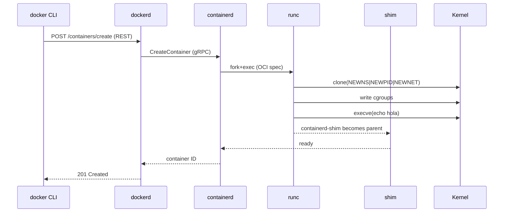

# Docker Engine 25 — arquitectura interna

## Cabecera
| Campo | Valor |
| --- | --- |
| **Resumen** | Arquitectura de Docker Engine 25: dockerd (REST API + state), containerd (gRPC daemon), runc (OCI runtime), shim (lifecycle por container), kernel namespaces/cgroups; flujo de docker run, puntos de fallo y cuellos de botella. |
| **Procedencia** | Docker 25 — Architecture (docs) §architecture · recuperado 2026-09-27 |
| **Versión** | Docker Engine 25 |
| **Estado** | Borrador (draft) |
| **Tiempo de lectura** | 5 min |

## TL;DR
Docker Engine se compone de dockerd (API REST), containerd (gRPC daemon), runc (OCI runtime) y containerd-shim (parent de cada container). Los containers usan kernel namespaces (PID, NET, MNT) y cgroups (CPU, MEM, BLKIO). {src:blk_a00000000050}

{layer:l2}

## Vista general
Docker Engine sigue el patrón daemon + shim: `dockerd` recibe comandos REST del CLI y los traduce a llamadas gRPC a `containerd`. `containerd` gestiona el ciclo de vida de los containers y delega la creación real al binario `runc`, que usa las primitives del kernel Linux (namespaces, cgroups, seccomp, capabilities). Cada container tiene un proceso `containerd-shim` como parent, lo que permite a `containerd` reiniciarse sin matar los containers. {src:blk_a00000000051}

:::diagram
```mermaid
flowchart LR
    CLI[docker CLI] -->|REST Unix socket| D[dockerd]
    D -->|gRPC| CT[containerd]
    CT -->|fork+exec| R[runc]
    R --> NS[Linux namespaces: PID, NET, MNT, UTS, IPC]
    R --> CG[cgroups v2: CPU, MEM, BLKIO]
    CT --> SH[containerd-shim]
    SH --> CT1[container 1]
    SH --> CT2[container 2]
# {src:blk_ccddeebf0001}
```
::: {src:blk_bbccddee0001}

## Componentes y responsabilidades
| Componente | Responsabilidad | Ubicación |
|---|---|---|
| `dockerd` | Daemon REST API; gestiona imágenes, redes, volúmenes y supervisa containers | proceso Unix; socket `/var/run/docker.sock` |
| `containerd` | Daemon gRPC que gestiona el ciclo de vida de containers e imágenes OCI | proceso Unix; socket `/run/containerd/containerd.sock` |
| `runc` | Binario OCI runtime que crea el container usando namespaces y cgroups | binario en PATH |
| `containerd-shim` | Proceso parent de cada container; permite que containerd reinicie sin matar containers | proceso por container |
| `Linux kernel` | Aísla containers con namespaces (PID, NET, MNT, UTS, IPC, USER) y limita recursos con cgroups v2 | kernel Linux 5.x+ |

## Flujo paso a paso

### Paso 1: CLI envía comando {src:blk_aabbccddee02}
`docker run alpine echo hola` → el CLI envía `POST /containers/create` al socket de dockerd con la imagen y el comando. {src:blk_a00000000052}

### Paso 2: dockerd traduce a gRPC {src:blk_aabbccddee03}
dockerd valida, gestiona el pull de la imagen y llama a containerd vía gRPC con la spec del container. {src:blk_a00000000053}

### Paso 3: containerd invoca runc {src:blk_aabbccddee04}
containerd hace `fork+exec` de `runc` pasando la spec OCI (namespaces, cgroups, mounts, capabilities). runc configura los namespaces con `clone()`, monta los cgroups, y hace `execve()` del comando. {src:blk_a00000000054}

### Paso 4: shim supervisa el container {src:blk_aabbccddee05}
runc termina tras `execve()`; el container queda bajo `containerd-shim`, que reenvía stdio y permite a containerd reiniciar sin afectar containers existentes. {src:blk_a00000000055}

:::diagram

::: {src:blk_bbccddee0006}

## Interacciones

| Origen | Destino | Protocolo | Frecuencia |
|---|---|---|---|
| CLI → dockerd | UNIX socket | REST/HTTP | por comando |
| dockerd → containerd | UNIX socket | gRPC | por container |
| containerd → runc | stdin/stdout | OCI bundle JSON | una vez por container |
| runc → kernel | syscalls | namespaces + cgroups | continuo |

## Estructuras en memoria y disco

### En memoria
| Estructura | Tamaño típico | Vida |
|---|---|---|
| `dockerd` Go heap | 100-500 MB según nº de containers | persistente |
| `containerd` Go heap | 50-200 MB | persistente |
| `containerd-shim` RSS | 10-30 MB por shim | volátil |
| `cgroups` del kernel | bytes × containers | volátil |

### En disco
| Archivo | Tamaño típico | Rotación |
|---|---|---|
| `/var/lib/docker/overlay2/<id>` | GB según imagen | hasta `docker image prune` |
| `/var/lib/docker/containers/<id>/` | logs + metadata | hasta `docker rm` |
| `/var/run/docker.sock` | socket UNIX | volátil |

## Puntos de fallo

:::danger
**dockerd caído → CLI no responde.** Si dockerd crashea, todos los comandos `docker` fallan; los containers siguen corriendo bajo containerd-shim. {src:blk_a00000000056} Mitigación: `systemd` watchdog reinicia dockerd; usar `nerdctl` (CLI directo a containerd) como bypass.
::: {src:blk_bbccddee0007}

:::warning
**containerd no disponible → no se pueden crear containers nuevos.** Containers existentes siguen corriendo bajo shim. {src:blk_a00000000057} Mitigación: `systemd` watchdog; alertas con `crictl ps` periódico.
::: {src:blk_bbccddee0008}

:::warning
**runc falla por namespace ya usado.** Si el mismo PID namespace está activo en otro container, runc retorna error. {src:blk_a00000000058} Mitigación: usar `host` network solo cuando sea explícito; nunca `--pid=host` salvo debugging.
::: {src:blk_bbccddee0009}

:::warning
**OOM killer mata un container por exceso de cgroup memory.** El container termina con SIGKILL sin warning previo. {src:blk_a00000000059} Mitigación: `--memory` y `--memory-swap` límites; alertas con `docker events --filter type=oom`.
::: {src:blk_bbccddee000a}

## Cuellos de botella

:::warning
**I/O en overlay2 layer.** Pull de imágenes grandes (~1 GB) puede tardar 30s en SSD; lectura/escritura de containers con bind-mounts sufre latencia del filesystem. Métrica: `iostat -x` sobre el device del docker dir. Mitigación: `--storage-driver=vfs` (overhead); imágenes multi-stage.
::: {src:blk_bbccddee000b}

:::warning
**Número de containers por host.** > 200 containers por host degrada dockerd (cada container = 1 shim). Métrica: `docker ps -q | wc -l`. Mitigación: sharding con Docker Swarm o Kubernetes.
::: {src:blk_bbccddee000c}

:::warning
**Network namespaces saturados.** Cada container con `--net=bridge` crea un par veth; > 1000 containers agotan las IDs de netns. Métrica: `ip netns list | wc -l`. Mitigación: CNI con IPAM compartido (Calico, Cilium).
::: {src:blk_bbccddee000d}

## Decisiones de diseño

:::note
**Daemon + shim.** Cada container tiene un shim parent; trade-off: +10 MB RSS por shim, pero containerd puede reiniciar sin matar containers.
::: {src:blk_bbccddee000e}

:::note
**Namespaces + cgroups (no VMs).** Containers son procesos Linux aislados; trade-off: aislamiento más débil que VMs, pero arranque en ms.
::: {src:blk_bbccddee000f}

## Backlinks
La arquitectura de Docker Engine se complementa con los subcomandos CLI, los errores de permisos del socket y la alternativa rootless; los enlaces muestran los 3 ángulos. {src:blk_a00000000062}

- [[note:docker-cli-bundle]] — los 15 subcomandos que orquestan esta arquitectura.
- [[note:docker-permission-errors]] — confundibles: errores típicos del socket.
- [[note:docker-rootless]] — alternativa sin daemon root.
