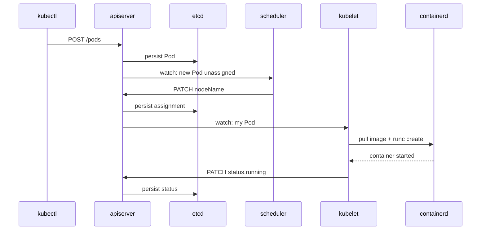

# Kubernetes 1.30 — arquitectura del control plane y worker nodes

## Cabecera
| Campo | Valor |
| --- | --- |
| **Resumen** | Arquitectura interna de Kubernetes 1.30: control plane (kube-apiserver, etcd, scheduler, controller-manager) y worker nodes (kubelet, kube-proxy, runtime); flujo de un Pod, puntos de fallo y cuellos de botella. |
| **Procedencia** | Kubernetes 1.30 — Components (docs) §components · recuperado 2026-09-27 |
| **Versión** | Kubernetes 1.30 |
| **Estado** | Borrador (draft) |
| **Tiempo de lectura** | 7 min |

## TL;DR
Kubernetes separa control plane (apiserver + etcd + scheduler + controller-manager) de worker nodes (kubelet + kube-proxy + runtime). Toda interacción pasa por el apiserver; etcd es la única fuente de verdad. {src:blk_a00000000030}

{layer:l2}

## Vista general
Kubernetes es un orquestador de containers con arquitectura de 2 niveles: control plane (toma decisiones globales) y worker nodes (ejecutan Pods). El componente central es `kube-apiserver` que expone la API REST y persiste el estado en `etcd`. Los nodos ejecutan `kubelet` que reporta capacidad y arranca Pods vía el container runtime (`containerd`, `cri-o`). {src:blk_a00000000031}

:::diagram
```mermaid
flowchart LR
    U[kubectl] -->|HTTPS| A[kube-apiserver]
    A --> E[(etcd)]
    A --> S[kube-scheduler]
    A --> CM[kube-controller-manager]
    CM --> A
    S --> A
    A -->|watch| K1[kubelet node-1]
    A -->|watch| K2[kubelet node-2]
    K1 --> CR1[containerd]
    K2 --> CR2[containerd]
    K1 --> P1[kube-proxy]
    K2 --> P2[kube-proxy]
# {src:blk_ccddeebf0001}
```
::: {src:blk_bbccddee0001}

## Componentes y responsabilidades
| Componente | Responsabilidad | Ubicación |
|---|---|---|
| `kube-apiserver` | API REST que valida y persiste el estado del cluster en etcd | pod estático en control plane |
| `etcd` | Key-value store distribuido; única fuente de verdad del cluster | pod estático (3 réplicas para HA) |
| `kube-scheduler` | Asigna cada Pod nuevo a un nodo según recursos, afinidad, taints | pod del control plane |
| `kube-controller-manager` | Ejecuta los controllers (Deployment, ReplicaSet, Node, Endpoint, etc.) | pod del control plane |
| `kubelet` | Agente en cada nodo; arranca Pods, reporta estado al apiserver | proceso en cada worker node |
| `kube-proxy` | Mantiene reglas iptables/IPVS para que los Services enruten tráfico | proceso en cada worker node |

## Flujo paso a paso

### Paso 1: kubectl aplica el manifest {src:blk_aabbccddee02}
El usuario ejecuta `kubectl apply -f pod.yaml`; el cliente envía un POST al apiserver con el YAML convertido a JSON. {src:blk_a00000000032}

### Paso 2: Apiserver valida y persiste {src:blk_aabbccddee03}
El apiserver autentica, autoriza (RBAC), ejecuta los admission webhooks, valida con el schema OpenAPI y escribe en etcd con un watch event. {src:blk_a00000000033}

### Paso 3: Scheduler decide el nodo {src:blk_aabbccddee04}
El scheduler ve el nuevo Pod (no asignado) y elige un nodo según recursos disponibles, afinidad, taints/tolerations. Marca el Pod con `spec.nodeName` via apiserver. {src:blk_a00000000034}

### Paso 4: Kubelet arranca el Pod {src:blk_aabbccddee05}
El kubelet del nodo elegido detecta que le asignaron un Pod, llama al container runtime (containerd) para pull la imagen y crear el container con los namespaces/cgroups. Reporta el estado al apiserver. {src:blk_a00000000035}

:::diagram

::: {src:blk_bbccddee0006}

## Interacciones

| Origen | Destino | Protocolo | Frecuencia |
|---|---|---|---|
| kubectl ↔ apiserver | HTTPS/6443 | REST + autenticación (cert o token) | por comando |
| apiserver ↔ etcd | gRPC | protocolo etcd v3 | por escritura |
| scheduler → apiserver | HTTPS | REST | continuo (loop) |
| kubelet → apiserver | HTTPS | REST + heartbeats cada 10s | continuo |
| kubelet → containerd | UNIX socket | CRI gRPC | por Pod |

## Estructuras en memoria y disco

### En memoria
| Estructura | Tamaño típico | Vida |
|---|---|---|
| `apiserver` heap | 1-4 GB (`--max-open-connections`) | persistente |
| `etcd` WAL en memoria | 8 GB (`--quota-backend-bytes`) | persistente |
| `kubelet` Pod cache | bytes × pods en el nodo | volátil |
| `kube-proxy` iptables rules | 10k-100k reglas según Services | volátil |

### En disco
| Archivo | Tamaño típico | Rotación |
|---|---|---|
| etcd data dir (`/var/lib/etcd`) | 8 GB máximo (`--quota-backend-bytes`) | compactación automática |
| etcd WAL (`Member WAL`) | 8 GB máximo | snapshot periódico |
| Container logs (`/var/log/pods/`) | 10 MB por Pod | rotación por kubelet |

## Puntos de fallo

:::danger
**etcd pierde quorum → cluster caído.** etcd requiere mayoría simple (2 de 3 réplicas); si 2 réplicas caen, el cluster se vuelve read-only. {src:blk_a00000000036} Mitigación: 3 réplicas en hosts diferentes; `etcdctl snapshot save` diario off-cluster.
::: {src:blk_bbccddee0007}

:::warning
**apiserver saturado por requests → latencia global.** El apiserver serializa escrituras; un cliente que hace miles de `kubectl get` puede degradar a todo el cluster. {src:blk_a00000000037} Mitigación: `--max-requests-inflight=2000` + `--max-mutating-requests-inflight=1000`; `PriorityLevelConfiguration` para rate-limit por namespace.
::: {src:blk_bbccddee0008}

:::warning
**kubelet pierde conectividad con apiserver.** El nodo reporta `NotReady` y los Pods siguen corriendo pero no se reasignan. {src:blk_a00000000038} Mitigación: lease de kubelet permite 40s sin reportar; alertas en `node Ready` flips.
::: {src:blk_bbccddee0009}

:::warning
**Scheduler backlog alto → Pods pendientes minutos.** Con 10k Pods y un scheduler de 1 réplica, los Pods pueden esperar > 5 min. {src:blk_a00000000039} Mitigación: scheduler con `percentageOfNodesToScore=50`; scheduler profile con `plugin configs` paralelos.
::: {src:blk_bbccddee000a}

:::warning
**Container runtime (containerd) down → nodo entero.** Si containerd crashea, todos los Pods del nodo entran en `NotReady`. {src:blk_a00000000040} Mitigación: `systemd` watchdog reinicia containerd; `runsc`/`kata` como runtime alternativo más aislado.
::: {src:blk_bbccddee000b}

## Cuellos de botella

:::warning
**Apiserver: serialización de escrituras.** ~1000 writes/s por apiserver; cada write requiere consenso en etcd (~10ms). Métrica: `apiserver_request_duration_seconds{verb=POST}`. Mitigación: HA con 3 apiserver detrás de LB; sharding por `--etcd-servers` separados.
::: {src:blk_bbccddee000c}

:::warning
**etcd: latencia del fsync.** Cada write a etcd requiere fsync (~1-10ms en SSD). Métrica: `etcd_disk_wal_fsync_duration_seconds`. Mitigación: SSD NVMe dedicado; `--quota-backend-bytes` para compactar agresivamente.
::: {src:blk_bbccddee000d}

:::warning
**kube-proxy: número de Services.** iptables escala a 10k Services; > 50k degrada el plano de datos. Métrica: `iptables-save | wc -l`. Mitigación: IPVS mode (`--proxy-mode=ipvs`); Cilium con eBPF.
::: {src:blk_bbccddee000e}

## Decisiones de diseño

:::note
**API declarativa.** El usuario declara el estado deseado; los controllers reconcilian; trade-off: latencia entre estado declarado y real.
::: {src:blk_bbccddee000f}

:::note
**etcd como única fuente de verdad.** Consistencia fuerte vía Raft; trade-off: scalability limitada por latencia de fsync.
::: {src:blk_bbccddee0010}

## Backlinks
La arquitectura de Kubernetes se complementa con el ciclo de vida del Pod, los recursos y los errores típicos del scheduler; los enlaces muestran los 3 ángulos. {src:blk_a00000000061}

- [[note:k8s-pod-resources]] — recursos que el scheduler evalúa.
- [[note:k8s-pod-lifecycle]] — fases del Pod que kubelet coordina.
- [[note:k8s-pod-pending-errors]] — confundibles: errores del scheduler/kubelet.
