# PostgreSQL 16 — arquitectura interna

## Cabecera
| Campo | Valor |
| --- | --- |
| **Resumen** | Arquitectura interna de PostgreSQL 16: procesos postmaster/backends/bgwriter/autovacuum, modelo de memoria shared_buffers/WAL, flujo de un query, puntos de fallo y cuellos de botella. |
| **Procedencia** | PostgreSQL 16 — Internals (docs) §internals · recuperado 2026-09-27 |
| **Versión** | PostgreSQL 16 |
| **Estado** | Borrador (draft) |
| **Tiempo de lectura** | 6 min |

## TL;DR
PostgreSQL usa un modelo de procesos (no threads): un postmaster coordina N backends por conexión, con procesos de fondo para WAL, bgwriter y autovacuum. El dataset vive en shared_buffers + heap files + WAL. {src:blk_a00000000010}

{layer:l2}

## Vista general
PostgreSQL es un SGBD relacional con arquitectura cliente-servidor basada en procesos Unix. Cada conexión cliente recibe un proceso backend dedicado (fork del postmaster); el aislamiento entre backends se logra vía memoria privada y locks sobre estructuras compartidas. El modelo de persistencia es write-ahead log (WAL) + checkpoints periódicos. {src:blk_a00000000011}

:::diagram
```mermaid
flowchart LR
    C[Cliente: psql] -->|TCP 5432| P[postmaster]
    P -->|fork| B1[backend 1]
    P -->|fork| B2[backend 2]
    P --> BW[bgwriter]
    P --> AV[autovacuum]
    P --> WW[walwriter]
    BW --> SB[shared_buffers]
    WW --> WAL[(WAL files)]
    AV --> HF[(heap files)]
# {src:blk_ccddeebf0001}
```
::: {src:blk_bbccddee0001}

## Componentes y responsabilidades
| Componente | Responsabilidad | Ubicación |
|---|---|---|
| `postmaster` | Proceso principal que escucha en 5432 y coordina la creación de backends | proceso Unix; `pg_ctl start` |
| `backend` | Proceso por conexión; parsea, planifica y ejecuta queries | fork del postmaster; ≤ `max_connections` |
| `bgwriter` | Escribe dirty pages de shared_buffers a heap files en background | proceso bgwriter |
| `walwriter` | Flush del WAL buffer a los WAL files en disco de forma asíncrona | proceso walwriter |
| `autovacuum` | Libera tuplas muertas y actualiza estadísticas del planner | workers autovacuum |

## Flujo paso a paso

### Paso 1: Conexión {src:blk_aabbccddee02}
El cliente abre TCP al 5432; el postmaster hace `fork()` de un nuevo backend dedicado (no thread). {src:blk_a00000000012}

### Paso 2: Parse + Plan {src:blk_aabbccddee03}
El backend recibe el query SQL, lo parsea (parser → árbol), lo reescribe (rewriter) y lo planifica (planner → plan tree con costos estimados). {src:blk_a00000000013}

### Paso 3: Ejecución {src:blk_aabbccddee04}
El executor recorre el plan tree y aplica operadores sobre shared_buffers (en RAM) o lee de heap files (en disco). Las escrituras se hacen primero en WAL buffer. {src:blk_a00000000014}

### Paso 4: Commit {src:blk_aabbccddee05}
Al hacer `COMMIT`, el walwriter flushea el WAL buffer a disco antes de retornar éxito al cliente (garantía WAL). El backend notifica al cliente con `CommandComplete`. {src:blk_a00000000015}

:::diagram

```mermaid
sequenceDiagram
    participant C as Cliente
    participant P as postmaster
    participant B as backend
    participant SB as shared_buffers
    participant W as walwriter
    participant D as Disco
    C->>P: CONNECT
    P->>B: fork()
    C->>B: SELECT * FROM t
    B->>SB: leer páginas
    SB-->>B: tuplas
    B-->>C: rows
    C->>B: UPDATE + COMMIT
    B->>W: flush WAL buffer
    W->>D: WAL file write+fsync
    W-->>B: OK
    B-->>C: CommandComplete
# {src:blk_ccddeebf0002}
```

::: {src:blk_bbccddee0006}

## Interacciones

| Origen | Destino | Protocolo | Frecuencia |
|---|---|---|---|
| Cliente ↔ postmaster/backend | TCP/5432 | protocolo v3 (`pgwire`) | por query |
| backend → shared_buffers | memoria compartida | IPC lock-free en lo posible | por acceso a página |
| walwriter → disco | fsync | llamada al sistema | cada ~200ms o al commit |
| bgwriter → disco | write + fsync | llamada al sistema | cada ~200ms |

## Estructuras en memoria y disco

### En memoria
| Estructura | Tamaño típico | Vida |
|---|---|---|
| `shared_buffers` | 25% de RAM (ej: 8 GB) | persistente, mmap a `base/pg_dir` |
| `WAL buffers` | 16 MB (config `wal_buffers`) | por sesión hasta flush |
| `backend work_mem` | 4-64 MB por query (config `work_mem`) | por sort/hash |
| Lock table | 16 MB (config `max_locks_per_transaction`) | persistente |

### En disco
| Archivo | Tamaño típico | Rotación |
|---|---|---|
| Heap files (`base/*/`) | 1 GB - 10 TB | nunca (viven hasta `VACUUM FULL`) |
| WAL files (`pg_wal/`) | 16 MB cada uno (config `wal_segment_size`) | reciclados tras `archive_command` o `max_wal_size` |
| `pg_xact/` (clog) | 1 página por 32k transacciones | truncado por `VACUUM` |

## Puntos de fallo

:::danger
**Crash durante WAL write → pérdida de la transacción no flusheada.** El WAL buffer puede contener el COMMIT antes del fsync; un crash del OS entre el write y el fsync rompe la durabilidad. {src:blk_a00000000016} Mitigación: `synchronous_commit = on` (default) o `on` + batería con redundancia de energía.
::: {src:blk_bbccddee0007}

:::warning
**Autovacuum no se ejecuta → table bloat.** Si autovacuum está deshabilitado o no puede obtener lock, las tuplas muertas se acumulan y el archivo de heap crece sin parar. {src:blk_a00000000017} Mitigación: monitorizar `pg_stat_all_tables.n_dead_tup` con `pgwatch2`; nunca deshabilitar autovacuum.
::: {src:blk_bbccddee0008}

:::warning
**Backend saturado por OOM en sort.** `work_mem = 256MB` × 100 conexiones activas con sort = 25 GB potenciales → OOM killer. {src:blk_a00000000018} Mitigación: `work_mem` bajo (16-64 MB); `pgbouncer` para multiplexar.
::: {src:blk_bbccddee0009}

:::warning
**Lock contention en `pg_stat_activity`.** `SELECT * FROM pg_stat_activity` toma `ACCESS SHARE` en `pg_database`; si otra transacción tiene `ACCESS EXCLUSIVE`, el query espera. {src:blk_a00000000019} Mitigación: usar `pg_stat_activity` con `pg_locks` solo en diagnóstico, no en monitoring automático.
::: {src:blk_bbccddee000a}

:::warning
**WAL archival falla → backups rotos.** Si `archive_command` retorna no-cero, PostgreSQL acumula WAL files y llena el disco. {src:blk_a00000000020} Mitigación: alertar con `archive_command` en `monit`; rate-limit WAL con `archive_timeout`.
::: {src:blk_bbccddee000b}

## Cuellos de botella

:::warning
**Disco I/O en WAL flush.** Throughput limitado por fsync (~1000-5000 ops/s en SSD; ~100-200 en HDD). Métrica: `pg_stat_wal.wal_write_time / wal_write_count`. Mitigación: SSD NVMe con `wal_compression = on` + `synchronous_commit = off` (si RPO de ms es aceptable).
::: {src:blk_bbccddee000c}

:::warning
**Lock manager en DDL.** `ACCESS EXCLUSIVE` lock bloquea todos los readers durante ALTER TABLE; tables grandes (> 100 GB) pueden tardar minutos. Métrica: `pg_locks.mode = AccessExclusiveLock` en `pg_stat_activity`. Mitigación: herramientas de schema migration online (pg_repack, pg_squeeze).
::: {src:blk_bbccddee000d}

:::warning
**Connection storms.** Sin pooler, picos de tráfico crean miles de backends que agotan `max_connections` (memoria + slots). Métrica: `pg_stat_activity.count` vs `max_connections`. Mitigación: `pgbouncer` en modo transaction; `max_connections = 100` con 1000 clients.
::: {src:blk_bbccddee000e}

## Decisiones de diseño

:::note
**Procesos, no threads.** PostgreSQL usa procesos Unix para backends por aislamiento de memoria y robustez (un crash de un backend no afecta a otros); trade-off: ~10 MB por backend, mayor fork overhead.
::: {src:blk_bbccddee000f}

:::note
**MVCC en lugar de locks pesimistas.** Cada transacción ve su propio snapshot vía `xmin`/`xmax`; trade-off: table bloat que requiere vacuum periódico.
::: {src:blk_bbccddee0010}

## Backlinks
La arquitectura interna de PostgreSQL se complementa con los conceptos (MVCC), la configuración (GUCs críticos) y los errores típicos; los enlaces muestran los 3 ángulos. {src:blk_a00000000060}

- [[note:postgresql-mvcc]] — modelo de visibilidad que explica el table bloat.
- [[note:postgresql-configuration]] — `shared_buffers`, `work_mem`, `max_connections`.
- [[note:postgres-connection-errors]] — confundibles: errores típicos del backend.
