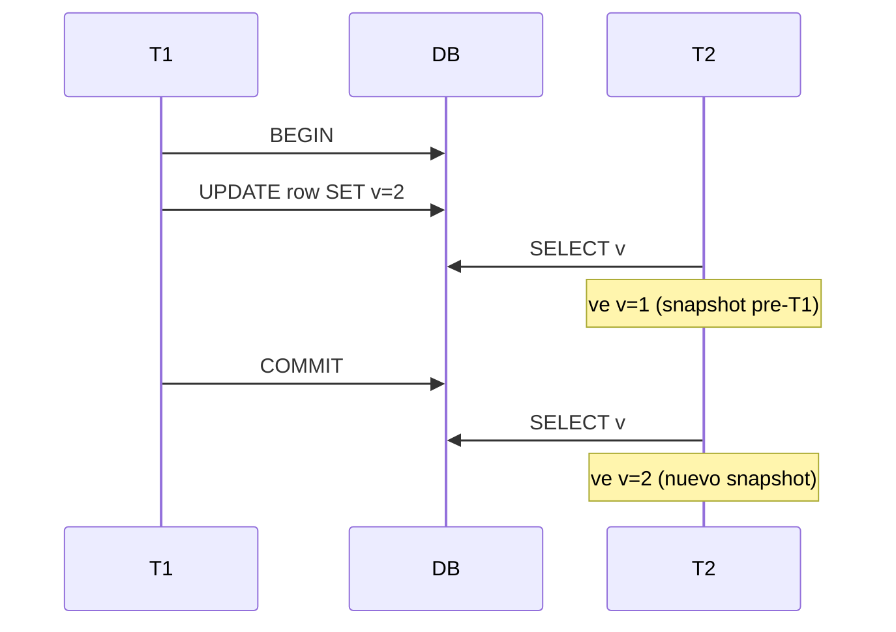

# MVCC (control de concurrencia multiversión)

## Cabecera
| Campo | Valor |
| --- | --- |
| **Resumen** | MVCC permite lecturas y escrituras concurrentes manteniendo un snapshot por transacción sin bloquear filas en disco. |
| **Procedencia** | PostgreSQL 16 — Chapter 13: Concurrency Control (docs) §13.1 Introduction · recuperado 2026-09-27 |
| **Versión** | PostgreSQL 16 |
| **Estado** | Borrador (draft) |
| **Tiempo de lectura** | 5 min |

## TL;DR
MVCC hace que cada transacción vea un snapshot consistente de la base de datos al iniciarse, sin leer los cambios que otras transacciones todavía no han confirmado. {src:blk_a91f8e02c1d3}

{layer:l2}

## Problema
Sin un mecanismo de versiones, una lectura larga bloquearía todas las escrituras sobre las filas que toca, y una escritura bloquearía todas las lecturas — degradación severa del throughput. {src:blk_b12c44f0a8e7}

## Intuición
Imagina una pizarra compartida: cada vez que alguien quiere cambiar algo, no borra la versión anterior, sino que dibuja la nueva encima. Quien lee, ve siempre la última versión **confirmada por completo** en el momento en que empezó a leer. {src:blk_1d3e8a92f7c4}

## Analogía
Como un libro con ediciones numeradas: la edición 1 no se destruye cuando aparece la edición 2. Un lector que compró la edición 1 sigue leyéndola aunque la edición 2 ya esté en las tiendas; las dos ediciones coexisten hasta que la vieja se descataloga. {src:blk_c7d3f1a025b9}

## Definición formal
Cada fila insertada recibe un `xmin` (id de transacción que la creó) y un `xmax` (id de transacción que la borró o reemplazó). Una transacción `T` ve una fila si `xmin` está confirmado y anterior a `T`, y `xmax` o no existe o es posterior a `T`. {src:blk_d84ae51cfb22}

| Variable | Significado |
|---|---|
| `xmin` | id de la transacción que insertó la fila |
| `xmax` | id de la transacción que la eliminó (NULL si vive) |
| `xid` | id de la transacción actual |

## Mecanismo
PostgreSQL implementa MVCC con `HeapTuple` visible/no visible por `xmin`/`xmax` en cada fila. Un `UPDATE` no modifica la fila: inserta una nueva versión y marca la anterior como borrada. Un `VACUUM` recicla las versiones sin referencias. {src:blk_e95bf62da133}



## Comparaciones
MVCC contrasta con el bloqueo pesimista tradicional en el coste de la concurrencia. {src:blk_45d7e219bf03}

| Aspecto | MVCC (PostgreSQL) | 2PL pesimista (MySQL InnoDB antiguo) |
|---|---|---|
| Lecturas concurrentes | sin bloqueos | comparten bloqueo compartido |
| Escrituras | nueva versión por fila | in-place + locks exclusivos |
| Latencia de lectura | uniforme, predecible | sensible a escrituras activas |

## Resumen
Cada fila lleva `xmin` y `xmax`; el snapshot decide visibilidad. `UPDATE` inserta versión, no modifica in-place; `VACUUM` reclama versiones huérfanas. {src:blk_46e8f32ac014}

- Cada fila lleva `xmin` y `xmax`; el snapshot decide visibilidad. {src:blk_f1c7a83b29d4}
- `UPDATE` inserta versión, no modifica in-place. {src:blk_f23a4b8e15c0}
- `VACUUM` reclama versiones huérfanas. {src:blk_b9d2e741fa6c}

## Trampas
:::warning
**Long-running transaction bloquea VACUUM.** Si una transacción `T` abierta ve versiones muertas, `VACUUM` no las puede reclamar y la tabla crece sin parar (`table bloat`). Solución: monitorizar `pg_stat_activity` y cancelar transacciones idle-in-transaction. {src:blk_8c5f2a917e44}
:::

:::warning
**`xid` wraparound.** PostgreSQL usa un contador de 32 bits para `xid`; tras ~4 mil millones de transacciones, los `xmin` antiguos parecen "del futuro". Solución: `VACUUM FREEZE` periódico; PostgreSQL 16 activa autovacuum agresiva cuando se acerca el límite. {src:blk_9d6e3b028f55}
:::

## Cuándo NO usarlo
MVCC no encaja cuando la consistencia o el espacio en disco son la prioridad absoluta; en esos casos, otros enfoques rinden mejor. {src:blk_47f9034bd125}

- Si necesitas consistencia fuerte entre réplicas síncronas → usa `[[note:synchronous-replication]]`. {src:blk_3a8c5f2d9711}
- Si necesitas evitar `table bloat` sin `VACUUM` → considera `[[note:append-only-log]]`. {src:blk_4f7b91c2e8d6}

## Límites y alternativas
MVCC asume que el coste de mantener versiones y ejecutar `VACUUM` es aceptable. Cuando no lo es, hay alternativas con trade-offs distintos. {src:blk_480a145ce236}

| Alternativa | Cubre | Trade-off |
|---|---|---|
| `[[note:two-phase-locking]]` | consistencia estricta | menos concurrencia |
| `[[note:append-only-log]]` | sin bloat | lectura más cara (compactación) |
| `[[note:optimistic-locking]]` | escrituras raras | rollback frecuente bajo contención |

## Relacionados
MVCC se complementa con el journal de transacciones y se opone al bloqueo pesimista; ambos extremos viven en el catálogo. {src:blk_491b256df347}

- `[[note:two-phase-locking]]` — el enfoque pesimista opuesto. {src:blk_5e3a8b1d7c4f}
- `[[note:wal]]` — el journal donde MVCC registra los `xid` confirmados. {src:blk_6d9c4a2f8e13}


## Práctica

:::question
**¿Qué garantiza el snapshot de una transacción en MVCC?** {src:blk_0000a1b2c3d4}

Que la transacción ve la base de datos en un estado consistente al momento de su primer `SELECT` o `BEGIN`, independientemente de las escrituras concurrentes que otras transacciones hagan después. {src:blk_0000a2c3d4e5}
:::

:::question
**¿Por qué `VACUUM` es esencial para MVCC?** {src:blk_0000a3d4e5f6}

Porque `UPDATE` y `DELETE` no eliminan físicamente las filas viejas, solo marcan `xmax`. Sin `VACUUM`, la tabla crece sin parar y se reduce el rendimiento de las consultas. {src:blk_0000a4e5f607}
:::

:::question
**¿Cómo afecta `xid` wraparound al comportamiento de MVCC?** {src:blk_0000a5f60718}

PostgreSQL usa un contador de 32 bits; al llegar cerca del límite, las transacciones antiguas se ven como "del futuro" y sus filas se vuelven invisibles, perdiendo datos. Solución: `VACUUM FREEZE` periódico que marca las filas como congeladas. {src:blk_0000a6071829}
:::

## Backlinks
MVCC es referenciado desde notas que profundizan en niveles de aislamiento y mantenimiento. {src:blk_4a2c367e0458}

- [[note:isolation-levels]] {src:blk_71fa5c39b0e2}
- [[note:vacuum-and-autovacuum]] {src:blk_82a6b41cf1d5}

## Queries
```dataview
LIST
FROM "notes"
WHERE contains(related, this.file.link)
SORT file.ctime DESC
```
