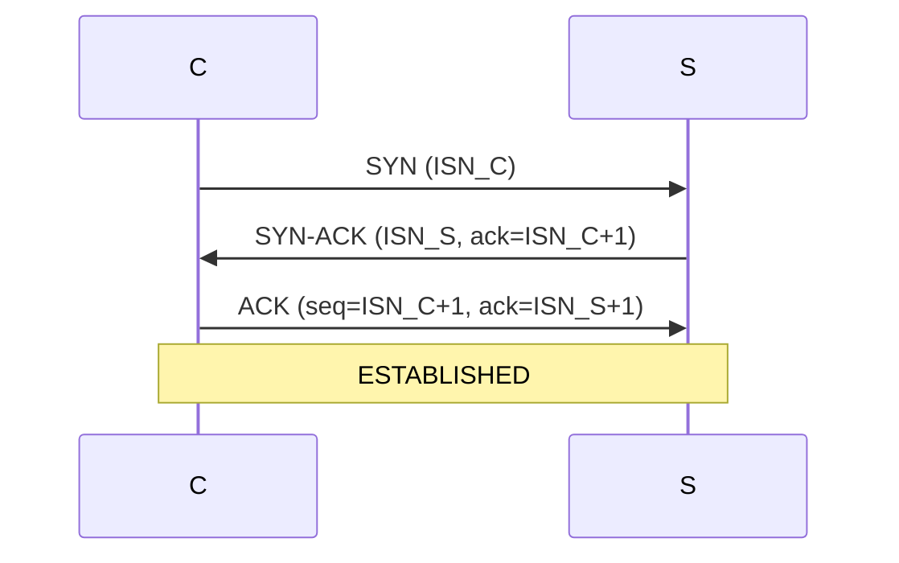

# Three-Way Handshake (establecimiento de conexión TCP)

## Cabecera
| Campo | Valor |
| --- | --- |
| **Resumen** | El 3WHS de TCP sincroniza ISN de cliente y servidor en 3 pasos antes de transmitir datos, garantizando que ambos extremos están listos. |
| **Procedencia** | RFC 9293 — Transmission Control Protocol (rfc) §3.5 Establishing a Connection · recuperado 2026-09-27 |
| **Versión** | TCP/IP RFC 9293 |
| **Estado** | Borrador (draft) |
| **Tiempo de lectura** | 4 min |

## TL;DR
TCP usa 3 segmentos (SYN, SYN-ACK, ACK) para sincronizar los números de secuencia iniciales (ISN) de cliente y servidor antes de cualquier dato. {src:blk_a01b9c7f3e22}

{layer:l2}

## Problema
Dos extremos que no se conocen deben acordar parámetros (ISN, ventana, MSS) sin saber si el otro está vivo ni qué estado tenía antes. {src:blk_b42c8d1eaa91}

## Intuición
Como una llamada telefónica: quien llama marca, el receptor descuelga y dice "diga", y quien llama responde "diga, soy yo" antes de empezar la conversación real. {src:blk_2e8b4f61d3a7}

## Analogía
Como un apretón de manos en tres tiempos: A extiende la mano, B la estrecha, A confirma con un apretón final. Sin el tercer movimiento, ninguno de los dos sabe si el otro está realmente listo. {src:blk_c7f3e0a51bcd}

## Definición formal
Tres segmentos: cliente envía SYN con ISN_C; servidor responde SYN-ACK con ISN_S y `ack = ISN_C + 1`; cliente envía ACK con `seq = ISN_C + 1` y `ack = ISN_S + 1`. Tras el ACK, ambos extremos entran en `ESTABLISHED`. {src:blk_d88a1f62c4e7}

| Campo | Significado |
|---|---|
| ISN_C | número de secuencia inicial del cliente |
| ISN_S | número de secuencia inicial del servidor |
| SYN | flag de sincronización |
| ACK | flag de acknowledgement |

## Mecanismo
Cada lado genera un ISN pseudoaleatorio (mitigación de spoofing). El servidor aloca recursos (TCB, buffers) al enviar SYN-ACK; si el ACK del cliente no llega, agota el timeout y libera. La retransmisión del SYN usa backoff exponencial. {src:blk_e95cf12a08b3}

El handshake aporta además protección frente a segmentos duplicados de conexiones anteriores: cada SYN lleva un ISN nuevo, y los segmentos con ISN antiguo son descartados por el receptor. {src:blk_6f7a8b9c0d1e}



## Comparaciones
TCP 3WHS contrasta con UDP (sin handshake) en coste y semántica. {src:blk_55e8f32ac014}

| Aspecto | TCP 3WHS | UDP (sin handshake) |
|---|---|---|
| Acuerdo previo | ISN + ventana | ninguno |
| Coste en RTT | 1 RTT extra antes de datos | 0 |
| Resistencia a spoofing | alta (ISN aleatorio) | baja |

## Resumen
3 segmentos: SYN, SYN-ACK, ACK. Cada extremo fija su ISN antes de transmitir datos; el servidor aloca recursos desde el SYN-ACK, no espera al ACK. {src:blk_56f9034bd125}

- 3 segmentos: SYN, SYN-ACK, ACK. {src:blk_f1c8a37b29d4}
- Cada extremo fija su ISN antes de transmitir datos. {src:blk_e2b4c91d8f3a}
- El servidor aloca recursos desde el SYN-ACK, no espera al ACK. {src:blk_c5a7e2369b81}

## Trampas
:::warning
**SYN flood.** Un atacante envía muchos SYN sin completar el ACK, agotando los buffers del servidor. Solución: SYN cookies (codifican ISN+estado en el ISN_S). {src:blk_7b1e4c92d3a8}
:::

:::warning
**Half-open connections.** Si un extremo se reinicia tras enviar SYN-ACK, el otro queda esperando ACK indefinidamente. Solución: TCP keepalive (RFC 9293 §3.8.4) o timeouts de aplicación. {src:blk_8c2f5da3e4b9}
:::

## Cuándo NO usarlo
El handshake de 3 pasos añade 1 RTT antes de enviar datos; cuando la latencia es crítica o el flujo confiable no es necesario, hay alternativas. {src:blk_570a145ce236}

- Latencia crítica < 1 RTT → usa `[[note:tcp-fast-open]]` (datos en el SYN). {src:blk_94d3e8a1c2f5}
- Sin necesidad de flujo confiable → usa `[[note:udp]]`. {src:blk_a1f5c72b9e3d}

## Límites y alternativas
El 3WHS añade 1 RTT antes de cualquier dato; cuando ese coste es prohibitivo, hay variantes que lo eliminan o lo absorben en el primer paquete. {src:blk_581b256df347}

| Alternativa | Cubre | Trade-off |
|---|---|---|
| `[[note:tcp-fast-open]]` | datos en el SYN | requiere cookie y soporte en el server |
| `[[note:quic]]` | handshake 1-RTT | nueva pila, no es TCP |
| `[[note:sctp]]` | multi-homing | despliegue muy inferior |

## Relacionados
El 3WHS es la mitad del ciclo de vida de una conexión TCP; su cierre y su recuperación ante pérdida son los conceptos vecinos naturales. {src:blk_592c367e0458}

- `[[note:tcp-four-way-teardown]]` — cierre en 4 segmentos. {src:blk_b7e2c814fa05}
- `[[note:tcp-retransmission]]` — recuperación tras pérdida de ACK. {src:blk_c8f3d9250b16}

## Backlinks
El 3WHS aparece referenciado en la nota que recorre los estados completos de una conexión TCP. {src:blk_5a3d478f1569}

- [[note:tcp-state-machine]] {src:blk_d4a91e6f3c82}

## Queries
```dataview
LIST
FROM "notes"
WHERE contains(related, this.file.link)
SORT file.ctime DESC
```
