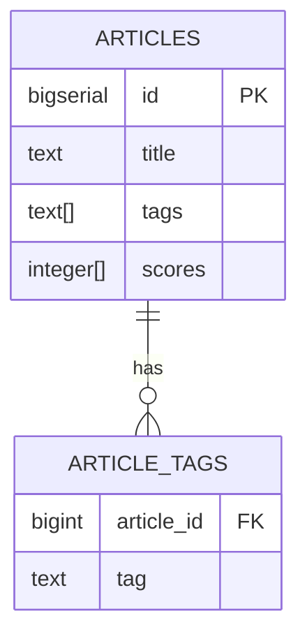

# Arrays in PostgreSQL 16

## TL;DR

PostgreSQL arrays let you store lists of values of the same type inside a single column. They are useful for many-to-one relationships (tags, categories, simple lists) and avoid the overhead of a child table when you don't need full relational power. {src:blk_a1b2c3d4e5f6}

## Definición

An array is a one-dimensional collection of values sharing the same type. PostgreSQL supports arrays of any built-in or user-defined type. {src:blk_b2c3d4e5f6a7}

### Sintaxis de declaración

```sql
CREATE TABLE articles (
    id          bigserial PRIMARY KEY,
    title       text NOT NULL,
    tags        text[] DEFAULT '{}',
    scores      integer[]
);
```

The square brackets `[]` after the type mark the column as an array. {src:blk_c3d4e5f6a7b8}

## Características

PostgreSQL arrays are powerful but should be used judiciously. The following table compares when to use arrays vs. junction tables.

| Criterio | Array column | Junction table |
|---|---|---|
| Cardinality (typical) | small (≤ 100) | large or unbounded |
| Query pattern | "contains X" | JOINs, aggregations |
| Index strategy | GIN over the array column | B-tree on FK |
| Normalization | violates 1NF | fully normalized |
| Write cost | single INSERT | INSERT + N INSERTs |
| Read cost | SELECT with `= ANY` | JOIN |
| Constraints | array-level CHECK | FK constraints |
| Update cost | rewrite whole array | targeted UPDATE |
| Atomicity | per row | per row + per child |
| Portability | PostgreSQL-specific | standard SQL |
| Examples | tags, categories | users × roles |

> [!info] When to prefer arrays
> Arrays shine when the inner data is **bounded, immutable, and queried as a set**. Example: a list of categories per article.

> [!warning] When to avoid arrays
> Avoid arrays when you need to JOIN the inner data as a first-class entity, or when the cardinality is unbounded. The 1NF violation makes some queries awkward. {src:blk_d4e5f6a7b8c9}

> [!danger] Array size limits
> PostgreSQL limits arrays to **134 million elements** (1 GB total row size). Practical limits are much smaller; benchmark with 10K+ elements.

> [!example] GIN index for array contains
> Use a GIN index for fast `tags @> ARRAY['postgres']` queries.

> [!tip] Array functions
> `array_append`, `array_remove`, `unnest`, `array_agg` are your friends.

## Indexación con GIN

Arrays benefit from a GIN (Generalized Inverted Index) index. {src:blk_e5f6a7b8c9d0}

```sql
CREATE INDEX articles_tags_gin ON articles USING GIN (tags);
```

This makes `@>`, `&&`, and `=` operators index-accelerated.

## Modelo de datos (ERD)



> [!note] See also
> The ERD above shows a hybrid pattern: keep tags as an array for fast lookup, and join with ARTICLE_TAGS only if you need per-tag analytics.

## Anti-patrones

- **Storing relational data as arrays.** If you find yourself joining array elements in many queries, model them as a junction table.
- **No length cap.** A user can insert a 10K-element array; add a CHECK constraint. {src:blk_f6a7b8c9d0e1}
- **JSON inside arrays.** Use `jsonb` columns instead of `text[]` if the inner data has structure.

## Comparativa con otros motores

| Database | Native arrays | Element type | Index |
|---|---|---|---|
| PostgreSQL | ✅ (1D, any type) | any | GIN |
| MySQL | ❌ (use JSON) | n/a | n/a |
| SQL Server | ❌ (use XML/JSON) | n/a | n/a |
| Oracle | ✅ (VARRAY / nested tables) | any | limited |
| MongoDB | ✅ (1D + nested) | any | multikey |

## Ver también

- `depth-layers.md` — L1/L2/L3 in arrays of references.
- `block-directives.md` — `:::param-table` for documenting array parameters.

{src:blk_a1b2c3d4e5f6}
{src:blk_b2c3d4e5f6a7}
{src:blk_c3d4e5f6a7b8}
{src:blk_d4e5f6a7b8c9}
{src:blk_e5f6a7b8c9d0}
{src:blk_f6a7b8c9d0e1}
