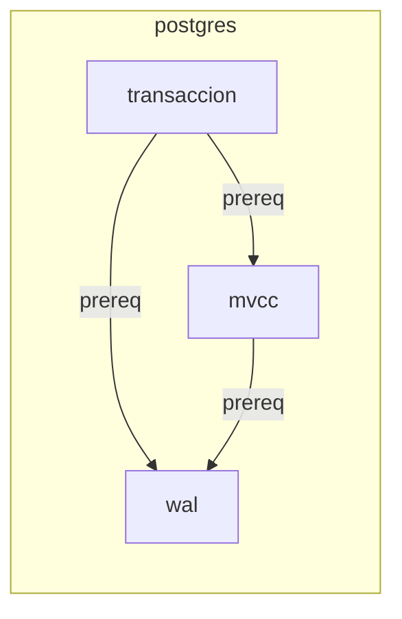

# Grafo de prerrequisitos — `references/03-knowledge/concept-graph.md`

> Documento normativo de la **Fase 39** del roadmap. Define cómo se deriva el grafo de conceptos y prerrequisitos a partir del Coverage Ledger (F15/F38) y del SDM (F13), y cómo opera el script `scripts/util/concept_graph.py` que lo produce y consulta.
>
> Documentos complementarios: `references/03-knowledge/ledger.md` (F15, forma del ledger; este doc lo lee), `references/03-knowledge/ledger-operativo.md` (F38, mantenimiento del ledger), `references/03-knowledge/information-units.md` (F37, taxonomía de tipos — particularmente `definition` y `cross-reference`), `schemas/concept-graph.schema.json` (este doc, contrato del JSON), `schemas/profile.schema.json::graph.cycle_policy` (este doc lo respeta), `scripts/util/concept_graph.py` (este doc, su CLI).
>
> Enrutado desde N2: `docs/skill-anatomy.md` §6 fila `F39`. Lo lee el agente en L2 para construir el grafo; lo consume F44 (note-plan) y F104 (rutas de lectura); F43 (auditoría) lo verifica; F118 (evals) lo mide.

## §1 · Propósito y alcance

El grafo de prerrequisitos es una **proyección derivada** del Coverage Ledger: cada `definition` unit del ledger se convierte en un nodo-concepto, cada `cross-reference` con `content.relation: "prerequisite"` se convierte en una arista. No se escribe a mano; se regenera con `concept_graph.py build` a partir del ledger y del SDM.

**Sí es**:
- Una vista navegable del corpus que muestra qué conceptos dependen de cuáles.
- La base para que F44 (note-plan) emita notas en el orden correcto de lectura.
- La entrada de F104 (rutas de lectura) para generar dos rutas por dominio hasta un concepto objetivo.

**No es**:
- La fuente de verdad del corpus (esa es el SDM y el ledger). Si el grafo diverge, el ledger gana.
- Un grafo de flujo de control, ni un grafo de llamadas, ni un árbol sintáctico. Es exclusivamente de **dependencias conceptuales**.
- Una vista editorial (no incluye cajas, advertencias ni procedimientos — esos viven en el ledger).

## §2 · Cuándo se aplica

| Capa / fase | Lee este doc cuando… |
|---|---|
| L2 (agente al construir el grafo) | Tras crear el ledger (F38), corre `concept_graph.py build` para derivar `knowledge/concept-graph.json`. |
| F44 (note-plan) | Consume `concept-graph.json` para decidir el orden de las notas (topological sort por dominio). |
| F104 (rutas de lectura) | Consume `concept-graph.json` para emitir ≥ 2 rutas por dominio. |
| F43 (auditoría de no-pérdida) | Ejecuta `concept_graph.py check --strict` para confirmar que no hay ciclos ni aristas colgantes. |
| F118 (suite automatizada) | Corre `evals/concept-graph-sample/run_eval.py` para verificar los criterios del roadmap. |

**No se aplica a**: ingesta (L0–L1), autoría (L3), render (L4). El grafo se queda en `knowledge/` y nunca se publica.

## §3 · Modelo del grafo

**Nodos** (conceptos): derivados de unidades `type=definition` del ledger.

| Campo | Tipo | Descripción |
|---|---|---|
| `concept_id` | string | Slug kebab-case del término definido (e.g. `"transaccion"`, `"mvcc"`). |
| `domain` | string | `vendor+product` del `source` del SDM (F34 provenance); `"unknown"` si falta vendor/product. |
| `definition_unit_id` | string | `unit_id` de la unidad `definition` que origina el nodo. |
| `section_path` | string | `source_section_path` de la unidad. |
| `label` | string | Texto de la definición (cortado a 80 chars para el Mermaid). |

**Aristas** (prerequisites): derivadas de unidades `type=cross-reference` con `content.relation: "prerequisite"`.

| Campo | Tipo | Descripción |
|---|---|---|
| `from_concept_id` | string | Concepto que depende (la unidad `cross-reference` lo origina). |
| `to_concept_id` | string | Concepto del que depende (`content.target_concept`). |
| `relation` | string | Constante `"prerequisite"`. |
| `source_unit_id` | string | `unit_id` de la unidad `cross-reference` que origina la arista. |

Una unidad `cross-reference` sin `content.relation: "prerequisite"` **no** genera arista (puede ser una referencia bibliográfica, una mención lateral, etc.).

## §4 · Reglas de derivación

Lista cerrada. El script aplica estas reglas mecánicamente; no inventa nodos ni aristas.

- **R1 (nodos)**: toda unidad del ledger con `type=definition` produce un nodo. Si el `content.text` no es derivable a `concept_id` slug, el script emite WARNING y excluye el nodo.
- **R2 (aristas)**: toda unidad con `type=cross-reference` y `content.relation=="prerequisite"` y `content.target_concept` no vacío produce una arista. Ausencia de `relation` o `target_concept` → sin arista (WARNING si el agente lo declara explícitamente como prereq incompleto).
- **R3 (cycle policy)**: el script lee `profile.yaml::graph.cycle_policy` (default `block`). Con `block` exit 1 si hay ciclos; con `allow` los registra en `cycles[]` y continúa.
- **R4 (dominio)**: `domain = "<vendor>+<product>"` si ambos están presentes en `source` del SDM; `domain = "unknown"` en caso contrario. Las rutas se calculan por dominio.
- **R5 (rutas)**: por cada `goal_concept_id` por dominio se calculan 2 rutas: `shortest` (Dijkstra, peso 1 por arista) y `broadest` (DFS que prefiere visitar más nodos aunque incremente la longitud). Si el dominio tiene < 2 nodos, solo `shortest` (puede coincidir con `broadest`).
- **R6 (concepto huérfano)**: si `to_concept_id` de una arista no existe como nodo, la arista se omite y se registra en `dangling_edges[]` con WARNING a stderr. No bloquea (puede ser intencional: "este concepto se definirá en otro capítulo").
- **R7 (orden de nodos)**: `nodes[]` se ordena por `(domain, concept_id)` lexicográfico para reproducibilidad.
- **R8 (orden de aristas)**: `edges[]` se ordena por `(from_concept_id, to_concept_id)`.

## §5 · Forma JSON canónica

```json
{
  "schema_version": "1.0.0",
  "source": { "id": "...", "hash": "<sha256 hex 64>", "vendor": "...", "product": "..." },
  "domain": "<vendor+product | unknown>",
  "nodes": [...],
  "edges": [...],
  "cycles": [{ "cycle": ["a", "b", "a"], "policy": "block|allow", "resolved": false }],
  "routes": [{ "domain": "...", "goal_concept_id": "...", "strategy": "shortest|broadest", "path": [...], "length": N }],
  "dangling_edges": [{ "from_concept_id": "...", "to_concept_id": "...", "source_unit_id": "..." }],
  "build_metadata": { "built_at": "<ISO-8601>", "ledger_hash": "<sha256>", "sdm_hash": "<sha256>" }
}
```

## §6 · CLI subcomandos

```
concept_graph.py [--workdir PATH] [--profile PATH] <subcommand> [args]
```

| Sub | Propósito | Salida | Exit |
|---|---|---|---|
| `build` | Deriva el grafo desde ledger + SDM; respeta `cycle_policy`. | `knowledge/concept-graph.json` (atómico) | 0/1/2 |
| `routes [--goal <id>] [--domain <d>] [--strategy shortest\|broadest\|all]` | Imprime las rutas calculadas. Sin `--goal` imprime todas. | Texto a stdout | 0/1 |
| `export [--out-dir <dir>]` | Emite un `.mmd` por dominio. | `<dir>/<domain>/graph.mmd` | 0/1/2 |
| `check` | Detecta ciclos y aristas colgantes sin escribir. | Texto a stdout | 0/1 |

Códigos: `0` OK, `1` validación (ciclos con `block`), `2` uso.

## §7 · Detección y resolución de ciclos

Algoritmo DFS iterativo con marcas (white/gray/black) sobre el subgrafo del dominio objetivo.

- `white` = no visitado.
- `gray` = en el stack actual (back edge en `gray` → ciclo).
- `black` = procesado.

Cuando un `gray` revisita otro `gray`, el ciclo es la porción del stack desde el nodo actual hasta el nodo repetido. Se reporta como `cycles[]`. Si `cycle_policy == "block"`, el script exit 1 con la lista de ciclos.

Para grafos grandes (>1000 nodos) el algoritmo es O(V+E) lineal. Implementación: dict `color: {concept_id -> "white|gray|black"}` + stack.

`resolved: false` indica que el ciclo está pendiente de intervención manual (renombrar, fusionar o eliminar una arista). `resolved: true` se setea solo cuando el agente edita el grafo a posteriori (futuro, no en F39).

## §8 · Rutas de lectura

**Shortest path**: Dijkstra clásico con peso 1 por arista. Implementación: cola de prioridad `(dist, node)`; inicializa `dist[goal] = 0`, todos los demás `∞`. Devuelve el camino desde cualquier nodo del dominio hasta `goal`. Si `goal` no es alcanzable, devuelve `path: []`.

**Broadest path**: DFS desde cada nodo del dominio, priorizando el nodo con más descendientes en cada paso (greedy). Penaliza aristas que llevan a nodos sin salidas (hojas); prefiere nodos que abren nuevas sub-ramas. Implementación: pila `(node, visited)` + `score(node) = out_degree(node)`. Devuelve el camino más largo (en número de nodos visitados) que termina en `goal`.

Si el dominio tiene un solo nodo o `goal` no existe, `routes[]` contiene solo `shortest` (puede ser `[goal]` si se pide desde el goal mismo).

## §9 · Exportación Mermaid

Sintaxis `flowchart LR` (left-to-right para mejor lectura). Estructura por dominio:



Reglas:
- IDs Mermaid = `concept_id` con guiones bajos (Mermaid no soporta guiones en IDs).
- Labels = `concept_id` (sin truncado en Mermaid; el script lo deja legible).
- Aristas con `-->|prereq|` siempre (constante; el grafo es solo de prerrequisitos).
- Ciclos no se renderizan en Mermaid (Mermaid no los soporta bien); el script emite un comentario HTML al inicio: `%% cycles: A→B→A`.
- Aristas colgantes se omiten del Mermaid (con `dangling_edges[]` en el JSON).

## §10 · Cómo verificar + cambios permitidos

```bash
# 1. Spec dentro de presupuesto.
wc -l references/03-knowledge/concept-graph.md              # ≤ 230
rg -c '^## §' references/03-knowledge/concept-graph.md      # 11 secciones

# 2. CLI funcional.
python3 scripts/util/concept_graph.py --help                # 4 subcomandos

# 3. Eval de los 3 criterios del roadmap.
python3 evals/concept-graph-sample/run_eval.py             # exit 0

# 4. Sin regresión.
python3 scripts/util/validate_ledger.py --validate evals/ledger-sample/*.json  # F15 OK
python3 evals/information-units-sample/run_eval.py                             # F37 OK
python3 evals/ledger-operativo-sample/run_eval.py                              # F38 OK

# 5. Cero mención a plataformas (INV-06).
rg -i 'obsidian|notion|appflowy' references/03-knowledge/concept-graph.md     # vacío
```

**Permitidos sin reabrir F39** (versión menor):
- Añadir un campo opcional al JSON (`additionalProperties: false` exige bumpear `schema_version`).
- Añadir una nueva estrategia de ruta (e.g., `"weighted"`).
- Añadir un nuevo campo a `routes[]` (e.g., `weight: number`).
- Refinar el wording de §1.

**Reabren F39** (versión mayor):
- Cambiar la fuente de nodos (R1) o de aristas (R2).
- Eliminar el soporte de `cycle_policy: allow`.
- Cambiar la definición de `domain` (R4).
- Cambiar la forma de `concept_id` (slug).
- Eliminar `dangling_edges[]`.

## §11 · Cambios que reabren + glosario

**Reabren F39 además de §10**:
- Cambiar el formato de exportación Mermaid (R6 de la tabla §10 cubre casos de campo, no de sintaxis).
- Cambiar el algoritmo de rutas (Dijkstra → otro).
- Cambiar la política de cycle handling (SCC, Tarjan, etc.).
- Eliminar la opción `--strategy`.

**No reabren F39**:
- Refinar mensajes de error.
- Cambiar el path por defecto del workdir.

**Glosario**:

| Término | Significado |
|---|---|
| **Concepto** | Nodo del grafo; corresponde a una unidad `definition` del ledger. |
| **Prerrequisito** | Arista dirigida de un concepto a otro del que depende. |
| **Dominio** | `vendor+product` del SDM; agrupa conceptos de la misma obra. |
| **Ruta de lectura** | Secuencia ordenada de conceptos que lleva a un `goal_concept_id`. |
| **Arista colgante** | `to_concept_id` que no existe como nodo; registrado en `dangling_edges[]`. |
| **Ciclo** | Secuencia `A → B → ... → A` en el grafo; bloquea por defecto (`cycle_policy: block`). |
