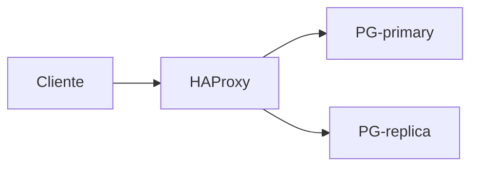

# Block directives — `references/04-authoring/block-directives.md`

> Documento normativo de la Fase 45 del roadmap. Catálogo operativo de las 22 directivas
> de bloque del formato NoteMark: sintaxis, atributos, contenido permitido, cuándo usarlas,
> fronteras con directivas vecinas, reglas de anidamiento y de longitud.
>
> Documentos relacionados:
> - [`notemark.md`](notemark.md): gramática legible, marcas inline, frontmatter, layer markers.
> - [`notemark.ebnf`](notemark.ebnf): gramática formal (47 reglas, 75 líneas). **No se duplica aquí.**
> - [`ir-spec.md`](ir-spec.md): nodos del Note IR a los que cada directiva mapea.
> - [`../03-knowledge/ledger.md`](../03-knowledge/ledger.md): cómo se decide si una unidad va en una directiva o se descarta.
> - [`properties.md`](properties.md) (F47): frontmatter canónico; `:::property` es local a un bloque, no global.

## §1 · Propósito y alcance

Este documento es la **referencia operativa** que el agente consulta en L3 cuando va a
insertar una directiva de bloque en una nota. Responde cinco preguntas por directiva:

1. ¿Cuál es su sintaxis exacta y qué atributos admite?
2. ¿Qué tipo de contenido puede vivir dentro?
3. ¿Cuándo se usa? (disparadores observables en el SDM)
4. ¿Cuándo **no** se usa? (confusiones típicas con directivas frontera)
5. ¿Qué ejemplo canónico y qué anti-ejemplo la separan del resto?

`notemark.md` §6 documentaba las directivas mezcladas con marcas inline, frontmatter y
layer markers. La Fase 45 las extrae a este documento y añade tres piezas que faltaban:
la **tabla de decisión rápida** (§6), la **tabla de fronteras** (§7) y las **reglas
de anidamiento y longitud** (§8-§9).

**No es:** documentación de marcas inline (`{src:}`, `[[term:]]`, etc. → `inline-marks.md`
F46), ni del frontmatter canónico (`title`, `note-type`, etc. → `properties.md` F47), ni
de la gramática EBNF (→ `notemark.ebnf`).

## §2 · Cuándo se aplica

- Cualquier redacción de una nota nueva en L3.
- Cualquier revisión de una nota existente que necesite reorganizar admonitions.
- Cualquier regeneración desde el IR (vuelta atrás por error de render).

**No se aplica a:** ingesta (F17-F29), render (F54-F60), validación del IR (F49),
publicación (F62). El parser (F48) consume este documento como especificación; los
renderers (F54-F60) lo consultan para capacidades por directiva.

## §3 · Reglas duras (invariantes)

| ID | Invariante | Si se omite… |
|---|---|---|
| **INV-05** | El agente escribe NoteMark, nunca Markdown de destino ni JSON de IR a mano. | Los destinos no-Obsidian quedan rotos en silencio. |
| **INV-06** | NoteMark no contiene sintaxis de ninguna plataforma (`> [!warning]`, toggles de Notion, wikilinks sin prefijo `note:`/`term:`). | El parser produce nodos ambiguos y un destino se vuelve oráculo. |
| **INV-14** | Cero colores literales. Tokens via `assets/tokens.json` (F72). | INV-14 violación; las directivas no llevan color de fondo — el renderer lo decide. |
| **INV-D1** *(F45)* | Toda directiva fáctica lleva `{src:blk_xxxx}` enlazado al SDM cuando el hecho viene de la fuente. | La nota "explica" lo que la fuente no dice. Excepción: `:::danger`, `:::tip` y `:::external` pueden no llevarlo (advice operativo, knowledge externo). |
| **INV-D2** *(F45)* | La lista cerrada de directivas es exactamente las 22 documentadas en §10. Añadir una nueva requiere reabrir F45. | El parser (F48) y los renderers (F54-F60) no la reconocen; la nota queda rota en silencio. |
| **INV-D3** *(F45)* | Una directiva nunca se anida con otra del mismo tipo (anti-patrón: `:::warning` ⊃ `:::warning`). | Ruido visual; consolidar el texto. |
| **INV-D4** *(F45)* | La profundidad de anidamiento nunca supera 3 niveles. | Incomprensible en Obsidian y Notion; ilegible en MD/HTML. |

## §4 · Relación con otros documentos

| Documento | Rol | Cómo se conecta con `block-directives.md` |
|---|---|---|
| `notemark.md` | Gramática legible de NoteMark + marcas inline + frontmatter + layers. | §5 de `notemark.md` mantiene la tabla IR ↔ NoteMark; §6 reescrita apunta aquí. |
| `notemark.ebnf` | Gramática formal EBNF (47 reglas). | Cada entrada en §10 referencia la regla EBNF correspondiente; este doc **no duplica** la gramática. |
| `ir-spec.md` (F14) | Catálogo de nodos del Note IR. | §5 de este doc mapea directiva → nodo IR; §10 de este doc repite el mapeo por entrada. |
| `properties.md` (F47) | Frontmatter canónico (`title`, `note-type`, etc.). | `:::property` (§10.22) es metadata **local** a un bloque; el frontmatter es metadata **global** del archivo. |
| `inline-marks.md` (F46) | Marcas inline (`{src:}`, `[[term:]]`, etc.). | Las directivas pueden llevar marcas inline; este doc explica cuáles admite cada una (sección "Contenido permitido" de §10). |
| `../00-pipeline/architecture.md` | Capas L0-L4 y workdir. | L3 produce NoteMark; el parser (F48) lo convierte al IR usando este doc como spec. |

## §5 · Visión general

Las 22 directivas se agrupan en **cuatro categorías**:

| Categoría | Miembros | Función |
|---|---|---|
| **Admonitions canónicas** (12) | `warning`, `note`, `tip`, `example`, `danger`, `security`, `performance`, `version`, `deprecated`, `conflict`, `external`, `derived` | Marcar semánticamente un hecho corto del SDM. Una idea por bloque. |
| **Bloques compuestos** (8) | `collapsible`, `columns`, `param-table`, `step`, `question`, `diagram`, `figure`, `equation` | Contenedores con estructura interna específica. |
| **Bloques hoja** (1) | `console` | Transcripción literal de sesión CLI. |
| **Property-block** (1) | `property` | Metadata local a un bloque (YAML dentro del bloque). |

Mapeo de directivas a nodos del Note IR (F14):

| Directiva | Nodo IR | Notas |
|---|---|---|
| `:::warning`, `:::note`, `:::tip`, `:::example`, `:::danger`, `:::security`, `:::performance`, `:::version`, `:::deprecated`, `:::conflict`, `:::external`, `:::derived` | `admonition` (12 subtipos via `subKind`) | Una sola sintaxis IR, discriminada por `subKind`. |
| `:::collapsible` | `collapsible` | |
| `:::columns` | `columns` | Dos columnas separadas por línea en blanco. |
| `:::param-table` | `parameter-table` | Tabla GFM con columnas canónicas `name/type/default/range`. |
| `:::step` | `step` | Heading interno opcional. |
| `:::question` | `question` | Heading interno = pregunta; contenido = respuesta. |
| `:::diagram` | `diagram` | Bloque Mermaid. |
| `:::figure` | `figure` | Imagen con alt + caption. |
| `:::equation` | `equation` | Bloque `$$…$$`. |
| `:::console` | `console` | Líneas con prompt `$`. |
| `:::property` | `property-block` | YAML local. |

Detalle de cada una (sintaxis, atributos, contenido, cuándo usarla, ejemplo, anti-ejemplo)
en **§10**. Para elegir rápidamente entre directivas usar **§6**; para resolver confusiones
entre directivas frontera usar **§7**.

## §6 · Tabla de decisión rápida

Cuando el agente tiene delante un hecho del SDM y debe decidir qué directiva usar, esta
tabla resuelve los casos del corpus (14 fuentes friendly + 1 sonda ampliada + 3 ambiguos
controlados = ≥18 filas). Cada fila cierra una única pregunta y termina en una directiva.

| # | Pregunta del agente | Directiva | Razón | Caso corpus |
|---|---|---|---|---|
| 1 | ¿El SDM contiene "warning", "caution", "advertencia", "atención" como rótulo? | `:::warning` | Admonition canónica para riesgo operativo. | `04-arxiv-two-column` (aviso de deprecación en sidebar) |
| 2 | ¿El SDM contiene "danger", "do not", "nunca", "will corrupt" o pérdida de datos explícita? | `:::danger` | Subtipo más severo que `warning`; implica pérdida/daño. | `01-postgresql-chapter` (DROP TABLE sin backup) |
| 3 | ¿El SDM cita CVE, CWE, exploit, vector de ataque, parche de seguridad? | `:::security` | Subtipo de `warning` con vocabulario de seguridad. | `13-internet-archive-scan-hostil` (CVE-2024-1234) |
| 4 | ¿El SDM reporta impacto medible en latencia, throughput, memoria? | `:::performance` | Admonition específica para cifras de rendimiento. | `12-arxiv-formulas` (coste O(n²) vs O(n log n)) |
| 5 | ¿El SDM describe un cambio entre versiones de un producto? | `:::version` | … | `01-postgresql-chapter` (PG 15 → 16, planner usa `pg_stat_io`) |
| 6 | ¿El SDM marca una API, sintaxis o flag como obsoleto? | `:::deprecated` | … | `03-rfc-7231` (HTTP/2 marcado deprecated) |
| 7 | ¿Dos bloques del SDM se contradicen entre sí o con otra fuente? | `:::conflict` | Apunta a `knowledge/conflicts.json` (F41). | `06-kubernetes-api-ref` (flag conflictivo entre docs), `14-book-bad-numbering-hostil` (numeración inconsistente entre secciones) |
| 8 | ¿El bloque viene de fuera del SDM (analogía, ejemplo, comparación propios)? | `:::external` | Conocimiento no respaldado por la fuente; `{external}` también a nivel inline. | `evals/notemark-sample/full-note.nm` (analogía con Git) |
| 9 | ¿Es una síntesis/redacción del agente basada en varios bloques del SDM? | `:::derived` | Nivel intermedio entre "sin tag" (default = fuente directa) y `{external}`. | `evals/notemark-sample/full-note.nm` (diagrama resumen), `02-database-internals-chapter` (analogía consolidada de varios capítulos) |
| 10 | ¿El SDM contiene un ejemplo de código ejecutable con salida esperada inline? | `:::example` | Admonition para snippet autocontenido. | `01-postgresql-chapter` (`SELECT count(*) …`) |
| 11 | ¿El SDM contiene un consejo del autor ("tip", "recommendation", "best practice")? | `:::tip` | … | `07-docker-cli-ref` (warm-up advice) |
| 12 | ¿El SDM contiene una nota aclaratoria lateral ("Note:", asterisco, "N. del T.")? | `:::note` | Aclaración contextual, no consejo. | `04-arxiv-two-column` |
| 13 | ¿El SDM contiene una tabla de configuración con columnas `name/type/default/range`? | `:::param-table` | Contenedor con esquema fijo. | `01-postgresql-chapter` (postgresql.conf) |
| 14 | ¿El SDM describe un procedimiento con pasos numerados y cada paso tiene contenido multilínea? | `:::step` (uno por paso) | Bloque-compuesto; admite heading, código, sub-condiciones. | `11-iso-cpp-syntax` (build steps) |
| 15 | ¿El SDM contiene una pregunta frecuente (FAQ) con respuesta redactada? | `:::question` | Heading interno = pregunta; contenido = respuesta. | `08-conference-transcript` (FAQ técnico) |
| 16 | ¿El SDM contiene un fragmento de shell/ssh con prompts y salida intercalados? | `:::console` | Bloque-hoja con prompts `$`. | `01-postgresql-chapter` (sesión psql) |
| 17 | ¿El SDM contiene una figura impresa, screenshot o imagen rasterizada? | `:::figure` | Imagen con `alt` + `{src:blk_figXX}`. | `10-postgres-readme-repo` (screenshot UI), `09-conference-slides` (imagen de slide) |
| 18 | ¿El SDM contiene un diagrama impreso (flujo, arquitectura, secuencia)? | `:::diagram` | Reconstruido en Mermaid dentro de la directiva. | `06-kubernetes-api-ref` (flujo de pods) |
| 19 | ¿El SDM contiene una fórmula matemática en bloque (no inline)? | `:::equation` | Contenido entre `$$…$$`. | `12-arxiv-formulas` |
| 20 | ¿El contenido es opcional, extendido, "para profundizar", y puede plegarse por defecto? | `:::collapsible` | Contenedor plegable con heading interno. | `11-iso-cpp-syntax` (deep-dive boxes) |
| 21 | ¿Dos bloques deben compararse lado a lado como narrativas independientes? | `:::columns` | Columnas separadas por línea en blanco; no tabla comparativa. | `05-iso-sql-tables` (compare editions) |
| 22 | ¿La metadata es local a un bloque específico (no global al archivo)? | `:::property` | YAML interno; alternativa al frontmatter cuando aplica solo a un bloque. | `evals/notemark-sample/full-note.nm` (parámetros locales de un paso) |

Si **ninguna** pregunta coincide, **no usar directiva** — escribir `paragraph` o
encabezado + texto corrido. Forzar una directiva para "que se vea bonito" viola INV-05.

## §7 · Tabla de fronteras

Pares de directivas que un agente puede confundir. Cada par cierra con un **discriminador**
explícito: una pregunta que, respondida con sí/no, decide cuál usar.

| # | Par | Cuál usar (y cuándo) | Discriminador |
|---|---|---|---|
| 1 | `:::warning` vs `:::danger` | `:::danger` si la consecuencia es pérdida de datos, corrupción o estado irrecuperable; `:::warning` en otro caso. | ¿La consecuencia es "perderás datos / corromperás estado"? → `danger`; ¿es "no deberías" / "verifica antes"? → `warning`. |
| 2 | `:::warning` vs `:::security` | `:::security` si el texto cita CVE, CWE, exploit, vector de ataque, parche, vulnerabilidad. | ¿El texto contiene un identificador de vulnerabilidad o vocabulario de seguridad ofensivo? → `security`; en otro caso → `warning`. |
| 3 | `:::note` vs `:::tip` | `:::tip` si el autor del SDM lo escribe como consejo operativo, "best practice" o recomendación; `:::note` si es aclaración contextual. | ¿Es "deberías hacer X para mejorar el resultado"? → `tip`; ¿es "para que sepas, X ocurre así"? → `note`. |
| 4 | `:::note` vs `:::external` | `:::note` si el bloque viene del SDM y puede llevar `{src:blk_xxxx}`; `:::external` si no. | ¿Puedes enlazar el bloque a un `blk_xxxx` del SDM? → `note`; ¿el conocimiento es del agente y no del SDM? → `external`. |
| 5 | `:::external` vs `:::derived` | `:::external` si es copia literal o referencia a conocimiento fuera del SDM; `:::derived` si es reelaboración/síntesis del agente basada en varios bloques del SDM. | ¿Es conocimiento explícito fuera del SDM (analogía traída de otro dominio, ejemplo inventado)? → `external`; ¿es una síntesis que conecta varios bloques del SDM (diagrama resumen, tabla comparativa)? → `derived`. |
| 6 | `:::example` vs `:::console` | `:::console` si hay prompts `$` y transcripción interactiva con salida intercalada; `:::example` si es un snippet autocontenido con su salida esperada. | ¿El bloque tiene líneas con prompt y respuesta entremezcladas (sesión)? → `:::console`; ¿es un snippet con su resultado esperado al lado (o un comentario)? → `:::example`. |
| 7 | `:::param-table` vs tabla GFM plana | `:::param-table` solo cuando las columnas son canónicas (`name`, `type`, `default`, `range`) y el bloque es de configuración/argumentos. | ¿La tabla documenta parámetros/argumentos de una API o config? → `:::param-table`; ¿cualquier otra tabla (resultados, comparativas, datos)? → GFM. |
| 8 | `:::figure` vs `:::diagram` | `:::figure` si la imagen es una captura/escaneo del SDM (raster); `:::diagram` si el agente reconstruye el diagrama en Mermaid (vectorial). | ¿Tienes una imagen bitmap de la fuente? → `:::figure`; ¿estás reconstruyendo el diagrama en Mermaid basándote en el SDM? → `:::diagram`. |
| 9 | `:::step` vs lista numerada GFM | `:::step` si cada paso tiene contenido multilínea (heading, código, sub-condiciones, collapsibles); lista numerada GFM si los pasos son frases cortas. | ¿Cada paso tiene más de una línea o medios embebidos? → `:::step`; ¿son enumeraciones cortas (< 80 caracteres)? → lista GFM. |
| 10 | `:::question` vs heading `### ¿…?` + párrafo | `:::question` si la respuesta es un párrafo completo con `{src:blk_xxxx}` y opcionalmente código/diagrama; heading + párrafo si la respuesta es una sola línea corta sin ancla. | ¿La respuesta tiene `{src:}` y/o ≥ 3 líneas? → `:::question`; ¿es una sola línea sin ancla? → heading + párrafo. |
| 11 | `:::collapsible` vs heading `### Detalle` | `:::collapsible` si el contenido es opcional o > 20 líneas; heading visible si es lectura obligada. | ¿El lector puede saltarse el bloque sin perder fidelidad? → `:::collapsible`; ¿es parte del flujo principal? → heading visible. |
| 12 | `:::columns` vs tabla GFM 2×N | `:::columns` cuando las dos columnas son **narrativas independientes** (no comparables fila-a-fila); tabla GFM cuando son datos comparables en estructura. | ¿Las dos mitades son prosa/medios independientes (no comparables)? → `:::columns`; ¿tienen la misma forma y se comparan atributo a atributo? → tabla GFM. |

## §8 · Reglas de anidamiento

Cada anidamiento se evalúa con dos reglas combinadas: la **gramática EBNF**
(`notemark.ebnf`) y el **propósito editorial** ("una idea por admonition", "contenedores
contienen, hojas no contienen"). Límite duro de profundidad: **3 niveles**; más allá →
recomponer el contenido.

| Anidamiento | Permitido | Razón |
|---|---|---|
| `:::collapsible` ⊃ `paragraph`, `list`, `table` (GFM), `code`, `:::step` | ✅ | `collapsible` es contenedor genérico; admite cualquier bloque del flujo. |
| `:::collapsible` ⊃ `:::diagram`, `:::figure`, `:::equation`, `:::example`, `:::console` | ✅ | Diagramas/figuras/código opcionales se pliegan para no romper el flujo. |
| `:::collapsible` ⊃ `:::param-table` | ✅ | Parámetros extendidos de un tema se pliegan. |
| `:::collapsible` ⊃ `:::collapsible` | ❌ | Redundante; consolidar el contenido en un único nivel. |
| `:::collapsible` ⊃ `:::columns` | ❌ | Ilegible en cualquier destino; usar dos `:::collapsible` hermanos. |
| `:::columns` ⊃ `:::collapsible` en cada columna | ✅ | Patrón "comparativa expandible" (cada columna se pliega por separado). |
| `:::columns` ⊃ `:::columns` | ❌ | Degenera en 4+ columnas; usar una sola capa de `:::columns`. |
| `:::param-table` ⊃ `:::step`, `:::collapsible`, `:::columns` | ❌ | La tabla es el contenido del bloque; anidar ensucia el renderer. |
| `:::param-table` ⊃ `paragraph`, `table` (GFM) | ❌ | Mismo motivo; el bloque es la tabla. |
| `:::step` ⊃ `:::step` | ❌ | Cada paso es hoja del procedimiento; anidar implica procedimiento dentro de procedimiento. |
| `:::step` ⊃ `:::code`, `:::console`, `:::note`, `:::diagram`, `:::figure`, `:::equation`, paragraph, list | ✅ | Pasos compuestos legítimos. |
| `:::step` ⊃ `:::warning`, `:::danger`, `:::tip`, `:::security`, `:::performance`, `:::deprecated` | ✅ (con moderación) | Un paso puede advertir sobre un riesgo concreto; no abusar (≤ 1 admonition por paso). |
| `:::diagram` ⊃ paragraph + inline + math-inline | ✅ (solo caption) | El diagrama es el contenido; el párrafo es solo caption opcional. |
| `:::figure` ⊃ paragraph + inline | ✅ (solo caption) | La imagen es el contenido. |
| `:::equation` ⊃ paragraph + inline | ✅ (solo caption breve) | La ecuación es el contenido. |
| `:::console` ⊃ paragraph + inline | ✅ (solo caption breve) | La transcripción es el contenido. |
| `:::diagram` / `:::figure` / `:::equation` / `:::console` ⊃ otra directiva (no caption) | ❌ | Son bloques-hoja. |
| `:::question` ⊃ `paragraph`, `list`, `:::code`, `:::console`, `:::diagram`, `:::note`, math-inline | ✅ | La respuesta admite medios y aclaraciones. |
| `:::question` ⊃ `:::step`, `:::columns`, `:::collapsible` | ❌ | Excede el propósito "pregunta + respuesta"; descomponer. |
| Admonition ⊃ paragraph + inline + `code` + math-inline | ✅ | Una idea, una admonition. |
| Admonition ⊃ `:::collapsible`, `:::columns`, `:::param-table`, `:::step` | ❌ | Excede el propósito "una idea". |
| Admonition ⊃ otra admonition del mismo tipo | ❌ (INV-D3) | Ruido; consolidar. |
| Admonition ⊃ otra admonition de tipo distinto | ⚠ (caso puntual) | Permitido solo si hay jerarquía semántica clara; ejemplo legítimo: `:::danger` envolviendo `:::warning` para reforzar la severidad. Abuso → consolidar. |
| `:::property` ⊃ solo YAML interno | ✅ | Por gramática EBNF (`property-block = ":::property" nl yaml-body ":::property" nl`); ningún bloque Markdown dentro. |

Excepciones legítimas (admonition dentro de admonition):

1. `:::danger` ⊃ `:::warning` o `:::note`: cuando el SDM primero advierte y luego
   refuerza con "en realidad, perderás datos". La externa marca la severidad máxima.
2. `:::version` ⊃ `:::note`: cuando el cambio entre versiones introduce una aclaración
   que solo aplica al nuevo comportamiento.

Cualquier otro anidamiento admonition-adentro-de-admonition debe reescribirse como
una sola admonition o como bloque-compuesto (`:::collapsible`, `:::step`).

## §9 · Reglas de longitud

Límites prácticos para mantener legibilidad en los destinos más restrictivos
(Notion API, AppFlowy). Mínimo útil garantiza que el bloque merece existir; máximo
práctico garantiza que el bloque no se convierte en una mini-nota embebida.

| Directiva | Mínimo útil | Máximo práctico | Por qué |
|---|---|---|---|
| Admonition (`warning`, `note`, `tip`, `example`, `danger`, `security`, `performance`, `version`, `deprecated`, `conflict`, `external`, `derived`) | 1 línea (≥ 1 frase) | 30 líneas o 1500 caracteres | "Una idea por admonition"; más allá, romper. |
| `:::collapsible` | ≥ 5 líneas o ≥ 200 caracteres (si no, no merece plegarse) | sin tope duro (apéndice de hasta 200 líneas) | Collapsibles cortos son ruido; colapsibles largos son apéndices legítimos. |
| `:::columns` | cada columna ≥ 2 líneas | sin tope duro | Menos de 2 líneas por columna → tabla GFM. |
| `:::param-table` | ≥ 2 filas (si no, lista con viñetas) | sin tope duro | Una fila no es tabla. |
| `:::step` | ≥ 1 línea | 80 líneas o 4000 caracteres | Un paso más largo probablemente son dos procedimientos. |
| `:::question` | pregunta (heading) + ≥ 1 línea de respuesta | 50 líneas | Más largo ya es nota aparte; enlazar con `[[note:id]]`. |
| `:::diagram` | 1 diagrama Mermaid | 1 diagrama | No apilar diagrams en un bloque. |
| `:::figure` | 1 imagen + caption corto | 1 imagen | Si hay varias → `:::collapsible` con varias `:::figure`. |
| `:::equation` | 1 ecuación | 1 ecuación | Múltiples → `:::collapsible` con varias `:::equation`. |
| `:::console` | ≥ 3 líneas (prompt + comando + salida) | 100 líneas | Menos de 3 líneas no es sesión; más de 100 → `:::collapsible`. |
| `:::property` | 1 propiedad | sin tope duro | Contenedor de metadata local. |

**Regla global:** si una admonition pasa de 30 líneas, **romperla** — extraer el
contenido a `:::collapsible` (si es opcional) o a una subsección con heading `###`
(si es parte del flujo principal).

---

## §10 · Catálogo de directivas

Una subsección por directiva con la plantilla: categoría → propósito → sintaxis →
atributos → contenido permitido → cuándo usarla → cuándo NO usarla → ejemplo → anti-ejemplo.

### 10.1 `:::warning`  {#directive-warning}

- **Categoría:** admonition.
- **Nodo IR:** `admonition` con `subKind: "warning"`.
- **Propósito:** marcar un riesgo operativo que el lector debe atender antes de continuar.
- **Sintaxis:** `:::warning` … `:::`. Regla EBNF: `admonition-block`, `admonition-type`.
- **Atributos admitidos:** ninguno.
- **Contenido permitido:** paragraph, list, code (snippet corto), math-inline, marcas inline (`{src:}`, `[[term:]]`, `[[kbd:]]`).
- **Cuándo usarla:** el SDM dice "warning", "caution", "advertencia", "atención"; el cambio requiere reinicio o reindexación; el valor por defecto traerá problemas si no se modifica.
- **Cuándo NO usarla:** si la consecuencia es pérdida de datos o corrupción → `:::danger`; si cita CVE/exploit → `:::security`; si es un consejo operativo → `:::tip`.

````notemark
:::warning
El parámetro `shared_buffers` requiere reinicio del servidor para aplicarse. {src:blk_b123}
:::
````

````notemark
:::warning
> [!warning]   ← sintaxis Obsidian, prohibida (INV-06)
El parámetro `shared_buffers` requiere reinicio.
:::
````

> Por qué el anti-ejemplo está mal: usa la sintaxis de callout de Obsidian en lugar de la
> directiva canónica de NoteMark. INV-06 lo prohíbe.

### 10.2 `:::note`  {#directive-note}

- **Categoría:** admonition.
- **Nodo IR:** `admonition` con `subKind: "note"`.
- **Propósito:** aclaración contextual que el SDM incluye para que el lector no se pierda.
- **Sintaxis:** `:::note` … `:::`.
- **Atributos admitidos:** ninguno.
- **Contenido permitido:** paragraph, list, code (snippet corto), math-inline, marcas inline.
- **Cuándo usarla:** el SDM contiene "Note:", "N. del T.", asterisco aclaratorio, o frase parentética importante.
- **Cuándo NO usarla:** si es consejo operativo del autor → `:::tip`; si viene de fuera del SDM → `:::external`.

````notemark
:::note
`VACUUM` no bloquea lecturas; solo adquiere lock al final del barrido. {src:blk_c789}
:::
````

````notemark
:::note
`VACUUM` no bloquea lecturas.
:::
````

> Por qué el anti-ejemplo está mal: el hecho viene del SDM pero no lleva `{src:blk_xxxx}`.
> INV-D1 obliga a anclar toda directiva fáctica.

### 10.3 `:::tip`  {#directive-tip}

- **Categoría:** admonition.
- **Nodo IR:** `admonition` con `subKind: "tip"`.
- **Propósito:** consejo operativo del autor del SDM ("best practice", "recommendation", "tip").
- **Sintaxis:** `:::tip` … `:::`.
- **Atributos admitidos:** ninguno.
- **Contenido permitido:** paragraph, list, code (snippet corto), math-inline, marcas inline.
- **Cuándo usarla:** el SDM contiene "tip", "best practice", "recommendation", "recomendación", "sugerencia"; el autor propone un atajo o herramienta preferida.
- **Cuándo NO usarla:** si es aclaración neutral → `:::note`; si el autor marca riesgo → `:::warning`/`:::danger`; si el consejo es del agente (no del SDM) → `:::external` con `{external}`.

````notemark
:::tip
Usa `EXPLAIN ANALYZE` antes de tocar índices; muestra el plan real, no el estimado. {src:blk_d012}
:::
````

````notemark
:::tip
Recomiendo usar `EXPLAIN ANALYZE` antes de tocar índices.
:::
````

> Por qué el anti-ejemplo está mal: usa "Recomiendo", voz del agente en lugar de la del
> SDM. Si la recomendación es del SDM, ancla con `{src:}`; si es del agente, usa
> `:::external` con `{external}`.

### 10.4 `:::example`  {#directive-example}

- **Categoría:** admonition.
- **Nodo IR:** `admonition` con `subKind: "example"`.
- **Propósito:** envolver un snippet de código autocontenido con su salida esperada, separado del flujo.
- **Sintaxis:** `:::example` … `:::`.
- **Atributos admitidos:** ninguno.
- **Contenido permitido:** paragraph, code (con `language`), list, marcas inline. **Una** entrada de código por bloque.
- **Cuándo usarla:** el SDM muestra un snippet ejecutable con su salida esperada al lado; o es un ejemplo construido por el agente para ilustrar la API.
- **Cuándo NO usarla:** si la transcripción es interactiva (prompts `$` con respuesta intercalada) → `:::console`; si es solo una nota aclaratoria → `:::note`.

````notemark
:::example
```sql
SELECT count(*) FROM pg_class WHERE relkind = 'r';
-- → 163 relations
```
{src:blk_e901}
:::
````

````notemark
:::example
`SELECT count(*) FROM pg_class WHERE relkind = 'r';`
:::
````

> Por qué el anti-ejemplo está mal: mete el código como inline code en lugar de un bloque
> de código fenced. El renderer no puede aplicar syntax highlighting ni mantener el
> formato monoespaciado en Notion/AppFlowy.

### 10.5 `:::danger`  {#directive-danger}

- **Categoría:** admonition.
- **Nodo IR:** `admonition` con `subKind: "danger"`.
- **Propósito:** marcar un hecho que, si se ignora, produce pérdida de datos, corrupción o estado irrecuperable.
- **Sintaxis:** `:::danger` … `:::`.
- **Atributos admitidos:** ninguno.
- **Contenido permitido:** paragraph, list, code (snippet corto), marcas inline.
- **Cuándo usarla:** el SDM dice "danger", "do not", "nunca", "will corrupt", "irreversible"; pérdida de archivos, transacciones sin rollback, comandos destructivos.
- **Cuándo NO usarla:** si la consecuencia es "no deberías" / "verifica antes" → `:::warning`; si el riesgo es de seguridad ofensiva (CVE, exploit) → `:::security`.

````notemark
:::danger
Nunca ejecutar `DROP TABLE` sin `BEGIN;` previo y un backup verificado en otra máquina.
:::
````

````notemark
:::danger
Cuidado: `DROP TABLE` borra toda la tabla. {src:blk_p001}
:::
````

> Por qué el anti-ejemplo está mal: usa "Cuidado" (voz del agente) en lugar de la
> admonition canónica; además `{src:}` aquí es opcional por INV-D1 (la gravedad
> emana del SDM), pero "Cuidado" sigue siendo anti-ejemplo por voz incorrecta.
> Reescribir como el ejemplo canónico.

### 10.6 `:::security`  {#directive-security}

- **Categoría:** admonition.
- **Nodo IR:** `admonition` con `subKind: "security"`.
- **Propósito:** aviso de seguridad con vocabulario específico (CVE, CWE, exploit, vector, parche).
- **Sintaxis:** `:::security` … `:::`.
- **Atributos admitidos:** ninguno.
- **Contenido permitido:** paragraph, list, code (snippet corto), marcas inline.
- **Cuándo usarla:** el SDM cita un identificador CVE, CWE, menciona exploit, vector de ataque, parche a aplicar, bypass.
- **Cuándo NO usarla:** si el riesgo es operativo (no ofensivo) → `:::warning`; si el dato es sobre pérdida de datos → `:::danger`.

````notemark
:::security
CVE-2024-1234: bypass de autenticación en API v1 cuando el header `X-Forwarded-For` no se sanea. Parchear a 16.3+. {src:blk_e345}
:::
````

````notemark
:::warning
Hay un bypass de autenticación en API v1. Parchear a 16.3+. {src:blk_e345}
:::
````

> Por qué el anti-ejemplo está mal: cita una CVE en una `:::warning` genérica. El
> vocabulario ofensivo obliga a `:::security` para que los renderers (F54-F60)
> apliquen el icono/estilo de seguridad correcto y los lectores distingan.

### 10.7 `:::performance`  {#directive-performance}

- **Categoría:** admonition.
- **Nodo IR:** `admonition` con `subKind: "performance"`.
- **Propósito:** marcar un hecho con cifras medibles de latencia, throughput, memoria o uso de CPU.
- **Sintaxis:** `:::performance` … `:::`.
- **Atributos admitidos:** ninguno.
- **Contenido permitido:** paragraph, list, code (snippet corto), math-inline, marcas inline.
- **Cuándo usarla:** el SDM reporta cifras concretas (ms, MB, ops/s), complejidad algorítmica con impacto, benchmarks comparativos.
- **Cuándo NO usarla:** si no hay cifra medible → `:::warning`; si es un consejo general → `:::tip`.

````notemark
:::performance
`work_mem = 4MB` con 200 conexiones simultáneas → OOM en sorts grandes. Con 64MB resuelve y suma 8% al plan. {src:blk_q234}
:::
````

````notemark
:::performance
Configurar `work_mem` correctamente mejora el rendimiento.
:::
````

> Por qué el anti-ejemplo está mal: no hay cifra medible. "Mejora el rendimiento" es
> consejo genérico → `:::tip`. `:::performance` exige dato cuantitativo.

### 10.8 `:::version`  {#directive-version}

- **Categoría:** admonition.
- **Nodo IR:** `admonition` con `subKind: "version"`.
- **Propósito:** marcar un cambio de comportamiento entre versiones de un producto.
- **Sintaxis:** `:::version` … `:::`.
- **Atributos admitidos:** `from="<version>"`, `to="<version>"` (recomendado, ambos opcionales; el renderer los usa para etiquetar).
- **Contenido permitido:** paragraph, list, code (snippet), marcas inline.
- **Cuándo usarla:** el SDM describe un cambio entre v1 y v2 de un producto, API o flag.
- **Cuándo NO usarla:** si el cambio marca obsolescencia (sigue existiendo pero removiendo) → `:::deprecated`; si es solo aclaración contextual → `:::note`.

````notemark
:::version from="15" to="16"
PostgreSQL 16: el planner ahora usa `pg_stat_io` para I/O wait. Antes estimaba con `pg_stat_database`. {src:blk_f456}
:::
````

````notemark
:::version
Hubo cambios en PostgreSQL 16.
:::
````

> Por qué el anti-ejemplo está mal: no identifica de qué versión a qué versión ni
> qué cambió concretamente. La directiva sin detalle es inútil para el lector.

### 10.9 `:::deprecated`  {#directive-deprecated}

- **Categoría:** admonition.
- **Nodo IR:** `admonition` con `subKind: "deprecated"`.
- **Propósito:** marcar una API, sintaxis o flag marcado para eliminación.
- **Sintaxis:** `:::deprecated` … `:::`.
- **Atributos admitidos:** `since="<version>"`, `remove-in="<version>"` (opcionales).
- **Contenido permitido:** paragraph, list, code (snippet), marcas inline.
- **Cuándo usarla:** el SDM marca algo como "deprecated", "obsolete", "removed in vX", "use X instead".
- **Cuándo NO usarla:** si el cambio es de comportamiento entre versiones activas → `:::version`; si es solo un riesgo operativo → `:::warning`.

````notemark
:::deprecated since="9.4" remove-in="12"
El tipo `json` se reemplazó por `jsonb` desde PostgreSQL 9.4. Mantenido por compatibilidad; usar `jsonb` en código nuevo. {src:blk_r567}
:::
````

````notemark
:::deprecated
`json` ya no se recomienda, mejor `jsonb`.
:::
````

> Por qué el anti-ejemplo está mal: omite `since` y la referencia al SDM; sin ancla
> la obsolescencia queda como opinión del agente en lugar de dato verificable.

### 10.10 `:::conflict`  {#directive-conflict}

- **Categoría:** admonition.
- **Nodo IR:** `admonition` con `subKind: "conflict"`.
- **Propósito:** marcar una contradicción entre dos bloques del SDM o entre el SDM y otra fuente.
- **Sintaxis:** `:::conflict id="c_xxx"` … `:::`. Apunta al registry `knowledge/conflicts.json` (F41).
- **Atributos admitidos:** `id="<conflic_id>"` (obligatorio, kebab-case o snake_case).
- **Contenido permitido:** paragraph, list, code, marcas inline (incluye `{src:blk_xxxx}` para cada lado).
- **Cuándo usarla:** dos bloques del SDM dicen cosas incompatibles; el SDM contradice otra fuente conocida.
- **Cuándo NO usarla:** si el SDM es internamente consistente y solo hay una versión → no usar; si la contradicción es entre SDM y agent-knowledge → `:::external` con la otra versión.

````notemark
:::conflict id="c-index-hash-001"
La doc dice "no usar índices hash en valores grandes"; el manual interno dice "siempre que el valor sea fijo". {src:blk_g567} vs {src:blk_h678}
:::
````

````notemark
:::conflict
Hay contradicciones en el manual.
:::
````

> Por qué el anti-ejemplo está mal: omite el `id` (obligatorio para enlazar con el
> registry de F41) y no cita los dos bloques enfrentados con `{src:}`.

### 10.11 `:::external`  {#directive-external}

- **Categoría:** admonition.
- **Nodo IR:** `admonition` con `subKind: "external"`.
- **Propósito:** marcar un bloque cuyo contenido viene de fuera del SDM (analogía, ejemplo, comparación propios del agente).
- **Sintaxis:** `:::external` … `:::`. Marca inline complementaria: `{external}` para inline dentro de otros bloques.
- **Atributos admitidos:** ninguno.
- **Contenido permitido:** paragraph, list, code, math-inline, marcas inline (sin `{src:}`).
- **Cuándo usarla:** la analogía, ejemplo o comparación viene del conocimiento general del agente y no aparece en el SDM.
- **Cuándo NO usarla:** si viene del SDM y se puede anclar → la admonition correspondiente con `{src:}`; si es una síntesis de varios bloques del SDM → `:::derived`.

````notemark
:::external
Esta analogía con Git es nuestra, no del libro. {external}
:::
````

````notemark
:::external
El control de versiones funciona como Git. {src:blk_s789}
:::
````

> Por qué el anti-ejemplo está mal: lleva `{src:blk_s789}`, lo que significa que el
> contenido SÍ viene del SDM. Si viene del SDM, no es externo: usar otra admonition
> (típicamente `:::note` o `:::tip`) con su ancla.

### 10.12 `:::derived`  {#directive-derived}

- **Categoría:** admonition.
- **Nodo IR:** `admonition` con `subKind: "derived"`.
- **Propósito:** marcar un bloque que es síntesis/redacción del agente basada en varios bloques del SDM (no copia literal de fuera).
- **Sintaxis:** `:::derived` … `:::`. Marca inline complementaria: `{derived}` para inline dentro de otros bloques.
- **Atributos admitidos:** `from="blk_a,blk_b,..."` (opcional, lista de anclas fuente separadas por coma).
- **Contenido permitido:** paragraph, list, code, `:::diagram`, math-inline, marcas inline (puede llevar `{src:}` en cada anclaje dentro).
- **Cuándo usarla:** diagrama resumen que conecta varios bloques; tabla comparativa que sintetiza; reordenamiento pedagógico.
- **Cuándo NO usarla:** si el contenido es literal del SDM → no usar (paragraph + `{src:}`); si es conocimiento del agente no basado en el SDM → `:::external`.

````notemark
:::derived from="blk_a001,blk_a002,blk_a003"
Diagrama que resume la arquitectura descrita en /ch02/intro:

:::
````

````notemark
:::derived
Resumen: PostgreSQL usa MVCC para que cada transacción vea un snapshot consistente. {external}
:::
````

> Por qué el anti-ejemplo está mal: el contenido es resumen de un solo concepto
> del SDM, no síntesis de varios bloques. Debería ser `paragraph` con `{src:}` o,
> si se quiere marcar como derivado, llevar el atributo `from=` con un solo `blk_xxxx`.

### 10.13 `:::collapsible`  {#directive-collapsible}

- **Categoría:** bloque-compuesto.
- **Nodo IR:** `collapsible`.
- **Propósito:** contenedor plegable para contenido opcional o extendido.
- **Sintaxis:** `:::collapsible [title="<texto>"]` … `:::collapsible`. Heading interno opcional (`### Detalle`).
- **Atributos admitidos:** `title="<texto>"` (opcional, alternativo al heading interno).
- **Contenido permitido:** cualquier bloque o inline EXCEPTO `:::collapsible` (no se anida con sí mismo) y `:::columns` (no legible).
- **Cuándo usarla:** apéndice, "detalle extendido", "para profundizar", salida verbosa de un comando.
- **Cuándo NO usarla:** si el contenido es parte del flujo principal → heading visible; si el contenido es corto (< 5 líneas) → heading + párrafo.

````notemark
:::collapsible
### Detalle extendido (click para expandir)
Texto oculto por defecto. El optimizador elige Hash Join cuando la tabla tiene > 10k filas y el índice no es selectivo. {src:blk_i789}
:::
````

````notemark
:::collapsible
### Detalle
Una sola línea.
:::
````

> Por qué el anti-ejemplo está mal: el contenido es trivial (1 línea) y se pliega
> por defecto. El lector nunca lo expandirá. Usar heading visible o, si se quiere
> ocultar, no plegar: el folding debe justificarse por volumen.

### 10.14 `:::columns`  {#directive-columns}

- **Categoría:** bloque-compuesto.
- **Nodo IR:** `columns`.
- **Propósito:** dos columnas de prosa/medios independientes separadas visualmente.
- **Sintaxis:** `:::columns` … `:::columns` con dos bloques separados por **una línea en blanco**.
- **Atributos admitidos:** ninguno.
- **Contenido permitido:** cualquier bloque o inline en cada columna (cada columna ≥ 2 líneas).
- **Cuándo usarla:** dos explicaciones paralelas (ej. "antes/después", "versión A vs versión B"); comparativa narrativa, no tabular.
- **Cuándo NO usarla:** si los datos son comparables atributo a atributo → tabla GFM; si es solo una columna → no usar la directiva.

````notemark
:::columns
Antes (HTTP/1.0): una conexión TCP por recurso, sin reuso.

Después (HTTP/1.1): keep-alive por defecto, pipelining opcional. {src:blk_t890}
:::
````

````notemark
:::columns
Solo la columna izquierda.
:::
````

> Por qué el anti-ejemplo está mal: la segunda columna falta. La directiva sin
> línea en blanco separadora degenera en una sola columna.

### 10.15 `:::param-table`  {#directive-param-table}

- **Categoría:** bloque-compuesto.
- **Nodo IR:** `parameter-table`.
- **Propósito:** tabla de parámetros con columnas canónicas (`name`, `type`, `default`, `range`).
- **Sintaxis:** `:::param-table` + tabla GFM con columnas canónicas + `:::param-table`.
- **Atributos admitidos:** ninguno.
- **Contenido permitido:** solo la tabla GFM; ninguna otra directiva anidada.
- **Cuándo usarla:** documentar parámetros de configuración, argumentos de API, opciones de CLI.
- **Cuándo NO usarla:** tabla de resultados, comparativas, datos cualitativos → tabla GFM plana.

````notemark
:::param-table
| parametro | tipo | default | rango | versión |
| --- | --- | --- | --- | --- |
| max_connections | integer | 100 | 1-10000 | all |
| shared_buffers | bytes | 128MB | 8MB- | all |
:::
````

````notemark
:::param-table
| parametro | tipo | default |
| --- | --- | --- |
| max_connections | integer | 100 |

Texto adicional sobre defaults.
:::
````

> Por qué el anti-ejemplo está mal: le faltan las columnas canónicas `range` y
> `version` (o su versión abreviada acordada); además mezcla `paragraph` dentro
> de `:::param-table`, lo que viola las reglas de anidamiento (§8).

### 10.16 `:::step`  {#directive-step}

- **Categoría:** bloque-compuesto.
- **Nodo IR:** `step`.
- **Propósito:** un paso numerado de un procedimiento, con contenido multilínea.
- **Sintaxis:** `:::step [n="<int>"]` … `:::step`. Heading interno opcional (`### Configurar X`).
- **Atributos admitidos:** `n="<int>"` (opcional; el orden visual lo da la posición, pero el atributo es útil para cross-references).
- **Contenido permitido:** heading, paragraph, list, code, `:::console`, `:::diagram`, `:::figure`, `:::equation`, una admonition (`:::note`/`:::warning`/`:::tip`/`:::danger`).
- **Cuándo usarla:** procedimiento paso a paso; cada paso tiene código, configuración o sub-condiciones.
- **Cuándo NO usarla:** enumeración corta de frases → lista GFM numerada; un solo paso → heading + paragraph.

````notemark
:::step n="2"
### Configurar replica
Editar `postgresql.conf` con `wal_level = replica`. Reiniciar el servidor. {src:blk_j890}
```ini
wal_level = replica
max_wal_senders = 3
```
:::
````

````notemark
:::step
1. Abrir el archivo.
2. Editar.
3. Guardar.
:::
````

> Por qué el anti-ejemplo está mal: tres sub-pasos numerados dentro de un único
> `:::step`. Cada sub-paso debería ser su propio `:::step` hermano o, si son
> cortos, una lista GFM numerada sin envolver en `:::step`.

### 10.17 `:::question`  {#directive-question}

- **Categoría:** bloque-compuesto.
- **Nodo IR:** `question`.
- **Propósito:** pregunta frecuente con respuesta redactada.
- **Sintaxis:** `:::question` + heading interno (`### ¿Pregunta?`) + respuesta + `:::question`.
- **Atributos admitidos:** ninguno.
- **Contenido permitido:** heading (la pregunta), paragraph, list, `:::code`, `:::console`, `:::diagram`, `:::note`, math-inline, marcas inline (con `{src:}`).
- **Cuándo usarla:** FAQ técnico, "preguntas frecuentes", preguntas que el lector se haría.
- **Cuándo NO usarla:** respuesta corta de una línea → heading + paragraph; respuesta larga con estructura → nota aparte con `[[note:id]]`.

````notemark
:::question
### ¿Qué es MVCC?
Control de concurrencia multiversión: cada transacción ve un snapshot consistente del estado al inicio. {src:blk_k901}
:::
````

````notemark
:::question
### ¿Qué es MVCC?
Una técnica de bases de datos.
:::
````

> Por qué el anti-ejemplo está mal: la respuesta es una sola línea sin ancla al
> SDM. Si la respuesta tiene `{src:blk_xxxx}` (recomendado), pasa; si no, el
> contenido queda como opinión del agente.

### 10.18 `:::diagram`  {#directive-diagram}

- **Categoría:** bloque-compuesto.
- **Nodo IR:** `diagram`.
- **Propósito:** diagrama Mermaid portable reconstruido por el agente basándose en el SDM.
- **Sintaxis:** `:::diagram` + bloque ```mermaid ``` + `:::diagram`. Ver `references/07-visual/mermaid-portable.md`.
- **Atributos admitidos:** `src="<blk_id>"` (opcional, ancla del SDM del que se reconstruyó).
- **Contenido permitido:** solo el bloque Mermaid; opcionalmente un párrafo caption después del bloque.
- **Cuándo usarla:** el SDM contiene un diagrama impreso (flujo, arquitectura, secuencia, árbol) que el agente reconstruye en Mermaid.
- **Cuándo NO usarla:** si el SDM tiene una imagen raster del diagrama → `:::figure` con la imagen; si el diagrama es del agente y no del SDM → `:::derived` con el diagrama dentro.

````notemark
:::diagram src="blk_fig_arch_001"

:::
````

````notemark
:::diagram
```
Cliente → Servidor → DB
```
:::
````

> Por qué el anti-ejemplo está mal: el bloque es texto plano, no Mermaid. Sin el
> fence ` ```mermaid `, el renderer no puede procesar el diagrama y queda como
> literal monoespaciado.

### 10.19 `:::figure`  {#directive-figure}

- **Categoría:** bloque-compuesto.
- **Nodo IR:** `figure`.
- **Propósito:** imagen con alt text y anclaje al SDM.
- **Sintaxis:** `:::figure` + línea `` + opcional caption + `:::figure`.
- **Atributos admitidos:** ninguno (la ancla va en la marca inline tras la imagen).
- **Contenido permitido:** una sola imagen; opcionalmente un párrafo caption breve.
- **Cuándo usarla:** el SDM tiene una captura, escaneo o imagen rasterizada que debe aparecer en la nota.
- **Cuándo NO usarla:** si el SDM tiene un diagrama vectorial reconstruible → `:::diagram`; si hay varias imágenes relacionadas → `:::collapsible` con varias `:::figure` hijas.

````notemark
:::figure
{src:blk_fig01}
:::
````

````notemark
:::figure

:::
````

> Por qué el anti-ejemplo está mal: la imagen no lleva `{src:blk_xxxx}` después del
> `](image.png)`. La ancla es obligatoria para que el renderer pueda mapear la
> imagen al bloque del SDM y reportar cobertura.

### 10.20 `:::equation`  {#directive-equation}

- **Categoría:** bloque-compuesto.
- **Nodo IR:** `equation`.
- **Propósito:** bloque matemático en LaTeX entre `$$…$$`.
- **Sintaxis:** `:::equation` + `$$ … $$` + `:::equation`.
- **Atributos admitidos:** `src="<blk_id>"` (opcional, ancla del SDM).
- **Contenido permitido:** el bloque `$$…$$`; opcionalmente un párrafo caption breve.
- **Cuándo usarla:** el SDM contiene una fórmula en bloque (no inline).
- **Cuándo NO usarla:** fórmulas inline → `$ … $` (CommonMark); múltiples ecuaciones → `:::collapsible` con varias `:::equation` hijas.

````notemark
:::equation src="blk_eq_pca_001"
$$
\sum_{i=1}^{n} w_i x_i = b
$$
:::
````

````notemark
:::equation
$E=mc^2$
:::
````

> Por qué el anti-ejemplo está mal: usa delimitadores inline `$ … $` dentro de
> `:::equation`, que requiere bloque `$$ … $$. El renderer trata el inline como
> literal y el LaTeX no compila.

### 10.21 `:::console`  {#directive-console}

- **Categoría:** bloque-hoja.
- **Nodo IR:** `console`.
- **Propósito:** transcripción literal de sesión CLI con prompts y salida intercalados.
- **Sintaxis:** `:::console` + líneas (prompt `$` recomendado pero no obligatorio) + `:::console`.
- **Atributos admitidos:** ninguno.
- **Contenido permitido:** solo líneas de transcripción; ningún bloque hijo.
- **Cuándo usarla:** el SDM reproduce una sesión de shell, ssh, psql, kubectl, docker, etc.
- **Cuándo NO usarla:** snippet autocontenido con salida esperada en comentario → `:::example`; salida de un solo comando → código en línea con `>`.

````notemark
:::console
$ docker run -d --name db postgres:16
$ docker exec -it db psql -U postgres
psql (16.1)
Type "help" for help.

postgres=# SELECT version();
                                                 version
-----------------------------------------------------------------
 PostgreSQL 16.1 on x86_64-pc-linux-gnu, compiled by gcc ...
(1 row)
:::
````

````notemark
:::console
SELECT version();
:::
````

> Por qué el anti-ejemplo está mal: faltan los prompts `$` y la salida del
> comando, por lo que el renderer no puede diferenciar input de output. Una sola
> línea no es sesión: usar bloque `code` con `language=sql`.

### 10.22 `:::property`  {#directive-property}

- **Categoría:** property-block.
- **Nodo IR:** `property-block`.
- **Propósito:** metadata local a un bloque específico, expresada como YAML.
- **Sintaxis:** `:::property` + cuerpo YAML + `:::property`. Ver `notemark.ebnf` regla `property-block`.
- **Atributos admitidos:** ninguno (todo el contenido es YAML).
- **Contenido permitido:** solo YAML; ningún bloque Markdown dentro.
- **Cuándo usarla:** un parámetro que solo aplica a un bloque específico; metadata que no merece estar en el frontmatter global.
- **Cuándo NO usarla:** metadata global del archivo (`title`, `note-type`, `tags`, etc.) → frontmatter (`properties.md` F47).

````notemark
:::property
applies_to: step_3_configure_replica
introduced_in: "15"
deprecated_in: "16"
removed_in: null
:::
````

````notemark
:::property
title: "Configurar replica"
note-type: procedure
status: draft
:::
````

> Por qué el anti-ejemplo está mal: usa `:::property` para metadata global del
> archivo (`title`, `note-type`, `status`). Eso va en el frontmatter canónico
> documentado en `properties.md` (F47). `:::property` es local a un bloque.

---

## §11 · Anti-patrones transversales

Patrones que cruzan varias directivas y que el parser (F48) o los renderers (F54-F60)
marcan como error o como degradación.

| # | Anti-patrón | Consecuencia | Reemplazo correcto |
|---|---|---|---|
| 1 | Mezclar `:::warning` y `:::danger` en el mismo hecho | El renderer aplica el estilo del más externo; el lector no distingue la gravedad real. | Usar solo `:::danger` (más severo) si la consecuencia es pérdida de datos. |
| 2 | Usar una admonition para envolver código sin `:::example` | El bloque de código dentro de la admonition pierde syntax highlighting en Notion/AppFlowy. | Usar `:::example` para snippets autocontenidos; `:::console` para sesiones. |
| 3 | Usar `:::collapsible` para esconder contenido crítico | La nota plegable por defecto oculta información que el lector debe ver; viola la puerta de fidelidad (INV-08). | Heading visible para contenido obligatorio; `:::collapsible` solo para apéndices. |
| 4 | Poner `:::columns` sin línea en blanco entre columnas | El parser trata el contenido como una sola columna; la segunda mitad queda como continuación de la primera. | Separar las dos columnas con exactamente una línea en blanco. |
| 5 | Cerrar una admonition sin la línea `:::` final | El parser extiende la admonition hasta el próximo `:::` o hasta fin de archivo; la nota queda con bloques rotos. | Verificar siempre la línea de cierre. |
| 6 | Anidar 3+ niveles (`:::collapsible` ⊃ `:::step` ⊃ `:::collapsible`) | Ilegible en cualquier destino; el renderer degrada a texto plano. | Recomponer en un máximo de 3 niveles. |
| 7 | Usar `:::example` con más de un snippet de código | El renderer solo aplica highlighting al primero; los siguientes quedan como párrafo. | Un snippet por `:::example`; si hay dos, dos `:::example` hermanos. |
| 8 | Repetir la misma directiva para el mismo hecho | Ruido visual y cobertura inflada en el ledger. | Consolidar en una sola directiva. |

---

## §12 · Cambios permitidos sin reabrir F45

Cambios que se pueden hacer en `block-directives.md` sin reabrir la fase:

1. Añadir entrada de directiva cuando una fase posterior (F41, F42, etc.) materialice una
   nueva (`:::contradiction`, `:::discrepancy`, etc.).
2. Añadir fila a §6 (tabla de decisión) cuando entre un corpus nuevo en F6 o cuando se
   documente un nuevo caso recurrente.
3. Refinar ejemplos en §10 sin cambiar sintaxis ni semántica.
4. Añadir pares a §7 (fronteras) cuando se documente una confusión recurrente entre
   directivas.
5. Actualizar §8/§9 si F48 (parser) impone nuevas restricciones estructurales
   documentadas.
6. Añadir anti-patrones a §11 cuando F49 (validador) detecte un patrón de error nuevo.

**Reabren F45:**

- Cambiar la lista cerrada de 22 directivas (sintaxis, atributos, número).
- Mover la frontera entre dos directivas (ej. fusionar `:::warning` y `:::danger`).
- Romper la regla de profundidad ≤ 3 (INV-D4).
- Levantar la prohibición INV-06 dentro de este doc.
- Cambiar el mapeo directiva → nodo IR de §5 sin actualizar `ir-spec.md` (F14).

---

## §13 · Cómo verificar

Verificaciones automatizables. Cada una debe pasar antes de cerrar F45.

```bash
# Estructura
wc -l skill/notemartin-study-notes/references/04-authoring/block-directives.md   # sin límite duro; ~900-1000 esperado por las 22 entradas completas
rg -c '^### 10\.' skill/notemartin-study-notes/references/04-authoring/block-directives.md   # 22

# INV-06 (cero sintaxis de plataforma en directivas; ejemplos OK dentro de bloques de código)
rg '^\s*>\s*\[!' skill/notemartin-study-notes/references/04-authoring/block-directives.md   # 0

# INV-14 (cero colores literales)
rg '#[0-9-a-fA-F]{3,6}\b' skill/notemartin-study-notes/references/04-authoring/block-directives.md   # 0

# Coherencia con notemark.md
wc -l skill/notemartin-study-notes/references/04-authoring/notemark.md   # ≤ 313 (no creció)
rg -c '^### :::' skill/notemartin-study-notes/references/04-authoring/notemark.md   # 0 (movidas)

# Router SKILL.md
rg -c '\[pendiente F45\]' skill/notemartin-study-notes/SKILL.md   # 0

# README 04-authoring
rg '\[pendiente F45\]' skill/notemartin-study-notes/references/04-authoring/README.md   # 0

# Cobertura de §6 (tabla de decisión) — al menos 14 referencias a corpus 0X-
rg -c '\| `0[0-9]-' skill/notemartin-study-notes/references/04-authoring/block-directives.md   # ≥ 14

# Cada entrada tiene ejemplo Y anti-ejemplo
python3 evals/block-directives-sample/run_eval.py --check-all   # exit 0
```

Tres criterios de la Fase 45 (ROADMAP):

1. **Cada directiva tiene ejemplo y anti-ejemplo.** `run_eval.py` valida que las 22
   entradas tengan ambos bloques ```notemark``.
2. **La tabla de decisión resuelve los casos del corpus.** `run_eval.py` cuenta las filas
   de §6 que referencian un corpus por su prefijo `0X-`; debe cubrir al menos 14 corpus.
3. **Ninguna directiva se solapa en propósito con otra.** §7 documenta 12 pares
   discriminados; `run_eval.py` verifica que cada par tenga un discriminador no-vacío
   (frase terminada en `?` o `→`).
