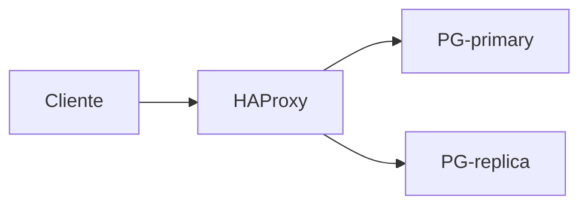

# NoteMark — `references/04-authoring/notemark.md`

> Documento normativo de la Fase 12 del roadmap. Define el formato intermedio que el agente escribe en L3 y que el parser (F48) traduce al Note IR (F14). Gramática formal en [`notemark.ebnf`](notemark.ebnf).
>
> Documentos complementarios: `skills/AGENT.md` §2 INV-05/INV-06 (reglas duras), §13 (forma canónica — este doc la formaliza), `references/00-pipeline/architecture.md` §3.4 (contrato L3), `references/04-authoring/README.md` (restricción INV-06). Fases hermanas: F14 IR, F45-F47 y F51 separan este contenido si crece.

## §1 · Propósito y alcance

NoteMark es el **único formato** que el agente escribe a mano en L3. Vive entre el SDM (F13) y el IR (F14): el agente redacta prosa + directivas, el parser las convierte al IR, los renderers (F54-F60) traducen el IR al dialecto de cada destino. Esto es lo que mantiene la skill como skill y no como aplicación (ver ADR-0001 y ADR-0002).

**No es:** Markdown de Obsidian, Markdown de Notion, Markdown de AppFlowy, ni ningún dialecto de plataforma. Es un superconjunto de CommonMark con directivas de bloque (`:::tipo`) y marcas inline (`{src:}`, `[[term:]]`, etc.).

## §2 · Cuándo se aplica

- Cualquier redacción de una nota nueva.
- Cualquier revisión de una nota existente.
- Cualquier regeneración desde el IR (vuelta atrás por error de render).

**No se aplica a:** validación del IR (eso es F49), render (F54-F60), publicación (F62), ni ingesta (F17-F29).

## §3 · Reglas duras (invariantes)

| ID | Invariante | Si se omite… |
|---|---|---|
| **INV-05** | El agente escribe NoteMark, nunca Markdown de destino ni JSON de IR a mano. | Los destinos no-Obsidian quedan rotos en silencio. |
| **INV-06** | NoteMark no contiene sintaxis de ninguna plataforma (callouts, toggles, wikilinks). | El parser produce nodos ambiguos y un destino se vuelve oráculo. |
| **INV-09** | Literales de la fuente (mensajes de error, defaults, sintaxis, comandos) textuales. | La nota "explica" lo que la fuente no dice. |
| **INV-10** | Enumeraciones cerradas nunca truncadas; prohibido `etc.`, `entre otros`, `los más relevantes`. | La fuente dice 7 cosas; la nota dice "varias". |
| **INV-14** | Cero colores literales. Tokens via `assets/tokens.json` (F72). | INV-14 violación; ver §10. |
| **INV-17** | Incertidumbre declarada. Versión indeterminable → `unknown`; nunca inferir. | El agente rellena huecos con conocimiento propio. |

## §4 · Gramática — visión general

Cuatro ejes:

1. **Directivas de bloque** con valla `:::tipo` (líneas que empiezan por `:::identificador` y terminan con otra línea `:::`). Ver §6.
2. **Marcas inline** dentro del texto: `{src:blk_xxxx}`, `[[term:nombre]]`, `[[note:id]]`, `{{placeholder}}`, `{derived}`, `{external}`, `{layer:l1|l2|l3}`. Ver §7.
3. **Frontmatter YAML canónico** al inicio del archivo entre `---` y `---`. Ver §8.
4. **Marcadores de capa** a nivel de bloque (`{layer:l1}`, `{layer:l2}`, `{layer:l3}`). Ver §9.

Sintaxis base: Markdown estándar de CommonMark (paragraph, heading, list, table, fenced code, image, link, math-inline `$...$`). La gramática formal completa está en `notemark.ebnf` (47 reglas, 75 líneas).

## §5 · Cobertura IR ↔ NoteMark

Cada nodo del Note IR (Fase 14) tiene exactamente una sintaxis NoteMark. 20 nodos de bloque + 13 inline = 33 filas.

### 5.1 Bloques (20)

| Nodo IR | Sintaxis NoteMark |
|---|---|
| `section`, `paragraph`, `list`, `checklist`, `table`, `code`, `quote`, `divider` | CommonMark / GFM. |
| `definition-list`, `property-block` | `:::property` con YAML interno. |
| `console` | `:::console` … `:::console`. |
| `equation` | `:::equation` … `:::equation` (con `$$…$$`). |
| `figure` | `:::figure` … `:::figure` (con ``). |
| `diagram` | `:::diagram` … `:::diagram` (con ` ```mermaid `). |
| `admonition` (10 tipos) | `:::warning` / `note` / `tip` / `example` / `danger` / `security` / `performance` / `version` / `deprecated` / `conflict` / `external` … `:::`. |
| `collapsible` | `:::collapsible` … `:::collapsible`. |
| `columns` | `:::columns` con dos columnas separadas por línea en blanco. |
| `question` | `:::question` … `:::question`. |
| `step` | `:::step` … `:::step`. |
| `parameter-table` | `:::param-table` con tabla GFM dentro. |
| `contradiction` | `:::contradiction id="c_001"` (apunta al registry `knowledge/conflicts.json`; Fase 41). |
| `discrepancy` | `:::discrepancy source-says="X" model-says="Y"` (inline diff fuente vs modelo; Fase 41). |
| `derived` | `:::derived` … `:::derived` (síntesis, analogías o diagramas propios del agente basados en la fuente; Fase 42). |

### 5.2 Inline (13)

| Nodo IR | Sintaxis NoteMark |
|---|---|
| `text`, `strong`, `em`, `code`, `link-external` | CommonMark (`**x**`, `*x*`, `` `x` ``, `[t](u)`). |
| `link-note` | `[[note:id]]`. |
| `term-ref` | `[[term:nombre]]`. |
| `source-ref` | `{src:blk_xxxxxxxxxxxx}` (12 hex). |
| `math-inline` | `$E=mc^2$`. |
| `footnote-ref`, `keyboard`, `placeholder`, `deleted`, `derived`, `external` | `[[fn:id]]`, `[[kbd:Ctrl+S]]`, `{{nombre}}`, `~~x~~`, `{derived}`, `{external}`. |

## §6 · Directivas de bloque

Una subsección por cada directiva. Forma: sintaxis → ejemplo → anti-ejemplo.

### :::warning
Advertencia. Hoja: no admite otra directiva anidada.
````
:::warning
El parámetro `shared_buffers` requiere reinicio. {src:blk_b123}
~~~
> [!warning]   ← sintaxis Obsidian, prohibida (INV-06)

### :::note
Nota aclaratoria.
````
:::note
`VACUUM` no bloquea lecturas; solo adquiere lock en la tabla al final. {src:blk_c789}
:::

### :::tip
Consejo operativo.
````
:::tip
Usar `EXPLAIN ANALYZE` antes de tocar índices. {src:blk_d012}
:::

### :::example
Ejemplo numerado o acompañado.
````
:::example
```
SELECT count(*) FROM pg_class WHERE relkind = 'r';
-- → 163 relations
```
:::

### :::danger
Peligro de pérdida de datos o corrupción.
````
:::danger
Nunca ejecutar `DROP TABLE` sin `BEGIN;` previo y backup verificado.
:::

### :::security
Aviso de seguridad (CVE, vulnerabilidad, vector de ataque).
````
:::security
CVE-2024-1234: bypass de autenticación en API v1. Parchear a 16.3+. {src:blk_e345}
:::

### :::performance
Impacto medible en rendimiento.
````
:::performance
`work_mem = 4MB` con 200 conexiones simultáneas → OOM en sorts grandes. Default 4MB.
:::

### :::version
Cambio entre versiones de un producto.
````
:::version
PostgreSQL 15 → 16: el planner ahora usa `pg_stat_io` para I/O wait. {src:blk_f456}
:::

### :::deprecated
Funcionalidad marcada para eliminación.
````
:::deprecated
`json` (tipo) en favor de `jsonb` desde 9.4. Mantenido por compatibilidad.
:::

### :::conflict
Contradicción con otra versión o fuente.
````
:::conflict
La doc dice "no usar índices hash en valores grandes"; el manual interno dice "siempre que el valor sea fijo". {src:blk_g567} vs {src:blk_h678}
:::

### :::external
Hecho externo al documento procesado (no respaldado por el SDM).
````
:::external
Esta analogía con Git es nuestra, no del libro. {external}
:::

### :::derived
Síntesis, analogía o diagrama del agente basado en la fuente. Nivel intermedio entre `source` (default, sin tag) y `external` (fuera de la fuente).
````
:::derived
Diagrama que resume la arquitectura descrita en /ch02/intro:

:::
### :::collapsible
Bloque plegable. Admite heading interno opcional.
````
:::collapsible
### Detalle extendido (click para expandir)
Texto oculto por defecto. {src:blk_i789}
:::

### :::columns
Dos columnas separadas por línea en blanco.
````
:::columns
Columna izquierda.

Columna derecha.
:::

### :::param-table
Tabla de parámetros con columnas canónicas (`nombre`, `tipo`, `default`, `rango`).
````
:::param-table
| parametro | tipo | default | rango | versión |
| --- | --- | --- | --- | --- |
| max_connections | integer | 100 | 1-10000 | all |
| shared_buffers | bytes | 128MB | 8MB- | all |
:::

### :::step
Paso numerado dentro de un procedimiento. Admite heading interno.
````
:::step
### Configurar replica
Editar `postgresql.conf` con `wal_level = replica`. {src:blk_j890}
:::

### :::question
Pregunta-respuesta. Heading interno = pregunta; contenido = respuesta.
````
:::question
### ¿Qué es MVCC?
Control de concurrencia multiversión. Cada transacción ve un snapshot. {src:blk_k901}
:::

### :::diagram
Diagrama Mermaid portable (ver `references/07-visual/mermaid-portable.md`).
````
:::diagram

:::

### :::figure
Imagen con alt text y source_ref.
````
:::figure
{src:blk_fig01}
:::

### :::equation
Bloque matemático. Contenido entre `$$…$$`.
````
:::equation
$$
\sum_{i=1}^{n} w_i x_i = b
$$
:::

### :::console
Transcripción de sesión CLI. Prompt `$` opcional pero recomendado.
````
:::console
$ docker run -d --name db postgres:16
$ docker exec -it db psql -U postgres
:::

## §7 · Marcas inline

| Marca | Sintaxis | Cuándo se inserta |
|---|---|---|
| `source-ref` | `{src:blk_xxxxxxxxxxxx}` | Cada hecho fáctico: cita al bloque del SDM. |
| `term-ref` | `[[term:nombre]]` | Término canónico; se enlaza al glosario (F40). |
| `link-note` | `[[note:id]]` | Enlace a otra nota del corpus. |
| `placeholder` | `{{nombre}}` | Lo que el usuario sustituye antes de publicar. |
| `derived` | `{derived}` | Párrafo derivado del contenido (analogía propia). |
| `external` | `{external}` | Conocimiento externo al documento procesado. |

Ejemplo compuesto: `El optimizador elige un Hash Join cuando la tabla tiene > 10k filas. [[term:hash-join]] {src:blk_l234}`. Anti-ejemplo (sin marca): `El optimizador elige un Hash Join cuando hay muchas filas.` — sin respaldo, viola INV-04.

## §8 · Frontmatter

Forma: `---` al inicio, propiedades YAML canónicas, `---` de cierre.

**Obligatorias:** `title`, `note-type`, `status`.
**Recomendadas:** `tags`, `source`, `source-type`, `source-anchor`, `retrieved`, `language`, `coverage`, `aliases`, `related`. Detalle de tipos y enums en `references/04-authoring/properties.md` (F47, pendiente).

| Propiedad | Tipo | Descripción |
|---|---|---|
| `title` | string | Título de la nota. |
| `note-type` | enum | Tipo (F93): `concept`, `api-reference`, `procedure`, etc. |
| `status` | enum | `draft` / `published` / `archived`. |
| `tags`, `aliases`, `related` | array | Tags, sinónimos, rutas relacionadas. |
| `source`, `source-anchor`, `source-url` | string / path | Identificador y ancla principal de la fuente. |
| `source-type` | enum | `book` / `rfc` / `manual` / `repo` / `transcript` / `synthetic`. |
| `retrieved` | date (ISO 8601) | Fecha de obtención. |
| `language` | enum | `es` / `en` / `es-en` / `en-es` (perfil). |
| `coverage` | enum | `full` / `partial` / `summary`. |

Sin colores literales en valores (INV-14). Sin platform-specific (INV-06).

## §9 · Marcadores de capa

`{layer:l1}` = TL;DR. `{layer:l2}` = operativo. `{layer:l3}` = referencia exhaustiva. Se aplica a nivel de bloque (después de un heading, antes del contenido de esa sección).

Regla dura: **l3 nunca se omite** (puerta de fidelidad, INV-08). Si el agente decide no redactar l2, sigue redactando l3.

Ejemplo: `### Conexiones \n{layer:l2} \n Configurar...`. Anti-ejemplo: omitir la marca y depender de la posición en el documento — ambiguo.

## §10 · Anti-patrones generales

- ~~`> [!warning]` (Obsidian callout)~~ → usar `:::warning`.
- ~~`> [!note]`, `> [!tip]`, `> [!example]`, `> [!danger]`~~ → directivas equivalentes.
- ~~Toggles de Notion (`<details>` con markdown propio)~~ → `:::collapsible`.
- ~~Wikilinks Obsidian `[[doble]]` sin prefijo `note:`/`term:`~~ → `[[note:id]]` o `[[term:nombre]]`.
- ~~Bloques JSON de IR embebidos~~ → no; el parser (F48) los genera.
- ~~Colores hex `#abc123` o `rgb(...)` literales~~ → tokens via `assets/tokens.json`.
- ~~`etc.`, `entre otros`, `los más relevantes` en enumeraciones cerradas~~ → listar todas (INV-10).

## §11 · Cómo verificar

1. `wc -l notemark.md` ≤ 300; `wc -l notemark.ebnf` ≤ 80.
2. `rg -c '^### :::' notemark.md` ≥ 20.
3. `rg -c '\[\!warning\]|\[\!note\]' notemark.md evals/notemark-sample/full-note.nm` → 0.
4. `wc -l evals/notemark-sample/full-note.nm` entre 380 y 420; contiene las 20 directivas, las 6 marcas inline y los 3 layer markers.

## §12 · Cambios permitidos sin reabrir F12

Añadir subsección en §6 cuando F45 cree un nuevo bloque; fila en §5 cuando F14 extienda el IR; refinar ejemplos en §6 sin cambiar sintaxis. **Reabren F12:** cambiar INV-05/06/09, redefinir sintaxis de `:::directiva`, introducir inline que rompa compat con notas existentes, eliminar la prohibición de platform-specific.
