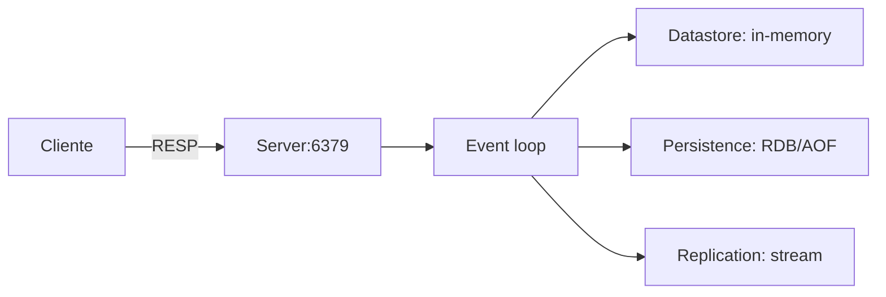
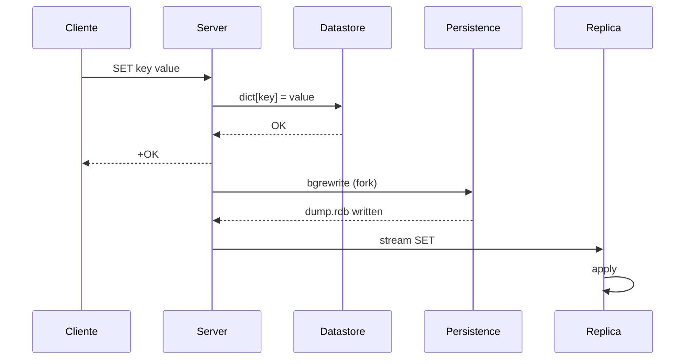

# `architecture` — `references/05-note-types/architecture.md`

> Documento normativo de la **Fase 83** del roadmap. Define el patrón de la nota
> de tipo `architecture`: 9 secciones obligatorias + 2 opcionales + cierre, con
> diagrama Mermaid obligatorio en Vista general, tabla de componentes con
> responsabilidades en una frase, flujo paso a paso (prosa + diagrama),
> estructuras en memoria y disco, puntos de fallo con respaldo y cuellos de
> botella con métrica.
>
> **Cuándo cargar:** tras decidir el tipo de nota (selector F93) cuando el
> `note-type` resuelto es `architecture`; antes de redactar la primera
> sección. Instancia el patrón común de `references/07-visual/note-templates.md`
> (F75) §6.6.
>
> **Wirings:**
> - `references/07-visual/note-templates.md` (F75) §6.6 — patrón resumido.
> - `references/07-visual/density.md` (F76) — reglas R1-R8.
> - `references/04-authoring/properties.md` (F47) — frontmatter; `source-bearing` recomendado.
> - `references/04-authoring/inline-marks.md` (F46) — `{src:blk_xxxx}` por componente; `[[note:id]]` para fallos y cuellos de botella.
> - `references/04-authoring/block-directives.md` (F45) — directivas `:::diagram`, `:::warning`, `:::danger`, `:::note`.
> - `references/04-authoring/depth-layers.md` (F51) — capas L1/L2/L3 (F75 §6.6 marca architecture puede invocar F51 si la nota es extensa).
> - `references/05-note-types/concept.md` (F78) — paraguas común.
> - `references/05-note-types/procedure.md` (F80) — flujos que aplican la arquitectura.
> - `references/05-note-types/error-troubleshooting.md` (F82) — cada punto de fallo se enlaza a su nota de troubleshooting.

---

## §1 · Propósito y alcance

Una nota `architecture` documenta **la estructura interna de un sistema**:
componentes, responsabilidades, flujo, estructuras en memoria y disco,
puntos de fallo y cuellos de botella.

Cubre el **nivel medio de abstracción**: no es tutorial (`procedure`), ni
detalle de API (`api-reference`), ni error específico (`error-troubleshooting`);
es la **vista panorámica** que un operador necesita para entender dónde
tocar cuando algo va mal.

**Fuera de alcance:** 2 arquitecturas → `comparison` (F87); error específico →
`error-troubleshooting` (F82); operación → `procedure` (F80); cambios entre
versiones → `version-delta` (F88).

---

## §2 · Estructura de la nota

### §2.1 · Frontmatter (orden canónico, `source-bearing` recomendado)

```yaml
---
title: "<sistema>: arquitectura interna"
note-type: architecture
status: draft | published
summary: "<≤ 200 chars, 1 línea>"
reading-time-minutes: <int ≥ 1>
tags: [type/architecture, domain/<uno o más>, product/<nombre>]
source: "<ruta al doc oficial o libro>"
source-type: docs | book | article | code
source-anchor: "<page|chapter|section_path>"
source-url: "<opcional>"
retrieved: <YYYY-MM-DD>
vendor: "<proveedor>"
product: "<nombre del producto>"
product-version: "<versión>"
related: "[[note:procedure-de-instalacion]], [[note:concept-del-sistema]]"
---
```

### §2.2 · Apertura común (heredada de F75 §3)

```markdown
# {title}

## Cabecera
| Campo | Valor |
| --- | --- |
| **Resumen** | ... |
| **Procedencia** | source (source-type) §source-anchor · recuperado YYYY-MM-DD |
| **Versión** | product product-version |
| **Estado** | Publicado (published) / Borrador (draft) |
| **Tiempo de lectura** | N min |

## TL;DR
{primer párrafo del L1 — ≤ 8 líneas / ≤ 60 palabras}

{layer:l2}

## Vista general
```

### §2.3 · Las 9 secciones específicas + 2 opcionales + cierre

| # | Sección | Estado | Notas |
|---|---|---|---|
| 1 | `## TL;DR` | obligatoria | ≤ 60 palabras (R1). |
| 2 | `## Vista general` | obligatoria | 1-2 párrafos + **`:::diagram` Mermaid obligatorio** (criterio #1 del ROADMAP: diagrama siempre presente). |
| 3 | `## Componentes y responsabilidades` | obligatoria | Tabla 3-col con `Componente / Responsabilidad (1 frase) / Ubicación`. Criterio #2: primera frase ≤ 30 palabras. |
| 4 | `## Flujo paso a paso` | obligatoria | Lista numerada de ≥ 3 pasos + **`:::diagram` Mermaid `sequenceDiagram`** que muestre el flujo entre componentes. Criterio #3: el flujo se describe con prosa, no solo con el diagrama. |
| 5 | `## Interacciones` | obligatoria | Diagrama de secuencia detallado o tabla con mensajes que intercambian los componentes; protocolo, formato, frecuencia. Heredado de §6.6. |
| 6 | `## Estructuras en memoria y disco` | obligatoria | 2 sub-secciones H3: `### En memoria` y `### En disco`. Cada entrada con tamaño típico. |
| 7 | `## Puntos de fallo` | obligatoria | `:::warning` o `:::danger` por punto de fallo con causa + síntoma + impacto + mitigación. Criterio #4: cada uno con `{src:blk_xxxx}`. |
| 8 | `## Cuellos de botella` | obligatoria | `:::warning` por cuello de botella con métrica (p99, throughput, RSS) + cómo detectarlo + cómo mitigarlo. |
| 9 | `## Decisiones de diseño` | obligatoria | Lista numerada con cada decisión + trade-off aceptado. Heredado de §6.6. |
| 10 | `## Trade-offs` | opcional | Heredado de §6.6. |
| 11 | `## Alternativas consideradas` | opcional | Heredado de §6.6. |
| 12 | `## Backlinks` | si hay aristas | Cierre común. |
| 13 | `## Queries` | si queries activas | Cierre común. |
| 14 | `## Ver también` | si `related:` | Cierre común. |

### §2.4 · Capas (heredado de F51, F75 §6.6 marca que architecture puede invocar F51)

| Capa | Marcador | Contenido |
|---|---|---|
| L1 | `{layer:l1}` | Solo `## TL;DR`. ≤ 60 palabras. |
| L2 | `{layer:l2}` | Vista general, Componentes, Interacciones, Decisiones. 50-70% del total. |
| L3 | `{layer:l3}` | Estructuras, Puntos de fallo, Cuellos de botella. Si > 100 líneas, `:::collapsible` con `default_open: false` (R7). |

### §2.5 · Autoevaluación (F102)

Tipos de pregunta asignados a `architecture` (ver
`references/09-study/self-evaluation.md` §3):

| Tipo de pregunta | Asignado |
|---|---|
| Recuerdo | ✅ |
| Aplicación | — |
| Diagnóstico | — |
| Decisión | ✅ |
| Predicción | — |

Notas: recuerdo (componentes, interacciones) + decisión (trade-offs
arquitectónicos). Aplicación se añade si la nota documenta trade-offs
operativos documentados. La nota puede declarar `self-evaluation-types`
como superset del default.

---

## §3 · Componentes mínimos

| Componente | Mínimo | Fuente |
|---|---|---|
| Cabecera (F75 §2) | 5 campos en orden | F75 §2.1 |
| `## TL;DR` | ≤ 60 palabras / 8 líneas | F76 R1 |
| `## Vista general` | 1-2 párrafos + `:::diagram` Mermaid | criterio #1 + F75 §6.6 |
| `## Componentes y responsabilidades` | Tabla 3-col (Componente / Responsabilidad / Ubicación) | criterio #2 |
| Responsabilidad por componente | ≤ 30 palabras en la primera frase | criterio #2 |
| `## Flujo paso a paso` | ≥ 3 pasos numerados + `:::diagram` Mermaid `sequenceDiagram` | criterio #3 |
| `## Interacciones` | Tabla o diagrama detallado | F75 §6.6 |
| `## Estructuras en memoria y disco` | 2 sub-secciones H3 (En memoria / En disco) con tamaño típico | esta fase |
| `## Puntos de fallo` | ≥ 1 `:::warning`/`:::danger` por fallo con `{src:}` | criterio #4 |
| `## Cuellos de botella` | ≥ 1 `:::warning` con métrica concreta | esta fase |
| `## Decisiones de diseño` | ≥ 1 decisión con trade-off | F75 §6.6 |
| Marcas `{src:blk_xxxx}` | ≥ 1 por componente / decisión / punto de fallo | F46 + F76 R8 |
| Anclaje visual | ≥ 1 cada 200 palabras (diagramas cuentan) | F76 R3 |
| Cierre | `## Backlinks` + `## Queries` | F75 §4 |

### §3.1 · Tabla de componentes (canónica 3 columnas)

```
| Componente | Responsabilidad | Ubicación |
|---|---|---|
| `postmaster` | Proceso principal del servidor PostgreSQL; acepta conexiones y coordina workers | proceso Unix; `pg_ctl start` |
| `backend` | Proceso por conexión; ejecuta queries y retorna resultados | fork del postmaster; ≤ `max_connections` |
| `WAL writer` | Escribe buffers WAL al disco en background | proceso bgwriter |
```

Reglas:
- **3-10 componentes** (no más; si el sistema tiene > 10, agrupar).
- La **primera frase** de cada responsabilidad es ≤ 30 palabras (criterio #2). Si excede, es violación.
- Si la responsabilidad requiere > 30 palabras, partir en 2 componentes.

---

## §4 · Reglas de contenido

### §4.1 · Densidad y estructura (R1-R8 de F76)

- **R1** `## TL;DR` ≤ 60 palabras / 8 líneas.
- **R2** Cada párrafo del L2 ≤ 200 palabras.
- **R3** ≥ 1 anclaje visual cada 200 palabras. Los `:::diagram` cuentan como anclaje.
- **R4** ≤ 3 callouts consecutivos sin prosa intermedia.
- **R5** ≤ 5 viñetas consecutivas.
- **R6** Cada H2/H3 tiene ≥ 1 párrafo, tabla, callout, figura, diagrama o código.
- **R7** Cualquier sección > 100 líneas → `:::collapsible` con `default_open: false`.
- **R8** Densidad `{src:}` ≥ 0.80 sobre filas fácticas.

### §4.2 · Anti-patrones fundamentales (F75 §6.6 + extensiones)

1. **"Diagrama ausente"** (criterio #1) — Vista general sin `:::diagram`. Solución: el diagrama es obligatorio.
2. **"Componente sin responsabilidad explícita"** (criterio #2) — la columna "Responsabilidad" se llena con `n/a` o se omite. Solución: la columna es obligatoria y la primera frase ≤ 30 palabras.
3. **"Flujo solo dibujado"** (criterio #3) — `## Flujo paso a paso` solo tiene el diagrama. Solución: ≥ 3 pasos numerados con prosa.
4. **"Punto de fallo inventado"** (criterio #4) — `:::warning` sin `{src:blk_xxxx}`. Solución: cada punto de fallo lleva src; sin src = invención.
5. **"Cuello de botella sin métrica"** — "puede ser lento" sin p99/throughput/RSS. Solución: métrica concreta del SDM o `:::external`.
6. **"Decisiones de diseño especulativas"** — el agente inventa razones por las que se eligió un diseño. Solución: el doc §6 marca que las decisiones deben venir del SDM o `:::external`.
7. **"Diagrama con > 12 nodos"** — ilegible. Solución: agrupar con `subgraph` o partir en 2 diagramas.
8. **"Estructuras sin tamaño típico"** — lista de estructuras sin orden de magnitud. Solución: cada entrada con bytes/MB/GB.
9. **"Sección solo de viñetas"** (R6) — `## Vista general` con bullets sin contexto. Solución: 1-2 párrafos narrativos.
10. **"Interacciones = Flujo"** — duplicar el contenido de `## Flujo paso a paso` en `## Interacciones`. Solución: `## Flujo` es la vista macro; `## Interacciones` es el detalle de mensajes.

### §4.3 · Marcas inline (F46)

- **`{src:blk_xxxx}`** — 12 caracteres hexadecimales (INV-I5). Cada componente del SDM lleva `{src:}`. Cada punto de fallo lleva `{src:}`. Las decisiones de diseño llevan `{src:}` o `:::external`.
- **`[[term:nombre]]`** — primera aparición del término (INV-I2). Usar para: nombres de protocolos (`TCP`, `WAL`), tipos de memoria (`shared_buffers`).
- **`[[note:id]]`** — enlaces a `error-troubleshooting` (cada punto de fallo), `procedure` (instalación / operación), `concept` (qué es un componente).
- **`:::external`** — para decisiones o heurísticas operativas que NO vienen del SDM (experiencia del operador, conocimiento tácito). Marca la proveniencia como "no-respaldada por la fuente".

### §4.4 · Directivas de bloque (F45)

| Sección | Directiva preferida | Justificación |
|---|---|---|
| `## Vista general` | `:::diagram` Mermaid `flowchart LR` o `graph TD` | F45 §10.18 + criterio #1. |
| `## Componentes y responsabilidades` | Tabla GFM 3-col | F75 §5.1. |
| `## Flujo paso a paso` | `:::diagram` Mermaid `sequenceDiagram` + lista numerada | F45 §10.18 + criterio #3. |
| `## Interacciones` | `:::diagram` Mermaid `sequenceDiagram` o tabla | F45 §10.18 + F75 §6.6. |
| `## Estructuras en memoria y disco` | `### En memoria` + `### En disco` con tablas | F75 §5.1. |
| `## Puntos de fallo` | `:::warning` (recuperable) o `:::danger` (crítico) | F45 §6. |
| `## Cuellos de botella` | `:::warning` con métrica | F45 §6. |
| `## Decisiones de diseño` | `:::note` o lista numerada | F45 §6 + F75 §6.6. |
| `## Trade-offs` | `:::note` | F75 §6.6. |

### §4.5 · Diferencias operativas

| Concepto | Definición operativa |
|---|---|
| **Vista general** | Resumen de 1-2 párrafos + diagrama; el lector entiende "qué es" el sistema. |
| **Componente** | Unidad con responsabilidad delimitada; puede ser proceso, thread, servicio externo o abstracción lógica. |
| **Responsabilidad** | 1 frase que responde "¿qué hace este componente y para qué existe?". |
| **Flujo paso a paso** | Secuencia ordenada de operaciones que produce un resultado; cada paso referencia un componente. |
| **Interacción** | Mensaje específico entre 2 componentes: protocolo, formato, frecuencia, latencia. |
| **Estructura en memoria** | Estado que vive en RAM (caches, buffers, contadores). |
| **Estructura en disco** | Archivos o directorios persistentes (WAL, data files, socket). |
| **Punto de fallo** | Modo de fallo conocido del sistema (no del operador); tiene causa + síntoma + impacto. |
| **Cuello de botella** | Recurso cuyo límite degrada el rendimiento global (CPU, memoria, I/O, red, lock). |

---

## §5 · Activación por perfil

```yaml
notes:
  types:
    architecture:
      require_overview_diagram: true    # default: true (criterio #1)
      require_flow_diagram: true        # default: true (criterio #3)
      max_components: 10                # default: 10 (más = agrupar)
      min_components: 3                 # default: 3 (menos = no amerita nota)
      min_failure_points: 1             # default: 1
      min_bottlenecks: 1               # default: 1
      require_failure_source: true      # default: true (criterio #4)
      enforce_one_sentence_responsibility: true # default: true (criterio #2)
```

| Campo | Default | Significado |
|---|---|---|
| `require_overview_diagram` | `true` | `## Vista general` lleva `:::diagram` Mermaid. |
| `require_flow_diagram` | `true` | `## Flujo paso a paso` lleva `:::diagram` Mermaid `sequenceDiagram`. |
| `max_components` | `10` | Máximo de filas en la tabla de componentes. |
| `min_components` | `3` | Mínimo de componentes (sistemas con < 3 no ameritan nota de arquitectura). |
| `min_failure_points` | `1` | Mínimo de puntos de fallo documentados. |
| `min_bottlenecks` | `1` | Mínimo de cuellos de botella documentados. |
| `require_failure_source` | `true` | Cada punto de fallo lleva `{src:blk_xxxx}`. |
| `enforce_one_sentence_responsibility` | `true` | Primera frase de la responsabilidad ≤ 30 palabras. |

---

## §6 · Checklist de cierre

Antes de publicar:

- [ ] Cabecera con 5 campos en orden (F75 §2.1).
- [ ] `source-bearing` recomendado (F75 §6.6).
- [ ] `## TL;DR` ≤ 60 palabras / 8 líneas (R1).
- [ ] `## Vista general` con `:::diagram` Mermaid (criterio #1).
- [ ] `## Componentes y responsabilidades` con tabla 3-col; cada responsabilidad ≤ 30 palabras en su primera frase (criterio #2).
- [ ] `## Flujo paso a paso` con ≥ 3 pasos numerados Y diagrama Mermaid `sequenceDiagram` (criterio #3).
- [ ] `## Interacciones` con tabla o diagrama detallado.
- [ ] `## Estructuras en memoria y disco` con 2 sub-secciones y tamaño típico por entrada.
- [ ] `## Puntos de fallo` con `:::warning`/`:::danger` con `{src:blk_xxxx}` (criterio #4).
- [ ] `## Cuellos de botella` con `:::warning` y métrica concreta.
- [ ] `## Decisiones de diseño` con lista numerada y trade-off aceptado.
- [ ] Cierre: `## Backlinks` + `## Queries`.
- [ ] Densidad `{src:}` ≥ 0.80 sobre filas fácticas (R8).
- [ ] `density_check.py --note <path>` exit 0.

---

## §7 · Nota mínima viable

Ejemplo canónico de ~70 líneas con 4 componentes. Pasa `density_check.py --strict` exit 0.

```markdown
---
title: "Redis — arquitectura interna"
note-type: architecture
status: draft
tags: [type/architecture, domain/databases, product/redis]
source: "Redis 7 — Redis Design"
source-type: docs
source-anchor: "redis-design"
retrieved: 2026-09-27
vendor: Redis Labs
product: Redis
product-version: "7"
---

# Redis — arquitectura interna

## Cabecera
| Campo | Valor |
| --- | --- |
| **Resumen** | Redis es un servidor de estructuras de datos en memoria con un solo thread de event loop, persistencia opcional y replicación asíncrona. |
| **Procedencia** | Redis 7 — Redis Design (docs) §redis-design · recuperado 2026-09-27 |
| **Versión** | Redis 7 |
| **Estado** | Borrador (draft) |
| **Tiempo de lectura** | 4 min |

## TL;DR
Redis es single-threaded por diseño: todas las operaciones pasan por un event loop no bloqueante. Persistencia con RDB snapshots y AOF log; replicación asíncrona vía stream de comandos. {src:blk_a00000000001}

{layer:l2}

## Vista general
Redis almacena todo el dataset en RAM (con opciones de persistencia a disco) y procesa comandos a través de un único event loop. Esto simplifica el modelo de concurrencia y elimina la necesidad de locks en el servidor; el rendimiento escala linealmente con CPUs solo si se particiona el dataset en múltiples instancias. {src:blk_a00000000002}

:::diagram

:::

## Componentes y responsabilidades
| Componente | Responsabilidad | Ubicación |
|---|---|---|
| `Server` | Proceso principal que acepta conexiones TCP y coordina el event loop | proceso Unix; puerto 6379 |
| `Event loop` | Procesa comandos de forma no bloqueante; un solo thread | thread principal del Server |
| `Datastore` | Almacena las estructuras de datos en RAM | heap del Server |
| `Persistence` | Escribe snapshots RDB o AOF log a disco | archivos `dump.rdb` / `appendonly.aof` |

## Flujo paso a paso

### Paso 1: Cliente envía comando
El cliente abre TCP al puerto 6379 y envía un comando RESP (`SET key value\r\n`). {src:blk_a00000000003}

### Paso 2: Event loop parsea y ejecuta
Lee bytes, parsea el comando, busca la clave y ejecuta la operación (O(1) hash, O(log N) skiplist). {src:blk_a00000000004}

### Paso 3: Persistencia dispara en background
Si `save 60 1000` y han pasado 60s con ≥ 1000 writes, fork y escribe `dump.rdb` sin bloquear el event loop. {src:blk_a00000000005}

### Paso 4: Replicación transmite a replica
Cada comando procesado se envía al buffer de replication; las réplicas aplican localmente. {src:blk_a00000000006}

:::diagram

:::

## Interacciones

| Origen | Destino | Protocolo | Frecuencia |
|---|---|---|---|
| Cliente → Server | TCP/6379 | RESP | por comando |
| Server → Persistence | fork + write | binario RDB | cada N segundos |
| Server → Replica | TCP | RESP stream | continua |

## Estructuras en memoria y disco

### En memoria
| Estructura | Tamaño típico |
|---|---|
| `dict` principal | ~50 bytes/key × N keys |
| `expires` hash | 8 bytes/key con TTL |
| Output buffer de replicación | ~256 KB (`repl-backlog-size`) |
| Client query buffer | 1 MB/cliente (`proto-max-bulk-len`) |

### En disco
| Archivo | Tamaño típico |
|---|---|
| `dump.rdb` | 1-100 GB según dataset |
| `appendonly.aof` | 1-10× el tamaño de `dump.rdb` |

## Puntos de fallo

:::danger
**Fork para RDB bloquea RAM.** `fork()` copy-on-write duplica páginas; con dataset > RAM, swap y bloquea el event loop hasta 1-5 s. {src:blk_a00000000007} Solución: `save ""` + `appendfsync everysec`; deshabilitar `THP`.
:::

:::warning
**Replicación asíncrona → pérdida de datos en failover.** La réplica puede estar hasta `repl-backlog-size` bytes detrás. {src:blk_a00000000008} Solución: Sentinel/Cluster con quorum; aceptar RPO de segundos.
:::

:::warning
**Single-thread = bloqueo en comandos O(N).** `KEYS *` o `LRANGE 0 -1` sobre millones bloquea el event loop. {src:blk_a00000000009} Solución: usar `SCAN` con cursor.
:::

## Cuellos de botella

:::warning
**CPU: event loop single-thread.** ~100k ops/s por instancia; O(N) degrada a < 1k ops/s. Métrica: `redis_cpu_sys` en `INFO`. Mitigación: cluster.
:::

:::warning
**Memoria: dataset > RAM.** Swap mata latencia (p99 ms → s). Métrica: `used_memory` vs `maxmemory`. Mitigación: `maxmemory` con `allkeys-lru`.
:::

:::warning
**Red: ancho de banda replicación.** Réplicas con dataset > 1 GB sincronizan al arrancar. Métrica: `replication_input_bytes_per_sec`. Mitigación: `repl-diskless-sync yes`.
:::

## Decisiones de diseño

:::note
**Single-thread por simplicidad.** El SDM justifica por eliminación de locks; trade-off: throughput limitado a 1 CPU.
:::

:::note
**Persistencia opcional.** Redis no persiste por defecto; trade-off: pérdida de datos en crash.
:::

## Backlinks
- [[note:redis-configuration]] — `maxmemory`, `save`, `appendonly`.
- [[note:redis-cluster]] — arquitectura federada para escalar.
```

Esta nota mínima (~70 líneas) cubre R1-R8 de F76 y los 4 criterios del
ROADMAP (1-4). Sirve de **referencia de forma**.

---

## §8 · Wirings y referencias cruzadas

- **F11** `assets/profile.template.yaml` — defaults de §5.
- **F12** `references/04-authoring/notemark.md` — directivas `:::diagram`, `:::warning`, `:::danger`, `:::note`.
- **F44** `references/03-knowledge/note-plan.md` — selector asigna `architecture` cuando la unidad es un sistema completo.
- **F45** `references/04-authoring/block-directives.md` — directivas consumidas.
- **F46** `references/04-authoring/inline-marks.md` — `{src:blk_xxxx}` por componente; `[[note:id]]` para fallos.
- **F47** `references/04-authoring/properties.md` — frontmatter; `source-bearing` recomendado.
- **F51** `references/04-authoring/depth-layers.md` — arquitectura puede invocar L1/L2/L3 si la nota es extensa.
- **F66** `references/07-visual/mermaid-portable.md` — portabilidad del Mermaid en Vista general y Flujo.
- **F72** `references/07-visual/tokens.md` — colores semánticos de las directivas.
- **F75** `references/07-visual/note-templates.md` — cabecera, apertura/cierre común, §6.6 patrón resumido.
- **F76** `references/07-visual/density.md` — tabla cerrada R1-R8 ejecutable.
- **F77** `evals/visual/` — verificación visual multi-destino.
- **F78** `references/05-note-types/concept.md` — paraguas común.
- **F79** `references/05-note-types/api-reference.md` — APIs que expone la arquitectura.
- **F80** `references/05-note-types/procedure.md` — flujos que aplican la arquitectura.
- **F81** `references/05-note-types/configuration.md` — parámetros configurables del sistema.
- **F82** `references/05-note-types/error-troubleshooting.md` — cada punto de fallo se enlaza a su nota de troubleshooting.
- **F87** `references/05-note-types/comparison.md` — para comparar 2 arquitecturas alternativas.

---

## §9 · Verificación al cierre de la fase

- `wc -l references/05-note-types/architecture.md` ≤ 400 líneas.
- §2 con 4 subsecciones.
- §3 con tabla de componentes mínimos ≥ 14 filas + §3.1 tabla 3-col.
- §4 con 5 subsecciones.
- §5 con tabla de campos del perfil y sus defaults.
- §6 con checklist de cierre ≥ 15 items.
- §7 con nota mínima viable.
- §8 con ≥ 19 wirings.
- §9 lista de verificación explícita.

**Criterios de aceptación del ROADMAP F83:**

1. _Todo componente declara su responsabilidad en una frase._ → battery C2: primera frase ≤ 30 palabras por fila de la tabla de componentes.
2. _El flujo está descrito paso a paso, no solo dibujado._ → battery C3: ≥ 3 pasos numerados en `## Flujo paso a paso` Y diagrama Mermaid `sequenceDiagram`.
3. _Los puntos de fallo aparecen cuando la fuente los menciona._ → battery C4: cada `:::warning`/`:::danger` en `## Puntos de fallo` lleva `{src:blk_xxxx}`.
