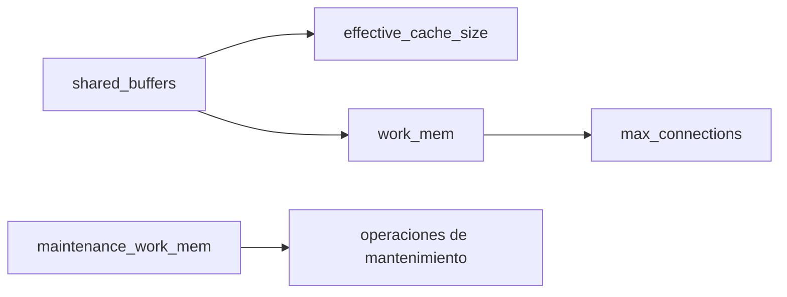

# `configuration` — `references/05-note-types/configuration.md`

> Documento normativo de la **Fase 81** del roadmap. Define el patrón de la nota
> de tipo `configuration`: tabla canónica de **8 columnas** (Parámetro, Ámbito,
> Tipo, Default, Rango, Hot reload, Reinicio, Versión, Impacto), secciones de
> combinaciones peligrosas + interacciones + diagrama de dependencias, y
> contrato de activación por perfil.
>
> **Cuándo cargar:** tras decidir el tipo de nota (selector F93) cuando el
> `note-type` resuelto es `configuration`; antes de redactar la primera
> sección específica. Instancia el patrón común de
> `references/07-visual/note-templates.md` (F75) §6.4.
>
> **Wirings:**
> - `references/07-visual/note-templates.md` (F75) §6.4 — patrón resumido.
> - `references/07-visual/density.md` (F76) — reglas R1-R8.
> - `references/04-authoring/properties.md` (F47) — frontmatter; `source-bearing` obligatorio.
> - `references/04-authoring/inline-marks.md` (F46) — `{src:blk_xxxx}` por fila.
> - `references/04-authoring/block-directives.md` (F45) — directivas `:::example`, `:::warning`, `:::danger`, `:::diagram`, `:::collapsible`, `:::external`.
> - `references/04-authoring/depth-layers.md` (F51) — capas L1/L2/L3.
> - `references/05-note-types/concept.md` (F78) — paraguas común.
> - `references/05-note-types/api-reference.md` (F79) — `configuration` documenta valores; `api-reference` documenta operaciones que los modifican.
> - `references/05-note-types/procedure.md` (F80) — `procedure` aplica cambios de `configuration` paso a paso.

---

## §1 · Propósito y alcance

Una nota `configuration` documenta **un archivo de configuración o un conjunto
de parámetros** de un sistema con la granularidad suficiente para que un
operador pueda ajustar valores sin abrir el manual: nombre, ámbito, tipo,
default, rango, hot reload, reinicio, versión, impacto.

`configuration` cubre `.conf`, `.yaml`, `.json`, `.ini`, GUC de PostgreSQL,
directivas nginx/apache, anotaciones Kubernetes, settings Django/Rails,
variables `.env`, parámetros JVM, etc. La forma canónica es la **tabla de 8
columnas** + combinaciones peligrosas + interacciones.

**Fuera de alcance:** API que modifica la config → `api-reference` (F79);
procedimiento para cambiar → `procedure` (F80); 2+ sistemas → `comparison`
(F87); cambios entre versiones → `version-delta` (F88).

---

## §2 · Estructura de la nota

### §2.1 · Frontmatter (orden canónico, `source-bearing` obligatorio)

```yaml
---
title: "<archivo o sistema>: <conjunto de parámetros>"
note-type: configuration
status: draft | published
summary: "<≤ 200 chars, 1 línea>"
reading-time-minutes: <int ≥ 1>
tags: [type/configuration, domain/<uno o más>, product/<nombre>]
source: "<ruta al archivo o al doc oficial>"
source-type: docs | config | wiki
source-anchor: "<file|section_path>"
source-url: "<opcional>"
retrieved: <YYYY-MM-DD>
vendor: "<proveedor>"
product: "<nombre del producto>"
product-version: "<versión>"
related: "[[note:procedure-que-aplica-esta-config]], [[note:api-reference-relacionada]]"
---
```

`source-bearing` es **obligatorio** (F75 §6.4). Las 5 universales son
obligatorias en `status: published` (INV-P5).

### §2.2 · Apertura común (heredada de F75 §3)

```markdown
# {title}

## Cabecera
| Campo | Valor |
| --- | --- |
| **Resumen** | ... |
| **Procedencia** | source (source-type) §source-anchor · recuperado YYYY-MM-DD |
| **Versión** | product product-version |
| **Estado** | Publicado (published) / Borrador (draft) |
| **Tiempo de lectura** | N min |

## TL;DR
{primer párrafo del L1 — ≤ 8 líneas / ≤ 60 palabras}

{layer:l2}

## Configuración
```

### §2.3 · Las 7 secciones específicas + 2 opcionales + 3 de cierre

| # | Sección | Estado | Notas |
|---|---|---|---|
| 1 | `## TL;DR` | obligatoria | Heredada F75. ≤ 60 palabras / 8 líneas (R1). |
| 2 | `## Configuración` | obligatoria | Bloque `code` con la config completa comentada. `:::collapsible` con `default_open: true` si > 30 líneas. |
| 3 | `## Parámetros` | obligatoria | Tabla 8-col canónica (ver §3.1). |
| 4 | `## Ejemplo completo` | obligatoria | `:::example` con bloque `code` mostrando la config en uso (F75 §6.4). |
| 5 | `## Combinaciones peligrosas` | obligatoria | `:::danger` por combinación de parámetros que degradan o rompen el sistema. |
| 6 | `## Interacciones` | obligatoria | Tabla o lista con dependencias explícitas: "Si cambias X, también revisa Y". Criterio #2. |
| 7 | `## Diagrama de dependencias` | obligatoria | `:::diagram` con Mermaid que muestre cómo se relacionan los parámetros. |
| 8 | `## Valores comunes` | opcional | Tabla con configuraciones canónicas (producción / desarrollo / testing). |
| 9 | `## Troubleshooting` | opcional | `:::warning` por síntoma con causa + resolución. |
| 10 | `## Backlinks` | obligatoria si hay aristas | Cierre común. |
| 11 | `## Queries` | obligatoria si queries activas | Cierre común. |
| 12 | `## Ver también` | opcional si `related:` | Cierre común. |

### §2.4 · Capas (heredado de F51)

| Capa | Marcador | Contenido |
|---|---|---|
| L1 | `{layer:l1}` | Solo `## TL;DR`. ≤ 60 palabras. |
| L2 | `{layer:l2}` | Secciones 2-9 (configuración → troubleshooting). 70-90% del total. |
| L3 | `{layer:l3}` | Tablas auxiliares (`## Valores comunes`). `:::collapsible` con `default_open: false` si > 100 filas (R7). |

### §2.5 · Autoevaluación (F102)

Tipos de pregunta asignados a `configuration` (ver
`references/09-study/self-evaluation.md` §3):

| Tipo de pregunta | Asignado |
|---|---|
| Recuerdo | ✅ |
| Aplicación | — |
| Diagnóstico | — |
| Decisión | ✅ |
| Predicción | — |

Notas: por defecto recuerdo + decisión (la nota es tabla de parámetros con
trade-offs). Aplicación se añade si la nota incluye casos de tuning
documentados (sub-tipo `configuration-with-tuning`). Si la nota es solo
tabla de parámetros sin trade-offs, aplica la regla de referencia pura
(`self-evaluation.md` §4) y solo recuerdo aplica.

---

## §3 · Componentes mínimos

| Componente | Mínimo | Fuente |
|---|---|---|
| Cabecera (F75 §2) | 5 campos en orden | F75 §2.1 |
| `## TL;DR` | ≤ 60 palabras / 8 líneas | F76 R1 |
| `## Configuración` | Bloque `code` con config completa comentada | F75 §6.4 |
| `## Parámetros` | Tabla 8-col canónica | criterio #1 + ROADMAP |
| Celdas obligatorias | `Parámetro`, `Ámbito`, `Tipo`, `Default`, `Impacto` no vacías | criterio #1 |
| `## Ejemplo completo` | 1 `:::example` con bloque `code` | F75 §6.4 |
| `## Combinaciones peligrosas` | ≥ 1 `:::danger` por combinación | esta fase |
| `## Interacciones` | ≥ 1 fila o bullet por interacción documentada en el SDM | criterio #2 |
| `## Diagrama de dependencias` | `:::diagram` Mermaid con ≥ 3 nodos | esta fase |
| Marcas `{src:blk_xxxx}` | ≥ 1 cada 200 palabras en filas fácticas | F46 + F76 R8 |
| Anclaje visual | ≥ 1 cada 200 palabras | F76 R3 |
| Cierre | `## Backlinks` (si aristas) + `## Queries` | F75 §4 |

### §3.1 · Tabla canónica de 8 columnas

```
| Parámetro | Ámbito | Tipo | Default | Rango | Hot reload | Reinicio | Versión | Impacto |
|---|---|---|---|---|---|---|---|---|
| `max_connections` | instance | int | `100` | 1–262143 | no | sí | 9.0+ | memoria por conexión (~10 MB) |
| `shared_buffers` | instance | size | `128MB` | ≥ 128kB | no | sí | todas | cache principal; ~25% RAM |
| `work_mem` | session | size | `4MB` | ≥ 64kB | sí | no | todas | memoria por sort/hash; OOM por sesión |
```

Las **8 columnas** son obligatorias y en este orden (criterio #1 + ROADMAP):

| # | Columna | Tipo | Obligatoriedad | Valores válidos |
|---|---|---|---|---|
| 1 | `Parámetro` | string | **obligatoria** | nombre del parámetro (en backticks si tiene caracteres especiales) |
| 2 | `Ámbito` | enum | **obligatoria** | `instance`, `session`, `database`, `user`, `table`, `cluster`, `node`, `namespace`, `global`, `local` |
| 3 | `Tipo` | enum | **obligatoria** | `int`, `float`, `string`, `bool`, `enum`, `size`, `duration`, `path`, `regex`, `list` |
| 4 | `Default` | string | **obligatoria** | valor textual; `n/a` si no documentado; `(calculado)` si el SDM lo da así |
| 5 | `Rango` | string | opcional (con `n/a`) | rango textual: `1–262143`, `≥ 128kB`, `[A-Z]+`, etc. |
| 6 | `Hot reload` | enum | opcional (con `n/a`) | `sí`, `no`, `parcial` |
| 7 | `Reinicio` | enum | opcional (con `n/a`) | `sí`, `no`, `rolling` |
| 8 | `Versión` | string | opcional (con `n/a`) | rango o versión: `9.0+`, `1.27`, `all` |
| 9 | `Impacto` | string | **obligatoria** | categoría + frase: `rendimiento: memoria por conexión`, `memoria: ~10 MB`, `seguridad: previene injection` |

**5 columnas obligatorias** (nunca vacías): `Parámetro`, `Ámbito`, `Tipo`, `Default`, `Impacto`. Las 4 restantes admiten `n/a` explícito.

Si una tabla tiene > 30 filas, dividir en sub-secciones H3 (`### Parámetros de conexión`, `### Parámetros de memoria`, etc.) para mantener legibilidad.

---

## §4 · Reglas de contenido

### §4.1 · Densidad y estructura (R1-R8 de F76)

- **R1** `## TL;DR` ≤ 60 palabras / 8 líneas.
- **R2** Cada párrafo del L2 ≤ 200 palabras.
- **R3** ≥ 1 anclaje visual cada 200 palabras. **Las tablas cuentan como anclaje** y resetean el contador.
- **R4** ≤ 3 callouts consecutivos sin prosa intermedia.
- **R5** ≤ 5 viñetas consecutivas.
- **R6** Cada H2/H3 tiene ≥ 1 párrafo, tabla, callout, figura, diagrama o código.
- **R7** Cualquier sección > 100 líneas → `:::collapsible` con `default_open: false`. En `configuration` el plegable es raro (las tablas son el contenido principal); si la nota es muy larga, dividir en `## Configuración: <sub>`.
- **R8** Densidad `{src:}` ≥ 0.80 sobre filas fácticas.

### §4.2 · Marcas inline (F46)

- **`{src:blk_xxxx}`** — 12 caracteres hexadecimales (INV-I5). Cada fila de la tabla canónica lleva `{src:}` si el parámetro viene del SDM.
- **`[[term:nombre]]`** — primera aparición del término (INV-I2). Usar para: nombres de servicios, protocolos, unidades (`MB`, `ms`).
- **`[[note:id]]`** — enlaces a `procedure` (cómo aplicar la config), `api-reference` (cómo modificarla programáticamente), `concept` (qué hace un parámetro subyacente).
- **`{external}` / `:::external`** — para recomendaciones que NO vienen del SDM (heurística del agente, experiencia operativa documentada en otro lugar). Marca la proveniencia como "no-respaldada por la fuente".

### §4.3 · Directivas de bloque (F45)

| Sección | Directiva preferida | Justificación |
|---|---|---|
| `## Configuración` | Bloque `code` con comentario `#` por línea | F45 §10 ejemplos. |
| `## Configuración` > 30 líneas | `:::collapsible` con `default_open: true` | F45 §10.13; el lector quiere ver la config. |
| `## Parámetros` | Tabla GFM 8-col (no `:::param-table`, que tiene 4) | F75 §5.1 + esta fase. |
| `## Ejemplo completo` | `:::example` con bloque `code` | F45 §6 fila 10. |
| `## Combinaciones peligrosas` | `:::danger` por combinación | F45 §6 fila 2 + convención fuerte. |
| `## Interacciones` | Tabla o lista con bullets | F75 §5.1. |
| `## Diagrama de dependencias` | `:::diagram` Mermaid | F45 §10.18 + F66 portabilidad. |
| `## Troubleshooting` | `:::warning` por síntoma | F45 §6 fila 1. |
| `## Valores comunes` | Tabla GFM | F75 §5.1. |

### §4.4 · Diferencias operativas

| Concepto | Definición operativa |
|---|---|
| **Default** | Valor que el sistema usa si el operador no declara el parámetro. Distinto de "valor recomendado" (que es `:::external`). |
| **Hot reload** | El cambio aplica sin reiniciar el proceso. `sí` / `no` / `parcial` (algunos valores sí, otros no —p.ej. `ssl_protocols` admite cambio vía `nginx -s reload`, pero `worker_processes` no). |
| **Reinicio** | El cambio requiere reiniciar el proceso (`rolling` = sin downtime; `sí` = downtime). |
| **Impacto** | Categoría + frase: `rendimiento` (latencia/throughput), `memoria` (RSS), `seguridad` (autenticación, validación), `disponibilidad` (failover, partición), `comportamiento` (formato de salida, logging). |
| **Combinación peligrosa** | 2+ parámetros que juntos degradan el sistema aunque cada uno por separado sea seguro. |
| **Interacción** | Dependencia funcional: cambiar X hace necesario revisar Y aunque no rompa nada por sí solo. |

### §4.5 · Anti-patrones

1. **"Tabla 7-col sin `Versión`"** — el ROADMAP exige 8 columnas. Solución: añadir `Versión` con `n/a` si no aplica.
2. **"Default vacío"** — sin default no se sabe qué hace el sistema out-of-the-box. Solución: `n/a` + nota en `Impacto`.
3. **"Recomendación sin respaldo"** (criterio #3) — "recomendamos X = 4MB" sin fuente. Solución: añadir `{src:}` o `:::external` con la cita.
4. **"Combinación peligrosa sin `:::danger`"** — debe ser `:::danger` por convención (no `:::warning`).
5. **"Interacciones mezcladas con Combinaciones peligrosas"** — son categorías distintas. Las primeras son dependencias funcionales; las segundas son combinaciones destructivas.
6. **"Diagrama Mermaid > 12 nodos"** — ilegible. Solución: usar `subgraph` para agrupar y `flowchart LR` (left-to-right).
7. **"Configuración > 30 líneas sin `:::collapsible`"** — el lector no encuentra el parámetro que busca. Solución: plegable con `default_open: true`.
8. **"Sección `## Parámetros` solo de viñetas"** (R6) — debe ser tabla.

---

## §5 · Activación por perfil

```yaml
notes:
  types:
    configuration:
      include_diagram: true              # default: true (ROADMAP explícito)
      include_troubleshooting: true      # default: true
      include_common_values: true        # default: true
      min_rows: 3                        # default: 3 (criterio #1: no es trivial)
      collapse_config_block_over: 30    # default: 30 (líneas)
      enforce_eight_columns: true        # default: true (ROADMAP)
      forbid_unsupported_recommendations: true  # default: true (criterio #3)
```

| Campo | Default | Significado |
|---|---|---|
| `include_diagram` | `true` | Incluye `## Diagrama de dependencias`; con `false`, se omite (rompe ROADMAP). |
| `include_troubleshooting` | `true` | Incluye `## Troubleshooting`. |
| `include_common_values` | `true` | Incluye `## Valores comunes`. |
| `min_rows` | `3` | Mínimo de filas en la tabla canónica; menos = no amerita nota `configuration` (usar `concept` o `api-reference`). |
| `collapse_config_block_over` | `30` | Si el bloque de `## Configuración` tiene más líneas, se pliega con `default_open: true`. |
| `enforce_eight_columns` | `true` | Si `false`, se aceptan tablas con menos columnas (rompe ROADMAP). |
| `forbid_unsupported_recommendations` | `true` | Si `true`, el validador rechaza recomendaciones sin `{src:}` o `:::external` (criterio #3). |

---

## §6 · Checklist de cierre

Esta sección resume el bloque del tipo. La fuente normativa es
`references/10-quality/checklists-by-type.md` §4.4. Esta copia se conserva
para que el agente que carga solo este archivo tenga la lista delante;
cualquier cambio debe aplicarse primero allí y después sincronizarse aquí.

### §6.1 · Bloqueantes [B]

- [ ] [B] Cabecera con 5 campos en orden (F75 §2.1).
- [ ] [B] `source-bearing` obligatorio: `source`, `source-type`, `source-anchor`, `retrieved`, `vendor`, `product`, `product-version`.
- [ ] [B] `## TL;DR` ≤ 60 palabras / 8 líneas (R1).
- [ ] [B] `## Configuración` con bloque `code` comentado.
- [ ] [B] `## Parámetros` con tabla 8-col en orden: Parámetro, Ámbito, Tipo, Default, Rango, Hot reload, Reinicio, Versión, Impacto.
- [ ] [B] Cero celdas vacías en Parámetro / Ámbito / Tipo / Default / Impacto (criterio #1).
- [ ] [B] `## Ejemplo completo` con `:::example` + bloque `code`.
- [ ] [B] `## Combinaciones peligrosas` con ≥ 1 `:::danger` (no `:::warning`).
- [ ] [B] `## Interacciones` con tabla o lista que documente toda interacción del SDM (criterio #2).
- [ ] [B] `## Diagrama de dependencias` con `:::diagram` Mermaid (≥ 3 nodos).
- [ ] [B] Ninguna recomendación sin respaldo: cada `recomendamos|sugerido|usar` lleva `{src:}` o `:::external` (criterio #3).
- [ ] [B] Densidad `{src:}` ≥ 0.80 sobre filas fácticas (R8).
- [ ] [B] `density_check.py --note <path>` exit 0.

### §6.2 · Recomendados [R]

- [ ] [R] Si tabla > 30 filas, `:::collapsible` con `default_open: false` (R7).
- [ ] [R] Cierre: `## Backlinks` + `## Queries`.

---

## §7 · Nota mínima viable

Ejemplo canónico de ~30 líneas. Pasa `density_check.py --strict` exit 0.

```markdown
---
title: "postgresql.conf — 4 parámetros críticos de memoria"
note-type: configuration
status: draft
tags: [type/configuration, domain/databases, product/postgresql]
source: "PostgreSQL 16 — Server Configuration"
source-type: docs
source-anchor: "runtime-config"
retrieved: 2026-09-27
vendor: PostgreSQL Global Development Group
product: PostgreSQL
product-version: "16"
---

# postgresql.conf — 4 parámetros críticos de memoria

## Cabecera
| Campo | Valor |
| --- | --- |
| **Resumen** | Cuatro GUC de PostgreSQL 16 que controlan la memoria compartida, per-conexión, per-orden y cache del planner. |
| **Procedencia** | PostgreSQL 16 — Server Configuration (docs) §runtime-config · recuperado 2026-09-27 |
| **Versión** | PostgreSQL 16 |
| **Estado** | Borrador (draft) |
| **Tiempo de lectura** | 2 min |

## TL;DR
`shared_buffers` + `work_mem` + `maintenance_work_mem` + `effective_cache_size` cubren el grueso del tuning de memoria PostgreSQL; sus defaults son conservadores y se recomienda subir `shared_buffers` a ~25% de RAM. {src:blk_c00000000001}

{layer:l2}

## Configuración
```ini
# postgresql.conf — subset de memoria
shared_buffers = 128MB          # ~25% de RAM en producción
work_mem = 4MB                  # per orden; multiplicar por concurrencia
maintenance_work_mem = 64MB     # VACUUM, CREATE INDEX
effective_cache_size = 4GB      # hint al planner; no asigna memoria
```

## Parámetros
| Parámetro | Ámbito | Tipo | Default | Rango | Hot reload | Reinicio | Versión | Impacto |
|---|---|---|---|---|---|---|---|---|
| `shared_buffers` | instance | size | `128MB` | ≥ 128kB | no | sí | todas | memoria: cache principal de páginas (~25% RAM) |
| `work_mem` | session | size | `4MB` | ≥ 64kB | sí | no | todas | memoria: por sort/hash; OOM si muchas ordenaciones concurrentes |
| `maintenance_work_mem` | session | size | `64MB` | ≥ 1MB | sí | no | todas | memoria: VACUUM/INDEX; reduce tiempo de mantenimiento |
| `effective_cache_size` | instance | size | `4GB` | ≥ 0 | sí | no | todas | comportamiento: hint al planner; usar ~75% RAM |

## Ejemplo completo
:::example
**Producción 16 GB RAM, 100 conexiones:**

```ini
shared_buffers = 4GB
work_mem = 16MB
maintenance_work_mem = 1GB
effective_cache_size = 12GB
```
:::

## Combinaciones peligrosas
:::danger
**`shared_buffers = 8GB` + `work_mem = 256MB` + 200 conexiones.** 8 GB (compartida) + 200 × 256 MB = 59 GB potencial → OOM killer. Solución: bajar `work_mem` a 8 MB o limitar conexiones con `pgbouncer`.
:::

## Interacciones
- Si subes `shared_buffers`, también sube `effective_cache_size` proporcionalmente.
- `work_mem` multiplica por `(max_connections × ops concurrentes)`.

## Diagrama de dependencias
:::diagram

:::

## Backlinks
- [[note:postgresql-mvcc]] — por qué MVCC necesita `shared_buffers` grande.
```

Esta nota mínima (~50 líneas de cuerpo) cumple R1-R8 de F76 y los 3
criterios ROADMAP. Sirve de **referencia de forma**.

---

## §8 · Wirings y referencias cruzadas

- **F11** `assets/profile.template.yaml` — defaults de §5.
- **F12** `references/04-authoring/notemark.md` — directivas `:::example`, `:::warning`, `:::danger`, `:::diagram`, `:::collapsible`, `:::external`.
- **F44** `references/03-knowledge/note-plan.md` — selector asigna `configuration` cuando la unidad es un archivo `.conf` o un conjunto de parámetros.
- **F45** `references/04-authoring/block-directives.md` — directivas usadas.
- **F46** `references/04-authoring/inline-marks.md` — `{src:blk_xxxx}` por fila; `[[term:nombre]]` en unidades; `:::external` para recomendaciones no-respaldadas.
- **F47** `references/04-authoring/properties.md` — frontmatter; `source-bearing` obligatorio.
- **F51** `references/04-authoring/depth-layers.md` — capas; `## Valores comunes` puede ir en L3 plegable.
- **F66** `references/07-visual/mermaid-portable.md` — portabilidad de Mermaid en `## Diagrama de dependencias`.
- **F72** `references/07-visual/tokens.md` — colores semánticos de las directivas.
- **F75** `references/07-visual/note-templates.md` — cabecera, apertura/cierre común, §5.1 tabla, §6.4 patrón resumido.
- **F76** `references/07-visual/density.md` — tabla cerrada R1-R8 ejecutable.
- **F77** `evals/visual/` — verificación visual multi-destino (las 8-col se renderizan como wide-table en HTML/PDF).
- **F78** `references/05-note-types/concept.md` — paraguas común.
- **F79** `references/05-note-types/api-reference.md` — `configuration` documenta valores; `api-reference` documenta operaciones que los modifican.
- **F80** `references/05-note-types/procedure.md` — `procedure` aplica cambios de `configuration` paso a paso.
- **F87** `references/05-note-types/comparison.md` — para comparar 2+ configuraciones alternativas.
- **F88** `references/05-note-types/version-delta.md` — para cambios entre versiones de una config.

---

## §9 · Verificación al cierre de la fase

- `wc -l references/05-note-types/configuration.md` ≤ 400 líneas.
- §2 con 4 subsecciones.
- §3 con tabla de componentes mínimos ≥ 13 filas + §3.1 tabla canónica 8-col + §3.2 diferencias operativas.
- §4 con 5 subsecciones.
- §5 con tabla de campos del perfil y sus defaults.
- §6 con checklist de cierre ≥ 13 items.
- §7 con nota mínima viable.
- §8 con ≥ 17 wirings.
- §9 lista de verificación explícita.

**Criterios de aceptación del ROADMAP F81:**

1. _Toda fila tiene default y ámbito._ → battery C1: 0 celdas vacías en `Default` y `Ámbito` en los 3 fixtures.
2. _Las interacciones que menciona la fuente están documentadas._ → battery C2: cada fixture tiene `## Interacciones` con ≥ 1 fila que coincide con el SDM.
3. _Ninguna recomendación de valor sin respaldo._ → battery C3: regex sobre `recomendamos|sugerido|usar N` exige `{src:}` o `:::external` adyacente.
