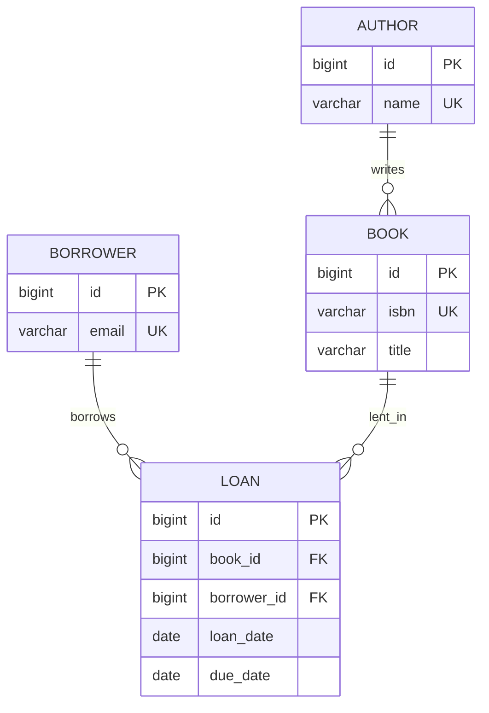

# `data-model` — `references/05-note-types/data-model.md`

> Documento normativo de la **Fase 85** del roadmap. Define el patrón de la nota
> de tipo `data-model`: 9 secciones con diagrama ER Mermaid, tabla canónica
> de campos con tipo y restricciones, relaciones y cardinalidad, claves e
> índices, restricciones de integridad, consultas típicas y evolución del
> schema.
>
> **Cuándo cargar:** tras decidir el tipo de nota (selector F93) cuando el
> `note-type` resuelto es `data-model`; antes de redactar la primera
> sección. Instancia el patrón común de `references/07-visual/note-templates.md`
> (F75) §6.8.
>
> **Wirings:**
> - `references/07-visual/note-templates.md` (F75) §6.8 — patrón resumido.
> - `references/07-visual/density.md` (F76) — reglas R1-R8.
> - `references/04-authoring/properties.md` (F47) — frontmatter; `source-bearing` recomendado.
> - `references/04-authoring/inline-marks.md` (F46) — `{src:blk_xxxx}` por entidad/atributo/restricción.
> - `references/04-authoring/block-directives.md` (F45) — directivas `:::example`, `:::warning`, `:::danger`, `:::note`, `:::diagram`.
> - `references/04-authoring/depth-layers.md` (F51) — capas L1/L2/L3.
> - `references/05-note-types/concept.md` (F78) — paraguas común.
> - `references/05-note-types/syntax.md` (F84) — SQL que crea el schema se enlaza a `syntax`.
> - `references/05-note-types/procedure.md` (F80) — migraciones de schema como procedure.

---

## §1 · Propósito y alcance

Una nota `data-model` documenta **el modelo de datos de un sistema o
subsistema**: entidades, atributos con tipo y restricciones, relaciones con
cardinalidad, claves e índices, integridad, consultas típicas y evolución.

La diferencia con `syntax` (F84) es de granularidad: `syntax` documenta la
**gramática**; `data-model` documenta la **estructura de datos**.

Cubre schemas relacionales (PostgreSQL, MySQL, SQLite), schemas documento
(MongoDB, Firestore), schemas de objetos (Kubernetes CRDs, OpenAPI), y grafos
de entidades (LDAP, RDF).

**Fuera de alcance:** crear schema → `procedure` (F80) o `syntax` (F84);
endpoints → `api-reference` (F79); errores de constraints →
`error-troubleshooting` (F82); comparar 2 modelos → `comparison` (F87).

---

## §2 · Estructura de la nota

### §2.1 · Frontmatter (orden canónico, `source-bearing` recomendado)

```yaml
---
title: "<sistema/subsistema>: modelo de datos"
note-type: data-model
status: draft | published
summary: "<≤ 200 chars, 1 línea>"
reading-time-minutes: <int ≥ 1>
tags: [type/data-model, domain/<uno o más>, product/<nombre>]
source: "<ruta al doc oficial o schema>"
source-type: docs | schema | code | article
source-anchor: "<page|chapter|section_path>"
source-url: "<opcional>"
retrieved: <YYYY-MM-DD>
vendor: "<proveedor>"
product: "<nombre del producto>"
product-version: "<versión>"
related: "[[note:procedure-de-migracion]], [[note:concept-del-dominio]]"
---
```

### §2.2 · Apertura común (heredada de F75 §3)

```markdown
# {title}

## Cabecera
| Campo | Valor |
| --- | --- |
| **Resumen** | ... |
| **Procedencia** | source (source-type) §source-anchor · recuperado YYYY-MM-DD |
| **Versión** | product product-version |
| **Estado** | Publicado (published) / Borrador (draft) |
| **Tiempo de lectura** | N min |

## TL;DR
{primer párrafo del L1 — ≤ 8 líneas / ≤ 60 palabras}

{layer:l2}

## Modelo
```

### §2.3 · Las 9 secciones específicas + 3 de cierre

| # | Sección | Estado | Notas |
|---|---|---|---|
| 1 | `## TL;DR` | obligatoria | ≤ 60 palabras (R1). |
| 2 | `## Modelo` | obligatoria | Diagrama `:::diagram` Mermaid `erDiagram` con todas las entidades + relaciones. Criterio #2. |
| 3 | `## Entidades` | obligatoria | Sub-secciones H3 por cada entidad con descripción. |
| 4 | `## Campos` | obligatoria | Tabla 4-col `Campo / Tipo / Restricciones / Descripción`. Criterio #1. |
| 5 | `## Relaciones` | obligatoria | Tabla con cardinalidad (`1:1`, `1:N`, `N:M`) + descripción. |
| 6 | `## Claves e índices` | obligatoria | Tabla `Entidad / PK / Índices secundarios`. |
| 7 | `## Integridad` | obligatoria | Sub-secciones por tipo (PK, FK, UNIQUE, NOT NULL, CHECK); cada restricción con `:::warning`. Criterio #3. |
| 8 | `## Consultas típicas` | obligatoria | ≥ 3 queries SQL reales con `:::example`. |
| 9 | `## Evolución` | obligatoria | `:::note` con historia del schema. |
| 10 | `## Backlinks` | si hay aristas | Cierre común. |
| 11 | `## Queries` | si queries activas | Cierre común. |
| 12 | `## Ver también` | si `related:` | Cierre común. |

### §2.4 · Capas (heredado de F51)

| Capa | Marcador | Contenido |
|---|---|---|
| L1 | `{layer:l1}` | Solo `## TL;DR`. ≤ 60 palabras. |
| L2 | `{layer:l2}` | Modelo, Entidades, Campos, Relaciones, Claves. 60-80% del total. |
| L3 | `{layer:l3}` | Integridad, Consultas típicas, Evolución. Si > 100 líneas, `:::collapsible` con `default_open: false` (R7). |

### §2.5 · Autoevaluación (F102)

Tipos de pregunta asignados a `data-model` (ver
`references/09-study/self-evaluation.md` §3):

| Tipo de pregunta | Asignado |
|---|---|
| Recuerdo | ✅ |
| Aplicación | ✅ |
| Diagnóstico | — |
| Decisión | — |
| Predicción | — |

Notas: recuerdo (entidades, campos) + aplicación (consultas típicas).
Decisión se añade si la nota discute normalización o desnormalización
(sub-tipo `data-model-with-normalization`). La nota puede declarar
`self-evaluation-types` como superset del default.

---

## §3 · Componentes mínimos

| Componente | Mínimo | Fuente |
|---|---|---|
| Cabecera (F75 §2) | 5 campos en orden | F75 §2.1 |
| `## TL;DR` | ≤ 60 palabras / 8 líneas | F76 R1 |
| `## Modelo` | `:::diagram` Mermaid `erDiagram` | criterio #2 + §6.8 |
| `## Entidades` | ≥ 3 entidades con sub-secciones H3 | esta fase |
| `## Campos` | Tabla 4-col por entidad | criterio #1 |
| `## Relaciones` | Tabla con cardinalidad explícita | §6.8 |
| `## Claves e índices` | Tabla con PK + ≥ 1 índice secundario | esta fase |
| `## Integridad` | ≥ 1 `:::warning`/`:::danger` por tipo (PK, FK, UNIQUE, NOT NULL, CHECK) | criterio #3 |
| `## Consultas típicas` | ≥ 3 queries SQL en `:::example` | esta fase |
| `## Evolución` | ≥ 1 `:::note` con cambio de schema | esta fase |
| Marcas `{src:blk_xxxx}` | ≥ 1 por entidad/atributo/restricción/consulta del SDM | F46 + F76 R8 |
| Anclaje visual | ≥ 1 cada 200 palabras | F76 R3 |
| Cierre | `## Backlinks` + `## Queries` | F75 §4 |

### §3.1 · Tabla canónica de campos (4 columnas)

```
| Campo | Tipo | Restricciones | Descripción |
|---|---|---|---|
| `id` | BIGINT | PK, NOT NULL, AUTO_INCREMENT | Identificador único |
| `user_id` | BIGINT | NOT NULL, FK → users(id) | Referencia al usuario creador |
| `email` | VARCHAR(255) | NOT NULL, UNIQUE | Email del usuario |
| `created_at` | TIMESTAMP | NOT NULL, DEFAULT NOW() | Timestamp de creación |
```

Reglas:
- **4 columnas obligatorias** en este orden.
- Las celdas `Tipo` y `Restricciones` no pueden estar vacías.
- Los **tipos** usan notación canónica del SDM (`VARCHAR(255)`, `INT`, `TIMESTAMP`).
- Las **restricciones** se enumeran separadas por coma (`PK, NOT NULL, FK → users(id)`).

### §3.2 · Mermaid `erDiagram` (sintaxis canónica)

```
erDiagram
    USER ||--o{ ORDER : places
    USER { bigint id PK varchar email UK }
    ORDER { bigint id PK bigint user_id FK decimal amount }
    LINE_ITEM { bigint id PK bigint order_id FK bigint product_id FK }
```

Cardinalidades:
- `||--||` 1:1 obligatorio ambos lados
- `||--o{` 1:N (uno a muchos opcional)
- `||--|{` 1:N obligatorio en el lado "muchos"
- `}o--o{` N:M opcional ambos lados
- `}|--|{` N:M obligatorio ambos lados

---

## §4 · Reglas de contenido

### §4.1 · Densidad y estructura (R1-R8 de F76)

- **R1** `## TL;DR` ≤ 60 palabras / 8 líneas.
- **R2** Cada párrafo del L2 ≤ 200 palabras.
- **R3** ≥ 1 anclaje visual cada 200 palabras. Tablas y diagramas cuentan.
- **R4** ≤ 3 callouts consecutivos sin prosa intermedia.
- **R5** ≤ 5 viñetas consecutivas.
- **R6** Cada H2/H3 tiene ≥ 1 párrafo, tabla, callout, figura, diagrama o código.
- **R7** Cualquier sección > 100 líneas → `:::collapsible` con `default_open: false`.
- **R8** Densidad `{src:}` ≥ 0.80 sobre filas fácticas.

### §4.2 · Marcas inline (F46)

- **`{src:blk_xxxx}`** — 12 caracteres hexadecimales (INV-I5). Cada entidad, atributo, restricción y consulta del SDM lleva `{src:}`. Cambios en `## Evolución` también.
- **`[[term:nombre]]`** — primera aparición del término (INV-I2). Usar para: nombres de entidades (`User`, `Order`), tipos de datos (`VARCHAR`, `TIMESTAMP`).
- **`[[note:id]]`** — enlaces a `procedure` (migración), `syntax` (DDL completo), `concept` (qué representa una entidad), `error-troubleshooting` (errores de constraint).
- **`:::external`** — para heurísticas operativas o decisiones que NO vienen del SDM.

### §4.3 · Anti-patrones

1. **"Entidad sin tabla de Campos"** (criterio #1) — el autor describe la entidad pero omite los atributos. Solución: cada entidad en `## Entidades` debe tener ≥ 1 fila en `## Campos`.
2. **"Tipos en prosa"** — "el id es un entero de 64 bits" sin tabla. Solución: tabla 4-col obligatoria.
3. **"ER no coincide con Relaciones"** (criterio #2) — el ER tiene `User ||--o{ Order` pero la tabla dice `1:1`. Solución: battery C3 hace matching cruzado.
4. **"Restricción inventada"** (criterio #3) — `:::warning` sin `{src:blk_xxxx}`. Solución: cada restricción lleva src.
5. **"Tipos inconsistentes"** — usar `string` y `VARCHAR(255)` en la misma nota. Solución: notación canónica.
6. **"Diagrama ER > 12 entidades"** — ilegible. Solución: `subgraph` para agrupar dominios.
7. **"Consultas típicas irrelevantes"** — `SELECT * FROM pg_class WHERE 1=0`. Solución: cada query debe tener propósito claro documentado.
8. **"Evolución especulativa"** — predicciones futuras sin respaldo. Solución: la sección se limita a historia documentada.
9. **"Sección solo de viñetas"** (R6) — `## Entidades` con bullets sin contexto. Solución: 1 párrafo introductorio + sub-secciones H3.
10. **"Sin diagrama ER"** — la sección `## Modelo` solo tiene tabla. Solución: el `erDiagram` Mermaid es obligatorio.

### §4.4 · Directivas de bloque (F45)

| Sección | Directiva preferida | Justificación |
|---|---|---|
| `## Modelo` | `:::diagram` Mermaid `erDiagram` | F45 §10.18 + criterio #2. |
| `## Entidades` | Sub-secciones H3 con párrafo | F75 §5.1. |
| `## Campos` | Tabla GFM 4-col | F75 §5.1 + criterio #1. |
| `## Relaciones` | Tabla GFM o diagrama ER detallado | F75 §5.1. |
| `## Claves e índices` | Tabla GFM | F75 §5.1. |
| `## Integridad` | `:::warning` por CHECK/FK/UNIQUE; `:::danger` por NOT NULL | F45 §6. |
| `## Consultas típicas` | `:::example` con bloque `code sql` | F45 §6 fila 10. |
| `## Evolución` | `:::note` o tabla con cambios | F45 §6 fila 12. |

### §4.5 · Diferencias operativas

| Concepto | Definición operativa |
|---|---|
| **Entidad** | Tabla o colección con identidad propia (PK). |
| **Atributo** | Columna con tipo y restricciones. |
| **Restricción** | Regla que limita valores válidos (CHECK, FK, UNIQUE, NOT NULL, DEFAULT). |
| **PK** | Atributo(s) que identifica unívocamente cada fila. |
| **Índice** | Estructura auxiliar que acelera queries a costa de I/O de escritura. |
| **Relación** | Asociación entre 2 entidades con cardinalidad. |
| **Cardinalidad** | 1:1 / 1:N / N:M. |

---

## §5 · Activación por perfil

```yaml
notes:
  types:
    data-model:
      require_er_diagram: true          # default: true (criterio #2)
      require_fields_table: true        # default: true (criterio #1)
      require_integrity_section: true   # default: true (criterio #3)
      min_entities: 3                   # default: 3
      min_relationships: 2              # default: 2
      min_integrity_types: 4            # default: 4 (PK, FK, UNIQUE, NOT NULL, CHECK)
      min_sample_queries: 3             # default: 3
      enforce_type_notation: true        # default: true (VARCHAR(255), BIGINT, etc.)
      enforce_hex_source: true          # default: true
```

| Campo | Default | Significado |
|---|---|---|
| `require_er_diagram` | `true` | `## Modelo` lleva `:::diagram` Mermaid `erDiagram` (criterio #2). |
| `require_fields_table` | `true` | `## Campos` con tabla 4-col (criterio #1). |
| `require_integrity_section` | `true` | `## Integridad` con restricciones documentadas (criterio #3). |
| `min_entities` | `3` | Mínimo de entidades en el modelo. |
| `min_relationships` | `2` | Mínimo de relaciones. |
| `min_integrity_types` | `4` | Mínimo de tipos de restricción (PK, FK, UNIQUE, NOT NULL, CHECK). |
| `min_sample_queries` | `3` | Mínimo de consultas típicas. |
| `enforce_type_notation` | `true` | Tipos usan notación canónica. |
| `enforce_hex_source` | `true` | Cada restricción lleva `{src:blk_xxxx}`. |

---

## §6 · Checklist de cierre

Esta sección resume el bloque del tipo. La fuente normativa es
`references/10-quality/checklists-by-type.md` §4.8. Esta copia se conserva
para que el agente que carga solo este archivo tenga la lista delante;
cualquier cambio debe aplicarse primero allí y después sincronizarse aquí.

### §6.1 · Bloqueantes [B]

- [ ] [B] Cabecera con 5 campos en orden (F75 §2.1).
- [ ] [B] `source-bearing` recomendado (F75 §6.8).
- [ ] [B] `## TL;DR` ≤ 60 palabras / 8 líneas (R1).
- [ ] [B] `## Modelo` con `:::diagram` Mermaid `erDiagram` (criterio #2).
- [ ] [B] `## Entidades` con ≥ 3 sub-secciones H3.
- [ ] [B] `## Campos` con tabla 4-col; cada fila tiene Tipo y Restricciones no vacíos (criterio #1).
- [ ] [B] `## Relaciones` con tabla y cardinalidad explícita; las relaciones coinciden con el ER (criterio #2).
- [ ] [B] `## Claves e índices` con tabla.
- [ ] [B] `## Integridad` con `:::warning`/`:::danger` por tipo (PK, FK, UNIQUE, NOT NULL, CHECK) con `{src:}` (criterio #3).
- [ ] [B] `## Consultas típicas` con ≥ 3 queries SQL en `:::example`.
- [ ] [B] `## Evolución` con ≥ 1 cambio documentado.
- [ ] [B] Densidad `{src:}` ≥ 0.80 sobre filas fácticas (R8).
- [ ] [B] `density_check.py --note <path>` exit 0.

### §6.2 · Recomendados [R]

- [ ] [R] Cierre: `## Backlinks` + `## Queries`.

---

## §7 · Nota mínima viable

Ejemplo canónico de ~85 líneas con 4 entidades. Pasa `density_check.py --strict` exit 0.

```markdown
---
title: "Biblioteca — modelo de datos"
note-type: data-model
status: draft
tags: [type/data-model, domain/library]
source: "Library Management Schema v1"
source-type: docs
source-anchor: "schema-v1"
retrieved: 2026-09-27
vendor: Open Library Foundation
product: Library
product-version: "1"
---

# Biblioteca — modelo de datos

## Cabecera
| Campo | Valor |
| --- | --- |
| **Resumen** | Modelo de datos de una biblioteca con 4 entidades (Book, Author, Borrower, Loan) y 4 relaciones. |
| **Procedencia** | Library Management Schema v1 (docs) §schema-v1 · recuperado 2026-09-27 |
| **Versión** | 1 |
| **Estado** | Borrador (draft) |
| **Tiempo de lectura** | 4 min |

## TL;DR
4 entidades: Book (con ISBN único), Author (N:M con Book), Borrower (1:N con Loan), Loan (1:N con Book, FK a Borrower). Integridad: PK + FK + UNIQUE en ISBN + CHECK en due_date > loan_date. {src:blk_d00000000001}

{layer:l2}

## Modelo
:::diagram

:::

## Entidades

### Author
Representa un autor de uno o más libros. Identificado por id; nombre único. {src:blk_d00000000002}

### Book
Representa un libro físico o digital. Identificado por id; ISBN único. {src:blk_d00000000003}

### Borrower
Persona que toma libros en préstamo. Identificada por id; email único. {src:blk_d00000000004}

### Loan
Préstamo de un Book a un Borrower con fecha de inicio y devolución. {src:blk_d00000000005}

## Campos

### Author
| Campo | Tipo | Restricciones | Descripción |
|---|---|---|---|
| `id` | BIGINT | PK, NOT NULL, AUTO_INCREMENT | Identificador único |
| `name` | VARCHAR(255) | NOT NULL, UNIQUE | Nombre completo |

### Book
| Campo | Tipo | Restricciones | Descripción |
|---|---|---|---|
| `id` | BIGINT | PK, NOT NULL, AUTO_INCREMENT | Identificador único |
| `isbn` | VARCHAR(13) | NOT NULL, UNIQUE | ISBN-13 |
| `title` | VARCHAR(255) | NOT NULL | Título del libro |

### Borrower
| Campo | Tipo | Restricciones | Descripción |
|---|---|---|---|
| `id` | BIGINT | PK, NOT NULL, AUTO_INCREMENT | Identificador único |
| `email` | VARCHAR(255) | NOT NULL, UNIQUE | Email único |

### Loan
| Campo | Tipo | Restricciones | Descripción |
|---|---|---|---|
| `id` | BIGINT | PK, NOT NULL, AUTO_INCREMENT | Identificador único |
| `book_id` | BIGINT | NOT NULL, FK → book(id) | Libro prestado |
| `borrower_id` | BIGINT | NOT NULL, FK → borrower(id) | Persona |
| `loan_date` | DATE | NOT NULL, DEFAULT CURRENT_DATE | Fecha del préstamo |
| `due_date` | DATE | NOT NULL | Fecha de devolución |

## Relaciones
| Origen | Cardinalidad | Destino | Descripción |
|---|---|---|---|
| Author | N:M | Book | Autor escribe N libros; libro tiene N autores |
| Book | 1:N | Loan | Libro tiene N préstamos |
| Borrower | 1:N | Loan | Borrower tiene N préstamos |

## Claves e índices
| Entidad | PK | Índices secundarios |
|---|---|---|
| Author | id | UNIQUE(name) |
| Book | id | UNIQUE(isbn) |
| Borrower | id | UNIQUE(email) |
| Loan | id | INDEX(book_id, borrower_id) |

## Integridad

:::warning
**PK** — Author(id), Book(id), Borrower(id), Loan(id). Auto-increment + NOT NULL. {src:blk_d00000000010}
:::

:::warning
**FK** — Loan.book_id → Book(id); ON DELETE RESTRICT. {src:blk_d00000000011}
:::

:::warning
**FK** — Loan.borrower_id → Borrower(id); ON DELETE RESTRICT. {src:blk_d00000000012}
:::

:::warning
**UNIQUE** — Book(isbn). Impide duplicados. {src:blk_d00000000013}
:::

:::warning
**CHECK** — Loan.due_date > loan_date. {src:blk_d00000000014}
:::

:::danger
**NOT NULL** — todos los campos críticos. {src:blk_d00000000015}
:::

## Consultas típicas

:::example
**Q1:** Libros prestados actualmente.

```sql
SELECT b.title, l.loan_date, l.due_date
FROM loan l JOIN book b ON l.book_id = b.id
WHERE l.borrower_id = $1 AND l.due_date >= CURRENT_DATE;
```
:::

:::example
**Q2:** Top 10 autores por nº de libros.

```sql
SELECT a.name, COUNT(*) AS n_books
FROM author a JOIN book_author ba ON a.id = ba.author_id
GROUP BY a.id ORDER BY n_books DESC LIMIT 10;
```
:::

:::example
**Q3:** Préstamos vencidos.

```sql
SELECT b.email, COUNT(*) AS n_overdue
FROM borrower b JOIN loan l ON b.id = l.borrower_id
WHERE l.due_date < CURRENT_DATE GROUP BY b.email HAVING COUNT(*) > 0;
```
:::

## Evolución

:::note
**v1.0 (2024-Q1):** schema inicial. **v1.1 (2024-Q3):** índice compuesto en `Loan(book_id, borrower_id)`. **v2.0 (planificado):** añadir `Reservation`. {src:blk_d00000000020}
:::

## Backlinks
- [[note:library-procedure-checkout]] — procedure de checkout que crea Loan.
- [[note:library-syntax-schema]] — DDL completo del schema.
```

Esta nota mínima (~85 líneas) cubre R1-R8 de F76 y los 3 criterios del
ROADMAP. Sirve de **referencia de forma**.

---

## §8 · Wirings y referencias cruzadas

- **F11** `assets/profile.template.yaml` — defaults de §5.
- **F12** `references/04-authoring/notemark.md` — directivas `:::example`, `:::warning`, `:::danger`, `:::note`, `:::diagram`.
- **F44** `references/03-knowledge/note-plan.md` — selector asigna `data-model` cuando la unidad es un schema.
- **F45** `references/04-authoring/block-directives.md` — directivas consumidas.
- **F46** `references/04-authoring/inline-marks.md` — `{src:blk_xxxx}` por entidad; `[[term:nombre]]` para tipos.
- **F47** `references/04-authoring/properties.md` — frontmatter; `source-bearing` recomendado.
- **F51** `references/04-authoring/depth-layers.md` — capas L1/L2/L3.
- **F66** `references/07-visual/mermaid-portable.md` — portabilidad del Mermaid `erDiagram`.
- **F72** `references/07-visual/tokens.md` — colores semánticos de las directivas.
- **F75** `references/07-visual/note-templates.md` — cabecera, apertura/cierre común, §6.8 patrón resumido.
- **F76** `references/07-visual/density.md` — tabla cerrada R1-R8 ejecutable.
- **F77** `evals/visual/` — verificación visual multi-destino.
- **F78** `references/05-note-types/concept.md` — paraguas común.
- **F79** `references/05-note-types/api-reference.md` — endpoints que operan sobre el modelo.
- **F80** `references/05-note-types/procedure.md` — migraciones de schema como procedure.
- **F82** `references/05-note-types/error-troubleshooting.md` — errores de constraints.
- **F84** `references/05-note-types/syntax.md` — DDL completo del schema.
- **F87** `references/05-note-types/comparison.md` — comparar 2 modelos alternativos.

---

## §9 · Verificación al cierre de la fase

- `wc -l references/05-note-types/data-model.md` ≤ 500 líneas.
- §2 con 4 subsecciones.
- §3 con tabla de componentes mínimos + §3.1 tabla 4-col + §3.2 sintaxis Mermaid.
- §4 con 5 subsecciones.
- §5 con tabla de campos del perfil y sus defaults.
- §6 con checklist de cierre ≥ 14 items.
- §7 con nota mínima viable.
- §8 con ≥ 17 wirings.
- §9 lista de verificación explícita.

**Criterios de aceptación del ROADMAP F85:**

1. _Toda entidad tiene atributos con tipo y restricciones._ → battery C2: cada entidad listada en `## Entidades` tiene ≥ 1 fila en `## Campos` con Tipo y Restricciones no vacíos.
2. _El ER refleja exactamente las relaciones descritas._ → battery C3: cada fila en `## Relaciones` aparece como línea en el `erDiagram` Mermaid de `## Modelo`.
3. _Las restricciones de integridad están completas._ → battery C4: `## Integridad` tiene `:::warning`/`:::danger` por tipo (PK, FK, UNIQUE, NOT NULL, CHECK), cada uno con `{src:blk_xxxx}`.
