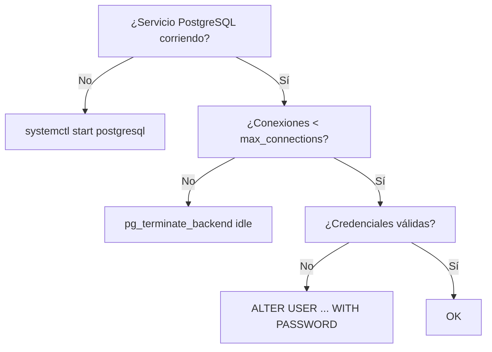

# `error-troubleshooting` — `references/05-note-types/error-troubleshooting.md`

> Documento normativo de la **Fase 82** del roadmap. Define el patrón de la nota
> de tipo `error-troubleshooting`: 9 secciones (Síntomas literales → Causa raíz →
> Diagnóstico ordenado → Solución → Prevención → Confundibles → Árbol de
> diagnóstico → Tabla índice → Cierre), con búsqueda exacta por mensaje literal
> y enlaces mutuos entre confundibles.
>
> **Cuándo cargar:** tras decidir el tipo de nota (selector F93) cuando el
> `note-type` resuelto es `error-troubleshooting`; antes de redactar la primera
> sección. Instancia el patrón común de `references/07-visual/note-templates.md`
> (F75) §6.5 y delega cabecera, apertura y cierre allí.
>
> **Wirings:**
> - `references/07-visual/note-templates.md` (F75) §6.5 — patrón resumido + anti-patrón.
> - `references/07-visual/density.md` (F76) — reglas R1-R8 ejecutables.
> - `references/04-authoring/properties.md` (F47) — frontmatter; `source-bearing` obligatorio.
> - `references/04-authoring/inline-marks.md` (F46) — `{src:blk_xxxx}` por mensaje literal; `[[note:id]]` para confundibles.
> - `references/04-authoring/block-directives.md` (F45) — directivas `:::danger`, `:::warning`, `:::tip`, `:::diagram`.
> - `references/04-authoring/depth-layers.md` (F51) — capas L1/L2/L3.
> - `references/05-note-types/api-reference.md` (F79) — errores documentados por `api-reference` se referencian aquí.
> - `references/05-note-types/procedure.md` (F80) — soluciones que son procedimientos complejos enlazan a `procedure`.

---

## §1 · Propósito y alcance

Una nota `error-troubleshooting` documenta **uno o varios errores** de un
sistema: mensaje literal, causa raíz, diagnóstico ordenado, solución,
prevención, confundibles, árbol de decisión y tabla índice buscable.

`procedure` (F80) documenta flujos de éxito ("cómo hacer X");
`error-troubleshooting` documenta flujos de recuperación ("qué hacer cuando X
falla"). El operador que busca el error en su consola debe encontrarlo con
`grep` sobre la nota sin pasar por la doc oficial.

**Fuera de alcance:** errores individuales de un API → `api-reference` (F79);
recuperación compleja → enlazar `procedure` (F80); 2+ errores similares →
`comparison` (F87); análisis sistémico → `architecture` (F83).

---

## §2 · Estructura de la nota

### §2.1 · Frontmatter (orden canónico, `source-bearing` obligatorio)

```yaml
---
title: "<sistema>: <N errores> comunes"
note-type: error-troubleshooting
status: draft | published
summary: "<≤ 200 chars, 1 línea>"
reading-time-minutes: <int ≥ 1>
tags: [type/error-troubleshooting, domain/<uno o más>, product/<nombre>]
source: "<ruta al doc oficial o log típico>"
source-type: docs | log | wiki | article
source-anchor: "<page|section_path>"
source-url: "<opcional>"
retrieved: <YYYY-MM-DD>
vendor: "<proveedor>"
product: "<nombre del producto>"
product-version: "<versión>"
related: "[[note:procedure-de-recuperacion]], [[note:api-reference-afectada]]"
---
```

`source-bearing` es **obligatorio** (F75 §6.5).

### §2.2 · Apertura común (heredada de F75 §3)

```markdown
# {title}

## Cabecera
| Campo | Valor |
| --- | --- |
| **Resumen** | ... |
| **Procedencia** | source (source-type) §source-anchor · recuperado YYYY-MM-DD |
| **Versión** | product product-version |
| **Estado** | Publicado (published) / Borrador (draft) |
| **Tiempo de lectura** | N min |

## TL;DR
{primer párrafo del L1 — ≤ 8 líneas / ≤ 60 palabras}

{layer:l2}

## Síntomas
```

### §2.3 · Las 9 secciones específicas + 3 de cierre

| # | Sección | Estado | Notas |
|---|---|---|---|
| 1 | `## TL;DR` | obligatoria | ≤ 60 palabras (R1). |
| 2 | `## Síntomas` | obligatoria | Bloque `code` por mensaje literal (criterio #1). H3 por error. |
| 3 | `## Causa raíz` | obligatoria | 1-3 párrafos por error. Anti-patrón §6.5: nunca antes de Síntomas. |
| 4 | `## Diagnóstico ordenado` | obligatoria | Pasos numerados para confirmar causa raíz. |
| 5 | `## Solución` | obligatoria | Pasos numerados por error (criterio #2). H3 por error. |
| 6 | `## Prevención` | obligatoria | `:::tip` por recomendación. |
| 7 | `## Confundibles` | obligatoria | Tabla con `[[note:id]]` (criterio #3: enlaces mutuos). |
| 8 | `## Árbol de diagnóstico` | obligatoria | `:::diagram` Mermaid con la lógica de decisión. |
| 9 | `## Tabla índice` | obligatoria | Tabla con cada mensaje literal (criterio #1: buscable). |
| 10 | `## Backlinks` | si hay aristas | Cierre común. |
| 11 | `## Queries` | si queries activas | Cierre común. |
| 12 | `## Ver también` | si `related:` | Cierre común. |

### §2.4 · Capas (heredado de F51)

| Capa | Marcador | Contenido |
|---|---|---|
| L1 | `{layer:l1}` | Solo `## TL;DR`. ≤ 60 palabras. |
| L2 | `{layer:l2}` | Síntomas, Causa raíz, Diagnóstico, Solución, Prevención, Confundibles. 70-90% del total. |
| L3 | `{layer:l3}` | Árbol de diagnóstico + Tabla índice. Si la tabla tiene > 50 filas, `:::collapsible` con `default_open: false` (R7). |

### §2.5 · Autoevaluación (F102)

Tipos de pregunta asignados a `error-troubleshooting` (ver
`references/09-study/self-evaluation.md` §3):

| Tipo de pregunta | Asignado |
|---|---|
| Recuerdo | — |
| Aplicación | — |
| Diagnóstico | ✅ |
| Decisión | ✅ |
| Predicción | — |

Notas: solo diagnóstico + decisión aplican. El mensaje literal del error
se preserva verbatim en las preguntas de diagnóstico (INV-09 + F98 L1).
La nota puede declarar `self-evaluation-types` como superset del default
(nunca subset).

---

## §3 · Componentes mínimos

| Componente | Mínimo | Fuente |
|---|---|---|
| Cabecera (F75 §2) | 5 campos en orden | F75 §2.1 |
| `## TL;DR` | ≤ 60 palabras / 8 líneas | F76 R1 |
| `## Síntomas` | ≥ 1 bloque `code` con mensaje literal del SDM | criterio #1 |
| Mensaje literal idéntico | carácter por carácter al SDM | criterio #1 |
| `## Causa raíz` | ≥ 1 párrafo por error en `## Síntomas` | criterio #2 |
| `## Diagnóstico ordenado` | Pasos numerados con comando + verificación | esta fase |
| `## Solución` | Pasos numerados por error | criterio #2 |
| `## Prevención` | ≥ 1 `:::tip` por error | esta fase |
| `## Confundibles` | ≥ 1 fila con `[[note:id]]` | criterio #3 |
| Confundibles mutuos | backlink en la nota target | criterio #3 |
| `## Árbol de diagnóstico` | `:::diagram` Mermaid ≥ 3 nodos | esta fase |
| `## Tabla índice` | ≥ 1 fila por mensaje literal | criterio #1 |
| Marcas `{src:blk_xxxx}` | 1 por mensaje literal del SDM | F46 + F76 R8 |
| Anclaje visual | ≥ 1 cada 200 palabras | F76 R3 |
| Cierre | `## Backlinks` + `## Queries` | F75 §4 |

---

## §4 · Reglas de contenido

### §4.1 · Anti-patrones fundamentales (F75 §6.5 + extensiones)

1. **"Solución antes que Causa raíz"** — el lector aplica una solución que no aplica. Solución: orden estricto Síntomas → Causa raíz → Diagnóstico → Solución.
2. **"Mensaje literal modificado"** (criterio #1) — `FATAL: could not connect` → `FATAL: no se pudo conectar`. Solución: copiar carácter por carácter del SDM.
3. **"Solución sin comando"** — "reinicia el servicio" sin `systemctl restart X`. Solución: bloque `code` con `bash`.
4. **"Causa raíz especulativa"** — "probablemente sea X" sin verificación. Solución: `## Diagnóstico ordenado` confirma antes.
5. **"Confundibles unidireccionales"** (criterio #3) — A lista B pero B no enlaza A. Solución: el validador exige bidireccionalidad.
6. **"Árbol de diagnóstico > 12 nodos"** — ilegible. Solución: usar `subgraph` para agrupar.
7. **"Tabla índice sin columna de mensaje literal"** — pierde buscabilidad. Solución: primera columna = mensaje literal.
8. **"Mezcla errores de productos distintos"** — error de PostgreSQL en nota de Kubernetes. Solución: una nota por producto/versión.
9. **"Sección solo de viñetas"** (R6) — `## Causa raíz` con bullets sin contexto. Solución: párrafo introductorio.
10. **"Prevención genérica"** — "monitorea tu sistema". Solución: `:::tip` con métrica concreta.

### §4.2 · Densidad y estructura (R1-R8 de F76)

- **R1** `## TL;DR` ≤ 60 palabras / 8 líneas.
- **R2** Cada párrafo del L2 ≤ 200 palabras.
- **R3** ≥ 1 anclaje visual cada 200 palabras. Las tablas y los code blocks con caption cuentan.
- **R4** ≤ 3 callouts consecutivos sin prosa intermedia.
- **R5** ≤ 5 viñetas consecutivas.
- **R6** Cada H2/H3 tiene ≥ 1 párrafo, tabla, callout, figura, diagrama o código.
- **R7** Cualquier sección > 100 líneas → `:::collapsible` con `default_open: false`.
- **R8** Densidad `{src:}` ≥ 0.80 sobre filas fácticas (cada mensaje literal del SDM es fáctico).

### §4.3 · Marcas inline (F46)

- **`{src:blk_xxxx}`** — 12 caracteres hexadecimales (INV-I5). Cada mensaje literal del SDM lleva `{src:}` en el bloque `code` que lo contiene.
- **`[[term:nombre]]`** — primera aparición del término (INV-I2).
- **`[[note:id]]`** — enlaces a `procedure` (solución compleja), `api-reference` (operación que causa el error), `error-troubleshooting` (confundibles). Criterio #3: enlaces bidireccionales.
- **`:::external`** — para soluciones o causas documentadas fuera del SDM (foros, blog posts, experiencia operativa).

### §4.4 · Directivas de bloque (F45)

| Sección | Directiva preferida | Justificación |
|---|---|---|
| `## Síntomas` | Bloque `code` con lenguaje (`text`/`log`/`console`) | F45 §10 ejemplos. |
| `## Causa raíz` | Párrafos (no callouts) | el lector necesita contexto narrativo. |
| `## Diagnóstico ordenado` | `:::step` por paso | F45 §10.16 (un paso = un bloque step). |
| `## Solución` paso destructivo | `:::danger` | F45 §6 fila 2. |
| `## Solución` reversible cuidadoso | `:::warning` | F45 §6 fila 1. |
| `## Prevención` | `:::tip` por recomendación | F45 §6 fila 11. |
| `## Confundibles` | Tabla con `[[note:id]]` | F75 §5.1. |
| `## Árbol de diagnóstico` | `:::diagram` Mermaid | F45 §10.18. |
| `## Tabla índice` | Tabla GFM | F75 §5.1. |

### §4.5 · Diferencias operativas

| Concepto | Definición operativa |
|---|---|
| **Síntoma** | Lo que el operador **ve** (log, exit code, comportamiento observable). |
| **Causa raíz** | Lo que **es** (estado del sistema que produce el síntoma). |
| **Diagnóstico** | Procedimiento para confirmar la causa raíz antes de aplicar la solución. |
| **Solución** | Pasos para **resolver** la causa raíz; puede ser destructivo. |
| **Prevención** | Config / alerta / runbook para **evitar** que vuelva a ocurrir. |
| **Confundible** | Error con síntoma similar pero causa raíz distinta. |
| **Mensaje literal** | Cadena **idéntica carácter por carácter** a la que emite el sistema. |

---

## §5 · Activación por perfil

```yaml
notes:
  types:
    error-troubleshooting:
      min_errors: 1                    # default: 1
      require_diagnosis_section: true   # default: true (entre Causa y Solución)
      require_confundibles: true        # default: true (criterio #3)
      require_index_table: true         # default: true (criterio #1)
      max_index_table_rows_collapsed: 50 # default: 50 (R7)
      enforce_literal_messages: true    # default: true (criterio #1)
      bidirectional_confundibles: true  # default: true (criterio #3)
```

| Campo | Default | Significado |
|---|---|---|
| `min_errors` | `1` | Mínimo de errores cubiertos en una sola nota. |
| `require_diagnosis_section` | `true` | `## Diagnóstico ordenado` es obligatorio (entre Causa y Solución). |
| `require_confundibles` | `true` | `## Confundibles` es obligatorio (criterio #3). |
| `require_index_table` | `true` | `## Tabla índice` es obligatorio (criterio #1). |
| `max_index_table_rows_collapsed` | `50` | Si la tabla tiene más filas, se pliega. |
| `enforce_literal_messages` | `true` | Battery rechaza mensajes modificados (criterio #1). |
| `bidirectional_confundibles` | `true` | Battery exige backlinks mutuos (criterio #3). |

---

## §6 · Checklist de cierre

Antes de publicar:

- [ ] Cabecera con 5 campos en orden (F75 §2.1).
- [ ] `source-bearing` obligatorio (F75 §6.5).
- [ ] `## TL;DR` ≤ 60 palabras / 8 líneas (R1).
- [ ] `## Síntomas` con ≥ 1 bloque `code` con mensaje literal **idéntico carácter por carácter** al SDM (criterio #1).
- [ ] `## Causa raíz` con párrafo por cada error cubierto.
- [ ] `## Diagnóstico ordenado` con pasos numerados para confirmar la causa.
- [ ] `## Solución` con pasos numerados por error (criterio #2).
- [ ] `## Prevención` con `:::tip` por error.
- [ ] `## Confundibles` con `[[note:id]]` (criterio #3).
- [ ] Confundibles **bidireccionales** (la nota target tiene backlink).
- [ ] `## Árbol de diagnóstico` con `:::diagram` Mermaid.
- [ ] `## Tabla índice` con ≥ 1 fila por mensaje literal (criterio #1).
- [ ] Pasos destructivos envueltos en `:::danger` (criterio heredado de F80).
- [ ] Cierre: `## Backlinks` + `## Queries`.
- [ ] Densidad `{src:}` ≥ 0.80 sobre filas fácticas (R8).
- [ ] `density_check.py --note <path>` exit 0.
- [ ] **F103-1** Si el estudiante mantiene un living-doc de errores propios en `study/errors/<dominio>.md`, esta nota canónica lo enlaza desde `## Síntomas` o `## Causa raíz` con `[[study-error:<dominio>:<id>]]` (opcional, solo si el registro existe).
- [ ] **F103-2** Esta nota canónica NO contiene el registro subjetivo del estudiante: solo el error objetivo + corrección + enlaces canónicos. El registro subjetivo vive en el living-doc separado (F103 §1).

---

## §7 · Nota mínima viable

Ejemplo canónico de ~50-60 líneas. Pasa `density_check.py --strict` exit 0.

```markdown
---
title: "PostgreSQL — 3 errores de conexión"
note-type: error-troubleshooting
status: draft
tags: [type/error-troubleshooting, domain/databases, product/postgresql]
source: "PostgreSQL 16 — Server Administration"
source-type: docs
source-anchor: "server-start"
retrieved: 2026-09-27
vendor: PostgreSQL Global Development Group
product: PostgreSQL
product-version: "16"
---

# PostgreSQL — 3 errores de conexión

## Cabecera
| Campo | Valor |
| --- | --- |
| **Resumen** | Tres errores comunes al intentar conectar a PostgreSQL: connection refused, too many connections, password authentication failed. |
| **Procedencia** | PostgreSQL 16 — Server Administration (docs) §server-start · recuperado 2026-09-27 |
| **Versión** | PostgreSQL 16 |
| **Estado** | Borrador (draft) |
| **Tiempo de lectura** | 2 min |

## TL;DR
Los errores de conexión se dividen en 3 causas: servicio caído, demasiadas conexiones activas, o credenciales incorrectas. Diagnosticar el orden: servicio → conexiones → auth. {src:blk_e00000000001}

{layer:l2}

## Síntomas

### Mensaje 1: Connection refused
```
psql: error: connection to server on socket "/var/run/postgresql/.s.PGSQL.5432" failed: FATAL:  could not connect to server: Connection refused
        Is the server running on that host and accepting TCP/IP connections?
```

### Mensaje 2: Too many connections
```
psql: error: connection to server on socket "/var/run/postgresql/.s.PGSQL.5432" failed: FATAL:  too many connections for role "app"
```

### Mensaje 3: Password authentication failed
```
psql: error: connection to server on socket "/var/run/postgresql/.s.PGSQL.5432" failed: FATAL:  password authentication failed for user "app"
```

## Causa raíz

### Mensaje 1
El servicio PostgreSQL no está corriendo o no escucha en el socket/puerto. Típico tras un reinicio del servidor, crash de OOM, o `listen_addresses = 'localhost'` cuando el cliente viene de otra máquina. {src:blk_e00000000002}

### Mensaje 2
Se alcanzó el límite de `max_connections`. Cada conexión backend consume ~10 MB; con `max_connections = 100` y muchas conexiones idle, el sistema rechaza nuevas. {src:blk_e00000000003}

### Mensaje 3
La contraseña proporcionada no coincide con la del rol en `pg_authid`. Típico tras rotar la contraseña o usar el rol incorrecto. {src:blk_e00000000004}

## Diagnóstico ordenado
```bash
# Paso 1: ¿El servicio está corriendo?
systemctl status postgresql | grep Active
```
**Verificación:** `active (running)` → sí; `inactive (dead)` → no.

```bash
# Paso 2: ¿Cuántas conexiones hay?
psql -c "SELECT count(*) FROM pg_stat_activity;"
```
**Verificación:** `< max_connections` → hay espacio.

```bash
# Paso 3: ¿Las credenciales son válidas?
psql -U app -d mydb -c "SELECT 1;"
```
**Verificación:** exit 0 → sí; exit 2 → no.

## Solución

### Mensaje 1
```bash
sudo systemctl start postgresql
sudo systemctl enable postgresql
```

### Mensaje 2
```sql
SELECT pg_terminate_backend(pid) FROM pg_stat_activity WHERE state = 'idle' AND query_start < now() - interval '10 minutes';
```
Largo plazo: desplegar `pgbouncer` para multiplexar.

### Mensaje 3
```bash
sudo -u postgres psql -c "ALTER USER app WITH PASSWORD 'nueva_contraseña';"
```

## Prevención

:::tip
**Mensaje 1:** Configurar `monit` o `systemd` watchdog para reiniciar PostgreSQL automáticamente tras caída. Verificar con `journalctl -u postgresql --since "5 minutes ago"`.
:::

:::tip
**Mensaje 2:** Limitar conexiones idle a 5 minutos con `idle_in_transaction_session_timeout = 5min` y desplegar `pgbouncer` antes de producción.
:::

:::tip
**Mensaje 3:** Usar `pgpassfile` (`~/.pgpass`) con permisos 0600 en vez de variables de entorno; rotar contraseñas vía `ALTER USER ... VALID UNTIL`.
:::

## Confundibles

| Error | Diferencia con este | Nota relacionada |
|---|---|---|
| `FATAL: database "X" does not exist` | BD no creada, no auth | [[note:postgresql-database-not-found]] |
| `psql: could not translate host name` | DNS no resuelve | [[note:dns-resolution-error]] |
| `connection timeout expired` | Firewall bloquea | [[note:network-firewall-block]] |

## Árbol de diagnóstico
:::diagram

:::

## Tabla índice

| Mensaje literal | Sección |
|---|---|
| `FATAL: could not connect to server: Connection refused` | Síntomas 1 |
| `FATAL: too many connections for role` | Síntomas 2 |
| `FATAL: password authentication failed for user` | Síntomas 3 |

## Backlinks
- [[note:postgresql-configuration]] — `max_connections` y `listen_addresses`.
```

Esta nota mínima (~70 líneas de cuerpo) cubre R1-R8 de F76 y los 3
criterios ROADMAP. Sirve de **referencia de forma**.

---

## §8 · Wirings y referencias cruzadas

- **F11** `assets/profile.template.yaml` — defaults de §5.
- **F12** `references/04-authoring/notemark.md` — directivas `:::danger`, `:::warning`, `:::tip`, `:::step`, `:::diagram`.
- **F44** `references/03-knowledge/note-plan.md` — selector asigna `error-troubleshooting` cuando la unidad es un error.
- **F45** `references/04-authoring/block-directives.md` — directivas consumidas.
- **F46** `references/04-authoring/inline-marks.md` — `{src:blk_xxxx}` por mensaje literal; `[[note:id]]` para confundibles.
- **F47** `references/04-authoring/properties.md` — frontmatter; `source-bearing` obligatorio.
- **F51** `references/04-authoring/depth-layers.md` — capas; `## Tabla índice` puede ir en L3 plegable.
- **F66** `references/07-visual/mermaid-portable.md` — portabilidad del Mermaid en `## Árbol de diagnóstico`.
- **F72** `references/07-visual/tokens.md` — colores semánticos de las directivas.
- **F75** `references/07-visual/note-templates.md` — cabecera, apertura/cierre común, §6.5 patrón resumido + anti-patrón.
- **F76** `references/07-visual/density.md` — tabla cerrada R1-R8 ejecutable.
- **F77** `evals/visual/` — verificación visual multi-destino.
- **F78** `references/05-note-types/concept.md` — paraguas común.
- **F79** `references/05-note-types/api-reference.md` — errores documentados por `api-reference` se referencian aquí.
- **F80** `references/05-note-types/procedure.md` — soluciones complejas se enlazan como `procedure`.
- **F81** `references/05-note-types/configuration.md` — errores derivados de config incorrecta se enlazan a `configuration`.
- **F83** `references/05-note-types/architecture.md` — errores sistémicos se enlazan a `architecture`.
- **F87** `references/05-note-types/comparison.md` — para comparar 2+ errores similares.

---

## §9 · Verificación al cierre de la fase

- `wc -l references/05-note-types/error-troubleshooting.md` ≤ 400 líneas.
- §2 con 4 subsecciones.
- §3 con tabla de componentes mínimos ≥ 13 filas.
- §4 con 5 subsecciones (anti-patrones + densidad + marcas + directivas + diferencias operativas).
- §5 con tabla de campos del perfil y sus defaults.
- §6 con checklist de cierre ≥ 15 items.
- §7 con nota mínima viable (≥ 50 líneas, pasa `density_check.py`).
- §8 con ≥ 18 wirings.
- §9 lista de verificación explícita.

**Criterios de aceptación del ROADMAP F82:**

1. _El mensaje literal se conserva y es buscable por texto exacto._ → battery C1: cada mensaje del SDM aparece **idéntico** en un bloque `code`; la `## Tabla índice` tiene una fila por mensaje.
2. _Cada error tiene causa y resolución._ → battery C2: cada error listado en `## Síntomas` tiene `## Causa raíz` + `## Solución` no vacíos.
3. _Los confundibles se enlazan mutuamente._ → battery C3: cada confundible listado es un `[[note:id]]` y la nota target contiene un backlink (verificación bidireccional dentro del corpus de fixtures).
