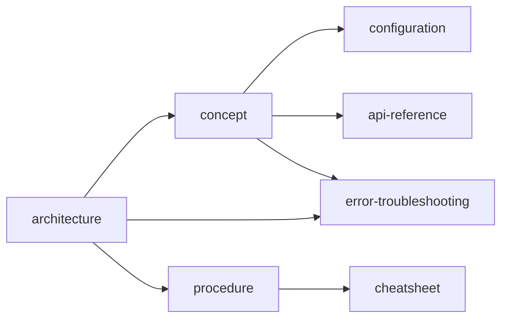
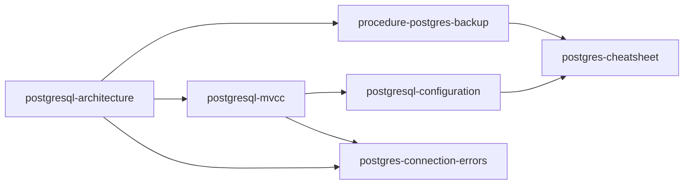

# `index-moc` — `references/05-note-types/index-moc.md`

> Documento normativo de la **Fase 91** del roadmap (tipo `[núcleo]`). Define
> el patrón de la nota de tipo `index-moc` (Map of Content): introducción
> breve, navegación con descripción de 1 línea por enlace, mapa conceptual,
> prerrequisitos, rutas de lectura, estado de cobertura, cobertura de la
> fuente, pendientes y consulta rápida.
>
> **Cuándo cargar:** tras decidir el tipo de nota (selector F93) cuando el
> `note-type` resuelto es `index-moc`; antes de redactar la primera sección.
> Instancia el patrón común de `references/07-visual/note-templates.md`
> (F75) §6.14.
>
> **Wirings:**
> - `references/07-visual/note-templates.md` (F75) §6.14 — patrón resumido.
> - `references/07-visual/density.md` (F76) — reglas R1-R8 (sin exención para index-moc).
> - `references/04-authoring/properties.md` (F47) — frontmatter sin `source-bearing` obligatorio.
> - `references/04-authoring/inline-marks.md` (F46) — `[[note:id]]` con descripción de 1 frase (criterio #1).
> - `references/04-authoring/block-directives.md` (F45) — directivas `:::note`, `:::tip`, `:::warning`.
> - `references/04-authoring/depth-layers.md` (F51) — capas L1/L2/L3.
> - `references/05-note-types/concept.md` (F78) — paraguas común; el MOC referencia notas concept.
> - `references/05-note-types/cheatsheet.md` (F90) — el MOC puede referenciar cheatsheets del mismo dominio.

---

## §1 · Propósito y alcance

Una nota `index-moc` documenta **el índice / Map of Content de un dominio o
corpus**: lista todas las notas que existen sobre el tema, agrupadas por
sección, con descripciones de 1 línea por enlace, mapa conceptual de las
relaciones entre notas, prerrequisitos, rutas de lectura, y declaración
explícita de qué cubre y qué no.

`index-moc` se redacta **al final** (ROADMAP explícito: "Se redacta al
final"), cuando el corpus del dominio ya está estabilizado. Cubre: MOC de
PostgreSQL (todas las notas sobre Postgres en el corpus), MOC de Docker,
MOC de Rust, MOC de un libro entero, MOC de una API.

**Fuera de alcance:**

- Concepto único aislado → `concept` (F78).
- Tabla de términos → `glossary-term` (F89).
- Tabla de comandos → `cheatsheet` (F90).
- Procedure paso a paso → `procedure` (F80).
- Capítulo de libro → `chapter-digest` (F86).

---

## §2 · Estructura de la nota

### §2.1 · Frontmatter (orden canónico, `source-bearing` opcional)

```yaml
---
title: "<dominio> — Map of Content (MOC)"
note-type: index-moc
status: draft | published
summary: "<≤ 200 chars, 1 línea>"
reading-time-minutes: <int ≥ 1>
tags: [type/index-moc, domain/<uno o más>, product/<nombre>]
source: "<ruta al SDM; opcional>"
source-type: docs | spec | book
source-anchor: "<chapter|section_path>"
source-url: "<opcional>"
retrieved: <YYYY-MM-DD>
vendor: "<proveedor>"
product: "<nombre del producto>"
product-version: "<versión>"
related: "[[note:dominio-concept]], [[note:dominio-architecture]]"
---
```

`source-bearing` es **opcional** (F75 §6.14): el MOC es un índice, no
una nota source-bearing.

### §2.2 · Apertura común (heredada de F75 §3)

```markdown
# {title}

## Cabecera
| Campo | Valor |
| --- | --- |
| **Resumen** | ... |
| **Procedencia** | source (source-type) §source-anchor · recuperado YYYY-MM-DD |
| **Versión** | product product-version |
| **Estado** | Publicado (published) / Borrador (draft) |
| **Tiempo de lectura** | N min |

## TL;DR
{1 frase declarando el dominio del MOC; ≤ 60 palabras}

{layer:l2}

## Introducción
```

### §2.3 · Las 8 secciones específicas + 3 de cierre

| # | Sección | Estado | Notas |
|---|---|---|---|
| 1 | `## TL;DR` | obligatoria | 1 frase declarando el dominio (≤ 60 palabras). |
| 2 | `## Introducción` | obligatoria | 1-2 párrafos describiendo qué cubre el MOC. |
| 3 | `## Mapa conceptual` | obligatoria | `:::diagram` Mermaid con los conceptos principales. Criterio #2. |
| 4 | `## Índice` | obligatoria | Lista de links agrupadas por H3 temáticos. Cada `[[note:id]]` con descripción de 1 frase. Criterio #1 + F75 §6.14. |
| 5 | `## Prerrequisitos` | obligatoria | Lista de notas que el lector debe leer antes. |
| 6 | `## Rutas de lectura` | obligatoria | 3-5 rutas temáticas (e.g., "Para X, lee Y → Z → W"). |
| 7 | `## Estado de cobertura` | obligatoria | Tabla con tema / notas creadas / pendientes / planeadas. Criterio #2. |
| 8 | `## Cobertura de la fuente` | obligatoria | `:::note` declarando qué cubre y qué no del SDM. Criterio #3. |
| 9 | `## Pendientes` | obligatoria | Lista de notas en `status: draft`. F75 §6.14. |
| 10 | `## Próximas incorporaciones` | opcional | Lista de notas planeadas en el Note Plan. F75 §6.14. |
| 11 | `## Consulta rápida` | obligatoria | Tabla "Si buscas X, ve a Y" para búsqueda rápida. |

### §2.4 · Capas (heredado de F51)

| Capa | Marcador | Contenido |
|---|---|---|
| L1 | `{layer:l1}` | Solo `## TL;DR`. |
| L2 | `{layer:l2}` | Introducción + Mapa + Índice + Rutas + Cobertura de la fuente. 60-80% del total. |
| L3 | `{layer:l3}` | Pendientes + Próximas incorporaciones + Consulta rápida. Si > 100 líneas, `:::collapsible` con `default_open: false` (R7). |

### §2.5 · Autoevaluación (F102)

Tipos de pregunta asignados a `index-moc` (ver
`references/09-study/self-evaluation.md` §3):

| Tipo de pregunta | Asignado |
|---|---|
| Recuerdo | — |
| Aplicación | — |
| Diagnóstico | — |
| Decisión | — |
| Predicción | — |

Notas: la MOC no contiene conocimiento propio — solo enlaza a otras
notas. Por tanto **la sección `## Autoevaluación` se omite por
completo**. El validador `self_eval_check.py` aplica V6: si la nota
tiene `note-type: index-moc` y contiene `## Autoevaluación`, falla con
`unexpected-section-for-moc`. Si se declara `self-evaluation-types`,
debe ser `[]` o ausente.

---

## §3 · Componentes mínimos

| Componente | Mínimo | Fuente |
|---|---|---|
| Cabecera (F75 §2) | 5 campos en orden | F75 §2.1 |
| `source-bearing` | opcional | F75 §6.14 |
| `## TL;DR` | 1 frase ≤ 60 palabras | ROADMAP |
| `## Introducción` | 1-2 párrafos | ROADMAP |
| `## Mapa conceptual` | `:::diagram` Mermaid con conceptos principales | ROADMAP + criterio #2 |
| `## Índice` | Lista de links agrupadas; cada `[[note:id]]` con descripción de 1 frase | F75 §6.14 + ROADMAP + criterio #1 |
| `## Prerrequisitos` | Lista de notas con descripción | ROADMAP |
| `## Rutas de lectura` | 3-5 rutas temáticas con bullets | ROADMAP |
| `## Estado de cobertura` | Tabla tema / creadas / pendientes / planeadas | ROADMAP + criterio #2 |
| `## Cobertura de la fuente` | `:::note` declarando qué cubre / qué NO cubre | ROADMAP + criterio #3 |
| `## Pendientes` | Lista de notas en `status: draft` | F75 §6.14 |
| `## Consulta rápida` | Tabla "Si buscas X, ve a Y" | ROADMAP |
| Marcas `{src:blk_xxxx}` | Opcional (no source-bearing obligatorio) | F75 §6.14 |
| Anclaje visual | ≥ 1 cada 200 palabras | F76 R3 |

### §3.1 · Patrón de Índice con descripción de 1 línea (criterio #1)

```
## Índice

### Conceptos fundamentales
- [[note:postgresql-mvcc]] — Control de concurrencia multiversión; explica `xmin`/`xmax` y snapshots.
- [[note:postgresql-architecture]] — Procesos postmaster, backends, WAL writer; arquitectura interna del RDBMS.
- [[note:postgres-connection-errors]] — Errores típicos de conexión (`FATAL: too many connections`, etc.).

### Configuración
- [[note:postgresql-configuration]] — GUCs principales: `shared_buffers`, `work_mem`, `max_connections`.

### Procedures
- [[note:procedure-postgres-backup]] — Pasos para backup + restore con `pg_dump` y `pg_restore`.

### Errores
- [[note:postgres-connection-errors]] — Diagnóstico de errores de conexión.
```

Reglas duras:
- Cada `[[note:id]]` con **descripción de 1 frase** después del link (criterio #1).
- Las descripciones son narrativas, no solo el título.
- Las notas se agrupan por H3 temáticos.
- Sin contenido fáctico: solo links + descripciones (F75 §6.14 anti-patrón).

### §3.2 · Patrón de Mapa conceptual (criterio #2)

```
## Mapa conceptual

:::diagram

:::
```

Reglas:
- `:::diagram` Mermaid con los conceptos principales (3-10 nodos).
- Las flechas muestran relaciones entre tipos de notas.

### §3.3 · Patrón de Cobertura (criterio #3)

```
## Cobertura de la fuente

:::note
Esta nota cubre los capítulos 1-13 de la documentación oficial de PostgreSQL 16. NO cubre: capítulos 14-16 (performance tips, replication avanzado, contrib modules), ni las extensiones third-party (PostGIS, pg_partman, TimescaleDB).
:::
```

Reglas:
- Declaración explícita de qué cubre.
- Declaración explícita de qué NO cubre.
- Formato `:::note` o párrafo claro.

### §3.4 · Patrón de Rutas de lectura

```
## Rutas de lectura

### Para aprender PostgreSQL desde cero
1. Lee [[note:postgresql-architecture]] para entender los procesos.
2. Lee [[note:postgresql-mvcc]] para entender la concurrencia.
3. Practica con [[note:postgres-cheatsheet]] para comandos.

### Para optimizar rendimiento
1. Lee [[note:postgresql-configuration]] (GUCs críticos).
2. Lee [[note:procedure-postgres-vacuum]] (mantenimiento).
3. Lee [[note:postgresql-explain]] (planes de query).
```

Reglas:
- 3-5 rutas temáticas (no más).
- Cada ruta con 2-5 pasos en orden.
- Cada paso con `[[note:id]]` y descripción corta.

### §3.5 · Patrón de Consulta rápida

```
## Consulta rápida

| Si buscas... | Ve a |
|---|---|
| Cómo conectar a Postgres | [[note:postgres-connection-errors]] |
| Errores típicos | [[note:postgres-connection-errors]] |
| Comandos CLI frecuentes | [[note:postgres-cheatsheet]] |
| Tuning de rendimiento | [[note:postgresql-configuration]] |
```

Reglas:
- Tabla 2-col (búsqueda → nota).
- 5-10 filas (búsquedas frecuentes).

---

## §4 · Reglas de contenido

### §4.1 · Densidad y estructura (R1-R8 de F76)

- **R1** `## TL;DR` ≤ 60 palabras / 8 líneas.
- **R2** Cada párrafo del L2 ≤ 200 palabras.
- **R3** ≥ 1 anclaje visual cada 200 palabras (Mermaid diagram cuenta).
- **R4** ≤ 3 callouts consecutivos sin prosa intermedia.
- **R5** ≤ 5 viñetas consecutivas.
- **R6** Cada H2/H3 tiene ≥ 1 párrafo, tabla, callout, figura, diagrama o código.
- **R7** Cualquier sección > 100 líneas → `:::collapsible` con `default_open: false`.
- **R8** Densidad `{src:}` ≥ 0.80 sobre filas fácticas (opcional en index-moc, F75 §6.14).

### §4.2 · Marcas inline (F46)

- **`{src:blk_xxxx}`** — 12 caracteres hexadecimales (INV-I5). Opcional.
- **`[[term:nombre]]`** — opcional; siglas con nota glossary-term.
- **`[[note:id]]`** — descripción de 1 frase obligatoria (criterio #1).
- **`:::note`** — cobertura y anotaciones.
- **`:::tip`** — atajos de búsqueda rápida.
- **`:::warning`** — notas pendientes críticas.

### §4.3 · Directivas de bloque (F45)

| Sección | Directiva preferida | Justificación |
|---|---|---|
| `## Mapa conceptual` | `:::diagram` Mermaid | ROADMAP. |
| `## Cobertura de la fuente` | `:::note` | criterio #3. |
| `## Pendientes` | `:::warning` por nota crítica | F75 §6.14. |
| `## Consulta rápida` | Tabla 2-col | ROADMAP. |

### §4.4 · Anti-patrones

1. **"Enlace sin descripción"** (criterio #1) — el autor escribe `[[note:X]]` sin texto. Solución: cada `[[note:id]]` debe tener ≥ 1 palabra después.
2. **"Mapa desactualizado"** (criterio #2) — el MOC referencia notas que no existen. Solución: filesystem check en la batería.
3. **"Sin declaración de cobertura"** (criterio #3) — el MOC no tiene `## Cobertura de la fuente`. Solución: batería verifica la sección.
4. **"Contenido fáctico en el MOC"** (F75 §6.14 anti-patrón duro) — el autor explica un concepto en lugar de solo enlazar. Solución: el MOC solo contiene links + descripciones.
5. **"Sin mapa conceptual"** — sin diagrama Mermaid. Solución: el doc §3.3 incluye diagrama.
6. **"Sin rutas de lectura"** — sin agrupación temática. Solución: el doc §3.4 incluye ≥ 3 rutas.
7. **"Notas draft mezcladas con notas existentes"** — el MOC lista notas que aún no se han creado como si existieran. Solución: §3.6 "Pendientes" las lista explícitamente.
8. **"Sin `## Índice`"** — F75 §6.14 la declara obligatoria.
9. **"MOC > 200 líneas"** — partir en sub-MOCs.
10. **"Sin `## Backlinks`"** — F75 §6.14 convención (la nota ES el destino de los backlinks).

### §4.5 · Diferencias operativas

| Concepto | Definición operativa |
|---|---|
| **MOC** | Map of Content; índice que enlaza a todas las notas de un dominio. |
| **Cobertura** | Declaración explícita de qué parte del SDM está documentada vs no documentada. |
| **Ruta de lectura** | Secuencia ordenada de notas para aprender un sub-tema. |
| **Bidireccionalidad** | Cada nota referenciada en el MOC debe tener un backlink al MOC (`related: "[[note:domain-moc]]"`). |
| **Pendientes** | Notas planeadas con `status: draft` que aún no se han creado. |
| **Consulta rápida** | Tabla "Si buscas X, ve a Y" para navegación rápida por keywords. |

---

## §5 · Activación por perfil

```yaml
notes:
  types:
    index-moc:
      require_indice_section: true         # F75 §6.14
      require_mapa_conceptual: true        # ROADMAP
      require_rutas_lectura: true          # ROADMAP
      require_estado_cobertura: true       # ROADMAP + criterio #2
      require_cobertura_fuente: true       # ROADMAP + criterio #3
      require_descripcion_por_enlace: true  # criterio #1
      require_pendientes_section: true     # F75 §6.14
      require_consulta_rapida: true        # ROADMAP
      bidirectional_backlinks: true        # convención
      exempt_from_backlinks_section: true  # F75 §6.14: no lleva ## Backlinks
      min_rutas: 3
      max_total_lines: 200
      require_no_factual_content: true     # F75 §6.14 anti-patrón
```

| Campo | Default | Significado |
|---|---|---|
| `require_indice_section` | `true` | `## Índice` obligatorio (F75 §6.14). |
| `require_mapa_conceptual` | `true` | `## Mapa conceptual` obligatorio (ROADMAP). |
| `require_rutas_lectura` | `true` | `## Rutas de lectura` con ≥ 3 rutas (ROADMAP). |
| `require_estado_cobertura` | `true` | `## Estado de cobertura` con tabla (ROADMAP + criterio #2). |
| `require_cobertura_fuente` | `true` | `## Cobertura de la fuente` con keywords "cubre" + "no cubre" (criterio #3). |
| `require_descripcion_por_enlace` | `true` | Cada `[[note:id]]` tiene descripción de 1 frase (criterio #1). |
| `require_pendientes_section` | `true` | `## Pendientes` con notas en `status: draft` (F75 §6.14). |
| `require_consulta_rapida` | `true` | `## Consulta rápida` con tabla (ROADMAP). |
| `bidirectional_backlinks` | `true` | Cada nota referenciada debe enlazar de vuelta al MOC. |
| `exempt_from_backlinks_section` | `true` | El MOC NO tiene `## Backlinks` (F75 §6.14). |
| `min_rutas` | `3` | Mínimo de rutas de lectura. |
| `max_total_lines` | `200` | Máximo total (el MOC debe ser conciso). |
| `require_no_factual_content` | `true` | Sin contenido fáctico, solo links (F75 §6.14 anti-patrón). |

---

## §6 · Checklist de cierre

Antes de publicar:

- [ ] Cabecera con 5 campos en orden (F75 §2.1).
- [ ] `source-bearing` opcional (F75 §6.14).
- [ ] `## TL;DR` ≤ 60 palabras.
- [ ] `## Introducción` con 1-2 párrafos (ROADMAP).
- [ ] `## Mapa conceptual` con `:::diagram` Mermaid (ROADMAP + criterio #2).
- [ ] `## Índice` con links agrupadas por H3; cada `[[note:id]]` con descripción de 1 frase (criterio #1).
- [ ] `## Prerrequisitos` con lista de notas.
- [ ] `## Rutas de lectura` con ≥ 3 rutas (ROADMAP).
- [ ] `## Estado de cobertura` con tabla (criterio #2).
- [ ] `## Cobertura de la fuente` con keywords "cubre" + "no cubre" (criterio #3).
- [ ] `## Pendientes` con notas en `status: draft` (F75 §6.14).
- [ ] `## Consulta rápida` con tabla (ROADMAP).
- [ ] **≤ 200 líneas totales**.
- [ ] **Sin contenido fáctico** (F75 §6.14 anti-patrón).
- [ ] Sin `## Backlinks` (F75 §6.14 convención).
- [ ] `density_check.py --note <path>` exit 0.

---

## §7 · Nota mínima viable

Ejemplo canónico de ~80-150 líneas. Pasa `density_check.py --strict` exit 0.

```markdown
---
title: "PostgreSQL 16 — Map of Content"
note-type: index-moc
status: draft
tags: [type/index-moc, domain/databases, product/postgresql]
source: "PostgreSQL 16 docs"
source-type: docs
source-anchor: "toc"
retrieved: 2026-09-27
vendor: PostgreSQL Global Development Group
product: PostgreSQL
product-version: "16"
related: "[[note:postgresql-architecture]], [[note:postgres-cheatsheet]]"
---

# PostgreSQL 16 — Map of Content

## Cabecera
| Campo | Valor |
| --- | --- |
| **Resumen** | MOC de PostgreSQL 16: todas las notas del corpus sobre el RDBMS, agrupadas por tema. |
| **Procedencia** | PostgreSQL 16 docs (docs) §toc · recuperado 2026-09-27 |
| **Versión** | 16 |
| **Estado** | Borrador (draft) |
| **Tiempo de lectura** | 5 min |

## TL;DR
MOC de PostgreSQL 16 con 14+ notas agrupadas por tema (conceptos, configuración, procedures, errores, cheatsheets); incluye mapa conceptual y rutas de lectura.

{layer:l2}

## Introducción
Este MOC agrupa todas las notas del corpus sobre PostgreSQL 16, desde conceptos fundamentales (MVCC, arquitectura) hasta procedures específicas (backup, vacuum). Está dirigido a operadores y desarrolladores que necesitan navegar el corpus sin abrir cada nota manualmente.

## Mapa conceptual
:::diagram

:::

## Índice

### Conceptos fundamentales
- [[note:postgresql-architecture]] — Procesos postmaster, backends, WAL writer; arquitectura interna del RDBMS.
- [[note:postgresql-mvcc]] — Control de concurrencia multiversión; explica `xmin`/`xmax` y snapshots.

### Configuración
- [[note:postgresql-configuration]] — GUCs principales: `shared_buffers`, `work_mem`, `max_connections`.

### Procedures
- [[note:procedure-postgres-backup]] — Pasos para backup + restore con `pg_dump` y `pg_restore`.

### Errores
- [[note:postgres-connection-errors]] — Errores típicos de conexión (`FATAL: too many connections`, etc.).

### Cheatsheets
- [[note:postgres-cheatsheet]] — Comandos CLI, atajos psql, errores frecuentes.

## Prerrequisitos
- Conocer SQL básico y el modelo relacional.
- Familiaridad con la terminal Unix.

## Rutas de lectura

### Para aprender PostgreSQL desde cero
1. Lee [[note:postgresql-architecture]] para entender los procesos.
2. Lee [[note:postgresql-mvcc]] para entender la concurrencia.
3. Practica con [[note:postgres-cheatsheet]] para comandos.

### Para optimizar rendimiento
1. Lee [[note:postgresql-configuration]] (GUCs críticos).
2. Lee [[note:procedure-postgres-vacuum]] (mantenimiento).
3. Practica con [[note:postgres-cheatsheet]] para EXPLAIN ANALYZE.

## Estado de cobertura

| Tema | Notas creadas | Pendientes | Planeadas |
|---|---|---|---|
| Concurrencia (MVCC) | 2 | 0 | 1 |
| Configuración | 1 | 0 | 0 |
| Procedures | 1 | 0 | 0 |
| Errores | 1 | 0 | 0 |
| Cheatsheets | 1 | 0 | 0 |

## Cobertura de la fuente

:::note
Esta nota cubre los capítulos 1-13 de la documentación oficial de PostgreSQL 16. NO cubre: capítulos 14-16 (performance tips, replication avanzado, contrib modules), ni las extensiones third-party (PostGIS, pg_partman, TimescaleDB).
:::

## Pendientes

- [[note:postgresql-explain]] — `status: draft`; análisis de planes de query con `EXPLAIN ANALYZE`.
- [[note:procedure-postgres-vacuum]] — `status: draft`; mantenimiento de tuplas muertas con `VACUUM`.

## Próximas incorporaciones

- [[note:postgresql-replication]] — planeada en Note Plan; cubre streaming + logical replication.

## Consulta rápida

| Si buscas... | Ve a |
|---|---|
| Cómo conectar a Postgres | [[note:postgres-connection-errors]] |
| Comandos CLI frecuentes | [[note:postgres-cheatsheet]] |
| Tuning de rendimiento | [[note:postgresql-configuration]] |
| Conceptos MVCC | [[note:postgresql-mvcc]] |
```

Esta nota mínima (~115 líneas) cubre R1-R8 de F76 + F75 §6.14 exención de `## Backlinks` + los 3 criterios del ROADMAP. Sirve de **referencia de forma**.

---

## §8 · Wirings y referencias cruzadas

- **F11** `assets/profile.template.yaml` — defaults de §5.
- **F12** `references/04-authoring/notemark.md` — directivas `:::note`, `:::tip`, `:::warning`, `:::diagram`.
- **F44** `references/03-knowledge/note-plan.md` — selector asigna `index-moc` cuando la unidad es un Map of Content.
- **F45** `references/04-authoring/block-directives.md` — directivas consumidas.
- **F46** `references/04-authoring/inline-marks.md` — `[[note:id]]` con descripción de 1 frase (criterio #1).
- **F47** `references/04-authoring/properties.md` — frontmatter sin `source-bearing` obligatorio.
- **F51** `references/04-authoring/depth-layers.md` — capas L1/L2/L3.
- **F72** `references/07-visual/tokens.md` — colores semánticos de las directivas.
- **F75** `references/07-visual/note-templates.md` — cabecera, apertura/cierre común, §6.14 patrón resumido + exención de Backlinks.
- **F76** `references/07-visual/density.md` — tabla cerrada R1-R8 ejecutable.
- **F77** `evals/visual/` — verificación visual multi-destino.
- **F78** `references/05-note-types/concept.md` — paraguas común; el MOC referencia notas concept.
- **F86** `references/05-note-types/chapter-digest.md` — capítulos que el MOC puede resumir.
- **F90** `references/05-note-types/cheatsheet.md` — el MOC puede referenciar cheatsheets del mismo dominio.

---

## §9 · Verificación al cierre de la fase

- `wc -l references/05-note-types/index-moc.md` ≤ 400 líneas.
- §2 con 4 subsecciones (incluye la convención "sin `## Backlinks`").
- §3 con tabla de componentes mínimos ≥ 13 filas + §3.1 patrón de Índice + §3.2 patrón de Mapa conceptual + §3.3 patrón de Cobertura + §3.4 patrón de Rutas + §3.5 patrón de Consulta rápida.
- §4 con 5 subsecciones (incluye anti-patrón "contenido fáctico" y convención "sin `## Backlinks`").
- §5 con tabla de campos del perfil y sus defaults.
- §6 con checklist de cierre ≥ 15 items.
- §7 con nota mínima viable (≤ 150 líneas).
- §8 con ≥ 14 wirings.
- §9 lista de verificación explícita.

**Criterios de aceptación del ROADMAP F91:**

1. _Todo enlace lleva descripción de una línea._ → battery C2: cada `[[note:id]]` tiene ≥ 1 palabra después del link.
2. _El mapa refleja las notas realmente creadas._ → battery C3: cada `[[note:id]]` en el MOC existe en `notes/` (filesystem check).
3. _Declara qué cubre y qué no de la fuente._ → battery C4: existe `## Cobertura de la fuente` con keywords "cubre" + "no cubre".
