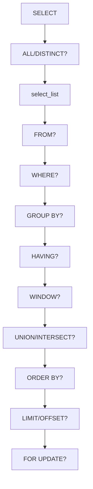

# `syntax` — `references/05-note-types/syntax.md`

> Documento normativo de la **Fase 84** del roadmap. Define el patrón de la nota
> de tipo `syntax`: 9 secciones con declaración de metasímbolos, sintaxis
> formal (BNF/EBNF/JSON Schema), cláusula por cláusula, diagramas
> Mermaid, ejemplos graduales y contraejemplos con el error literal del parser.
>
> **Cuándo cargar:** tras decidir el tipo de nota (selector F93) cuando el
> `note-type` resuelto es `syntax`; antes de redactar la primera sección.
> Instancia el patrón común de `references/07-visual/note-templates.md`
> (F75) §6.7.
>
> **Wirings:**
> - `references/07-visual/note-templates.md` (F75) §6.7 — patrón resumido.
> - `references/07-visual/density.md` (F76) — reglas R1-R8.
> - `references/04-authoring/properties.md` (F47) — frontmatter; `source-bearing` obligatorio.
> - `references/04-authoring/inline-marks.md` (F46) — `{src:blk_xxxx}` por cláusula.
> - `references/04-authoring/block-directives.md` (F45) — directivas `:::example`, `:::warning`, `:::tip`, `:::diagram`.
> - `references/04-authoring/depth-layers.md` (F51) — capas L1/L2/L3.
> - `references/05-note-types/concept.md` (F78) — paraguas común.
> - `references/05-note-types/api-reference.md` (F79) — `syntax` documenta la **forma** del API; `api-reference` documenta cada endpoint.
> - `references/05-note-types/error-troubleshooting.md` (F82) — cada error de sintaxis se enlaza a su nota de troubleshooting.

---

## §1 · Propósito y alcance

Una nota `syntax` documenta **la gramática formal de un lenguaje o comando**:
qué secuencias de tokens son válidas y cuáles no. Cubre BNF/EBNF (SQL,
gramáticas), JSON/YAML Schema (Kubernetes, OpenAPI), comandos CLI (cURL,
kubectl, git) y DSLs.

La diferencia con `api-reference` (F79) es de granularidad: `api-reference`
lista operaciones una a una; `syntax` describe **el lenguaje completo** que
las une.

**Fuera de alcance:** operación individual → `api-reference` (F79); error de
parseo → `error-troubleshooting` (F82); 2+ lenguajes → `comparison` (F87);
tutorial → `procedure` (F80).

---

## §2 · Estructura de la nota

### §2.1 · Frontmatter (orden canónico, `source-bearing` obligatorio)

```yaml
---
title: "<lenguaje/comando>: sintaxis"
note-type: syntax
status: draft | published
summary: "<≤ 200 chars, 1 línea>"
reading-time-minutes: <int ≥ 1>
tags: [type/syntax, domain/<uno o más>, product/<nombre>]
source: "<ruta al manual o spec oficial>"
source-type: docs | spec | rfc | book
source-anchor: "<page|chapter|section_path>"
source-url: "<opcional>"
retrieved: <YYYY-MM-DD>
vendor: "<proveedor>"
product: "<nombre del producto>"
product-version: "<versión>"
related: "[[note:api-reference-relacionada]], [[note:error-troubleshooting-de-errores-parseo]]"
---
```

### §2.2 · Apertura común (heredada de F75 §3)

```markdown
# {title}

## Cabecera
| Campo | Valor |
| --- | --- |
| **Resumen** | ... |
| **Procedencia** | source (source-type) §source-anchor · recuperado YYYY-MM-DD |
| **Versión** | product product-version |
| **Estado** | Publicado (published) / Borrador (draft) |
| **Tiempo de lectura** | N min |

## TL;DR
{primer párrafo del L1 — ≤ 8 líneas / ≤ 60 palabras}

{layer:l2}

## Convención de metasímbolos
```

### §2.3 · Las 9 secciones específicas + 1 opcional + 3 de cierre

| # | Sección | Estado | Notas |
|---|---|---|---|
| 1 | `## TL;DR` | obligatoria | ≤ 60 palabras (R1). |
| 2 | `## Convención de metasímbolos` | obligatoria | Tabla o lista con cada metasímbolo BNF/EBNF (o equivalente JSON Schema). |
| 3 | `## Sintaxis` | obligatoria | Bloque `code` con la gramática BNF/EBNF completa o formal schema. Cubre TODAS las cláusulas. |
| 4 | `## Cláusula por cláusula` | obligatoria | Sub-secciones H3 por cada cláusula; tabla `Token / Descripción / Ejemplo`. Criterio #1: incluir opcionales raras. |
| 5 | `## Diagramas de sintaxis` | obligatoria | `:::diagram` Mermaid `flowchart TD` o `graph LR` con cada cláusula como nodo. Criterio #3. |
| 6 | `## Ejemplos graduales` | obligatoria | ≥ 3 ejemplos progresando de simple → complejo; cada uno en `:::example`. |
| 7 | `## Contraejemplos` | obligatoria | ≥ 1 `:::warning` con input incorrecto + mensaje de error literal del parser. Criterio #2. |
| 8 | `## Errores` | opcional | `:::warning` por código de error típico. Heredado de §6.7. |
| 9 | `## Backlinks` | si hay aristas | Cierre común. |
| 10 | `## Queries` | si queries activas | Cierre común. |
| 11 | `## Ver también` | si `related:` | Cierre común. |

### §2.4 · Capas (heredado de F51)

| Capa | Marcador | Contenido |
|---|---|---|
| L1 | `{layer:l1}` | Solo `## TL;DR`. ≤ 60 palabras. |
| L2 | `{layer:l2}` | Convención, Sintaxis, Cláusula por cláusula, Diagramas, Ejemplos. 70-90% del total. |
| L3 | `{layer:l3}` | Contraejemplos, Errores. Si > 100 líneas, `:::collapsible` con `default_open: false` (R7). |

### §2.5 · Autoevaluación (F102)

Tipos de pregunta asignados a `syntax` (ver
`references/09-study/self-evaluation.md` §3):

| Tipo de pregunta | Asignado |
|---|---|
| Recuerdo | ✅ |
| Aplicación | ✅ |
| Diagnóstico | — |
| Decisión | — |
| Predicción | — |

Notas: recuerdo (reglas sintácticas) + aplicación (uso correcto en un
caso). Diagnóstico se añade si la nota documenta errores de parseo
(sub-tipo `syntax-with-errors`). La nota puede declarar
`self-evaluation-types` como superset del default.

---

## §3 · Componentes mínimos

| Componente | Mínimo | Fuente |
|---|---|---|
| Cabecera (F75 §2) | 5 campos en orden | F75 §2.1 |
| `## TL;DR` | ≤ 60 palabras / 8 líneas | F76 R1 |
| `## Convención de metasímbolos` | Tabla con cada metasímbolo + significado | esta fase |
| `## Sintaxis` | Bloque `code` con BNF/EBNF completa | esta fase + §6.7 |
| `## Cláusula por cláusula` | Tabla `Token / Descripción / Ejemplo` + sub-secciones H3 | §6.7 |
| Cláusulas opcionales | Cada `[]` en BNF tiene `###` sub-sección | criterio #1 |
| `## Diagramas de sintaxis` | `:::diagram` Mermaid ≥ 3 nodos | criterio #3 |
| `## Ejemplos graduales` | ≥ 3 ejemplos progresivos | esta fase |
| `## Contraejemplos` | ≥ 1 `:::warning` con input + error literal | criterio #2 |
| Marcas `{src:blk_xxxx}` | ≥ 1 por cláusula del SDM | F46 + F76 R8 |
| Anclaje visual | ≥ 1 cada 200 palabras | F76 R3 |
| Cierre | `## Backlinks` + `## Queries` | F75 §4 |

---

## §4 · Reglas de contenido

### §4.1 · Anti-patrones fundamentales

1. **"Sintaxis sin formalismo"** — prosa narrativa sin BNF/EBNF o JSON Schema. Solución: la sintaxis formal es obligatoria.
2. **"Cláusulas opcionales omitidas"** (criterio #1) — omitir `[tolerations]` o `[affinity]` por simplicidad. Solución: cada `[]` en BNF tiene sub-sección.
3. **"Contraejemplo sin error literal"** (criterio #2) — "esto es incorrecto" sin el mensaje del parser. Solución: el contraejemplo incluye el mensaje literal.
4. **"Diagrama de sintaxis ausente"** (criterio #3) — el autor asume que la tabla de cláusulas basta. Solución: la sección es obligatoria con `:::diagram`.
5. **"Ejemplos no graduales"** — 3 ejemplos al mismo nivel de complejidad. Solución: ejemplo 1 = lo más simple posible; ejemplo N = cláusula adicional.
6. **"Tabla de elementos sin ejemplo"** — token + descripción sin ejemplo concreto. Solución: cada fila tiene ejemplo concreto.
7. **"Mezcla de convenciones"** — BNF para SQL pero JSON Schema para k8s sin declarar la convención. Solución: `## Convención de metasímbolos` declara explícitamente.
8. **"Diagrama con > 15 nodos"** — ilegible. Solución: `subgraph` para agrupar.
9. **"Sección solo de viñetas"** (R6) — `## Cláusula por cláusula` con bullets sin contexto. Solución: 1 párrafo introductorio + tabla.
10. **"Errores de sintaxis sin mitigar"** — el contraejemplo muestra el error pero no cómo evitarlo. Solución: incluir `:::tip` con la corrección.

### §4.2 · Metasímbolos BNF/EBNF canónicos

| Metasímbolo | Significado |
|---|---|
| `::=` | "se define como" (BNF clásica) |
| `\|` | alternativa (una u otra) |
| `[...]` | opcional (0 o 1 ocurrencias) |
| `{...}` | repetición (0 o más) |
| `(...)` | agrupación |
| `...` | "uno o más hasta el final del rango" |
| `<...>` | no-terminal (BNF); o "completar aquí" (placeholders) |
| `?` | opcional (EBNF) |
| `*` | 0 o más (regex/EBNF) |
| `+` | 1 o más (regex/EBNF) |
| `"..."` | literal string |

Si el lenguaje no es BNF/EBNF (p.ej. JSON Schema), declarar la convención equivalente:
- `*` para "0 o más", `+` para "1 o más"
- `?` para opcional
- `{}` para objeto JSON Schema
- `[]` para array JSON Schema

### §4.3 · Densidad y estructura (R1-R8 de F76)

- **R1** `## TL;DR` ≤ 60 palabras / 8 líneas.
- **R2** Cada párrafo del L2 ≤ 200 palabras.
- **R3** ≥ 1 anclaje visual cada 200 palabras. Las tablas y los diagramas cuentan.
- **R4** ≤ 3 callouts consecutivos sin prosa intermedia.
- **R5** ≤ 5 viñetas consecutivas.
- **R6** Cada H2/H3 tiene ≥ 1 párrafo, tabla, callout, figura, diagrama o código.
- **R7** Cualquier sección > 100 líneas → `:::collapsible` con `default_open: false`.
- **R8** Densidad `{src:}` ≥ 0.80 sobre filas fácticas.

### §4.4 · Marcas inline (F46)

- **`{src:blk_xxxx}`** — 12 caracteres hexadecimales (INV-I5). Cada cláusula del SDM lleva `{src:}`. Cada ejemplo y contraejemplo también.
- **`[[term:nombre]]`** — primera aparición del término (INV-I2). Usar para: nombres de keywords (`SELECT`, `FROM`), tipos de datos (`integer`, `string`).
- **`[[note:id]]`** — enlaces a `api-reference` (operación que produce la sintaxis), `error-troubleshooting` (errores típicos del parser), `concept` (qué hace una cláusula).
- **`:::external`** — para gramáticas o extensiones que NO son del SDM estándar (extensiones propietarias, dialectos).

### §4.5 · Directivas de bloque (F45)

| Sección | Directiva preferida | Justificación |
|---|---|---|
| `## Convención de metasímbolos` | Tabla GFM o lista con bullets | F75 §5.1. |
| `## Sintaxis` | Bloque `code` con lenguaje explícito (`bnf`, `ebnf`, `json`, `yaml`) | F45 §10 ejemplos. |
| `## Cláusula por cláusula` | Sub-secciones H3 + tabla GFM 3-col | F75 §5.1 + §6.7. |
| `## Diagramas de sintaxis` | `:::diagram` Mermaid `flowchart` o `graph` | F45 §10.18 + criterio #3. |
| `## Ejemplos graduales` | `:::example` con bloque `code` | F45 §6 fila 10. |
| `## Contraejemplos` | `:::warning` con input + error literal | F45 §6 fila 1 + criterio #2. |
| `## Errores` | `:::warning` por código | F45 §6 fila 1. |

### §4.6 · Diferencias operativas

| Concepto | Definición operativa |
|---|---|
| **Metasímbolo** | Token formal que describe la gramática (no parte del lenguaje). |
| **Cláusula** | Sub-regla de la sintaxis que describe una parte opcional u obligatoria. |
| **Terminal** | Símbolo literal del lenguaje (keyword, operador, literal). |
| **No-terminal** | Referencia a otra cláusula (se reemplaza por su definición). |
| **Opcional** | Cláusula entre `[]` en BNF o `?:` en JSON Schema. |
| **Contraejemplo** | Input que el parser rechaza con un mensaje específico. |
| **Gramática formal** | Reglas BNF/EBNF que generan todos los strings válidos y solo esos. |

---

## §5 · Activación por perfil

```yaml
notes:
  types:
    syntax:
      require_meta_symbols_table: true  # default: true
      require_syntax_diagram: true      # default: true (criterio #3)
      require_counter_examples: true    # default: true (criterio #2)
      min_examples: 3                   # default: 3
      min_counter_examples: 1           # default: 1 (criterio #2)
      include_all_optional_clauses: true # default: true (criterio #1)
      min_optional_clauses: 3           # default: 3
```

| Campo | Default | Significado |
|---|---|---|
| `require_meta_symbols_table` | `true` | `## Convención de metasímbolos` es obligatoria. |
| `require_syntax_diagram` | `true` | `## Diagramas de sintaxis` con `:::diagram` (criterio #3). |
| `require_counter_examples` | `true` | `## Contraejemplos` con ≥ 1 bloque (criterio #2). |
| `min_examples` | `3` | Mínimo de ejemplos graduales. |
| `min_counter_examples` | `1` | Mínimo de contraejemplos. |
| `include_all_optional_clauses` | `true` | Cada `[]` en BNF tiene sub-sección (criterio #1). |
| `min_optional_clauses` | `3` | Mínimo de cláusulas opcionales documentadas. |

---

## §6 · Checklist de cierre

Antes de publicar:

- [ ] Cabecera con 5 campos en orden (F75 §2.1).
- [ ] `source-bearing` obligatorio (F75 §6.7).
- [ ] `## TL;DR` ≤ 60 palabras / 8 líneas (R1).
- [ ] `## Convención de metasímbolos` con tabla de cada metasímbolo + significado.
- [ ] `## Sintaxis` con bloque `code` con BNF/EBNF/JSON Schema completa.
- [ ] `## Cláusula por cláusula` con tabla `Token / Descripción / Ejemplo`.
- [ ] Cada cláusula `[]` en BNF tiene `###` sub-sección (criterio #1).
- [ ] `## Diagramas de sintaxis` con `:::diagram` Mermaid ≥ 3 nodos (criterio #3).
- [ ] `## Ejemplos graduales` con ≥ 3 ejemplos en `:::example`.
- [ ] `## Contraejemplos` con ≥ 1 `:::warning` con input + error literal (criterio #2).
- [ ] Cierre: `## Backlinks` + `## Queries`.
- [ ] Densidad `{src:}` ≥ 0.80 sobre filas fácticas (R8).
- [ ] `density_check.py --note <path>` exit 0.

---

## §7 · Nota mínima viable

Ejemplo canónico de ~60-80 líneas. Pasa `density_check.py --strict` exit 0.

```markdown
---
title: "SQL SELECT — sintaxis BNF (PostgreSQL 16)"
note-type: syntax
status: draft
tags: [type/syntax, domain/databases, product/postgresql]
source: "PostgreSQL 16 — SELECT reference"
source-type: docs
source-anchor: "sql-select"
retrieved: 2026-09-27
vendor: PostgreSQL Global Development Group
product: PostgreSQL
product-version: "16"
---

# SQL SELECT — sintaxis BNF (PostgreSQL 16)

## Cabecera
| Campo | Valor |
| --- | --- |
| **Resumen** | Sintaxis BNF completa del statement SELECT de PostgreSQL 16, incluyendo CTEs, joins, group by y window functions. |
| **Procedencia** | PostgreSQL 16 — SELECT reference (docs) §sql-select · recuperado 2026-09-27 |
| **Versión** | PostgreSQL 16 |
| **Estado** | Borrador (draft) |
| **Tiempo de lectura** | 5 min |

## TL;DR
SELECT recupera filas de una o más tablas con cláusulas opcionales (WHERE, GROUP BY, HAVING, ORDER BY, LIMIT, OFFSET) y modificadores (WITH, UNION, FOR UPDATE). La sintaxis BNF de PostgreSQL cubre > 30 cláusulas; las opcionales raras se documentan aquí. {src:blk_x00000000001}

{layer:l2}

## Convención de metasímbolos
| Símbolo | Significado |
|---|---|
| `::=` | se define como |
| `\|` | alternativa |
| `[...]` | opcional |
| `{...}` | 0 o más repeticiones |
| `(...)` | agrupación |
| `<...>` | no-terminal (referencia a otra regla) |

## Sintaxis
```bnf
SELECT [ALL | DISTINCT [ON (expr [, ...])]]
    select_list
    [FROM from_list]
    [WHERE condition]
    [GROUP BY expr [, ...] [HAVING condition]]
    [WINDOW window_definition [, ...]]
    [{ UNION | INTERSECT | EXCEPT } [ALL] select_stmt]
    [ORDER BY expr [ASC | DESC | USING operator] [, ...]]
    [LIMIT {count | ALL}]
    [OFFSET start]
    [FETCH {FIRST | NEXT} [count] {ROW | ROWS} ONLY]
    [FOR {UPDATE | NO KEY UPDATE | SHARE | KEY SHARE} [OF table [, ...]] [...]]
```

## Cláusula por cláusula

### `SELECT [ALL | DISTINCT]`
Define qué columnas se devuelven; ALL (default) o DISTINCT eliminan duplicados. `DISTINCT ON (expr)` aplica DISTINCT solo sobre las primeras columnas. {src:blk_x00000000002}

### `FROM from_list`
Lista de tablas / vistas / subqueries. Puede incluir JOINs (`INNER`, `LEFT`, `RIGHT`, `FULL`, `CROSS`). Opcional: SELECT sin FROM (ej: `SELECT 1+1`). {src:blk_x00000000003}

### `WHERE condition`
Filtra filas antes de agregación. Operadores: `=`, `<>`, `<`, `>`, `BETWEEN`, `IN`, `IS NULL`, `LIKE`, `ILIKE`. {src:blk_x00000000004}

### `GROUP BY ... HAVING condition`
Agrupa filas con el mismo valor en las expresiones GROUP BY; HAVING filtra grupos. Opcional raro: `GROUP BY ()` agrupa todas las filas en un solo grupo. {src:blk_x00000000005}

### `WINDOW window_definition`
Define ventanas para window functions (`row_number()`, `rank()`). Opcional: si no se especifica, las ventanas se declaran inline. {src:blk_x00000000006}

### `UNION | INTERSECT | EXCEPT`
Combina resultados de 2+ SELECT. `(ALL)` mantiene duplicados. Opcional: orden de evaluación es de izquierda a derecha sin paréntesis. {src:blk_x00000000007}

### `ORDER BY expr [ASC | DESC | USING]`
Ordena el resultado por una o más expresiones. `USING operator` usa un operador definido (`<`, `>`). {src:blk_x00000000008}

### `LIMIT / OFFSET / FETCH`
Limita el número de filas retornadas y desplaza el inicio. Equivalente: `LIMIT n OFFSET m` ≈ `FETCH FIRST n ROWS ONLY OFFSET m ROWS`. {src:blk_x00000000009}

### `FOR UPDATE | NO KEY UPDATE | SHARE | KEY SHARE`
Locking pesimista al final del SELECT; bloquea filas seleccionadas hasta el `COMMIT`. Opcional raro: `OF table [, ...]` limita el lock a tablas específicas. {src:blk_x00000000010}

## Diagramas de sintaxis
:::diagram

:::

## Ejemplos graduales

:::example
**Ejemplo 1 — mínimo:** SELECT básico.

```sql
SELECT id, name FROM users;
```
:::

:::example
**Ejemplo 2 — + WHERE:** Filtrado.

```sql
SELECT id, name FROM users WHERE active = true AND created_at > '2026-01-01';
```
:::

:::example
**Ejemplo 3 — + GROUP BY + HAVING + ORDER BY:** Agregación completa.

```sql
SELECT country, count(*) AS n
FROM users
WHERE active = true
GROUP BY country
HAVING count(*) > 100
ORDER BY n DESC
LIMIT 10;
```
:::

## Contraejemplos

:::warning
**Input:** `SELECT FROM users;` (sin columnas).
**Error literal:** `ERROR:  syntax error at or near "FROM"`
**Línea 1: SELECT FROM users;` — el parser espera una `select_list` antes de `FROM`. Solución: especificar columnas o `*`.
:::

## Backlinks
- [[note:api-reference-postgres-select]] — el API programático equivalente.
- [[note:postgres-connection-errors]] — errores típicos del parser.
```

Esta nota mínima (~80 líneas) cubre R1-R8 de F76 y los 3 criterios del
ROADMAP. Sirve de **referencia de forma**.

---

## §8 · Wirings y referencias cruzadas

- **F11** `assets/profile.template.yaml` — defaults de §5.
- **F12** `references/04-authoring/notemark.md` — directivas `:::example`, `:::warning`, `:::tip`, `:::diagram`.
- **F44** `references/03-knowledge/note-plan.md` — selector asigna `syntax` cuando la unidad es una gramática o esquema.
- **F45** `references/04-authoring/block-directives.md` — directivas consumidas.
- **F46** `references/04-authoring/inline-marks.md` — `{src:blk_xxxx}` por cláusula; `[[term:nombre]]` para keywords.
- **F47** `references/04-authoring/properties.md` — frontmatter; `source-bearing` obligatorio.
- **F51** `references/04-authoring/depth-layers.md` — capas L1/L2/L3.
- **F66** `references/07-visual/mermaid-portable.md` — portabilidad del Mermaid en `## Diagramas de sintaxis`.
- **F72** `references/07-visual/tokens.md` — colores semánticos de las directivas.
- **F75** `references/07-visual/note-templates.md` — cabecera, apertura/cierre común, §6.7 patrón resumido.
- **F76** `references/07-visual/density.md` — tabla cerrada R1-R8 ejecutable.
- **F77** `evals/visual/` — verificación visual multi-destino.
- **F78** `references/05-note-types/concept.md` — paraguas común.
- **F79** `references/05-note-types/api-reference.md` — `syntax` documenta la forma; `api-reference` lista operaciones.
- **F82** `references/05-note-types/error-troubleshooting.md` — errores de sintaxis se enlazan a troubleshooting.
- **F87** `references/05-note-types/comparison.md` — para comparar 2+ lenguajes o dialectos.

---

## §9 · Verificación al cierre de la fase

- `wc -l references/05-note-types/syntax.md` ≤ 400 líneas.
- §2 con 4 subsecciones.
- §3 con tabla de componentes mínimos ≥ 12 filas.
- §4 con 6 subsecciones + §4.2 tabla de metasímbolos BNF/EBNF canónicos.
- §5 con tabla de campos del perfil y sus defaults.
- §6 con checklist de cierre ≥ 13 items.
- §7 con nota mínima viable (≥ 50 líneas, pasa `density_check.py`).
- §8 con ≥ 17 wirings.
- §9 lista de verificación explícita.

**Criterios de aceptación del ROADMAP F84:**

1. _Todas las cláusulas aparecen, incluidas las opcionales raras._ → battery C2: cada cláusula marcada como `[]` en BNF tiene `###` sub-sección en `## Cláusula por cláusula`.
2. _Hay al menos un contraejemplo con su error._ → battery C3: `## Contraejemplos` tiene ≥ 1 `:::warning` con input + error literal del parser.
3. _Los diagramas de sintaxis nunca se omiten._ → battery C4: `## Diagramas de sintaxis` tiene `:::diagram` Mermaid ≥ 3 nodos.
