# `references/07-visual/diagram-catalog.md` — Catálogo de diagramas por intención

> **Propósito:** decidir **qué tipo de diagrama** usar para cada intención semántica. Este archivo **no enseña a escribir Mermaid** (eso vive en `mermaid-portable.md`, F66) **ni cuándo preferir monoespaciado** (eso vive en `monospace-diagrams.md`, F69). Este archivo **mapea intención → tipo** y **no deja sin resolver ningún caso del corpus**.
>
> **Cuándo cargar:** el agente está por redactar una nota que necesita un diagrama y debe decidir tipo, tamaño y obligatoriedad antes de abrir el editor.
>
> **Cuándo NO cargar:** la nota no necesita diagrama (texto corrido, lista corta, ecuación única, tabla simple). §3 lista los casos explícitos.

---

## §1 · Propósito y alcance

**Goberna tres decisiones:**

1. **Elección de tipo:** dada la intención semántica (decisión, secuencia, estados, jerarquía…), ¿qué tipo Mermaid (o alternativa monoespaciada / tabla) la sirve mejor?
2. **Tamaño:** ¿cuándo un diagrama es demasiado grande y debe partirse? (§6)
3. **Oblatoriedad:** ¿en qué situaciones de nota (arquitectura, índice, procedimiento ramificado) el diagrama es **obligatorio** y no opcional? (§7)

**Fuera de alcance:**

- Sintaxis Mermaid detallada → `mermaid-portable.md` (F66).
- Validación de diagramas → `scripts/validate/mermaid.py` (F67).
- Diagramas monoespaciados (ASCII art, tablas con flechas) → `monospace-diagrams.md` (F69).
- Reconstrucción de un diagrama impreso → `reconstruction.md` (F71).
- Accesibilidad visual → `accessibility.md` (F71).
- Tokens de color → `tokens.md` (F72).
- Densidad visual de la nota → `density.md` (F76).

**Reglas duras heredadas (deben respetarse siempre):** **INV-02** (router N2 ≤ 500 líneas; este archivo es N3 y puede extenderse), **INV-05** (no escribir Markdown de destino ni JSON a mano — todos los ejemplos van en `:::diagram`), **INV-14** (colores siempre por tokens), y el **criterio 3 de F65**: ningún ejemplo de visión por computador (CNN, RNN, segmentación, detección, SLAM, GAN, transformers, optical flow, calibración, feature map, kernel/stride/pooling).

---

## §2 · Invariantes y reglas duras

### §2.1 · Reglas de decisión

| ID | Regla | Si se omite… |
|---|---|---|
| **R-D-01** | Toda intención se mapea a un tipo del catálogo (§4) o a "no diagrama → tabla" (§3). | El redactor inventa un tipo ad-hoc y la matriz deja de ser exhaustiva. |
| **R-D-02** | Un diagrama de más de 15 nodos **se parte** (§6) o **se convierte en tabla**; nunca se publica monolítico. | Los nodos se apretujan, las etiquetas se cortan y el lector abandona. |
| **R-D-03** | Toda `:::diagram` lleva `src="blk_xxxxx"` cuando reproduce un diagrama de la fuente, o `:::derived` cuando es síntesis del agente. | Se pierde la trazabilidad (INV-04). |
| **R-D-04** | Toda `:::diagram` lleva `alt="<descripción textual>"` para accesibilidad (F71). | Lectores con lector de pantalla no acceden al contenido. |
| **R-D-05** | Los diagramas que excedan el subconjunto portable (F66) caen a `monospace-diagrams.md` (F69) o a tabla markdown. | Render falla silenciosamente en uno o más destinos. |
| **R-D-06** | Una nota de arquitectura, índice o procedimiento ramificado sin diagrama en las condiciones de §7 genera warning `MISSING_DIAGRAM` (a integrar cuando F67 exista). | La nota se cierra con omisión no declarada. |

### §2.2 · Anti-tipos (lo que nunca se publica)

`pie` (gráfico de tarta) → tabla 2 columnas; `journey` (customer journey) → `flowchart` con swimlanes; `gitGraph` → reservado a historia de branches; **railroad nativo** → no soportado por Mermaid, usar F69 o T10; **UML completo** → solo `classDiagram` si el SDM contiene UML; **imagen raster como sustituto** → solo cuando `reconstruction.md` (F71) lo justifique.

---

## §3 · Glosario de intenciones

Cada intención **se reconoce por una pregunta** que el redactor se hace.

| # | Intención | Pregunta que dispara el diagrama |
|---|---|---|
| I-1 | **Decisión** | ¿El lector debe elegir entre ≥2 caminos cuyas condiciones son evaluables? |
| I-2 | **Secuencia** | ¿Hay un orden temporal estricto entre actores heterogéneos? |
| I-3 | **Estados** | ¿Una entidad pasa por ≥3 estados discretos con transiciones condicionadas? |
| I-4 | **Jerarquía** | ¿Hay una relación "es-un" o "contiene-a" entre ≥3 niveles? |
| I-5 | **Modelo de datos** | ¿Hay entidades con atributos y relaciones (cardinalidad)? |
| I-6 | **Capas** | ¿Hay ≥3 niveles de abstracción apilados con flujo vertical? |
| I-7 | **Dependencias** | ¿Hay módulos/componentes con aristas dirigidas y posible ciclo? |
| I-8 | **Cronología de versiones** | ¿La narrativa es una línea de tiempo con fechas/versiones? |
| I-9 | **Estructura de memoria** | ¿Hay regiones de memoria, lifetimes o ciclos de vida? |
| I-10 | **Gramática** | ¿Hay reglas BNF/EBNF/PEG que conviene visualizar? |

**Intenciones que NO requieren diagrama** (lista cerrada,摘自 corpus):

| Caso del corpus | Razón |
|---|---|
| `04-arxiv-two-column` | Texto matemático denso; tabla de teoremas si hace falta resumen. |
| `09-conference-slides` | Una idea por slide; opcional un `:::diagram` por slide si la idea es arquitectura. |
| `12-arxiv-formulas` | `:::equation` ya cubre; no diagrama. |
| Cualquier nota puramente declarativa sin relaciones entre entidades | Regla R-D-01: tabla o lista, no diagrama. |

Si el redactor tiene una intención **fuera de I-1 … I-10**, debe comprobar si encaja releyendo la pregunta; si no, devolver "no diagrama → tabla" y documentar la razón en el ledger. **Nunca inventar un undécimo tipo**: la matriz es cerrada hasta que esta fase se reabra.

---

## §4 · Catálogo de los 10 tipos canónicos

> Cada tipo se nombra con el término Mermaid estándar. La regla de tamaño objetivo aplica a la versión **publicada** del diagrama; puede llevar subgraphs.

---

### §4.1 · T1 — Decisión (`flowchart` con `{}`)

**Intenciones:** I-1; secundariamente I-7 (dependencias con bifurcación).

````notemark
:::diagram src="blk_xxxxxxxx" alt="<descripción textual del árbol de decisión>"
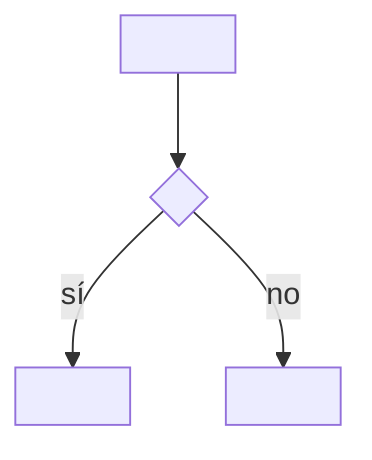
:::
````

**Ejemplo — Sobrecarga en C++ (`11-iso-cpp-syntax`):**

````notemark
:::diagram src="blk_ovl_res_001" alt="Resolución de sobrecarga: f es plantilla o no, sustitución, ranking, empate"
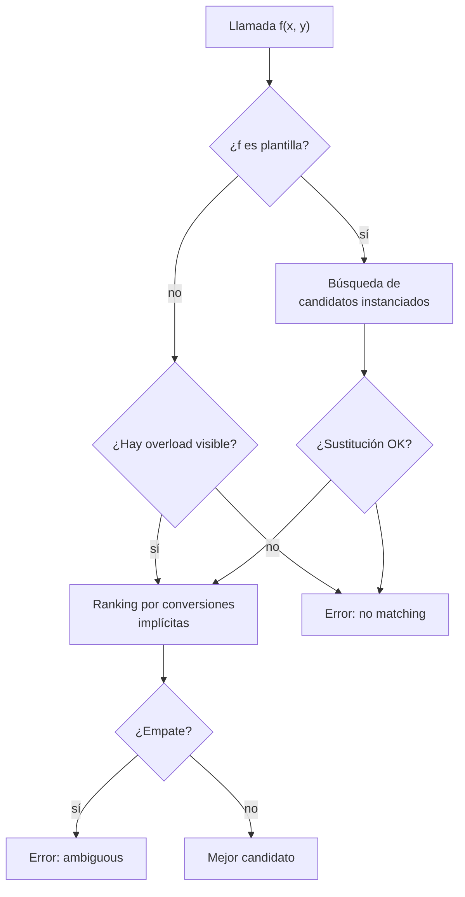
:::

**Tamaño:** 6-12 nodos; decisiones en `{}` (rombo), resultados en `[]` (rectángulo). **Reglas:** una sola raíz; etiquetas de aristas en minúsculas, sin acentos si el destino no verifica `ñ` (F66); sin colores por nodo. **Anti-ejemplo:** `flowchart LR` con 4 nodos lineales sin decisión — usar lista numerada GFM. **Wirings:** F66, F67, F69 (alternativa monoespaciada).

---

### §4.2 · T2 — Secuencia (`sequenceDiagram`)

**Intenciones:** I-2; secundariamente I-8 con marcas de versión.

````notemark
:::diagram src="blk_xxxxxxxx" alt="<descripción de la secuencia>"
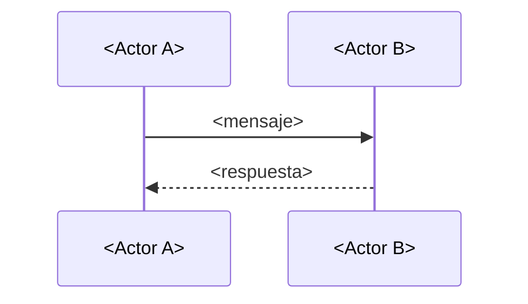
:::
````

**Ejemplo — Ciclo de vida de una query SQL (`01-postgresql-chapter`):**

````notemark
:::diagram src="blk_qry_lifecycle_002" alt="Secuencia de una query SELECT en PostgreSQL: parse, plan, execute, read"
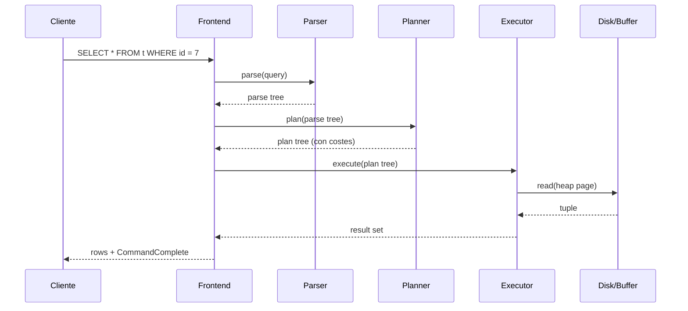
:::

**Tamaño:** 4-9 actores, 5-15 mensajes. **Reglas:** un actor por泳道 vertical; mensajes ≤6 palabras; detalles en `Note right of <actor>`. **Anti-ejemplo:** `sequenceDiagram` con un solo actor y auto-llamadas — usar `:::step` con `:::code` o lista numerada. **Wirings:** F66, F67.

---

### §4.3 · T3 — Estados (`stateDiagram-v2`)

**Intenciones:** I-3.

````notemark
:::diagram src="blk_xxxxxxxx" alt="<descripción de la máquina de estados>"
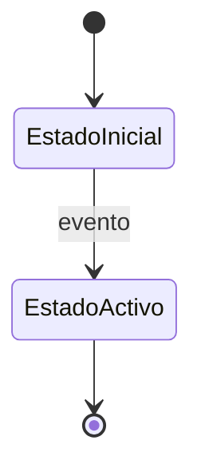
:::
````

**Ejemplo — Ciclo de vida de un Pod Kubernetes (`06-kubernetes-api-ref`):**

````notemark
:::diagram src="blk_pod_lifecycle_003" alt="Estados de un Pod: Pending, Running, Succeeded, Failed, Unknown"
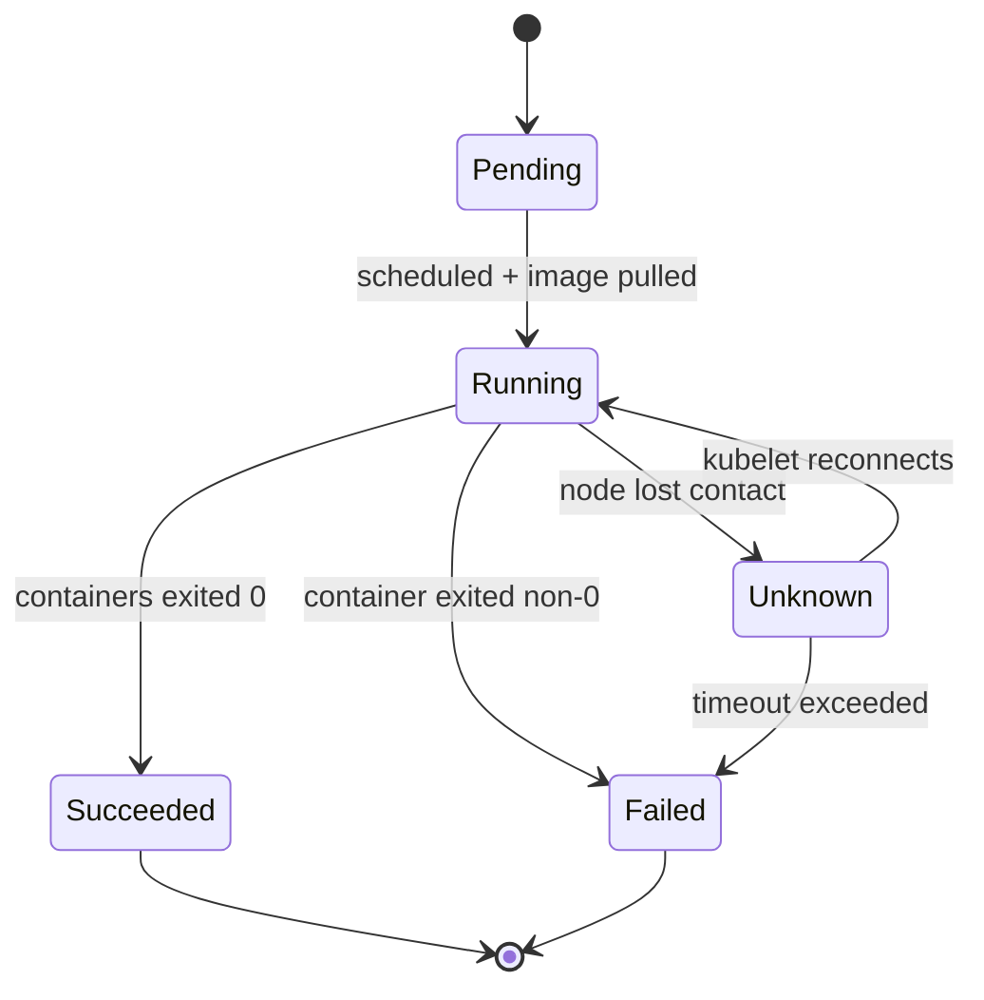
:::

**Tamaño:** 3-7 estados, 4-10 transiciones. **Reglas:** `[*]` para inicial/final; etiquetas de transición en imperativo o evento; si >2 transiciones con misma etiqueta → partir o nota con tabla de precondiciones. **Anti-ejemplo:** un solo estado con dos transiciones (cabe en una frase declarativa). **Wirings:** F66 (verificar `stateDiagram-v2` en portable; alternativa: `flowchart` con `()` si no), F67 (validación), F69 (alternativa monoespaciada si F66 excluye `stateDiagram-v2`).

---

### §4.4 · T4 — Jerarquía (`flowchart TB` jerárquico)

**Intenciones:** I-4.

````notemark
:::diagram src="blk_xxxxxxxx" alt="<descripción de la jerarquía>"
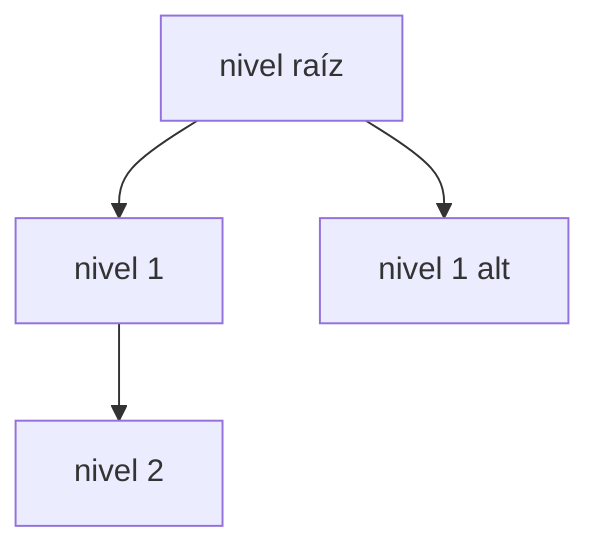
:::
````

**Ejemplo — Jerarquía de recursos Kubernetes (`06-kubernetes-api-ref`):**

````notemark
:::diagram src="blk_k8s_res_004" alt="Jerarquía de recursos Kubernetes: Cluster, Node, Namespace, Pod, Container, Deployment, Service"
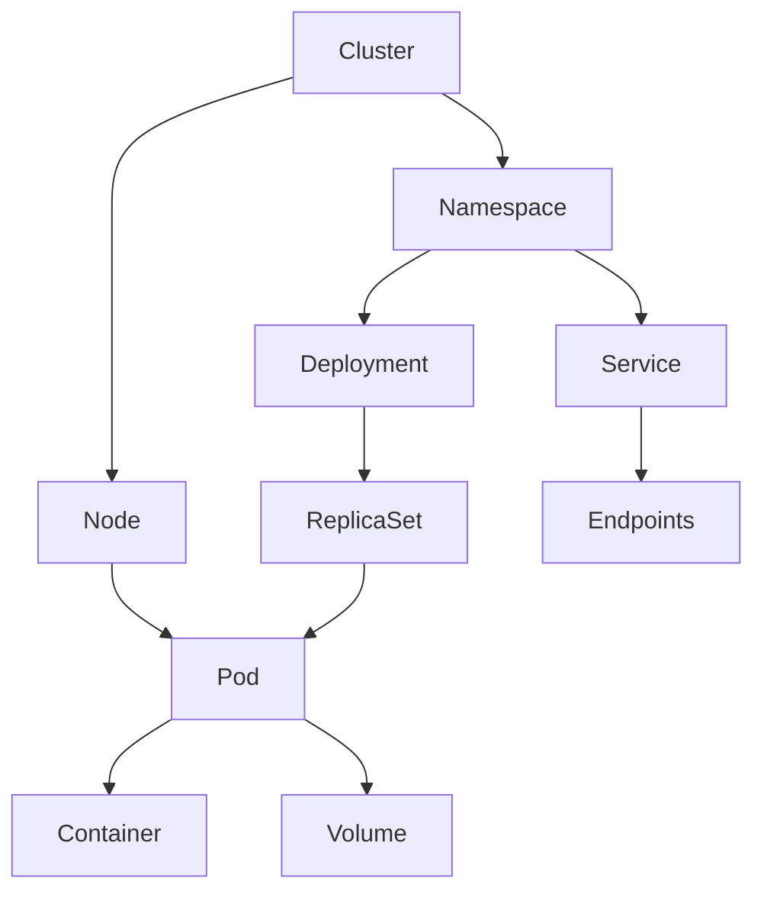
:::

**Tamaño:** 8-14 nodos, ≤4 niveles. **Reglas:** dirección `TB` (nunca `LR` para jerarquías); si el mismo nodo aparece en dos ramas, permitirlo (caso `Pod`); "es-un" y "contiene-a" van con flecha simple, el `alt` textual aclara. **Anti-ejemplo:** árbol con raíz y 30 hojas planas — usar tabla `parent | child`. **Wirings:** F66, F67.

---

### §4.5 · T5 — Modelo de datos (`erDiagram`)

**Intenciones:** I-5.

````notemark
:::diagram src="blk_xxxxxxxx" alt="<descripción del modelo entidad-relación>"
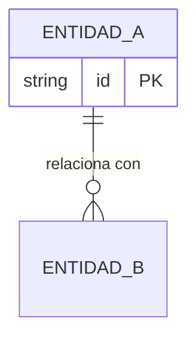
:::
````

**Ejemplo — Catálogo SQL (`05-iso-sql-tables`):**

````notemark
:::diagram src="blk_er_catalogo_005" alt="Modelo ER: Categoria, Producto, Proveedor, Pedido, LineaPedido, Cliente"
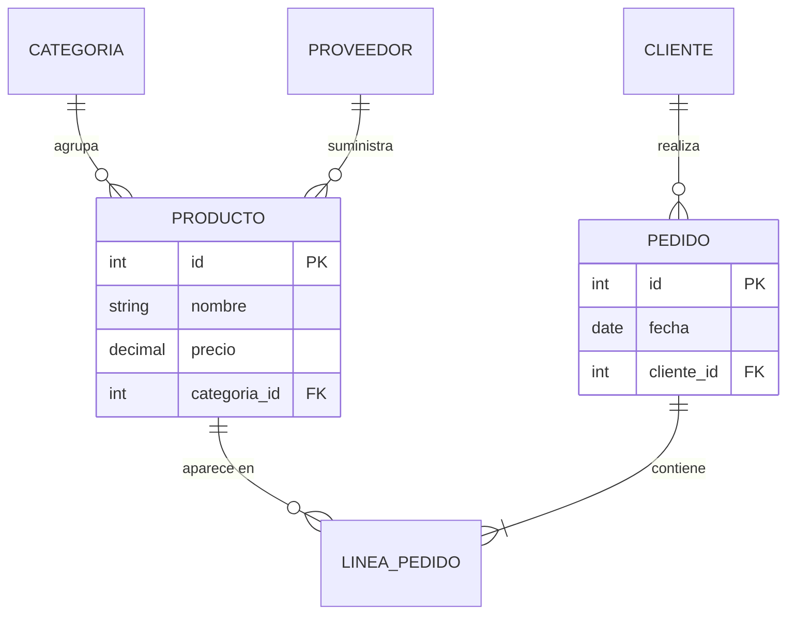
:::

**Tamaño:** 4-7 entidades, 4-8 relaciones. **Reglas:** cardinalidad crow's foot (`||`, `o|`, `}o`, `}|`); atributos solo los esenciales para entender cardinalidad; ≥8 entidades → partir por dominio. **Anti-ejemplo:** `erDiagram` para una cola de mensajes (no hay cardinalidad, hay flujo) — es T2. **Wirings:** F66 (verificar `erDiagram` en portable), F67 (validación), F69 (alternativa monoespaciada si F66 excluye `erDiagram`).

---

### §4.6 · T6 — Capas (`flowchart TB` con bandas apiladas)

**Intenciones:** I-6.

````notemark
:::diagram src="blk_xxxxxxxx" alt="<descripción de las capas>"
```mermaid
flowchart TB
    subgraph C1["Capa 1"] A1["x"] end
    subgraph C2["Capa 2"] B1["y"] end
    C1 --> C2
```
:::
````

**Ejemplo — Motor PostgreSQL (`01-postgresql-chapter`):**

````notemark
:::diagram src="blk_pg_arch_006" alt="Capas del motor PostgreSQL: Cliente, Frontend, Backend, Acceso a datos, Disco"
```mermaid
flowchart TB
    subgraph Cliente["Cliente"] CL["psql / driver"] end
    subgraph Frontend["Frontend"] FE["parser wire"] end
    subgraph Backend["Backend"] BE["parser → rewriter → planner → executor"] end
    subgraph Acceso["Acceso"] AD["heap, B-tree, MVCC, buffer pool"] end
    subgraph Disco["FS"] FS["WAL, data, FSM, VM"] end
    Cliente --> Frontend --> Backend --> Acceso --> Disco
    Disco --> Acceso --> Backend --> Frontend --> Cliente
```
:::

**Tamaño:** 3-5 capas, 2-4 componentes por capa. **Reglas:** flechas bidireccionales si la arquitectura es request/response; cada `subgraph` con nombre semántico; si alguna capa tiene >5 componentes → considerar T4. **Anti-ejemplo:** T6 con una sola capa (degenera en `flowchart LR`, debe ser T1 o T4). **Wirings:** F66, F67.

---

### §4.7 · T7 — Dependencias (`flowchart LR` con aristas etiquetadas)

**Intenciones:** I-7; secundariamente I-6 cuando las capas son de compilación.

````notemark
:::diagram src="blk_xxxxxxxx" alt="<descripción de las dependencias>"
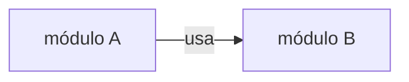
:::
````

**Ejemplo — Dependencias internas PostgreSQL (`10-postgres-readme-repo`):**

````notemark
:::diagram src="blk_pg_deps_007" alt="Dependencias internas del backend PostgreSQL: parser, rewrite, planner, executor, storage, bufmgr, xlog"
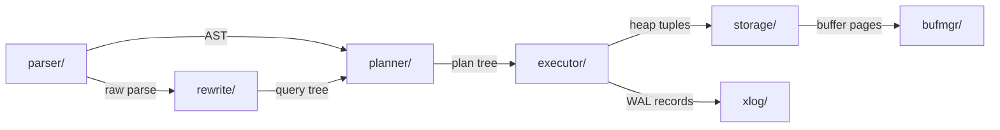
:::

**Tamaño:** 6-14 nodos. **Reglas:** etiquetar la **interfaz** (`"AST"`, `"WAL records"`), no `"usa"` genérico salvo que no haya mejor etiqueta; ciclos permitidos visualmente + `Note right of X: ciclo`; >14 módulos → partir por capa o subsistema. **Anti-ejemplo:** lista de imports en nota de código fuente — tabla con columnas `módulo | importa a` basta. **Wirings:** F66, F67 (validación).

---

### §4.8 · T8 — Cronología de versiones (`gantt` portable)

**Intenciones:** I-8. **Decisión provisional:** `gantt` por portabilidad confirmada en F66; migrar a `timeline` (Mermaid 10+) si F66 lo admite.

````notemark
:::diagram src="blk_xxxxxxxx" alt="<descripción de la cronología>"
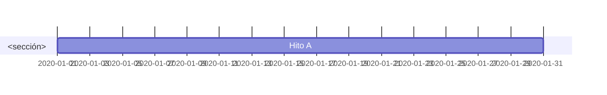
:::
````

**Ejemplo — Evolución de HTTP (`03-rfc-7231`):**

````notemark
:::diagram src="blk_http_timeline_008" alt="Cronología HTTP 1991-2024: 0.9, 1.0, 1.1, 2, 3"
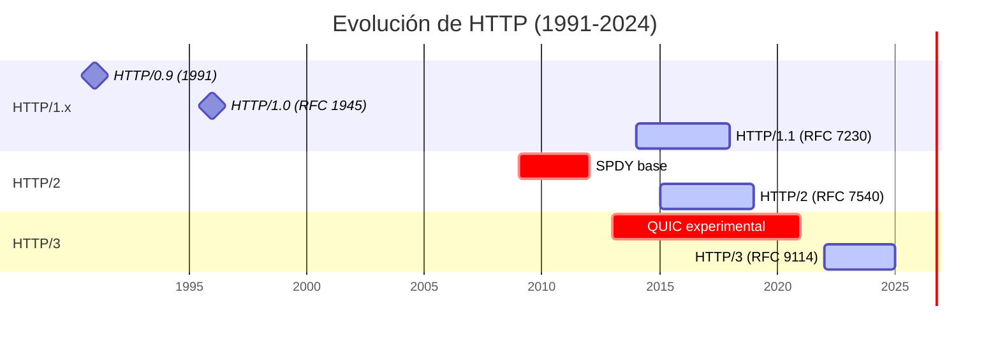
:::

**Tamaño:** hasta 25 hitos (admite más por lectura lineal). **Reglas:** `dateFormat` explícito; `milestone` para fechas puntuales, `active` para rangos; >10 años → partir por fase con `section` (≤12 hitos por sección). **Anti-ejemplo:** `gantt` con una sola tarea y una sola fecha — `:::note` con `{src:}`. **Wirings:** F66, F67 (validación).

---

### §4.9 · T9 — Estructura de memoria (`flowchart TB` con clustering por lifetime)

**Intenciones:** I-9.

````notemark
:::diagram src="blk_xxxxxxxx" alt="<descripción de la estructura de memoria>"
```mermaid
flowchart TB
    subgraph Stack["Stack"] S1["frame"] end
    subgraph Heap["Heap"] H1["obj"] end
    S1 -->|"ref"| H1
```
:::
````

**Ejemplo — Memoria del motor de BD (`02-database-internals-chapter`):**

````notemark
:::diagram src="blk_db_mem_009" alt="Regiones de memoria: Backend (work_mem, catalog), Shared (buffer pool, WAL, clog), Disk"
```mermaid
flowchart TB
    subgraph Backend["Backend process"] WC["work_mem"] CAT["catalog cache"] end
    subgraph Shared["Shared memory"] BP["buffer pool"] LB["WAL buffers"] CCH["clog"] end
    subgraph Disk["On disk"] WAL["WAL files"] HEAP["heap files"] FSM["FSM"] end
    WC -->|"dirty page"| BP
    BP -->|"checkpoint"| HEAP
    BP -->|"WAL"| LB
    LB -->|"fsync"| WAL
    CAT -->|"lee de"| HEAP
```
:::

**Tamaño:** 3-5 regiones, 5-10 componentes. **Reglas:** regiones por lifetime (stack/heap/static) **o** por alcance (private/shared), no mezclar los dos ejes; procesos asíncronos (WAL writer) en `Note right of`. **Anti-ejemplo:** T9 con una sola región — degenera en lista de variables. **Wirings:** F66, F69 (alternativa para layout de bytes con offsets).

---

### §4.10 · T10 — Gramática (`flowchart` con ramas paralelas como railroad)

**Intenciones:** I-10.

````notemark
:::diagram src="blk_xxxxxxxx" alt="<descripción de la regla gramatical>"
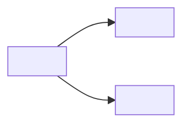
:::
````

**Ejemplo — `expression` en C++ (`11-iso-cpp-syntax`):**

````notemark
:::diagram src="blk_cpp_expr_010" alt="Reglas gramaticales simplificadas de expression en C++: additive, multiplicative, primary, identifier, literal"
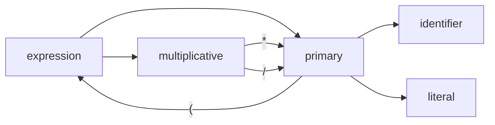
:::

**Tamaño:** 4-8 no-terminales, 6-12 terminales o alternativas. **Reglas:** alternativas como **ramas paralelas** desde el mismo nodo, **no** como `{}` decisión (es ambiguo con T1); si >2 niveles de anidamiento o recursión → preferir F69. **Anti-ejemplo:** regla BNF completa de 30 líneas en un solo nodo — tabla `regla | producción` o F69. **Wirings:** F66, F69 (preferencia F69 para gramáticas complejas).

---

## §5 · Matriz intención → tipo

Tabla cerrada. Una fila por intención + filas explícitas para "no usar diagrama".

| Intención | Tipo primario | Tipo alternativo | Forzar X si… |
|---|---|---|---|
| I-1 Decisión | **T1** | T2 si hay orden temporal entre actores | La decisión depende de ≥2 actores heterogéneos |
| I-2 Secuencia | **T2** | T8 si la línea temporal tiene fechas | >9 actores o >15 mensajes → partir o T1 + nota |
| I-3 Estados | **T3** | T1 si los estados son ≤2 | Hay transiciones con guards o entry/exit actions → T3 con `note` |
| I-4 Jerarquía | **T4** | T5 si hay cardinalidad | Profundidad >4 → partir por sub-jerarquía |
| I-5 Modelo de datos | **T5** | tabla `entity \| attr1 \| attr2 \| relation` | ≥8 entidades → partir por dominio |
| I-6 Capas | **T6** | T4 si la jerarquía es estática | >5 capas → partir en dos diagramas apilados |
| I-7 Dependencias | **T7** | T4 si no hay ciclos | Hay ciclos → T7 con `Note right of X: ciclo Y` |
| I-8 Cronología | **T8** | tabla cronológica si F66 excluye Mermaid | Cubre >10 años → partir por fase |
| I-9 Estructura de memoria | **T9** | F69 si se requiere layout exacto de bytes | Hay layout de bytes con offsets → F69 |
| I-10 Gramática | **T10** | F69 (monoespaciado railroad) | >2 niveles de anidamiento → F69 |
| Definiciones formales sin relaciones | **sin diagrama** | tabla con `teorema \| hipótesis \| conclusión` | n/a |
| Una idea por slide / un solo hecho | **sin diagrama** | `:::note` con `{src:blk_xxxx}` | n/a |
| Solo fórmulas matemáticas | **sin diagrama** | `:::equation` (F12) | n/a |
| Solo enumeración corta de hechos | **sin diagrama** | lista GFM numerada | n/a |

**Procedimiento:** (1) formular la pregunta de §3; (2) si no hay intención aplicable, devolver "sin diagrama" (4 últimas filas); (3) leer columna "Tipo primario" y abrir §4.x; (4) si "Forzar X si…" aplica, saltar al alternativo; (5) si el destino no soporta el tipo, saltar a F69 o tabla con decisión documentada.

---

## §6 · Decisión de los 15 nodos

**Regla dura (R-D-02):** un diagrama con más de 15 nodos se parte o se convierte en tabla. No se publica monolítico.

### §6.1 · Tabla de corte

| Rango | Decisión | Justificación |
|---|---|---|
| 1-7 | Un solo diagrama | Cabe en una pantalla. |
| 8-14 | Un solo diagrama, subgraphs permitidos | Subgraphs mejoran sin partir. |
| 15-25 | **Partir** en 2-3 sub-diagramas, cada uno ≤12 nodos | Por encima de 15, etiquetas se cortan y cruces se acumulan. |
| 26+ | **Tabla** o serie de diagramas muy pequeños enlazados por `Note` | La complejidad excede la capacidad comunicativa del diagrama. |

### §6.2 · Excepciones

| Tipo | Excepción | Por qué |
|---|---|---|
| T8 (`gantt`) | Hasta 25 hitos sin partir | Lectura lineal, fechas en eje horizontal. |
| T4 (jerarquía) | Hasta 25 nodos si profundidad ≤4 | El árbol admite más nodos que un grafo. |
| T10 (gramática) | **No admite** excepción; partir siempre a partir de 15 | La gramática se vuelve ilegible. |

### §6.3 · Procedimiento para partir

1. Contar nodos totales del diagrama propuesto.
2. Si >15 (o supera la excepción del tipo), identificar 2-3 **clústeres naturales** (capas, fases, regiones, niveles, dominios).
3. Dibujar cada clúster como diagrama separado, cada uno ≤12 nodos.
4. Unir con **nodos-puente** etiquetados `ver §X.Y` o `ver <note_id>`; los nodos-puente cuentan como 1 nodo en cada diagrama.
5. Si al partir se pierde la idea principal (la partición requiere conocer las dos partes a la vez) → **convertir en tabla** con columnas que correspondan a los atributos del diagrama original.

### §6.4 · Señales de que conviene tabla

- Los nodos son en su mayoría **atributos de la misma entidad** (no relaciones).
- Hay >3 columnas implícitas que el lector debe mantener en la cabeza.
- El lector va a **buscar** un nodo concreto, no **recorrer** el grafo.

---

## §7 · Obligatoriedad contextual

Tres situaciones donde el diagrama es **obligatorio**, no opcional. Documentado como regla editorial; el validador marca warning `MISSING_DIAGRAM` cuando F67 exista.

| Situación | Tipo por defecto | Condición de obligatoriedad | Por qué |
|---|---|---|---|
| **Nota de arquitectura** (`references/05-note-types/architecture.md` `[pendiente F83]`) | T6 (capas) o T1 (decisión si hay branching) | ≥3 componentes y ≥2 relaciones | Sin diagrama, la arquitectura no es verificable. |
| **Índice / MOC** (`references/05-note-types/index-moc.md` `[pendiente F91]`) | T7 (dependencias) o T1 (árbol de decisión) | ≥6 notas hijas con dependencias explícitas | Un MOC sin grafo es una lista plana. |
| **Procedimiento ramificado** (`references/05-note-types/procedure.md` `[pendiente F80]`) | T1 (decisión) | ≥3 caminos alternativos o ≥2 puntos de decisión | Pasos lineales no necesitan diagrama; los ramificados sí. |

**Casos donde el diagrama sigue siendo opcional:** la nota tiene menos entidades que el umbral, **o** la información es puramente tabular (ej. tabla de configuración de 12 parámetros sin relaciones).

---

## §8 · Plantilla genérica copy-paste

### §8.1 · Plantilla base (reproducir siempre)

````notemark
:::diagram src="blk_xxxxxxxx" alt="<descripción textual obligatoria>"
```mermaid
<TIPO> <DIRECCIÓN>
    <NODO_A>["<etiqueta A>"]
    <NODO_B>["<etiqueta B>"]
    <NODO_A> --> <NODO_B>
```
:::

:::note
**Por qué este tipo:** <una frase justificando T1-T10>  
**Tamaño:** <N nodos, dentro del rango objetivo>  
**Si crece:** partir según §6 o convertir en tabla si se pierden las relaciones.
:::
````

### §8.2 · Variantes

- **Diagrama derivado (síntesis del agente):** sustituir `:::diagram` por `:::derived` y omitir `src` (F12 §10.6).
- **Diagrama opcional:** envolver en `:::collapsible` con heading `### Diagrama opcional`.
- **Diagrama con código oculto en PDF:** añadir `:::collapsible` externo con título `### Código Mermaid fuente` para que el lector pueda copiarlo.

### §8.3 · Errores comunes

| Error | Consecuencia | Corrección |
|---|---|---|
| Olvidar `alt` | Accesibilidad rota (F71) | Obligatorio; la eval battery lo verifica. |
| `src="blk_..."` sin bloque en el SDM | Trazabilidad rota (INV-04) | Verificar contra el SDM antes de publicar. |
| `:::diagram` sin fence Mermaid | Renderer no sabe que es Mermaid | El bloque aparece como literal monoespaciado. |
| Diagrama >15 nodos monolítico | R-D-02 violada | Partir (§6) o tabla. |
| Color hex literal (`#ff0000`) | INV-14 violada | Citar `tokens.md` (F72); usar `classDef` con nombres semánticos. |

---

## §9 · Cobertura del corpus

Las 14 fuentes del corpus (`evals/corpus/`) están mapeadas al tipo que este catálogo recomienda. Esta tabla **es la prueba material del criterio 2 de F65**.

| # | Fuente | Intención dominante | Tipo elegido | Razón |
|---|---|---|---|---|
| 01 | `01-postgresql-chapter` | capas + flujo de una query | T6 + T2 | Arquitectura por capas + secuencia de una query |
| 02 | `02-database-internals-chapter` | estructuras internas (memoria, B-tree) | T5 + T9 + T6 | Modelo ER + regiones de memoria + capas del motor |
| 03 | `03-rfc-7231` | gramática ABNF + estados HTTP | T10 + T3 | Gramática de métodos (F69 si excede) + máquina de estados |
| 04 | `04-arxiv-two-column` | definiciones formales + teoremas | **sin diagrama** | Texto matemático denso; tabla de teoremas si hace falta resumen |
| 05 | `05-iso-sql-tables` | modelo de datos relacional | T5 | ER explícito del catálogo |
| 06 | `06-kubernetes-api-ref` | jerarquía de recursos + RBAC | T4 + T1 | Jerarquía + árbol de decisión RBAC |
| 07 | `07-docker-cli-ref` | capas del demonio + árbol de comandos | T6 + T4 | Capas + jerarquía de sub-comandos |
| 08 | `08-conference-transcript` | línea temporal de intervenciones | T8 | Cronología por bloques temáticos |
| 09 | `09-conference-slides` | una idea por slide | **sin diagrama** | Cada slide es atómica; `:::diagram` opcional por slide |
| 10 | `10-postgres-readme-repo` | dependencias del repo + flujo CI | T7 | Grafo de módulos + estado de jobs |
| 11 | `11-iso-cpp-syntax` | gramática C++ + decisión de overload | T10 + T1 | Sobrecarga como T1; gramática completa en F69 (preferida) |
| 12 | `12-arxiv-formulas` | derivaciones matemáticas | **sin diagrama** | `:::equation`; no diagrama |
| 13 | `13-internet-archive-scan-hostil` | estructura del libro (capítulos) | T8 | Cronología de capítulos del libro hostil |
| 14 | `14-book-bad-numbering-hostil` | workflow de normalización | T2 | Secuencia del procedimiento de reparación |

**Resumen:** 10/14 fuentes con diagrama obligatorio (T1-T10); 4/14 con "sin diagrama" justificado; **14/14 resueltas** (criterio 2 cumplido).

---

## §10 · Anti-patrones

| # | Anti-patrón | Síntoma | Por qué está mal | Corrección |
|---|---|---|---|---|
| AP-1 | Diagrama decorativo | Diagrama en nota declarativa sin relaciones | R-D-01 rota | Quitar; dejar `:::note` con `{src:blk_xxxx}` |
| AP-2 | Sobre-anidamiento | Subgraphs dentro de subgraphs hasta 5 niveles | Mermaid no lo renderiza bien | Aplanar; máximo 2 niveles |
| AP-3 | Abuso de colores | Cada nodo con color hex distinto | INV-14; distrae | `classDef` con 2-3 clases semánticas (tokens F72) |
| AP-4 | Mermaid como default | Toda nota lleva `:::diagram` aunque la información sea lista | R-D-01 rota | Volver a §3 |
| AP-5 | Mermaid monolítico >15 nodos | Diagrama denso sin partir | R-D-02 violada | Partir (§6) o tabla |
| AP-6 | Acentos/`ñ` en destinos no verificados | Renderiza en Obsidian, rompe en Notion import | R-D-05 violada | Verificar F66; ASCII (`anio`) si no |
| AP-7 | Diagrama sin `alt` | Inaccesible para lectores con lector de pantalla | R-D-04 violada | Añadir `alt="<descripción>"` |
| AP-8 | Diagrama sin `src` (cuando viene de la fuente) | Trazabilidad rota | R-D-03 + INV-04 | Añadir `src="blk_xxxx"` o `:::derived` |
| AP-9 | Mezclar tipos en un solo bloque | Fences múltiples en un `:::diagram` | Renderer falla o muestra solo el primero | Un `:::diagram` por tipo; `:::collapsible` para agrupar |
| AP-10 | Reutilizar Mermaid de internet sin verificar el SDM | Puede contener afirmaciones no presentes en la fuente | INV-03 (fidelidad) violada | Reconstruir desde el SDM; `reconstruction.md` (F71) |

---

## §11 · Verificación

### §11.1 · Cuatro preguntas (antes de cerrar la nota)

1. **¿La intención del diagrama está en §3?** Si no, ¿se ha justificado la excepción en el ledger?
2. **¿El tipo elegido es el de la columna "Tipo primario" de §5, o se ha justificado la alternativa?**
3. **¿El diagrama tiene ≤15 nodos (o la excepción del tipo aplica)?**
4. **¿El diagrama lleva `alt` y, si viene de la fuente, `src="blk_xxxx"`?**

Si alguna respuesta es "no", la nota **no se cierra** hasta corregir.

### §11.2 · Tabla de auto-evaluación (a copiar en el ledger)

| Pregunta | ✓ / ✗ | Nota |
|---|---|---|
| Intención en §3 o excepción justificada | | |
| Tipo = "Tipo primario" de §5 o alternativa justificada | | |
| ≤15 nodos (o excepción aplicable) | | |
| `alt` presente | | |
| `src="blk_xxxx"` o `:::derived` (trazabilidad) | | |
| Wirings a F66/F67/F69 documentados en §4.x | | |
| Caso cubierto por §9 o cobertura del corpus explícita | | |

### §11.3 · Verificación programática

Cuando F67 (`scripts/validate/mermaid.py`) exista, este catálogo debe ser legible por el validador para confirmar que cada tipo está en §4, advertir >15 nodos y comprobar `alt`/`src`. Mientras tanto, la verificación es manual con las 4 preguntas + tabla.

---

## §12 · Cambios permitidos

**Modificaciones libres (sin reabrir la fase):**

1. Añadir **ejemplos técnicos** dentro de §4.x (≤12 nodos, sin visión por computador).
2. Añadir **filas a §9** cuando se incorporen fuentes nuevas al corpus.
3. Añadir **anti-patrones** a §10 con su corrección.
4. Añadir **excepciones a §6.2** si la experiencia lo justifica.
5. Cambiar la **columna "Tipo alternativo"** de §5 si una alternativa resulta más portable tras F66.

**Reabrir la fase si:**

- Se añade un tipo undécimo (T11).
- Se cambia el umbral de 15 nodos.
- Se cambia la lista "sin diagrama" de §9.
- Se permite ejemplos de visión por computador (criterio 3 de F65).
- Se cambia la sintaxis base de §8 sin alinear con F12.

---

**Verificación al cierre de la fase:**

- `wc -l diagram-catalog.md` ≤ 600 líneas (objetivo: 480-560).
- `evals/diagram-catalog-sample/run_eval.py --catalog <ruta>` imprime `PASS 6/6`.
- `grep -i -f evals/diagram-catalog-sample/fixtures/no-vision-examples.txt diagram-catalog.md` → 0 coincidencias.
- §9 cubre 14/14 fuentes del corpus.
