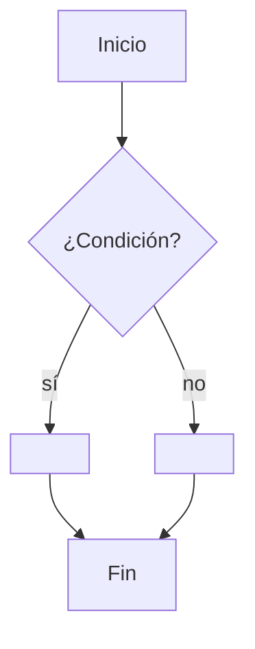
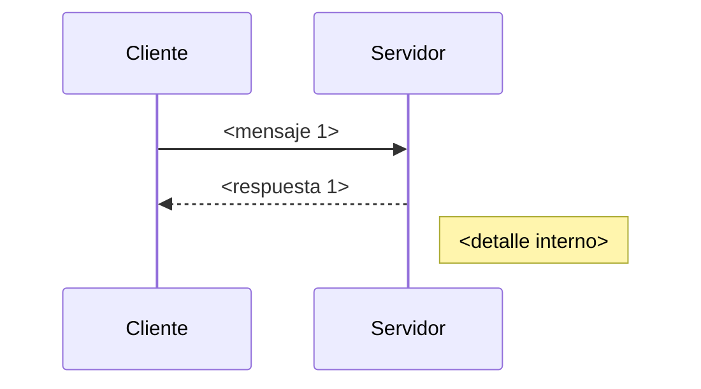
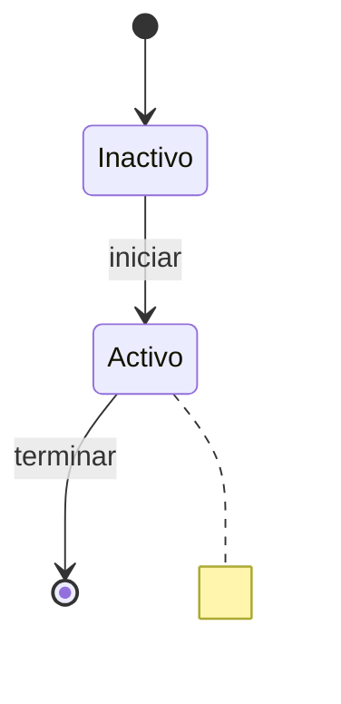
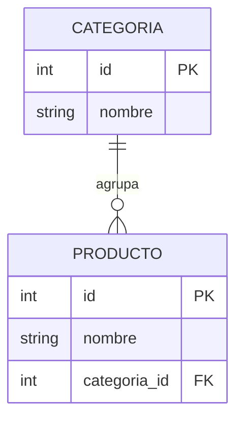
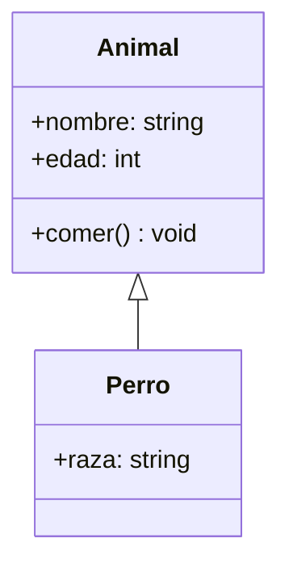
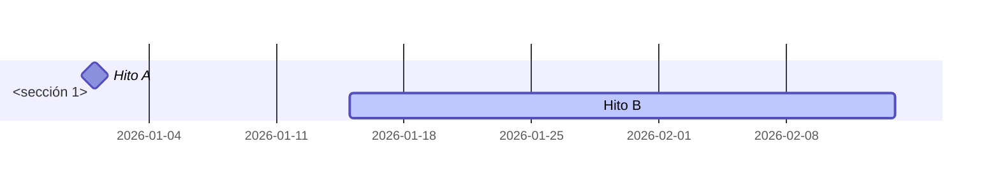
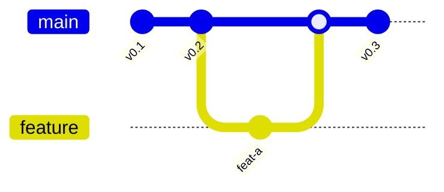
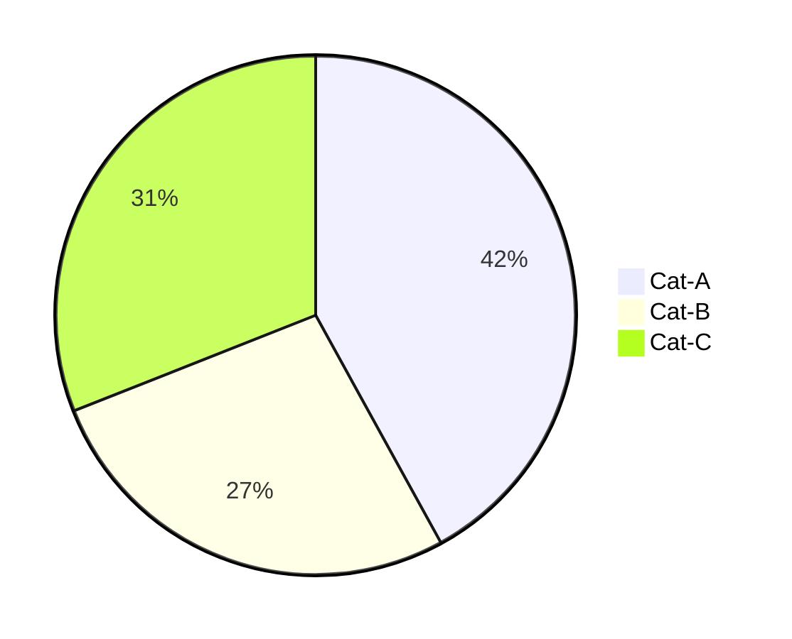
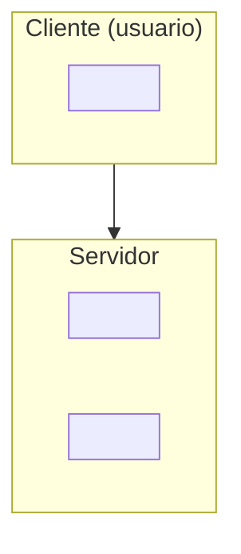

# `references/07-visual/mermaid-portable.md` — Subconjunto Mermaid portable

> **Propósito:** definir el **subconjunto Mermaid que renderiza idéntico** en la intersección de los tres destinos que consumen Mermaid como bloque literal: **Obsidian**, **Notion import** (Markdown importer con Mermaid v9+) y **GitHub/Markdown** (cualquier renderer GFM con plugin Mermaid). Los otros cuatro destinos del proyecto (Notion API, AppFlowy, HTML/PDF, Flashcards) pre-renderizan vía `scripts/render/diagram_image.py` (F68) y, por tanto, aceptan **cualquier** Mermaid válido sin restricción; esa universalidad se gana con F68, no con este archivo.
>
> **Cuándo cargar:** el agente está escribiendo un `:::diagram` con bloque ` ```mermaid ` y necesita decidir **qué constructs son seguros** en los tres destinos de la intersección antes de publicar.
>
> **Cuándo NO cargar:** el destino va a pre-renderizar (Notion API, AppFlowy, HTML/PDF, Flashcards) — en ese caso, vale cualquier Mermaid y F68 se encarga.

---

## §1 · Propósito y alcance

**Goberna tres decisiones:**

1. **Qué tipos Mermaid usar** sin riesgo de fallo en Obsidian, Notion import o GitHub (§3).
2. **Cómo escribir cada diagrama** para que las etiquetas con acentos y `ñ` funcionen en los tres destinos (§4, §6).
3. **Qué constructs evitar** y con qué alternativa sustituirlos (§5).

**Fuera de alcance:**

- Decidir intención → tipo de diagrama (eso es F65 `diagram-catalog.md`).
- Validación programática del Mermaid (eso es F67 `scripts/validate/mermaid.py`).
- Pre-render a imagen para destinos no-Mermaid (eso es F68 `scripts/render/diagram_image.py`).
- Diagramas monoespaciados como alternativa al Mermaid (eso es F69 `monospace-diagrams.md`).
- Reconstrucción de un diagrama impreso a Mermaid (eso es F71 `reconstruction.md`).
- Accesibilidad visual (contraste, alt text) (eso es F71 `accessibility.md`).
- Tokens de color para `classDef` (eso es F72 `tokens.md`).

### §1.1 · La "intersección" — interpretación operativa

El enunciado de F66 dice "intersección de Obsidian, Notion y GitHub". El proyecto tiene 7 destinos (`references/08-render/capability-matrix.md` §2.1, F8). El análisis correcto:

| Destino del proyecto | ¿Entra en la "intersección" de F66? | Razón |
|---|---|---|
| **Obsidian** | ✅ Sí | Nativo (Live Preview), bloque ` ```mermaid ` literal. |
| **Notion import** | ✅ Sí | Bloque ` ```mermaid ` (Mermaid v9+) nativo en el Markdown importer. |
| **GitHub / Markdown estándar** | ✅ Sí | GitHub renderiza ` ```mermaid ` de forma nativa; cualquier renderer GFM con plugin Mermaid lo aprovecha. |
| Notion API | ❌ No entra | Pre-render a SVG/PNG (F68); el Mermaid no llega al render final. |
| AppFlowy | ❌ No entra | Pre-render a SVG/PNG (F68); capability-matrix fila 8 lo documenta. |
| HTML/PDF | ❌ No entra | Pre-render (F68); el HTML final lleva `` con SVG/PNG. |
| Flashcards | ❌ No entra | Imagen como cara de la tarjeta (capability-matrix fila 8). |

**Conclusión:** la intersección exigida por F66 = **{Obsidian, Notion import, Markdown/GitHub}**. Los otros 4 destinos pre-renderizan y aceptan cualquier Mermaid válido sin restricción.

### §1.2 · Reglas duras heredadas (deben respetarse siempre)

- **INV-02** (router N2 ≤ 500 líneas; este archivo es N3 y puede extenderse, presupuesto ≤ 700 líneas).
- **INV-05** (no escribir Markdown de destino ni JSON a mano): los ejemplos van en la directiva `:::diagram src="..."` (F12 §10.18) con bloque ` ```mermaid `.
- **INV-07** (degradación cambia la forma, no omite contenido): si un diagrama no entra en el subconjunto portable, se degrada a F69 (monoespaciado), tabla markdown, o F68 (pre-render) — nunca se omite.
- **INV-14** (colores siempre por tokens): cualquier `classDef`/`style` cita `tokens.md` (F72) en lugar de literales hex.

---

## §2 · Invariantes y reglas duras

### §2.1 · Las 6 reglas duras (R-MP-01 … R-MP-06)

| ID | Regla | Si se omite… |
|---|---|---|
| **R-MP-01** | Toda etiqueta de nodo va entrecomillada: `A["texto"]`, nunca `A[texto]`. | El parser falla o el destino renderiza mal con espacios, acentos o caracteres especiales. |
| **R-MP-02** | Todo ID de nodo es ASCII (`[A-Za-z0-9_]`); los acentos van **solo** en la etiqueta. | Notion import rompe el `id` aunque Mermaid lo acepte; el ID generado deja de ser determinista. |
| **R-MP-03** | Longitud máxima de etiqueta: **40 caracteres** en una línea, **60** si va con `<br/>` para partir en dos líneas. | El render se corta o el layout se rompe. |
| **R-MP-04** | Sin `style X fill:#hex` ni `style X stroke:#hex` literales; usar `classDef` con clases nombradas que mapean a tokens (F72). | Notion import ignora `style`; Obsidian y GitHub no validan contra la paleta de la skill. |
| **R-MP-05** | Subgraphs anidados a **≤ 2 niveles**; máximo 1 `subgraph` por nivel visual. | El layout se vuelve ilegible y los destinos discrepan. |
| **R-MP-06** | Sin `click A callback`, sin `linkStyle N stroke:...`, sin `init` con `theme`/`themeVariables` custom. | Notion import elimina `click`; `linkStyle` no portable; `theme` no portable. |

### §2.2 · Anti-tipos (lo que nunca se publica en la intersección)

`timeline` (Mermaid 10+, depende de versión en Notion import) → usar `gantt` (F65 T8). `journey` (Notion import inconsistente) → `flowchart LR` con swimlanes. `mindmap` (no en Notion import v9) → `flowchart TB` (F65 T4). `radar` (no en Notion import) → tabla. `sankey-beta` (experimental) → `flowchart LR` con aristas etiquetadas (F65 T7). `C4`/`architecture-beta`/`block-beta` → `flowchart` con `subgraph`.

---

## §3 · Lista blanca — 9 tipos portables

> Solo se incluyen tipos que **renderizan idénticos** en Obsidian, Notion import y GitHub/Markdown. La verificación es por documentación oficial y por la matriz de capacidad (F8 §2.1 fila 8); F66 no abre nueva verificación material — esa se difiere a F118 (suite de evals) y al humano con acceso a plataformas.

### §3.1 · WP-1 — `flowchart` (TB / LR / TD / BT)

Constructs portables: `A["texto"]` (rectángulo), `A("texto")` (rectángulo redondeado), `A{"texto"}` (rombo), `A[["texto"]]` (subrutina), `A[("texto")]` (cilindro), `A(("texto"))` (círculo), `A>"texto"]` (trapecio asimétrico), `A[/"texto"/]` (paralelogramo), `A[\"texto"\]` (paralelogramo alternativo), `A[/"texto"\]` (trapecio), `A[\"texto"/]` (trapecio inverso), `A{{"texto"}}` (hexágono). Conexiones: `-->`, `---`, `-.->`, `==>`, `-->|etiqueta|`, `---|etiqueta|`. Direcciones: `TB`, `BT`, `LR`, `RL`, `TD` (alias de `TB`). **`graph` (alias deprecado):** se acepta pero se desaconseja; usar `flowchart` siempre.

| Construct | Soporte | Notas |
|---|---|---|
| `flowchart TB \| LR \| TD \| BT` | ✅ | Portable idéntico en los 3 destinos. |
| Formas `[]`, `()`, `{}`, `[[]]`, `[()]`, `(())` | ✅ | Todas portables. |
| `{"rombo"}` para decisiones | ✅ | Misma sintaxis. |
| Conexiones básicas `-->`, `---`, `-.->`, `==>` | ✅ | Portables. |
| Etiquetas en aristas `-->\|texto\|` | ✅ | Texto UTF-8 con acentos funciona. |
| Longitud-arista `---` con cardinalidad `--- 3 ---` | ⚠ | Notion import puede ignorar el número; portable con `-->|3|` preferido. |

Equivalente en F65: T1, T4, T6, T7, T9, T10.

### §3.2 · WP-2 — `sequenceDiagram`

Constructs portables: `participant A as <texto>`, `actor A as <texto>`, `A->>B: <texto>`, `A-->>B: <texto>`, `A->B: <texto>`, `A--xB: <texto>`, `Note right of A: <texto>`, `Note left of A: <texto>`, `Note over A,B: <texto>`, `loop <texto> ... end`, `alt <texto> ... else ... end`, `opt <texto> ... end`, `par ... end`, `critical ... end`, `break ... end`, `rect rgb(...) ... end`.

| Construct | Soporte | Notas |
|---|---|---|
| `participant A as Actor` | ✅ | Portable. |
| `actor` (vs `participant`) | ✅ | Mismo render; usar `participant` para mantener identidad visual. |
| Flechas `->>`, `-->>`, `->`, `--x`, `--)` | ✅ | Todas portables. |
| `Note right of A`, `Note left of A`, `Note over A,B` | ✅ | Portables. |
| `loop`, `alt/else`, `opt`, `par` | ✅ | Portables; `alt` exige `else` (Mermaid 10+ permite `end` sin `else`). |
| `critical`, `break`, `rect` | ⚠ | `rect rgb(...)` puede no mostrar color en Notion import; portable con `rect` sin color. |

Equivalente en F65: T2.

### §3.3 · WP-3 — `stateDiagram-v2`

Constructs portables: `[*] --> StateA`, `StateA --> StateB: evento`, `StateA --> StateB: evento / accion`, `state "Título largo" as id`, `state Composite { ... }`, `note right of StateA: <texto>`, `direction TB` (cambia la dirección del bloque), `<<choice>>`, `<<fork>>`, `<<join>>`.

| Construct | Soporte | Notas |
|---|---|---|
| `[*] --> Inicial`, `Final --> [*]` | ✅ | Portables. |
| `State --> State: evento` | ✅ | Portable. |
| `state Composite { ... }` (estado compuesto) | ✅ | Portable; ≤2 niveles (R-MP-05). |
| `note right of State`, `note left of State` | ✅ | Portables. |
| Estereotipos `<<choice>>`, `<<fork>>`, `<<join>>` | ✅ | Portables. |
| Concurrencia `--` | ✅ | Portable. |
| `direction TB \| LR` | ✅ | Portable. |

Equivalente en F65: T3. **Nota:** `stateDiagram` (sin `-v2`) se considera deprecado en Mermaid 10+; usar siempre `stateDiagram-v2`.

### §3.4 · WP-4 — `erDiagram`

Constructs portables: `ENTIDAD_A ||--o{ ENTIDAD_B : "etiqueta"`, `ENTIDAD_A ||--|{ ENTIDAD_B : "etiqueta"`, cardinalidad `||` (exactamente uno), `o|` (cero o uno), `}|` (uno o muchos), `}o` (cero o muchos). Atributos: `ENTIDAD { type nombre PK \| FK \| UK \| "comentario" }`.

| Construct | Soporte | Notas |
|---|---|---|
| Cardinalidad crow's foot `\|\|--o{`, `\|\|--\|{`, `}o--o{` | ✅ | Portables (Mermaid 9+). |
| Atributos `{ string nombre PK }` | ✅ | Portables; tipos: `string`, `int`, `decimal`, `date`, `datetime`, `boolean`. |
| Comentarios en atributos `"texto"` | ✅ | Portables. |
| `PK`, `FK`, `UK` | ✅ | Portables. |
| Cardinalidad recursiva `A \|\|--o{ A : "auto-relación"` | ✅ | Portable. |
| Cardinalidad de 3 vías (entre 3 entidades) | ⚠ | Notion import puede simplificar a 2 vías; preferir 2 diagramas si el caso lo exige. |

Equivalente en F65: T5.

### §3.5 · WP-5 — `classDiagram`

Constructs portables: `class Animal { +nombre: string +edad: int +comer() void }`, `Animal <|-- Perro`, `Animal *-- pata`, `Animal o-- dueño`, `Animal -- otro`, `Animal ..> servicio`, `Animal ..|> Interfaz`, `<<interface>>`, `<<abstract>>`, `<<service>>`.

| Construct | Soporte | Notas |
|---|---|---|
| Clase con atributos y métodos | ✅ | Portable. |
| Visibilidad `+` (público), `-` (privado), `#` (protegido), `~` (paquete) | ✅ | Portables. |
| Herencia `<\|--` | ✅ | Portable. |
| Composición `*--`, agregación `o--` | ✅ | Portables. |
| Asociación `--`, dependencia `..>`, realización `..\|>` | ✅ | Portables. |
| Estereotipos `<<interface>>`, `<<abstract>>` | ✅ | Portables. |
| Genéricos `class Lista<T>` | ⚠ | Notion import puede mostrar `<T>` como literal; portable si no es crítico. |

No tiene equivalente directo en F65; útil para notas de tipo `concept` con entidades de software.

### §3.6 · WP-6 — `gantt`

Constructs portables: `title <título>`, `dateFormat YYYY-MM-DD`, `axisFormat %Y-%m-%d`, `section <sección>`, `Tarea :id, start, duration`, `Tarea :milestone, id, fecha, 0d`, `Tarea :active, id, fecha, duración`, `Tarea :crit, id, fecha, duración`, `Tarea :done, id, fecha, duración`.

| Construct | Soporte | Notas |
|---|---|---|
| `dateFormat`, `axisFormat`, `title` | ✅ | Portables. |
| `section <sección>` | ✅ | Portable. |
| `Tarea :milestone, id, fecha, 0d` | ✅ | Portable. |
| `Tarea :active, id, fecha, duración` | ✅ | Portable. |
| `Tarea :crit, id, fecha, duración` (crítica) | ✅ | Portable. |
| `Tarea :done, id, fecha, duración` (hecha) | ✅ | Portable. |
| `excludes <fechas>` | ⚠ | Notion import puede no aplicar exclusiones; portable si la exclusión no es crítica. |
| `inclusiveLabel`, `topAxis` | ⚠ | No soportado consistentemente en Notion import. |
| `Tarea después de id` (`after id`) | ✅ | Portable para encadenar tareas. |

Equivalente en F65: T8.

### §3.7 · WP-7 — `gitGraph`

Constructs portables: `gitGraph TB \| LR:`, `commit id: "<texto>"`, `branch <rama>`, `checkout <rama>`, `merge <rama>`, `cherry-pick id: "<texto>"`, `tag <texto>`.

| Construct | Soporte | Notas |
|---|---|---|
| `commit id: "msg"` | ✅ | Portable. |
| `branch <rama>` + `checkout <rama>` | ✅ | Portables. |
| `merge <rama>` | ✅ | Portable. |
| `tag v1.0` | ✅ | Portable. |
| `cherry-pick id: "msg"` | ⚠ | Notion import puede simplificar; portable si no es crítico. |

Reservado a notas que documentan historia de branches de un repositorio (F65 no lo usa pero está disponible).

### §3.8 · WP-8 — `pie`

Constructs portables: `title <título>`, `"Etiqueta" : <valor>`. **Restricción:** etiquetas ≤ 12 caracteres (R-MP-03 extendida); si se supera, Notion import trunca.

| Construct | Soporte | Notas |
|---|---|---|
| `title`, `"Etiqueta" : valor` | ⚠ | Renderiza pero con truncado si la etiqueta es larga. |
| `"Etiqueta con espacios" : 42` | ⚠ | Portable pero Notion puede truncar a 12 chars visibles. |
| `showData` | ⚠ | No portable consistentemente. |

Regla operativa: usar `pie` solo cuando hay ≤6 categorías con etiquetas ≤12 chars; en otro caso, **usar tabla markdown 2 columnas** (`categoría | valor`).

### §3.9 · WP-9 — `flowchart` con `subgraph`

Constructs portables: `subgraph id ["título"] ... end`, `subgraph id ... end` (sin título), `subgraph direction LR ... end` (cambia dirección interna), anidamiento ≤ 2 niveles (R-MP-05).

| Construct | Soporte | Notas |
|---|---|---|
| `subgraph id ["título"] ... end` | ✅ | Portable; `id` ASCII. |
| `subgraph id ... end` (sin título) | ✅ | Portable. |
| `subgraph direction LR ... end` | ✅ | Portable; cambia dirección solo dentro del subgraph. |
| Anidamiento 1 nivel | ✅ | Portable. |
| Anidamiento 2 niveles | ✅ | Portable con R-MP-05. |
| Anidamiento 3+ niveles | ❌ | R-MP-05 violada; partir o usar `classDef`. |
| `subgraph id["título con acento"]` | ✅ | Acento en el título del subgraph funciona (es etiqueta, no ID). |

### §3.10 · Constructs portables compartidos (aplican a todos los WP)

- **Etiquetas entrecomilladas:** `A["texto"]`, `A("texto")`, `A{"texto"}`, `A[["texto"]]`, `A[("texto")]` — todas portables. Sin comillas (`A[texto]`) causa errores cuando el texto tiene espacios o acentos.
- **IDs de nodo ASCII:** `[A-Za-z0-9_]`; los acentos en IDs **rompen** el parser de Notion import aunque Mermaid los acepte.
- **Conexiones:** `-->`, `---`, `-.->`, `==>`, `-->|texto|` — todas portables; las etiquetas de arista con acentos funcionan si están en `|...|` y son UTF-8.
- **Comentarios:** `%% ... %%` — portables y ocultos en los 3 destinos.

---

## §4 · Reglas de escritura

### §4.1 · Tabla resumen de las 6 reglas

| ID | Regla | Ejemplo OK | Ejemplo FAIL |
|---|---|---|---|
| **R-MP-01** | Etiquetas siempre entrecomilladas | `A["Acción"]` | `A[Acción]` |
| **R-MP-02** | IDs ASCII; acentos en etiqueta | `Cliente_Nino["Cliente (niño)"]` | `Cliente_Niño["Cliente"]` |
| **R-MP-03** | ≤40 chars por línea de etiqueta, ≤60 con `<br/>` | `A["PostgreSQL: motor<br/>MVCC"]` | `A["PostgreSQL motor transaccional con control de concurrencia multiversión"]` |
| **R-MP-04** | `classDef` con nombre semántico; sin `style` literal | `classDef warning fill:#ff6b6b; class A warning` | `style A fill:#ff0000` |
| **R-MP-05** | Subgraphs anidados ≤2 niveles | 2 niveles | 3+ niveles |
| **R-MP-06** | Sin `click`, `linkStyle`, `init` con theme | `A["X"]` simple | `click A "url"` |

### §4.2 · Tabla de constructs por regla (verificación rápida)

| Constructo | Regla | Obsidian | Notion import | GitHub |
|---|---|---|---|---|
| `A["Acción con acento"]` | R-MP-01+02 | ✅ | ✅ | ✅ |
| `A[Accion]` (sin comillas) | R-MP-01 | ⚠ | ❌ | ⚠ |
| `Acción["x"]` (ID con acento) | R-MP-02 | ⚠ | ❌ | ⚠ |
| `A["texto de 50 caracteres en una sola línea"]` | R-MP-03 | ⚠ | ⚠ | ⚠ |
| `style A fill:#ff0000` | R-MP-04 | ✅ | ❌ | ✅ |
| `classDef warning fill:#ff6b6b` + `class A warning` | R-MP-04 + F72 | ✅ | ✅ | ✅ |
| `subgraph X ["t"]` con otro `subgraph` dentro (3 niveles) | R-MP-05 | ⚠ | ⚠ | ⚠ |
| `click A "https://..."` | R-MP-06 | ✅ | ❌ eliminado | ✅ |
| `%%{init: {'theme':'dark'}}%%` | R-MP-06 | ✅ | ❌ | ✅ |

### §4.3 · Procedimiento para escribir un diagrama portable

1. Decidir tipo con F65 (§5 matriz intención → tipo).
2. Escribir el bloque Mermaid siguiendo R-MP-01 a R-MP-06.
3. Si el diagrama necesita `classDef`, escribir el nombre semántico (`classDef warning`, `classDef success`) y registrar el mapeo en `tokens.md` (F72) cuando se cree.
4. Si tiene acentos, verificar §6 (acentos y `ñ`).
5. Pasar la tabla de auto-evaluación §10 antes de cerrar la nota.
6. Cuando F67 exista, ejecutar `scripts/validate/mermaid.py` sobre el diagrama.

---

## §5 · Lista negra con alternativa

> Tabla cerrada. Cada construct no portable **debe** tener una alternativa explícita (F67 la verifica cuando exista).

| # | Construct no portable | Por qué no portable | Alternativa por defecto | Wirings |
|---|---|---|---|---|
| LN-1 | `pie` con etiquetas >12 caracteres | Notion import y Obsidian truncan | Tabla markdown 2 columnas (`categoría \| valor`) | – |
| LN-2 | `journey` | Notion import inconsistente entre versiones | `flowchart LR` con swimlanes por lanes nombradas (F65 §3) | F65 T7 |
| LN-3 | `timeline` (Mermaid 10+) | Notion import v9 no incluye; GitHub sí pero inconsistente | `gantt` con `section` (F65 T8) | F65 T8 |
| LN-4 | `mindmap` | No soportado en Notion import v9 | `flowchart TB` jerárquico (F65 T4) | F65 T4 |
| LN-5 | `radar` | No soportado en Notion import | Tabla con valores por dimensión | – |
| LN-6 | `sankey-beta` | Experimental; falla en GitHub y Notion | `flowchart LR` con aristas etiquetadas y grosor proporcional al texto de la etiqueta (F65 T7) | F65 T7 |
| LN-7 | `C4`, `architecture-beta` | No en Mermaid base | Reconstruir con `flowchart` + `subgraph` siguiendo convención C4 (F65 T6) | F65 T6 |
| LN-8 | `style X fill:#hex` / `stroke:#hex` | R-MP-04: Notion import ignora | `classDef` + `class` con tokens (F72) | F72 |
| LN-9 | `click A callback`, `linkStyle N stroke:...` | R-MP-06: Notion import elimina | Documentar el enlace en prosa adyacente o nota al pie | – |
| LN-10 | `init` con `theme`/`themeVariables` | R-MP-06: Notion no respeta | Tema por defecto; tema por destino si F73 aplica | F73 |
| LN-11 | `init` con `flowchart.htmlLabels: false` | R-MP-06: Notion no respeta | Usar etiquetas sin HTML (`<br/>` solo si los 3 destinos lo soportan) | – |
| LN-12 | HTML labels complejos (`<b>`, `<i>`, `<sub>`) | Notion import parcial; GitHub y Obsidian OK | Markdown inline en etiquetas (Mermaid 10+ permite `**bold**`, `*italic*`) | – |
| LN-13 | Subgraphs anidados >2 niveles | R-MP-05: layout se rompe | Partir en 2 diagramas enlazados (F65 §6) o usar `classDef` para colorear | F65 §6 |
| LN-14 | `flowchart` con IDs Unicode (`Acción["x"]`) | R-MP-02: Notion import rompe | ASCII ID + acento en la etiqueta: `Accion["Acción"]` | – |
| LN-15 | Imágenes embebidas (`img://...`) en nodos | Obsidian y GitHub parcial; Notion import no | Usar `:::figure` separada referenciada desde el caption | F65 §3 |
| LN-16 | `block-beta` (experimental) | No portable en Notion import | `flowchart TB` con `subgraph` | F65 T4/T6 |

**Regla:** si un diagrama exige uno o más constructs de la lista negra, el redactor **debe** aplicar la alternativa antes de publicar. Si ninguna alternativa sirve, se cae a F69 (`monospace-diagrams.md`) o a F68 (pre-render a imagen).

---

## §6 · Acentos y `ñ` — guía operativa

### §6.1 · El problema

Mermaid 9+ acepta UTF-8 en etiquetas entrecomilladas. Pero hay tres focos de fallo:

1. **ID de nodo con acento** (no en la etiqueta): el parser falla silenciosamente en Notion import; GitHub y Obsidian lo aceptan pero el ID generado no es determinista.
2. **Etiqueta sin comillas con acento** (p.ej. `A[Acción]`): Notion import falla; Obsidian a veces falla.
3. **Inicialización (`init`) con `flowchart.htmlLabels: false`** que fuerza texto plano: GitHub y Obsidian respetan, pero Notion import muestra literales `&ntilde;`.

### §6.2 · Procedimiento obligatorio (criterio 3 de F66)

Para cada etiqueta con acento o `ñ`:

1. **ID del nodo:** ASCII puro. `Cliente_Nino` sí; `Cliente_Niño` no.
2. **Etiqueta:** entrecomillada y con UTF-8 válido. `Cliente_Nino["Cliente (niño)"]` sí.
3. **Verificación:** ejecutar el snippet de §6.3 contra los 3 destinos; si alguno falla, caer al alias ASCII (`niño` → `nino`).
4. **Excepción justificada:** si el dominio exige el carácter (`ñ` en texto legal español, RFC en español), mantenerlo y documentar la excepción en la nota (`:::note` con la regla aplicada).

### §6.3 · Snippet de verificación por destino

- **Obsidian 1.5+:** abrir la nota en modo Live Preview; el diagrama debe renderizar. Si el nodo con acento aparece como texto literal, R-MP-01 o R-MP-02 violadas.
- **Notion import (Markdown importer):** importar el archivo `.md` con bloque ` ```mermaid `; el diagrama debe renderizar nativamente. Si no, degradar a pre-render (F68).
- **GitHub:** push a un repo y abrir el archivo; si GitHub Actions falla el render del Mermaid block, ajustar el código (generalmente basta con entrecomillar). Verificar también en VS Code con extensión Mermaid (equivalente a GitHub).
- **Markdown genérico (GFM + plugin Mermaid):** abrir en VS Code con extensión Mermaid; debe renderizar idéntico a Obsidian.

### §6.4 · Mapa de reemplazos ASCII seguros (opcional)

Cuando el destino no acepta el carácter y no se puede verificar empíricamente, usar reemplazos ASCII:

| Original | Reemplazo ASCII |
|---|---|
| `ñ` | `n` |
| `á` | `a` |
| `é` | `e` |
| `í` | `i` |
| `ó` | `o` |
| `ú` | `u` |
| `ü` | `u` |
| `¿` | `?` |
| `¡` | `!` |

**Regla:** el reemplazo ASCII se aplica **solo** cuando la verificación en los 3 destinos falla; el default es mantener el carácter UTF-8 correctamente.

### §6.5 · Tabla de verificación de etiquetas con acentos/ñ

| Etiqueta | ID del nodo | Portable en Obsidian | Portable en Notion import | Portable en GitHub |
|---|---|---|---|---|
| `["Acción con acento"]` | ASCII `A` | ✅ | ✅ | ✅ |
| `["Cliente (niño)"]` | ASCII `Cliente_Nino` | ✅ | ✅ | ✅ |
| `["Niño en acción"]` | ASCII `Nino` | ✅ | ✅ | ✅ |
| `["Año 2026 — España"]` | ASCII `Anio_2026` | ✅ | ✅ | ✅ |
| `[Acción]` (sin comillas) | ASCII `A` | ⚠ | ❌ | ⚠ |
| `["Acción"]` (ID con acento) | Unicode `Acción` | ⚠ | ❌ | ⚠ |
| `Acción["Acción"]` (ID + etiqueta con acento) | Unicode | ⚠ | ❌ | ⚠ |

---

## §7 · Plantillas copy-paste

### §7.1 · Plantilla genérica (todos los tipos portables)

````notemark
:::diagram src="blk_xxxxxxxx" alt="<descripción textual obligatoria>"
```mermaid
<TIPO_MERMAID>
    <id_ascii_1>["<etiqueta UTF-8, ≤40 chars>"]
    <id_ascii_2>["<etiqueta UTF-8, ≤40 chars>"]
    <id_ascii_1> --> <id_ascii_2>
```
:::
````

### §7.2 · WP-1 — `flowchart` (decisión, jerarquía, capas, dependencias, memoria, gramática)

````notemark
:::diagram src="blk_xxxxxxxx" alt="<descripción>"

:::

:::note
**Tipo:** T1 / T4 / T6 / T7 / T9 / T10 (F65 §4).  
**Portabilidad:** WP-1; respeta R-MP-01 a R-MP-06.  
**Para añadir color:** usar `classDef warning fill:#ff6b6b; class B warning` con tokens de F72.
:::
````

### §7.3 · WP-2 — `sequenceDiagram`

````notemark
:::diagram src="blk_xxxxxxxx" alt="<descripción>"

:::

:::note
**Tipo:** T2 (F65 §4.2).  
**Portabilidad:** WP-2; las flechas y `participant` son portables.
:::
````

### §7.4 · WP-3 — `stateDiagram-v2`

````notemark
:::diagram src="blk_xxxxxxxx" alt="<descripción>"

:::

:::note
**Tipo:** T3 (F65 §4.3).  
**Portabilidad:** WP-3; `stateDiagram-v2` (no `stateDiagram`).
:::
````

### §7.5 · WP-4 — `erDiagram`

````notemark
:::diagram src="blk_xxxxxxxx" alt="<descripción>"

:::

:::note
**Tipo:** T5 (F65 §4.5).  
**Portabilidad:** WP-4; cardinalidad crow's foot.
:::
````

### §7.6 · WP-5 — `classDiagram`

````notemark
:::diagram src="blk_xxxxxxxx" alt="<descripción>"

:::

:::note
**Tipo:** sin equivalente F65; útil para notas `concept` con entidades de software.
:::
````

### §7.7 · WP-6 — `gantt`

````notemark
:::diagram src="blk_xxxxxxxx" alt="<descripción>"

:::

:::note
**Tipo:** T8 (F65 §4.8).  
**Portabilidad:** WP-6; `dateFormat` explícito obligatorio.
:::
````

### §7.8 · WP-7 — `gitGraph`

````notemark
:::diagram src="blk_xxxxxxxx" alt="<descripción>"

:::

:::note
**Tipo:** sin equivalente F65; reservado a historia de branches.
:::
````

### §7.9 · WP-8 — `pie` (con restricciones)

````notemark
:::diagram src="blk_xxxxxxxx" alt="<descripción>"

:::

:::note
**Tipo:** sin equivalente F65.  
**Portabilidad:** WP-8 ⚠; etiquetas ≤12 caracteres (LN-1 si se excede).
:::
````

### §7.10 · WP-9 — `flowchart` con `subgraph`

````notemark
:::diagram src="blk_xxxxxxxx" alt="<descripción>"

:::

:::note
**Tipo:** T6 / T4 (F65 §4.4 y §4.6).  
**Portabilidad:** WP-9; anidamiento ≤2 niveles (R-MP-05).
:::
````

### §7.11 · Variantes y errores comunes

| Error | Consecuencia | Corrección |
|---|---|---|
| Olvidar comillas en etiqueta | Parser falla en Notion import | R-MP-01: `A["texto"]` siempre |
| ID con acento | Notion import rompe | R-MP-02: ASCII ID + UTF-8 en etiqueta |
| `style X fill:#hex` | Notion no respeta; rompe INV-14 | R-MP-04: `classDef` con nombre semántico |
| `click A "url"` | Notion elimina | R-MP-06: prosa adyacente o footnote |
| `%%{init:...}%%` | Notion no respeta | R-MP-06: tema por defecto |
| Subgraphs anidados 3+ niveles | Layout ilegible | R-MP-05: partir o `classDef` |
| `pie` con etiquetas largas | Notion trunca | LN-1: tabla markdown |

---

## §8 · Tabla de verificación por destino

> Matriz compacta para auditoría visual. Solo los 3 destinos de la intersección.

| Construct | Obsidian 1.5+ | Notion import | GitHub |
|---|---|---|---|
| `flowchart TB/LR` con `[]`, `{}`, `()`, `[[]]`, `[()]` | ✅ | ✅ | ✅ |
| `subgraph id["título"] ... end` (≤2 niveles) | ✅ | ✅ | ✅ |
| `sequenceDiagram` con `participant`, `Note` | ✅ | ✅ | ✅ |
| `stateDiagram-v2` con `note left/right of` | ✅ | ✅ | ✅ |
| `erDiagram` con cardinalidad crow's foot | ✅ | ✅ | ✅ |
| `classDiagram` | ✅ | ✅ | ✅ |
| `gantt` con `section`, `milestone`, `active` | ✅ | ✅ | ✅ |
| `gitGraph` básico (sin `cherryPick`) | ✅ | ✅ | ✅ |
| `pie` con etiquetas ≤12 chars | ✅ | ⚠ trunca | ✅ |
| Etiquetas UTF-8 (acentos, `ñ`) | ✅ | ✅ | ✅ |
| Etiquetas HTML inline (`<br/>`, `<b>`) | ✅ | ⚠ limitado | ✅ |
| `classDef <name> fill:#hex` + `class X <name>` | ✅ | ✅ | ✅ |
| `style X fill:#hex` literal | ✅ | ❌ | ✅ |
| `click X "url"` | ✅ | ❌ eliminado | ✅ |
| `%%{init:...}%%` | ✅ | ❌ | ✅ |
| Comentarios `%% ... %%` | ✅ ocultos | ✅ ocultos | ✅ ocultos |
| `linkStyle N stroke:...` | ✅ | ❌ | ✅ |
| Temas custom (`theme: dark`, `themeVariables`) | ✅ | ❌ | ✅ |
| `pie` con `title`, `showData` | ✅ | ⚠ parcial | ✅ |
| `stateDiagram-v2` con `classDef` | ✅ | ✅ | ✅ |
| `erDiagram` cardinalidad 3-vías | ⚠ | ⚠ simplifica | ⚠ |

**Leyenda:** ✅ portable idéntico; ⚠ con limitación (nota al lado); ❌ no portable.

---

## §9 · Anti-patrones

| # | Anti-patrón | Síntoma | Por qué está mal | Corrección |
|---|---|---|---|---|
| AP-1 | Diagrama con tema oscuro forzado | `%%{init: {'theme':'dark'}}%%` al inicio | R-MP-06: Notion no respeta; el resto de la nota usa tema claro | Quitar el `init`; tema por defecto |
| AP-2 | Color hex literal en `style` | `style A fill:#ff0000` | R-MP-04: Notion no respeta; rompe INV-14 | `classDef warning fill:#ff6b6b` + tokens F72 |
| AP-3 | `click A "url"` para enlazar | Click events para documentación de enlaces | R-MP-06: Notion elimina; Obsidian renderiza popup, GitHub muestra link | Prose footnote o `[[note:id]]` |
| AP-4 | `timeline` sin verificar versión | Diagrama moderno que no renderiza en Notion import v9 | No portable por defecto | Usar `gantt` con `section` (F65 T8) |
| AP-5 | `pie` con etiquetas narrativas | Etiquetas de 30+ caracteres | LN-1: Notion trunca | Tabla markdown 2 columnas |
| AP-6 | `journey` por defecto | Customer journey cuando hay swimlanes claras | LN-2: Notion import inconsistente | `flowchart LR` con swimlanes |
| AP-7 | `mindmap` para jerarquías | Mindmap que podría ser T4 | LN-4: no en Notion import v9 | `flowchart TB` (F65 T4) |
| AP-8 | `subgraph` anidado 3+ niveles | Layout ilegible | R-MP-05 | Partir en 2 diagramas (F65 §6) o `classDef` |
| AP-9 | ID de nodo con Unicode | `Cliente_Niño["..."]` | R-MP-02: Notion rompe | ASCII ID + acento en etiqueta |
| AP-10 | Mezcla de tipos portables | WP-1 + WP-2 en un solo `:::diagram` | Renderer falla o muestra solo el primero | Un `:::diagram` por tipo; `:::collapsible` para agrupar |

---

## §10 · Verificación

### §10.1 · Cinco preguntas antes de cerrar la nota

1. **¿El tipo es uno de WP-1 a WP-9?** Si no, ¿se ha aplicado la alternativa de §5?
2. **¿Las 6 reglas R-MP-01 a R-MP-06 se respetan en todo el bloque?**
3. **¿Los IDs de nodo son ASCII puros y las etiquetas UTF-8 entrecomilladas?**
4. **¿Las etiquetas con acentos/ñ se han verificado en los 3 destinos según §6.3, o se ha aplicado el reemplazo ASCII?**
5. **¿El bloque es ≤ 15 nodos o se ha partido según F65 §6?**

Si alguna respuesta es "no", la nota **no se cierra** hasta corregir.

### §10.2 · Tabla de auto-evaluación (a copiar en el ledger)

| Pregunta | ✓ / ✗ | Nota |
|---|---|---|
| Tipo ∈ {WP-1 … WP-9} o alternativa aplicada | | |
| R-MP-01 (etiquetas entrecomilladas) | | |
| R-MP-02 (IDs ASCII) | | |
| R-MP-03 (≤40 chars por línea / ≤60 con `<br/>`) | | |
| R-MP-04 (`classDef` con nombre semántico, sin `style` literal) | | |
| R-MP-05 (subgraphs ≤2 niveles) | | |
| R-MP-06 (sin `click`, `linkStyle`, `init` con theme) | | |
| Acentos/ñ verificados en 3 destinos (§6.3) | | |
| ≤15 nodos (o excepción aplicable, F65 §6) | | |
| `alt` y `src="blk_xxxx"` presentes (F65 §8) | | |

### §10.3 · Verificación programática

Cuando F67 (`scripts/validate/mermaid.py`) exista, este catálogo debe ser legible por el validador para:

- Confirmar que el tipo usado está en WP-1 … WP-9 o tiene alternativa documentada.
- Detectar violaciones de R-MP-01 a R-MP-06.
- Advertir si hay IDs no ASCII.
- Advertir si hay etiquetas >40 chars (o >60 con `<br/>`).
- Reportar cada construct de la lista negra usado sin alternativa aplicada.

Mientras tanto, la verificación es manual con las 5 preguntas + tabla.

---

## §11 · Cambios permitidos

**Modificaciones libres (sin reabrir la fase):**

1. Añadir **constructs portables** a §3.x cuando un nuevo tipo Mermaid gane soporte en los 3 destinos de la intersección (verificar primero contra F8 §6 changelog).
2. Añadir **entradas a §5** (lista negra) cuando se descubra un construct no portable; cada entrada exige alternativa explícita.
3. Añadir **filas a §6.5** (tabla de verificación de acentos) cuando se prueben nuevas combinaciones.
4. Añadir **anti-patrones** a §9 con su corrección.
5. Actualizar la **tabla §8** cuando cambie el soporte de un destino (procedimiento de F8 §6).

**Reabrir la fase si:**

- Se añade un tipo nuevo a WP-1 … WP-9 que no estaba en la lista original.
- Se cambia la lista de destinos de la intersección (§1.1).
- Se elimina una regla R-MP-NN.
- Se elimina una entrada de la lista negra (§5) sin alternativa equivalente.
- Se cambia la política de acentos/ñ (§6.2).

---

**Verificación al cierre de la fase:**

- `wc -l mermaid-portable.md` ≤ 700 líneas (objetivo: 500-650).
- `evals/mermaid-portable-sample/run_eval.py --catalog <ruta>` imprime `PASS 5/5`.
- §3 declara 9 tipos portables (WP-1 … WP-9).
- §5 tiene ≥16 entradas, **cada una con alternativa explícita** (criterio 2 de F66).
- §6 tiene procedimiento de 4 pasos + tabla de verificación (criterio 3 de F66).
