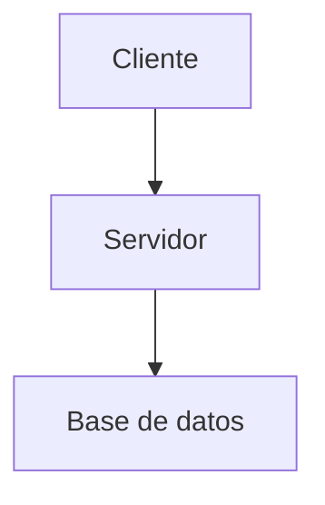
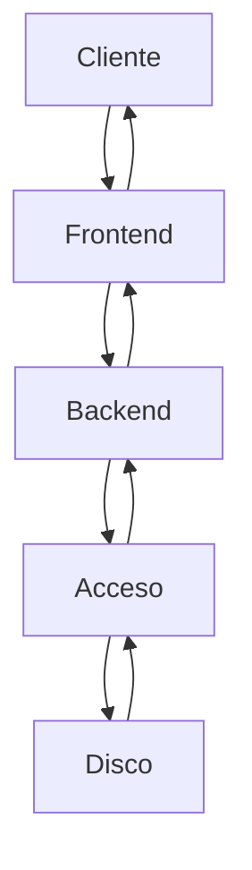

# `references/07-visual/reconstruction.md` — Reconstrucción de diagramas impresos

> **Propósito:** decidir cuándo **reconstruir** un diagrama impreso del SDM en Mermaid/monoespaciado/imagen vs **conservar** la captura original, y cómo marcar la reconstrucción como **derivada** para mantener la trazabilidad (INV-04).
>
> **Cuándo cargar:** el agente encuentra un diagrama impreso (captura, foto, escaneo) en el SDM y debe decidir qué hacer con él: reconstruirlo en Mermaid (F65/F66), en monoespaciado (F69), o conservar la imagen original (F70).

---

## §1 · Propósito y alcance

**Tres caminos posibles ante un diagrama impreso:**

1. **Reconstruir** en Mermaid/monoespaciado/imagen (vectorial, editable, accesible).
2. **Capturar** digitalmente (OCR, escaneo limpio) y conservar como imagen referenciada.
3. **Fotografiar** y conservar como imagen referenciada (último recurso, baja calidad).

**Principio rector (INV-09):** preferir **reconstrucción** cuando sea factible. La imagen vectorial es editable, indexable, accesible y ocupa menos espacio que una captura raster.

**Fuera de alcance:**

- Sintaxis Mermaid portable → `mermaid-portable.md` (F66).
- Tipos de diagrama disponibles → `diagram-catalog.md` (F65).
- Diagramas monoespaciados → `monospace-diagrams.md` (F69).
- Figuras de datos → `make_figure.py` (F70).
- Accesibilidad visual → `accessibility.md` (F71).

---

## §2 · Criterio conceptual

### §2.1 · Las 3 acciones

| Acción | Cuándo | Cómo |
|---|---|---|
| **Reconstruir** | Diagrama con concepto claro y diagramable | Mermaid (F65) o monoespaciado (F69) según §3 de `diagram-catalog.md` |
| **Capturar** | Diagrama físico, póster, slide con tipografía no estándar | Escaneo/OCR + `:::figure src=hash alt=...` con la imagen |
| **Fotografiar** | UI, dashboard, monitor real | Foto + `:::figure src=hash alt=...` con la imagen |

### §2.2 · Preferencia por defecto

Orden de preferencia (de mayor a menor):

1. **Reconstruir en Mermaid portable** (F65/F66) si el concepto es diagramable.
2. **Reconstruir en monoespaciado** (F69) si es tabular o muy simple.
3. **Pre-renderizar como imagen vectorial** (F68) si el destino lo requiere.
4. **Conservar la imagen original** (escaneo/foto) si la reconstrucción es imposible o infactible.

---

## §3 · Matriz de decisión

Tabla cerrada de 8 escenarios. Si el escenario no está aquí, remitir a §2 (criterio conceptual).

| # | Escenario | Acción | Justificación |
|---|---|---|---|
| 1 | Diagrama con ≤15 nodos, concepto claro, sin Unicode | Reconstruir en Mermaid | F65 §6: ≤15 OK; F66 §6: ASCII-safe |
| 2 | Diagrama con >15 nodos pero estructura jerárquica | Reconstruir en Mermaid con subgraphs + partir si >30 | F65 §6.3: partir |
| 3 | Diagrama tabular (tabla de comparación, layout de memoria) | Reconstruir en monoespaciado (F69) | F69 §3: tabular → monoespaciado |
| 4 | Diagrama con tipografía no estándar (matemáticas, símbolos griegos) | Capturar (escaneo limpio) | Reconstruir requiere Unicode que Mermaid no soporta bien |
| 5 | Diagrama impreso (póster, folleto, slide escaneada) | Capturar (escaneo ≥300 DPI) | Reconstruir introduce pérdida de información |
| 6 | Captura de UI (screenshot de app, dashboard) | Fotografiar (screenshot) | UI cambia con el tiempo; reconstrucción especulativa |
| 7 | Diagrama con labels en idioma no soportado por la fuente | Conservar imagen + añadir traducción adyacente en Mermaid | Reconstruir con labels traducidos sin fuente introduce INV-03 (fidelidad) |
| 8 | Diagrama con detalles decorativos (sombras, gradientes, iconos) sin significado semántico | Capturar como imagen + reconstruir versión simplificada adyacente | Reconstrucción completa infactible; simplificación adyacente |

---

## §4 · Procedimiento de reconstrucción (exacta)

5 pasos para reconstruir un diagrama del SDM con fidelidad:

### §4.1 · Paso 1: identificar el concepto

- Leer el SDM alrededor del diagrama impreso.
- Identificar la **idea central** del diagrama (no los detalles visuales).
- Anotar las **entidades** y las **relaciones** entre ellas.

### §4.2 · Paso 2: mapear al tipo Mermaid

- Usar la matriz intención → tipo de F65 §5.
- Si no encaja en Mermaid, considerar monoespaciado (F69) o imagen (F70).
- Verificar que el tipo elegido está en la lista blanca de F66 §3 (WP-1..WP-9).

### §4.3 · Paso 3: redactar el Mermaid

- Seguir las reglas de F66:
  - R-MP-01: etiquetas entrecomilladas (`A["texto"]`).
  - R-MP-02: IDs ASCII; acentos solo en etiquetas.
  - R-MP-03: etiquetas ≤40 chars (o ≤60 con `<br/>`).
  - R-MP-04: `classDef` con tokens, no `style X fill:#hex`.
  - R-MP-05: subgraphs anidados ≤2 niveles.
  - R-MP-06: sin `click`, `linkStyle`, `init` con theme.

### §4.4 · Paso 4: verificar contra el SDM

Checklist de fidelidad (no añadir, no omitir, no contradecir):

- [ ] **No añadir** entidades que no estén en el SDM.
- [ ] **No omitir** entidades que estén en el SDM.
- [ ] **No contradecir** el SDM (e.g., afirmar A→B cuando el SDM dice A←B).
- [ ] **No traducir** labels del SDM sin marcar como derivado (criterio 3 de F71).
- [ ] **Mantener** la numeración/labels originales (e.g., "Table 3.2" si existe en el SDM).

### §4.5 · Paso 5: marcar como derivado

- Añadir `derived="true"` a la directiva `:::diagram`.
- Si hay imagen original, incluir `:::figure src=hash_original` adyacente (ver §6).

---

## §4b · Procedimiento de reconstrucción (aproximada)

Cuando el diagrama es **reconstruible conceptualmente** pero la fidelidad exacta es imposible (e.g., diagrama con etiquetas que no se leen claramente):

1. Seguir §4.1 y §4.2 normalmente.
2. En §4.3, marcar explícitamente las **incertidumbres** con etiquetas genéricas (e.g., `A`, `B`, `C` en lugar de nombres no leídos).
3. En §4.4, documentar la aproximación:
   ```notemark
   :::note
   Reconstrucción aproximada: las etiquetas originales no eran legibles
   en la captura; se han inferido por contexto. Ver imagen original.
   :::
   ```
4. En §4.5, marcar `derived="true"` Y `approximated="true"`.

---

## §5 · Marcado como derivado

### §5.1 · Sintaxis en NoteMark

```notemark
:::diagram src="blk_fig_diagram_001" alt="Diagrama reconstruido del SDM p. 42 (derivado)" derived="true"

:::
```

### §5.2 · Atributos del derivado

| Atributo | Tipo | Significado |
|---|---|---|
| `derived="true"` | bool | El diagrama fue reconstruido del SDM, no es original |
| `derived_from="blk_xxx"` | string (opcional) | Hash del bloque SDM original |
| `approximated="true"` | bool | Reconstrucción aproximada (etiquetas inferidas) |
| `fidelity="exact\|approximate\|lossy"` | string (opcional) | Nivel de fidelidad declarado |

### §5.3 · Equivalente en JSON del IR

```json
{
  "diagram": {
    "block_id": "blk_fig_diagram_001",
    "attrs": {
      "src": "blk_fig_diagram_001",
      "alt": "Diagrama reconstruido del SDM p. 42 (derivado)",
      "derived": true,
      "derived_from": "blk_sdm_042",
      "fidelity": "exact"
    }
  }
}
```

### §5.4 · Validación

El validador de Mermaid (F67, `scripts/validate/mermaid.py`) debe verificar que:

- Si un diagrama tiene `alt` mencionando "derivado", debe tener `derived="true"`.
- Si un diagrama tiene `derived="true"`, debe tener `alt` (criterio R-D-04 + accesibilidad).

---

## §6 · Conservación de la imagen original

### §6.1 · Regla

Toda reconstrucción **debe** conservar la imagen original del SDM adyacente al diagrama reconstruido. Esto satisface el criterio 1 de F71.

### §6.2 · Sintaxis

```notemark
:::figure src="blk_fig_original_hash" alt="Imagen original del SDM p. 42 (captura de pantalla, conservada como referencia)"
:::

:::diagram src="blk_fig_diagram_001" alt="Diagrama reconstruido del SDM p. 42 (derivado)" derived="true" derived_from="blk_fig_original_hash"

:::
```

### §6.3 · Estructura de la nota

Cuando una nota contiene una reconstrucción, sigue esta estructura:

```
:::note title="Reconstrucción de diagrama del SDM p. 42"
Texto explicativo del contexto del SDM, fuente, fecha de captura, etc.
:::

:::figure src="<hash_original>" alt="Imagen original del SDM (conservada como referencia)"
:::

:::diagram src="<hash_reconstruido>" alt="..." derived="true" derived_from="<hash_original>"
```mermaid
...
```
:::

:::note title="Verificación de fidelidad"
Checklist de §4.4 marcado.
:::
```

### §6.4 · Bloque `:::figure`

- `src="blk_xxx"`: hash del bloque raster original (escaneo, foto, screenshot).
- `alt="..."`: descripción obligatoria (F71 accesibilidad).
- El bloque se renderiza con `` en los destinos que aceptan HTML (Obsidian, HTML/PDF).
- En destinos de solo texto (Notion import), el bloque se convierte en `[Imagen: <alt>](<src>)`.

---

## §7 · Verificación contra el SDM (fidelidad)

### §7.1 · Checklist obligatorio

Antes de marcar como derivado, verificar:

| # | Verificación | Resultado |
|---|---|---|
| 1 | Las entidades en el Mermaid coinciden con el SDM | ☐ sí ☐ no |
| 2 | Las relaciones en el Mermaid coinciden con el SDM | ☐ sí ☐ no |
| 3 | Los labels son fieles al SDM (sin traducción no marcada) | ☐ sí ☐ no |
| 4 | La estructura (jerarquía, flujo) refleja el SDM | ☐ sí ☐ no |
| 5 | No hay información añadida que no esté en el SDM | ☐ sí ☐ no |
| 6 | No hay información omitida del SDM | ☐ sí ☐ no |
| 7 | Las convenciones de Mermaid (F66) se respetan | ☐ sí ☐ no |
| 8 | El diagrama está marcado como derivado (`derived="true"`) | ☐ sí ☐ no |
| 9 | La imagen original está enlazada (`derived_from="<hash>"`) | ☐ sí ☐ no |
| 10 | El `alt` describe el diagrama, no la imagen original | ☐ sí ☐ no |

### §7.2 · Violaciones de INV-03 (fidelidad)

Si alguna verificación falla, **no marcar como derivado**. Marcar como `derived="false"` o eliminar la reconstrucción y conservar la imagen original.

---

## §8 · Cuándo NO reconstruir

Lista cerrada de casos donde la reconstrucción NO es apropiada:

1. **Diagramas con tipografía no estándar** (matemáticas complejas, símbolos griegos, caracteres no Unicode): capturar como imagen.
2. **Pósters y folletos físicos**: capturar (escaneo ≥300 DPI).
3. **Screenshots de UI/dashboards**: fotografiar (el UI cambia con el tiempo).
4. **Diagramas con detalles decorativos significativos** (sombras, gradientes, iconos con significado semántico): capturar + versión simplificada adyacente.
5. **Capturas de baja resolución** (<300 DPI): el OCR puede introducir errores; preferir conservar imagen.
6. **Diagramas con anotaciones manuscritas**: capturar (las anotaciones son contenido).
7. **Diagramas con copyright explícito**: consultar la política de fair use; preferir imagen con atribución.

---

## §9 · Bloque de ejemplo completo

```notemark
:::note title="Reconstrucción de diagrama del SDM (PostgreSQL Architecture, p. 42)"
Imagen original conservada como referencia. Reconstrucción en Mermaid portable
siguiendo F65 + F66. Verificación de fidelidad: 10/10 (entidades, relaciones,
labels, estructura, jerarquía coinciden con el SDM).
:::

:::figure src="blk_fig_pg_arch_orig" alt="Imagen original del SDM p. 42: arquitectura del motor PostgreSQL con 5 capas (Cliente, Frontend, Backend, Acceso, Disco) y flujo bidireccional"
:::

:::diagram src="blk_fig_pg_arch_recon" alt="Reconstrucción en Mermaid de la arquitectura PostgreSQL del SDM p. 42: 5 capas con flujo bidireccional (derivado de blk_fig_pg_arch_orig)" derived="true" derived_from="blk_fig_pg_arch_orig"

:::

:::note title="Verificación de fidelidad (F71 §7)"
1. Entidades: ✓ 5 capas coinciden
2. Relaciones: ✓ flujo bidireccional coincide
3. Labels: ✓ verbatim del SDM
4. Estructura: ✓ 5 capas con flujo conectado
5. No añadir: ✓
6. No omitir: ✓
7. F66 convenciones: ✓ etiquetas ASCII-safe
8. Marcado derivado: ✓ derived=true
9. Imagen original enlazada: ✓ derived_from
10. Alt describe el diagrama: ✓
:::
```

---

## §10 · Tabla resumen decisión rápida

| Tipo de diagrama en SDM | Acción preferida | Marca `derived` |
|---|---|---|
| Diagrama con concepto claro (≤15 nodos) | Reconstruir en Mermaid | sí |
| Diagrama tabular / layout memoria | Reconstruir en monoespaciado | sí |
| Diagrama con >15 nodos | Partir + reconstruir | sí |
| Captura de UI/dashboard | Fotografiar (screenshot) | no (es la imagen original) |
| Póster / folleto / slide escaneada | Capturar (escaneo ≥300 DPI) | no |
| Diagrama con tipografía no estándar | Capturar | no |
| Diagrama con detalles decorativos | Capturar + simplificar adyacente | sí (la simplificación) |

---

## §11 · Cambios permitidos

**Modificaciones libres (sin reabrir la fase):**

1. Añadir **filas** a la matriz §3 o a la tabla §10.
2. Añadir **atributos** al esquema de §5 (e.g., `confidence="0.95"`).
3. Añadir **patrones** a §8 (cuándo NO reconstruir).
4. Añadir **plantillas** de `:::note` con diferentes formatos de verificación.

**Reabrir la fase si:**

- Se cambia el conjunto de atributos del derivado.
- Se reduce el conjunto de escenarios cubiertos por la matriz §3.
- Se elimina el requisito de conservar la imagen original.

---

## §12 · Wirings

- **F65** `diagram-catalog.md`: provee la matriz intención → tipo Mermaid (referencia §4.2).
- **F66** `mermaid-portable.md`: provee las reglas R-MP-01..R-MP-06 que la reconstrucción debe respetar.
- **F67** `scripts/validate/mermaid.py`: regla L-06 verifica que `alt` no esté vacío; nueva verificación recomendada: si `alt` menciona "derivado", entonces `derived="true"` debe estar presente.
- **F68** `scripts/render/diagram_image.py`: pre-renderizado a SVG/PNG; alternativa cuando la reconstrucción Mermaid no es factible.
- **F69** `monospace-diagrams.md`: alternativa para reconstrucciones tabulares o layout de memoria.
- **F70** `scripts/render/make_figure.py`: pre-renderizado de figuras de datos.
- **F72** `tokens.md` (pendiente): provee la paleta de colores canónica; la reconstrucción usa los tokens para `classDef` y `style`.

---

**Verificación al cierre de la fase:**

- `wc -l reconstruction.md` ≤ 700 líneas.
- §3 matriz de decisión con 8 escenarios × 3 acciones.
- §4 procedimiento con 5 pasos verificables.
- §5 sintaxis del marcado como derivado con ejemplo completo.
- §6 bloque de conservación con sintaxis `:::figure src=hash`.
- §7 checklist de fidelidad con 10 puntos.
- §8 lista cerrada de "cuándo NO reconstruir" con 7 casos.
- §9 bloque de ejemplo completo (nota + figure + diagram + note de verificación).
